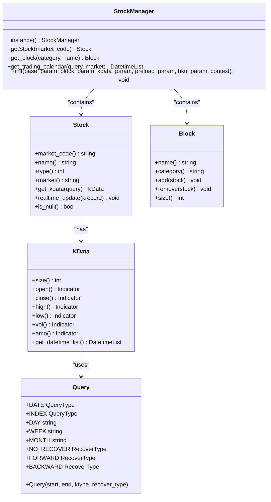
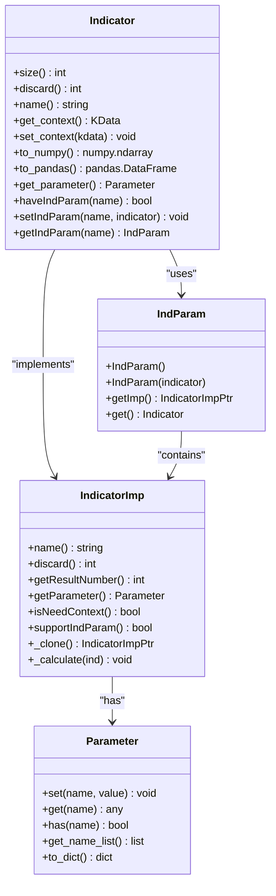
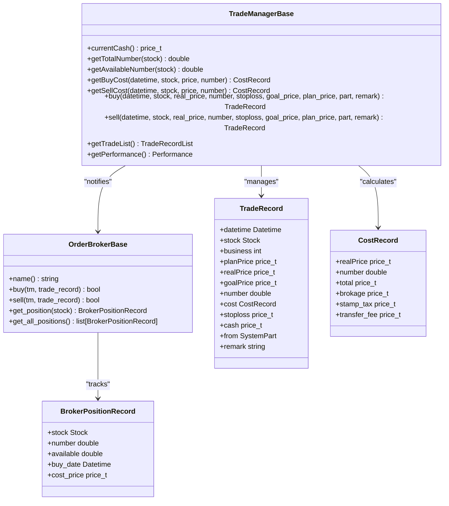
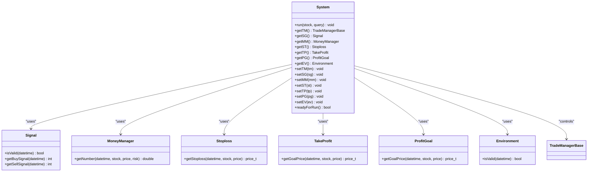
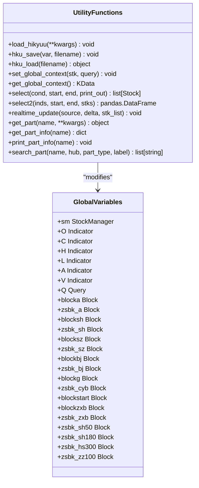
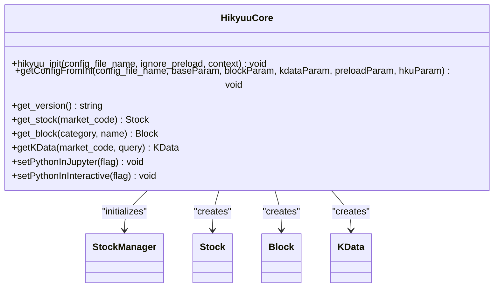
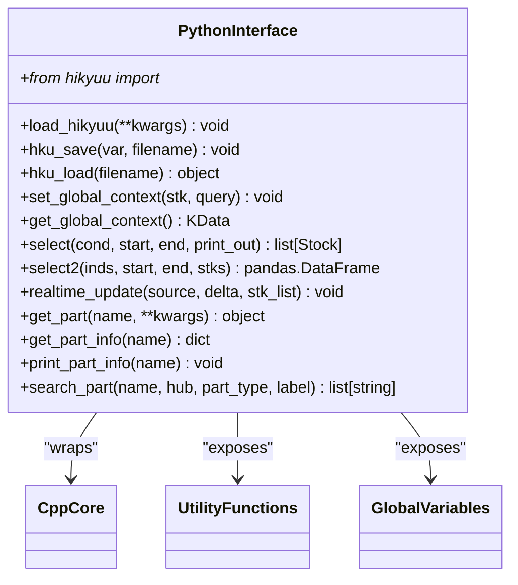

# API Reference

<cite>
**Referenced Files in This Document**   
- [__init__.py](file://hikyuu/__init__.py)
- [core.py](file://hikyuu/core.py)
- [extend.py](file://hikyuu/extend.py)
- [hub.py](file://hikyuu/hub.py)
- [interactive.py](file://hikyuu/interactive.py)
- [indicator.py](file://hikyuu/indicator/indicator.py)
- [main.cpp](file://hikyuu_pywrap/main.cpp)
- [hikyuu.h](file://hikyuu_cpp/hikyuu/hikyuu.h)
- [Indicator.h](file://hikyuu_cpp/hikyuu/indicator/Indicator.h)
- [IndicatorImp.h](file://hikyuu_cpp/hikyuu/indicator/IndicatorImp.h)
- [IndParam.h](file://hikyuu_cpp/hikyuu/indicator/IndParam.h)
- [OrderBrokerBase.h](file://hikyuu_cpp/hikyuu/trade_manage/OrderBrokerBase.h)
- [BrokerTradeManager.cpp](file://hikyuu_cpp/hikyuu/strategy/BrokerTradeManager.cpp)
- [_IndicatorImp.cpp](file://hikyuu_pywrap/indicator/_IndicatorImp.cpp)
- [_TradeManager.cpp](file://hikyuu_pywrap/trade_manage/_TradeManager.cpp)
</cite>

## Table of Contents
1. [Introduction](#introduction)
2. [Data Management](#data-management)
3. [Indicators](#indicators)
4. [Trading Components](#trading-components)
5. [Backtesting](#backtesting)
6. [Utility Functions](#utility-functions)
7. [C++ Core API](#c-core-api)
8. [Python Interface](#python-interface)

## Introduction
The Hikyuu framework is a comprehensive quantitative trading system that provides tools for financial data management, technical indicator calculation, trading strategy development, and backtesting. This API reference documents the public interfaces exposed by both the C++ core and Python interface, organized by functional areas. The framework follows an object-oriented design with clear separation of concerns between data management, analysis components, and trading systems.

The framework's architecture is built around several key components:
- **StockManager**: Central repository for all stock and market data
- **Indicator System**: Comprehensive technical analysis engine with over 100 built-in indicators
- **Trading System**: Modular backtesting framework with configurable components
- **Data Drivers**: Flexible data access layer supporting multiple storage backends

The Python interface provides a high-level, user-friendly API that wraps the high-performance C++ core, allowing for both rapid prototyping and production-grade quantitative analysis.

## Data Management

The data management system in Hikyuu provides comprehensive functionality for accessing and manipulating financial market data. The core component is the StockManager, which serves as the central repository for all stock and market information.

**Diagram sources**
- [__init__.py](file://hikyuu/__init__.py#L85)
- [core.py](file://hikyuu/core.py#L1)
- [main.cpp](file://hikyuu_pywrap/main.cpp#L99)
- [hikyuu.h](file://hikyuu_cpp/hikyuu/hikyuu.h#L14)

**Section sources**
- [__init__.py](file://hikyuu/__init__.py#L85)
- [core.py](file://hikyuu/core.py#L1)
- [main.cpp](file://hikyuu_pywrap/main.cpp#L99)

## Indicators

The indicator system in Hikyuu provides a comprehensive set of technical analysis tools for financial market analysis. Indicators are implemented as C++ classes wrapped with Python interfaces, providing high-performance calculations with a user-friendly API.

**Diagram sources**
- [indicator.py](file://hikyuu/indicator/indicator.py#L32)
- [Indicator.h](file://hikyuu_cpp/hikyuu/indicator/Indicator.h#L1)
- [IndicatorImp.h](file://hikyuu_cpp/hikyuu/indicator/IndicatorImp.h#L1)
- [IndParam.h](file://hikyuu_cpp/hikyuu/indicator/IndParam.h#L1)
- [extend.py](file://hikyuu/extend.py#L259)

## Trading Components

The trading components in Hikyuu provide a modular framework for implementing trading strategies and managing trade execution. The system is designed with a component-based architecture that allows for flexible strategy construction.

**Diagram sources**
- [BrokerTradeManager.cpp](file://hikyuu_cpp/hikyuu/strategy/BrokerTradeManager.cpp#L109)
- [OrderBrokerBase.h](file://hikyuu_cpp/hikyuu/trade_manage/OrderBrokerBase.h#L31)
- [_TradeManager.cpp](file://hikyuu_pywrap/trade_manage/_TradeManager.cpp#L509)

## Backtesting

The backtesting system in Hikyuu provides a comprehensive framework for evaluating trading strategies. The system is designed with a modular architecture that allows for flexible strategy construction and evaluation.

**Diagram sources**
- [trade_sys/__init__.py](file://hikyuu/trade_sys/__init__.py#L28)
- [trade_manage/__init__.py](file://hikyuu/trade_manage/__init__.py#L27)

## Utility Functions

Hikyuu provides a comprehensive set of utility functions for common tasks in quantitative analysis. These functions are designed to simplify common operations and provide a consistent interface across the framework.

**Diagram sources**
- [__init__.py](file://hikyuu/__init__.py#L219)
- [hub.py](file://hikyuu/hub.py#L646)
- [interactive.py](file://hikyuu/interactive.py#L27)

## C++ Core API

The C++ core of Hikyuu provides high-performance implementations of all framework components. The API is designed with a focus on performance and memory efficiency, while providing a clean, object-oriented interface.

**Diagram sources**
- [hikyuu.h](file://hikyuu_cpp/hikyuu/hikyuu.h#L35)
- [main.cpp](file://hikyuu_pywrap/main.cpp#L131)

## Python Interface

The Python interface for Hikyuu provides a high-level, user-friendly API that wraps the high-performance C++ core. The interface is designed to be intuitive and easy to use, while providing access to all the functionality of the underlying C++ implementation.

**Diagram sources**
- [__init__.py](file://hikyuu/__init__.py#L53)
- [core.py](file://hikyuu/core.py#L9)
- [extend.py](file://hikyuu/extend.py#L6)
- [hub.py](file://hikyuu/hub.py#L739)