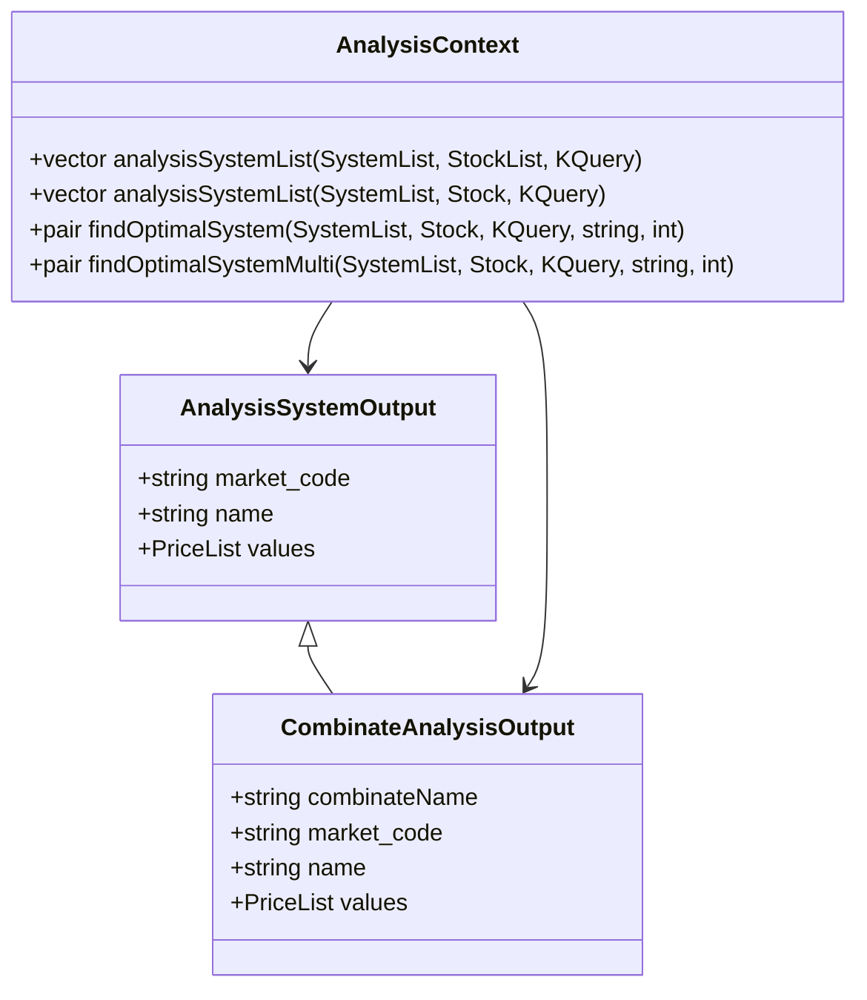
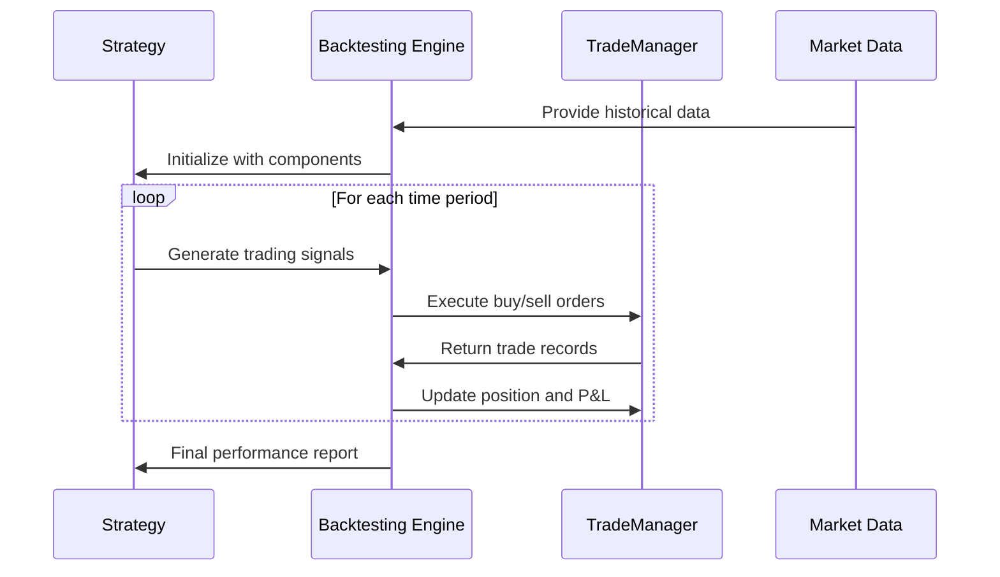
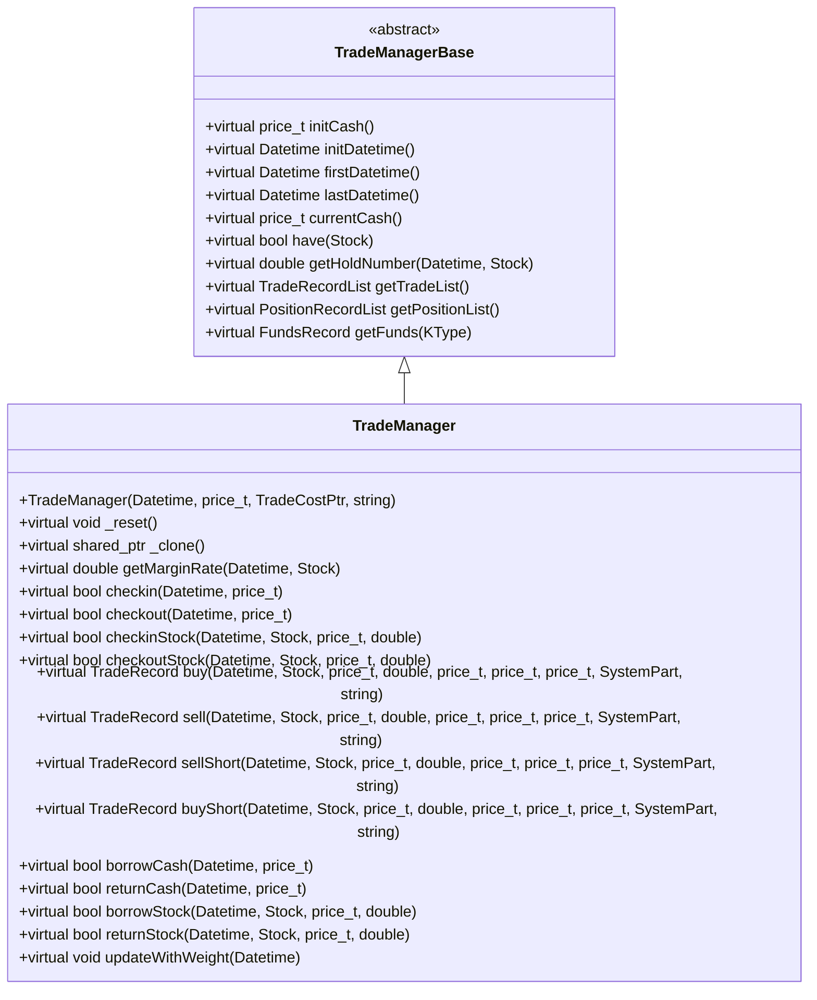
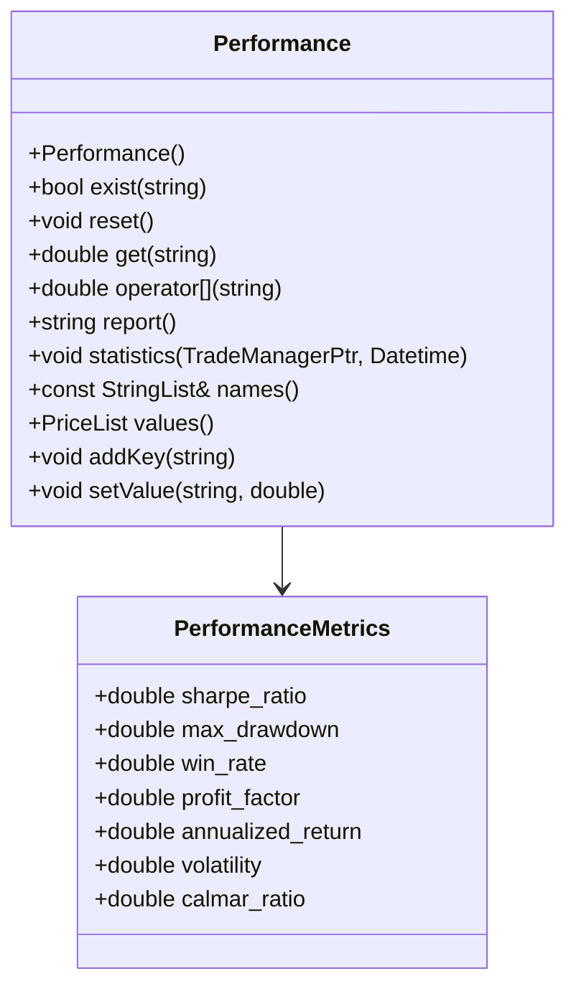
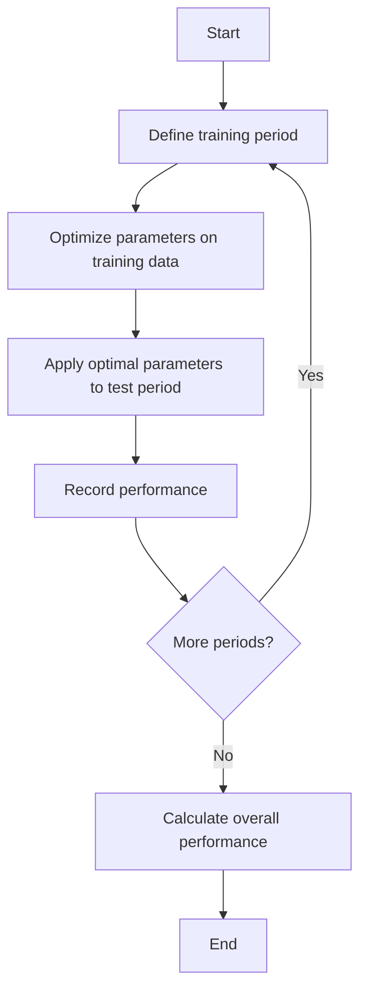

# Backtesting Framework

<cite>
**Referenced Files in This Document**   
- [analysis_sys.h](file://hikyuu_cpp/hikyuu/analysis/analysis_sys.h)
- [combinate.h](file://hikyuu_cpp/hikyuu/analysis/combinate.h)
- [TradeManager.h](file://hikyuu_cpp/hikyuu/trade_manage/TradeManager.h)
- [Performance.h](file://hikyuu_cpp/hikyuu/trade_manage/Performance.h)
- [System.h](file://hikyuu_cpp/hikyuu/trade_sys/system/System.h)
- [WalkForwardSystem.cpp](file://hikyuu_cpp/hikyuu/trade_sys/system/imp/WalkForwardSystem.cpp)
- [Turtle_SG.py](file://hikyuu/examples/Turtle_SG.py)
- [007-SystemDetails.ipynb](file://hikyuu/examples/notebook/007-SystemDetails.ipynb)
</cite>

## Table of Contents
1. [Introduction](#introduction)
2. [Analysis System Classes](#analysis-system-classes)
3. [Backtesting Execution Engine](#backtesting-execution-engine)
4. [TradeManager Class](#trademanager-class)
5. [Performance Analysis System](#performance-analysis-system)
6. [Backtesting Examples](#backtesting-examples)
7. [Event Handling](#event-handling)
8. [Performance Considerations](#performance-considerations)

## Introduction
The Hikyuu backtesting framework provides a comprehensive system for evaluating trading strategies through historical data simulation. This documentation details the core components of the framework, including the analysis system classes, backtesting execution engine, TradeManager class for position tracking, and the performance analysis system. The framework supports both C++ and Python interfaces, enabling users to set up and run backtests with parameter optimization and walk-forward analysis. The system models trade execution, calculates performance metrics, and handles corporate actions such as dividends and stock splits.

## Analysis System Classes
The analysis system in Hikyuu is built around the AnalysisContext and combinate functions for strategy evaluation. The framework provides functions to analyze multiple system strategies against specified securities and find optimal systems based on performance metrics. The analysis system supports parallel execution for efficient processing of multiple strategies.

The core analysis functions include:
- `analysisSystemList`: Analyzes a list of system strategies against corresponding securities
- `findOptimalSystem`: Identifies the optimal system from a list based on a specified performance metric
- `findOptimalSystemMulti`: Parallel version of findOptimalSystem for improved performance

These functions enable comprehensive strategy evaluation by running each system strategy on historical data and calculating performance metrics for comparison. The analysis system is designed to work with the TradeManager class to track positions and calculate P&L during backtesting.



**Diagram sources**
- [analysis_sys.h](file://hikyuu_cpp/hikyuu/analysis/analysis_sys.h)

**Section sources**
- [analysis_sys.h](file://hikyuu_cpp/hikyuu/analysis/analysis_sys.h)
- [analysis_sys.cpp](file://hikyuu_cpp/hikyuu/analysis/analysis_sys.cpp)

## Backtesting Execution Engine
The backtesting execution engine in Hikyuu simulates trades by processing historical market data and executing trading signals according to the defined strategy. The engine models order execution with configurable slippage algorithms and handles various trade types including long positions, short selling, and margin trading.

The execution process follows these steps:
1. Load historical market data for the specified security
2. Initialize the trading system with the strategy components (signal generator, money manager, etc.)
3. Process each time period in sequence, checking for trading signals
4. Execute trades based on signals, updating the TradeManager state
5. Calculate performance metrics at each time step

The engine supports different execution modes, including "delay" mode where trades are executed at the next period's open price. This allows for more realistic simulation of trading strategies that use end-of-period signals.



**Diagram sources**
- [System.h](file://hikyuu_cpp/hikyuu/trade_sys/system/System.h)
- [TradeManager.h](file://hikyuu_cpp/hikyuu/trade_manage/TradeManager.h)

**Section sources**
- [System.h](file://hikyuu_cpp/hikyuu/trade_sys/system/System.h)
- [System.cpp](file://hikyuu_cpp/hikyuu/trade_sys/system/System.cpp)

## TradeManager Class
The TradeManager class is central to the backtesting framework, responsible for tracking positions, calculating P&L, and managing trade records. It maintains a complete record of all transactions and current holdings, providing methods to query account status and performance.

Key features of the TradeManager class include:
- Position tracking for both long and short positions
- Cash flow management with support for deposits and withdrawals
- P&L calculation based on realized and unrealized gains
- Support for margin trading and short selling
- Trade record management with detailed transaction history

The TradeManager provides methods for various transaction types:
- `buy`: Execute a buy order at the specified price and quantity
- `sell`: Execute a sell order at the specified price and quantity
- `sellShort`: Execute a short sell order
- `buyShort`: Cover a short position
- `checkin`/`checkout`: Deposit or withdraw cash from the account



**Diagram sources**
- [TradeManager.h](file://hikyuu_cpp/hikyuu/trade_manage/TradeManager.h)

**Section sources**
- [TradeManager.h](file://hikyuu_cpp/hikyuu/trade_manage/TradeManager.h)
- [TradeManager.cpp](file://hikyuu_cpp/hikyuu/trade_manage/TradeManager.cpp)

## Performance Analysis System
The performance analysis system in Hikyuu calculates a comprehensive set of metrics to evaluate trading strategy performance. The Performance class processes trade records from the TradeManager and computes various statistical measures.

Available performance metrics include:
- **Sharpe ratio**: Risk-adjusted return measure
- **Maximum drawdown**: Largest peak-to-trough decline
- **Win rate**: Percentage of profitable trades
- **Profit factor**: Ratio of gross profits to gross losses
- **Annualized return**: Compound annual growth rate
- **Volatility**: Standard deviation of returns
- **Calmar ratio**: Return to maximum drawdown ratio

The performance analysis system can generate reports at any point during or after the backtest, allowing for both real-time monitoring and post-analysis evaluation. The metrics are calculated based on the complete trade history and current market prices.



**Diagram sources**
- [Performance.h](file://hikyuu_cpp/hikyuu/trade_manage/Performance.h)

**Section sources**
- [Performance.h](file://hikyuu_cpp/hikyuu/trade_manage/Performance.h)
- [Performance.cpp](file://hikyuu_cpp/hikyuu/trade_manage/Performance.cpp)

## Backtesting Examples
This section provides detailed examples showing how to set up and run backtests in both C++ and Python, including parameter optimization and walk-forward analysis.

### Python Example: Turtle Trading System
```python
from hikyuu.interactive import *

# Create a trading account with initial capital of 200,000
my_tm = crtTM(Datetime(200101010000), 200000)

# Create a simple system
my_sys = SYS_Simple(tm=my_tm)

# Define the Turtle trading signal
def TurtleSG(self, k):
    n1 = self.get_param("n1")
    n2 = self.get_param("n2")
    c = CLOSE(k)
    h = REF(HHV(c, n1), 1)  # High of previous n1 days
    L = REF(LLV(c, n2), 1)  # Low of previous n2 days
    for i in range(h.discard, len(k)):
        if (c[i] >= h[i]):
            self._add_buy_signal(k[i].datetime)
        elif (c[i] <= L[i]):
            self._add_sell_signal(k[i].datetime)

# Create the signal generator
my_sg = crtSG(TurtleSG, {'n1': 20, 'n2': 10}, 'TurtleSG')

# Set money management to do nothing
my_mm = MM_Nothing()

# Run the backtest
s = sm['sz000001']
query = Query(Datetime(200101010000), Datetime(201705010000))
my_sys.mm = my_mm
my_sys.sg = my_sg
my_sys.run(s, query)
```

### C++ Example: Walk-Forward Analysis
```cpp
#include <hikyuu/trade_sys/system/crt/SYS_WalkForward.h>
#include <hikyuu/trade_manage/crt/crtTM.h>

// Create candidate systems
SystemList candidate_sys_list;
candidate_sys_list.push_back(create_test_sys(3, 5));
candidate_sys_list.push_back(create_test_sys(5, 10));

// Create trading account
TradeManagerPtr tm = crtTM();

// Create walk-forward system
auto sys = SYS_WalkForward(candidate_sys_list, tm, 30, 20);

// Run backtest
Stock stk = getStock("sz000001");
KQuery query = KQueryByIndex(-125);
sys->run(stk, query);
```

### Parameter Optimization
The framework supports parameter optimization through the combinate functions. These functions allow testing multiple parameter combinations to find optimal settings:

```python
# Test different parameter combinations
buy_inds = [IND1, IND2, IND3]
sell_inds = [IND4, IND5]
results = combinateIndicatorAnalysis(stk, query, tm, sys, buy_inds, sell_inds, n=10)

# Find the optimal system based on Sharpe ratio
optimal_result = findOptimalSystemMulti(system_list, stk, query, "Sharpe Ratio", 0)
```

**Section sources**
- [Turtle_SG.py](file://hikyuu/examples/Turtle_SG.py)
- [007-SystemDetails.ipynb](file://hikyuu/examples/notebook/007-SystemDetails.ipynb)

## Event Handling
The backtesting framework handles corporate actions such as dividends and stock splits through the updateWithWeight method in the TradeManager class. When corporate actions occur, the system adjusts the position records and trade history to reflect the changes.

For dividends:
- Cash dividends are credited to the account
- Stock dividends increase the position quantity
- The cost basis is adjusted accordingly

For stock splits:
- Position quantities are adjusted by the split ratio
- Cost basis per share is adjusted by the inverse split ratio
- All historical trade records are updated

The event handling ensures that performance calculations remain accurate after corporate actions. The system processes these events in chronological order to maintain consistency in the account state.

**Section sources**
- [TradeManager.h](file://hikyuu_cpp/hikyuu/trade_manage/TradeManager.h)
- [TradeManager.cpp](file://hikyuu_cpp/hikyuu/trade_manage/TradeManager.cpp)

## Performance Considerations
When conducting large-scale backtesting, several performance considerations should be addressed:

### Memory Usage
- The framework loads historical data into memory for fast access
- Trade records and position history are stored in memory during backtesting
- For large datasets, consider using data chunking or streaming

### Optimization Strategies
- Use parallel processing for analyzing multiple strategies
- Limit the historical data range to the minimum necessary
- Use efficient data structures for indicator calculations

### Walk-Forward Analysis
The WalkForwardSystem class implements walk-forward analysis, which combines in-sample optimization with out-of-sample testing:



This approach helps prevent overfitting by validating strategy performance on unseen data. The walk-forward analysis can be configured with different training and test period lengths.

**Section sources**
- [WalkForwardSystem.cpp](file://hikyuu_cpp/hikyuu/trade_sys/system/imp/WalkForwardSystem.cpp)