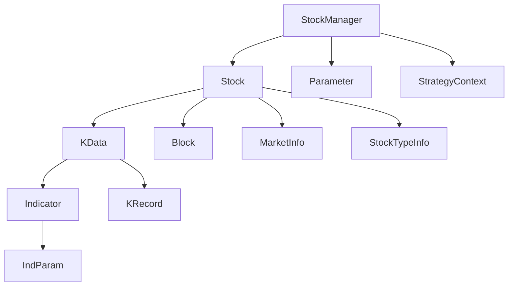

# Core Classes

<cite>
**Referenced Files in This Document**   
- [Stock.h](file://hikyuu_cpp/hikyuu/Stock.h)
- [KData.h](file://hikyuu_cpp/hikyuu/KData.h)
- [Indicator.h](file://hikyuu_cpp/hikyuu/indicator/Indicator.h)
- [StockManager.h](file://hikyuu_cpp/hikyuu/StockManager.h)
- [\_Stock.cpp](file://hikyuu_pywrap/_Stock.cpp)
- [\_KData.cpp](file://hikyuu_pywrap/_KData.cpp)
- [\_Indicator.cpp](file://hikyuu_pywrap/indicator/_Indicator.cpp)
</cite>

## Table of Contents
1. [Introduction](#introduction)
2. [Stock Class](#stock-class)
3. [KData Class](#kdata-class)
4. [Indicator Class](#indicator-class)
5. [StockManager Class](#stockmanager-class)
6. [Class Relationships](#class-relationships)
7. [Memory Management and Performance](#memory-management-and-performance)
8. [Practical Examples](#practical-examples)

## Introduction
This document provides comprehensive API documentation for the core data classes in the Hikyuu framework. The Hikyuu framework is designed for quantitative financial analysis and trading system development, with a focus on market data handling, technical indicators, and backtesting. The core classes documented here form the foundation of the framework's data model and processing capabilities.

The primary classes covered are Stock, KData, and Indicator, which represent the fundamental entities for market data analysis. The Stock class serves as the basic market entity, representing individual securities with their metadata and market information. The KData class provides time-series data structures for different types of market data, including various K-line types. The Indicator class defines the base interface for technical indicators and their operations on market data.

These classes work together through the StockManager, which acts as a central repository and factory for Stock objects. The framework supports both C++ and Python interfaces, with the Python interface providing a more user-friendly experience while maintaining the performance benefits of the underlying C++ implementation.

**Section sources**
- [Stock.h](file://hikyuu_cpp/hikyuu/Stock.h#L1-L380)
- [KData.h](file://hikyuu_cpp/hikyuu/KData.h#L1-L346)
- [Indicator.h](file://hikyuu_cpp/hikyuu/indicator/Indicator.h#L1-L488)

## Stock Class

The Stock class represents the fundamental market entity in the Hikyuu framework, serving as the primary container for security information and market data access. Each Stock instance encapsulates metadata about a specific security, including its symbol, name, type, and market information, while also providing methods to access historical data and related information.

### Member Variables and Properties
The Stock class contains several key member variables that define the characteristics of a security:

- **market**: The market identifier (e.g., "SH" for Shanghai, "SZ" for Shenzhen)
- **code**: The security code (e.g., "000001")
- **name**: The security name (e.g., "Ping An Bank")
- **type**: The security type (e.g., stock, index, fund)
- **valid**: Boolean indicating if the security is currently active
- **startDatetime**: The date when trading began for this security
- **lastDatetime**: The most recent trading date
- **tick**: The minimum price movement
- **tickValue**: The value of the minimum price movement
- **precision**: The number of decimal places for price
- **minTradeNumber**: The minimum trading quantity
- **maxTradeNumber**: The maximum trading quantity

These properties are accessible through getter and setter methods, allowing for both retrieval and modification of the security's characteristics.

### Methods
The Stock class provides a comprehensive set of methods for data access and manipulation:

- **getKData(const KQuery& query)**: Retrieves K-line data based on the specified query parameters
- **getWeight(const Datetime& start, const Datetime& end)**: Gets dividend and rights information within the specified date range
- **getCount(KQuery::KType dataType)**: Returns the number of records for the specified K-line type
- **getMarketValue(const Datetime&, KQuery::KType)**: Gets the market value (closing price) at the specified date
- **getKRecord(size_t pos, const KQuery::KType& kType)**: Retrieves a specific K-line record by position
- **getKRecord(const Datetime&, const KQuery::KType& ktype)**: Retrieves a K-line record by date
- **getIndexRange(const KQuery& query, size_t& out_start, size_t& out_end)**: Gets the index range for K-line data matching the query
- **getDatetimeList(const KQuery& query)**: Gets the list of dates for K-line data matching the query
- **getTimeLineList(const KQuery& query)**: Retrieves intraday time-series data
- **getTransList(const KQuery& query)**: Gets transaction-level data
- **getFinanceInfo()**: Retrieves current financial information
- **getBelongToBlockList(const string& category)**: Gets the list of blocks (sectors) the stock belongs to
- **getHistoryFinance()**: Retrieves historical financial information
- **getTradingCalendar(const KQuery& query)**: Gets the trading calendar for the stock's market
- **isTransactionTime(Datetime time)**: Determines if the specified time falls within trading hours
- **setKDataDriver(const KDataDriverConnectPoolPtr& kdataDriver)**: Sets the K-line data driver
- **getKDataDirver()**: Gets the K-line data driver
- **loadKDataToBuffer(KQuery::KType)**: Loads K-line data into memory cache
- **releaseKDataBuffer(KQuery::KType)**: Releases the specified K-line data from memory cache
- **isBuffer(KQuery::KType)**: Checks if the specified K-line type is cached in memory
- **isPreload(KQuery::KType ktype)**: Checks if the specified K-line type is preloaded
- **isNull()**: Checks if the Stock instance is null
- **realtimeUpdate(KRecord, const KQuery::KType& ktype)**: Updates the cached K-line data with a new record
- **getLastUpdateTime(const KQuery::KType& ktype)**: Gets the last update time for the specified K-line type
- **setKRecordList(const KRecordList& ks, const KQuery::KType& ktype)**: Sets the K-line record list (for temporary stocks)

**Section sources**
- [Stock.h](file://hikyuu_cpp/hikyuu/Stock.h#L1-L380)
- [_Stock.cpp](file://hikyuu_pywrap/_Stock.cpp#L1-L200)

## KData Class

The KData class represents time-series market data in the Hikyuu framework, specifically designed to handle various types of K-line data. It serves as a container for K-line records and provides methods for data access, manipulation, and conversion to technical indicators.

### K-line Types
The KData class supports multiple types of K-line data through the KQuery::KType enumeration:

- **DAY**: Daily K-line data
- **WEEK**: Weekly K-line data
- **MONTH**: Monthly K-line data
- **MIN**: Minute-level K-line data
- **MIN5**: 5-minute K-line data
- **MIN15**: 15-minute K-line data
- **MIN30**: 30-minute K-line data
- **MIN60**: 60-minute K-line data
- **TICK**: Tick-level data (individual transactions)

### Data Structure
The KData class is built around the KRecord structure, which contains the following fields for each time period:

- **datetime**: The timestamp of the K-line
- **open**: Opening price
- **high**: Highest price
- **low**: Lowest price
- **close**: Closing price
- **volume**: Trading volume
- **amount**: Trading value (amount)

### Methods
The KData class provides extensive methods for data access and manipulation:

- **size()**: Returns the number of K-line records
- **empty()**: Checks if the KData is empty
- **getKRecord(size_t pos)**: Gets the K-line record at the specified position
- **getKRecord(Datetime datetime)**: Gets the K-line record for the specified datetime
- **getDatetimeList()**: Gets the list of datetimes for all K-line records
- **getPos(const Datetime& datetime)**: Gets the position of the specified datetime in the KData
- **getPosInStock(Datetime datetime)**: Gets the position in the original Stock's K-line records
- **getQuery()**: Gets the associated KQuery that generated this KData
- **getStock()**: Gets the associated Stock object
- **startPos()**: Gets the starting position in the original K-line records
- **lastPos()**: Gets the last position in the original K-line records
- **endPos()**: Gets the ending position in the original K-line records
- **getKData(const Datetime& start, const Datetime& end)**: Gets a subset of KData for the specified date range
- **getKData(const KQuery::KType& ktype)**: Gets KData of a different type for the same time range
- **getKData(int64_t start, int64_t end)**: Gets a subset of KData by index range
- **tocsv(const string& filename)**: Exports the KData to a CSV file
- **open()**: Returns an Indicator containing the opening prices
- **high()**: Returns an Indicator containing the highest prices
- **close()**: Returns an Indicator containing the closing prices
- **low()**: Returns an Indicator containing the lowest prices
- **vol()**: Returns an Indicator containing the volume data
- **amo()**: Returns an Indicator containing the amount data

The class also provides iterator support for traversing K-line records and supports various operators for comparison and assignment.

**Section sources**
- [KData.h](file://hikyuu_cpp/hikyuu/KData.h#L1-L346)
- [_KData.cpp](file://hikyuu_pywrap/_KData.cpp#L1-L200)

## Indicator Class

The Indicator class serves as the base interface for technical indicators in the Hikyuu framework. It provides a standardized way to calculate, manipulate, and combine technical indicators, enabling complex analysis and strategy development.

### Base Interface
The Indicator class defines a comprehensive interface for technical indicators, including:

- **name()**: Gets the indicator name
- **long_name()**: Gets the full indicator name with parameters
- **clone()**: Creates a copy of the indicator
- **setContext(const Stock&, const KQuery&)**: Sets the context (stock and query) for the indicator
- **setContext(const KData&)**: Sets the context using KData
- **getContext()**: Gets the current context
- **formula()**: Gets the indicator formula as a string
- **discard()**: Gets the number of initial values to discard
- **setDiscard(size_t discard)**: Sets the number of initial values to discard
- **getResultNumber()**: Gets the number of result sets
- **empty()**: Checks if the indicator is empty
- **size()**: Gets the number of values in the indicator
- **get(size_t pos, size_t num = 0)**: Gets a value at the specified position
- **front(size_t num = 0)**: Gets the first value
- **back(size_t num = 0)**: Gets the last value
- **getDatetime(size_t pos)**: Gets the datetime for the specified position
- **getByDate(Datetime date, size_t num = 0)**: Gets a value for the specified date
- **getPos(Datetime)**: Gets the position for the specified date
- **getResult(size_t num)**: Gets a specific result set as an Indicator
- **getResultAsPriceList(size_t num)**: Gets a specific result set as a PriceList
- **existNan(size_t result_idx)**: Checks if the result set contains NaN values
- **getDatetimeList()**: Gets the list of datetimes for the indicator values
- **alike(const Indicator& other)**: Checks if another indicator is equivalent
- **haveParam(const string& name)**: Checks if a parameter exists
- **setParam(const string& name, const ValueType& value)**: Sets a parameter value
- **getParam(const string& name)**: Gets a parameter value
- **supportIndParam()**: Checks if the indicator supports dynamic indicator parameters
- **haveIndParam(const string& name)**: Checks if a dynamic indicator parameter exists
- **setIndParam(const string& name, const Indicator& ind)**: Sets a dynamic indicator parameter
- **getIndParam(const string& name)**: Gets a dynamic indicator parameter
- **getImp()**: Gets the implementation pointer
- **equal(const Indicator& other)**: Compares two indicators for equality
- **isSame(const Indicator& other)**: Checks if two indicators are the same instance
- **contains(const string& name)**: Checks if the indicator formula contains a specific indicator name

### Calculation Methods
The Indicator class supports various calculation methods and operations:

- **operator()**: Function call operator for creating new instances with parameters
- **operator+**: Addition of indicators or indicator and value
- **operator-**: Subtraction of indicators or indicator and value
- **operator***: Multiplication of indicators or indicator and value
- **operator/**: Division of indicators or indicator and value
- **operator%**: Modulo operation on indicators or indicator and value
- **operator==**: Equality comparison of indicators or indicator and value
- **operator!=**: Inequality comparison of indicators or indicator and value
- **operator>**: Greater than comparison of indicators or indicator and value
- **operator<**: Less than comparison of indicators or indicator and value
- **operator>=**: Greater than or equal comparison of indicators or indicator and value
- **operator<=**: Less than or equal comparison of indicators or indicator and value
- **operator&**: Logical AND of indicators or indicator and value
- **operator|**: Logical OR of indicators or indicator and value

The class also provides specialized functions for combining and conditional operations:

- **WEAVE(const Indicator& ind1, const Indicator& ind2)**: Combines two indicators into a single indicator with multiple result sets
- **IF(const Indicator& x, const Indicator& a, const Indicator& b)**: Conditional function that returns 'a' if 'x' is non-zero, otherwise returns 'b'

**Section sources**
- [Indicator.h](file://hikyuu_cpp/hikyuu/indicator/Indicator.h#L1-L488)
- [_Indicator.cpp](file://hikyuu_pywrap/indicator/_Indicator.cpp#L1-L200)

## StockManager Class

The StockManager class serves as the central repository and factory for Stock objects in the Hikyuu framework. It manages the lifecycle of Stock instances, handles data loading, and provides access to market-wide information.

### Singleton Pattern
The StockManager follows the singleton pattern, ensuring that only one instance exists throughout the application:

- **instance()**: Static method to get the singleton instance
- **init()**: Initializes the StockManager with various parameters
- **quit()**: Quits and releases resources

### Data Management
The StockManager handles the loading and management of various types of financial data:

- **getStock(const string& querystr)**: Gets a Stock instance by market code (e.g., "sh000001")
- **getStockList()**: Gets a list of Stock instances, optionally filtered by a function
- **getMarketInfo(const string& market)**: Gets market information for the specified market
- **getMarketStock(const string& market)**: Gets the representative index stock for the specified market
- **getStockTypeInfo(uint32_t type)**: Gets detailed information about a specific stock type
- **getStockTypeInfoList()**: Gets a list of all stock type information
- **getAllMarket()**: Gets a list of all market identifiers
- **getAllCategory()**: Gets a list of all block categories
- **getBlock(const string& category, const string& name)**: Gets a predefined block by category and name
- **saveBlock(const Block& blk)**: Saves a block definition
- **removeBlock(const string& category, const string& name)**: Removes a block definition
- **getBlockList(const string& category)**: Gets a list of blocks for the specified category
- **getBlockList()**: Gets a list of all blocks
- **getStockBelongs(const Stock& stk, const string& category)**: Gets the list of blocks a stock belongs to
- **getTradingCalendar(const KQuery& query, const string& market)**: Gets the trading calendar for the specified market
- **getZhBond10()**: Gets the 10-year Chinese government bond yield data
- **isHoliday(const Datetime& d)**: Checks if the specified date is a holiday
- **isTradingHours(const Datetime& d, const string& market)**: Checks if the specified time is within trading hours
- **getHistoryFinanceFieldName(size_t ix)**: Gets the field name for the specified index in historical finance data
- **getHistoryFinanceFieldIndex(const string& name)**: Gets the index for the specified field name in historical finance data
- **getHistoryFinanceAllFields()**: Gets all field names and indices for historical finance data
- **getHistoryFinance(const Stock& stk, Datetime start, Datetime end)**: Gets historical finance data for the specified stock and date range
- **addStock(const Stock& stock)**: Adds a temporary stock to the StockManager
- **removeStock(const string& market_code)**: Removes a stock from the StockManager
- **addTempCsvStock()**: Adds a temporary stock from CSV files
- **removeTempCsvStock(const string& code)**: Removes a temporary stock added from CSV files

The StockManager also provides access to configuration and driver parameters:

- **getBaseInfoDriverParameter()**: Gets the base information driver parameter
- **getBlockDriverParameter()**: Gets the block driver parameter
- **getKDataDriverParameter()**: Gets the K-line data driver parameter
- **getPreloadParameter()**: Gets the preload parameter
- **getHikyuuParameter()**: Gets other Hikyuu parameters
- **getStrategyContext()**: Gets the strategy context
- **getBaseInfoDriver()**: Gets the base information driver
- **tmpdir()**: Gets the temporary directory path
- **datadir()**: Gets the data directory path
- **size()**: Gets the number of stocks managed
- **dataReady()**: Checks if all data is ready

**Section sources**
- [StockManager.h](file://hikyuu_cpp/hikyuu/StockManager.h#L1-L429)

## Class Relationships

The core classes in the Hikyuu framework are interconnected through a well-defined architecture that enables efficient data access and analysis. The relationships between these classes form a hierarchical structure where higher-level classes depend on lower-level ones to provide data and functionality.

### Architecture Diagram


**Diagram sources**
- [StockManager.h](file://hikyuu_cpp/hikyuu/StockManager.h#L1-L429)
- [Stock.h](file://hikyuu_cpp/hikyuu/Stock.h#L1-L380)
- [KData.h](file://hikyuu_cpp/hikyuu/KData.h#L1-L346)
- [Indicator.h](file://hikyuu_cpp/hikyuu/indicator/Indicator.h#L1-L488)

### Relationship Details
The StockManager serves as the central hub, managing instances of Stock objects. Each Stock represents a specific security and contains metadata about that security. The Stock class provides methods to retrieve KData instances, which contain time-series market data for the security.

The KData class, in turn, can be used to create Indicator instances. Indicators are calculated from KData and represent technical analysis values such as moving averages, RSI, MACD, etc. This relationship allows for a natural flow of data from raw market data to processed technical indicators.

The Stock class also has relationships with other entities:
- **Block**: Represents sectors or groups of stocks (e.g., technology sector, financial sector)
- **MarketInfo**: Contains information about the market where the stock is traded
- **StockTypeInfo**: Contains detailed information about the type of stock (e.g., common stock, preferred stock)

The Indicator class has a self-referential relationship through the IndParam class, which allows indicators to use other indicators as parameters. This enables the creation of complex indicator combinations and conditional expressions.

**Section sources**
- [StockManager.h](file://hikyuu_cpp/hikyuu/StockManager.h#L1-L429)
- [Stock.h](file://hikyuu_cpp/hikyuu/Stock.h#L1-L380)
- [KData.h](file://hikyuu_cpp/hikyuu/KData.h#L1-L346)
- [Indicator.h](file://hikyuu_cpp/hikyuu/indicator/Indicator.h#L1-L488)

## Memory Management and Performance

The Hikyuu framework employs several strategies for memory management and performance optimization, particularly in handling large volumes of market data. These strategies are designed to balance memory usage with data access speed, ensuring efficient operation even with extensive datasets.

### Memory Caching
The framework implements a memory caching system to improve data access performance:

- **Buffer Management**: The Stock class provides methods to load K-line data into memory cache (`loadKDataToBuffer`) and release it (`releaseKDataBuffer`). This allows frequently accessed data to be kept in memory for faster access.
- **Preloading**: The StockManager can be configured to preload certain types of K-line data into memory during initialization. This reduces latency when accessing commonly used data types.
- **Conditional Caching**: The `isBuffer` method allows checking if specific K-line data is currently cached, enabling applications to make informed decisions about data access patterns.

### Data Access Patterns
The framework supports various data access patterns with different performance implications:

- **Direct Access**: Methods like `getKRecord` provide direct access to specific K-line records by position or date. This is efficient for random access but may require additional lookups.
- **Sequential Access**: Iterators allow sequential traversal of K-line data, which is cache-friendly and efficient for processing large datasets.
- **Bulk Operations**: Methods like `getKRecordList` and `getDatetimeList` return entire lists of data, which can be more efficient than multiple individual calls but consume more memory.

### Performance Considerations
When working with the Hikyuu framework, several performance considerations should be kept in mind:

- **Memory Usage**: Keeping large amounts of K-line data in memory can significantly increase memory consumption. Applications should carefully manage caching based on available resources and access patterns.
- **Data Loading**: The initial loading of data can be time-consuming, especially for large datasets. The asynchronous loading capabilities of the StockManager help mitigate this by allowing other operations to proceed during data loading.
- **Indicator Calculations**: Complex indicator calculations can be computationally expensive. The framework's use of optimized C++ implementations helps minimize this overhead.
- **Python Interface**: While the Python interface provides convenience, it may introduce some overhead compared to direct C++ usage. For performance-critical applications, minimizing Python-C++ transitions can improve performance.

**Section sources**
- [Stock.h](file://hikyuu_cpp/hikyuu/Stock.h#L1-L380)
- [KData.h](file://hikyuu_cpp/hikyuu/KData.h#L1-L346)
- [StockManager.h](file://hikyuu_cpp/hikyuu/StockManager.h#L1-L429)

## Practical Examples

This section provides practical examples demonstrating how to use the core classes in the Hikyuu framework, showing both C++ and Python implementations.

### C++ Examples

#### Creating and Using a Stock Instance
```cpp
// Get a stock instance
Stock stock = getStock("sh000001");

// Check if the stock is valid
if (!stock.isNull()) {
    // Get daily K-line data for the last 30 days
    KQuery query = KQuery::makeQuery(-30);
    KData kdata = stock.getKData(query);
    
    // Calculate a 10-day moving average
    Indicator ma = MA(kdata.close(), 10);
    
    // Print the last few values
    for (size_t i = ma.size() - 5; i < ma.size(); ++i) {
        std::cout << "Date: " << ma.getDatetime(i) 
                  << ", MA: " << ma[i] << std::endl;
    }
}
```

#### Working with Indicators
```cpp
// Get stock data
Stock stock = getStock("sz000858");
KData kdata = stock.getKData(KQuery::makeQuery(-100));

// Create multiple indicators
Indicator ma5 = MA(kdata.close(), 5);
Indicator ma10 = MA(kdata.close(), 10);
Indicator rsi = RSI(kdata.close(), 14);

// Combine indicators using conditional logic
Indicator signal = IF(ma5 > ma10, 1.0, 0.0);

// Save KData to CSV
kdata.tocsv("stock_data.csv");
```

### Python Examples

#### Basic Stock and KData Usage
```python
from hikyuu.interactive import *

# Get a stock instance
stock = get_stock("sh000001")

# Check if the stock is valid
if not stock.is_null():
    # Get daily K-line data for the last 30 days
    kdata = stock.get_kdata(Query(-30))
    
    # Calculate a 10-day moving average
    ma = MA(kdata.close, 10)
    
    # Print the last few values
    for i in range(-5, 0):
        print(f"Date: {ma.get_datetime(i)}, MA: {ma[i]}")
```

#### Advanced Indicator Operations
```python
from hikyuu.interactive import *

# Get stock data
stock = get_stock("sz000858")
kdata = stock.get_kdata(Query(-100))

# Create multiple indicators
ma5 = MA(CLOSE, 5)
ma10 = MA(CLOSE, 10)
rsi = RSI(CLOSE, 14)

# Use the indicators with the kdata
ma5_result = ma5(kdata)
ma10_result = ma10(kdata)
rsi_result = rsi(kdata)

# Create a trading signal
signal = IF(ma5_result > ma10_result, 1, 0)

# Save data to CSV
kdata.tocsv("stock_data.csv")
```

#### Working with Multiple Timeframes
```python
from hikyuu.interactive import *

# Get stock data
stock = get_stock("sh000001")

# Get daily and weekly data
daily_kdata = stock.get_kdata(Query(-100))
weekly_kdata = daily_kdata.get_kdata(Query.WEEK)

# Calculate indicators on different timeframes
daily_ma = MA(daily_kdata.close, 20)
weekly_ma = MA(weekly_kdata.close, 10)

# Combine signals from different timeframes
trend_signal = IF(weekly_ma[-1] > weekly_ma[-2], 1, -1)
momentum_signal = IF(daily_ma[-1] > daily_ma[-2], 1, -1)

# Overall signal
overall_signal = trend_signal * momentum_signal
```

These examples demonstrate the core functionality of the Hikyuu framework, showing how to retrieve stock data, calculate technical indicators, and combine signals for analysis. The Python interface provides a more concise syntax while maintaining access to the full power of the underlying C++ implementation.

**Section sources**
- [Stock.h](file://hikyuu_cpp/hikyuu/Stock.h#L1-L380)
- [KData.h](file://hikyuu_cpp/hikyuu/KData.h#L1-L346)
- [Indicator.h](file://hikyuu_cpp/hikyuu/indicator/Indicator.h#L1-L488)
- [_Stock.cpp](file://hikyuu_pywrap/_Stock.cpp#L1-L200)
- [_KData.cpp](file://hikyuu_pywrap/_KData.cpp#L1-L200)
- [_Indicator.cpp](file://hikyuu_pywrap/indicator/_Indicator.cpp#L1-L200)