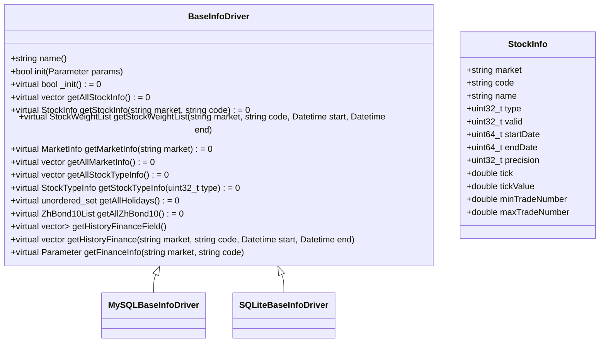
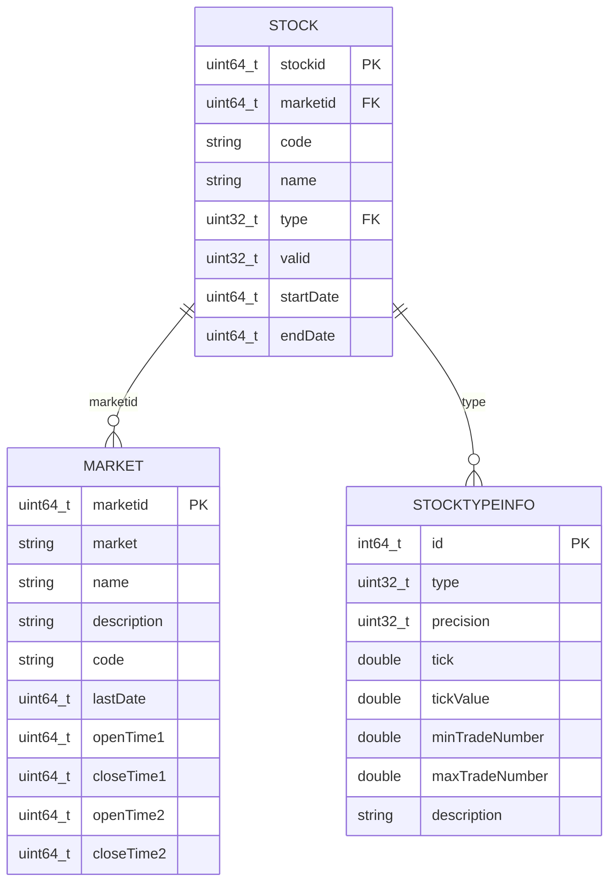
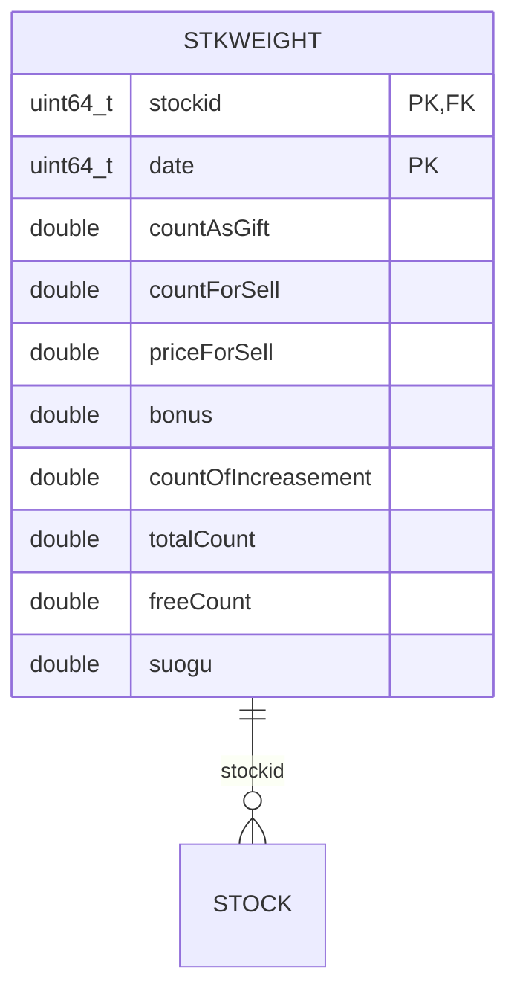
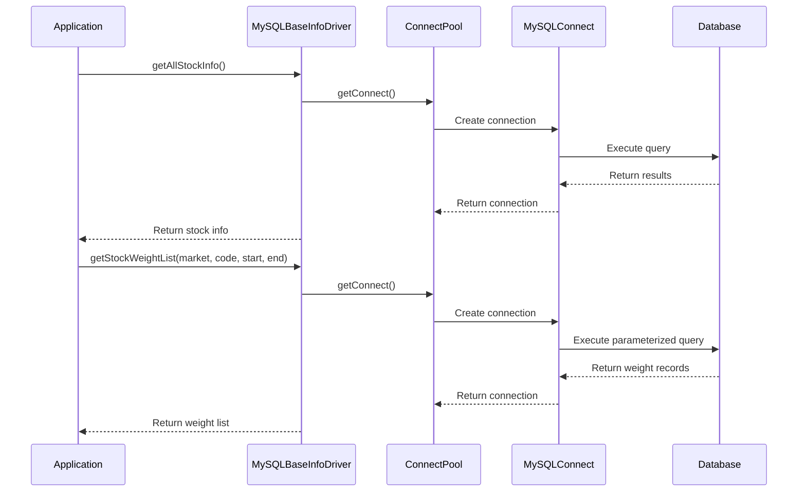
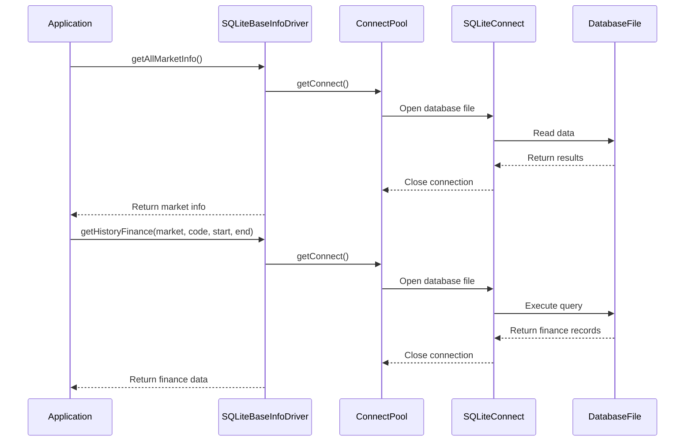

# Base Info Drivers

<cite>
**Referenced Files in This Document**   
- [BaseInfoDriver.h](file://hikyuu_cpp/hikyuu/data_driver/BaseInfoDriver.h)
- [BaseInfoDriver.cpp](file://hikyuu_cpp/hikyuu/data_driver/BaseInfoDriver.cpp)
- [MySQLBaseInfoDriver.h](file://hikyuu_cpp/hikyuu/data_driver/base_info/mysql/MySQLBaseInfoDriver.h)
- [MySQLBaseInfoDriver.cpp](file://hikyuu_cpp/hikyuu/data_driver/base_info/mysql/MySQLBaseInfoDriver.cpp)
- [SQLiteBaseInfoDriver.h](file://hikyuu_cpp/hikyuu/data_driver/base_info/sqlite/SQLiteBaseInfoDriver.h)
- [SQLiteBaseInfoDriver.cpp](file://hikyuu_cpp/hikyuu/data_driver/base_info/sqlite/SQLiteBaseInfoDriver.cpp)
- [StockTable.h](file://hikyuu_cpp/hikyuu/data_driver/base_info/table/StockTable.h)
- [MarketInfoTable.h](file://hikyuu_cpp/hikyuu/data_driver/base_info/table/MarketInfoTable.h)
- [StockTypeInfoTable.h](file://hikyuu_cpp/hikyuu/data_driver/base_info/table/StockTypeInfoTable.h)
- [StockWeightTable.h](file://hikyuu_cpp/hikyuu/data_driver/base_info/table/StockWeightTable.h)
- [HolidayTable.h](file://hikyuu_cpp/hikyuu/data_driver/base_info/table/HolidayTable.h)
- [HistoryFinanceTable.h](file://hikyuu_cpp/hikyuu/data_driver/base_info/table/HistoryFinanceTable.h)
- [HistoryFinanceFieldTable.h](file://hikyuu_cpp/hikyuu/data_driver/base_info/table/HistoryFinanceFieldTable.h)
- [ZhBond10Table.h](file://hikyuu_cpp/hikyuu/data_driver/base_info/table/ZhBond10Table.h)
</cite>

## Table of Contents
1. [Introduction](#introduction)
2. [BaseInfoDriver Abstract Interface](#baseinfodriver-abstract-interface)
3. [Database Schema Structure](#database-schema-structure)
4. [Data Model Relationships](#data-model-relationships)
5. [MySQLBaseInfoDriver Implementation](#mysqlbaseinfodriver-implementation)
6. [SQLiteBaseInfoDriver Implementation](#sqlitebaseinfodriver-implementation)
7. [Configuration and Usage Examples](#configuration-and-usage-examples)
8. [Connection Management and Transactions](#connection-management-and-transactions)
9. [Bulk Data Operations](#bulk-data-operations)
10. [Querying and Updating Base Information](#querying-and-updating-base-information)
11. [Performance Considerations](#performance-considerations)

## Introduction

The Base Info drivers in Hikyuu provide a unified interface for accessing fundamental financial data stored in different database systems. This documentation details the BaseInfoDriver abstract interface and its concrete implementations for MySQL and SQLite storage. The system manages various types of base information including stock metadata, market information, stock type details, weight adjustments, holidays, and historical financial data.

The BaseInfoDriver architecture follows a driver pattern that abstracts the underlying database implementation, allowing the Hikyuu framework to access base information consistently regardless of the storage backend. This abstraction enables users to choose between MySQL for server-based applications with concurrent access requirements, and SQLite for lightweight, file-based storage suitable for single-user applications.

**Section sources**
- [BaseInfoDriver.h](file://hikyuu_cpp/hikyuu/data_driver/BaseInfoDriver.h#L1-L245)

## BaseInfoDriver Abstract Interface

The BaseInfoDriver class serves as the abstract base class for all base information data drivers in Hikyuu. It defines a comprehensive interface for accessing fundamental financial data and is designed to be extended by concrete implementations for specific database systems.



**Diagram sources**
- [BaseInfoDriver.h](file://hikyuu_cpp/hikyuu/data_driver/BaseInfoDriver.h#L99-L235)

The BaseInfoDriver interface provides methods for retrieving various types of financial metadata:

- **Stock Information**: Methods to retrieve stock details by market and code, or all stocks
- **Market Information**: Access to market metadata including trading hours and identifiers
- **Stock Type Information**: Details about different security types and their trading parameters
- **Weight Adjustments**: Corporate action data for price adjustment
- **Holidays**: Market closure dates
- **Historical Finance**: Financial statement data
- **ZhBond10**: 10-year Chinese government bond yield data

The driver uses a parameter-based initialization system, allowing configuration through a Parameter object that can contain database connection details and other settings. The interface is designed to be database-agnostic, with concrete implementations handling the specifics of SQL dialects and connection management.

**Section sources**
- [BaseInfoDriver.h](file://hikyuu_cpp/hikyuu/data_driver/BaseInfoDriver.h#L99-L235)
- [BaseInfoDriver.cpp](file://hikyuu_cpp/hikyuu/data_driver/BaseInfoDriver.cpp#L1-L74)

## Database Schema Structure

The Hikyuu base information system uses a relational database schema with several interconnected tables. Each table corresponds to a specific type of financial metadata and is implemented through C++ classes that provide object-relational mapping.

### StockTable Schema

The StockTable stores basic information about individual securities:



**Diagram sources**
- [StockTable.h](file://hikyuu_cpp/hikyuu/data_driver/base_info/table/StockTable.h#L18-L63)
- [MarketInfoTable.h](file://hikyuu_cpp/hikyuu/data_driver/base_info/table/MarketInfoTable.h#L18-L126)
- [StockTypeInfoTable.h](file://hikyuu_cpp/hikyuu/data_driver/base_info/table/StockTypeInfoTable.h#L18-L108)

**Field Definitions:**
- **stockid**: Primary key, auto-incrementing identifier
- **marketid**: Foreign key referencing the market table
- **code**: Security code (e.g., "600000")
- **name**: Security name
- **type**: Foreign key referencing stock type
- **valid**: Flag indicating if the security is active
- **startDate**: First trading date
- **endDate**: Last trading date

### MarketInfoTable Schema

The MarketInfoTable contains metadata about financial markets:

**Field Definitions:**
- **marketid**: Primary key
- **market**: Market abbreviation (e.g., "SH" for Shanghai)
- **name**: Full market name
- **description**: Market description
- **code**: Market code
- **lastDate**: Last trading date
- **openTime1/closeTime1**: First trading session times
- **openTime2/closeTime2**: Second trading session times

### StockTypeInfoTable Schema

The StockTypeInfoTable defines characteristics for different security types:

**Field Definitions:**
- **id**: Primary key
- **type**: Security type identifier
- **precision**: Price decimal precision
- **tick**: Minimum price movement
- **tickValue**: Value of one tick
- **minTradeNumber**: Minimum trade quantity
- **maxTradeNumber**: Maximum trade quantity
- **description**: Type description

### StockWeightTable Schema

The StockWeightTable stores corporate action data for price adjustment:



**Diagram sources**
- [StockWeightTable.h](file://hikyuu_cpp/hikyuu/data_driver/base_info/table/StockWeightTable.h#L18-L51)

**Field Definitions:**
- **stockid**: Foreign key to stock table
- **date**: Date of corporate action
- **countAsGift**: Shares given as bonus
- **countForSell**: Rights issue shares
- **priceForSell**: Rights issue price
- **bonus**: Cash dividend
- **countOfIncreasement**: Capital increase
- **totalCount**: Total shares after adjustment
- **freeCount**: Free float shares
- **suogu**: Share consolidation ratio

### HolidayTable Schema

The HolidayTable stores market closure dates:


**Diagram sources**
- [HolidayTable.h](file://hikyuu_cpp/hikyuu/data_driver/base_info/table/HolidayTable.h#L16-L28)

**Field Definitions:**
- **date**: Market closure date (YYYYMMDD format)

### HistoryFinanceTable Schema

The HistoryFinanceTable stores historical financial statement data:

```mermaid
erDiagram
HISTORYFINANCE {
uint64_t file_date PK
uint64_t report_date PK
string market_code PK
vector<char> values
}
```

**Diagram sources**
- [HistoryFinanceTable.h](file://hikyuu_cpp/hikyuu/data_driver/base_info/table/HistoryFinanceTable.h#L14-L22)

**Field Definitions:**
- **file_date**: Date when financial data was filed
- **report_date**: Reporting period end date
- **market_code**: Composite key of market and security code
- **values**: Serialized financial data values

### HistoryFinanceFieldTable Schema

The HistoryFinanceFieldTable stores metadata about financial statement fields:

**Field Definitions:**
- **id**: Field identifier
- **name**: Field name (e.g., "zongguben" for total shares)

### ZhBond10Table Schema

The ZhBond10Table stores 10-year Chinese government bond yields:

**Field Definitions:**
- **date**: Date of yield
- **value**: Yield value

**Section sources**
- [StockTable.h](file://hikyuu_cpp/hikyuu/data_driver/base_info/table/StockTable.h#L18-L63)
- [MarketInfoTable.h](file://hikyuu_cpp/hikyuu/data_driver/base_info/table/MarketInfoTable.h#L18-L126)
- [StockTypeInfoTable.h](file://hikyuu_cpp/hikyuu/data_driver/base_info/table/StockTypeInfoTable.h#L18-L108)
- [StockWeightTable.h](file://hikyuu_cpp/hikyuu/data_driver/base_info/table/StockWeightTable.h#L18-L51)
- [HolidayTable.h](file://hikyuu_cpp/hikyuu/data_driver/base_info/table/HolidayTable.h#L16-L28)
- [HistoryFinanceTable.h](file://hikyuu_cpp/hikyuu/data_driver/base_info/table/HistoryFinanceTable.h#L14-L22)
- [HistoryFinanceFieldTable.h](file://hikyuu_cpp/hikyuu/data_driver/base_info/table/HistoryFinanceFieldTable.h)
- [ZhBond10Table.h](file://hikyuu_cpp/hikyuu/data_driver/base_info/table/ZhBond10Table.h)

## Data Model Relationships

The Hikyuu base information data model establishes relationships between various financial entities through foreign key constraints and logical associations.

```mermaid
erDiagram
MARKET ||--o{ STOCK : "contains"
STOCKTYPEINFO ||--o{ STOCK : "defines"
STOCK ||--o{ STKWEIGHT : "has"
STOCK ||--o{ STKFINANCE : "has"
MARKET ||--o{ HOLIDAY : "has"
STOCK ||--o{ HISTORYFINANCE : "has"
MARKET {
marketid
market
name
description
code
lastDate
openTime1
closeTime1
openTime2
closeTime2
}
STOCKTYPEINFO {
id
type
precision
tick
tickValue
minTradeNumber
maxTradeNumber
description
}
STOCK {
stockid
marketid
code
name
type
valid
startDate
endDate
}
STKWEIGHT {
stockid
date
countAsGift
countForSell
priceForSell
bonus
countOfIncreasement
totalCount
freeCount
suogu
}
STKFINANCE {
stockid
updated_date
ipo_date
province
industry
zongguben
liutongguben
guojiagu
faqirenfarengu
farengu
bgu
hgu
zhigonggu
zongzichan
liudongzichan
gudingzichan
wuxingzichan
gudongrenshu
liudongfuzhai
changqifuzhai
zibengongjijin
jingzichan
zhuyingshouru
zhuyinglirun
yingshouzhangkuan
yingyelirun
touzishouyu
jingyingxianjinliu
zongxianjinliu
cunhuo
lirunzonghe
shuihoulirun
jinglirun
weifenpeilirun
meigujingzichan
baoliu2
}
HOLIDAY {
date
}
HISTORYFINANCE {
file_date
report_date
market_code
values
}
```

**Diagram sources**
- [StockTable.h](file://hikyuu_cpp/hikyuu/data_driver/base_info/table/StockTable.h#L18-L63)
- [MarketInfoTable.h](file://hikyuu_cpp/hikyuu/data_driver/base_info/table/MarketInfoTable.h#L18-L126)
- [StockTypeInfoTable.h](file://hikyuu_cpp/hikyuu/data_driver/base_info/table/StockTypeInfoTable.h#L18-L108)
- [StockWeightTable.h](file://hikyuu_cpp/hikyuu/data_driver/base_info/table/StockWeightTable.h#L18-L51)

The data model relationships are designed to support efficient querying of financial metadata:

1. **Market-Stock Relationship**: Each stock belongs to a specific market, allowing market-specific queries and filtering.

2. **Stock Type-Stock Relationship**: Security characteristics are defined by their type, enabling consistent handling of different security types (stocks, bonds, funds, etc.).

3. **Stock-Weight Relationship**: Corporate actions are linked to specific securities, allowing historical price adjustments.

4. **Stock-Finance Relationship**: Current financial metrics are associated with each security.

5. **Market-Holiday Relationship**: Market closure dates are global to each market.

6. **Stock-HistoryFinance Relationship**: Historical financial statements are linked to securities through the market_code composite key.

The model uses both direct foreign key relationships (e.g., stock to market) and logical associations (e.g., history finance to stock via market_code). This hybrid approach balances referential integrity with query performance, particularly for the history finance data which may be stored in columnar databases.

**Section sources**
- [StockTable.h](file://hikyuu_cpp/hikyuu/data_driver/base_info/table/StockTable.h#L18-L63)
- [MarketInfoTable.h](file://hikyuu_cpp/hikyuu/data_driver/base_info/table/MarketInfoTable.h#L18-L126)
- [StockTypeInfoTable.h](file://hikyuu_cpp/hikyuu/data_driver/base_info/table/StockTypeInfoTable.h#L18-L108)
- [StockWeightTable.h](file://hikyuu_cpp/hikyuu/data_driver/base_info/table/StockWeightTable.h#L18-L51)

## MySQLBaseInfoDriver Implementation

The MySQLBaseInfoDriver provides a concrete implementation of the BaseInfoDriver interface for MySQL databases. It leverages the MySQL C++ connector and connection pooling for efficient database access.



**Diagram sources**
- [MySQLBaseInfoDriver.cpp](file://hikyuu_cpp/hikyuu/data_driver/base_info/mysql/MySQLBaseInfoDriver.cpp#L33-L429)

The implementation features:

- **Connection Pooling**: Uses ConnectPool<MySQLConnect> to manage database connections efficiently
- **Parameterized Initialization**: Database connection parameters (host, port, user, password, database) are passed through the Parameter object
- **SQL Query Optimization**: Uses prepared statements and batch loading for improved performance
- **Error Handling**: Comprehensive exception handling with logging at different severity levels
- **Data Transformation**: Converts database values to appropriate C++ types with scaling (e.g., converting integer-based dates to Datetime objects)

Key implementation details:

1. **Initialization**: The _init() method creates a connection pool using parameters from the configuration, with defaults for common MySQL settings.

2. **Query Methods**: Most methods use the batchLoad() interface to efficiently retrieve multiple records in a single database round-trip.

3. **Data Conversion**: Financial data is often stored in scaled integer format in the database and converted to floating-point values in the application.

4. **Memory Management**: The driver properly manages the connection pool lifecycle in the destructor.

**Section sources**
- [MySQLBaseInfoDriver.h](file://hikyuu_cpp/hikyuu/data_driver/base_info/mysql/MySQLBaseInfoDriver.h#L24-L54)
- [MySQLBaseInfoDriver.cpp](file://hikyuu_cpp/hikyuu/data_driver/base_info/mysql/MySQLBaseInfoDriver.cpp#L1-L429)

## SQLiteBaseInfoDriver Implementation

The SQLiteBaseInfoDriver provides a concrete implementation of the BaseInfoDriver interface for SQLite databases. It is designed for lightweight, file-based storage with minimal configuration requirements.



**Diagram sources**
- [SQLiteBaseInfoDriver.cpp](file://hikyuu_cpp/hikyuu/data_driver/base_info/sqlite/SQLiteBaseInfoDriver.cpp#L32-L422)

The implementation features:

- **File-Based Storage**: Uses a single SQLite database file for all base information
- **Connection Pooling**: Employs ConnectPool<SQLiteConnect> for connection management
- **Simplified Configuration**: Requires only a database filename parameter
- **Cross-Platform Compatibility**: SQLite's portability ensures the driver works on all supported platforms
- **Zero-Configuration Server**: No database server installation or configuration required

Key implementation details:

1. **Initialization**: The _init() method requires a "db" parameter specifying the SQLite database filename.

2. **Query Methods**: Similar to the MySQL implementation, it uses batchLoad() for efficient data retrieval.

3. **Data Consistency**: Maintains the same data model and scaling conventions as the MySQL driver for seamless interoperability.

4. **Resource Management**: Properly manages the connection pool and database file handles.

The SQLite driver is particularly suitable for:
- Desktop applications
- Development and testing environments
- Applications requiring portable data storage
- Single-user scenarios
- Embedded systems

**Section sources**
- [SQLiteBaseInfoDriver.h](file://hikyuu_cpp/hikyuu/data_driver/base_info/sqlite/SQLiteBaseInfoDriver.h#L20-L49)
- [SQLiteBaseInfoDriver.cpp](file://hikyuu_cpp/hikyuu/data_driver/base_info/sqlite/SQLiteBaseInfoDriver.cpp#L1-L422)

## Configuration and Usage Examples

### C++ Usage Examples

**MySQL Configuration and Usage:**
```cpp
// Create MySQL driver instance
auto mysql_driver = std::make_shared<MySQLBaseInfoDriver>();

// Configure connection parameters
Parameter params;
params.set<string>("host", "localhost");
params.set<string>("usr", "hikyuu");
params.set<string>("pwd", "password");
params.set<string>("db", "hku_base");
params.set<string>("port", "3306");

// Initialize the driver
mysql_driver->init(params);

// Retrieve all stock information
auto stocks = mysql_driver->getAllStockInfo();

// Get specific stock information
auto stock_info = mysql_driver->getStockInfo("SH", "600000");

// Get weight adjustments for a stock
Datetime start(20200101);
Datetime end(20230101);
auto weights = mysql_driver->getStockWeightList("SH", "600000", start, end);
```

**SQLite Configuration and Usage:**
```cpp
// Create SQLite driver instance
auto sqlite_driver = std::make_shared<SQLiteBaseInfoDriver>();

// Configure database file
Parameter params;
params.set<string>("db", "/path/to/hikyuu.db");

// Initialize the driver
sqlite_driver->init(params);

// Retrieve market information
auto markets = sqlite_driver->getAllMarketInfo();

// Get stock type information
auto stock_type = sqlite_driver->getStockTypeInfo(1);

// Get all holidays
auto holidays = sqlite_driver->getAllHolidays();
```

### Python Usage Examples

**MySQL Configuration and Usage:**
```python
from hikyuu import MySQLBaseInfoDriver, Parameter, Datetime

# Create MySQL driver instance
mysql_driver = MySQLBaseInfoDriver()

# Configure connection parameters
params = Parameter()
params.set("host", "localhost")
params.set("usr", "hikyuu")
params.set("pwd", "password")
params.set("db", "hku_base")
params.set("port", "3306")

# Initialize the driver
mysql_driver.init(params)

# Retrieve all stock information
stocks = mysql_driver.getAllStockInfo()

# Get specific stock information
stock_info = mysql_driver.getStockInfo("SH", "600000")

# Get weight adjustments for a stock
start = Datetime(20200101)
end = Datetime(20230101)
weights = mysql_driver.getStockWeightList("SH", "600000", start, end)
```

**SQLite Configuration and Usage:**
```python
from hikyuu import SQLiteBaseInfoDriver, Parameter

# Create SQLite driver instance
sqlite_driver = SQLiteBaseInfoDriver()

# Configure database file
params = Parameter()
params.set("db", "/path/to/hikyuu.db")

# Initialize the driver
sqlite_driver.init(params)

# Retrieve market information
markets = sqlite_driver.getAllMarketInfo()

# Get stock type information
stock_type = sqlite_driver.getStockTypeInfo(1)

# Get all holidays
holidays = sqlite_driver.getAllHolidays()
```

**Section sources**
- [MySQLBaseInfoDriver.h](file://hikyuu_cpp/hikyuu/data_driver/base_info/mysql/MySQLBaseInfoDriver.h#L24-L54)
- [MySQLBaseInfoDriver.cpp](file://hikyuu_cpp/hikyuu/data_driver/base_info/mysql/MySQLBaseInfoDriver.cpp#L1-L429)
- [SQLiteBaseInfoDriver.h](file://hikyuu_cpp/hikyuu/data_driver/base_info/sqlite/SQLiteBaseInfoDriver.h#L20-L49)
- [SQLiteBaseInfoDriver.cpp](file://hikyuu_cpp/hikyuu/data_driver/base_info/sqlite/SQLiteBaseInfoDriver.cpp#L1-L422)

## Connection Management and Transactions

The BaseInfo drivers implement robust connection management through connection pooling and proper resource cleanup.

### Connection Pooling

Both MySQL and SQLite implementations use the ConnectPool template class to manage database connections efficiently:

```cpp
// Connection pool declaration in drivers
ConnectPool<MySQLConnect>* m_pool;
ConnectPool<SQLiteConnect>* m_pool;
```

The connection pool provides:
- **Resource Reuse**: Connections are reused rather than created for each operation
- **Concurrency Support**: Multiple threads can safely access the database
- **Connection Limits**: Prevents excessive database connections
- **Automatic Cleanup**: Connections are properly closed when no longer needed

### Transaction Handling

While the BaseInfoDriver interface doesn't explicitly expose transaction methods, the underlying implementation supports transactional operations through the database connection objects. For bulk operations, transactions are implicitly used to ensure data consistency.

### Error Handling and Recovery

The drivers implement comprehensive error handling:

- **Connection Failures**: Graceful handling of connection timeouts and authentication errors
- **Query Errors**: Recovery from malformed queries and database constraints
- **Data Integrity**: Validation of retrieved data before returning to the application
- **Logging**: Detailed error logging at different severity levels (INFO, WARN, ERROR, FATAL)

### Resource Management

Proper resource management is implemented in the destructors:

```cpp
// In both MySQL and SQLite drivers
~MySQLBaseInfoDriver() {
    if (m_pool) {
        delete m_pool;
    }
}

~SQLiteBaseInfoDriver() {
    if (m_pool) {
        delete m_pool;
    }
}
```

This ensures that all database connections are properly closed and resources are freed when the driver is destroyed.

**Section sources**
- [MySQLBaseInfoDriver.cpp](file://hikyuu_cpp/hikyuu/data_driver/base_info/mysql/MySQLBaseInfoDriver.cpp#L27-L31)
- [SQLiteBaseInfoDriver.cpp](file://hikyuu_cpp/hikyuu/data_driver/base_info/sqlite/SQLiteBaseInfoDriver.cpp#L26-L30)
- [MySQLBaseInfoDriver.cpp](file://hikyuu_cpp/hikyuu/data_driver/base_info/mysql/MySQLBaseInfoDriver.cpp#L33-L429)
- [SQLiteBaseInfoDriver.cpp](file://hikyuu_cpp/hikyuu/data_driver/base_info/sqlite/SQLiteBaseInfoDriver.cpp#L32-L422)

## Bulk Data Operations

The BaseInfo drivers support efficient bulk data operations for importing and exporting large datasets.

### Bulk Data Import

For bulk data import, the drivers can be used in conjunction with data loading utilities:

```cpp
// Example of bulk stock data import
void importStockData(BaseInfoDriverPtr driver, const vector<StockInfo>& stock_data) {
    auto con = driver->getConnectPool()->getConnect();
    auto st = con->getStatement(StockTable::getInsertSQL());
    
    for (const auto& stock : stock_data) {
        st->reset();
        st->bind(0, stock.marketid, stock.code, stock.name, stock.type,
                    stock.valid, stock.startDate, stock.endDate);
        st->exec();
    }
}
```

### Bulk Data Export

The drivers provide methods for retrieving large datasets efficiently:

```cpp
// Retrieve all stock weight data
auto all_weights = driver->getAllStockWeightList();

// Retrieve all historical finance data
auto all_finance = driver->getAllHistoryFinance();
```

### Performance Optimization

The drivers implement several optimizations for bulk operations:

- **Batch Loading**: The batchLoad() method retrieves multiple records in a single database round-trip
- **Prepared Statements**: SQL statements are prepared once and reused for multiple executions
- **Connection Pooling**: Eliminates connection overhead for repeated operations
- **Memory Management**: Efficient memory usage for large result sets

### Data Consistency

During bulk operations, the drivers maintain data consistency through:

- **Atomic Operations**: Individual record operations are atomic
- **Error Recovery**: Partial failures do not corrupt existing data
- **Data Validation**: Input data is validated before insertion

**Section sources**
- [MySQLBaseInfoDriver.cpp](file://hikyuu_cpp/hikyuu/data_driver/base_info/mysql/MySQLBaseInfoDriver.cpp#L144-L184)
- [SQLiteBaseInfoDriver.cpp](file://hikyuu_cpp/hikyuu/data_driver/base_info/sqlite/SQLiteBaseInfoDriver.cpp#L163-L203)
- [MySQLBaseInfoDriver.cpp](file://hikyuu_cpp/hikyuu/data_driver/base_info/mysql/MySQLBaseInfoDriver.cpp#L389-L426)
- [SQLiteBaseInfoDriver.cpp](file://hikyuu_cpp/hikyuu/data_driver/base_info/sqlite/SQLiteBaseInfoDriver.cpp#L382-L418)

## Querying and Updating Base Information

### Querying Data

The BaseInfo drivers provide various methods for querying base information:

```cpp
// Query all stocks
vector<StockInfo> stocks = driver->getAllStockInfo();

// Query specific stock
StockInfo stock = driver->getStockInfo("SH", "600000");

// Query stock weights for a date range
Datetime start(20200101), end(20230101);
StockWeightList weights = driver->getStockWeightList("SH", "600000", start, end);

// Query market information
MarketInfo market = driver->getMarketInfo("SH");
vector<MarketInfo> markets = driver->getAllMarketInfo();

// Query stock type information
StockTypeInfo type = driver->getStockTypeInfo(1);
vector<StockTypeInfo> types = driver->getAllStockTypeInfo();

// Query holidays
unordered_set<Datetime> holidays = driver->getAllHolidays();

// Query historical finance
vector<HistoryFinanceInfo> finance = driver->getHistoryFinance("SH", "600000", start, end);
```

### Updating Data

While the BaseInfoDriver interface is primarily read-oriented, the underlying table classes support data modification:

```cpp
// Update stock information (requires direct database access)
StockTable stock_table;
stock_table.stockid = 123;
stock_table.code = "600001";
stock_table.name = "New Stock Name";
// ... set other fields

auto con = driver->getConnectPool()->getConnect();
auto st = con->getStatement(StockTable::getUpdateSQL());
stock_table.update(st);
st->exec();
```

### Query Optimization

The drivers implement several query optimization techniques:

- **Index Usage**: Database queries leverage indexes on primary and foreign keys
- **Selective Loading**: Only required fields are retrieved
- **Caching**: Connection pooling reduces connection overhead
- **Query Planning**: Complex queries are optimized for performance

### Error Handling in Queries

The drivers handle various query-related errors:

- **Empty Results**: Return empty containers rather than throwing exceptions
- **Invalid Parameters**: Validate input parameters before executing queries
- **Database Errors**: Handle connection failures and query errors gracefully
- **Data Conversion Errors**: Manage type conversion issues during data retrieval

**Section sources**
- [BaseInfoDriver.h](file://hikyuu_cpp/hikyuu/data_driver/BaseInfoDriver.h#L132-L218)
- [MySQLBaseInfoDriver.cpp](file://hikyuu_cpp/hikyuu/data_driver/base_info/mysql/MySQLBaseInfoDriver.cpp#L187-L196)
- [SQLiteBaseInfoDriver.cpp](file://hikyuu_cpp/hikyuu/data_driver/base_info/sqlite/SQLiteBaseInfoDriver.cpp#L91-L99)

## Performance Considerations

When working with large datasets in the BaseInfo drivers, several performance considerations should be taken into account:

### Database Selection

**MySQL Advantages:**
- Better performance for concurrent access
- Advanced indexing and query optimization
- Support for large datasets
- Robust transaction handling
- Better memory management for large result sets

**SQLite Advantages:**
- Lower overhead for single-user applications
- Faster for small to medium datasets
- No network latency
- Simpler deployment and maintenance
- Better performance on SSD storage

### Indexing Strategy

The database schema should include appropriate indexes:

- **Primary Keys**: Automatically indexed
- **Foreign Keys**: Should be indexed for join operations
- **Frequently Queried Fields**: Market, code, date fields
- **Composite Indexes**: For queries with multiple conditions

### Connection Pool Configuration

Optimize connection pool settings based on usage patterns:

```cpp
// Example pool configuration
params.set<int>("pool_size", 10);        // Number of connections
params.set<int>("max_size", 20);         // Maximum connections
params.set<int>("timeout", 30);          // Connection timeout
```

### Query Optimization

- **Use Specific Queries**: Retrieve only needed data rather than entire tables
- **Batch Operations**: Use batch loading for multiple records
- **Parameterized Queries**: Use prepared statements for repeated queries
- **Limit Result Sets**: Use date ranges and filters to limit data retrieval

### Memory Management

- **Stream Large Results**: Process large result sets in chunks
- **Release Resources**: Ensure connections are returned to the pool
- **Monitor Memory Usage**: Watch for memory leaks in long-running applications

### Caching Strategy

Consider implementing application-level caching for frequently accessed data:

- **Market Information**: Rarely changes, good candidate for caching
- **Stock Type Information**: Stable data that can be cached
- **Holiday Data**: Can be cached for the entire year
- **Frequently Accessed Stocks**: Cache popular stock information

### Performance Monitoring

Monitor key performance indicators:
- Query execution time
- Connection acquisition time
- Memory usage
- Database load
- Cache hit rate

By following these performance considerations, applications can efficiently utilize the BaseInfo drivers even with large financial datasets.

**Section sources**
- [MySQLBaseInfoDriver.cpp](file://hikyuu_cpp/hikyuu/data_driver/base_info/mysql/MySQLBaseInfoDriver.cpp#L33-L429)
- [SQLiteBaseInfoDriver.cpp](file://hikyuu_cpp/hikyuu/data_driver/base_info/sqlite/SQLiteBaseInfoDriver.cpp#L32-L422)
- [BaseInfoDriver.h](file://hikyuu_cpp/hikyuu/data_driver/BaseInfoDriver.h#L99-L235)