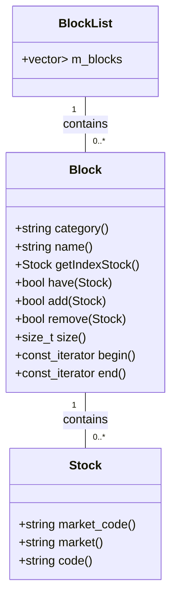
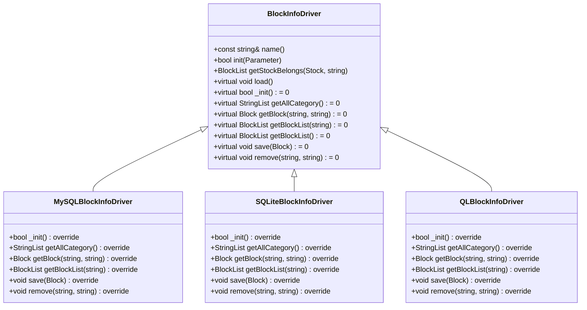
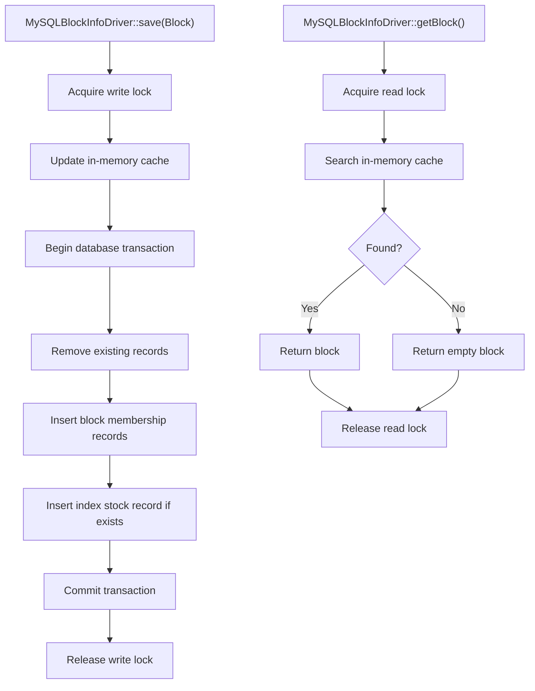
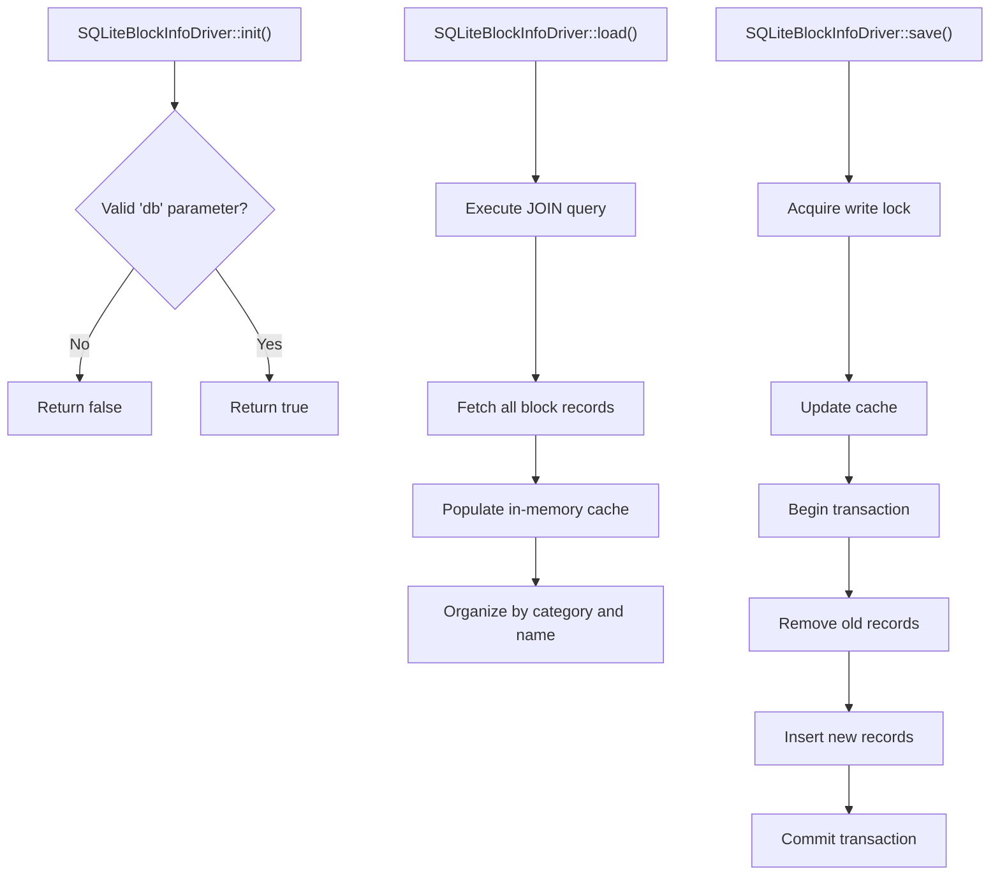
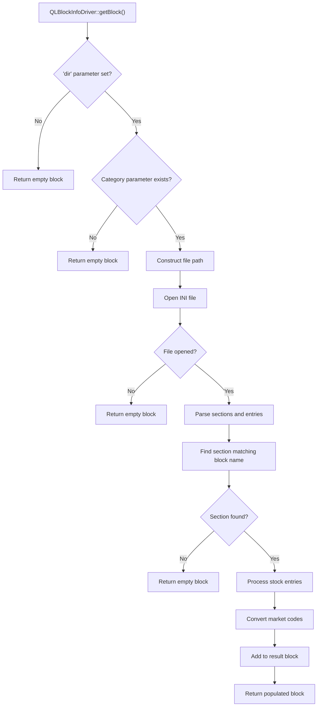
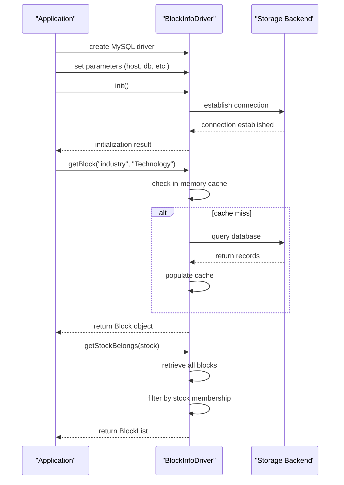
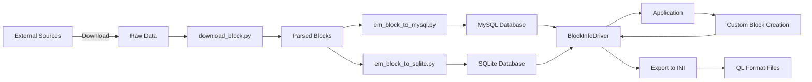

# Block Info Drivers

<cite>
**Referenced Files in This Document**   
- [BlockInfoDriver.h](file://hikyuu_cpp/hikyuu/data_driver/BlockInfoDriver.h)
- [BlockInfoDriver.cpp](file://hikyuu_cpp/hikyuu/data_driver/BlockInfoDriver.cpp)
- [MySQLBlockInfoDriver.h](file://hikyuu_cpp/hikyuu/data_driver/block_info/mysql/MySQLBlockInfoDriver.h)
- [MySQLBlockInfoDriver.cpp](file://hikyuu_cpp/hikyuu/data_driver/block_info/mysql/MySQLBlockInfoDriver.cpp)
- [SQLiteBlockInfoDriver.h](file://hikyuu_cpp/hikyuu/data_driver/block_info/sqlite/SQLiteBlockInfoDriver.h)
- [SQLiteBlockInfoDriver.cpp](file://hikyuu_cpp/hikyuu/data_driver/block_info/sqlite/SQLiteBlockInfoDriver.cpp)
- [QLBlockInfoDriver.h](file://hikyuu_cpp/hikyuu/data_driver/block_info/qianlong/QLBlockInfoDriver.h)
- [QLBlockInfoDriver.cpp](file://hikyuu_cpp/hikyuu/data_driver/block_info/qianlong/QLBlockInfoDriver.cpp)
- [Block.h](file://hikyuu_cpp/hikyuu/Block.h)
- [self.ini](file://hikyuu/config/block/self.ini)
- [hybk.ini](file://hikyuu/config/block/hybk.ini)
- [dybk.ini](file://hikyuu/config/block/dybk.ini)
- [download_block.py](file://hikyuu/data/download_block.py)
- [em_block_to_mysql.py](file://hikyuu/data/em_block_to_mysql.py)
</cite>

## Table of Contents
1. [Introduction](#introduction)
2. [Block Data Model](#block-data-model)
3. [BlockInfoDriver Interface](#blockinfodriver-interface)
4. [MySQLBlockInfoDriver Implementation](#mysqlblockinfodriver-implementation)
5. [SQLiteBlockInfoDriver Implementation](#sqliteblockinfodriver-implementation)
6. [QLBlockInfoDriver Implementation](#qlblockinfodriver-implementation)
7. [INI File Format](#ini-file-format)
8. [Configuration and Usage Examples](#configuration-and-usage-examples)
9. [Bulk Data Import and Export](#bulk-data-import-and-export)
10. [Conclusion](#conclusion)

## Introduction
The Block Info drivers in Hikyuu provide a unified interface for managing and accessing block data across different storage backends. A block in this context refers to a collection of securities grouped by various criteria such as industry, concept, region, or custom categories. The system supports multiple driver implementations including MySQL, SQLite, and QianLong (QL) format, allowing flexible storage and retrieval of block membership information. This documentation details the abstract BlockInfoDriver interface, its concrete implementations, the block data model, and provides comprehensive examples for configuration and usage in both C++ and Python environments.

**Section sources**
- [BlockInfoDriver.h](file://hikyuu_cpp/hikyuu/data_driver/BlockInfoDriver.h#L1-L115)

## Block Data Model
The block data model in Hikyuu is centered around the Block class, which represents a collection of securities with a specific category and name. Each block can contain multiple stocks identified by their market code (e.g., "SH000001" for Shanghai market). The Block class provides methods to add, remove, and query securities within the block, as well as to retrieve block metadata such as category, name, and associated index stock. Blocks are organized hierarchically by category (e.g., "industry", "concept", "region"), and each category can contain multiple named blocks. The model supports efficient membership queries to determine which blocks a particular security belongs to, enabling sophisticated portfolio analysis and strategy development based on sector or thematic exposure.



**Diagram sources**
- [Block.h](file://hikyuu_cpp/hikyuu/Block.h#L1-L194)

**Section sources**
- [Block.h](file://hikyuu_cpp/hikyuu/Block.h#L1-L194)

## BlockInfoDriver Interface
The BlockInfoDriver serves as the abstract base class for all block information drivers in Hikyuu, defining a consistent interface for block data access and manipulation. This interface extends the Parameter support system, allowing drivers to be configured through parameter sets. Key methods include retrieving blocks by category and name, obtaining all blocks within a category, saving and removing blocks, and checking stock membership across blocks. The interface is designed to be backend-agnostic, enabling seamless switching between different storage implementations. All concrete drivers must implement the pure virtual methods such as _init(), getAllCategory(), getBlock(), getBlockList(), save(), and remove(), ensuring consistent behavior across different storage backends while allowing for implementation-specific optimizations.



**Diagram sources**
- [BlockInfoDriver.h](file://hikyuu_cpp/hikyuu/data_driver/BlockInfoDriver.h#L1-L115)

**Section sources**
- [BlockInfoDriver.h](file://hikyuu_cpp/hikyuu/data_driver/BlockInfoDriver.h#L1-L115)
- [BlockInfoDriver.cpp](file://hikyuu_cpp/hikyuu/data_driver/BlockInfoDriver.cpp#L1-L70)

## MySQLBlockInfoDriver Implementation
The MySQLBlockInfoDriver provides a robust implementation of the BlockInfoDriver interface using MySQL as the backend storage. It maintains an in-memory cache using unordered_maps for efficient access to block data, synchronized with the database through shared mutexes. The driver connects to MySQL using configurable parameters including host, port, username, password, and database name. It implements a comprehensive schema with two main tables: 'block' for storing block membership and 'BlockIndex' for storing index stock information. The implementation supports full CRUD operations, with save() and remove() methods that update both the in-memory cache and the database transactionally. The load() method pre-populates the cache from the database using a JOIN query that combines block membership with index stock information, optimizing subsequent access patterns.



**Diagram sources**
- [MySQLBlockInfoDriver.h](file://hikyuu_cpp/hikyuu/data_driver/block_info/mysql/MySQLBlockInfoDriver.h#L1-L37)
- [MySQLBlockInfoDriver.cpp](file://hikyuu_cpp/hikyuu/data_driver/block_info/mysql/MySQLBlockInfoDriver.cpp#L1-L179)

**Section sources**
- [MySQLBlockInfoDriver.h](file://hikyuu_cpp/hikyuu/data_driver/block_info/mysql/MySQLBlockInfoDriver.h#L1-L37)
- [MySQLBlockInfoDriver.cpp](file://hikyuu_cpp/hikyuu/data_driver/block_info/mysql/MySQLBlockInfoDriver.cpp#L1-L179)

## SQLiteBlockInfoDriver Implementation
The SQLiteBlockInfoDriver implements the BlockInfoDriver interface using SQLite as the storage backend, providing a lightweight and portable solution for block data management. Similar to the MySQL implementation, it maintains an in-memory cache protected by shared mutexes for thread-safe access. The driver requires a 'db' parameter specifying the SQLite database file path for initialization. It uses the same table structure as the MySQL driver with 'block' and 'BlockIndex' tables, ensuring consistency across different SQL-based implementations. The implementation leverages SQLite's transaction support to ensure data integrity during save and remove operations. The load() method populates the in-memory cache by executing a JOIN query on the block tables, optimizing subsequent read operations. This driver is particularly suitable for standalone applications or scenarios where a full database server is not required.



**Diagram sources**
- [SQLiteBlockInfoDriver.h](file://hikyuu_cpp/hikyuu/data_driver/block_info/sqlite/SQLiteBlockInfoDriver.h#L1-L38)
- [SQLiteBlockInfoDriver.cpp](file://hikyuu_cpp/hikyuu/data_driver/block_info/sqlite/SQLiteBlockInfoDriver.cpp#L1-L174)

**Section sources**
- [SQLiteBlockInfoDriver.h](file://hikyuu_cpp/hikyuu/data_driver/block_info/sqlite/SQLiteBlockInfoDriver.h#L1-L38)
- [SQLiteBlockInfoDriver.cpp](file://hikyuu_cpp/hikyuu/data_driver/block_info/sqlite/SQLiteBlockInfoDriver.cpp#L1-L174)

## QLBlockInfoDriver Implementation
The QLBlockInfoDriver provides read-only access to block data stored in QianLong (QL) INI file format, commonly used by financial software in China. Unlike the database-backed drivers, this implementation reads block definitions directly from text files organized by category. Each category corresponds to a file in a specified directory, with blocks defined as sections containing stock entries. The format uses '0' for Shenzhen market and '1' for Shanghai market prefixes, which are converted to 'SZ' and 'SH' respectively in the internal representation. The driver does not support saving or removing blocks, throwing exceptions when these methods are called. The getAllCategory() method is not implemented and returns an empty list, as category information is derived from available file names rather than a centralized registry. This implementation is optimized for reading large collections of pre-defined blocks without the overhead of a database system.



**Diagram sources**
- [QLBlockInfoDriver.h](file://hikyuu_cpp/hikyuu/data_driver/block_info/qianlong/QLBlockInfoDriver.h#L1-L33)
- [QLBlockInfoDriver.cpp](file://hikyuu_cpp/hikyuu/data_driver/block_info/qianlong/QLBlockInfoDriver.cpp#L1-L206)

**Section sources**
- [QLBlockInfoDriver.h](file://hikyuu_cpp/hikyuu/data_driver/block_info/qianlong/QLBlockInfoDriver.h#L1-L33)
- [QLBlockInfoDriver.cpp](file://hikyuu_cpp/hikyuu/data_driver/block_info/qianlong/QLBlockInfoDriver.cpp#L1-L206)

## INI File Format
The INI file format used by the QLBlockInfoDriver follows a simple structure where each block category is stored in a separate file, and each block within a category is represented as a section. The file begins with a section header enclosed in square brackets, followed by key-value pairs representing stock entries. Each entry consists of a market indicator ('0' for Shenzhen, '1' for Shanghai) followed by a comma and the stock code. Comments are supported using semicolon (;) and can appear on their own lines or after entries. The format is case-insensitive for section names and preserves the order of entries within sections. This format is widely used in Chinese financial software and allows for easy manual editing and sharing of block definitions. The driver automatically converts the market indicators to standard market codes ('SZ' for Shenzhen, 'SH' for Shanghai) when loading blocks into memory.

```mermaid
erDiagram
INI_FILE ||--o{ CATEGORY : contains
CATEGORY ||--o{ BLOCK : contains
BLOCK ||--o{ STOCK_ENTRY : contains
class INI_FILE {
string filename
string encoding
}
class CATEGORY {
string name
string filename
}
class BLOCK {
string name
string index_code
}
class STOCK_ENTRY {
string market_indicator
string stock_code
string full_market_code
}
```

**Diagram sources**
- [self.ini](file://hikyuu/config/block/self.ini#L1-L10)
- [hybk.ini](file://hikyuu/config/block/hybk.ini#L1-L800)
- [dybk.ini](file://hikyuu/config/block/dybk.ini#L1-L800)

**Section sources**
- [self.ini](file://hikyuu/config/block/self.ini#L1-L10)
- [hybk.ini](file://hikyuu/config/block/hybk.ini#L1-L800)
- [dybk.ini](file://hikyuu/config/block/dybk.ini#L1-L800)

## Configuration and Usage Examples
Configuring and using block info drivers in Hikyuu involves creating driver instances with appropriate parameters and utilizing them to access block data. For MySQL and SQLite drivers, connection parameters such as host, port, username, password, and database/file path must be specified. The QLBlockInfoDriver requires a 'dir' parameter pointing to the directory containing INI files. In C++, drivers are typically instantiated through factory methods and configured using Parameter objects. In Python, similar functionality is available through the hikyuu package, with drivers accessible via module imports. Usage examples include retrieving specific blocks, listing all blocks in a category, checking stock membership, and iterating through block contents. The unified interface ensures that code written for one driver type can easily be adapted to work with others by changing only the configuration parameters.



**Diagram sources**
- [MySQLBlockInfoDriver.cpp](file://hikyuu_cpp/hikyuu/data_driver/block_info/mysql/MySQLBlockInfoDriver.cpp#L1-L179)
- [SQLiteBlockInfoDriver.cpp](file://hikyuu_cpp/hikyuu/data_driver/block_info/sqlite/SQLiteBlockInfoDriver.cpp#L1-L174)
- [QLBlockInfoDriver.cpp](file://hikyuu_cpp/hikyuu/data_driver/block_info/qianlong/QLBlockInfoDriver.cpp#L1-L206)

**Section sources**
- [MySQLBlockInfoDriver.cpp](file://hikyuu_cpp/hikyuu/data_driver/block_info/mysql/MySQLBlockInfoDriver.cpp#L1-L179)
- [SQLiteBlockInfoDriver.cpp](file://hikyuu_cpp/hikyuu/data_driver/block_info/sqlite/SQLiteBlockInfoDriver.cpp#L1-L174)
- [QLBlockInfoDriver.cpp](file://hikyuu_cpp/hikyuu/data_driver/block_info/qianlong/QLBlockInfoDriver.cpp#L1-L206)

## Bulk Data Import and Export
Hikyuu provides comprehensive tools for bulk import and export of block data across different formats and storage backends. The system includes Python scripts like download_block.py and em_block_to_mysql.py that facilitate importing block data from external sources such as EastMoney (EM) into MySQL databases. The import process typically involves downloading block definitions from web sources, parsing them into the internal block format, and then writing them to the target storage backend. For MySQL and SQLite, this involves executing bulk INSERT operations within transactions for optimal performance. The export functionality allows converting block data between formats, such as exporting from MySQL to INI files or vice versa. The system also supports programmatic creation and modification of block collections through the Block and BlockInfoDriver APIs, enabling automated generation of custom blocks based on specific criteria or market conditions.



**Diagram sources**
- [download_block.py](file://hikyuu/data/download_block.py#L1-L352)
- [em_block_to_mysql.py](file://hikyuu/data/em_block_to_mysql.py#L1-L72)

**Section sources**
- [download_block.py](file://hikyuu/data/download_block.py#L1-L352)
- [em_block_to_mysql.py](file://hikyuu/data/em_block_to_mysql.py#L1-L72)

## Conclusion
The Block Info drivers in Hikyuu provide a flexible and extensible framework for managing block data across multiple storage backends. The abstract BlockInfoDriver interface ensures consistent access patterns regardless of the underlying storage technology, while concrete implementations for MySQL, SQLite, and QianLong formats cater to different performance, portability, and compatibility requirements. The system's design emphasizes efficiency through in-memory caching and thread-safe access, making it suitable for high-performance quantitative analysis applications. The comprehensive support for bulk data import from external sources like EastMoney, combined with the ability to programmatically create and modify block collections, enables sophisticated portfolio construction and strategy development. By understanding the block data model and the capabilities of each driver implementation, users can effectively leverage this system for advanced financial analysis and investment research.