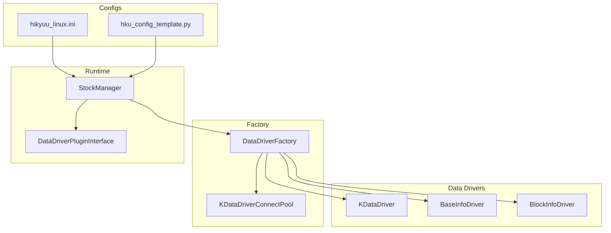
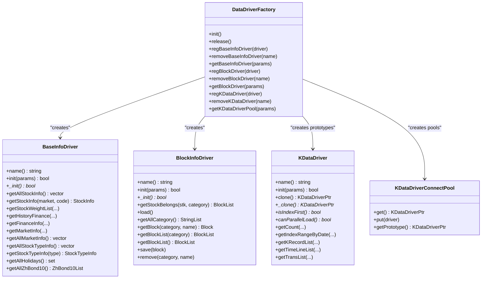
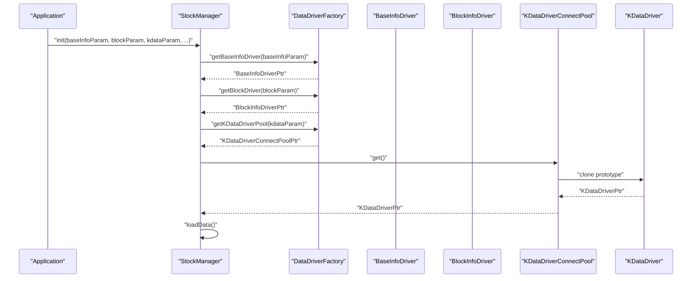
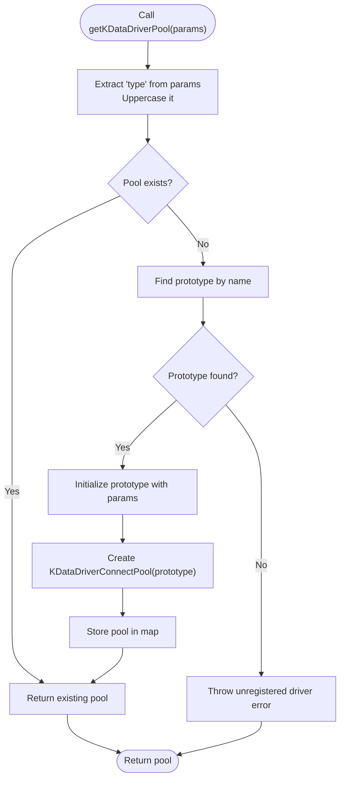
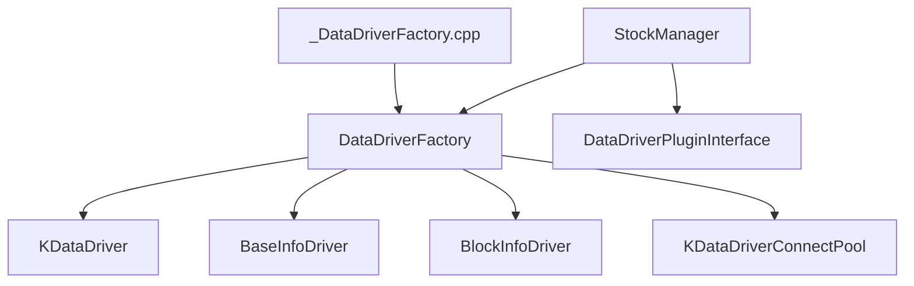

# Data Driver Factory

<cite>
**Referenced Files in This Document**
- [DataDriverFactory.h](file://hikyuu_cpp/hikyuu/data_driver/DataDriverFactory.h)
- [DataDriverFactory.cpp](file://hikyuu_cpp/hikyuu/data_driver/DataDriverFactory.cpp)
- [KDataDriver.h](file://hikyuu_cpp/hikyuu/data_driver/KDataDriver.h)
- [BaseInfoDriver.h](file://hikyuu_cpp/hikyuu/data_driver/BaseInfoDriver.h)
- [BlockInfoDriver.h](file://hikyuu_cpp/hikyuu/data_driver/BlockInfoDriver.h)
- [H5KDataDriver.h](file://hikyuu_cpp/hikyuu/data_driver/kdata/hdf5/H5KDataDriver.h)
- [SQLiteBaseInfoDriver.h](file://hikyuu_cpp/hikyuu/data_driver/base_info/sqlite/SQLiteBaseInfoDriver.h)
- [SQLiteBlockInfoDriver.h](file://hikyuu_cpp/hikyuu/data_driver/block_info/sqlite/SQLiteBlockInfoDriver.h)
- [DoNothingKDataDriver.h](file://hikyuu_cpp/hikyuu/data_driver/kdata/DoNothingKDataDriver.h)
- [_DataDriverFactory.cpp](file://hikyuu_pywrap/data_driver/_DataDriverFactory.cpp)
- [hikyuu_linux.ini](file://test_data/hikyuu_linux.ini)
- [hku_config_template.py](file://hikyuu/data/hku_config_template.py)
- [StockManager.cpp](file://hikyuu_cpp/hikyuu/StockManager.cpp)
- [DataDriverPluginInterface.h](file://hikyuu_cpp/hikyuu/plugin/interface/DataDriverPluginInterface.h)
</cite>

## Table of Contents
1. [Introduction](#introduction)
2. [Project Structure](#project-structure)
3. [Core Components](#core-components)
4. [Architecture Overview](#architecture-overview)
5. [Detailed Component Analysis](#detailed-component-analysis)
6. [Dependency Analysis](#dependency-analysis)
7. [Performance Considerations](#performance-considerations)
8. [Troubleshooting Guide](#troubleshooting-guide)
9. [Conclusion](#conclusion)
10. [Appendices](#appendices)

## Introduction
This document describes the DataDriverFactory in Hikyuu, which implements a factory pattern to provide a unified interface for creating instances of KDataDriver, BaseInfoDriver, and BlockInfoDriver. The factory is configuration-driven and integrates with the hikyuu configuration system to resolve driver types and parameters. It also supports registering custom driver implementations and manages connection pools for KDataDriver instances.

## Project Structure
The DataDriverFactory resides in the data driver module and coordinates three driver categories:
- KDataDriver: K-line and intraday data access
- BaseInfoDriver: basic stock and market metadata
- BlockInfoDriver: industry and concept block membership

It interacts with:
- StockManager for initialization and runtime usage
- Plugin interfaces for external driver extensions
- Python bindings for exposing factory APIs to Python

**Diagram sources**
- [DataDriverFactory.h](file://hikyuu_cpp/hikyuu/data_driver/DataDriverFactory.h#L1-L58)
- [DataDriverFactory.cpp](file://hikyuu_cpp/hikyuu/data_driver/DataDriverFactory.cpp#L45-L83)
- [KDataDriver.h](file://hikyuu_cpp/hikyuu/data_driver/KDataDriver.h#L1-L150)
- [BaseInfoDriver.h](file://hikyuu_cpp/hikyuu/data_driver/BaseInfoDriver.h#L95-L149)
- [BlockInfoDriver.h](file://hikyuu_cpp/hikyuu/data_driver/BlockInfoDriver.h#L17-L80)
- [StockManager.cpp](file://hikyuu_cpp/hikyuu/StockManager.cpp#L90-L168)
- [hikyuu_linux.ini](file://test_data/hikyuu_linux.ini#L1-L56)
- [hku_config_template.py](file://hikyuu/data/hku_config_template.py#L25-L92)

**Section sources**
- [DataDriverFactory.h](file://hikyuu_cpp/hikyuu/data_driver/DataDriverFactory.h#L1-L58)
- [DataDriverFactory.cpp](file://hikyuu_cpp/hikyuu/data_driver/DataDriverFactory.cpp#L45-L83)
- [StockManager.cpp](file://hikyuu_cpp/hikyuu/StockManager.cpp#L90-L168)

## Core Components
- DataDriverFactory: Static factory with registration and resolution methods for BaseInfoDriver, BlockInfoDriver, and KDataDriver. It maintains prototype maps and connection pools for KDataDriver.
- KDataDriver: Abstract base for K-line/intraday data access with cloning and initialization hooks.
- BaseInfoDriver: Abstract base for stock/market metadata access.
- BlockInfoDriver: Abstract base for block membership and classification.
- KDataDriverConnectPool: Pool abstraction for KDataDriver connections.
- Python bindings: Expose factory APIs to Python.

Key responsibilities:
- Registration: Register default and custom drivers by name.
- Resolution: Resolve driver instances from configuration parameters.
- Lifecycle: Initialize drivers, manage connection pools, and release resources.

**Section sources**
- [DataDriverFactory.h](file://hikyuu_cpp/hikyuu/data_driver/DataDriverFactory.h#L1-L58)
- [DataDriverFactory.cpp](file://hikyuu_cpp/hikyuu/data_driver/DataDriverFactory.cpp#L111-L202)
- [KDataDriver.h](file://hikyuu_cpp/hikyuu/data_driver/KDataDriver.h#L1-L150)
- [_DataDriverFactory.cpp](file://hikyuu_pywrap/data_driver/_DataDriverFactory.cpp#L1-L49)

## Architecture Overview
The factory follows a classic factory pattern with prototype-based instantiation for KDataDriver and pool-based reuse. Configuration parameters drive driver selection and initialization.

**Diagram sources**
- [DataDriverFactory.h](file://hikyuu_cpp/hikyuu/data_driver/DataDriverFactory.h#L1-L58)
- [BaseInfoDriver.h](file://hikyuu_cpp/hikyuu/data_driver/BaseInfoDriver.h#L95-L245)
- [BlockInfoDriver.h](file://hikyuu_cpp/hikyuu/data_driver/BlockInfoDriver.h#L17-L115)
- [KDataDriver.h](file://hikyuu_cpp/hikyuu/data_driver/KDataDriver.h#L1-L225)

## Detailed Component Analysis

### DataDriverFactory API
- Initialization and cleanup:
  - init(): Registers default drivers based on compile-time feature flags and initializes internal maps.
  - release(): Clears and deletes registered driver maps and pools.
- BaseInfoDriver:
  - regBaseInfoDriver(driver): Register a BaseInfoDriver prototype by its name.
  - removeBaseInfoDriver(name): Remove a registered BaseInfoDriver.
  - getBaseInfoDriver(params): Resolve a BaseInfoDriver instance by "type" parameter and initialize with provided parameters.
- BlockInfoDriver:
  - regBlockDriver(driver): Register a BlockInfoDriver prototype by its name.
  - removeBlockDriver(name): Remove a registered BlockInfoDriver.
  - getBlockDriver(params): Resolve a BlockInfoDriver instance by "type" parameter and initialize with provided parameters.
- KDataDriver:
  - regKDataDriver(driver): Register a KDataDriver prototype by its name.
  - removeKDataDriver(name): Remove a registered KDataDriver prototype and its connection pool.
  - getKDataDriverPool(params): Resolve a KDataDriverConnectPool by "type". On first use, it clones the prototype, initializes it with params, and creates a pool.

Configuration-driven resolution:
- All three driver resolution methods extract a "type" string from the Parameter object, normalize it to uppercase, and look up the driver in their respective maps. If found, the driver is initialized with the provided Parameter.

Connection pooling:
- KDataDriverConnectPool holds a prototype driver and manages connections. The factory lazily creates pools on demand and reuses them.

**Section sources**
- [DataDriverFactory.h](file://hikyuu_cpp/hikyuu/data_driver/DataDriverFactory.h#L1-L58)
- [DataDriverFactory.cpp](file://hikyuu_cpp/hikyuu/data_driver/DataDriverFactory.cpp#L45-L83)
- [DataDriverFactory.cpp](file://hikyuu_cpp/hikyuu/data_driver/DataDriverFactory.cpp#L111-L202)

### Driver Prototypes and Implementations
- KDataDriver prototypes registered by default include:
  - DoNothingKDataDriver: Special-purpose driver for temporary stocks.
  - KDataTempCsvDriver: CSV-based temporary K-data driver.
  - TdxKDataDriver: TDX protocol driver (conditional).
  - H5KDataDriver: HDF5-based driver (conditional).
  - MySQLKDataDriver: MySQL-based driver (conditional).
  - SQLiteKDataDriver: SQLite-based driver (conditional).
- BaseInfoDriver prototypes include:
  - SQLiteBaseInfoDriver: SQLite-backed base info driver (conditional).
  - MySQLBaseInfoDriver: MySQL-backed base info driver (conditional).
- BlockInfoDriver prototypes include:
  - QLBlockInfoDriver: Qianlong block info driver.
  - SQLiteBlockInfoDriver: SQLite-backed block info driver (conditional).
  - MySQLBlockInfoDriver: MySQL-backed block info driver (conditional).

Feature flags control availability of certain drivers at compile time.

**Section sources**
- [DataDriverFactory.cpp](file://hikyuu_cpp/hikyuu/data_driver/DataDriverFactory.cpp#L45-L83)
- [DoNothingKDataDriver.h](file://hikyuu_cpp/hikyuu/data_driver/kdata/DoNothingKDataDriver.h#L1-L33)
- [H5KDataDriver.h](file://hikyuu_cpp/hikyuu/data_driver/kdata/hdf5/H5KDataDriver.h#L1-L90)
- [SQLiteBaseInfoDriver.h](file://hikyuu_cpp/hikyuu/data_driver/base_info/sqlite/SQLiteBaseInfoDriver.h#L1-L51)
- [SQLiteBlockInfoDriver.h](file://hikyuu_cpp/hikyuu/data_driver/block_info/sqlite/SQLiteBlockInfoDriver.h#L1-L38)

### Configuration-Driven Instantiation
The factory relies on hikyuu’s Parameter object and configuration files to select and initialize drivers. Typical configuration sections include:
- [hikyuu]: Global settings like tmpdir and datadir.
- [block]: Block info driver configuration (type and backend-specific keys).
- [baseinfo]: Base info driver configuration (type and backend-specific keys).
- [kdata]: K-data driver configuration (type and backend-specific keys).

Examples:
- Linux configuration template demonstrates typical keys for block, baseinfo, and kdata sections.
- Python configuration template provides templates for HDF5, MySQL, and ClickHouse backends.

Resolution flow:
- StockManager reads configuration into Parameter objects and passes them to the factory.
- The factory extracts "type" and initializes the corresponding driver with the provided Parameter.

**Section sources**
- [hikyuu_linux.ini](file://test_data/hikyuu_linux.ini#L1-L56)
- [hku_config_template.py](file://hikyuu/data/hku_config_template.py#L25-L92)
- [hku_config_template.py](file://hikyuu/data/hku_config_template.py#L94-L148)
- [hku_config_template.py](file://hikyuu/data/hku_config_template.py#L150-L203)

### Python Binding and Usage
The Python wrapper exposes the following factory methods:
- getBaseInfoDriver(params)
- removeBaseInfoDriver(name)
- getKDataDriverPool(params)
- removeKDataDriver(name)
- getBlockDriver(params)
- removeBlockDriver(name)

Note: Registration of custom drivers from Python is partially exposed for BlockInfoDriver and commented-out for BaseInfoDriver and KDataDriver.

**Section sources**
- [_DataDriverFactory.cpp](file://hikyuu_pywrap/data_driver/_DataDriverFactory.cpp#L1-L49)

### Runtime Integration with StockManager
StockManager orchestrates driver initialization:
- Reads configuration into Parameter objects.
- Optionally registers plugin-provided drivers when "type" is set to specific backends (e.g., clickhouse).
- Resolves drivers via DataDriverFactory and loads data.

**Section sources**
- [StockManager.cpp](file://hikyuu_cpp/hikyuu/StockManager.cpp#L90-L168)
- [StockManager.cpp](file://hikyuu_cpp/hikyuu/StockManager.cpp#L601-L636)

### Extending the Factory with Custom Drivers
There are two primary extension mechanisms:
- Build-time registration: Add driver prototypes in DataDriverFactory::init() under appropriate feature flags.
- Runtime registration: Use regKDataDriver/regBaseInfoDriver/regBlockDriver to register custom drivers. For KDataDriver, the factory stores a prototype and lazily creates connection pools on first use.

Plugin interface:
- DataDriverPluginInterface defines methods to obtain KDataDriver, BlockInfoDriver, and BaseInfoDriver instances from plugins. StockManager conditionally registers plugin drivers when configuration specifies a plugin-backed type.

Best practices:
- Ensure driver name normalization (uppercase) matches the "type" parameter.
- Provide robust _init() implementations that handle resource acquisition and cleanup.
- For KDataDriver, implement isIndexFirst() and canParallelLoad() accurately to enable optimal loading strategies.

**Section sources**
- [DataDriverFactory.cpp](file://hikyuu_cpp/hikyuu/data_driver/DataDriverFactory.cpp#L45-L83)
- [DataDriverFactory.cpp](file://hikyuu_cpp/hikyuu/data_driver/DataDriverFactory.cpp#L161-L202)
- [DataDriverPluginInterface.h](file://hikyuu_cpp/hikyuu/plugin/interface/DataDriverPluginInterface.h#L1-L27)
- [StockManager.cpp](file://hikyuu_cpp/hikyuu/StockManager.cpp#L118-L146)

## Architecture Overview

**Diagram sources**
- [StockManager.cpp](file://hikyuu_cpp/hikyuu/StockManager.cpp#L90-L168)
- [DataDriverFactory.cpp](file://hikyuu_cpp/hikyuu/data_driver/DataDriverFactory.cpp#L111-L202)
- [KDataDriver.h](file://hikyuu_cpp/hikyuu/data_driver/KDataDriver.h#L1-L150)

## Detailed Component Analysis

### Factory Resolution Flow (KDataDriver)

**Diagram sources**
- [DataDriverFactory.cpp](file://hikyuu_cpp/hikyuu/data_driver/DataDriverFactory.cpp#L184-L200)

### Configuration File Format and Parameters
- [hikyuu]
  - tmpdir: Temporary directory path
  - datadir: Data directory path
- [block]
  - type: Driver type (e.g., sqlite3, qianlong, mysql, clickhouse)
  - Backend-specific keys depend on selected type
- [baseinfo]
  - type: Driver type (e.g., sqlite3, mysql, clickhouse)
  - Backend-specific keys depend on selected type
- [kdata]
  - type: Driver type (e.g., hdf5, tdx, mysql, sqlite3, clickhouse)
  - Backend-specific keys depend on selected type

Examples:
- Linux configuration template shows typical keys for block, baseinfo, and kdata sections.
- Python configuration template provides templates for HDF5, MySQL, and ClickHouse backends.

**Section sources**
- [hikyuu_linux.ini](file://test_data/hikyuu_linux.ini#L1-L56)
- [hku_config_template.py](file://hikyuu/data/hku_config_template.py#L25-L92)
- [hku_config_template.py](file://hikyuu/data/hku_config_template.py#L94-L148)
- [hku_config_template.py](file://hikyuu/data/hku_config_template.py#L150-L203)

### Using the Factory in C++
Typical steps:
1. Initialize the factory (registers defaults).
2. Prepare Parameter objects for baseinfo, block, and kdata from configuration.
3. Call DataDriverFactory::getBaseInfoDriver(params), DataDriverFactory::getBlockDriver(params), and DataDriverFactory::getKDataDriverPool(params).
4. Use the returned drivers to access data.

Example references:
- StockManager initialization and driver resolution.

**Section sources**
- [DataDriverFactory.cpp](file://hikyuu_cpp/hikyuu/data_driver/DataDriverFactory.cpp#L45-L83)
- [StockManager.cpp](file://hikyuu_cpp/hikyuu/StockManager.cpp#L90-L168)

### Using the Factory in Python
Typical steps:
1. Prepare a dict-like Parameter for each driver type.
2. Call hikyuu.DataDriverFactory.getBaseInfoDriver(params), getBlockDriver(params), and getKDataDriverPool(params).
3. Use the returned drivers to access data.

Example references:
- Python binding exports.

**Section sources**
- [_DataDriverFactory.cpp](file://hikyuu_pywrap/data_driver/_DataDriverFactory.cpp#L1-L49)

### Driver Lifecycle Management
- Registration: Register prototypes once during application startup or plugin load.
- Initialization: Drivers are initialized with the provided Parameter on first use or when explicitly requested.
- Connection pooling: KDataDriverConnectPool lazily creates and reuses driver instances.
- Cleanup: Call DataDriverFactory::release() to clear maps and pools during shutdown.

Best practices:
- Ensure driver names match the "type" parameter (uppercase).
- Implement robust _init() to handle resource acquisition and cleanup.
- For KDataDriver, accurately report isIndexFirst() and canParallelLoad() to optimize loading.

**Section sources**
- [DataDriverFactory.cpp](file://hikyuu_cpp/hikyuu/data_driver/DataDriverFactory.cpp#L85-L110)
- [DataDriverFactory.cpp](file://hikyuu_cpp/hikyuu/data_driver/DataDriverFactory.cpp#L161-L202)
- [KDataDriver.h](file://hikyuu_cpp/hikyuu/data_driver/KDataDriver.h#L1-L150)

## Dependency Analysis
- DataDriverFactory depends on:
  - Driver base classes (KDataDriver, BaseInfoDriver, BlockInfoDriver)
  - DriverConnectPool for KDataDriver
  - Feature flags to conditionally include certain drivers
- StockManager depends on:
  - DataDriverFactory for driver resolution
  - PluginManager for plugin-based drivers
  - Configuration files for parameter sources
- Python bindings depend on:
  - DataDriverFactory for C++ APIs
  - Pybind11 for Python exposure

**Diagram sources**
- [DataDriverFactory.h](file://hikyuu_cpp/hikyuu/data_driver/DataDriverFactory.h#L1-L58)
- [KDataDriver.h](file://hikyuu_cpp/hikyuu/data_driver/KDataDriver.h#L1-L150)
- [BaseInfoDriver.h](file://hikyuu_cpp/hikyuu/data_driver/BaseInfoDriver.h#L95-L149)
- [BlockInfoDriver.h](file://hikyuu_cpp/hikyuu/data_driver/BlockInfoDriver.h#L17-L80)
- [StockManager.cpp](file://hikyuu_cpp/hikyuu/StockManager.cpp#L90-L168)
- [DataDriverPluginInterface.h](file://hikyuu_cpp/hikyuu/plugin/interface/DataDriverPluginInterface.h#L1-L27)
- [_DataDriverFactory.cpp](file://hikyuu_pywrap/data_driver/_DataDriverFactory.cpp#L1-L49)

**Section sources**
- [DataDriverFactory.h](file://hikyuu_cpp/hikyuu/data_driver/DataDriverFactory.h#L1-L58)
- [StockManager.cpp](file://hikyuu_cpp/hikyuu/StockManager.cpp#L90-L168)
- [_DataDriverFactory.cpp](file://hikyuu_pywrap/data_driver/_DataDriverFactory.cpp#L1-L49)

## Performance Considerations
- Parallel loading: KDataDriver.canParallelLoad() determines whether to use asynchronous loading paths. Column-first drivers may support bulk loading.
- Index-first vs date-first: KDataDriver.isIndexFirst() influences index range computation strategies.
- Connection pooling: Reuse KDataDriver instances via KDataDriverConnectPool to reduce overhead.
- Preloading: StockManager uses preloading parameters to control which K-line types are buffered.

**Section sources**
- [KDataDriver.h](file://hikyuu_cpp/hikyuu/data_driver/KDataDriver.h#L60-L120)
- [StockManager.cpp](file://hikyuu_cpp/hikyuu/StockManager.cpp#L196-L289)

## Troubleshooting Guide
Common issues and resolutions:
- Unregistered driver type: Ensure the "type" parameter matches a registered driver name (case-insensitive). Register custom drivers using regKDataDriver/regBaseInfoDriver/regBlockDriver.
- Initialization failure: Verify backend-specific parameters in the configuration (e.g., host, port, db path) and ensure the backend is enabled at compile time.
- Missing plugin drivers: When using plugin-backed types (e.g., clickhouse), ensure the plugin is present and DataDriverPluginInterface is available.
- Memory leaks: Call DataDriverFactory::release() during shutdown to clear maps and pools.

**Section sources**
- [DataDriverFactory.cpp](file://hikyuu_cpp/hikyuu/data_driver/DataDriverFactory.cpp#L184-L200)
- [StockManager.cpp](file://hikyuu_cpp/hikyuu/StockManager.cpp#L118-L146)
- [DataDriverFactory.cpp](file://hikyuu_cpp/hikyuu/data_driver/DataDriverFactory.cpp#L85-L110)

## Conclusion
The DataDriverFactory centralizes driver creation and configuration for Hikyuu’s data access layers. It supports multiple backends, integrates with the configuration system, and provides connection pooling for efficient K-data access. By following the registration and lifecycle guidelines, developers can extend the factory with custom drivers and integrate them seamlessly into the runtime.

## Appendices

### API Reference Summary
- DataDriverFactory
  - init(): Initialize default drivers
  - release(): Release resources
  - regBaseInfoDriver(driver), removeBaseInfoDriver(name), getBaseInfoDriver(params)
  - regBlockDriver(driver), removeBlockDriver(name), getBlockDriver(params)
  - regKDataDriver(driver), removeKDataDriver(name), getKDataDriverPool(params)

- KDataDriver
  - name(), init(params), clone(), isIndexFirst(), canParallelLoad()
  - Data access methods: getCount, getIndexRangeByDate, getKRecordList, getTimeLineList, getTransList

- BaseInfoDriver
  - name(), init(params), getAllStockInfo, getStockInfo, getStockWeightList, getHistoryFinance, getFinanceInfo, getMarketInfo, getAllMarketInfo, getAllStockTypeInfo, getStockTypeInfo, getAllHolidays, getAllZhBond10

- BlockInfoDriver
  - name(), init(params), getStockBelongs, load, getAllCategory, getBlock, getBlockList, save, remove

**Section sources**
- [DataDriverFactory.h](file://hikyuu_cpp/hikyuu/data_driver/DataDriverFactory.h#L1-L58)
- [KDataDriver.h](file://hikyuu_cpp/hikyuu/data_driver/KDataDriver.h#L1-L225)
- [BaseInfoDriver.h](file://hikyuu_cpp/hikyuu/data_driver/BaseInfoDriver.h#L95-L245)
- [BlockInfoDriver.h](file://hikyuu_cpp/hikyuu/data_driver/BlockInfoDriver.h#L17-L115)