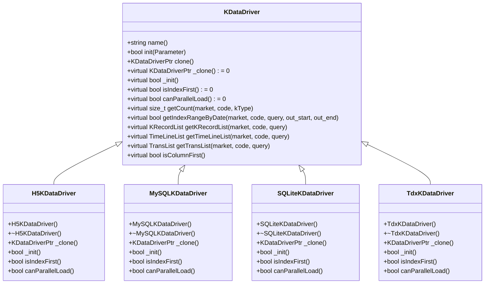
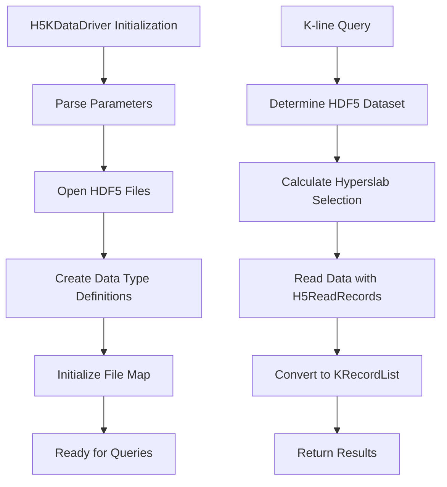
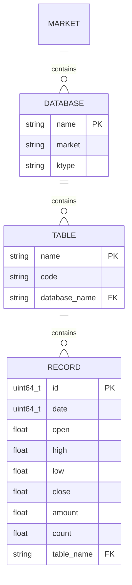
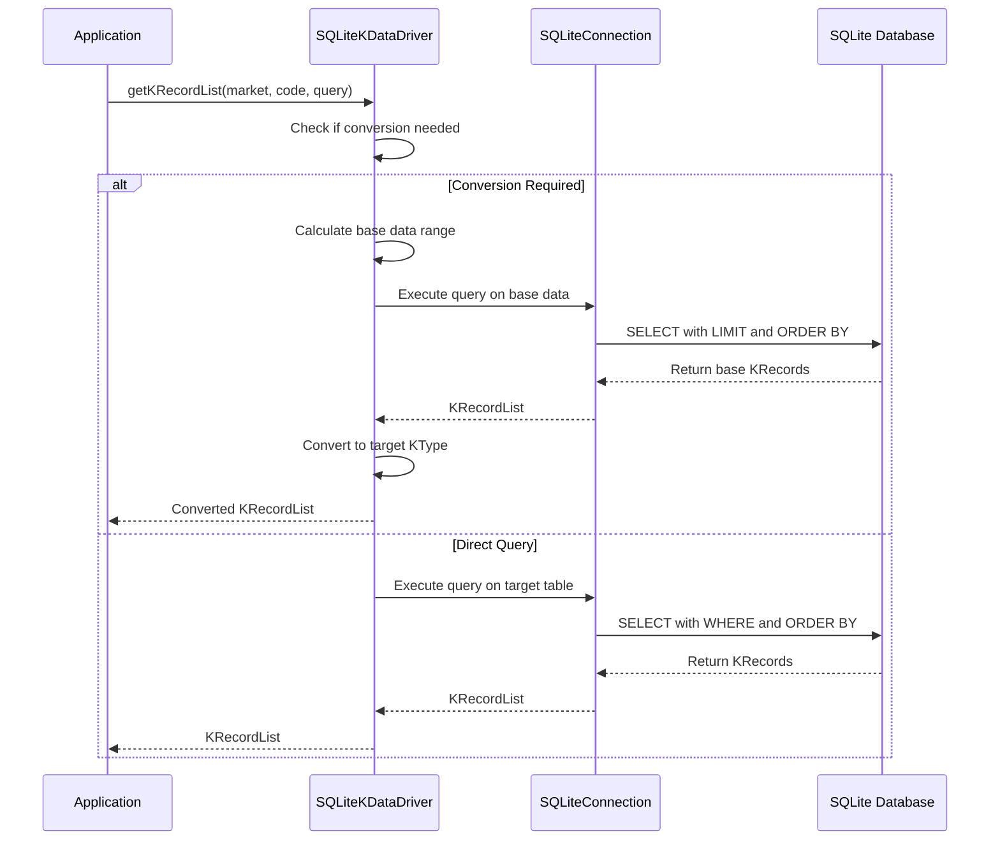
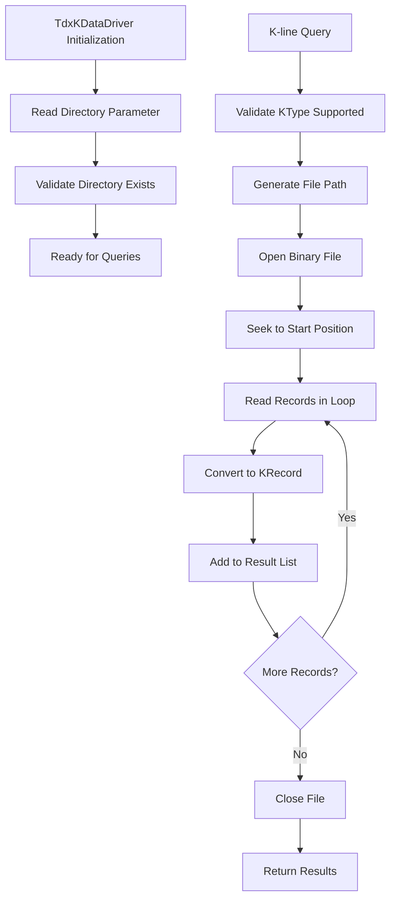
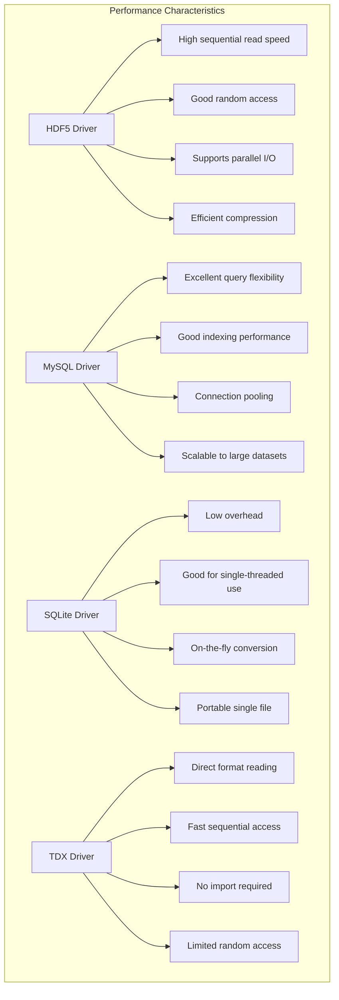
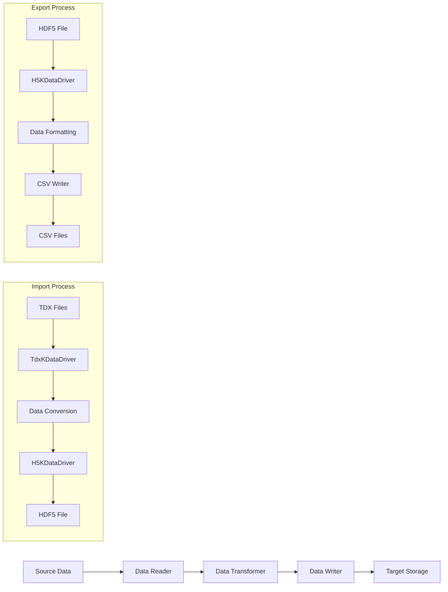
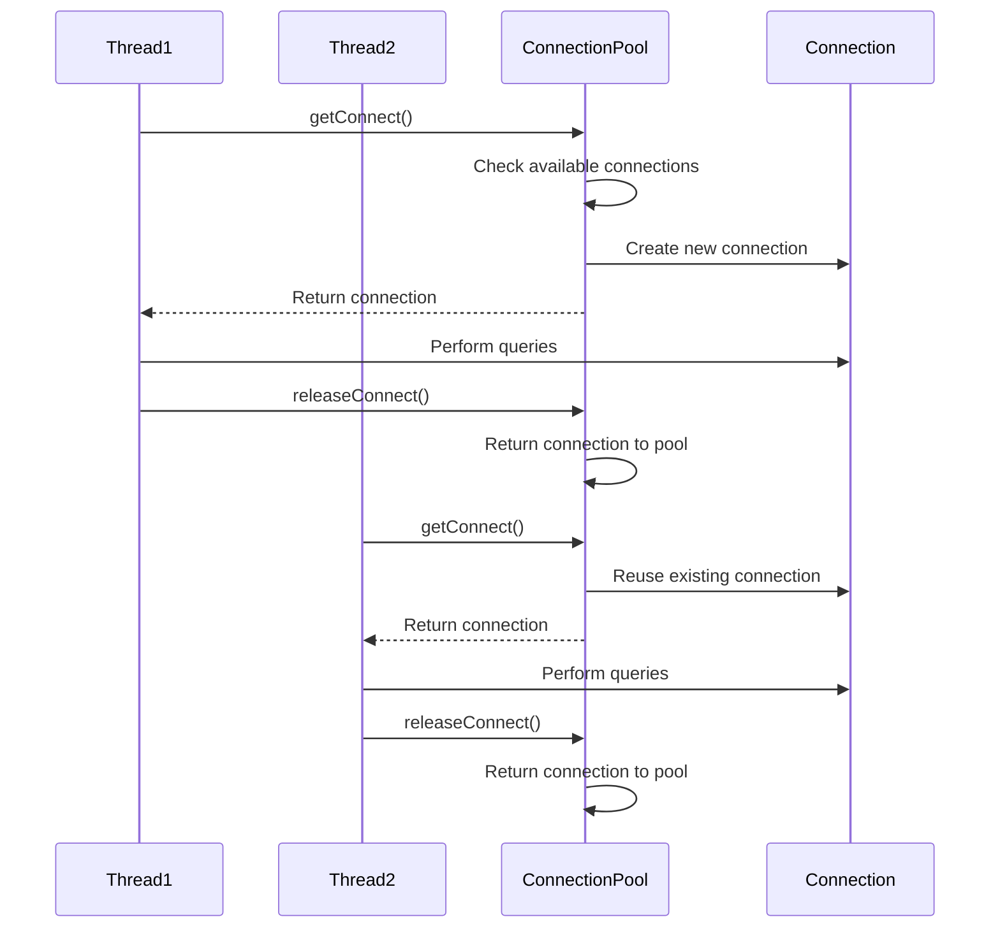

# KData Drivers

<cite>
**Referenced Files in This Document**   
- [KDataDriver.h](file://hikyuu_cpp/hikyuu/data_driver/KDataDriver.h)
- [H5KDataDriver.h](file://hikyuu_cpp/hikyuu/data_driver/kdata/hdf5/H5KDataDriver.h)
- [H5KDataDriver.cpp](file://hikyuu_cpp/hikyuu/data_driver/kdata/hdf5/H5KDataDriver.cpp)
- [H5Record.h](file://hikyuu_cpp/hikyuu/data_driver/kdata/hdf5/H5Record.h)
- [MySQLKDataDriver.h](file://hikyuu_cpp/hikyuu/data_driver/kdata/mysql/MySQLKDataDriver.h)
- [MySQLKDataDriver.cpp](file://hikyuu_cpp/hikyuu/data_driver/kdata/mysql/MySQLKDataDriver.cpp)
- [KRecordTable.h](file://hikyuu_cpp/hikyuu/data_driver/kdata/mysql/KRecordTable.h)
- [SQLiteKDataDriver.h](file://hikyuu_cpp/hikyuu/data_driver/kdata/sqlite/SQLiteKDataDriver.h)
- [SQLiteKDataDriver.cpp](file://hikyuu_cpp/hikyuu/data_driver/kdata/sqlite/SQLiteKDataDriver.cpp)
- [TdxKDataDriver.h](file://hikyuu_cpp/hikyuu/data_driver/kdata/tdx/TdxKDataDriver.h)
- [TdxKDataDriver.cpp](file://hikyuu_cpp/hikyuu/data_driver/kdata/tdx/TdxKDataDriver.cpp)
- [DataDriverFactory.h](file://hikyuu_cpp/hikyuu/data_driver/DataDriverFactory.h)
- [_KDataDriver.cpp](file://hikyuu_pywrap/data_driver/_KDataDriver.cpp)
</cite>

## Table of Contents
1. [Introduction](#introduction)
2. [KDataDriver Interface](#kdatadriver-interface)
3. [HDF5 Driver (H5KDataDriver)](#hdf5-driver-h5kdatadriver)
4. [MySQL Driver (MySQLKDataDriver)](#mysql-driver-mysqlkdatadriver)
5. [SQLite Driver (SQLiteKDataDriver)](#sqlite-driver-sqlitekdatadriver)
6. [TongDaXin Driver (TdxKDataDriver)](#tongdaxin-driver-tdxkdatadriver)
7. [Configuration and Usage](#configuration-and-usage)
8. [Performance Characteristics](#performance-characteristics)
9. [Data Import/Export Operations](#data-importexport-operations)
10. [Thread Safety and Connection Management](#thread-safety-and-connection-management)

## Introduction

The KData drivers in hikyuu provide a unified interface for accessing financial market data from various storage backends. This documentation details the abstract KDataDriver interface and its implementations for HDF5, MySQL, SQLite, and TongDaXin (TDX) native formats. The drivers enable efficient retrieval of K-line data, time series data, and transaction records with consistent query semantics across different storage technologies.

The architecture follows a driver pattern where each implementation inherits from the base KDataDriver class, providing specific functionality for its storage backend while maintaining a consistent API for data access. This allows applications to switch between storage backends with minimal code changes, promoting flexibility and adaptability in different deployment scenarios.

**Section sources**
- [KDataDriver.h](file://hikyuu_cpp/hikyuu/data_driver/KDataDriver.h)

## KDataDriver Interface

The KDataDriver class serves as the abstract base class for all K-line data drivers in hikyuu. It defines a common interface for accessing financial market data regardless of the underlying storage technology. The interface supports various query types, including index-based and date-based queries, and provides methods for retrieving K-line data, time series data, and transaction records.



**Diagram sources**
- [KDataDriver.h](file://hikyuu_cpp/hikyuu/data_driver/KDataDriver.h)
- [H5KDataDriver.h](file://hikyuu_cpp/hikyuu/data_driver/kdata/hdf5/H5KDataDriver.h)
- [MySQLKDataDriver.h](file://hikyuu_cpp/hikyuu/data_driver/kdata/mysql/MySQLKDataDriver.h)
- [SQLiteKDataDriver.h](file://hikyuu_cpp/hikyuu/data_driver/kdata/sqlite/SQLiteKDataDriver.h)
- [TdxKDataDriver.h](file://hikyuu_cpp/hikyuu/data_driver/kdata/tdx/TdxKDataDriver.h)

**Section sources**
- [KDataDriver.h](file://hikyuu_cpp/hikyuu/data_driver/KDataDriver.h)

## HDF5 Driver (H5KDataDriver)

The H5KDataDriver provides high-performance access to financial data stored in HDF5 format. HDF5 is a hierarchical data format designed for efficient storage and retrieval of large datasets, making it ideal for time series financial data. The driver leverages HDF5's chunking and compression features to optimize I/O performance and storage efficiency.

The implementation uses HDF5 compound data types to store K-line records with fields for datetime, open, high, low, close prices, transaction amount, and transaction count. Data is organized in a hierarchical structure with separate groups for different markets and K-line types (e.g., daily, minute, weekly). The driver supports parallel I/O operations when the underlying HDF5 library is compiled with thread safety enabled.



**Diagram sources**
- [H5KDataDriver.h](file://hikyuu_cpp/hikyuu/data_driver/kdata/hdf5/H5KDataDriver.h)
- [H5KDataDriver.cpp](file://hikyuu_cpp/hikyuu/data_driver/kdata/hdf5/H5KDataDriver.cpp)
- [H5Record.h](file://hikyuu_cpp/hikyuu/data_driver/kdata/hdf5/H5Record.h)

**Section sources**
- [H5KDataDriver.h](file://hikyuu_cpp/hikyuu/data_driver/kdata/hdf5/H5KDataDriver.h)
- [H5KDataDriver.cpp](file://hikyuu_cpp/hikyuu/data_driver/kdata/hdf5/H5KDataDriver.cpp)

## MySQL Driver (MySQLKDataDriver)

The MySQLKDataDriver provides access to financial data stored in MySQL databases. The implementation uses a connection pool pattern to manage database connections efficiently, allowing for concurrent access to data. Each market and K-line type combination is stored in a separate database with tables named after securities codes.

The schema structure follows a normalized design with a dedicated table for each security, containing columns for date, open, high, low, close prices, transaction amount, and transaction count. Indexes are created on the date column to optimize date-range queries. The driver implements query optimization techniques such as using LIMIT clauses with offset for index-based queries and optimizing SQL statements based on query patterns.



**Diagram sources**
- [MySQLKDataDriver.h](file://hikyuu_cpp/hikyuu/data_driver/kdata/mysql/MySQLKDataDriver.h)
- [MySQLKDataDriver.cpp](file://hikyuu_cpp/hikyuu/data_driver/kdata/mysql/MySQLKDataDriver.cpp)
- [KRecordTable.h](file://hikyuu_cpp/hikyuu/data_driver/kdata/mysql/KRecordTable.h)

**Section sources**
- [MySQLKDataDriver.h](file://hikyuu_cpp/hikyuu/data_driver/kdata/mysql/MySQLKDataDriver.h)
- [MySQLKDataDriver.cpp](file://hikyuu_cpp/hikyuu/data_driver/kdata/mysql/MySQLKDataDriver.cpp)

## SQLite Driver (SQLiteKDataDriver)

The SQLiteKDataDriver provides access to financial data stored in SQLite databases. Unlike the MySQL implementation, SQLite uses a single database file per market with tables for each security. This implementation supports a unique feature called "on-the-fly conversion" where higher time frame K-lines (e.g., weekly, monthly) can be derived from base time frame data (e.g., daily, 5-minute) when requested.

The driver maintains a connection map that associates market and K-line type combinations with SQLite database connections. For performance optimization, the driver uses prepared statements and leverages SQLite's built-in indexing capabilities. The implementation includes special handling for index-based queries on derived K-line types by calculating the appropriate range in the base data and then aggregating the results.



**Diagram sources**
- [SQLiteKDataDriver.h](file://hikyuu_cpp/hikyuu/data_driver/kdata/sqlite/SQLiteKDataDriver.h)
- [SQLiteKDataDriver.cpp](file://hikyuu_cpp/hikyuu/data_driver/kdata/sqlite/SQLiteKDataDriver.cpp)

**Section sources**
- [SQLiteKDataDriver.h](file://hikyuu_cpp/hikyuu/data_driver/kdata/sqlite/SQLiteKDataDriver.h)
- [SQLiteKDataDriver.cpp](file://hikyuu_cpp/hikyuu/data_driver/kdata/sqlite/SQLiteKDataDriver.cpp)

## TongDaXin Driver (TdxKDataDriver)

The TdxKDataDriver provides direct access to financial data in TongDaXin (TDX) native format. This implementation reads binary files directly without requiring data conversion or import into other formats. The driver supports both daily and minute-level K-line data stored in TDX's proprietary binary format.

The implementation uses memory-mapped file I/O for efficient data access, allowing for random access to specific records without loading the entire file into memory. Data is read in fixed-size structures (TdxDayData for daily data and TdxMinData for minute data) which are then converted to the internal KRecord format. The driver supports index-based queries but has limited support for date-based queries due to the sequential nature of the binary format.



**Diagram sources**
- [TdxKDataDriver.h](file://hikyuu_cpp/hikyuu/data_driver/kdata/tdx/TdxKDataDriver.h)
- [TdxKDataDriver.cpp](file://hikyuu_cpp/hikyuu/data_driver/kdata/tdx/TdxKDataDriver.cpp)

**Section sources**
- [TdxKDataDriver.h](file://hikyuu_cpp/hikyuu/data_driver/kdata/tdx/TdxKDataDriver.h)
- [TdxKDataDriver.cpp](file://hikyuu_cpp/hikyuu/data_driver/kdata/tdx/TdxKDataDriver.cpp)

## Configuration and Usage

KData drivers are configured through parameters passed to the DataDriverFactory, which manages driver instantiation and connection pooling. Each driver type has specific configuration requirements that must be met for proper initialization.

For C++ usage, drivers are typically obtained through the DataDriverFactory:

```cpp
// Example of configuring and using MySQL driver in C++
Parameter param;
param.set<string>("host", "localhost");
param.set<string>("usr", "username");
param.set<string>("pwd", "password");
param.set<string>("port", "3306");
param.set<string>("sh_day", "hikyuu_stock_day.db"); // Shanghai day data
param.set<string>("sz_day", "hikyuu_stock_day.db"); // Shenzhen day data

auto driver_pool = DataDriverFactory::getKDataDriverPool(param);
auto driver_connect = driver_pool->getConnect();
auto kdata = driver_connect->getKRecordList("SH", "600000", KQuery(0, 10));
```

For Python usage, the interface is similar but with Pythonic syntax:

```python
# Example of configuring and using HDF5 driver in Python
from hikyuu import *

# Configure HDF5 driver
config = {
    "sh_day": "/path/to/sh_day.h5",
    "sz_day": "/path/to/sz_day.h5",
    "sh_min": "/path/to/sh_min.h5",
    "sz_min": "/path/to/sz_min.h5"
}

# Get driver instance
driver = get_kdata_driver("hdf5", config)
kdata = driver.get_krecord_list("SH", "600000", Query(0, 10))
```

The configuration parameters vary by driver type:
- **HDF5**: File paths for each market and K-line type combination
- **MySQL**: Database connection parameters and database names
- **SQLite**: File paths for each market and K-line type combination
- **TDX**: Directory path containing TDX data files

**Section sources**
- [DataDriverFactory.h](file://hikyuu_cpp/hikyuu/data_driver/DataDriverFactory.h)
- [_KDataDriver.cpp](file://hikyuu_pywrap/data_driver/_KDataDriver.cpp)

## Performance Characteristics

Each KData driver implementation has distinct performance characteristics based on its underlying storage technology and access patterns.

The H5KDataDriver offers excellent sequential read performance and good random access capabilities due to HDF5's chunking and indexing features. With thread-safe HDF5 libraries, it supports parallel data loading, making it suitable for high-throughput applications. The driver's performance is particularly strong for large contiguous data requests.

The MySQLKDataDriver provides good performance for both random and sequential access patterns, leveraging MySQL's indexing capabilities. It excels at complex queries and supports connection pooling for concurrent access. Performance is highly dependent on proper indexing and query optimization.

The SQLiteKDataDriver offers good performance for single-threaded applications and has minimal setup overhead. It performs well for small to medium datasets but may experience performance degradation with very large datasets or high concurrency due to SQLite's file-based locking mechanism.

The TdxKDataDriver provides fast sequential access to data but has slower random access performance compared to other drivers. Its main advantage is the ability to read data directly from TDX format without conversion, making it ideal for users who already have TDX data.



**Diagram sources**
- [H5KDataDriver.h](file://hikyuu_cpp/hikyuu/data_driver/kdata/hdf5/H5KDataDriver.h)
- [MySQLKDataDriver.h](file://hikyuu_cpp/hikyuu/data_driver/kdata/mysql/MySQLKDataDriver.h)
- [SQLiteKDataDriver.h](file://hikyuu_cpp/hikyuu/data_driver/kdata/sqlite/SQLiteKDataDriver.h)
- [TdxKDataDriver.h](file://hikyuu_cpp/hikyuu/data_driver/kdata/tdx/TdxKDataDriver.h)

**Section sources**
- [H5KDataDriver.h](file://hikyuu_cpp/hikyuu/data_driver/kdata/hdf5/H5KDataDriver.h)
- [MySQLKDataDriver.h](file://hikyuu_cpp/hikyuu/data_driver/kdata/mysql/MySQLKDataDriver.h)
- [SQLiteKDataDriver.h](file://hikyuu_cpp/hikyuu/data_driver/kdata/sqlite/SQLiteKDataDriver.h)
- [TdxKDataDriver.h](file://hikyuu_cpp/hikyuu/data_driver/kdata/tdx/TdxKDataDriver.h)

## Data Import/Export Operations

The hikyuu framework provides tools for importing and exporting K-line data between different storage formats. These operations are essential for data migration, backup, and integration with external data sources.

For HDF5 data, the framework includes utilities for importing data from CSV files and other formats. The import process typically involves:
1. Creating the HDF5 file structure
2. Defining the appropriate data types
3. Writing data in chunks for optimal performance
4. Creating indexes for fast access

MySQL and SQLite drivers support data import through bulk insert operations and transaction batching to minimize overhead. The framework provides specialized tools for importing data from TDX format into HDF5, MySQL, or SQLite databases, preserving the original data structure while optimizing it for the target storage format.

Export operations follow a similar pattern, with data being read from the source driver and written to the target format. The framework supports batch processing capabilities that allow for efficient processing of large datasets by loading and processing data in manageable chunks.



**Diagram sources**
- [H5KDataDriver.cpp](file://hikyuu_cpp/hikyuu/data_driver/kdata/hdf5/H5KDataDriver.cpp)
- [TdxKDataDriver.cpp](file://hikyuu_cpp/hikyuu/data_driver/kdata/tdx/TdxKDataDriver.cpp)

**Section sources**
- [H5KDataDriver.cpp](file://hikyuu_cpp/hikyuu/data_driver/kdata/hdf5/H5KDataDriver.cpp)
- [TdxKDataDriver.cpp](file://hikyuu_cpp/hikyuu/data_driver/kdata/tdx/TdxKDataDriver.cpp)

## Thread Safety and Connection Management

The KData driver implementations have varying levels of thread safety and connection management capabilities.

The H5KDataDriver supports parallel data loading when the underlying HDF5 library is compiled with thread safety enabled (H5_HAVE_THREADSAFE). When thread safety is not available, the driver issues a warning and disables parallel loading. The driver maintains a file map that caches opened HDF5 files, reducing the overhead of repeated file operations.

The MySQLKDataDriver and SQLiteKDataDriver both support concurrent access through connection pooling mechanisms. The MySQL implementation uses a dedicated connection pool that manages multiple database connections, allowing for efficient sharing of connections across threads. The SQLite driver manages connections through a connection map, with each market and K-line type combination having its own connection.

The TdxKDataDriver supports concurrent access through file-level locking mechanisms, allowing multiple threads to read from the same data files simultaneously. However, write operations are serialized to prevent data corruption.

All drivers follow the RAII (Resource Acquisition Is Initialization) pattern, ensuring that resources are properly cleaned up when objects go out of scope. The DataDriverFactory manages driver lifecycles and provides methods for releasing resources when they are no longer needed.



**Diagram sources**
- [DataDriverFactory.h](file://hikyuu_cpp/hikyuu/data_driver/DataDriverFactory.h)
- [H5KDataDriver.h](file://hikyuu_cpp/hikyuu/data_driver/kdata/hdf5/H5KDataDriver.h)
- [MySQLKDataDriver.h](file://hikyuu_cpp/hikyuu/data_driver/kdata/mysql/MySQLKDataDriver.h)
- [SQLiteKDataDriver.h](file://hikyuu_cpp/hikyuu/data_driver/kdata/sqlite/SQLiteKDataDriver.h)

**Section sources**
- [DataDriverFactory.h](file://hikyuu_cpp/hikyuu/data_driver/DataDriverFactory.h)
- [H5KDataDriver.h](file://hikyuu_cpp/hikyuu/data_driver/kdata/hdf5/H5KDataDriver.h)
- [MySQLKDataDriver.h](file://hikyuu_cpp/hikyuu/data_driver/kdata/mysql/MySQLKDataDriver.h)
- [SQLiteKDataDriver.h](file://hikyuu_cpp/hikyuu/data_driver/kdata/sqlite/SQLiteKDataDriver.h)