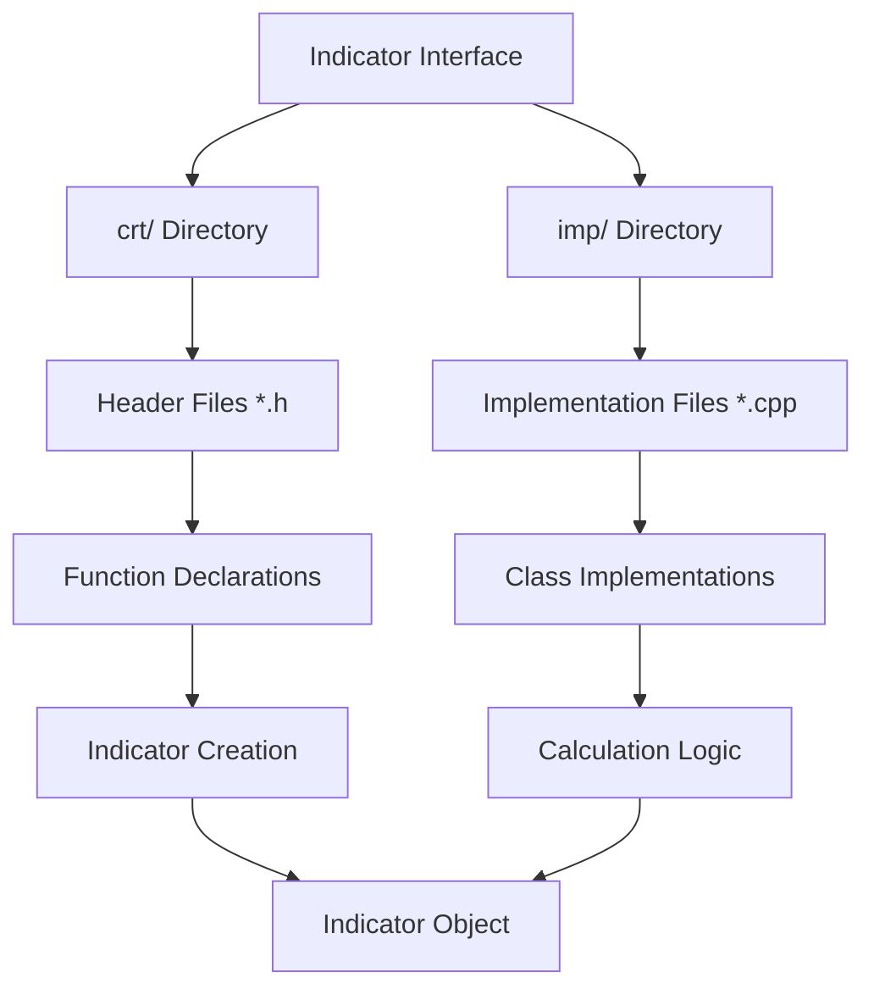
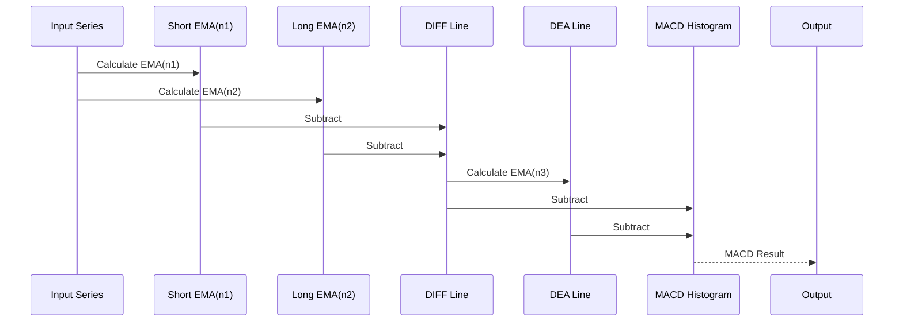

# Built-in Indicators

<cite>
**Referenced Files in This Document**   
- [build_in.h](file://hikyuu_cpp/hikyuu/indicator/build_in.h)
- [build_in.cpp](file://hikyuu_cpp/hikyuu/indicator/build_in.cpp)
- [Indicator.h](file://hikyuu_cpp/hikyuu/indicator/Indicator.h)
- [Indicator.cpp](file://hikyuu_cpp/hikyuu/indicator/Indicator.cpp)
- [MA.h](file://hikyuu_cpp/hikyuu/indicator/crt/MA.h)
- [IMa.h](file://hikyuu_cpp/hikyuu/indicator/imp/IMa.h)
- [EMA.h](file://hikyuu_cpp/hikyuu/indicator/crt/EMA.h)
- [IEma.h](file://hikyuu_cpp/hikyuu/indicator/imp/IEma.h)
- [MACD.h](file://hikyuu_cpp/hikyuu/indicator/crt/MACD.h)
- [IMacd.h](file://hikyuu_cpp/hikyuu/indicator/imp/IMacd.h)
- [RSI.h](file://hikyuu_cpp/hikyuu/indicator/crt/RSI.h)
- [ABS.h](file://hikyuu_cpp/hikyuu/indicator/crt/ABS.h)
- [SQRT.h](file://hikyuu_cpp/hikyuu/indicator/crt/SQRT.h)
- [SIN.h](file://hikyuu_cpp/hikyuu/indicator/crt/SIN.h)
- [COS.h](file://hikyuu_cpp/hikyuu/indicator/crt/COS.h)
- [CORR.h](file://hikyuu_cpp/hikyuu/indicator/crt/CORR.h)
- [STDEV.h](file://hikyuu_cpp/hikyuu/indicator/crt/STDEV.h)
- [REF.h](file://hikyuu_cpp/hikyuu/indicator/crt/REF.h)
- [REFX.h](file://hikyuu_cpp/hikyuu/indicator/crt/REFX.h)
- [BACKSET.h](file://hikyuu_cpp/hikyuu/indicator/crt/BACKSET.h)
- [BARSLAST.h](file://hikyuu_cpp/hikyuu/indicator/crt/BARSLAST.h)
- [TURNOVER.h](file://hikyuu_cpp/hikyuu/indicator/crt/TURNOVER.h)
- [KDATA.h](file://hikyuu_cpp/hikyuu/indicator/crt/KDATA.h)
- [FILTER.h](file://hikyuu_cpp/hikyuu/indicator/crt/FILTER.h)
</cite>

## Table of Contents
1. [Introduction](#introduction)
2. [Indicator Architecture](#indicator-architecture)
3. [Mathematical Functions](#mathematical-functions)
4. [Statistical Functions](#statistical-functions)
5. [Time Series Operations](#time-series-operations)
6. [Financial Indicators](#financial-indicators)
7. [Indicator Chaining and Conditional Evaluation](#indicator-chaining-and-conditional-evaluation)
8. [Performance Considerations](#performance-considerations)
9. [Data Type and Precision Handling](#data-type-and-precision-handling)
10. [Conclusion](#conclusion)

## Introduction
The Hikyuu framework provides a comprehensive suite of built-in technical indicators for financial analysis and algorithmic trading. This documentation details the implementation, usage, and characteristics of these indicators, organized by category. The framework supports mathematical functions, statistical calculations, time series operations, and specialized financial indicators. Each indicator is implemented using a macro-based system that separates the interface definition in the crt/ directory from the implementation in the imp/ directory. The system enables efficient indicator chaining, conditional evaluation, and data alignment across different time frames.

**Section sources**
- [build_in.h](file://hikyuu_cpp/hikyuu/indicator/build_in.h#L1-L135)
- [Indicator.h](file://hikyuu_cpp/hikyuu/indicator/Indicator.h#L1-L488)

## Indicator Architecture
The Hikyuu indicator system follows a modular architecture with a clear separation between interface and implementation. The framework uses a macro-based indicator creation system where each indicator has a header file in the crt/ directory that defines the interface and a corresponding implementation file in the imp/ directory.



**Diagram sources**
- [build_in.h](file://hikyuu_cpp/hikyuu/indicator/build_in.h#L1-L135)
- [Indicator.h](file://hikyuu_cpp/hikyuu/indicator/Indicator.h#L1-L488)

The core of the indicator system is the Indicator class, which serves as a wrapper around the actual implementation (IndicatorImp). This design allows for polymorphic behavior and efficient memory management. The build_in.h header file includes all the built-in indicator headers, making them available throughout the framework.

**Section sources**
- [build_in.h](file://hikyuu_cpp/hikyuu/indicator/build_in.h#L1-L135)
- [build_in.cpp](file://hikyuu_cpp/hikyuu/indicator/build_in.cpp#L1-L11)
- [Indicator.h](file://hikyuu_cpp/hikyuu/indicator/Indicator.h#L1-L488)
- [Indicator.cpp](file://hikyuu_cpp/hikyuu/indicator/Indicator.cpp#L1-L345)

## Mathematical Functions
The Hikyuu framework provides a comprehensive set of mathematical functions as built-in indicators. These functions operate element-wise on time series data and include basic arithmetic operations, trigonometric functions, and exponential calculations.

### ABS - Absolute Value
The ABS indicator computes the absolute value of each element in the input series.

**Parameters:**
- Input: Time series data

**Return Value:**
- Time series with absolute values

**Usage Examples:**
```cpp
// C++ usage
Indicator abs_result = ABS(input_series);
```

```python
# Python usage
abs_result = hikyuu.ABS(input_series)
```

### SQRT - Square Root
The SQRT indicator computes the square root of each element in the input series.

**Parameters:**
- Input: Time series data (non-negative values)

**Return Value:**
- Time series with square root values

### SIN and COS - Trigonometric Functions
The SIN and COS indicators compute the sine and cosine of each element in the input series, respectively.

**Parameters:**
- Input: Time series data (in radians)

**Return Value:**
- Time series with trigonometric function values

**Section sources**
- [ABS.h](file://hikyuu_cpp/hikyuu/indicator/crt/ABS.h)
- [SQRT.h](file://hikyuu_cpp/hikyuu/indicator/crt/SQRT.h)
- [SIN.h](file://hikyuu_cpp/hikyuu/indicator/crt/SIN.h)
- [COS.h](file://hikyuu_cpp/hikyuu/indicator/crt/COS.h)

## Statistical Functions
The Hikyuu framework includes several statistical functions for analyzing financial time series data.

### CORR - Correlation Coefficient
The CORR indicator calculates the Pearson correlation coefficient between two time series over a specified window.

**Parameters:**
- Series1: First time series
- Series2: Second time series
- Window: Calculation window size

**Return Value:**
- Time series with correlation coefficients

### SPEARMAN - Spearman Rank Correlation
The SPEARMAN indicator computes the Spearman rank correlation coefficient between two time series.

**Parameters:**
- Series1: First time series
- Series2: Second time series
- Window: Calculation window size

**Return Value:**
- Time series with Spearman correlation coefficients

### STDEV - Standard Deviation
The STDEV indicator calculates the standard deviation of a time series over a rolling window.

**Parameters:**
- Input: Time series data
- Window: Rolling window size

**Return Value:**
- Time series with standard deviation values

**Section sources**
- [CORR.h](file://hikyuu_cpp/hikyuu/indicator/crt/CORR.h)
- [SPEARMAN.h](file://hikyuu_cpp/hikyuu/indicator/crt/SPEARMAN.h)
- [STDEV.h](file://hikyuu_cpp/hikyuu/indicator/crt/STDEV.h)

## Time Series Operations
The framework provides several operations specifically designed for time series data manipulation.

### REF - Reference Past Values
The REF indicator references values from a specified number of periods in the past.

**Parameters:**
- Input: Time series data
- Periods: Number of periods to look back

**Return Value:**
- Time series with referenced values

### REFX - Extended Reference
The REFX indicator provides extended referencing capabilities with additional options.

**Parameters:**
- Input: Time series data
- Periods: Number of periods to look back
- Options: Additional reference options

**Return Value:**
- Time series with referenced values

### BACKSET - Backward Set
The BACKSET indicator sets values backward from positions where a condition is true.

**Parameters:**
- Condition: Boolean series indicating trigger points
- Periods: Number of periods to set backward
- Value: Value to set

**Return Value:**
- Time series with backward-set values

### BARSLAST - Bars Since Last Condition
The BARSLAST indicator returns the number of bars since the last occurrence of a condition.

**Parameters:**
- Condition: Boolean series

**Return Value:**
- Time series with bar counts since last condition

**Section sources**
- [REF.h](file://hikyuu_cpp/hikyuu/indicator/crt/REF.h)
- [REFX.h](file://hikyuu_cpp/hikyuu/indicator/crt/REFX.h)
- [BACKSET.h](file://hikyuu_cpp/hikyuu/indicator/crt/BACKSET.h)
- [BARSLAST.h](file://hikyuu_cpp/hikyuu/indicator/crt/BARSLAST.h)

## Financial Indicators
The Hikyuu framework includes a comprehensive set of financial indicators commonly used in technical analysis.

### MA - Simple Moving Average
The MA indicator calculates the simple moving average of a time series over a specified window.

**Parameters:**
- Input: Time series data (default: closing prices)
- n: Period window (default: 22)

**Calculation Algorithm:**
For each position i in the series:
MA[i] = (P[i] + P[i-1] + ... + P[i-n+1]) / n

**Return Value:**
- Single time series with moving average values

**Usage Examples:**
```cpp
// C++ usage
Indicator ma_result = MA(close_prices, 20);
```

```python
# Python usage
ma_result = hikyuu.MA(close_prices, 20)
```

### EMA - Exponential Moving Average
The EMA indicator calculates the exponential moving average with a smoothing factor based on the period.

**Parameters:**
- Input: Time series data
- n: Period window (must be > 0)

**Calculation Algorithm:**
Smoothing factor α = 2 / (n + 1)
EMA[0] = P[0]
EMA[i] = α × P[i] + (1 - α) × EMA[i-1]

**Return Value:**
- Single time series with EMA values

### MACD - Moving Average Convergence Divergence
The MACD indicator calculates the MACD series with three components: MACD line, signal line, and histogram.

**Parameters:**
- Input: Time series data
- n1: Short-term EMA period (default: 12)
- n2: Long-term EMA period (default: 26)
- n3: Signal line EMA period (default: 9)

**Calculation Algorithm:**
1. Calculate short-term EMA (n1)
2. Calculate long-term EMA (n2)
3. DIFF = Short-term EMA - Long-term EMA
4. DEA = EMA of DIFF with period n3
5. MACD Histogram = DIFF - DEA

**Return Value:**
- Three time series:
  - MACD Histogram (BAR)
  - DIFF line (fast line)
  - DEA line (slow line)



**Diagram sources**
- [MACD.h](file://hikyuu_cpp/hikyuu/indicator/crt/MACD.h#L1-L63)
- [IMacd.h](file://hikyuu_cpp/hikyuu/indicator/imp/IMacd.h#L1-L42)

### RSI - Relative Strength Index
The RSI indicator measures the speed and change of price movements.

**Parameters:**
- Input: Time series data
- n: Period window (default: 14)

**Calculation Algorithm:**
1. Calculate price changes
2. Separate gains and losses
3. Calculate average gain and average loss over n periods
4. RS = Average Gain / Average Loss
5. RSI = 100 - (100 / (1 + RS))

**Return Value:**
- Single time series with RSI values (0-100 range)

### TURNOVER - Turnover Rate
The TURNOVER indicator calculates the trading volume relative to the total shares outstanding.

**Parameters:**
- Volume: Trading volume series
- FloatShares: Float shares series

**Calculation Algorithm:**
Turnover = Volume / FloatShares

**Return Value:**
- Time series with turnover rate values

**Section sources**
- [MA.h](file://hikyuu_cpp/hikyuu/indicator/crt/MA.h#L1-L45)
- [IMa.h](file://hikyuu_cpp/hikyuu/indicator/imp/IMa.h#L1-L28)
- [EMA.h](file://hikyuu_cpp/hikyuu/indicator/crt/EMA.h#L1-L45)
- [IEma.h](file://hikyuu_cpp/hikyuu/indicator/imp/IEma.h#L1-L30)
- [MACD.h](file://hikyuu_cpp/hikyuu/indicator/crt/MACD.h#L1-L63)
- [IMacd.h](file://hikyuu_cpp/hikyuu/indicator/imp/IMacd.h#L1-L42)
- [RSI.h](file://hikyuu_cpp/hikyuu/indicator/crt/RSI.h#L1-L28)
- [TURNOVER.h](file://hikyuu_cpp/hikyuu/indicator/crt/TURNOVER.h)

## Indicator Chaining and Conditional Evaluation
The Hikyuu framework supports advanced features for combining indicators and conditional evaluation.

### Indicator Chaining
Indicators can be chained together to create complex calculations. The framework supports operator overloading for arithmetic operations.

```mermaid
flowchart TD
A[Price Data] --> B[MA(20)]
B --> C[MA(50)]
C --> D[CROSS]
D --> E[Buy Signal]
A --> F[RSI(14)]
F --> G[OVERBOUGHT]
G --> H[Sell Signal]
```

**Diagram sources**
- [Indicator.h](file://hikyuu_cpp/hikyuu/indicator/Indicator.h#L379-L430)
- [Indicator.cpp](file://hikyuu_cpp/hikyuu/indicator/Indicator.cpp#L121-L314)

### IF - Conditional Evaluation
The IF indicator implements conditional logic for time series data.

**Parameters:**
- Condition: Boolean series
- TrueValue: Value when condition is true
- FalseValue: Value when condition is false

**Usage Examples:**
```cpp
// C++ usage
Indicator result = IF(close > open, high, low);
```

```python
# Python usage
result = hikyuu.IF(close > open, high, low)
```

### FILTER - Data Filtering
The FILTER indicator selects data based on specified conditions.

**Parameters:**
- Input: Time series data
- Condition: Filtering condition
- Options: Filter options

**Return Value:**
- Filtered time series

**Section sources**
- [Indicator.h](file://hikyuu_cpp/hikyuu/indicator/Indicator.h#L459-L463)
- [Indicator.cpp](file://hikyuu_cpp/hikyuu/indicator/Indicator.cpp#L324-L342)
- [FILTER.h](file://hikyuu_cpp/hikyuu/indicator/crt/FILTER.h)
- [KDATA.h](file://hikyuu_cpp/hikyuu/indicator/crt/KDATA.h)

## Performance Considerations
When using complex indicator combinations in the Hikyuu framework, several performance considerations should be taken into account.

### Memory Usage Patterns
The indicator system uses shared pointers (IndicatorImpPtr) for memory management, which helps reduce memory overhead when indicators are chained or reused. However, complex indicator combinations can still consume significant memory, especially with large datasets.

### Optimization Strategies
1. **Minimize Indicator Chaining Depth**: Deep chains of indicators can lead to performance degradation. Consider simplifying complex expressions.
2. **Use Appropriate Window Sizes**: Larger window sizes require more memory and computation time.
3. **Cache Intermediate Results**: When using the same indicator in multiple calculations, store the result in a variable.
4. **Avoid Redundant Calculations**: The framework automatically optimizes some redundant calculations, but explicit optimization can further improve performance.

### Computational Complexity
The computational complexity varies by indicator type:
- Mathematical functions: O(n) where n is the series length
- Moving averages: O(n × w) where w is the window size
- Correlation functions: O(n × w) where w is the window size
- Recursive indicators (EMA, MACD): O(n)

**Section sources**
- [Indicator.h](file://hikyuu_cpp/hikyuu/indicator/Indicator.h#L1-L488)
- [Indicator.cpp](file://hikyuu_cpp/hikyuu/indicator/Indicator.cpp#L1-L345)

## Data Type and Precision Handling
The Hikyuu framework addresses several important aspects of data type and precision in financial calculations.

### NaN Value Handling
The framework includes specific functions for handling NaN (Not a Number) values in time series data:
- ISNA: Checks for NaN values
- DROPNA: Removes NaN values
- RECOVER: Fills NaN values with specified values

### Data Type Conversions
The system automatically handles data type conversions between different numeric types, ensuring consistent calculation results. The IndParam class facilitates parameter passing with type safety.

### Precision Limitations
Financial calculations are subject to floating-point precision limitations. The framework uses double-precision floating-point numbers (double) for calculations and defines a threshold (IND_EQ_THRESHOLD = 0.000001) for comparing floating-point values.

**Section sources**
- [Indicator.h](file://hikyuu_cpp/hikyuu/indicator/Indicator.h#L17)
- [Indicator.cpp](file://hikyuu_cpp/hikyuu/indicator/Indicator.cpp#L60-L79)
- [ISNA.h](file://hikyuu_cpp/hikyuu/indicator/crt/ISNA.h)
- [DROPNA.h](file://hikyuu_cpp/hikyuu/indicator/crt/DROPNA.h)
- [RECOVER.h](file://hikyuu_cpp/hikyuu/indicator/crt/RECOVER.h)

## Conclusion
The Hikyuu framework provides a comprehensive and flexible system for technical indicator calculations. The architecture separates interface definitions from implementations, allowing for efficient code organization and maintenance. The framework supports a wide range of mathematical, statistical, and financial indicators, along with advanced features like indicator chaining and conditional evaluation. When using complex indicator combinations, developers should consider performance implications and memory usage patterns. The system handles data type conversions and precision limitations appropriately for financial calculations. The comprehensive API allows for both C++ and Python usage, making it accessible to a wide range of developers and quantitative analysts.