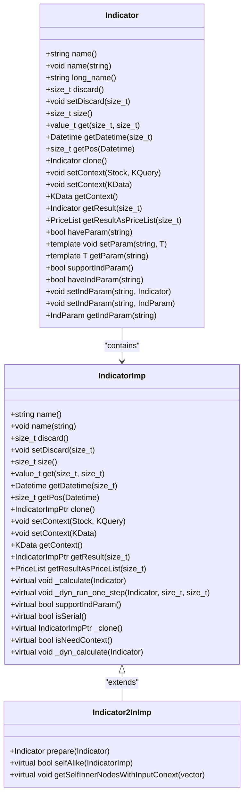
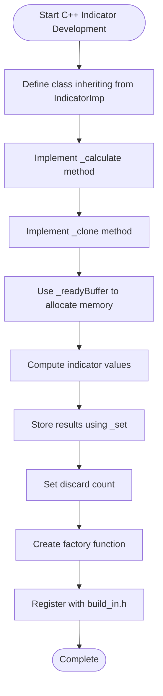
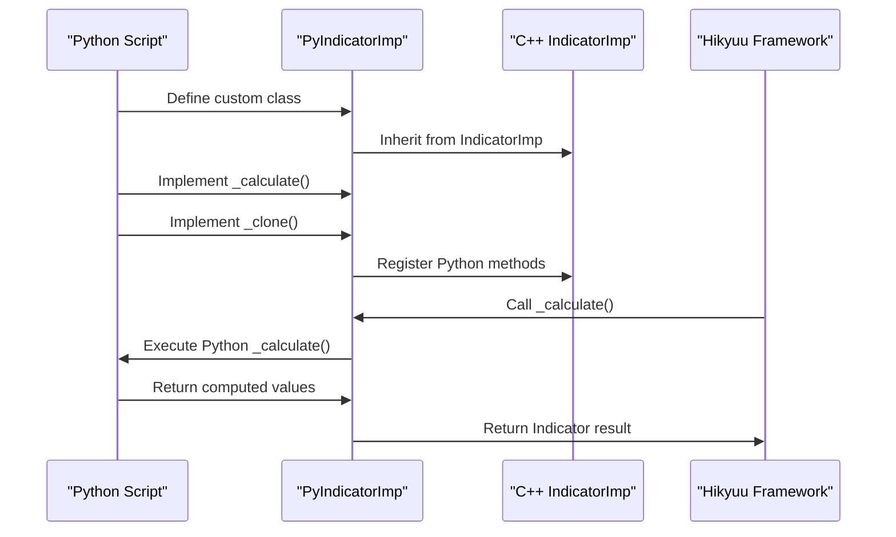
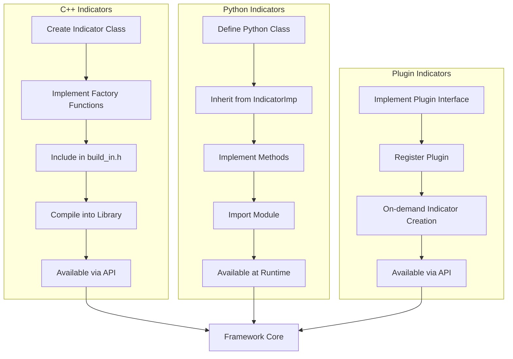
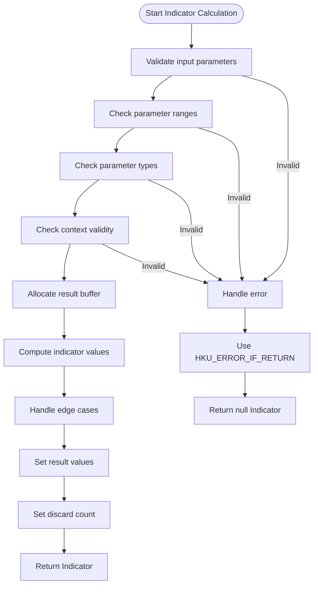
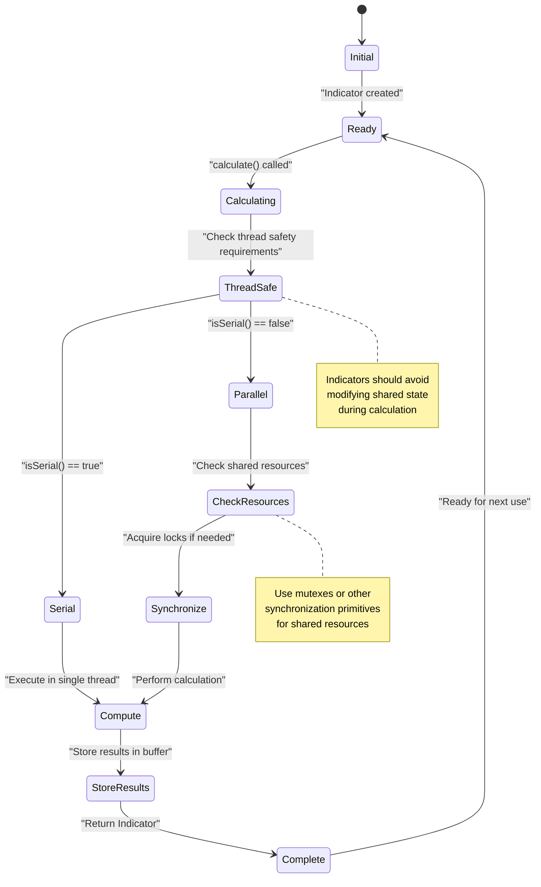
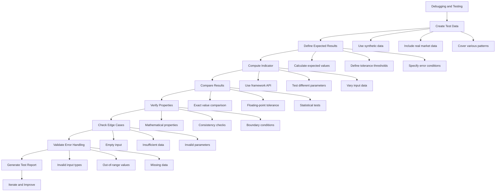

# Custom Indicator Development

<cite>
**Referenced Files in This Document**   
- [__init__.py](file://hikyuu/indicator/__init__.py)
- [indicator.py](file://hikyuu/indicator/indicator.py)
- [pyind.py](file://hikyuu/indicator/pyind.py)
- [Indicator.h](file://hikyuu_cpp/hikyuu/indicator/Indicator.h)
- [Indicator.cpp](file://hikyuu_cpp/hikyuu/indicator/Indicator.cpp)
- [IndicatorImp.h](file://hikyuu_cpp/hikyuu/indicator/IndicatorImp.h)
- [build_in.h](file://hikyuu_cpp/hikyuu/indicator/build_in.h)
- [IndParam.h](file://hikyuu_cpp/hikyuu/indicator/IndParam.h)
- [_Indicator.cpp](file://hikyuu_pywrap/indicator/_Indicator.cpp)
- [_build_in.cpp](file://hikyuu_pywrap/indicator/_build_in.cpp)
- [ExtendIndicatorsPluginInterface.h](file://hikyuu_cpp/hikyuu/plugin/interface/ExtendIndicatorsPluginInterface.h)
- [extind.cpp](file://hikyuu_cpp/hikyuu/plugin/extind.cpp)
- [_extind.cpp](file://hikyuu_pywrap/plugin/_extind.cpp)
- [MA.h](file://hikyuu_cpp/hikyuu/indicator/crt/MA.h)
- [SMA.h](file://hikyuu_cpp/hikyuu/indicator/crt/SMA.h)
- [RSI.h](file://hikyuu_cpp/hikyuu/indicator/crt/RSI.h)
- [Indicator2InImp.h](file://hikyuu_cpp/hikyuu/indicator/Indicator2InImp.h)
- [_IndicatorImp.cpp](file://hikyuu_pywrap/indicator/_IndicatorImp.cpp)
</cite>

## Table of Contents
1. [Introduction](#introduction)
2. [Indicator Class Hierarchy](#indicator-class-hierarchy)
3. [C++ Custom Indicator Development](#cpp-custom-indicator-development)
4. [Python Custom Indicator Development](#python-custom-indicator-development)
5. [Indicator Registration and Integration](#indicator-registration-and-integration)
6. [Parameter Validation and Error Handling](#parameter-validation-and-error-handling)
7. [Performance Optimization](#performance-optimization)
8. [Thread Safety Considerations](#thread-safety-considerations)
9. [Memory Management](#memory-management)
10. [Debugging and Testing](#debugging-and-testing)
11. [Common Pitfalls and Best Practices](#common-pitfalls-and-best-practices)
12. [Conclusion](#conclusion)

## Introduction

This document provides comprehensive guidance for developing custom indicators in the Hikyuu quantitative trading framework. The Hikyuu framework offers a flexible and extensible architecture for creating technical indicators, supporting both C++ and Python implementations. Custom indicators are essential for implementing proprietary trading strategies, extending the framework's analytical capabilities, and integrating specialized financial calculations.

The document covers the complete development lifecycle for custom indicators, from understanding the class hierarchy and inheritance patterns to implementing, registering, and optimizing indicators. It addresses both C++ template-based development and Python inheritance approaches, highlighting the differences between the build_in.h system for C++ indicators and dynamic Python class creation. Special attention is given to critical aspects such as memory management, thread safety, parameter validation, error handling, and performance optimization.

The framework's indicator system is designed with performance and flexibility in mind, utilizing a sophisticated architecture that separates the indicator interface from its implementation. This separation allows for efficient computation, proper memory management, and seamless integration between C++ and Python components. The document will explore these architectural decisions and provide practical examples to illustrate best practices for custom indicator development.

**Section sources**
- [Indicator.h](file://hikyuu_cpp/hikyuu/indicator/Indicator.h#L1-L488)
- [IndicatorImp.h](file://hikyuu_cpp/hikyuu/indicator/IndicatorImp.h#L1-L491)

## Indicator Class Hierarchy

The Hikyuu indicator system follows a well-defined class hierarchy that separates the indicator interface from its implementation. At the core of this architecture is the `Indicator` class, which serves as the public interface for all indicators. This class provides a comprehensive API for accessing indicator data, managing parameters, and performing operations, while delegating the actual computation to an implementation object.

The `Indicator` class acts as a wrapper around a shared pointer to an `IndicatorImp` object, which contains the actual implementation details. This design pattern enables efficient memory management through shared ownership and allows for transparent cloning and copying of indicators. The `Indicator` class provides methods for accessing indicator values, managing context, and performing arithmetic operations, but it does not contain any computation logic itself.

The `IndicatorImp` class is the abstract base class for all indicator implementations and is designed to be inherited by concrete indicator classes. It defines the interface for indicator calculation through the `_calculate` method, which must be implemented by derived classes. The class also provides infrastructure for parameter management, context handling, and result buffering. Key features of the `IndicatorImp` class include:

- **Parameter Support**: The class inherits from `Parameter` through the `PARAMETER_SUPPORT_WITH_CHECK` macro, enabling flexible parameter management.
- **Result Buffering**: It manages multiple result sets with configurable discard counts and provides methods for accessing computed values.
- **Context Management**: It supports setting and retrieving context information, such as the associated stock and KData query.
- **Serialization**: The class is designed to support serialization through Boost.Serialization.

The inheritance hierarchy is further extended by specialized base classes like `Indicator2InImp`, which provides functionality for indicators that require two input sources with the same context. This class implements additional features for handling multiple inputs and optimizing computation through shared context.



**Diagram sources **
- [Indicator.h](file://hikyuu_cpp/hikyuu/indicator/Indicator.h#L40-L259)
- [IndicatorImp.h](file://hikyuu_cpp/hikyuu/indicator/IndicatorImp.h#L28-L365)
- [Indicator2InImp.h](file://hikyuu_cpp/hikyuu/indicator/Indicator2InImp.h#L15-L51)

**Section sources**
- [Indicator.h](file://hikyuu_cpp/hikyuu/indicator/Indicator.h#L40-L259)
- [IndicatorImp.h](file://hikyuu_cpp/hikyuu/indicator/IndicatorImp.h#L28-L365)
- [Indicator2InImp.h](file://hikyuu_cpp/hikyuu/indicator/Indicator2InImp.h#L15-L51)

## C++ Custom Indicator Development

Developing custom indicators in C++ involves creating a new class that inherits from `IndicatorImp` and implementing the required virtual methods. The process follows a standardized pattern that ensures consistency across the framework and proper integration with the existing indicator ecosystem. The key steps include defining the indicator class, implementing the calculation logic, and creating factory functions for indicator creation.

To create a new indicator, developers must define a class that inherits from `IndicatorImp` and implement the `_calculate` method, which contains the core computation logic. The class should also override the `_clone` method to enable proper cloning of the indicator instance. The `INDICATOR_IMP` macro provides a convenient way to declare these required methods with the appropriate override specifiers.

The calculation process typically involves several steps:
1. Preparing the input data and context
2. Allocating memory for the result buffer using `_readyBuffer`
3. Computing the indicator values and storing them in the buffer using `_set`
4. Setting the appropriate discard count

For example, a simple moving average indicator would inherit from `IndicatorImp`, implement the `_calculate` method to compute the average over a specified window, and use the `_readyBuffer` method to allocate memory for the results. The indicator would also need to handle edge cases, such as insufficient data for the calculation window.



**Diagram sources **
- [IndicatorImp.h](file://hikyuu_cpp/hikyuu/indicator/IndicatorImp.h#L28-L365)
- [MA.h](file://hikyuu_cpp/hikyuu/indicator/crt/MA.h#L16-L44)
- [SMA.h](file://hikyuu_cpp/hikyuu/indicator/crt/SMA.h#L16-L72)

**Section sources**
- [IndicatorImp.h](file://hikyuu_cpp/hikyuu/indicator/IndicatorImp.h#L28-L365)
- [MA.h](file://hikyuu_cpp/hikyuu/indicator/crt/MA.h#L16-L44)
- [SMA.h](file://hikyuu_cpp/hikyuu/indicator/crt/SMA.h#L16-L72)

## Python Custom Indicator Development

Python-based custom indicator development in Hikyuu leverages the framework's Python bindings to provide a more accessible and flexible approach compared to C++ development. The process involves creating a Python class that inherits from `IndicatorImp` and implementing the required methods, with the framework handling the underlying C++ integration through pybind11.

The Python development workflow is significantly simplified compared to C++, as developers can focus on the algorithmic logic without worrying about memory management or compilation. The framework provides a Python wrapper class `PyIndicatorImp` that handles the interface between Python and C++, allowing Python methods to override the virtual methods of the C++ `IndicatorImp` class.

To create a custom indicator in Python, developers must:
1. Import the necessary modules from hikyuu
2. Define a class that inherits from `IndicatorImp`
3. Implement the `_calculate` method with the indicator logic
4. Override the `_clone` method to return a new instance
5. Optionally implement other methods like `isNeedContext` if the indicator requires context

The Python approach offers several advantages, including rapid prototyping, easier debugging, and access to the extensive Python data science ecosystem. However, it may have performance implications compared to optimized C++ implementations, especially for computationally intensive indicators.



**Diagram sources **
- [_IndicatorImp.cpp](file://hikyuu_pywrap/indicator/_IndicatorImp.cpp#L1-L46)
- [pyind.py](file://hikyuu/indicator/pyind.py#L30-L47)
- [indicator.py](file://hikyuu/indicator/indicator.py#L106-L120)

**Section sources**
- [_IndicatorImp.cpp](file://hikyuu_pywrap/indicator/_IndicatorImp.cpp#L1-L46)
- [pyind.py](file://hikyuu/indicator/pyind.py#L30-L47)
- [indicator.py](file://hikyuu/indicator/indicator.py#L106-L120)

## Indicator Registration and Integration

Integrating custom indicators into the Hikyuu framework requires proper registration to ensure they are accessible throughout the system. The framework provides different registration mechanisms for C++ and Python indicators, reflecting their different compilation and loading requirements.

For C++ indicators, registration is accomplished through the `build_in.h` header file, which serves as a central registry for all built-in indicators. Developers must include their indicator's header file in `build_in.h` and ensure that the factory functions are properly declared. This approach allows the compiler to include the indicator code in the final binary and makes the indicators available through the standard API.

The registration process for C++ indicators involves:
1. Creating the indicator class and factory functions
2. Adding the header file to `build_in.h`
3. Ensuring the implementation is compiled into the library
4. Testing the indicator through the framework's API

For Python indicators, registration is more dynamic and occurs at runtime. Python indicators are automatically available once they are defined in a module that is imported by the framework. The Python wrapper system handles the integration with the C++ core, allowing Python indicators to be used interchangeably with C++ indicators in calculations and analyses.

The framework also supports plugin-based indicator extension through the `ExtendIndicatorsPluginInterface`. This interface allows external plugins to provide custom indicators without modifying the core framework. Plugins can implement the interface to provide indicators on demand, enabling modular extension of the framework's capabilities.



**Diagram sources **
- [build_in.h](file://hikyuu_cpp/hikyuu/indicator/build_in.h#L1-L135)
- [extind.cpp](file://hikyuu_cpp/hikyuu/plugin/extind.cpp#L1-L36)
- [ExtendIndicatorsPluginInterface.h](file://hikyuu_cpp/hikyuu/plugin/interface/ExtendIndicatorsPluginInterface.h#L1-L38)
- [_build_in.cpp](file://hikyuu_pywrap/indicator/_build_in.cpp#L1-L2285)

**Section sources**
- [build_in.h](file://hikyuu_cpp/hikyuu/indicator/build_in.h#L1-L135)
- [extind.cpp](file://hikyuu_cpp/hikyuu/plugin/extind.cpp#L1-L36)
- [ExtendIndicatorsPluginInterface.h](file://hikyuu_cpp/hikyuu/plugin/interface/ExtendIndicatorsPluginInterface.h#L1-L38)
- [_build_in.cpp](file://hikyuu_pywrap/indicator/_build_in.cpp#L1-L2285)

## Parameter Validation and Error Handling

Proper parameter validation and error handling are critical aspects of custom indicator development in Hikyuu. The framework provides a robust infrastructure for managing parameters and handling errors, ensuring that indicators behave predictably and provide meaningful feedback when issues occur.

The parameter system in Hikyuu is based on the `Parameter` class, which supports a wide range of data types including integers, floating-point numbers, strings, and complex objects like `KData` and `Stock`. Custom indicators can define their parameters using the `setParam` and `getParam` methods, with the framework providing type safety through template specialization.

When developing custom indicators, developers should validate parameters at the beginning of the calculation process to ensure they are within acceptable ranges and of the correct type. For example, a moving average indicator should validate that the period parameter is a positive integer, while a volatility indicator might validate that the lookback period is sufficient for meaningful calculation.

Error handling in Hikyuu follows a consistent pattern using exception handling and error codes. The framework defines several macros for error checking, such as `HKU_IF_RETURN` and `HKU_ERROR_IF_RETURN`, which simplify common error conditions. These macros allow developers to check conditions and return appropriate values or throw exceptions in a concise manner.

Key considerations for parameter validation and error handling include:
- Validating parameter ranges and constraints
- Handling edge cases such as insufficient data
- Providing meaningful error messages
- Using appropriate return values for invalid conditions
- Ensuring thread-safe error reporting

The framework also supports dynamic parameters through the `IndParam` class, which allows indicators to accept other indicators as parameters. This enables complex indicator compositions and requires additional validation to ensure compatibility between the indicators.



**Diagram sources **
- [IndicatorImp.h](file://hikyuu_cpp/hikyuu/indicator/IndicatorImp.h#L29-L365)
- [IndParam.h](file://hikyuu_cpp/hikyuu/indicator/IndParam.h#L21-L39)
- [Indicator.cpp](file://hikyuu_cpp/hikyuu/indicator/Indicator.cpp#L1-L345)
- [indicator.py](file://hikyuu/indicator/indicator.py#L39-L46)

**Section sources**
- [IndicatorImp.h](file://hikyuu_cpp/hikyuu/indicator/IndicatorImp.h#L29-L365)
- [IndParam.h](file://hikyuu_cpp/hikyuu/indicator/IndParam.h#L21-L39)
- [Indicator.cpp](file://hikyuu_cpp/hikyuu/indicator/Indicator.cpp#L1-L345)
- [indicator.py](file://hikyuu/indicator/indicator.py#L39-L46)

## Performance Optimization

Performance optimization is a critical consideration when developing custom indicators in Hikyuu, as indicators are often computed repeatedly during backtesting and real-time analysis. The framework provides several mechanisms and best practices for optimizing indicator performance, ranging from algorithmic improvements to low-level memory access patterns.

One of the primary optimization strategies is to minimize memory allocations and data copying. The `IndicatorImp` class provides direct access to the result buffer through the `data()` method, allowing developers to write directly to the output array without intermediate storage. This approach reduces memory overhead and improves cache locality, leading to significant performance gains.

Another important optimization technique is to leverage the framework's built-in operations and existing indicators whenever possible. Instead of implementing complex calculations from scratch, developers should compose existing indicators using arithmetic operations and built-in functions. This approach benefits from the optimized implementations of core indicators and reduces the potential for bugs.

The framework also supports parallel computation through the `ThreadPool` class, which can be used to distribute computationally intensive calculations across multiple threads. However, developers must ensure thread safety when accessing shared data and avoid race conditions.

Key performance optimization strategies include:
- Using direct memory access through `data()` method
- Composing existing indicators rather than reimplementing algorithms
- Minimizing function call overhead in tight loops
- Optimizing data access patterns for cache efficiency
- Using appropriate data types and precision
- Avoiding unnecessary calculations through early termination

For computationally intensive indicators, developers should also consider implementing incremental calculation methods through the `_dyn_run_one_step` method. This allows the indicator to update its values incrementally as new data arrives, rather than recalculating the entire series.

```mermaid
graph TD
A[Performance Optimization] --> B[Minimize Memory Allocations]
A --> C[Leverage Built-in Operations]
A --> D[Use Direct Memory Access]
A --> E[Optimize Data Access Patterns]
A --> F[Implement Incremental Calculation]
A --> G[Consider Parallel Computation]
B --> B1["Avoid temporary objects"]
B --> B2["Reuse buffers when possible"]
B --> B3["Pre-allocate memory"]
C --> C1["Compose existing indicators"]
C --> C2["Use built-in arithmetic operations"]
C --> C3["Leverage optimized core functions"]
D --> D1["Use data() method for direct access"]
D --> D2["Write directly to result buffer"]
D --> D3["Avoid intermediate storage"]
E --> E1["Access data sequentially"]
E --> E2["Minimize cache misses"]
E --> E3["Align data structures"]
F --> F1["Implement _dyn_run_one_step"]
F --> F2["Update incrementally"]
F --> F3["Avoid full recalculation"]
G --> G1["Use ThreadPool for parallel tasks"]
G --> G2["Ensure thread safety"]
G --> G3["Avoid race conditions"]
```



**Diagram sources **
- [IndicatorImp.h](file://hikyuu_cpp/hikyuu/indicator/IndicatorImp.h#L28-L365)
- [Indicator.h](file://hikyuu_cpp/hikyuu/indicator/Indicator.h#L185-L191)
- [Indicator.cpp](file://hikyuu_cpp/hikyuu/indicator/Indicator.cpp#L1-L345)
- [Indicator2InImp.h](file://hikyuu_cpp/hikyuu/indicator/Indicator2InImp.h#L15-L51)

**Section sources**
- [IndicatorImp.h](file://hikyuu_cpp/hikyuu/indicator/IndicatorImp.h#L28-L365)
- [Indicator.h](file://hikyuu_cpp/hikyuu/indicator/Indicator.h#L185-L191)
- [Indicator.cpp](file://hikyuu_cpp/hikyuu/indicator/Indicator.cpp#L1-L345)
- [Indicator2InImp.h](file://hikyuu_cpp/hikyuu/indicator/Indicator2InImp.h#L15-L51)

## Thread Safety Considerations

Thread safety is a crucial aspect of custom indicator development in Hikyuu, especially when indicators are used in multi-threaded environments such as backtesting or real-time analysis systems. The framework's indicator system is designed with thread safety in mind, but developers must follow specific guidelines to ensure their custom indicators are thread-safe.

The `Indicator` class itself is designed to be thread-safe for read operations, as it uses shared pointers to manage the underlying `IndicatorImp` object. However, write operations and modifications to the indicator state require careful consideration. The framework uses a copy-on-write strategy for indicator modifications, ensuring that concurrent readers are not affected by changes made by other threads.

When developing custom indicators, developers should be aware of several thread safety considerations:
- The `_calculate` method should not modify shared state that could be accessed by other threads
- Parameters and configuration should be treated as immutable during calculation
- Any shared resources should be protected with appropriate synchronization primitives
- The indicator should not maintain state that could be corrupted by concurrent access

The framework provides several mechanisms to support thread-safe indicator development:
- The `isSerial()` method allows indicators to declare that they must be computed serially
- The `ThreadPool` class provides a managed thread pool for parallel computation
- The `PARAMETER_SUPPORT_WITH_CHECK` macro includes thread-safe parameter access

For indicators that require complex state management or shared resources, developers should consider using the `Indicator2InImp` base class, which provides additional infrastructure for handling multiple inputs and shared context in a thread-safe manner.



**Diagram sources **
- [IndicatorImp.h](file://hikyuu_cpp/hikyuu/indicator/IndicatorImp.h#L161-L164)
- [Indicator.h](file://hikyuu_cpp/hikyuu/indicator/Indicator.h#L47-L259)
- [Indicator.cpp](file://hikyuu_cpp/hikyuu/indicator/Indicator.cpp#L1-L345)
- [Indicator2InImp.h](file://hikyuu_cpp/hikyuu/indicator/Indicator2InImp.h#L15-L51)

**Section sources**
- [IndicatorImp.h](file://hikyuu_cpp/hikyuu/indicator/IndicatorImp.h#L161-L164)
- [Indicator.h](file://hikyuu_cpp/hikyuu/indicator/Indicator.h#L47-L259)
- [Indicator.cpp](file://hikyuu_cpp/hikyuu/indicator/Indicator.cpp#L1-L345)
- [Indicator2InImp.h](file://hikyuu_cpp/hikyuu/indicator/Indicator2InImp.h#L15-L51)

## Memory Management

Proper memory management is essential for developing efficient and reliable custom indicators in Hikyuu. The framework employs a sophisticated memory management system that combines automatic memory management through smart pointers with manual control for performance-critical operations.

The core of the memory management system is the use of `shared_ptr` for the `IndicatorImp` objects, which ensures that memory is automatically reclaimed when no longer needed. This approach eliminates the risk of memory leaks and simplifies resource management for developers. The `Indicator` class contains a `shared_ptr<IndicatorImp>` member, which manages the lifetime of the implementation object.

For performance-critical operations, the framework provides direct access to the underlying data buffers through the `data()` method. This allows developers to write directly to the result buffer without intermediate allocations, reducing memory overhead and improving cache efficiency. However, developers must be careful to properly size the buffer using `_readyBuffer` before accessing it.

The framework also manages memory for the result sets through the `m_pBuffer` array in the `IndicatorImp` class. Each result set is stored in a separate `vector<value_t>` object, with the number of result sets determined by the `m_result_num` member. The framework automatically handles the allocation and deallocation of these buffers.

Key memory management considerations for custom indicator development include:
- Using `_readyBuffer` to properly size the result buffer before use
- Avoiding unnecessary memory allocations in the calculation loop
- Reusing buffers when possible to reduce allocation overhead
- Properly handling the discard count to avoid accessing uninitialized memory
- Ensuring thread-safe access to shared memory

The framework also provides mechanisms for managing memory in multi-threaded environments, including thread-local storage and synchronization primitives to prevent race conditions.

```mermaid
erDiagram
INDICATOR {
shared_ptr<IndicatorImp> m_imp PK
}
INDICATORIMP {
string m_name
size_t m_discard
size_t m_result_num
vector<value_t>* m_pBuffer[MAX_RESULT_NUM] FK
OPType m_optype
shared_ptr<IndicatorImp> m_left FK
shared_ptr<IndicatorImp> m_right FK
shared_ptr<IndicatorImp> m_three FK
map<string, shared_ptr<IndicatorImp>> m_ind_params FK
IndicatorImp* m_parent FK
}
RESULTBUFFER {
vector<value_t> buffer PK
size_t size
value_t* data_ptr
}
PARAMETER {
map<string, any> m_params PK
}
INDICATOR ||--o{ INDICATORIMP : "contains"
INDICATORIMP }o--|| RESULTBUFFER : "manages"
INDICATORIMP }o--|| PARAMETER : "contains"
INDICATORIMP }o--|| INDICATORIMP : "left"
INDICATORIMP }o--|| INDICATORIMP : "right"
INDICATORIMP }o--|| INDICATORIMP : "three"
INDICATORIMP }o--|| INDICATORIMP : "parent"
```

**Diagram sources **
- [Indicator.h](file://hikyuu_cpp/hikyuu/indicator/Indicator.h#L249-L259)
- [IndicatorImp.h](file://hikyuu_cpp/hikyuu/indicator/IndicatorImp.h#L261-L274)
- [Indicator.cpp](file://hikyuu_cpp/hikyuu/indicator/Indicator.cpp#L1-L345)
- [Indicator2InImp.h](file://hikyuu_cpp/hikyuu/indicator/Indicator2InImp.h#L37-L38)

**Section sources**
- [Indicator.h](file://hikyuu_cpp/hikyuu/indicator/Indicator.h#L249-L259)
- [IndicatorImp.h](file://hikyuu_cpp/hikyuu/indicator/IndicatorImp.h#L261-L274)
- [Indicator.cpp](file://hikyuu_cpp/hikyuu/indicator/Indicator.cpp#L1-L345)
- [Indicator2InImp.h](file://hikyuu_cpp/hikyuu/indicator/Indicator2InImp.h#L37-L38)

## Debugging and Testing

Effective debugging and testing are essential for developing reliable custom indicators in Hikyuu. The framework provides several tools and methodologies for debugging and testing indicators, ensuring they produce correct results and behave as expected in various scenarios.

The primary debugging approach involves using the framework's built-in logging and diagnostic functions. Developers can use the `printTree`, `printAllSubTrees`, and `printLeaves` methods to visualize the indicator's computation tree and understand how it processes input data. These methods are particularly useful for complex indicators that combine multiple operations.

For testing, the framework provides a comprehensive suite of unit tests that can serve as examples for testing custom indicators. The testing methodology typically involves:
1. Creating test data with known characteristics
2. Computing the indicator on the test data
3. Comparing the results against expected values
4. Verifying edge cases and error conditions

The framework also supports property-based testing, where indicators are tested against mathematical properties that should hold true. For example, a moving average indicator should satisfy the property that the sum of deviations from the mean is zero.

Key testing considerations include:
- Testing with various data lengths and patterns
- Verifying correct handling of missing data (NaN values)
- Checking boundary conditions and edge cases
- Validating parameter constraints and error handling
- Ensuring consistency across different computation modes

The Python interface provides additional debugging capabilities, such as the ability to use standard Python debugging tools and integrate with Jupyter notebooks for interactive development and testing.



**Diagram sources **
- [IndicatorImp.h](file://hikyuu_cpp/hikyuu/indicator/IndicatorImp.h#L195-L197)
- [Indicator.cpp](file://hikyuu_cpp/hikyuu/indicator/Indicator.cpp#L1-L345)
- [indicator.py](file://hikyuu/indicator/indicator.py#L39-L81)
- [pyind.py](file://hikyuu/indicator/pyind.py#L30-L47)

**Section sources**
- [IndicatorImp.h](file://hikyuu_cpp/hikyuu/indicator/IndicatorImp.h#L195-L197)
- [Indicator.cpp](file://hikyuu_cpp/hikyuu/indicator/Indicator.cpp#L1-L345)
- [indicator.py](file://hikyuu/indicator/indicator.py#L39-L81)
- [pyind.py](file://hikyuu/indicator/pyind.py#L30-L47)

## Common Pitfalls and Best Practices

Developing custom indicators in Hikyuu can present several common pitfalls that developers should be aware of. Understanding these pitfalls and following established best practices can significantly improve the quality, reliability, and performance of custom indicators.

One of the most common pitfalls is incorrect data alignment, where the indicator's output does not properly align with the input data's timestamps. This can occur when the discard count is not set correctly or when the result buffer is not properly sized. Developers should always verify that the indicator's dates match the expected timeline and that the discard count reflects the number of initial values that should be ignored.

Another frequent issue is improper memory access patterns, such as accessing uninitialized memory or writing beyond the allocated buffer. This can lead to undefined behavior and difficult-to-diagnose bugs. Developers should always use `_readyBuffer` to properly size the result buffer before accessing it and ensure that all array accesses are within bounds.

Thread contention issues can arise when multiple threads access shared resources without proper synchronization. Indicators that maintain internal state or access shared data structures should use appropriate synchronization primitives to prevent race conditions.

Best practices for custom indicator development include:
- Always setting the appropriate discard count
- Validating input parameters and handling edge cases
- Using direct memory access for performance-critical operations
- Leveraging existing indicators and operations rather than reimplementing algorithms
- Writing comprehensive tests that cover edge cases and error conditions
- Documenting the indicator's behavior, parameters, and assumptions
- Following the framework's coding conventions and design patterns

```mermaid
graph TD
A[Common Pitfalls] --> B[Incorrect Data Alignment]
A --> C[Improper Memory Access]
A --> D[Thread Contention]
A --> E[Inadequate Error Handling]
A --> F[Poor Performance]
B --> B1["Wrong discard count"]
B --> B2["Misaligned timestamps"]
B --> B3["Incorrect result length"]
C --> C1["Accessing uninitialized memory"]
C --> C2["Buffer overruns"]
C --> C3["Dangling pointers"]
D --> D1["Race conditions"]
D --> D2["Deadlocks"]
D --> D3["Resource contention"]
E --> E1["Silent failures"]
E --> E2["Inadequate validation"]
E --> E3["Poor error messages"]
F --> F1["Excessive allocations"]
F --> F2["Inefficient algorithms"]
F --> F3["Unnecessary calculations"]
G[Best Practices] --> H[Set Proper Discard Count]
G --> I[Validate Parameters]
G --> J[Use Direct Memory Access]
G --> K[Leverage Existing Indicators]
G --> L[Write Comprehensive Tests]
G --> M[Document Assumptions]
G --> N[Follow Coding Conventions]
```



**Diagram sources **
- [IndicatorImp.h](file://hikyuu_cpp/hikyuu/indicator/IndicatorImp.h#L110-L111)
- [Indicator.h](file://hikyuu_cpp/hikyuu/indicator/Indicator.h#L88-L89)
- [Indicator.cpp](file://hikyuu_cpp/hikyuu/indicator/Indicator.cpp#L1-L345)
- [indicator.py](file://hikyuu/indicator/indicator.py#L39-L81)

**Section sources**
- [IndicatorImp.h](file://hikyuu_cpp/hikyuu/indicator/IndicatorImp.h#L110-L111)
- [Indicator.h](file://hikyuu_cpp/hikyuu/indicator/Indicator.h#L88-L89)
- [Indicator.cpp](file://hikyuu_cpp/hikyuu/indicator/Indicator.cpp#L1-L345)
- [indicator.py](file://hikyuu/indicator/indicator.py#L39-L81)

## Conclusion

Developing custom indicators in Hikyuu requires a comprehensive understanding of the framework's architecture, class hierarchy, and development patterns. The framework provides a robust and flexible system for creating both C++ and Python indicators, with well-defined interfaces and infrastructure for memory management, parameter handling, and performance optimization.

The key to successful custom indicator development lies in understanding the separation between the `Indicator` interface and the `IndicatorImp` implementation, and following the established patterns for extending the framework. Whether developing in C++ or Python, developers should focus on creating indicators that are correct, efficient, and well-integrated with the existing ecosystem.

For C++ development, the process involves creating a class that inherits from `IndicatorImp`, implementing the required virtual methods, and registering the indicator through the `build_in.h` system. This approach provides maximum performance and tight integration with the core framework.

For Python development, the process is more accessible, leveraging the framework's Python bindings to create indicators through inheritance and method overriding. This approach enables rapid prototyping and easier debugging, making it ideal for algorithm exploration and development.

Regardless of the implementation language, developers should prioritize proper parameter validation, error handling, and testing to ensure their indicators are reliable and produce correct results. Performance optimization, thread safety, and memory management are also critical considerations that can significantly impact the indicator's effectiveness in real-world applications.

By following the guidelines and best practices outlined in this document, developers can create high-quality custom indicators that extend the capabilities of the Hikyuu framework and support sophisticated quantitative analysis and trading strategies.