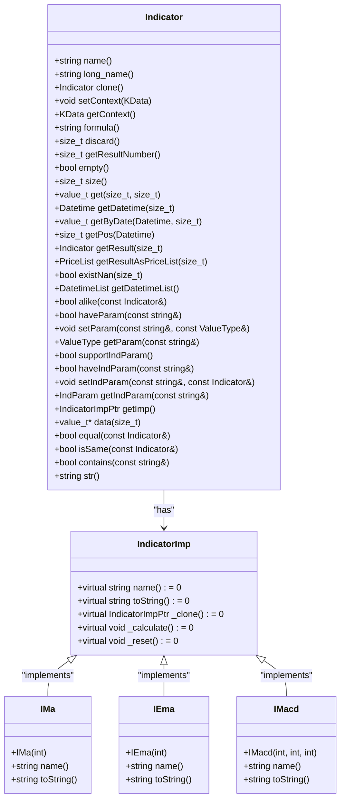
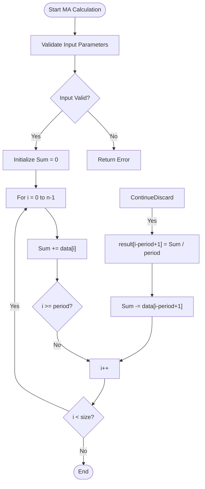
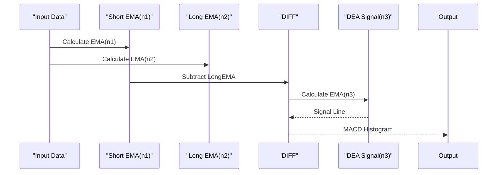
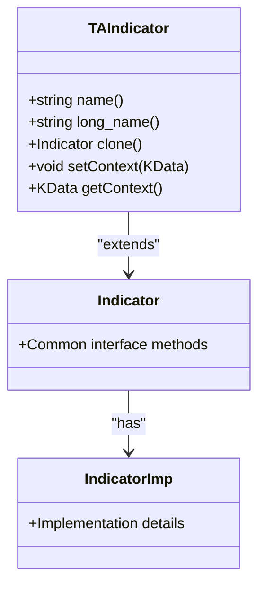
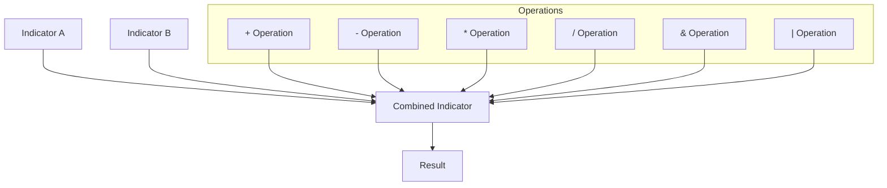

# Indicator System

<cite>
**Referenced Files in This Document**   
- [__init__.py](file://hikyuu/indicator/__init__.py)
- [indicator.py](file://hikyuu/indicator/indicator.py)
- [pyind.py](file://hikyuu/indicator/pyind.py)
- [Indicator.h](file://hikyuu_cpp/hikyuu/indicator/Indicator.h)
- [Indicator.cpp](file://hikyuu_cpp/hikyuu/indicator/Indicator.cpp)
- [MA.h](file://hikyuu_cpp/hikyuu/indicator/crt/MA.h)
- [EMA.h](file://hikyuu_cpp/hikyuu/indicator/crt/EMA.h)
- [MACD.h](file://hikyuu_cpp/hikyuu/indicator/crt/MACD.h)
- [RSI.h](file://hikyuu_cpp/hikyuu/indicator/crt/RSI.h)
- [ta_crt.h](file://hikyuu_cpp/hikyuu/indicator_talib/ta_crt.h)
</cite>

## Table of Contents
1. [Introduction](#introduction)
2. [Indicator Class Hierarchy](#indicator-class-hierarchy)
3. [Built-in Technical Indicators](#built-in-technical-indicators)
4. [TA-Lib Integration Indicators](#ta-lib-integration-indicators)
5. [Indicator Creation and Application](#indicator-creation-and-application)
6. [Advanced Features](#advanced-features)
7. [Common Issues and Best Practices](#common-issues-and-best-practices)
8. [Conclusion](#conclusion)

## Introduction

The Hikyuu indicator system provides a comprehensive framework for technical analysis in financial markets. It offers hundreds of built-in technical indicators and seamless integration with TA-Lib, enabling users to perform sophisticated market analysis. The system supports both C++ and Python interfaces, allowing for flexible development and integration.

The indicator system is designed around a modular architecture where each indicator is implemented as a function that returns an Indicator object. These objects can be chained together, combined, and applied to KData (candlestick data) to generate trading signals and perform technical analysis. The system handles data alignment, time frame compatibility, and missing values automatically, making it robust for real-world applications.

**Section sources**
- [__init__.py](file://hikyuu/indicator/__init__.py)
- [indicator.py](file://hikyuu/indicator/indicator.py)

## Indicator Class Hierarchy

The Hikyuu indicator system is built on a well-defined class hierarchy that enables extensibility and consistent behavior across all indicators. At the core of this system is the Indicator class, which serves as the base class for all technical indicators.



The Indicator class provides a comprehensive interface for working with technical indicators. Key methods include:

- **name()**: Returns the indicator name
- **long_name()**: Returns the indicator name with parameters
- **clone()**: Creates a copy of the indicator
- **setContext()**: Sets the data context (KData) for the indicator
- **getContext()**: Gets the current data context
- **formula()**: Returns the indicator formula
- **discard()**: Returns the number of initial values to discard
- **getResultNumber()**: Returns the number of result series
- **get()**: Retrieves a specific value from the indicator
- **getByDate()**: Retrieves a value by date
- **getResult()**: Gets a specific result series as an Indicator

The IndicatorImp class is the abstract base class for indicator implementations. All built-in indicators extend this class and implement the required virtual methods. This design allows for polymorphic behavior and enables the creation of custom indicators by extending the base class.

Custom indicators can be created by inheriting from IndicatorImp and implementing the necessary methods. The system provides a factory pattern through functions like MA(), EMA(), and MACD() that return Indicator objects wrapping the appropriate IndicatorImp implementation.

**Diagram sources**
- [Indicator.h](file://hikyuu_cpp/hikyuu/indicator/Indicator.h)
- [Indicator.cpp](file://hikyuu_cpp/hikyuu/indicator/Indicator.cpp)

**Section sources**
- [Indicator.h](file://hikyuu_cpp/hikyuu/indicator/Indicator.h)
- [Indicator.cpp](file://hikyuu_cpp/hikyuu/indicator/Indicator.cpp)

## Built-in Technical Indicators

The Hikyuu system includes a comprehensive collection of built-in technical indicators organized in the crt and imp directories. These indicators cover a wide range of technical analysis methods, from basic moving averages to advanced statistical measures.

### Moving Average Indicators

#### MA (Simple Moving Average)
The MA indicator calculates the simple moving average over a specified period.



**Parameters:**
- n: Period window (default: 22)

**Return values:**
- Single series with moving average values

**Section sources**
- [MA.h](file://hikyuu_cpp/hikyuu/indicator/crt/MA.h)

#### EMA (Exponential Moving Average)
The EMA indicator calculates the exponential moving average with a specified smoothing factor.

**Parameters:**
- n: Period window (must be > 0)

**Return values:**
- Single series with exponential moving average values

**Section sources**
- [EMA.h](file://hikyuu_cpp/hikyuu/indicator/crt/EMA.h)

#### MACD (Moving Average Convergence Divergence)
The MACD indicator calculates the difference between short-term and long-term exponential moving averages.

**Parameters:**
- n1: Short-term EMA period (default: 12)
- n2: Long-term EMA period (default: 26)
- n3: Signal line EMA period (default: 9)

**Return values:**
- MACD BAR: The difference between MACD fast line and slow line
- DIFF: Fast line (short-term EMA - long-term EMA)
- DEA: Slow line (n3-period EMA of the fast line)



**Section sources**
- [MACD.h](file://hikyuu_cpp/hikyuu/indicator/crt/MACD.h)

#### RSI (Relative Strength Index)
The RSI indicator measures the speed and change of price movements.

**Parameters:**
- n: Period window (default: 14)

**Calculation algorithm:**
1. Calculate price changes
2. Separate gains and losses
3. Calculate average gain and average loss over n periods
4. Calculate RS = Average Gain / Average Loss
5. Calculate RSI = 100 - (100 / (1 + RS))

**Return values:**
- Single series with RSI values (0-100 range)

**Section sources**
- [RSI.h](file://hikyuu_cpp/hikyuu/indicator/crt/RSI.h)

#### KDJ (Stochastic Oscillator)
The KDJ indicator is implemented as a Python function that combines multiple built-in indicators.

```python
def KDJ(kdata=None, n=9, m1=3, m2=3):
    """ Classic KDJ Stochastic Indicator
    
    :param KData kdata: Associated K-line data
    :param int n: 
    :param int m1: 
    :param int m2: 
    :return: k, d, j
    """
    rsv = (CLOSE() - LLV(LOW(), n)) / (HHV(HIGH(), n) - LLV(LOW(), n)) * 100
    k = SMA(rsv, m1, 1)
    d = SMA(k, m2, 1)
    j = 3 * k - 2 * d
    if kdata is not None:
        k.set_context(kdata)
        j.set_context(kdata)
        d.set_context(kdata)
    return k, d, j
```

**Parameters:**
- n: Lookback period for RSV calculation
- m1: Smoothing period for K line
- m2: Smoothing period for D line

**Return values:**
- k: Fast stochastic line
- d: Slow stochastic line
- j: J line (3*K - 2*D)

**Section sources**
- [pyind.py](file://hikyuu/indicator/pyind.py)

## TA-Lib Integration Indicators

Hikyuu provides seamless integration with TA-Lib through the indicator_talib module. This integration allows users to access TA-Lib's extensive collection of technical indicators while maintaining the same interface as built-in indicators.

### TA-Lib Indicator Architecture



The TA-Lib integration is implemented through the ta_crt.h header file, which defines wrapper functions for TA-Lib indicators. These functions follow a consistent naming convention (TA_INDICATOR_NAME) and provide the same parameter flexibility as built-in indicators.

### Key TA-Lib Indicators

#### TA_MACD
Wrapper for TA-Lib's MACD indicator with additional parameter options.

**Parameters:**
- fast_n: Fast EMA period (default: 12)
- slow_n: Slow EMA period (default: 26)
- signal_n: Signal line period (default: 9)

#### TA_RSI
Wrapper for TA-Lib's RSI indicator.

**Parameters:**
- n: Period window (default: 14)

#### TA_BBANDS
Wrapper for TA-Lib's Bollinger Bands indicator.

**Parameters:**
- n: Period window (default: 5)
- nbdevup: Upper band deviation (default: 2.0)
- nbdevdn: Lower band deviation (default: 2.0)
- matype: Moving average type (default: 0)

#### TA_STOCH
Wrapper for TA-Lib's Stochastic indicator.

**Parameters:**
- fastk_n: Fast %K period (default: 5)
- slowk_n: Slow %K period (default: 3)
- slowk_matype: Slow %K moving average type (default: 0)
- slowd_n: Slow %D period (default: 3)
- slowd_matype: Slow %D moving average type (default: 0)

### Integration Benefits and Trade-offs

**Built-in indicators vs TA-Lib indicators:**

| Feature | Built-in Indicators | TA-Lib Indicators |
|--------|-------------------|------------------|
| Performance | Optimized for Hikyuu | Slightly slower due to wrapper overhead |
| Memory Usage | Efficient | Additional memory for TA-Lib context |
| Parameter Flexibility | High | High |
| Algorithm Consistency | Hikyuu-specific | Standard TA-Lib implementation |
| Customization | Easy to modify | Limited to TA-Lib parameters |
| Dependencies | None | Requires TA-Lib library |

**When to use each:**
- Use built-in indicators for better performance and tighter integration
- Use TA-Lib indicators when you need specific algorithm implementations or want to match TA-Lib results exactly
- Use built-in indicators for custom modifications and extensions
- Use TA-Lib indicators for complex indicators not available in the built-in set

**Section sources**
- [ta_crt.h](file://hikyuu_cpp/hikyuu/indicator_talib/ta_crt.h)

## Indicator Creation and Application

The Hikyuu indicator system provides multiple ways to create and apply indicators to financial data. This section demonstrates how to work with indicators in both C++ and Python.

### Basic Indicator Usage

In Python, indicators can be created and applied using a functional approach:

```python
# Import necessary modules
from hikyuu import *
from hikyuu.indicator import *

# Get stock data
stock = sm['sh000001']
kdata = stock.get_kdata(Query(-100))

# Create indicators
ma5 = MA(CLOSE(kdata), 5)
ma10 = MA(CLOSE(kdata), 10)
rsi = RSI(CLOSE(kdata), 14)

# Combine indicators
signal = CROSS(ma5, ma10)
```

In C++, the same operations can be performed with similar syntax:

```cpp
#include "hikyuu/indicator/crt/MA.h"
#include "hikyuu/indicator/crt/RSI.h"
#include "hikyuu/indicator/crt/CROSS.h"

// Get stock data
Stock stock = StockManager::instance().getStock("sh000001");
KData kdata = stock.getKData(Query(-100));

// Create indicators
Indicator ma5 = MA(CLOSE(kdata), 5);
Indicator ma10 = MA(CLOSE(kdata), 10);
Indicator rsi = RSI(CLOSE(kdata), 14);

// Combine indicators
Indicator signal = CROSS(ma5, ma10);
```

### Indicator Chaining

Indicators can be chained together to create complex expressions:

```python
# Create a complex indicator chain
bb_upper, bb_middle, bb_lower = BOLL(CLOSE(kdata), 20, 2)
macd_bar, macd_diff, macd_dea = MACD(CLOSE(kdata), 12, 26, 9)
rsi = RSI(CLOSE(kdata), 14)

# Combine multiple indicators
combined_signal = (CLOSE() > bb_middle) & (rsi < 30) & (macd_bar > 0)
```

### Data Conversion Utilities

The system provides utilities for converting between different data formats:

```python
# Convert pandas DataFrame to Indicator
import pandas as pd
import akshare as ak

# Get US 10-year treasury yield
df = ak.bond_zh_us_rate("19901219")
x = df_to_ind(df, '美国国债收益率10年', '日期')

# Combine indicators into DataFrame
dates = sm.get_trading_calendar(Query(-200))
ma_list = [MA(CLOSE(k)) for k in k_list]
df = concat_to_df(dates, ma_list, head_stock_code=True, head_ind_name=False)
```

**Section sources**
- [indicator.py](file://hikyuu/indicator/indicator.py)
- [pyind.py](file://hikyuu/indicator/pyind.py)

## Advanced Features

The Hikyuu indicator system includes several advanced features that enhance its capabilities for sophisticated technical analysis.

### Indicator Chaining and Combination

Indicators can be combined using arithmetic and logical operations:



Supported operations include:
- Arithmetic: +, -, *, /, %
- Comparison: ==, !=, >, <, >=, <=
- Logical: &, |

### Parameter Optimization

The system supports dynamic parameter optimization through the IndParam class:

```python
# Create parameterized indicators
n_param = IndParam(20)
ma = MA(CLOSE(kdata), n_param)

# Change parameter dynamically
n_param.setValue(30)
# MA will recalculate with new parameter
```

### Performance Considerations

When using multiple indicators simultaneously, consider the following performance optimizations:

1. **Reuse common calculations:**
```python
# Instead of calculating CLOSE() multiple times
ma1 = MA(CLOSE(kdata), 5)
ma2 = MA(CLOSE(kdata), 10)
ma3 = MA(CLOSE(kdata), 20)

# Store the result and reuse
close_price = CLOSE(kdata)
ma1 = MA(close_price, 5)
ma2 = MA(close_price, 10)
ma3 = MA(close_price, 20)
```

2. **Use appropriate discard values:**
```python
# Set appropriate discard to avoid unnecessary calculations
ma = MA(close_price, 20)
ma.setDiscard(20)  # First 20 values are not valid
```

3. **Batch operations:**
```python
# Use concat_to_df to combine multiple indicators efficiently
indicator_list = [MA(close, 5), MA(close, 10), RSI(close, 14)]
df = concat_to_df(dates, indicator_list)
```

### Memory Management

The system uses shared pointers and lazy evaluation to optimize memory usage:

- Indicator results are calculated on-demand
- Common subexpressions are automatically optimized
- Memory is shared between related indicators
- Unused indicator results are automatically cleaned up

**Section sources**
- [Indicator.h](file://hikyuu_cpp/hikyuu/indicator/Indicator.h)
- [Indicator.cpp](file://hikyuu_cpp/hikyuu/indicator/Indicator.cpp)
- [indicator.py](file://hikyuu/indicator/indicator.py)

## Common Issues and Best Practices

This section addresses common issues encountered when working with the Hikyuu indicator system and provides best practices for optimal usage.

### Data Alignment and Time Frame Compatibility

**Issue:** Indicators applied to different time frames may have misaligned dates.

**Solution:** Ensure all indicators use the same KData context:

```python
# Correct approach
kdata_daily = stock.get_kdata(Query(-100))
kdata_weekly = stock.get_kdata(Query(-100, Query.WEEK))

# Use appropriate time frame for each indicator
ma_daily = MA(CLOSE(kdata_daily), 20)
ma_weekly = MA(CLOSE(kdata_weekly), 20)
```

### Handling Missing Values

The system automatically handles missing values (NaN) in calculations:

```python
# Check for NaN values
if indicator.existNan(0):
    print("Indicator contains NaN values")

# Use DROPNA to remove NaN values
clean_indicator = DROPNA(indicator)
```

### Best Practices

1. **Use meaningful names:**
```python
# Instead of anonymous indicators
signal = CROSS(MA(CLOSE(kdata), 5), MA(CLOSE(kdata), 10))

# Name your indicators
ma5 = MA(CLOSE(kdata), 5)
ma5.name("MA5")
ma10 = MA(CLOSE(kdata), 10)
ma10.name("MA10")
golden_cross = CROSS(ma5, ma10)
golden_cross.name("Golden Cross")
```

2. **Set appropriate discard values:**
```python
# Set discard to the minimum required
ma20 = MA(close, 20)
ma20.setDiscard(20)  # First 20 values are not valid
```

3. **Use context appropriately:**
```python
# Set context for better formula display
ma = MA(CLOSE(kdata), 20)
ma.setContext(kdata)
```

4. **Optimize calculation order:**
```python
# Calculate expensive indicators once
expensive_indicator = COMPLEX_INDICATOR(data)
result1 = USE_INDICATOR(expensive_indicator, param1)
result2 = USE_INDICATOR(expensive_indicator, param2)
```

### Troubleshooting Common Issues

**Issue:** Indicator returns unexpected values
- **Check:** Ensure the KData has sufficient data points
- **Check:** Verify parameter values are within valid ranges
- **Check:** Confirm the indicator is applied to the correct data series

**Issue:** Performance is slow with multiple indicators
- **Solution:** Reuse common subexpressions
- **Solution:** Use appropriate discard values
- **Solution:** Consider using batch operations

**Issue:** Memory usage is high
- **Solution:** Clear unused indicator references
- **Solution:** Use generators for large datasets
- **Solution:** Process data in chunks

**Section sources**
- [Indicator.h](file://hikyuu_cpp/hikyuu/indicator/Indicator.h)
- [indicator.py](file://hikyuu/indicator/indicator.py)

## Conclusion

The Hikyuu indicator system provides a powerful and flexible framework for technical analysis in financial markets. With hundreds of built-in indicators and seamless TA-Lib integration, it offers comprehensive tools for developing sophisticated trading strategies.

Key advantages of the system include:
- Unified interface for both built-in and TA-Lib indicators
- Support for indicator chaining and combination
- Efficient memory management and performance optimization
- Comprehensive parameter handling and optimization capabilities
- Robust handling of edge cases like missing values and data alignment

The system's modular design allows for easy extension and customization, making it suitable for both novice users and advanced developers. By following the best practices outlined in this documentation, users can effectively leverage the full capabilities of the indicator system to build robust trading strategies.

Whether working with basic moving averages or complex multi-indicator systems, the Hikyuu indicator framework provides the tools and flexibility needed for successful technical analysis.

[No sources needed since this section summarizes without analyzing specific files]