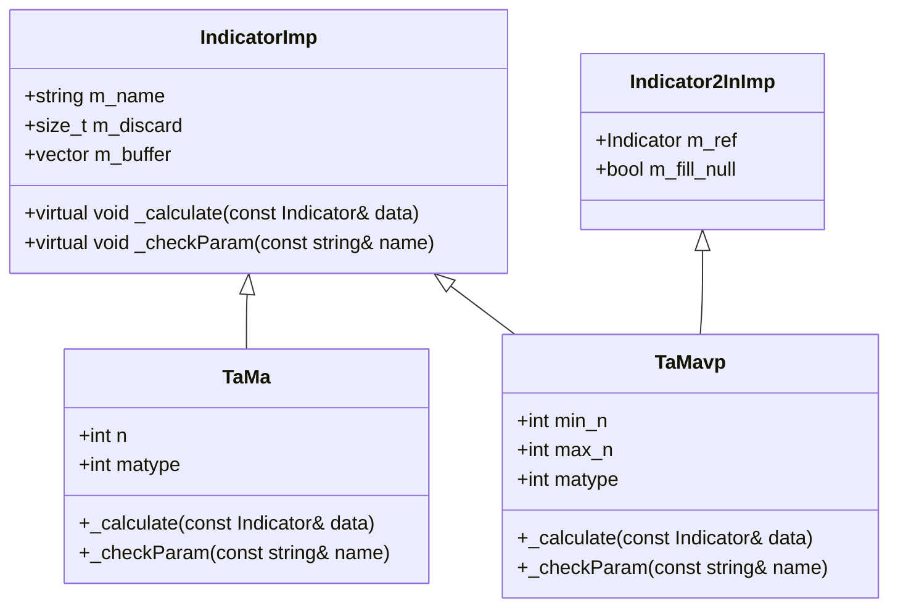

# TA-Lib Integration Indicators

<cite>
**Referenced Files in This Document**   
- [ta_crt.h](file://hikyuu_cpp/hikyuu/indicator_talib/ta_crt.h)
- [TaMa.cpp](file://hikyuu_cpp/hikyuu/indicator_talib/imp/TaMa.cpp)
- [TaMama.cpp](file://hikyuu_cpp/hikyuu/indicator_talib/imp/TaMama.cpp)
- [TaMavp.cpp](file://hikyuu_cpp/hikyuu/indicator_talib/imp/TaMavp.cpp)
- [TaMacd.cpp](file://hikyuu_cpp/hikyuu/indicator_talib/imp/TaMacd.cpp)
- [TaMacdext.cpp](file://hikyuu_cpp/hikyuu/indicator_talib/imp/TaMacdext.cpp)
- [TaStoch.cpp](file://hikyuu_cpp/hikyuu/indicator_talib/imp/TaStoch.cpp)
- [TaStochf.cpp](file://hikyuu_cpp/hikyuu/indicator_talib/imp/TaStochf.cpp)
- [TaBbands.cpp](file://hikyuu_cpp/hikyuu/indicator_talib/imp/TaBbands.cpp)
- [TaSar.cpp](file://hikyuu_cpp/hikyuu/indicator_talib/imp/TaSar.cpp)
- [TaSarext.cpp](file://hikyuu_cpp/hikyuu/indicator_talib/imp/TaSarext.cpp)
- [TaAdosc.cpp](file://hikyuu_cpp/hikyuu/indicator_talib/imp/TaAdosc.cpp)
- [TaPpo.cpp](file://hikyuu_cpp/hikyuu/indicator_talib/imp/TaPpo.cpp)
- [_ta_lib.cpp](file://hikyuu_pywrap/indicator/_ta_lib.cpp)
</cite>

## Table of Contents
1. [Introduction](#introduction)
2. [Moving Average Indicators](#moving-average-indicators)
3. [Momentum Indicators](#momentum-indicators)
4. [Volatility Indicators](#volatility-indicators)
5. [Volume Indicators](#volume-indicators)
6. [Implementation Details](#implementation-details)
7. [Usage Examples](#usage-examples)
8. [Performance and Threading](#performance-and-threading)
9. [Common Integration Issues](#common-integration-issues)

## Introduction
The hikyuu framework provides comprehensive integration with TA-Lib (Technical Analysis Library) through a C++ wrapper system. This integration allows users to access all TA-Lib technical indicators within both C++ and Python environments. The wrapper system handles data type conversions, parameter validation, and memory management while preserving the original functionality of TA-Lib. All TA-Lib indicators are exposed through a consistent API that integrates seamlessly with hikyuu's native indicator system, enabling mixed usage of TA-Lib and native indicators in trading strategies.

**Section sources**
- [ta_crt.h](file://hikyuu_cpp/hikyuu/indicator_talib/ta_crt.h#L1-L322)

## Moving Average Indicators

### TaMa
The TaMa indicator wraps TA-Lib's TA_MA function, which calculates the moving average using various methods. It accepts an input indicator and parameters for period (n) and moving average type (matype). The implementation validates that n is between 1 and 100000 and matype is between 0 and 8, corresponding to different moving average algorithms (SMA, EMA, WMA, etc.). The indicator returns a single output series containing the moving average values.

**Section sources**
- [TaMa.cpp](file://hikyuu_cpp/hikyuu/indicator_talib/imp/TaMa.cpp#L1-L65)

### TaMama
The TaMama indicator wraps TA-Lib's TA_MAMA function, which implements the MESA Adaptive Moving Average. It accepts parameters for fast_limit (default 0.5) and slow_limit (default 0.05), both constrained to the range [0.01, 0.99]. This indicator produces two output series: the MAMA line and the FAMA (Fast Adaptive MA) line. The implementation handles the adaptive calculation that adjusts sensitivity based on market volatility.

**Section sources**
- [TaMama.cpp](file://hikyuu_cpp/hikyuu/indicator_talib/imp/TaMama.cpp#L1-L64)

### TaMavp
The TaMavp indicator wraps TA-Lib's TA_MAVP function, which calculates a moving average with variable period. It accepts a reference indicator that provides the period values, along with minimum and maximum period constraints (min_n and max_n). The implementation validates that both min_n and max_n are between 2 and 100000. This allows for dynamic adjustment of the moving average period based on other indicators or market conditions.

**Section sources**
- [TaMavp.cpp](file://hikyuu_cpp/hikyuu/indicator_talib/imp/TaMavp.cpp#L1-L78)

## Momentum Indicators

### TaMacd
The TaMacd indicator wraps TA-Lib's TA_MACD function, which calculates the Moving Average Convergence/Divergence. It accepts parameters for fast period (fast_n, default 12), slow period (slow_n, default 26), and signal period (signal_n, default 9). The implementation validates that fast_n and slow_n are between 2 and 100000, and signal_n is between 1 and 100000. The indicator returns three output series: MACD line, signal line, and histogram.

**Section sources**
- [TaMacd.cpp](file://hikyuu_cpp/hikyuu/indicator_talib/imp/TaMacd.cpp#L1-L71)

### TaMacdext
The TaMacdext indicator wraps TA-Lib's TA_MACDEXT function, which extends the standard MACD by allowing different moving average types for each component. In addition to the standard MACD parameters, it accepts parameters for the moving average type of each component (fast_matype, slow_matype, signal_matype), each constrained to values between 0 and 8. This provides greater flexibility in configuring the MACD calculation.

**Section sources**
- [TaMacdext.cpp](file://hikyuu_cpp/hikyuu/indicator_talib/imp/TaMacdext.cpp#L1-L86)

### TaStoch
The TaStoch indicator wraps TA-Lib's TA_STOCH function, which calculates the Stochastic Oscillator. It requires high, low, and close price data from KData and accepts parameters for fastK period (fastk_n, default 5), slowK period (slowk_n, default 3), slowK moving average type (slowk_matype, default 0), slowD period (slowd_n, default 3), and slowD moving average type (slowd_matype, default 0). The implementation extracts price data from KData and passes it to the TA-Lib function.

**Section sources**
- [TaStoch.cpp](file://hikyuu_cpp/hikyuu/indicator_talib/imp/TaStoch.cpp#L1-L108)

### TaStochf
The TaStochf indicator wraps TA-Lib's TA_STOCHF function, which calculates the Fast Stochastic Oscillator. It accepts parameters for fastK period (fastk_n, default 5), fastD period (fastd_n, default 3), and fastD moving average type (fastd_matype, default 0). Unlike the standard Stochastic, this version does not apply a second smoothing to the D line, making it more responsive to price changes.

**Section sources**
- [TaStochf.cpp](file://hikyuu_cpp/hikyuu/indicator_talib/imp/TaStochf.cpp#L1-L96)

## Volatility Indicators

### TaBbands
The TaBbands indicator wraps TA-Lib's TA_BBANDS function, which calculates Bollinger Bands. It accepts parameters for period (n, default 5), number of standard deviations for the upper band (nbdevup, default 2.0), number of standard deviations for the lower band (nbdevdn, default 2.0), and moving average type (matype, default 0). The implementation validates that n is between 2 and 100000 and matype is between 0 and 8. The indicator returns three output series: upper band, middle band, and lower band.

**Section sources**
- [TaBbands.cpp](file://hikyuu_cpp/hikyuu/indicator_talib/imp/TaBbands.cpp#L1-L79)

### TaSar
The TaSar indicator wraps TA-Lib's TA_SAR function, which calculates the Parabolic SAR (Stop and Reverse). It accepts parameters for acceleration factor (acceleration, default 0.02) and maximum acceleration (maximum, default 0.2). The implementation extracts high and low price data from KData and passes it to the TA-Lib function. The indicator returns a single output series containing the SAR values, which appear as dots above or below price bars indicating potential reversal points.

**Section sources**
- [TaSar.cpp](file://hikyuu_cpp/hikyuu/indicator_talib/imp/TaSar.cpp#L1-L85)

### TaSarext
The TaSarext indicator wraps TA-Lib's TA_SAREXT function, which extends the standard Parabolic SAR with additional parameters for greater control. It accepts parameters for start value (startvalue, default 0.0), offset on reverse (offsetonreverse, default 0.0), and separate acceleration parameters for long and short positions (accelerationinitlong, accelerationlong, accelerationmaxlong, accelerationinitshort, accelerationshort, accelerationmaxshort). This allows for asymmetric SAR calculations that can respond differently to uptrends and downtrends.

**Section sources**
- [TaSarext.cpp](file://hikyuu_cpp/hikyuu/indicator_talib/imp/TaSarext.cpp#L1-L135)

## Volume Indicators

### TaAdosc
The TaAdosc indicator wraps TA-Lib's TA_ADOSC function, which calculates the Chaikin A/D Oscillator. It accepts parameters for fast period (fast_n, default 3) and slow period (slow_n, default 10). The implementation extracts high, low, close, and volume data from KData and passes it to the TA-Lib function. The indicator returns a single output series containing the oscillator values, which measure the momentum of the Accumulation/Distribution line.

**Section sources**
- [TaAdosc.cpp](file://hikyuu_cpp/hikyuu/indicator_talib/imp/TaAdosc.cpp)

### TaPpo
The TaPpo indicator wraps TA-Lib's TA_PPO function, which calculates the Percentage Price Oscillator. It accepts parameters for fast period (fast_n, default 12), slow period (slow_n, default 26), and moving average type (matype, default 0). The implementation validates that fast_n and slow_n are between 2 and 100000, and matype is between 0 and 8. The indicator returns a single output series containing the percentage difference between the fast and slow moving averages.

**Section sources**
- [TaPpo.cpp](file://hikyuu_cpp/hikyuu/indicator_talib/imp/TaPpo.cpp)

## Implementation Details

### C++ Wrapper Architecture
The TA-Lib integration in hikyuu follows a consistent wrapper pattern implemented in the indicator_talib/imp directory. Each indicator class inherits from IndicatorImp or Indicator2InImp and implements the _calculate method to interface with the corresponding TA-Lib C function. The wrapper handles data type conversions between hikyuu's data structures and TA-Lib's expected formats, parameter validation through _checkParam, and memory management for temporary buffers.



**Diagram sources**
- [TaMa.cpp](file://hikyuu_cpp/hikyuu/indicator_talib/imp/TaMa.cpp#L1-L65)
- [TaMavp.cpp](file://hikyuu_cpp/hikyuu/indicator_talib/imp/TaMavp.cpp#L1-L78)

### Data Type Conversions
The wrapper system handles conversions between hikyuu's data structures and TA-Lib's expected formats. For indicators that operate on price data (high, low, close), the implementation extracts the relevant fields from KData or KRecord structures and copies them into temporary double arrays that are passed to the TA-Lib functions. The wrapper ensures proper memory allocation and deallocation for these temporary buffers using smart pointers to prevent memory leaks.

### Parameter Validation
Each indicator implements parameter validation in the _checkParam method, which is called whenever a parameter is set. The validation enforces constraints specific to each TA-Lib function, such as minimum and maximum values for periods, valid ranges for coefficients, and acceptable values for enumeration parameters. This prevents invalid parameter combinations from being passed to the underlying TA-Lib functions, which could result in undefined behavior or calculation errors.

**Section sources**
- [TaMa.cpp](file://hikyuu_cpp/hikyuu/indicator_talib/imp/TaMa.cpp#L1-L65)
- [TaMama.cpp](file://hikyuu_cpp/hikyuu/indicator_talib/imp/TaMama.cpp#L1-L64)
- [TaBbands.cpp](file://hikyuu_cpp/hikyuu/indicator_talib/imp/TaBbands.cpp#L1-L79)

## Usage Examples

### C++ Usage
In C++, TA-Lib indicators can be used alongside native hikyuu indicators through the indicator factory functions defined in ta_crt.h. The following example demonstrates creating a MACD indicator and combining it with a native moving average:

```cpp
// Create MACD indicator with custom parameters
auto macd = TA_MACD(12, 26, 9);

// Create Bollinger Bands from close price
auto bband = TA_BBANDS(kdata.close(), 20, 2.0, 2.0, 0);

// Combine TA-Lib indicator with native indicator
auto signal = IF(macd[2] > 0 && close() > bband[0], 1, 0);
```

**Section sources**
- [ta_crt.h](file://hikyuu_cpp/hikyuu/indicator_talib/ta_crt.h#L1-L322)

### Python Usage
In Python, the TA-Lib indicators are exposed through the hikyuu module and can be used in the same way as native indicators. The pybind11 bindings in _ta_lib.cpp export all TA-Lib functions with appropriate documentation strings and parameter annotations:

```python
# Create Stochastic Oscillator with default parameters
stoch = TA_STOCH()

# Create Parabolic SAR with custom acceleration parameters
sar = TA_SAR(acceleration=0.02, maximum=0.2)

# Use TA-Lib indicator in combination with native indicators
ma5 = MA(n=5)
signal = (stoch[0] > 80) & (close() < sar) & (close() < ma5)
```

**Section sources**
- [_ta_lib.cpp](file://hikyuu_pywrap/indicator/_ta_lib.cpp#L1-L28)

## Performance and Threading
The TA-Lib integration in hikyuu is designed to be thread-safe and performant. The wrapper system minimizes memory allocations by reusing internal buffers when possible and using smart pointers for temporary allocations. The underlying TA-Lib C functions are stateless and reentrant, allowing multiple threads to calculate different indicators simultaneously without interference. However, when calculating the same indicator instance from multiple threads, external synchronization is required as the indicator's internal state (m_buffer, m_discard) is not thread-safe.

The performance characteristics of TA-Lib indicators are generally excellent, with most functions implemented in optimized C code. The wrapper overhead is minimal, consisting primarily of parameter validation and data copying. For indicators that require price data (high, low, close), the performance is slightly impacted by the need to copy data from KData structures into temporary arrays, but this is typically negligible compared to the calculation time of the TA-Lib functions themselves.

**Section sources**
- [TaStoch.cpp](file://hikyuu_cpp/hikyuu/indicator_talib/imp/TaStoch.cpp#L1-L108)
- [TaSar.cpp](file://hikyuu_cpp/hikyuu/indicator_talib/imp/TaSar.cpp#L1-L85)

## Common Integration Issues

### Version Compatibility
The TA-Lib integration requires a compatible version of the TA-Lib library to be available at compile time. The build system checks for the presence of TA-Lib headers and libraries, and the integration is conditionally compiled based on the HKU_ENABLE_TA_LIB preprocessor macro. Users must ensure that the TA-Lib version is compatible with the hikyuu wrapper, as changes in the TA-Lib API could break the integration.

### Error Handling
The wrapper system handles errors from the underlying TA-Lib library by checking the return codes of TA-Lib functions and validating parameters before calling them. When an error occurs, the indicator sets its discard value to the total data size, effectively returning an empty result. This prevents the propagation of invalid calculations while allowing the overall strategy to continue execution. Users should check the discard value of indicators to detect calculation failures.

### Calculation Differences
Differences in calculation results between TA-Lib and native hikyuu implementations can occur due to variations in algorithm implementation, rounding precision, or handling of edge cases. The TA-Lib functions use double-precision floating-point arithmetic and follow specific rounding rules that may differ from hikyuu's native implementations. Users should validate that the results from TA-Lib indicators meet their accuracy requirements, particularly for indicators that are sensitive to small differences in input values.

**Section sources**
- [TaMa.cpp](file://hikyuu_cpp/hikyuu/indicator_talib/imp/TaMa.cpp#L1-L65)
- [TaMacd.cpp](file://hikyuu_cpp/hikyuu/indicator_talib/imp/TaMacd.cpp#L1-L71)
- [TaBbands.cpp](file://hikyuu_cpp/hikyuu/indicator_talib/imp/TaBbands.cpp#L1-L79)