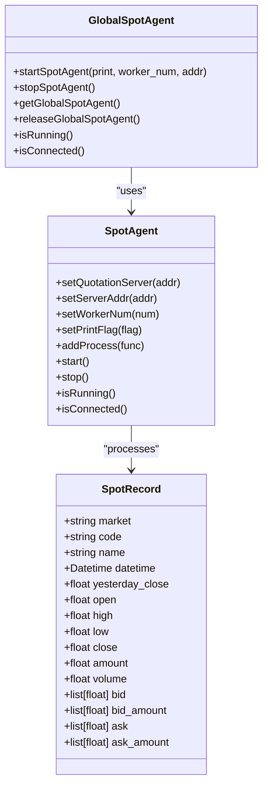
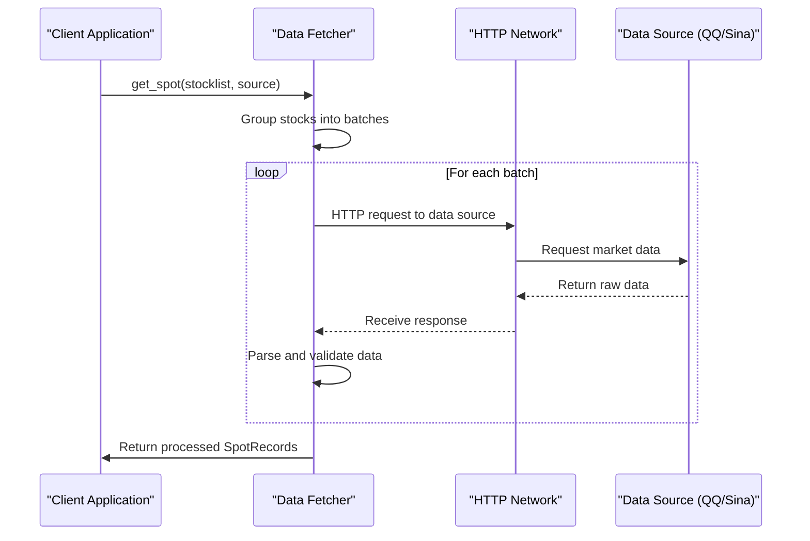
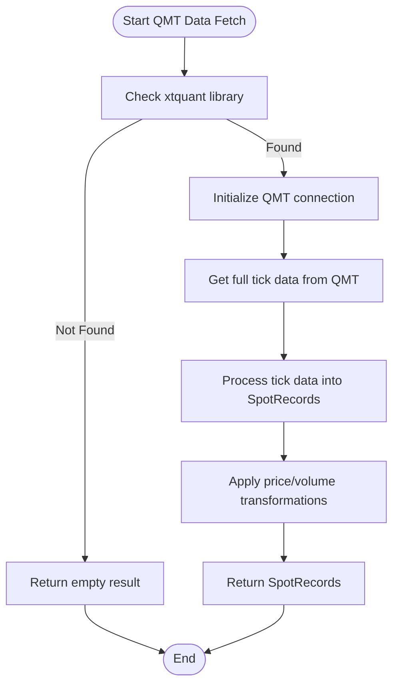
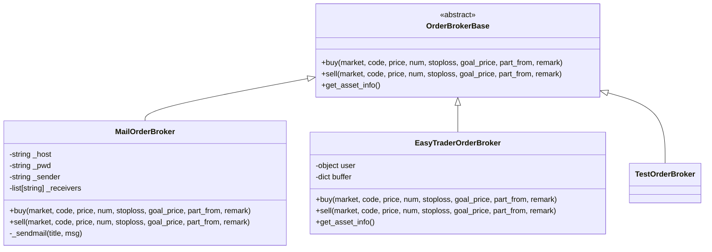
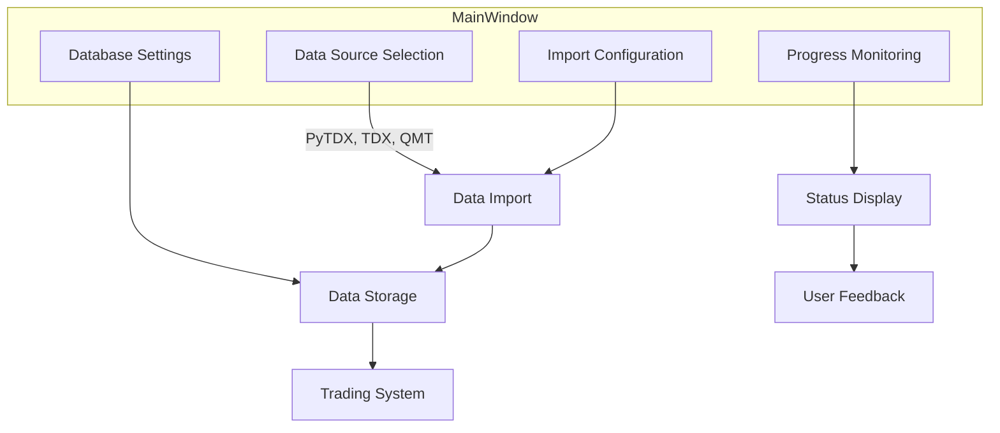

# Real-time Trading

<cite>
**Referenced Files in This Document**   
- [GlobalSpotAgent.h](file://hikyuu_cpp/hikyuu/global/GlobalSpotAgent.h)
- [GlobalSpotAgent.cpp](file://hikyuu_cpp/hikyuu/global/GlobalSpotAgent.cpp)
- [zh_stock_a_sina_qq.py](file://hikyuu/fetcher/stock/zh_stock_a_sina_qq.py)
- [zh_stock_a_qmt.py](file://hikyuu/fetcher/stock/zh_stock_a_qmt.py)
- [broker_mail.py](file://hikyuu/trade_manage/broker_mail.py)
- [broker_easytrader.py](file://hikyuu/trade_manage/broker_easytrader.py)
- [broker.py](file://hikyuu/trade_manage/broker.py)
- [Spot.py](file://hikyuu/flat/Spot.py)
- [SpotRecord.cpp](file://hikyuu_pywrap/global/_SpotRecord.cpp)
- [MainWindow.py](file://hikyuu/gui/data/MainWindow.py)
- [hkucmd.py](file://hikyuu/shell/hkucmd.py)
- [__init__.py](file://hikyuu/__init__.py)
</cite>

## Table of Contents
1. [Introduction](#introduction)
2. [Real-time Data Acquisition System](#real-time-data-acquisition-system)
3. [Fetcher Modules for Data Sources](#fetcher-modules-for-data-sources)
4. [Broker Integration System](#broker-integration-system)
5. [Real-time Strategy Execution Framework](#real-time-strategy-execution-framework)
6. [GUI Components and Command-line Tools](#gui-components-and-command-line-tools)
7. [Critical Considerations for Real-time Environments](#critical-considerations-for-real-time-environments)
8. [Comprehensive Examples](#comprehensive-examples)
9. [Conclusion](#conclusion)

## Introduction
Hikyuu provides a comprehensive real-time trading framework that enables users to acquire live market data, execute trading strategies, and manage broker interactions in real-time. This documentation details the architecture and implementation of the real-time trading capabilities, focusing on the GlobalSpotAgent and SpotRecord classes for live market data management, fetcher modules for various data sources, broker integration options, and the real-time strategy execution framework.

The system is designed to handle real-time data acquisition from multiple sources including Sina, QQ, and QMT, process this data efficiently, and trigger trading actions based on predefined strategies. It supports various execution methods including direct broker integration through easytrader and notification-based execution via email. The framework also includes GUI components and command-line tools for monitoring and managing live trading systems.

**Section sources**
- [GlobalSpotAgent.h](file://hikyuu_cpp/hikyuu/global/GlobalSpotAgent.h#L1-L41)
- [GlobalSpotAgent.cpp](file://hikyuu_cpp/hikyuu/global/GlobalSpotAgent.cpp#L1-L264)

## Real-time Data Acquisition System

### GlobalSpotAgent Architecture
The real-time data acquisition system in Hikyuu is centered around the GlobalSpotAgent class, which serves as the central component for receiving and processing live market data. The GlobalSpotAgent acts as a singleton instance that manages the connection to the quotation server and coordinates the processing of incoming spot data.

The system follows a producer-consumer pattern where the GlobalSpotAgent receives raw market data from various sources and distributes it to registered processing functions. These processing functions update the corresponding stock objects with the latest market information, enabling real-time analysis and trading decisions.



**Diagram sources**
- [GlobalSpotAgent.h](file://hikyuu_cpp/hikyuu/global/GlobalSpotAgent.h#L1-L41)
- [GlobalSpotAgent.cpp](file://hikyuu_cpp/hikyuu/global/GlobalSpotAgent.cpp#L1-L264)

### SpotRecord Data Structure
The SpotRecord class represents the fundamental data structure for storing real-time market data. It contains comprehensive information about a security's current market state, including price information, volume data, and order book details.

The SpotRecord structure includes:
- **Market and Code**: Identifiers for the security
- **Price Data**: Open, high, low, close, and yesterday's close prices
- **Volume and Amount**: Trading volume and transaction amount
- **Order Book**: Bid and ask prices with corresponding volumes
- **Timestamp**: Precise datetime of the data point

This structure is optimized for efficient serialization and transmission, using FlatBuffers for compact binary representation. The data model supports both simple securities and complex instruments with multiple bid/ask levels.

**Section sources**
- [Spot.py](file://hikyuu/flat/Spot.py#L207-L252)
- [SpotRecord.cpp](file://hikyuu_pywrap/global/_SpotRecord.cpp#L1-L32)

## Fetcher Modules for Data Sources

### Sina and QQ Data Fetchers
Hikyuu provides fetcher modules for acquiring real-time data from popular Chinese financial data providers, including Sina and QQ. These fetchers implement concurrent network requests to efficiently retrieve market data for multiple securities simultaneously.

The fetcher architecture uses a batch processing approach where multiple stock codes are grouped into a single HTTP request to minimize network overhead. The system employs a thread pool executor to handle concurrent requests, with configurable timeout settings to ensure responsiveness.



**Diagram sources**
- [zh_stock_a_sina_qq.py](file://hikyuu/fetcher/stock/zh_stock_a_sina_qq.py#L1-L186)

### QMT Data Integration
For users with QMT (Quantitative Trading Platform) access, Hikyuu provides direct integration through the xtquant library. This integration enables access to high-frequency tick data and real-time order book information with minimal latency.

The QMT fetcher establishes a direct connection to the local QMT instance, subscribing to full tick data for the specified securities. This approach provides superior data quality and lower latency compared to web-based sources, making it suitable for high-frequency trading strategies.



**Diagram sources**
- [zh_stock_a_qmt.py](file://hikyuu/fetcher/stock/zh_stock_a_qmt.py#L1-L58)

## Broker Integration System

### Mail-based Execution
Hikyuu supports a notification-based trading execution system through email integration. This approach allows users to review and approve trades before execution, providing an additional layer of control and safety.

The mail-based broker implementation sends email notifications for buy and sell actions, including all relevant trade details such as security code, price, quantity, and strategy context. This system is particularly useful for users who want to maintain manual oversight of their automated trading strategies.



**Diagram sources**
- [broker_mail.py](file://hikyuu/trade_manage/broker_mail.py#L1-L102)
- [broker.py](file://hikyuu/trade_manage/broker.py#L1-L96)

### EasyTrader Integration
For automated execution, Hikyuu integrates with the easytrader library, which supports multiple Chinese brokerage platforms including Hua Tai. This integration enables direct order placement without manual intervention, suitable for fully automated trading strategies.

The EasyTraderOrderBroker class wraps the easytrader client, providing a standardized interface for trading operations. It includes features such as position tracking, asset information retrieval, and order buffering to manage complex trading scenarios.

**Section sources**
- [broker_easytrader.py](file://hikyuu/trade_manage/broker_easytrader.py#L1-L64)
- [broker_mail.py](file://hikyuu/trade_manage/broker_mail.py#L1-L102)

## Real-time Strategy Execution Framework

### Signal Generation and Processing
The real-time strategy execution framework in Hikyuu processes incoming market data to generate trading signals based on predefined conditions. When new spot data arrives, the system updates the relevant stock objects and triggers the evaluation of active trading strategies.

The signal generation process follows these steps:
1. Receive and parse incoming market data
2. Update stock objects with latest price information
3. Evaluate technical indicators and strategy conditions
4. Generate buy/sell signals when conditions are met
5. Execute trading actions through the configured broker interface

This event-driven architecture ensures that trading decisions are made promptly when market conditions change, minimizing latency between signal generation and execution.

**Section sources**
- [GlobalSpotAgent.cpp](file://hikyuu_cpp/hikyuu/global/GlobalSpotAgent.cpp#L1-L264)
- [__init__.py](file://hikyuu/__init__.py#L538-L571)

## GUI Components and Command-line Tools

### Graphical User Interface
Hikyuu provides a comprehensive graphical user interface for monitoring and managing real-time trading systems. The GUI, implemented using PySide6, offers a tabbed interface for configuring data sources, monitoring import progress, and managing trading parameters.

Key features of the GUI include:
- **Data Source Configuration**: Select and configure data sources (PyTDX, TDX, QMT)
- **Import Settings**: Configure what data to import and date ranges
- **Progress Monitoring**: Visual progress bars for various import tasks
- **Database Configuration**: Set up MySQL, ClickHouse, or HDF5 storage



**Diagram sources**
- [MainWindow.py](file://hikyuu/gui/data/MainWindow.py#L1-L800)

### Command-line Interface
In addition to the GUI, Hikyuu provides a command-line interface through the HKUShell class. This interactive shell allows users to execute commands, run scripts, and monitor system status directly from the terminal.

The command-line interface supports features such as command recording, playback, and custom command registration, making it suitable for both interactive use and automated scripting.

**Section sources**
- [hkucmd.py](file://hikyuu/shell/hkucmd.py#L1-L111)
- [MainWindow.py](file://hikyuu/gui/data/MainWindow.py#L1-L800)

## Critical Considerations for Real-time Environments

### Latency and Performance
Real-time trading systems must prioritize low latency to ensure timely execution of trading strategies. Hikyuu addresses this through several optimization techniques:

- **Concurrent Data Fetching**: Using thread pools to fetch data from multiple sources simultaneously
- **Efficient Data Processing**: Minimizing processing overhead through optimized algorithms
- **Batch Operations**: Grouping related operations to reduce system call overhead
- **Memory Management**: Using efficient data structures and caching mechanisms

The system's performance can be further optimized by selecting appropriate data sources (QMT for lowest latency) and configuring the worker thread count based on system capabilities.

### Reliability and Error Handling
Reliability is critical in real-time trading systems. Hikyuu implements several mechanisms to ensure system stability:

- **Exception Handling**: Comprehensive error handling throughout the codebase
- **Connection Management**: Automatic reconnection to data sources when connections are lost
- **Data Validation**: Verification of incoming data to prevent processing invalid information
- **Graceful Degradation**: Continued operation with reduced functionality when components fail

The system also includes failover mechanisms such as the ability to switch between different data sources and broker interfaces, ensuring continuous operation even when individual components experience issues.

**Section sources**
- [GlobalSpotAgent.cpp](file://hikyuu_cpp/hikyuu/global/GlobalSpotAgent.cpp#L1-L264)
- [zh_stock_a_sina_qq.py](file://hikyuu/fetcher/stock/zh_stock_a_sina_qq.py#L1-L186)

## Comprehensive Examples

### Setting up Real-time Data Feeds
To set up real-time data feeds in Hikyuu, users can utilize the provided fetcher modules with different data sources. The following example demonstrates how to configure and start the GlobalSpotAgent for real-time data acquisition:

```python
# Configure and start the GlobalSpotAgent
from hikyuu import startSpotAgent, stopSpotAgent

# Start the spot agent with QQ data source
startSpotAgent(print=True, worker_num=4)

# The agent will automatically process incoming data and update stock objects
# Stop the agent when done
stopSpotAgent()
```

### Configuring Broker Connections
Configuring broker connections involves setting up the appropriate broker interface based on the user's requirements. For email-based execution:

```python
# Configure mail-based broker
from hikyuu.trade_manage import MailOrderBroker

broker = MailOrderBroker(
    host="smtp.gmail.com",
    sender="user@gmail.com",
    pwd="password",
    receivers=["user@gmail.com"]
)
```

For automated execution with easytrader:

```python
# Configure easytrader broker
from hikyuu.trade_manage import EasyTraderOrderBroker
import easytrader

user = easytrader.use('ht')
user.connect(r'C:\ht\xiadan.exe')

broker = EasyTraderOrderBroker(user)
```

### Deploying Trading Strategies
Deploying trading strategies involves connecting the signal generation system with the execution framework. The following example shows how to set up a complete real-time trading system:

```python
# Complete real-time trading setup
from hikyuu import startSpotAgent, stopSpotAgent
from hikyuu.trade_manage import EasyTraderOrderBroker
import easytrader

# 1. Set up broker connection
user = easytrader.use('ht')
user.connect(r'C:\ht\xiadan.exe')
broker = EasyTraderOrderBroker(user)

# 2. Start real-time data acquisition
startSpotAgent(print=True, worker_num=4)

# 3. Trading system will automatically process signals and execute trades
# 4. Stop the system when done
# stopSpotAgent()
```

**Section sources**
- [GlobalSpotAgent.h](file://hikyuu_cpp/hikyuu/global/GlobalSpotAgent.h#L1-L41)
- [broker_easytrader.py](file://hikyuu/trade_manage/broker_easytrader.py#L1-L64)
- [__init__.py](file://hikyuu/__init__.py#L538-L571)

## Conclusion
Hikyuu provides a comprehensive and flexible framework for real-time trading, offering robust solutions for data acquisition, strategy execution, and broker integration. The system's modular architecture allows users to customize their trading environment based on their specific requirements, whether they prefer manual oversight through email notifications or fully automated execution through direct broker integration.

The real-time data acquisition system, centered around the GlobalSpotAgent, efficiently handles live market data from multiple sources including Sina, QQ, and QMT. The fetcher modules are designed for optimal performance, using concurrent processing to minimize latency. The broker integration system supports various execution methods, from simple email notifications to direct trading through popular brokerage platforms.

For users developing real-time trading strategies, Hikyuu offers both graphical and command-line interfaces for monitoring and management. The system addresses critical considerations such as latency, reliability, and error handling, ensuring stable operation in demanding real-time environments.

By following the examples provided, users can quickly set up and deploy real-time trading systems tailored to their specific needs, leveraging Hikyuu's comprehensive feature set for successful algorithmic trading.