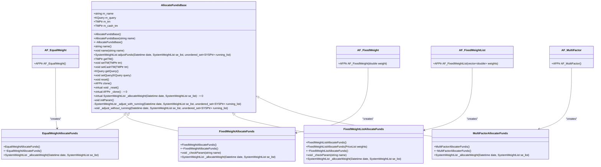
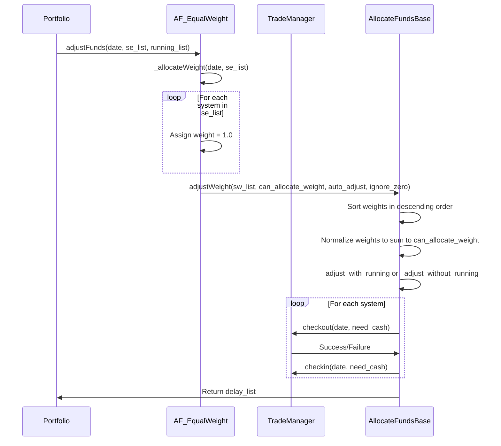
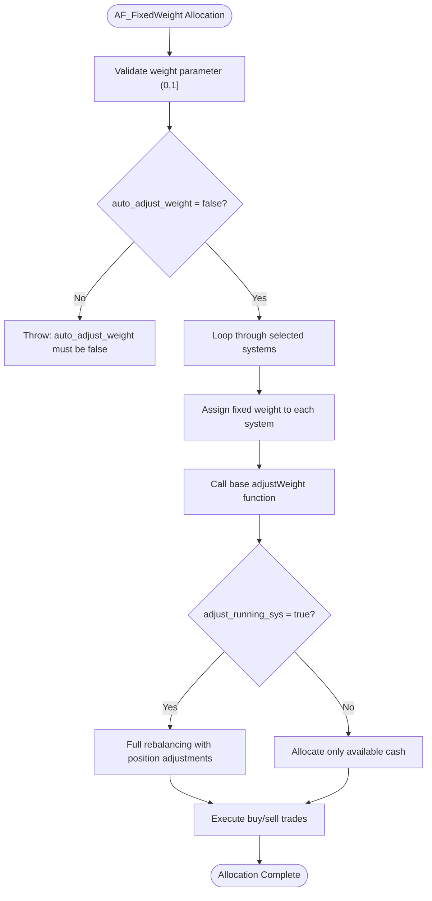
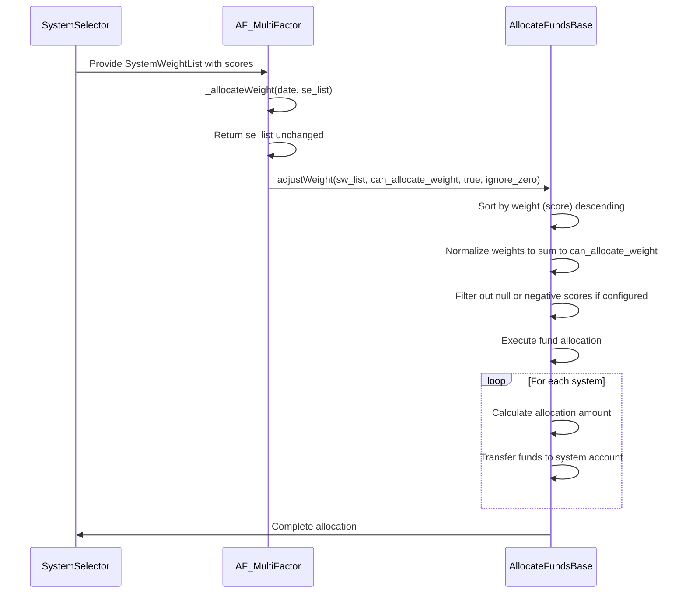

# Allocation Funds

<cite>
**Referenced Files in This Document**   
- [AllocateFundsBase.h](file://hikyuu_cpp/hikyuu/trade_sys/allocatefunds/AllocateFundsBase.h)
- [AllocateFundsBase.cpp](file://hikyuu_cpp/hikyuu/trade_sys/allocatefunds/AllocateFundsBase.cpp)
- [AF_EqualWeight.h](file://hikyuu_cpp/hikyuu/trade_sys/allocatefunds/crt/AF_EqualWeight.h)
- [EqualWeightAllocateFunds.cpp](file://hikyuu_cpp/hikyuu/trade_sys/allocatefunds/imp/EqualWeightAllocateFunds.cpp)
- [AF_FixedWeight.h](file://hikyuu_cpp/hikyuu/trade_sys/allocatefunds/crt/AF_FixedWeight.h)
- [FixedWeightAllocateFunds.cpp](file://hikyuu_cpp/hikyuu/trade_sys/allocatefunds/imp/FixedWeightAllocateFunds.cpp)
- [AF_FixedWeightList.h](file://hikyuu_cpp/hikyuu/trade_sys/allocatefunds/crt/AF_FixedWeightList.h)
- [FixedWeightListAllocateFunds.cpp](file://hikyuu_cpp/hikyuu/trade_sys/allocatefunds/imp/FixedWeightListAllocateFunds.cpp)
- [AF_MultiFactor.h](file://hikyuu_cpp/hikyuu/trade_sys/allocatefunds/crt/AF_MultiFactor.h)
- [MultiFactorAllocaterFunds.cpp](file://hikyuu_cpp/hikyuu/trade_sys/allocatefunds/imp/MultiFactorAllocaterFunds.cpp)
- [_AllocateFunds.cpp](file://hikyuu_pywrap/trade_sys/_AllocateFunds.cpp)
</cite>

## Table of Contents
1. [Introduction](#introduction)
2. [Core Components](#core-components)
3. [Architecture Overview](#architecture-overview)
4. [Detailed Component Analysis](#detailed-component-analysis)
5. [Performance Considerations](#performance-considerations)
6. [Troubleshooting Guide](#troubleshooting-guide)
7. [Conclusion](#conclusion)

## Introduction
The Allocation Funds component in Hikyuu provides a comprehensive framework for capital distribution across multiple trading systems or assets. This system enables portfolio managers to implement various allocation strategies including equal weighting, fixed percentage allocations, and multi-factor weighted allocations. The framework is designed to work within the Portfolio (PF) system, where it receives a list of selected systems from a Selector and adjusts capital allocation based on the specified strategy. The allocation process considers both new positions and existing holdings, with configurable options for handling running systems and reserved capital percentages.

**Section sources**
- [AllocateFundsBase.h](file://hikyuu_cpp/hikyuu/trade_sys/allocatefunds/AllocateFundsBase.h#L17-L20)

## Core Components
The allocation funds system in Hikyuu consists of a base class AllocateFundsBase that defines the interface for all allocation strategies, along with several concrete implementations: AF_EqualWeight, AF_FixedWeight, AF_FixedWeightList, and AF_MultiFactor. These components work together to determine how capital is distributed across selected trading systems. The framework supports both C++ and Python interfaces, allowing for flexible integration with portfolio management systems. Key parameters such as "adjust_running_sys", "auto_adjust_weight", and "reserve_percent" provide fine-grained control over the allocation behavior, including whether to adjust existing positions, how to handle weight normalization, and what percentage of capital to reserve.

**Section sources**
- [AllocateFundsBase.h](file://hikyuu_cpp/hikyuu/trade_sys/allocatefunds/AllocateFundsBase.h#L22-L148)
- [AllocateFundsBase.cpp](file://hikyuu_cpp/hikyuu/trade_sys/allocatefunds/AllocateFundsBase.cpp#L29-L69)

## Architecture Overview


**Diagram sources**
- [AllocateFundsBase.h](file://hikyuu_cpp/hikyuu/trade_sys/allocatefunds/AllocateFundsBase.h#L22-L148)
- [EqualWeightAllocateFunds.cpp](file://hikyuu_cpp/hikyuu/trade_sys/allocatefunds/imp/EqualWeightAllocateFunds.cpp#L16-L28)
- [FixedWeightAllocateFunds.cpp](file://hikyuu_cpp/hikyuu/trade_sys/allocatefunds/imp/FixedWeightAllocateFunds.cpp#L16-L44)
- [FixedWeightListAllocateFunds.cpp](file://hikyuu_cpp/hikyuu/trade_sys/allocatefunds/imp/FixedWeightListAllocateFunds.cpp#L16-L50)
- [MultiFactorAllocaterFunds.cpp](file://hikyuu_cpp/hikyuu/trade_sys/allocatefunds/imp/MultiFactorAllocaterFunds.cpp#L12-L18)

## Detailed Component Analysis

### AllocateFundsBase Interface
The AllocateFundsBase class serves as the foundation for all allocation strategies in Hikyuu. It defines the core interface and provides common functionality for capital distribution across trading systems. The base class handles critical operations such as parameter initialization, weight adjustment, and fund allocation logic. Key parameters include "adjust_running_sys" which determines whether to adjust positions in currently running systems, "auto_adjust_weight" which controls automatic weight normalization, and "reserve_percent" which specifies the portion of capital to keep unallocated. The class implements two main allocation modes: _adjust_with_running for comprehensive portfolio rebalancing including existing positions, and _adjust_without_running for allocating only remaining cash to new positions.

**Section sources**
- [AllocateFundsBase.h](file://hikyuu_cpp/hikyuu/trade_sys/allocatefunds/AllocateFundsBase.h#L22-L148)
- [AllocateFundsBase.cpp](file://hikyuu_cpp/hikyuu/trade_sys/allocatefunds/AllocateFundsBase.cpp#L29-L69)

### AF_EqualWeight Strategy
The AF_EqualWeight allocation strategy distributes capital equally among all selected trading systems. Each system receives an equal weight value of 1.0 in the initial allocation phase, which is then normalized based on the total number of systems. This strategy is ideal for diversified portfolios where no single asset or system is favored over others. The implementation is straightforward, assigning a uniform weight to each system in the selection list, after which the base class handles the normalization and actual fund distribution. This approach ensures that each position receives approximately the same capital allocation, promoting portfolio diversification.



**Diagram sources**
- [AF_EqualWeight.h](file://hikyuu_cpp/hikyuu/trade_sys/allocatefunds/crt/AF_EqualWeight.h#L16-L21)
- [EqualWeightAllocateFunds.cpp](file://hikyuu_cpp/hikyuu/trade_sys/allocatefunds/imp/EqualWeightAllocateFunds.cpp#L20-L28)

### AF_FixedWeight Strategy
The AF_FixedWeight strategy allocates a fixed percentage of total capital to each selected trading system. This approach allows investors to maintain consistent position sizing across their portfolio. The strategy takes a single parameter "weight" that specifies the allocation percentage for each system (e.g., 0.1 for 10%). Unlike the equal weight strategy, this method assigns the same fixed weight to every system rather than equal proportions. The implementation prevents automatic weight adjustment by setting "auto_adjust_weight" to false, ensuring that the specified weight is used directly without normalization based on the number of systems.



**Diagram sources**
- [AF_FixedWeight.h](file://hikyuu_cpp/hikyuu/trade_sys/allocatefunds/crt/AF_FixedWeight.h#L16-L22)
- [FixedWeightAllocateFunds.cpp](file://hikyuu_cpp/hikyuu/trade_sys/allocatefunds/imp/FixedWeightAllocateFunds.cpp#L35-L44)

### AF_FixedWeightList Strategy
The AF_FixedWeightList strategy enables customized allocation by accepting a list of weights corresponding to each selected system. This approach provides maximum flexibility, allowing different allocation percentages for different systems based on investment priorities or risk profiles. The weights are assigned sequentially to systems in the selection list, with the implementation ensuring that the input weights list is not empty. Like AF_FixedWeight, this strategy disables automatic weight adjustment to preserve the specified allocation ratios. This method is particularly useful for implementing strategic asset allocation models where different asset classes or trading systems have predetermined target weights.

```mermaid
erDiagram
SYSTEM ||--o{ ALLOCATION : "has"
SYSTEM {
string name
SYSPtr sys_ptr
}
ALLOCATION ||--o{ WEIGHT_LIST : "uses"
ALLOCATION {
string strategy_type
bool adjust_running_sys
double reserve_percent
}
WEIGHT_LIST {
vector~double~ weights
size_t weight_count
}
ALLOCATION }|-- AF_FixedWeightList : "implements"
AF_FixedWeightList {
PriceList getParam~weights~
void _checkParam~name~
SystemWeightList _allocateWeight~date, se_list~
}
```

**Diagram sources**
- [AF_FixedWeightList.h](file://hikyuu_cpp/hikyuu/trade_sys/allocatefunds/crt/AF_FixedWeightList.h#L14-L20)
- [FixedWeightListAllocateFunds.cpp](file://hikyuu_cpp/hikyuu/trade_sys/allocatefunds/imp/FixedWeightListAllocateFunds.cpp#L39-L50)

### AF_MultiFactor Strategy
The AF_MultiFactor strategy uses the raw scores from the System Selector (SE) directly as allocation weights. This approach enables dynamic capital allocation based on the relative strength or ranking of different trading systems. Higher-scoring systems receive proportionally larger capital allocations, creating a momentum-based or relative strength portfolio construction method. The implementation is minimal, simply returning the selector's output list without modification, allowing the base class to handle weight normalization and distribution. This strategy is particularly effective in trend-following or quantitative ranking systems where recent performance or factor scores indicate future potential.



**Diagram sources**
- [AF_MultiFactor.h](file://hikyuu_cpp/hikyuu/trade_sys/allocatefunds/crt/AF_MultiFactor.h#L14-L19)
- [MultiFactorAllocaterFunds.cpp](file://hikyuu_cpp/hikyuu/trade_sys/allocatefunds/imp/MultiFactorAllocaterFunds.cpp#L16-L18)

### Custom Allocation Implementation
To implement a custom allocation strategy in Hikyuu, developers must create a class that inherits from AllocateFundsBase and implements the required virtual methods. The key method to override is _allocateWeight, which determines the weight assignment logic for each system. The implementation should also provide a factory function (similar to AF_EqualWeight, AF_FixedWeight, etc.) to create instances of the custom allocator. When implementing custom logic, developers can leverage the base class's parameter system for configuration and the built-in weight adjustment functions for normalization. The clone mechanism (via _clone) must also be implemented to support serialization and copying of the allocation strategy.

**Section sources**
- [AllocateFundsBase.h](file://hikyuu_cpp/hikyuu/trade_sys/allocatefunds/AllocateFundsBase.h#L84-L94)
- [AllocateFundsBase.h](file://hikyuu_cpp/hikyuu/trade_sys/allocatefunds/AllocateFundsBase.h#L181-L184)

## Performance Considerations
The allocation funds system in Hikyuu is designed with performance and memory efficiency in mind. The framework uses shared pointers (TMPtr, AFPtr) to minimize memory overhead and enable efficient object sharing across the portfolio management system. During rebalancing operations, the system processes allocations in a single pass through the selected systems list, reducing computational complexity to O(n) where n is the number of systems. The implementation includes optimizations such as early termination when available funds are exhausted and efficient sorting algorithms for weight prioritization. Memory usage scales linearly with the number of trading systems and historical data points, with careful management of temporary objects and containers. For large portfolios, the system efficiently handles the coordination between the main trading account and multiple sub-accounts, minimizing redundant calculations and database operations.

**Section sources**
- [AllocateFundsBase.cpp](file://hikyuu_cpp/hikyuu/trade_sys/allocatefunds/AllocateFundsBase.cpp#L110-L528)

## Troubleshooting Guide
When working with allocation funds in Hikyuu, several common issues may arise. If allocations are not being applied correctly, verify that the "adjust_running_sys" parameter is set appropriately for your use case - true for full rebalancing including existing positions, false for allocating only remaining cash. For unexpected weight distributions, check the "auto_adjust_weight" and "ignore_zero_weight" parameters, as these significantly affect how weights are normalized. If transactions are failing, ensure that the cash account has sufficient funds and that the precision settings are appropriate for your trading instruments. When using AF_FixedWeightList, confirm that the weights vector is not empty and contains valid values. For debugging, enable the "trace" parameter to log detailed allocation steps and fund movements. Memory issues are rare but can occur with very large portfolios; in such cases, consider processing allocations in smaller batches or optimizing the selection criteria to reduce the number of systems.

**Section sources**
- [AllocateFundsBase.cpp](file://hikyuu_cpp/hikyuu/trade_sys/allocatefunds/AllocateFundsBase.cpp#L45-L68)
- [AllocateFundsBase.cpp](file://hikyuu_cpp/hikyuu/trade_sys/allocatefunds/AllocateFundsBase.cpp#L187-L210)

## Conclusion
The allocation funds framework in Hikyuu provides a robust and flexible system for capital distribution across multiple trading strategies or assets. With built-in support for equal weighting, fixed percentage allocations, custom weight lists, and multi-factor scoring, the system accommodates a wide range of portfolio management approaches. The well-defined interface through AllocateFundsBase enables easy extension with custom allocation logic, while the efficient implementation ensures good performance even with large portfolios. The integration between C++ core components and Python wrappers allows for seamless use in both high-performance computing environments and interactive analysis workflows. By understanding the parameters and behavior of each allocation strategy, investors can effectively implement their desired portfolio construction methodology within the Hikyuu ecosystem.