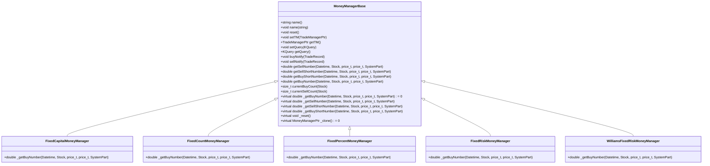
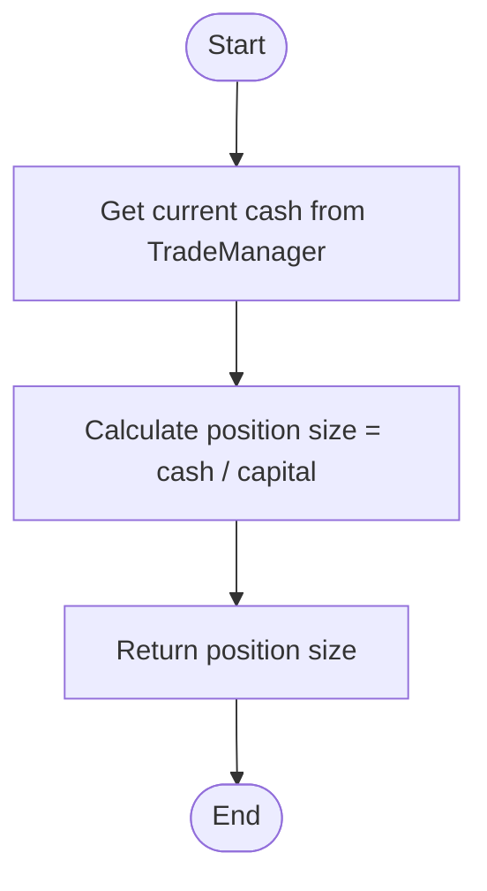
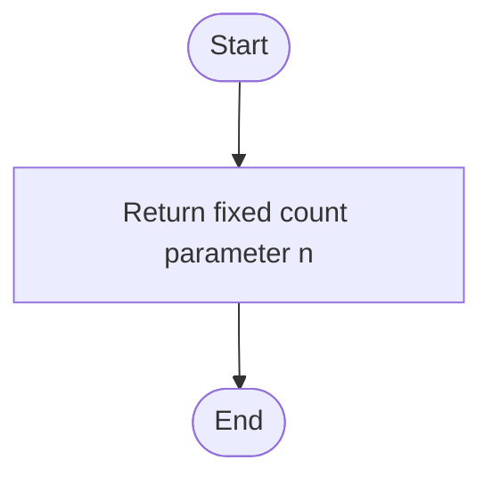
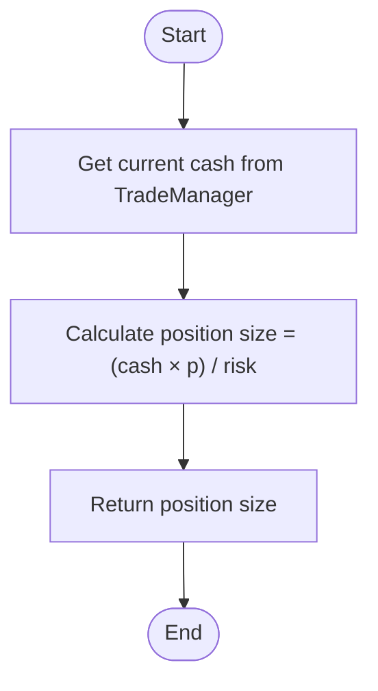
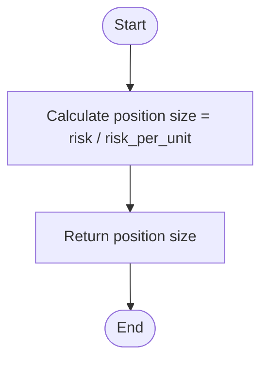
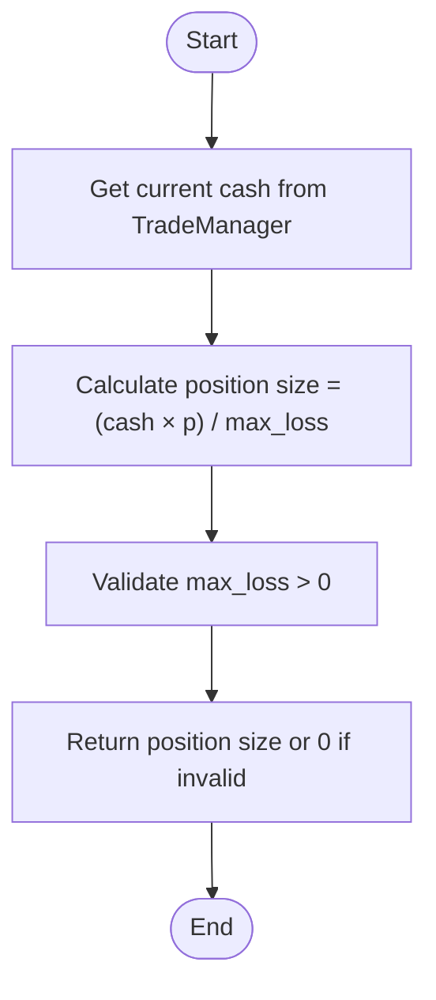
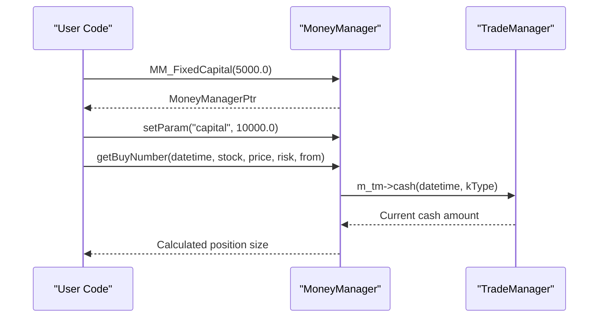
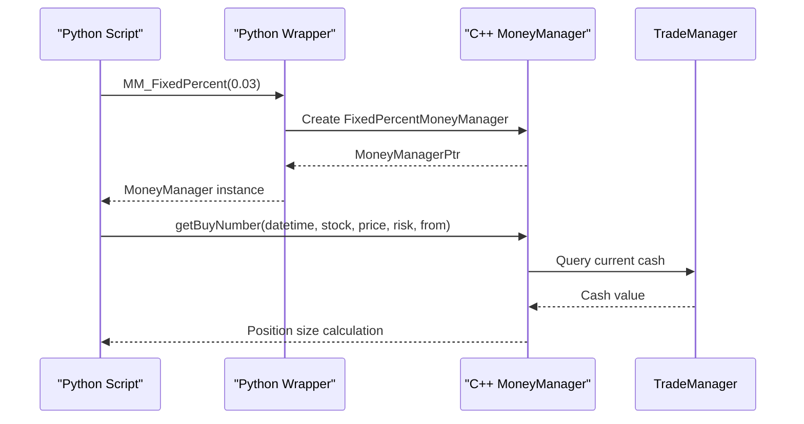

# Money Management

<cite>
**Referenced Files in This Document**   
- [MoneyManagerBase.h](file://hikyuu_cpp/hikyuu/trade_sys/moneymanager/MoneyManagerBase.h)
- [MM_FixedCapital.h](file://hikyuu_cpp/hikyuu/trade_sys/moneymanager/crt/MM_FixedCapital.h)
- [FixedCapitalMoneyManager.cpp](file://hikyuu_cpp/hikyuu/trade_sys/moneymanager/imp/FixedCapitalMoneyManager.cpp)
- [MM_FixedCount.h](file://hikyuu_cpp/hikyuu/trade_sys/moneymanager/crt/MM_FixedCount.h)
- [FixedCountMoneyManager.cpp](file://hikyuu_cpp/hikyuu/trade_sys/moneymanager/imp/FixedCountMoneyManager.cpp)
- [MM_FixedPercent.h](file://hikyuu_cpp/hikyuu/trade_sys/moneymanager/crt/MM_FixedPercent.h)
- [FixedPercentMoneyManager.cpp](file://hikyuu_cpp/hikyuu/trade_sys/moneymanager/imp/FixedPercentMoneyManager.cpp)
- [MM_FixedRisk.h](file://hikyuu_cpp/hikyuu/trade_sys/moneymanager/crt/MM_FixedRisk.h)
- [FixedRiskMoneyManager.cpp](file://hikyuu_cpp/hikyuu/trade_sys/moneymanager/imp/FixedRiskMoneyManager.cpp)
- [MM_WilliamsFixedRisk.h](file://hikyuu_cpp/hikyuu/trade_sys/moneymanager/crt/MM_WilliamsFixedRisk.h)
- [WilliamsFixedRiskMoneyManager.cpp](file://hikyuu_cpp/hikyuu/trade_sys/moneymanager/imp/WilliamsFixedRiskMoneyManager.cpp)
- [trade_sys_main.cpp](file://hikyuu_pywrap/trade_sys/trade_sys_main.cpp)
- [test_money_manager.py](file://hikyuu/test/MoneyManager.py)
</cite>

## Table of Contents
1. [Introduction](#introduction)
2. [MoneyManagerBase Interface](#moneymanagerbase-interface)
3. [Fixed Capital Strategy](#fixed-capital-strategy)
4. [Fixed Count Strategy](#fixed-count-strategy)
5. [Fixed Percent Strategy](#fixed-percent-strategy)
6. [Fixed Risk Strategy](#fixed-risk-strategy)
7. [Williams Fixed Risk Strategy](#williams-fixed-risk-strategy)
8. [Implementation and Configuration Examples](#implementation-and-configuration-examples)
9. [Performance Considerations](#performance-considerations)
10. [Conclusion](#conclusion)

## Introduction
The Hikyuu money management system provides a comprehensive framework for position sizing and risk management in trading systems. This documentation details the available money management strategies including MM_FixedCapital, MM_FixedCount, MM_FixedPercent, MM_FixedRisk, and WilliamsFixedRisk. Each strategy implements the MoneyManagerBase interface and determines trade size based on different parameters such as account equity, risk percentage, or fixed units. The system is designed to integrate seamlessly with trading systems and supports both C++ and Python interfaces.

## MoneyManagerBase Interface
The MoneyManagerBase class serves as the foundation for all money management strategies in Hikyuu. It defines the core interface that all concrete implementations must follow.

**Diagram sources**
- [MoneyManagerBase.h](file://hikyuu_cpp/hikyuu/trade_sys/moneymanager/MoneyManagerBase.h)
- [FixedCapitalMoneyManager.cpp](file://hikyuu_cpp/hikyuu/trade_sys/moneymanager/imp/FixedCapitalMoneyManager.cpp)
- [FixedCountMoneyManager.cpp](file://hikyuu_cpp/hikyuu/trade_sys/moneymanager/imp/FixedCountMoneyManager.cpp)
- [FixedPercentMoneyManager.cpp](file://hikyuu_cpp/hikyuu/trade_sys/moneymanager/imp/FixedPercentMoneyManager.cpp)
- [FixedRiskMoneyManager.cpp](file://hikyuu_cpp/hikyuu/trade_sys/moneymanager/imp/FixedRiskMoneyManager.cpp)
- [WilliamsFixedRiskMoneyManager.cpp](file://hikyuu_cpp/hikyuu/trade_sys/moneymanager/imp/WilliamsFixedRiskMoneyManager.cpp)

**Section sources**
- [MoneyManagerBase.h](file://hikyuu_cpp/hikyuu/trade_sys/moneymanager/MoneyManagerBase.h)

## Fixed Capital Strategy
The MM_FixedCapital strategy implements a fixed capital position sizing approach where the number of units to buy is determined by dividing the current cash by a fixed capital amount.

### Implementation Logic
The FixedCapitalMoneyManager calculates position size using the formula: **Buy Quantity = Current Cash / Capital**. This strategy is useful when you want to allocate a fixed portion of your capital to each trade.

### Parameters
- **capital**: The fixed capital amount used for position sizing (default: 10000.00)

### Position Sizing Algorithm

**Diagram sources**
- [FixedCapitalMoneyManager.cpp](file://hikyuu_cpp/hikyuu/trade_sys/moneymanager/imp/FixedCapitalMoneyManager.cpp)

**Section sources**
- [MM_FixedCapital.h](file://hikyuu_cpp/hikyuu/trade_sys/moneymanager/crt/MM_FixedCapital.h)
- [FixedCapitalMoneyManager.cpp](file://hikyuu_cpp/hikyuu/trade_sys/moneymanager/imp/FixedCapitalMoneyManager.cpp)

## Fixed Count Strategy
The MM_FixedCount strategy implements a fixed quantity position sizing approach where each trade buys a predetermined number of units regardless of account size or risk.

### Implementation Logic
The FixedCountMoneyManager returns a constant value for the number of units to buy, making it useful for testing and comparison purposes. This strategy does not consider account equity or risk parameters.

### Parameters
- **n**: The fixed number of units to trade (default: 100)

### Position Sizing Algorithm

**Diagram sources**
- [FixedCountMoneyManager.cpp](file://hikyuu_cpp/hikyuu/trade_sys/moneymanager/imp/FixedCountMoneyManager.cpp)

**Section sources**
- [MM_FixedCount.h](file://hikyuu_cpp/hikyuu/trade_sys/moneymanager/crt/MM_FixedCount.h)
- [FixedCountMoneyManager.cpp](file://hikyuu_cpp/hikyuu/trade_sys/moneymanager/imp/FixedCountMoneyManager.cpp)

## Fixed Percent Strategy
The MM_FixedPercent strategy implements a percentage risk model based on Van K. Tharp's position sizing methods, where position size is determined by the percentage of total equity at risk.

### Implementation Logic
The FixedPercentMoneyManager calculates position size using the formula: **Position Size = (Current Cash × Risk Percentage) / Risk per Unit**. This approach ensures that each trade risks a consistent percentage of the trading account.

### Parameters
- **p**: The percentage of total equity to risk per trade (default: 0.02, representing 2%)

### Position Sizing Algorithm

**Diagram sources**
- [FixedPercentMoneyManager.cpp](file://hikyuu_cpp/hikyuu/trade_sys/moneymanager/imp/FixedPercentMoneyManager.cpp)

**Section sources**
- [MM_FixedPercent.h](file://hikyuu_cpp/hikyuu/trade_sys/moneymanager/crt/MM_FixedPercent.h)
- [FixedPercentMoneyManager.cpp](file://hikyuu_cpp/hikyuu/trade_sys/moneymanager/imp/FixedPercentMoneyManager.cpp)

## Fixed Risk Strategy
The MM_FixedRisk strategy implements a fixed monetary risk approach where each trade risks a predetermined dollar amount regardless of account size.

### Implementation Logic
The FixedRiskMoneyManager calculates position size using the formula: **Position Size = Fixed Risk Amount / Risk per Unit**. This strategy ensures that each trade has the same absolute dollar risk.

### Parameters
- **risk**: The fixed monetary amount to risk per trade (default: 1000.00)

### Position Sizing Algorithm

**Diagram sources**
- [FixedRiskMoneyManager.cpp](file://hikyuu_cpp/hikyuu/trade_sys/moneymanager/imp/FixedRiskMoneyManager.cpp)

**Section sources**
- [MM_FixedRisk.h](file://hikyuu_cpp/hikyuu/trade_sys/moneymanager/crt/MM_FixedRisk.h)
- [FixedRiskMoneyManager.cpp](file://hikyuu_cpp/hikyuu/trade_sys/moneymanager/imp/FixedRiskMoneyManager.cpp)

## Williams Fixed Risk Strategy
The WilliamsFixedRisk strategy implements a modified fixed risk approach inspired by Larry Williams' trading methods, combining percentage risk with a maximum loss parameter.

### Implementation Logic
The WilliamsFixedRiskMoneyManager calculates position size using the formula: **Position Size = (Account Balance × Risk Percentage) / Maximum Loss**. This approach combines elements of percentage risk with a fixed maximum loss parameter.

### Parameters
- **p**: The risk percentage of account balance (default: 0.1, representing 10%)
- **max_loss**: The maximum loss amount per unit (default: 1000.00)

### Position Sizing Algorithm

**Diagram sources**
- [WilliamsFixedRiskMoneyManager.cpp](file://hikyuu_cpp/hikyuu/trade_sys/moneymanager/imp/WilliamsFixedRiskMoneyManager.cpp)

**Section sources**
- [MM_WilliamsFixedRisk.h](file://hikyuu_cpp/hikyuu/trade_sys/moneymanager/crt/MM_WilliamsFixedRisk.h)
- [WilliamsFixedRiskMoneyManager.cpp](file://hikyuu_cpp/hikyuu/trade_sys/moneymanager/imp/WilliamsFixedRiskMoneyManager.cpp)

## Implementation and Configuration Examples

### C++ Examples

**Diagram sources**
- [FixedCapitalMoneyManager.cpp](file://hikyuu_cpp/hikyuu/trade_sys/moneymanager/imp/FixedCapitalMoneyManager.cpp)

### Python Examples

**Diagram sources**
- [trade_sys_main.cpp](file://hikyuu_pywrap/trade_sys/trade_sys_main.cpp)
- [FixedPercentMoneyManager.cpp](file://hikyuu_cpp/hikyuu/trade_sys/moneymanager/imp/FixedPercentMoneyManager.cpp)

**Section sources**
- [test_money_manager.py](file://hikyuu/test/MoneyManager.py)

## Performance Considerations
When implementing money management strategies in high-frequency trading scenarios, several performance factors should be considered:

### Calculation Efficiency
All money management strategies in Hikyuu are designed for efficient calculation with O(1) time complexity for position sizing operations. The calculations involve simple arithmetic operations that can be executed quickly.

### Memory Usage
The memory footprint of money managers is minimal, primarily storing parameter values and maintaining transaction state. The FixedCapital, FixedCount, and FixedRisk strategies have the lowest memory overhead as they only store one or two parameters.

### Integration Performance
When integrating with trading systems, the performance impact is primarily determined by:
- Frequency of position size calculations
- Overhead of querying current cash balance from TradeManager
- Serialization costs when persisting state

The system is optimized to minimize these overheads through efficient data structures and caching mechanisms.

**Section sources**
- [MoneyManagerBase.h](file://hikyuu_cpp/hikyuu/trade_sys/moneymanager/MoneyManagerBase.h)
- [FixedCapitalMoneyManager.cpp](file://hikyuu_cpp/hikyuu/trade_sys/moneymanager/imp/FixedCapitalMoneyManager.cpp)

## Conclusion
The Hikyuu money management system provides a robust framework for implementing various position sizing strategies. The MoneyManagerBase interface ensures consistency across different strategies while allowing for specialized implementations. Each strategy serves different risk management needs:
- MM_FixedCapital for capital-based allocation
- MM_FixedCount for consistent unit trading
- MM_FixedPercent for percentage risk management
- MM_FixedRisk for fixed monetary risk
- WilliamsFixedRisk for combined percentage and maximum loss approaches

The system supports both C++ and Python interfaces, making it accessible for different development environments. When implementing custom money management logic, developers should inherit from MoneyManagerBase and implement the required virtual methods while adhering to the parameter validation and cloning interfaces.