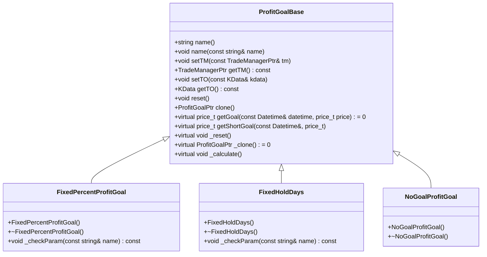
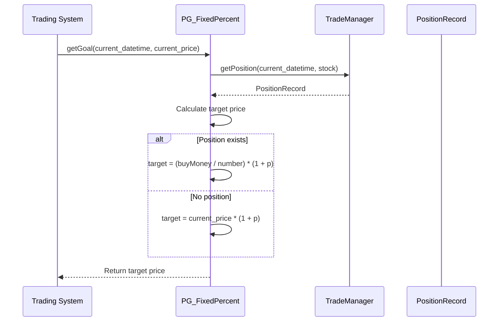
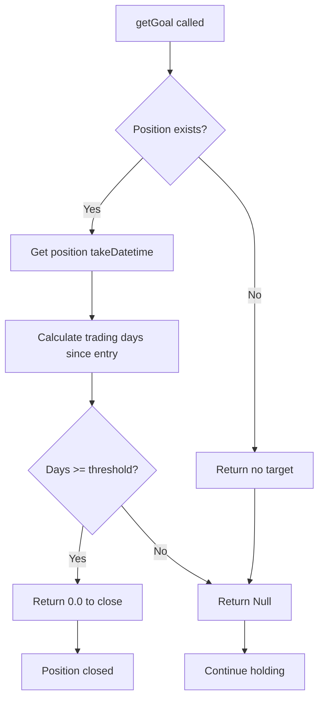
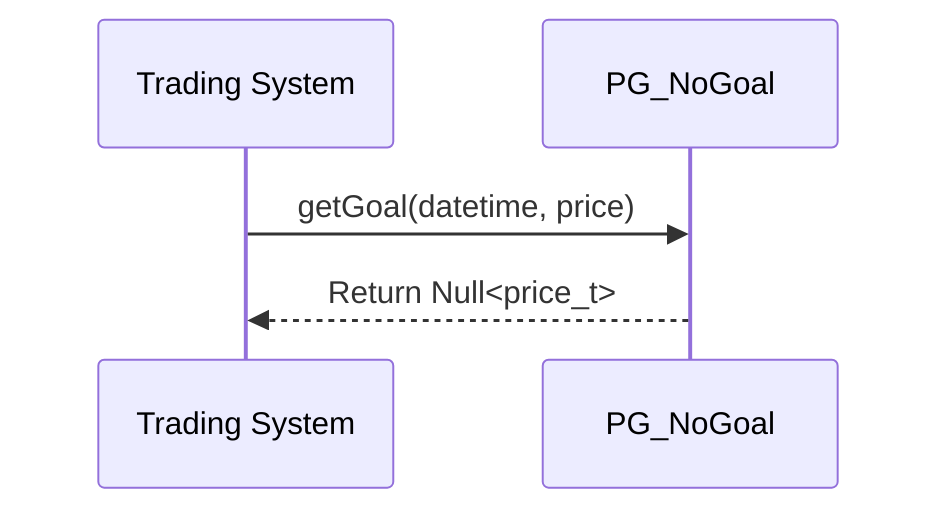
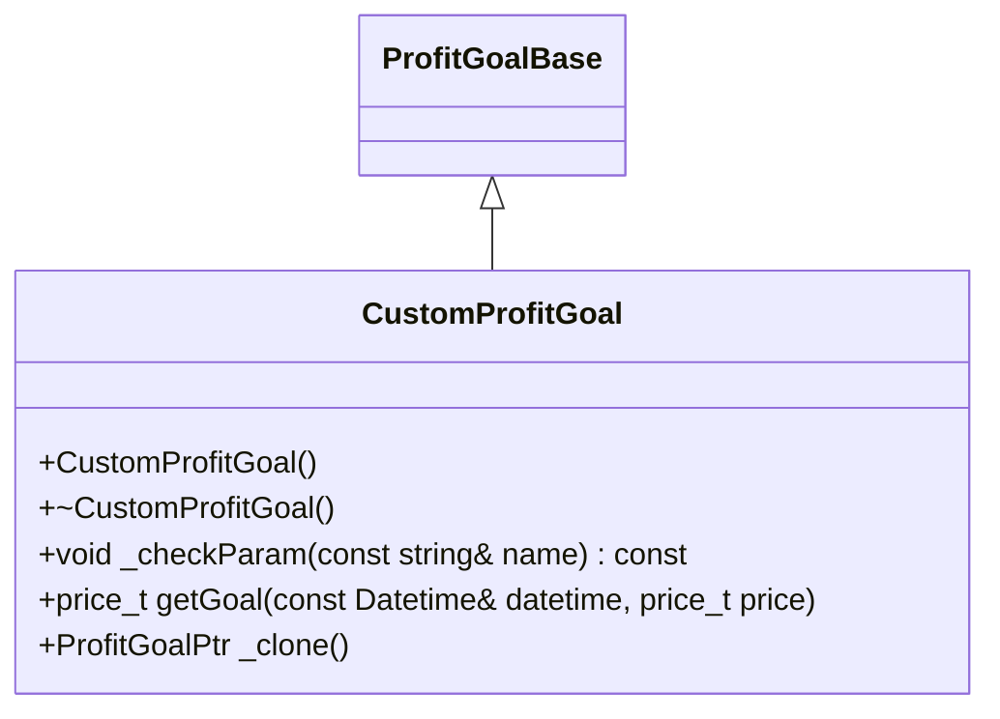

# Profit Goals

<cite>
**Referenced Files in This Document**   
- [ProfitGoalBase.h](file://hikyuu_cpp/hikyuu/trade_sys/profitgoal/ProfitGoalBase.h)
- [ProfitGoalBase.cpp](file://hikyuu_cpp/hikyuu/trade_sys/profitgoal/ProfitGoalBase.cpp)
- [PG_FixedHoldDays.h](file://hikyuu_cpp/hikyuu/trade_sys/profitgoal/crt/PG_FixedHoldDays.h)
- [FixedHoldDays.h](file://hikyuu_cpp/hikyuu/trade_sys/profitgoal/imp/FixedHoldDays.h)
- [FixedHoldDays.cpp](file://hikyuu_cpp/hikyuu/trade_sys/profitgoal/imp/FixedHoldDays.cpp)
- [PG_FixedPercent.h](file://hikyuu_cpp/hikyuu/trade_sys/profitgoal/crt/PG_FixedPercent.h)
- [FixedPercentProfitGoal.h](file://hikyuu_cpp/hikyuu/trade_sys/profitgoal/imp/FixedPercentProfitGoal.h)
- [FixedPercentProfitGoal.cpp](file://hikyuu_cpp/hikyuu/trade_sys/profitgoal/imp/FixedPercentProfitGoal.cpp)
- [PG_NoGoal.h](file://hikyuu_cpp/hikyuu/trade_sys/profitgoal/crt/PG_NoGoal.h)
- [NoGoalProfitGoal.h](file://hikyuu_cpp/hikyuu/trade_sys/profitgoal/imp/NoGoalProfitGoal.h)
- [NoGoalProfitGoal.cpp](file://hikyuu_cpp/hikyuu/trade_sys/profitgoal/imp/NoGoalProfitGoal.cpp)
- [_ProfitGoal.cpp](file://hikyuu_pywrap/trade_sys/_ProfitGoal.cpp)
</cite>

## Table of Contents
1. [Introduction](#introduction)
2. [ProfitGoalBase Interface](#profitgoalbase-interface)
3. [Fixed Percentage Profit Goal (PG_FixedPercent)](#fixed-percentage-profit-goal-pg_fixedpercent)
4. [Fixed Holding Days Profit Goal (PG_FixedHoldDays)](#fixed-holding-days-profit-goal-pg_fixedholddays)
5. [No Profit Goal (PG_NoGoal)](#no-profit-goal-pg_nogoal)
6. [Implementation and Integration](#implementation-and-integration)
7. [Performance Considerations](#performance-considerations)
8. [Conclusion](#conclusion)

## Introduction

The Profit Goal component in Hikyuu provides a systematic approach to determine when to close winning positions based on predefined criteria. This documentation details the available profit goal strategies including PG_FixedHoldDays, PG_FixedPercent, and PG_NoGoal, explaining their implementation logic, parameters, and exit timing algorithms. The profit goal system is designed to work within the broader trading system framework, allowing traders to implement various profit-taking strategies based on price targets, time-based holding periods, or other criteria.

**Section sources**
- [ProfitGoalBase.h](file://hikyuu_cpp/hikyuu/trade_sys/profitgoal/ProfitGoalBase.h#L1-L194)

## ProfitGoalBase Interface

The ProfitGoalBase class serves as the foundation for all profit goal strategies in Hikyuu. It defines the core interface that all concrete profit goal implementations must follow, providing a consistent way to manage profit-taking logic across different strategies.



**Diagram sources**
- [ProfitGoalBase.h](file://hikyuu_cpp/hikyuu/trade_sys/profitgoal/ProfitGoalBase.h#L23-L158)
- [FixedPercentProfitGoal.h](file://hikyuu_cpp/hikyuu/trade_sys/profitgoal/imp/FixedPercentProfitGoal.h#L16-L24)
- [FixedHoldDays.h](file://hikyuu_cpp/hikyuu/trade_sys/profitgoal/imp/FixedHoldDays.h#L16-L25)
- [NoGoalProfitGoal.h](file://hikyuu_cpp/hikyuu/trade_sys/profitgoal/imp/NoGoalProfitGoal.h#L16-L23)

The ProfitGoalBase class provides several key methods:

- **getGoal**: The primary virtual method that must be implemented by all subclasses, returning the target price at which to exit a position
- **setTM/getTM**: Methods to set and retrieve the TradeManager instance for accessing position information
- **setTO/getTO**: Methods to set and retrieve the KData object representing the trading instrument
- **reset**: Method to reset the state of the profit goal strategy
- **clone**: Method to create a copy of the profit goal instance

The interface also supports parameterization through the PARAMETER_SUPPORT_WITH_CHECK macro, allowing strategies to be configured with custom parameters that can be validated.

**Section sources**
- [ProfitGoalBase.h](file://hikyuu_cpp/hikyuu/trade_sys/profitgoal/ProfitGoalBase.h#L18-L158)
- [ProfitGoalBase.cpp](file://hikyuu_cpp/hikyuu/trade_sys/profitgoal/ProfitGoalBase.cpp#L1-L71)

## Fixed Percentage Profit Goal (PG_FixedPercent)

The PG_FixedPercent strategy implements a profit goal based on a fixed percentage increase from the entry price. This strategy is ideal for traders who want to lock in profits at specific percentage levels.



**Diagram sources**
- [FixedPercentProfitGoal.cpp](file://hikyuu_cpp/hikyuu/trade_sys/profitgoal/imp/FixedPercentProfitGoal.cpp#L36-L42)
- [FixedPercentProfitGoal.h](file://hikyuu_cpp/hikyuu/trade_sys/profitgoal/imp/FixedPercentProfitGoal.h#L16-L24)

### Implementation Logic

The PG_FixedPercent strategy calculates the target exit price using the formula: target_price = entry_price * (1 + percentage). The implementation handles both new positions and existing positions differently:

- For new positions (no existing position), the target is calculated based on the current price
- For existing positions, the target is calculated based on the actual average entry price from the position record

The strategy ensures that the percentage parameter is positive through parameter validation in the _checkParam method.

### Parameters

- **p**: The profit percentage threshold (default: 0.2 or 20%)
  - Must be greater than 0.0
  - Represents the desired profit margin as a decimal (0.2 = 20%)

### Exit Timing Algorithm

The algorithm checks the current market price against the calculated target price. When the market price reaches or exceeds the target price, the strategy returns 0.0 to indicate that the position should be closed. If the target has not been reached, it returns Null<price_t> to indicate no action.

**Section sources**
- [PG_FixedPercent.h](file://hikyuu_cpp/hikyuu/trade_sys/profitgoal/crt/PG_FixedPercent.h#L16-L21)
- [FixedPercentProfitGoal.cpp](file://hikyuu_cpp/hikyuu/trade_sys/profitgoal/imp/FixedPercentProfitGoal.cpp#L16-L48)
- [FixedPercentProfitGoal.h](file://hikyuu_cpp/hikyuu/trade_sys/profitgoal/imp/FixedPercentProfitGoal.h#L16-L24)

## Fixed Holding Days Profit Goal (PG_FixedHoldDays)

The PG_FixedHoldDays strategy implements a time-based profit goal that closes positions after a fixed number of trading days. This strategy is useful for traders who want to limit their exposure duration regardless of price movement.



**Diagram sources**
- [FixedHoldDays.cpp](file://hikyuu_cpp/hikyuu/trade_sys/profitgoal/imp/FixedHoldDays.cpp#L29-L45)
- [FixedHoldDays.h](file://hikyuu_cpp/hikyuu/trade_sys/profitgoal/imp/FixedHoldDays.h#L16-L25)

### Implementation Logic

The PG_FixedHoldDays strategy counts the number of trading days since a position was opened and closes it when the specified threshold is reached. The implementation:

1. Retrieves the current position information from the TradeManager
2. Gets the takeDatetime (entry time) from the position record
3. Creates a KQuery to count trading days between entry and current date
4. Compares the actual trading days with the configured threshold
5. Returns 0.0 to trigger position closure when the threshold is met

The strategy uses the stock's trading calendar to accurately count trading days, excluding weekends and holidays.

### Parameters

- **days**: The maximum number of holding days (default: 5)
  - Must be greater than 0
  - Counted in trading days (business days)

### Exit Timing Algorithm

The algorithm uses the stock's index range to determine the number of trading days between the position entry date and the current date. When this count reaches or exceeds the configured threshold, the strategy returns 0.0 to indicate that the position should be closed. Otherwise, it returns Null<price_t> to continue holding.

**Section sources**
- [PG_FixedHoldDays.h](file://hikyuu_cpp/hikyuu/trade_sys/profitgoal/crt/PG_FixedHoldDays.h#L16-L22)
- [FixedHoldDays.cpp](file://hikyuu_cpp/hikyuu/trade_sys/profitgoal/imp/FixedHoldDays.cpp#L16-L54)
- [FixedHoldDays.h](file://hikyuu_cpp/hikyuu/trade_sys/profitgoal/imp/FixedHoldDays.h#L16-L25)

## No Profit Goal (PG_NoGoal)

The PG_NoGoal strategy represents the absence of a profit goal, allowing positions to remain open indefinitely based on other system rules. This strategy is primarily used for testing and comparison purposes.



**Diagram sources**
- [NoGoalProfitGoal.cpp](file://hikyuu_cpp/hikyuu/trade_sys/profitgoal/imp/NoGoalProfitGoal.cpp#L20-L22)
- [NoGoalProfitGoal.h](file://hikyuu_cpp/hikyuu/trade_sys/profitgoal/imp/NoGoalProfitGoal.h#L16-L23)

### Implementation Logic

The PG_NoGoal strategy is the simplest implementation, always returning Null<price_t> from the getGoal method. This indicates that no profit target has been set, allowing the position to be managed solely by other components of the trading system such as stop-loss rules or signal changes.

### Parameters

This strategy has no parameters as it represents the absence of profit goal constraints.

### Exit Timing Algorithm

The algorithm never triggers a profit-based exit, as it always returns Null<price_t>. Position closures must be initiated by other system components.

**Section sources**
- [PG_NoGoal.h](file://hikyuu_cpp/hikyuu/trade_sys/profitgoal/crt/PG_NoGoal.h#L16-L20)
- [NoGoalProfitGoal.cpp](file://hikyuu_cpp/hikyuu/trade_sys/profitgoal/imp/NoGoalProfitGoal.cpp#L16-L29)
- [NoGoalProfitGoal.h](file://hikyuu_cpp/hikyuu/trade_sys/profitgoal/imp/NoGoalProfitGoal.h#L16-L23)

## Implementation and Integration

### Custom Profit Goal Implementation

To implement a custom profit goal strategy, inherit from ProfitGoalBase and implement the required virtual methods:



Key implementation requirements:
- Implement getGoal method to define exit logic
- Implement _clone method to support cloning
- Optionally implement _reset for state management
- Use setParam/getParam for configurable parameters

### C++ Integration Example

```cpp
// Create a fixed percentage profit goal with 15% target
ProfitGoalPtr pg = PG_FixedPercent(0.15);

// Create a time-based profit goal with 10-day holding period
ProfitGoalPtr pg_days = PG_FixedHoldDays(10);

// Create and configure a custom profit goal
auto custom_pg = make_shared<CustomProfitGoal>();
custom_pg->setParam<double>("target", 0.25);
custom_pg->setParam<int>("min_days", 3);
```

### Python Integration Example

```python
# Create a fixed percentage profit goal with 20% target
pg = PG_FixedPercent(0.2)

# Create a time-based profit goal with 5-day holding period
pg_days = PG_FixedHoldDays(5)

# Create a no-goal strategy for testing
pg_none = PG_NoGoal()

# Access and modify parameters
print(pg.name)
pg.set_param("p", 0.25)
print(pg.get_param("p"))
```

The Python wrapper provides full access to the C++ profit goal functionality through pybind11 bindings, with proper documentation and parameter validation.

**Section sources**
- [_ProfitGoal.cpp](file://hikyuu_pywrap/trade_sys/_ProfitGoal.cpp#L1-L145)
- [ProfitGoalBase.h](file://hikyuu_cpp/hikyuu/trade_sys/profitgoal/ProfitGoalBase.h#L23-L158)

## Performance Considerations

### Memory Usage Patterns

The profit goal strategies are designed to be memory efficient:

- **State Management**: Most strategies maintain minimal state, primarily storing parameters and references to external components
- **Object Size**: The base ProfitGoalBase class has a small memory footprint with only a few member variables
- **Parameter Storage**: Parameters are stored in a shared parameter container, minimizing duplication

```mermaid
erDiagram
PROFIT_GOAL ||--o{ PARAMETERS : contains
PROFIT_GOAL }|--|| TRADE_MANAGER : references
PROFIT_GOAL }|--|| KDATA : references
PROFIT_GOAL {
string name
shared_ptr parameters
}
PARAMETERS {
string key
any value
}
TRADE_MANAGER {
string id
// other fields
}
KDATA {
Stock stock
// other fields
}
```

**Diagram sources**
- [ProfitGoalBase.h](file://hikyuu_cpp/hikyuu/trade_sys/profitgoal/ProfitGoalBase.h#L90-L94)
- [ProfitGoalBase.cpp](file://hikyuu_cpp/hikyuu/trade_sys/profitgoal/ProfitGoalBase.cpp#L35-L39)

### Tracking Multiple Positions

When tracking profit levels across multiple positions:

- **Efficiency**: The strategies use the TradeManager to efficiently query position information without maintaining duplicate state
- **Caching**: Position information is retrieved on-demand, leveraging the TradeManager's internal caching
- **Scalability**: The design scales well with multiple positions as the computational complexity is O(1) per position check

### Optimization Recommendations

1. **Reuse Instances**: Create profit goal instances once and reuse them across multiple systems to minimize allocation overhead
2. **Parameter Caching**: For frequently accessed parameters, consider caching the values locally if the parameter is not expected to change
3. **Batch Processing**: When evaluating multiple positions, consider batch operations through the TradeManager rather than individual queries

The profit goal system is optimized for low overhead, with the primary computational cost being the position lookup in the TradeManager, which is typically O(log n) due to indexing.

**Section sources**
- [ProfitGoalBase.h](file://hikyuu_cpp/hikyuu/trade_sys/profitgoal/ProfitGoalBase.h#L33-L42)
- [FixedHoldDays.cpp](file://hikyuu_cpp/hikyuu/trade_sys/profitgoal/imp/FixedHoldDays.cpp#L31-L32)
- [FixedPercentProfitGoal.cpp](file://hikyuu_cpp/hikyuu/trade_sys/profitgoal/imp/FixedPercentProfitGoal.cpp#L37-L38)

## Conclusion

The Hikyuu profit goal system provides a flexible and extensible framework for implementing various profit-taking strategies. The three built-in strategies—PG_FixedPercent, PG_FixedHoldDays, and PG_NoGoal—cover common trading approaches based on price targets, time-based holding periods, and open-ended positions. The ProfitGoalBase interface enables easy implementation of custom strategies while maintaining consistency across the system. The integration with both C++ and Python provides flexibility for different development environments, and the performance characteristics ensure efficient operation even with multiple positions. Traders can combine these profit goals with other system components like stop-loss rules and signal generators to create comprehensive trading strategies.

**Section sources**
- [ProfitGoalBase.h](file://hikyuu_cpp/hikyuu/trade_sys/profitgoal/ProfitGoalBase.h#L18-L158)
- [PG_FixedPercent.h](file://hikyuu_cpp/hikyuu/trade_sys/profitgoal/crt/PG_FixedPercent.h#L16-L21)
- [PG_FixedHoldDays.h](file://hikyuu_cpp/hikyuu/trade_sys/profitgoal/crt/PG_FixedHoldDays.h#L16-L22)
- [PG_NoGoal.h](file://hikyuu_cpp/hikyuu/trade_sys/profitgoal/crt/PG_NoGoal.h#L16-L20)