# Signal Indicators

<cite>
**Referenced Files in This Document**   
- [SignalBase.h](file://hikyuu_cpp/hikyuu/trade_sys/signal/SignalBase.h)
- [SG_AllwaysBuy.h](file://hikyuu_cpp/hikyuu/trade_sys/signal/crt/SG_AllwaysBuy.h)
- [AllwaysBuySignal.cpp](file://hikyuu_cpp/hikyuu/trade_sys/signal/imp/AllwaysBuySignal.cpp)
- [SG_Band.h](file://hikyuu_cpp/hikyuu/trade_sys/signal/crt/SG_Band.h)
- [BandSignal.cpp](file://hikyuu_cpp/hikyuu/trade_sys/signal/imp/BandSignal.cpp)
- [SG_Cross.h](file://hikyuu_cpp/hikyuu/trade_sys/signal/crt/SG_Cross.h)
- [CrossSignal.cpp](file://hikyuu_cpp/hikyuu/trade_sys/signal/imp/CrossSignal.cpp)
- [SG_CrossGold.h](file://hikyuu_cpp/hikyuu/trade_sys/signal/crt/SG_CrossGold.h)
- [CrossGoldSignal.cpp](file://hikyuu_cpp/hikyuu/trade_sys/signal/imp/CrossGoldSignal.cpp)
- [SG_Flex.h](file://hikyuu_cpp/hikyuu/trade_sys/signal/crt/SG_Flex.h)
- [SG_Logic.h](file://hikyuu_cpp/hikyuu/trade_sys/signal/crt/SG_Logic.h)
- [SG_Manual.h](file://hikyuu_cpp/hikyuu/trade_sys/signal/crt/SG_Manual.h)
- [ManualSignal.cpp](file://hikyuu_cpp/hikyuu/trade_sys/signal/imp/ManualSignal.cpp)
- [SG_Single.h](file://hikyuu_cpp/hikyuu/trade_sys/signal/crt/SG_Single.h)
- [SingleSignal.cpp](file://hikyuu_cpp/hikyuu/trade_sys/signal/imp/SingleSignal.cpp)
- [_Signal.cpp](file://hikyuu_pywrap/trade_sys/_Signal.cpp)
</cite>

## Table of Contents
1. [Introduction](#introduction)
2. [SignalBase Interface](#signalbase-interface)
3. [Available Signal Types](#available-signal-types)
4. [Band Signals](#band-signals)
5. [Cross Signals](#cross-signals)
6. [Logic Signals](#logic-signals)
7. [Custom Signal Implementation](#custom-signal-implementation)
8. [Performance Considerations](#performance-considerations)
9. [Examples](#examples)

## Introduction
This document provides comprehensive API documentation for the signal indicators in hikyuu, a quantitative trading system. Signal indicators are essential components that generate buy/sell triggers based on technical indicators and market conditions. The system offers various signal types including SG_AllwaysBuy, SG_Band, SG_Cross, SG_CrossGold, SG_Flex, SG_Logic, SG_Manual, and SG_Single. Each signal type has specific constructor parameters, configuration options, and behavior characteristics that determine when trading signals are generated. This documentation details the implementation, usage, and configuration of these signal types, providing both C++ and Python examples for practical application.

## SignalBase Interface
The SignalBase class serves as the foundation for all signal indicators in hikyuu, providing a consistent interface for signal generation and management. This abstract base class defines the core functionality that all concrete signal implementations must adhere to, ensuring uniform behavior across different signal types.

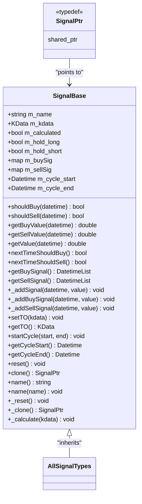

**Diagram sources**
- [SignalBase.h](file://hikyuu_cpp/hikyuu/trade_sys/signal/SignalBase.h#L24-L295)

**Section sources**
- [SignalBase.h](file://hikyuu_cpp/hikyuu/trade_sys/signal/SignalBase.h#L24-L295)

## Available Signal Types
The hikyuu system provides multiple signal types designed for different trading strategies and market conditions. Each signal type inherits from the SignalBase class and implements specific logic for generating buy/sell signals based on technical indicators and market data.

### SG_AllwaysBuy
The SG_AllwaysBuy signal is a special indicator that generates a buy signal for every trading period. This signal is typically used in conjunction with portfolio management (PF) systems where position management is handled externally.

**Constructor Parameters:**
- None

**Behavior Characteristics:**
- Generates a buy signal for every datetime in the KData series
- Does not generate any sell signals
- The 'alternate' parameter is automatically set to false
- Primarily used for testing or with portfolio rebalancing strategies

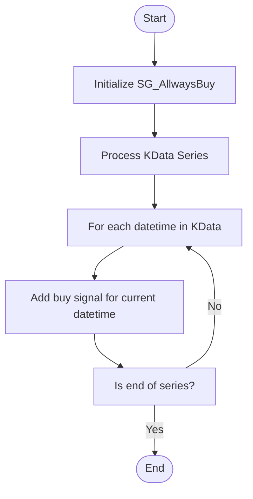

**Section sources**
- [AllwaysBuySignal.cpp](file://hikyuu_cpp/hikyuu/trade_sys/signal/imp/AllwaysBuySignal.cpp#L1-L37)
- [SG_AllwaysBuy.h](file://hikyuu_cpp/hikyuu/trade_sys/signal/crt/SG_AllwaysBuy.h)

### SG_Band
The SG_Band signal is an indicator band indicator that generates buy/sell signals when an indicator crosses predefined upper and lower thresholds. This signal is particularly useful for oscillators like RSI that have natural overbought and oversold levels.

**Constructor Parameters:**
- `ind`: The indicator to monitor
- `lower`: Lower threshold value or indicator
- `upper`: Upper threshold value or indicator

**Configuration Options:**
- Can accept either fixed price values or dynamic indicators for upper/lower bounds
- Requires that lower threshold is less than upper threshold
- Supports both absolute value thresholds and relative indicator thresholds

**Behavior Characteristics:**
- Generates a buy signal when the indicator value exceeds the upper threshold
- Generates a sell signal when the indicator value falls below the lower threshold
- Uses the discard period of the input indicator to determine valid signal points
- Processes data in chronological order to maintain temporal consistency

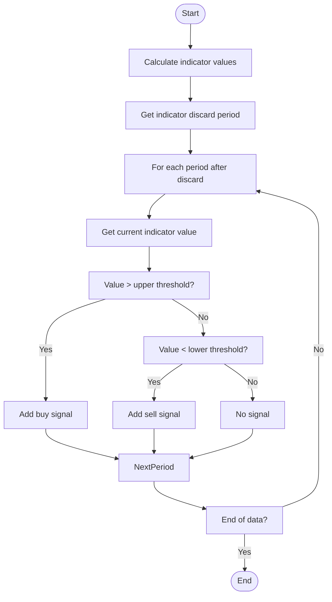

**Section sources**
- [BandSignal.cpp](file://hikyuu_cpp/hikyuu/trade_sys/signal/imp/BandSignal.cpp#L1-L53)
- [SG_Band.h](file://hikyuu_cpp/hikyuu/trade_sys/signal/crt/SG_Band.h#L1-L38)

### SG_Cross
The SG_Cross signal is a dual-line crossover indicator that generates buy/sell signals when two indicators cross each other. This is a classic technical analysis pattern used in moving average crossovers and MACD strategies.

**Constructor Parameters:**
- `fast`: The fast line indicator
- `slow`: The slow line indicator

**Configuration Options:**
- Both parameters must be valid indicators
- The indicators should have compatible calculation periods
- No additional configuration parameters required

**Behavior Characteristics:**
- Generates a buy signal when the fast line crosses above the slow line
- Generates a sell signal when the fast line crosses below the slow line
- Requires at least two periods of data to detect crossovers
- Validates that both indicators have the same size before processing
- Uses the maximum discard period of both indicators to determine valid signal points

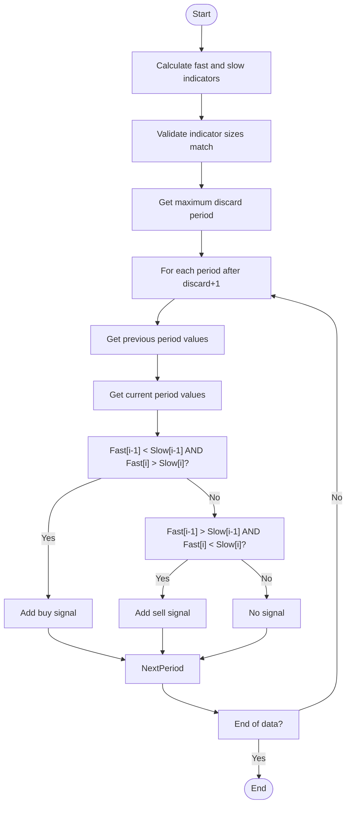

**Section sources**
- [CrossSignal.cpp](file://hikyuu_cpp/hikyuu/trade_sys/signal/imp/CrossSignal.cpp#L1-L55)
- [SG_Cross.h](file://hikyuu_cpp/hikyuu/trade_sys/signal/crt/SG_Cross.h#L1-L29)

### SG_CrossGold
The SG_CrossGold signal is an enhanced crossover indicator that requires confirmation of trend direction, commonly known as "golden cross" and "death cross" patterns. This signal adds directional confirmation to reduce false signals.

**Constructor Parameters:**
- `fast`: The fast line indicator
- `slow`: The slow line indicator

**Configuration Options:**
- Same as SG_Cross but with additional trend confirmation
- No additional configuration parameters

**Behavior Characteristics:**
- Generates a buy signal when fast line crosses above slow line AND both lines are trending upward
- Generates a sell signal when fast line crosses below slow line AND both lines are trending downward
- Provides additional confirmation compared to basic crossover
- Reduces whipsaw signals in sideways markets
- Implements the same crossover detection logic as SG_Cross but with additional trend validation

**Section sources**
- [SG_CrossGold.h](file://hikyuu_cpp/hikyuu/trade_sys/signal/crt/SG_CrossGold.h#L1-L30)

### SG_Flex
The SG_Flex signal is a self-crossover indicator that uses an indicator's own exponential moving average as the slow line. This creates a dynamic reference point based on the indicator's own behavior.

**Constructor Parameters:**
- `op`: The indicator to monitor
- `slow_n`: The period for the EMA slow line

**Configuration Options:**
- `slow_n` determines the smoothing period for the EMA
- Larger values create slower, more stable signals
- Smaller values create more sensitive, frequent signals

**Behavior Characteristics:**
- Uses the indicator itself as the fast line
- Uses EMA of the indicator as the slow line
- Generates buy signals when indicator crosses above its EMA
- Generates sell signals when indicator crosses below its EMA
- Combines momentum and trend-following characteristics

**Section sources**
- [SG_Flex.h](file://hikyuu_cpp/hikyuu/trade_sys/signal/crt/SG_Flex.h#L1-L30)

### SG_Logic
The SG_Logic signal provides logical operations between multiple signals, allowing complex trading strategies to be constructed from simpler components. This enables boolean combinations of different signal conditions.

**Constructor Parameters:**
- Various combinations of SignalPtr objects
- Boolean operation type (AND, OR, etc.)
- Alternate parameter for signal sequencing

**Configuration Options:**
- `alternate`: Whether to alternate buy/sell signals (default: true)
- Supports vector inputs for multiple signal combinations
- Provides SG_Add, SG_Sub, SG_And, SG_Or convenience functions

**Behavior Characteristics:**
- Supports arithmetic operations (+, -, *, /) between signals
- Supports logical operations (&, |) between signals
- Allows combination of multiple signals into complex conditions
- The alternate parameter controls signal sequencing behavior
- Provides operator overloading for intuitive signal composition

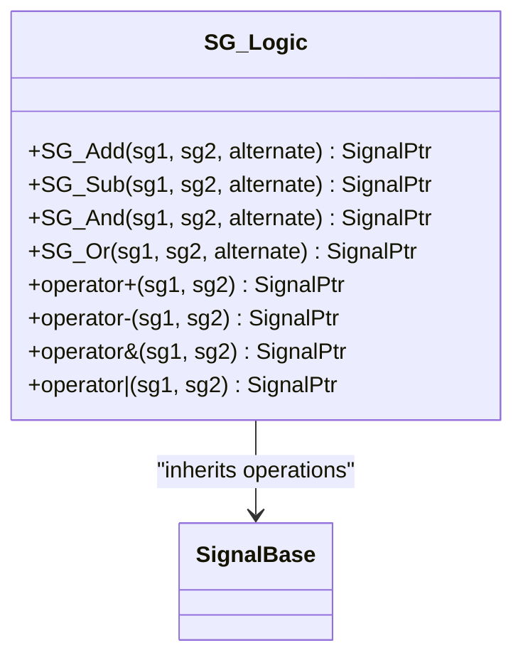

**Section sources**
- [SG_Logic.h](file://hikyuu_cpp/hikyuu/trade_sys/signal/crt/SG_Logic.h#L1-L127)

### SG_Manual
The SG_Manual signal is a special indicator that only allows manual addition of signals. This is primarily used for testing purposes or when signals need to be added programmatically outside the normal calculation flow.

**Constructor Parameters:**
- None

**Configuration Options:**
- No configurable parameters
- Signals must be added manually through API calls

**Behavior Characteristics:**
- Does not automatically generate any signals
- Requires manual addition of buy/sell signals
- Useful for backtesting specific trade ideas
- Can be used to implement custom signal logic externally
- The _calculate method is empty, indicating no automatic signal generation

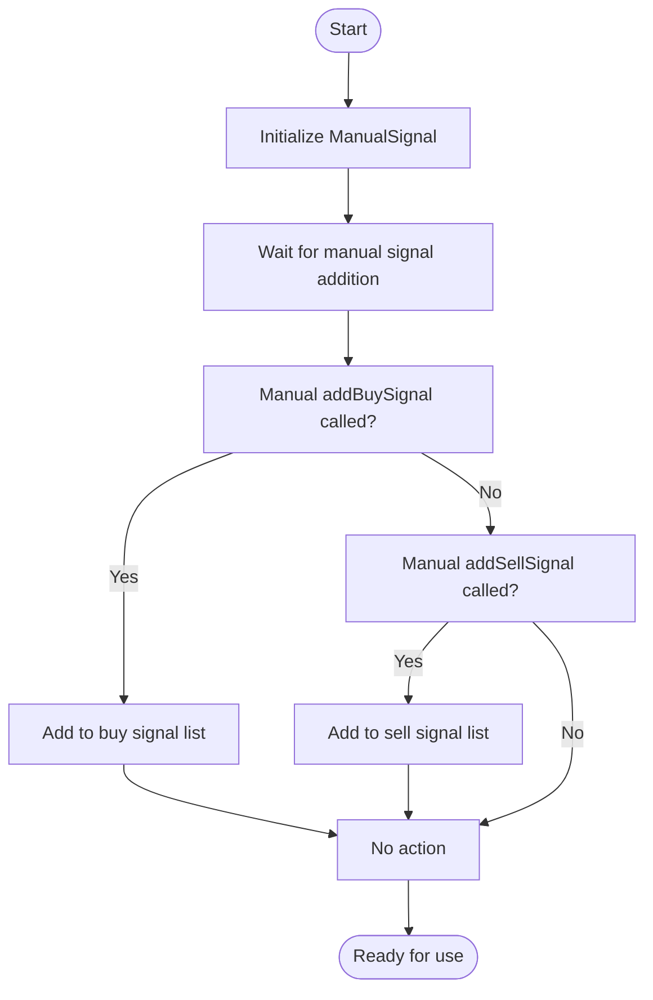

**Section sources**
- [ManualSignal.cpp](file://hikyuu_cpp/hikyuu/trade_sys/signal/imp/ManualSignal.cpp#L1-L24)
- [SG_Manual.h](file://hikyuu_cpp/hikyuu/trade_sys/signal/crt/SG_Manual.h#L1-L20)

### SG_Single
The SG_Single signal is a single-line inflection point detector based on the algorithm described in "The Disciplined Trader." It identifies trend changes in a single indicator using volatility-based filtering.

**Constructor Parameters:**
- `ind`: The indicator to analyze
- `filter_n`: N-day period for volatility calculation (default: 20)
- `filter_p`: Filter percentage for volatility threshold (default: 0.1)

**Configuration Options:**
- `filter_n`: Determines the lookback period for volatility calculation
- `filter_p`: Multiplier for volatility threshold (higher values reduce sensitivity)

**Behavior Characteristics:**
- Uses volatility (STDEV) of indicator changes as a filter
- Buy condition: Current indicator value minus previous values exceeds filter threshold
- The filter threshold is calculated as: filter = percentage * STDEV((AMA-AMA[1], N)
- Detects significant moves that overcome recent volatility
- Designed to capture trend changes while filtering out noise

**Section sources**
- [SG_Single.h](file://hikyuu_cpp/hikyuu/trade_sys/signal/crt/SG_Single.h#L1-L57)

## Band Signals
Band signals in hikyuu provide a mechanism for generating trading signals based on indicator thresholds. These signals are particularly effective for oscillators and other indicators that have natural overbought and oversold levels.

### Configuration with Fixed Thresholds
Band signals can be configured with fixed upper and lower threshold values, making them suitable for indicators with known ranges like RSI (0-100) or Stochastic (0-100).

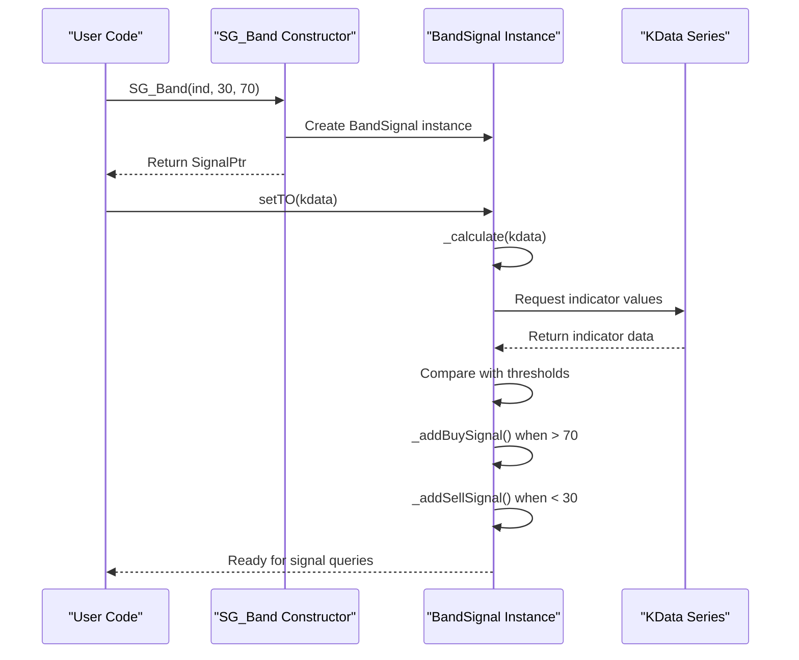

**Section sources**
- [BandSignal.cpp](file://hikyuu_cpp/hikyuu/trade_sys/signal/imp/BandSignal.cpp#L1-L53)

### Configuration with Dynamic Bands
Band signals can also use dynamic indicators for upper and lower bands, creating adaptive trading systems that respond to changing market conditions.

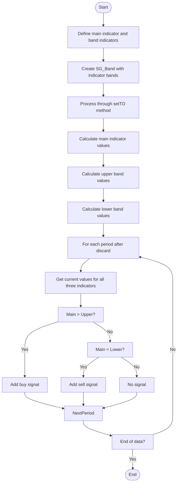

**Section sources**
- [SG_Band.h](file://hikyuu_cpp/hikyuu/trade_sys/signal/crt/SG_Band.h#L24-L33)

## Cross Signals
Cross signals in hikyuu implement the classic technical analysis pattern of indicator crossovers, which are widely used in trend-following strategies.

### Basic Crossover Logic
The fundamental crossover logic compares two indicators (typically a fast and slow line) to detect when they cross each other, signaling potential trend changes.

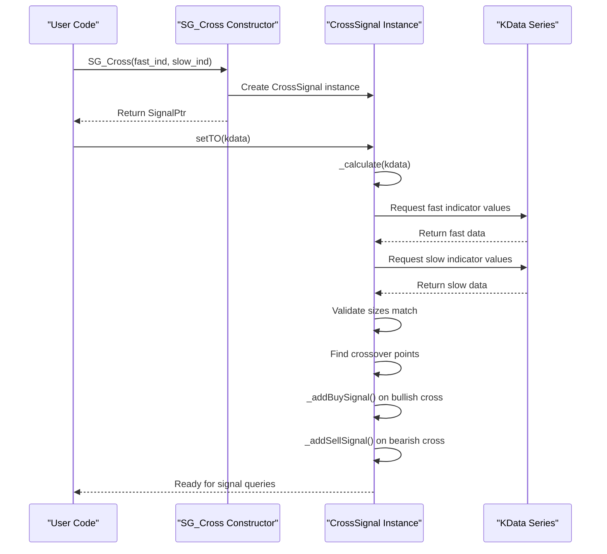

**Section sources**
- [CrossSignal.cpp](file://hikyuu_cpp/hikyuu/trade_sys/signal/imp/CrossSignal.cpp#L1-L55)

### Golden Cross Enhancement
The golden cross variant adds trend confirmation to the basic crossover, requiring that both lines are moving in the same direction as the crossover.

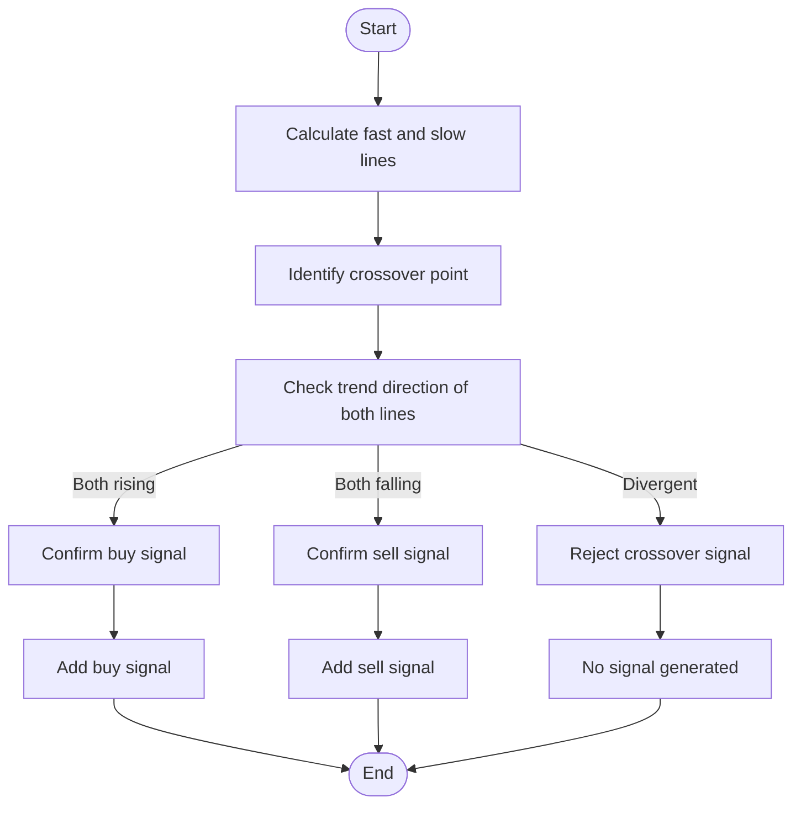

**Section sources**
- [SG_CrossGold.h](file://hikyuu_cpp/hikyuu/trade_sys/signal/crt/SG_CrossGold.h#L1-L30)

## Logic Signals
Logic signals in hikyuu provide a powerful mechanism for combining multiple signals using boolean and arithmetic operations, enabling the creation of sophisticated trading strategies.

### Boolean Combinations
The system supports logical AND and OR operations between signals, allowing the creation of composite conditions.

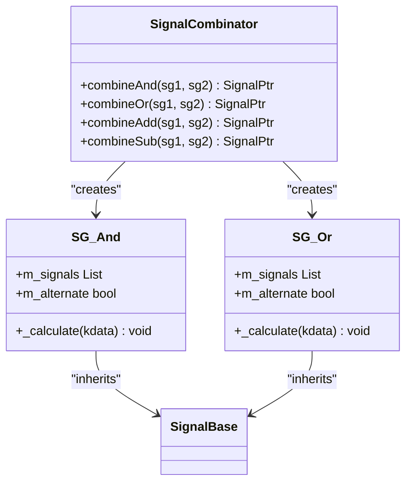

**Section sources**
- [SG_Logic.h](file://hikyuu_cpp/hikyuu/trade_sys/signal/crt/SG_Logic.h#L1-L127)

### Arithmetic Operations
Signals can be combined using arithmetic operations, which is useful for creating weighted combinations or spreads between signals.

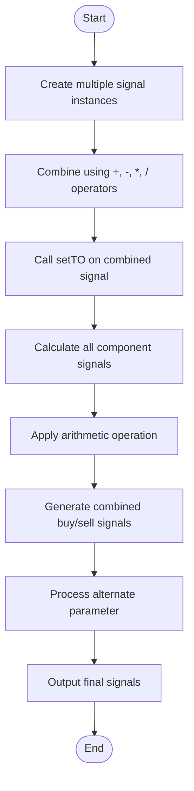

**Section sources**
- [SG_Logic.h](file://hikyuu_cpp/hikyuu/trade_sys/signal/crt/SG_Logic.h#L1-L127)

## Custom Signal Implementation
Creating custom signal implementations in hikyuu involves inheriting from the SignalBase class and implementing the required virtual methods. This allows users to develop specialized trading strategies beyond the built-in signal types.

### Implementation Requirements
To create a custom signal, developers must implement the following components:

1. Inherit from SignalBase class
2. Implement the _clone() method for proper copying
3. Implement the _calculate() method with signal logic
4. Optionally implement _reset() for state management
5. Register the signal with the system (if needed)

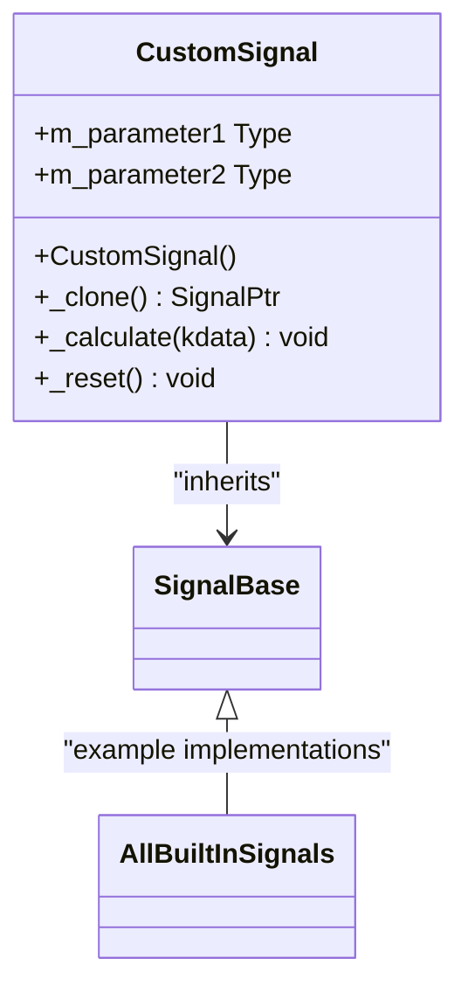

**Section sources**
- [SignalBase.h](file://hikyuu_cpp/hikyuu/trade_sys/signal/SignalBase.h#L24-L295)

## Performance Considerations
When using multiple signals in hikyuu, several performance considerations should be taken into account to ensure efficient operation and optimal memory usage.

### Memory Usage Patterns
Signal state tracking in hikyuu follows specific memory patterns that impact overall system performance:

- Each signal maintains separate buy and sell signal maps (m_buySig, m_sellSig)
- Indicator calculations are cached within the signal instances
- KData references are stored but not serialized
- The discard period of indicators affects the amount of usable data
- Complex signal combinations increase memory overhead proportionally

```mermaid
graph TD
MemoryFactors["Memory Usage Factors"] --> SignalCount["Number of active signals"]
MemoryFactors --> IndicatorComplexity["Complexity of constituent indicators"]
MemoryFactors --> DataLength["Length of KData series"]
MemoryFactors --> SignalHistory["Length of signal history stored"]
MemoryFactors --> CombinationDepth["Depth of signal combinations"]
OptimizationStrategies["Optimization Strategies"] --> LimitSignals["Limit concurrent signals"]
OptimizationStrategies --> OptimizeIndicators["Optimize indicator calculations"]
OptimizationStrategies --> ManageHistory["Manage signal history length"]
OptimizationStrategies --> UseEfficient["Use efficient data structures"]
OptimizationStrategies --> BatchProcessing["Consider batch processing"]
Monitoring["Performance Monitoring"] --> MemoryProfiling["Memory profiling"]
Monitoring --> ExecutionTiming["Execution timing"]
Monitoring --> GarbageCollection["Garbage collection patterns"]
Monitoring --> CacheEfficiency["Cache efficiency"]
Monitoring --> ResourceLimits["System resource limits"]
```

**Section sources**
- [SignalBase.h](file://hikyuu_cpp/hikyuu/trade_sys/signal/SignalBase.h#L142-L154)

### Multiple Signal Performance
Using multiple signals simultaneously can impact performance in several ways:

- Each additional signal increases computational overhead
- Signal combinations create dependency chains that must be evaluated
- Memory usage grows with the number of active signals
- The alternate parameter can affect signal sequencing efficiency
- Complex boolean combinations require evaluation of all component signals

Best practices for managing multiple signals include:
- Reusing indicator calculations across signals when possible
- Limiting the number of concurrent signals to essential ones
- Using appropriate discard periods to minimize unnecessary calculations
- Monitoring memory usage and garbage collection patterns
- Considering the trade-off between signal complexity and performance

**Section sources**
- [SignalBase.h](file://hikyuu_cpp/hikyuu/trade_sys/signal/SignalBase.h#L142-L154)

## Examples
This section provides practical examples of signal configuration and usage in both C++ and Python.

### C++ Examples
```cpp
// Example 1: Band signal with fixed thresholds
auto rsi = RSI(CLOSE, 14);
auto sg_band = SG_Band(rsi, 30, 70);

// Example 2: Moving average crossover
auto ma_fast = MA(CLOSE, 10);
auto ma_slow = MA(CLOSE, 30);
auto sg_cross = SG_Cross(ma_fast, ma_slow);

// Example 3: Combined logic signal
auto sg_combined = SG_And({sg_band, sg_cross}, true);
```

### Python Examples
```python
# Example 1: Band signal with indicator bands
upper_band = MA(HIGH, 20)
lower_band = MA(LOW, 20)
sg_band = SG_Band(CLOSE, lower_band, upper_band)

# Example 2: Golden cross with EMA
ema_fast = EMA(CLOSE, 12)
ema_slow = EMA(CLOSE, 26)
sg_golden = SG_CrossGold(ema_fast, ema_slow)

# Example 3: Complex logic combination
sg_logic = SG_Add(SG_Buy(RSI() < 30), SG_Sell(RSI() > 70), alternate=True)
```

**Section sources**
- [_Signal.cpp](file://hikyuu_pywrap/trade_sys/_Signal.cpp#L223-L373)