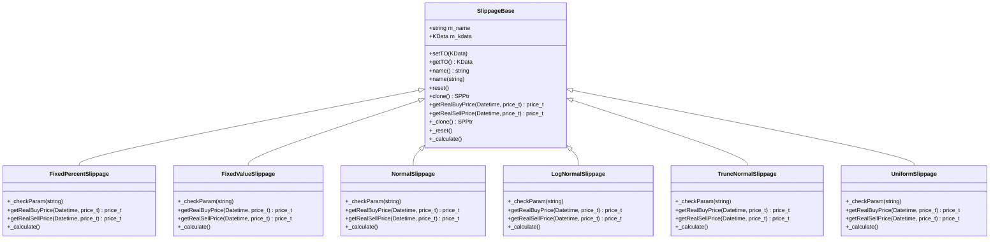

# Slippage Models

<cite>
**Referenced Files in This Document**   
- [SlippageBase.h](file://hikyuu_cpp/hikyuu/trade_sys/slippage/SlippageBase.h)
- [SP_FixedPercent.h](file://hikyuu_cpp/hikyuu/trade_sys/slippage/crt/SP_FixedPercent.h)
- [SP_FixedValue.h](file://hikyuu_cpp/hikyuu/trade_sys/slippage/crt/SP_FixedValue.h)
- [SP_Normal.h](file://hikyuu_cpp/hikyuu/trade_sys/slippage/crt/SP_Normal.h)
- [SP_LogNormal.h](file://hikyuu_cpp/hikyuu/trade_sys/slippage/crt/SP_LogNormal.h)
- [SP_TruncNormal.h](file://hikyuu_cpp/hikyuu/trade_sys/slippage/crt/SP_TruncNormal.h)
- [SP_Uniform.h](file://hikyuu_cpp/hikyuu/trade_sys/slippage/crt/SP_Uniform.h)
- [FixedPercentSlippage.cpp](file://hikyuu_cpp/hikyuu/trade_sys/slippage/imp/FixedPercentSlippage.cpp)
- [FixedValueSlippage.cpp](file://hikyuu_cpp/hikyuu/trade_sys/slippage/imp/FixedValueSlippage.cpp)
- [NormalSlippage.cpp](file://hikyuu_cpp/hikyuu/trade_sys/slippage/imp/NormalSlippage.cpp)
- [LogNormalSlippage.cpp](file://hikyuu_cpp/hikyuu/trade_sys/slippage/imp/LogNormalSlippage.cpp)
- [TruncNormalSlippage.cpp](file://hikyuu_cpp/hikyuu/trade_sys/slippage/imp/TruncNormalSlippage.cpp)
- [UniformSlippage.cpp](file://hikyuu_cpp/hikyuu/trade_sys/slippage/imp/UniformSlippage.cpp)
</cite>

## Table of Contents
1. [Introduction](#introduction)
2. [SlippageBase Interface and Inheritance Hierarchy](#slippagebase-interface-and-inheritance-hierarchy)
3. [Fixed Percentage Slippage Model](#fixed-percentage-slippage-model)
4. [Fixed Value Slippage Model](#fixed-value-slippage-model)
5. [Normal Distribution Slippage Model](#normal-distribution-slippage-model)
6. [Log-Normal Distribution Slippage Model](#log-normal-distribution-slippage-model)
7. [Truncated Normal Distribution Slippage Model](#truncated-normal-distribution-slippage-model)
8. [Uniform Distribution Slippage Model](#uniform-distribution-slippage-model)
9. [Market Impact Simulation and Backtesting](#market-impact-simulation-and-backtesting)
10. [Configuration Examples](#configuration-examples)
11. [Common Issues and Optimization](#common-issues-and-optimization)

## Introduction
This document provides comprehensive API documentation for the slippage models implemented in the Hikyuu quantitative trading framework. Slippage models simulate the difference between expected and actual execution prices during backtesting, accounting for market impact, liquidity constraints, and execution delays. The framework offers multiple slippage algorithms, including fixed value, fixed percentage, and various statistical distribution models. These models are essential for realistic backtesting, as they help assess strategy performance under real-world trading conditions where perfect execution is rarely achievable.

## SlippageBase Interface and Inheritance Hierarchy

**Diagram sources**
- [SlippageBase.h](file://hikyuu_cpp/hikyuu/trade_sys/slippage/SlippageBase.h)
- [FixedPercentSlippage.h](file://hikyuu_cpp/hikyuu/trade_sys/slippage/imp/FixedPercentSlippage.h)
- [FixedValueSlippage.h](file://hikyuu_cpp/hikyuu/trade_sys/slippage/imp/FixedValueSlippage.h)
- [NormalSlippage.h](file://hikyuu_cpp/hikyuu/trade_sys/slippage/imp/NormalSlippage.h)
- [LogNormalSlippage.h](file://hikyuu_cpp/hikyuu/trade_sys/slippage/imp/LogNormalSlippage.h)
- [TruncNormalSlippage.h](file://hikyuu_cpp/hikyuu/trade_sys/slippage/imp/TruncNormalSlippage.h)
- [UniformSlippage.h](file://hikyuu_cpp/hikyuu/trade_sys/slippage/imp/UniformSlippage.h)

**Section sources**
- [SlippageBase.h](file://hikyuu_cpp/hikyuu/trade_sys/slippage/SlippageBase.h#L15-L176)

## Fixed Percentage Slippage Model
The SP_FixedPercent model implements a fixed percentage slippage algorithm where the actual execution price deviates from the planned price by a constant percentage. For buy orders, the actual price is calculated as `planPrice * (1 + p)`, while for sell orders, it is `planPrice * (1 - p)`, where `p` represents the fixed percentage parameter. This model is useful for simulating brokerage fees or consistent market impact across different price levels. The parameter `p` must be non-negative and less than 1.0 to ensure realistic price adjustments. This approach provides a simple yet effective way to account for proportional execution costs in backtesting scenarios.

**Section sources**
- [SP_FixedPercent.h](file://hikyuu_cpp/hikyuu/trade_sys/slippage/crt/SP_FixedPercent.h#L1-L27)
- [FixedPercentSlippage.cpp](file://hikyuu_cpp/hikyuu/trade_sys/slippage/imp/FixedPercentSlippage.cpp#L1-L46)

## Fixed Value Slippage Model
The SP_FixedValue model applies a constant price offset to simulate slippage. The actual buy price is computed as `planPrice + value`, and the actual sell price as `planPrice - value`, where `value` is the fixed price deviation parameter. This model is appropriate for markets with consistent tick sizes or when modeling fixed transaction costs. The `value` parameter must be non-negative to maintain logical price relationships. Unlike percentage-based models, this approach introduces absolute slippage that remains constant regardless of the underlying asset's price level, making it suitable for instruments with stable price increments.

**Section sources**
- [SP_FixedValue.h](file://hikyuu_cpp/hikyuu/trade_sys/slippage/crt/SP_FixedValue.h#L1-L27)
- [FixedValueSlippage.cpp](file://hikyuu_cpp/hikyuu/trade_sys/slippage/imp/FixedValueSlippage.cpp#L1-L45)

## Normal Distribution Slippage Model
The SP_Normal model utilizes a normal distribution to generate random price deviations, simulating realistic market impact with symmetric price fluctuations around a mean value. The actual buy price is calculated as `planPrice + abs(random_value)`, and the sell price as `planPrice - abs(random_value)`, where the random value is drawn from a normal distribution with specified mean and standard deviation parameters. This ensures that slippage always moves against the trade direction, reflecting the adverse price movement typically experienced during execution. The standard deviation parameter controls the volatility of slippage, while the mean parameter allows for systematic bias in price impact. This model is particularly effective for simulating market conditions with random, symmetric price fluctuations.

**Section sources**
- [SP_Normal.h](file://hikyuu_cpp/hikyuu/trade_sys/slippage/crt/SP_Normal.h#L1-L22)
- [NormalSlippage.cpp](file://hikyuu_cpp/hikyuu/trade_sys/slippage/imp/NormalSlippage.cpp#L1-L62)

## Log-Normal Distribution Slippage Model
The SP_LogNormal model employs a log-normal distribution to simulate price slippage, which is particularly suitable for modeling multiplicative price movements in financial markets. The log-normal distribution ensures that price deviations are always positive, making it ideal for representing percentage-based price changes that compound over time. The model takes mean and standard deviation parameters that define the underlying normal distribution of the logarithm of price changes. This approach captures the asymmetric nature of market impact, where large adverse movements are more common than large favorable ones. The log-normal model is recommended for backtesting strategies in markets with multiplicative price dynamics and non-negative price constraints.

**Section sources**
- [SP_LogNormal.h](file://hikyuu_cpp/hikyuu/trade_sys/slippage/crt/SP_LogNormal.h#L1-L22)
- [LogNormalSlippage.cpp](file://hikyuu_cpp/hikyuu/trade_sys/slippage/imp/LogNormalSlippage.cpp)

## Truncated Normal Distribution Slippage Model
The SP_TruncNormal model implements a truncated normal distribution for slippage simulation, which restricts price deviations to a specified range [min_value, max_value]. This model combines the statistical properties of the normal distribution with bounded price movements, preventing extreme slippage values that could distort backtesting results. The truncation limits ensure that price deviations remain within realistic bounds, making this model suitable for markets with known liquidity constraints or regulatory price limits. The model accepts parameters for mean, standard deviation, and truncation bounds, allowing fine-tuned control over the distribution of slippage values. This approach provides a balance between statistical realism and practical constraints in execution modeling.

**Section sources**
- [SP_TruncNormal.h](file://hikyuu_cpp/hikyuu/trade_sys/slippage/crt/SP_TruncNormal.h#L1-L25)
- [TruncNormalSlippage.cpp](file://hikyuu_cpp/hikyuu/trade_sys/slippage/imp/TruncNormalSlippage.cpp)

## Uniform Distribution Slippage Model
The SP_Uniform model applies a uniform distribution to simulate worst-case scenario testing, where price deviations are equally likely to occur anywhere within a specified range [min_value, max_value]. This model is particularly useful for stress testing trading strategies under maximum possible slippage conditions. The uniform distribution ensures that all values within the range have equal probability, providing a conservative estimate of execution costs. By setting appropriate bounds, users can simulate extreme market conditions or assess strategy robustness against adverse price movements. This model is recommended for risk assessment and determining the worst-case performance envelope of trading strategies.

**Section sources**
- [SP_Uniform.h](file://hikyuu_cpp/hikyuu/trade_sys/slippage/crt/SP_Uniform.h#L1-L24)
- [UniformSlippage.cpp](file://hikyuu_cpp/hikyuu/trade_sys/slippage/imp/UniformSlippage.cpp)

## Market Impact Simulation and Backtesting
Slippage algorithms in Hikyuu simulate the difference between expected and actual execution prices by applying statistical models to planned trade prices. During backtesting, when a trade signal is generated, the slippage model modifies the intended execution price based on its specific algorithm before calculating trade outcomes. This process introduces realism by accounting for market impact, liquidity constraints, and execution delays. The framework's design allows seamless integration of slippage models into the backtesting pipeline, where they interact with KData objects containing historical market information. By incorporating slippage, backtests provide more accurate performance metrics, helping traders better understand the real-world viability of their strategies and avoid over-optimistic results from idealized execution assumptions.

**Section sources**
- [SlippageBase.h](file://hikyuu_cpp/hikyuu/trade_sys/slippage/SlippageBase.h#L55-L63)
- [NormalSlippage.cpp](file://hikyuu_cpp/hikyuu/trade_sys/slippage/imp/NormalSlippage.cpp#L33-L51)

## Configuration Examples
The slippage models in Hikyuu can be configured through their respective factory functions, which return shared pointers to initialized slippage objects. For fixed percentage slippage, users can call `SP_FixedPercent(0.001)` to create a model with 0.1% slippage. Fixed value slippage can be configured with `SP_FixedValue(0.01)` for a 1 cent price deviation. Statistical models like `SP_Normal(0.0, 0.05)` create a normal distribution slippage with zero mean and 5% standard deviation. The `SP_Uniform(-0.05, 0.05)` configuration generates uniform random slippage between -5% and +5%, suitable for worst-case scenario analysis. These factory functions abstract the underlying implementation details, providing a simple interface for configuring various slippage behaviors in backtesting scenarios.

**Section sources**
- [SP_FixedPercent.h](file://hikyuu_cpp/hikyuu/trade_sys/slippage/crt/SP_FixedPercent.h#L22)
- [SP_FixedValue.h](file://hikyuu_cpp/hikyuu/trade_sys/slippage/crt/SP_FixedValue.h#L22)
- [SP_Normal.h](file://hikyuu_cpp/hikyuu/trade_sys/slippage/crt/SP_Normal.h#L20)
- [SP_Uniform.h](file://hikyuu_cpp/hikyuu/trade_sys/slippage/crt/SP_Uniform.h#L21)

## Common Issues and Optimization
When applying slippage to high-volume trading strategies, several common issues require attention. Slippage calibration is critical, as overly aggressive parameters can unrealistically degrade performance, while insufficient slippage may lead to over-optimistic results. Market condition adaptation is essential, as slippage characteristics vary across different market regimes, liquidity levels, and trading hours. Performance optimization considerations include minimizing computational overhead from random number generation in statistical models and ensuring thread safety when running multiple backtests. Users should validate slippage parameters against historical execution data when available and consider using adaptive slippage models that adjust based on market volatility or volume. Regular calibration and sensitivity analysis help maintain realistic backtesting conditions and improve strategy robustness.

**Section sources**
- [NormalSlippage.cpp](file://hikyuu_cpp/hikyuu/trade_sys/slippage/imp/NormalSlippage.cpp#L17-L18)
- [FixedPercentSlippage.cpp](file://hikyuu_cpp/hikyuu/trade_sys/slippage/imp/FixedPercentSlippage.cpp#L22-L26)
- [FixedValueSlippage.cpp](file://hikyuu_cpp/hikyuu/trade_sys/slippage/imp/FixedValueSlippage.cpp#L22-L25)