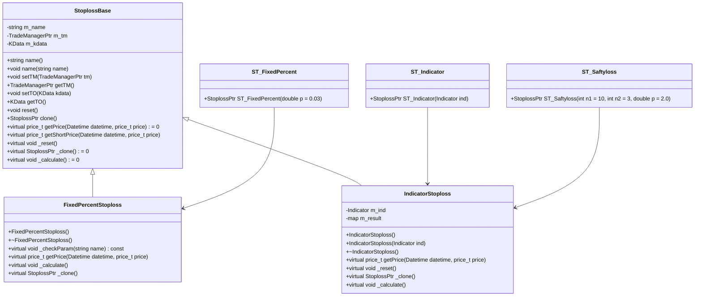
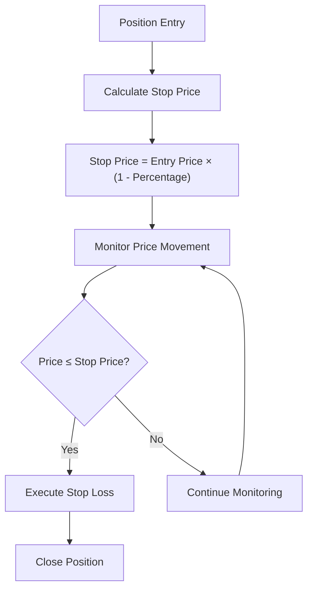
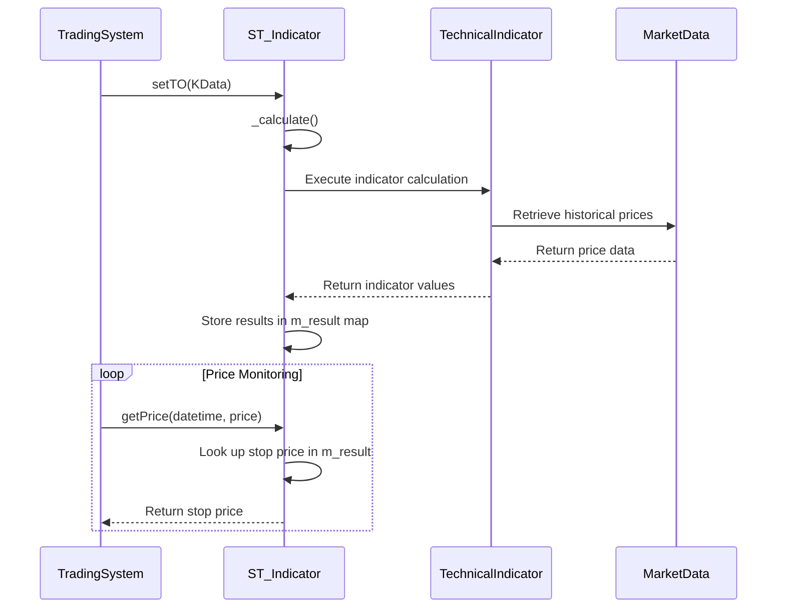
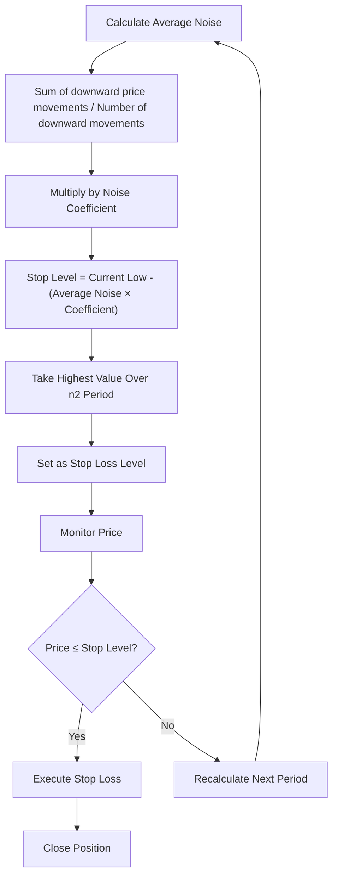

# Stop Loss Algorithms

<cite>
**Referenced Files in This Document**   
- [StoplossBase.h](file://hikyuu_cpp/hikyuu/trade_sys/stoploss/StoplossBase.h)
- [StoplossBase.cpp](file://hikyuu_cpp/hikyuu/trade_sys/stoploss/StoplossBase.cpp)
- [FixedPercentStoploss.h](file://hikyuu_cpp/hikyuu/trade_sys/stoploss/imp/FixedPercentStoploss.h)
- [FixedPercentStoploss.cpp](file://hikyuu_cpp/hikyuu/trade_sys/stoploss/imp/FixedPercentStoploss.cpp)
- [IndicatorStoploss.h](file://hikyuu_cpp/hikyuu/trade_sys/stoploss/imp/IndicatorStoploss.h)
- [IndicatorStoploss.cpp](file://hikyuu_cpp/hikyuu/trade_sys/stoploss/imp/IndicatorStoploss.cpp)
- [ST_FixedPercent.h](file://hikyuu_cpp/hikyuu/trade_sys/stoploss/crt/ST_FixedPercent.h)
- [ST_Indicator.h](file://hikyuu_cpp/hikyuu/trade_sys/stoploss/crt/ST_Indicator.h)
- [ST_Saftyloss.h](file://hikyuu_cpp/hikyuu/trade_sys/stoploss/crt/ST_Saftyloss.h)
- [ST_Saftyloss.cpp](file://hikyuu_cpp/hikyuu/trade_sys/stoploss/crt/ST_Saftyloss.cpp)
- [Stoploss.py](file://hikyuu/test/Stoploss.py)
</cite>

## Table of Contents
1. [Introduction](#introduction)
2. [StoplossBase Interface and Inheritance Hierarchy](#stoplossbase-interface-and-inheritance-hierarchy)
3. [Fixed Percentage Stop Loss (ST_FixedPercent)](#fixed-percentage-stop-loss-st_fixedpercent)
4. [Indicator-Based Stop Loss (ST_Indicator)](#indicator-based-stop-loss-st_indicator)
5. [Safety Loss Stop Loss (ST_Saftyloss)](#safety-loss-stop-loss-st_saftyloss)
6. [Implementation Details and Risk Management](#implementation-details-and-risk-management)
7. [Common Issues and Performance Considerations](#common-issues-and-performance-considerations)
8. [Conclusion](#conclusion)

## Introduction
The Hikyuu trading system provides a comprehensive framework for implementing stop loss algorithms to protect capital by automatically closing positions when losses exceed predefined thresholds. This document details the available stop loss types including ST_FixedPercent, ST_Indicator, and ST_Saftyloss, explaining their implementation details, parameters, and risk management characteristics. The stop loss algorithms are designed to work within the broader trading system architecture, providing flexible mechanisms for capital protection across different trading strategies.

**Section sources**
- [StoplossBase.h](file://hikyuu_cpp/hikyuu/trade_sys/stoploss/StoplossBase.h#L1-L205)
- [Stoploss.py](file://hikyuu/test/Stoploss.py#L1-L86)

## StoplossBase Interface and Inheritance Hierarchy
The StoplossBase class serves as the foundation for all stop loss strategies in the Hikyuu system, defining the core interface and functionality. This abstract base class implements the template method pattern, providing common functionality while allowing specific implementations to define their unique behavior.

**Diagram sources**
- [StoplossBase.h](file://hikyuu_cpp/hikyuu/trade_sys/stoploss/StoplossBase.h#L18-L205)
- [FixedPercentStoploss.h](file://hikyuu_cpp/hikyuu/trade_sys/stoploss/imp/FixedPercentStoploss.h#L16-L31)
- [IndicatorStoploss.h](file://hikyuu_cpp/hikyuu/trade_sys/stoploss/imp/IndicatorStoploss.h#L17-L50)

**Section sources**
- [StoplossBase.h](file://hikyuu_cpp/hikyuu/trade_sys/stoploss/StoplossBase.h#L18-L205)
- [StoplossBase.cpp](file://hikyuu_cpp/hikyuu/trade_sys/stoploss/StoplossBase.cpp#L1-L70)

## Fixed Percentage Stop Loss (ST_FixedPercent)
The ST_FixedPercent stop loss strategy implements a simple yet effective approach to capital protection by setting a fixed percentage threshold below the entry price. This strategy is particularly useful for traders who want to maintain consistent risk management across different positions regardless of market volatility.

The implementation is straightforward: when a position is opened, the stop loss price is calculated as a fixed percentage below the entry price. For example, with a 3% stop loss parameter, if a stock is purchased at $100, the stop loss would be triggered if the price falls to $97.

**Diagram sources**
- [FixedPercentStoploss.cpp](file://hikyuu_cpp/hikyuu/trade_sys/stoploss/imp/FixedPercentStoploss.cpp#L29-L33)
- [ST_FixedPercent.h](file://hikyuu_cpp/hikyuu/trade_sys/stoploss/crt/ST_FixedPercent.h#L16-L21)

**Section sources**
- [FixedPercentStoploss.h](file://hikyuu_cpp/hikyuu/trade_sys/stoploss/imp/FixedPercentStoploss.h#L16-L31)
- [FixedPercentStoploss.cpp](file://hikyuu_cpp/hikyuu/trade_sys/stoploss/imp/FixedPercentStoploss.cpp#L1-L44)

## Indicator-Based Stop Loss (ST_Indicator)
The ST_Indicator stop loss strategy provides a dynamic approach to capital protection by using technical indicators to determine the stop loss level. This allows for adaptive stop loss mechanisms that respond to changing market conditions rather than relying on fixed percentages.

This implementation leverages the Indicator class to calculate stop loss levels based on various technical analysis methods. The strategy can use any indicator that produces a price level, such as moving averages, Bollinger Bands, or custom indicators. For example, a trader might use a 10-day exponential moving average (EMA) of closing prices as the stop loss level, allowing the stop to trail the price as it moves upward.

**Diagram sources**
- [IndicatorStoploss.h](file://hikyuu_cpp/hikyuu/trade_sys/stoploss/imp/IndicatorStoploss.h#L17-L50)
- [IndicatorStoploss.cpp](file://hikyuu_cpp/hikyuu/trade_sys/stoploss/imp/IndicatorStoploss.cpp#L1-L54)

**Section sources**
- [IndicatorStoploss.h](file://hikyuu_cpp/hikyuu/trade_sys/stoploss/imp/IndicatorStoploss.h#L17-L50)
- [IndicatorStoploss.cpp](file://hikyuu_cpp/hikyuu/trade_sys/stoploss/imp/IndicatorStoploss.cpp#L1-L54)

## Safety Loss Stop Loss (ST_Saftyloss)
The ST_Saftyloss strategy implements Alexander Elder's "SafeZone" stop loss method as described in "Come Into My Trading Room". This sophisticated approach calculates stop loss levels based on market noise and volatility, providing a more intelligent capital protection mechanism that adapts to current market conditions.

The algorithm works by analyzing historical price data to determine the average "noise" or volatility in the market. It calculates the average length of downward price movements over a specified lookback period (n1), then multiplies this average noise by a coefficient (p) to establish a buffer below the current price. To smooth out fluctuations and ensure the stop loss level only moves upward, it takes the highest value of this calculation over a secondary period (n2).

**Diagram sources**
- [ST_Saftyloss.h](file://hikyuu_cpp/hikyuu/trade_sys/stoploss/crt/ST_Saftyloss.h#L1-L37)
- [ST_Saftyloss.cpp](file://hikyuu_cpp/hikyuu/trade_sys/stoploss/crt/ST_Saftyloss.cpp#L1-L21)

**Section sources**
- [ST_Saftyloss.h](file://hikyuu_cpp/hikyuu/trade_sys/stoploss/crt/ST_Saftyloss.h#L1-L37)
- [ST_Saftyloss.cpp](file://hikyuu_cpp/hikyuu/trade_sys/stoploss/crt/ST_Saftyloss.cpp#L1-L21)

## Implementation Details and Risk Management
The stop loss algorithms in Hikyuu are designed with robust risk management principles in mind. Each strategy inherits from the StoplossBase class, which provides a consistent interface and ensures proper integration with the broader trading system. The base class handles common functionality such as parameter management, serialization, and lifecycle methods, allowing specific implementations to focus on their unique stop loss logic.

Key implementation details include:
- **Parameter Validation**: Each stop loss type validates its parameters to ensure they fall within acceptable ranges (e.g., the percentage parameter in ST_FixedPercent must be between 0 and 1).
- **Precision Handling**: The system accounts for stock price precision when calculating stop levels, ensuring appropriate rounding for different markets.
- **State Management**: The IndicatorStoploss class maintains a map of calculated stop prices by datetime, allowing efficient lookup during trading.
- **Clone and Reset**: All stop loss strategies implement proper cloning and reset functionality, enabling the system to maintain multiple instances with different parameters.

The risk management characteristics of these algorithms vary by type:
- **ST_FixedPercent** provides consistent risk exposure but may be too rigid in volatile markets.
- **ST_Indicator** offers adaptive protection that can trail profits but may be susceptible to whipsaws in choppy markets.
- **ST_Saftyloss** balances sensitivity to market conditions with protection against noise, making it suitable for trending markets.

**Section sources**
- [StoplossBase.h](file://hikyuu_cpp/hikyuu/trade_sys/stoploss/StoplossBase.h#L1-L205)
- [FixedPercentStoploss.cpp](file://hikyuu_cpp/hikyuu/trade_sys/stoploss/imp/FixedPercentStoploss.cpp#L1-L44)
- [IndicatorStoploss.cpp](file://hikyuu_cpp/hikyuu/trade_sys/stoploss/imp/IndicatorStoploss.cpp#L1-L54)

## Common Issues and Performance Considerations
When implementing stop loss algorithms, several common issues must be addressed:

**Stop Hunting**: In markets with high-frequency trading, stop orders can be targeted by algorithms designed to trigger them. The ST_Saftyloss strategy helps mitigate this by using a volatility-based approach that is less predictable than fixed percentage stops.

**Slippage Impact**: Market gaps or rapid price movements can result in execution prices significantly different from the stop price. The system should account for potential slippage when calculating risk exposure.

**Performance Optimization**: When monitoring multiple positions, the system must efficiently calculate and update stop levels. The current implementation optimizes performance by:
- Caching indicator calculations in the IndicatorStoploss class
- Using efficient data structures (maps) for stop price lookups
- Minimizing redundant calculations through the _calculate() method

Additional considerations include:
- **Look-Ahead Bias**: Ensuring stop loss calculations only use historical data available at the time of the trade
- **Multiple Time Frames**: Coordinating stop loss levels across different time frames in multi-timeframe strategies
- **Position Sizing**: Integrating stop loss levels with position sizing algorithms to maintain consistent risk per trade

**Section sources**
- [StoplossBase.h](file://hikyuu_cpp/hikyuu/trade_sys/stoploss/StoplossBase.h#L67-L78)
- [IndicatorStoploss.cpp](file://hikyuu_cpp/hikyuu/trade_sys/stoploss/imp/IndicatorStoploss.cpp#L39-L47)

## Conclusion
The Hikyuu stop loss algorithms provide a comprehensive framework for capital protection in automated trading systems. The three main types—ST_FixedPercent, ST_Indicator, and ST_Saftyloss—offer different approaches to risk management, from simple fixed percentage stops to sophisticated volatility-adaptive mechanisms. By inheriting from the StoplossBase interface, these strategies maintain a consistent API while allowing for specialized implementations. Traders can select the appropriate stop loss type based on their strategy, market conditions, and risk tolerance, with the ability to further customize parameters and even create new stop loss types by extending the base class.