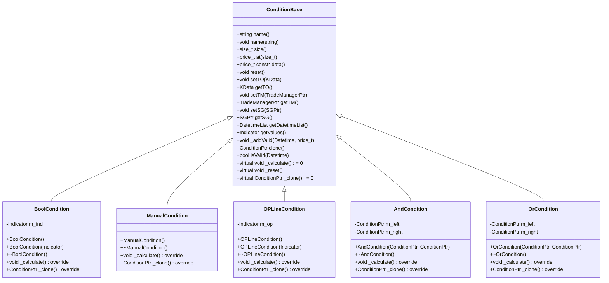
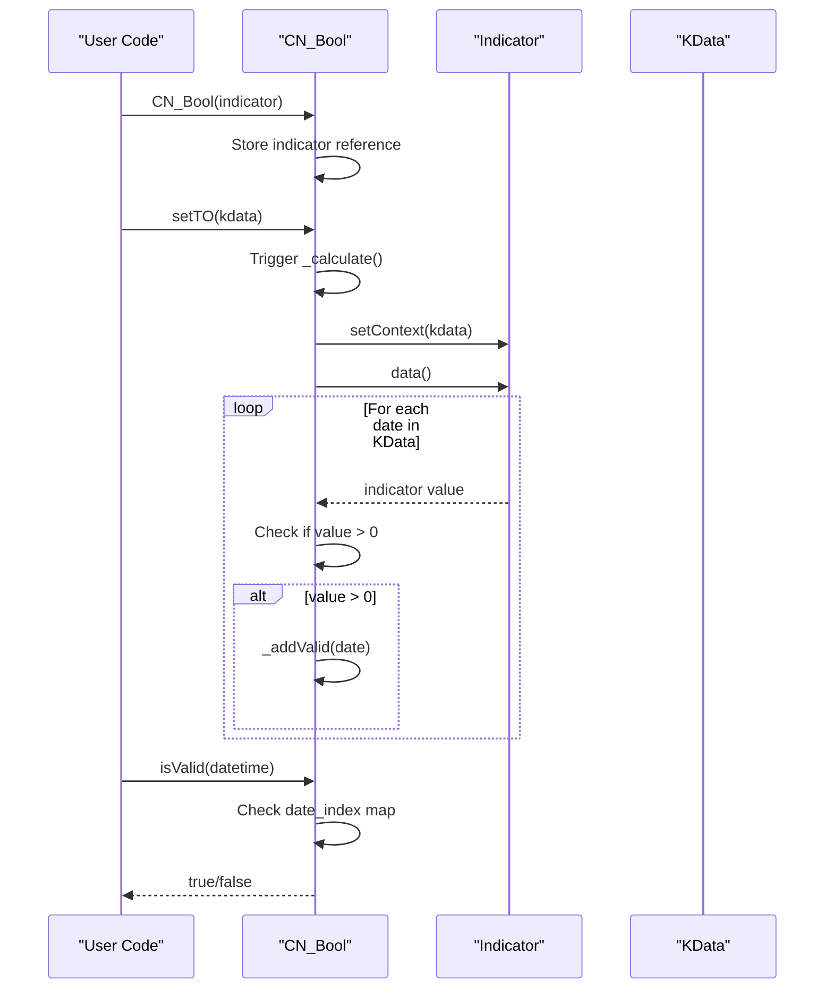
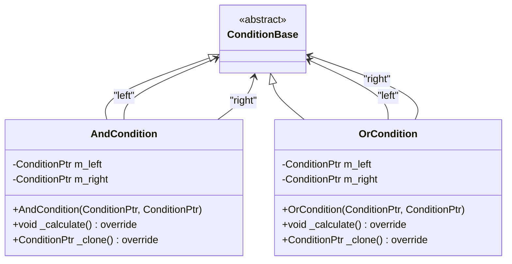
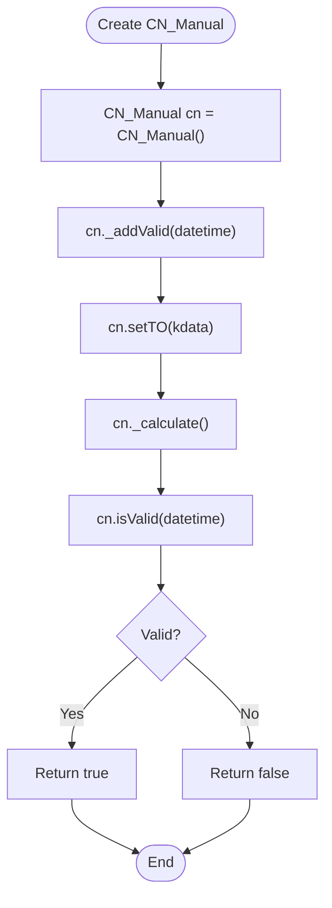
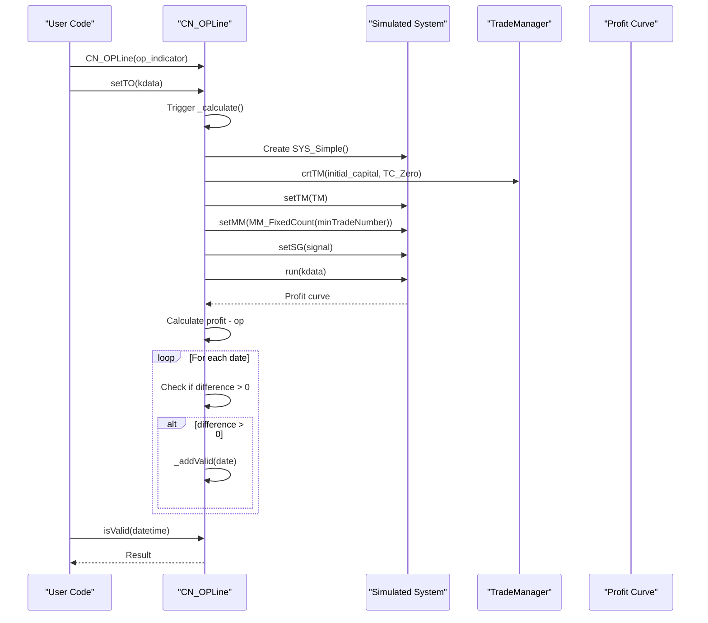
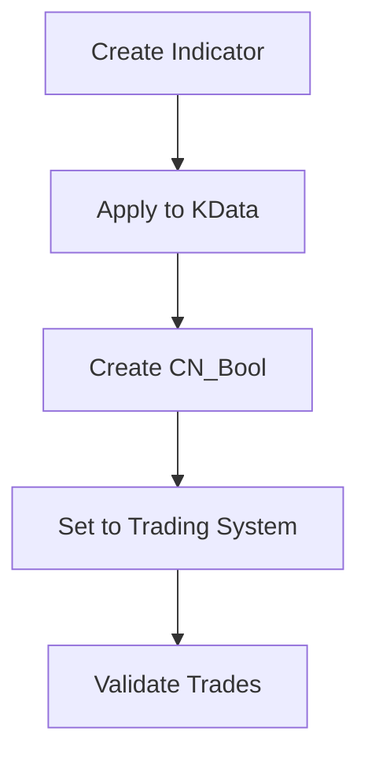
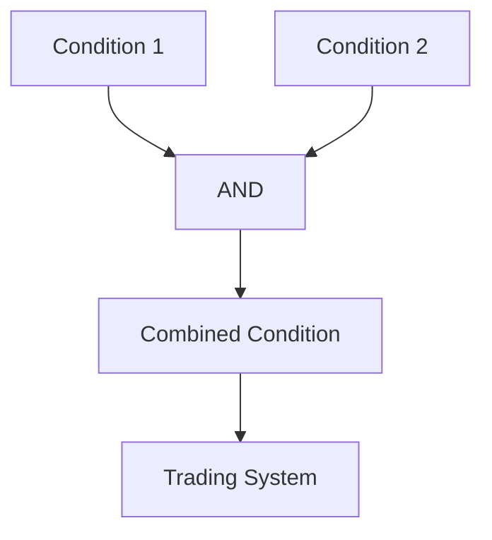
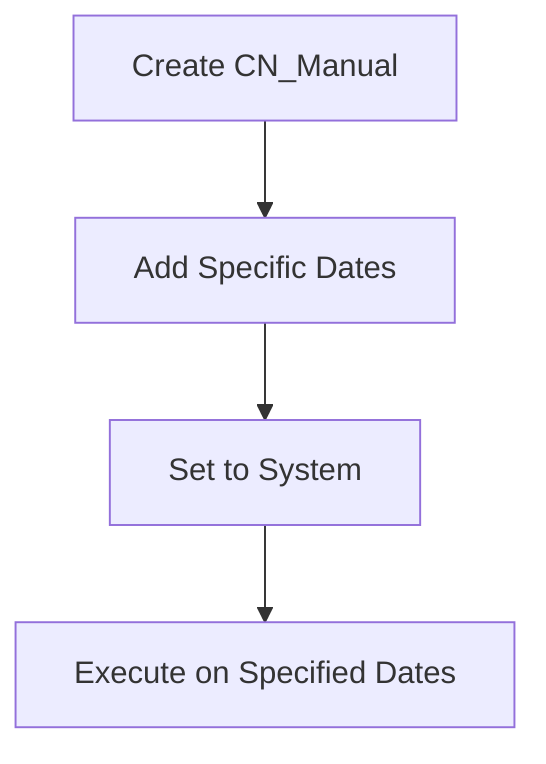
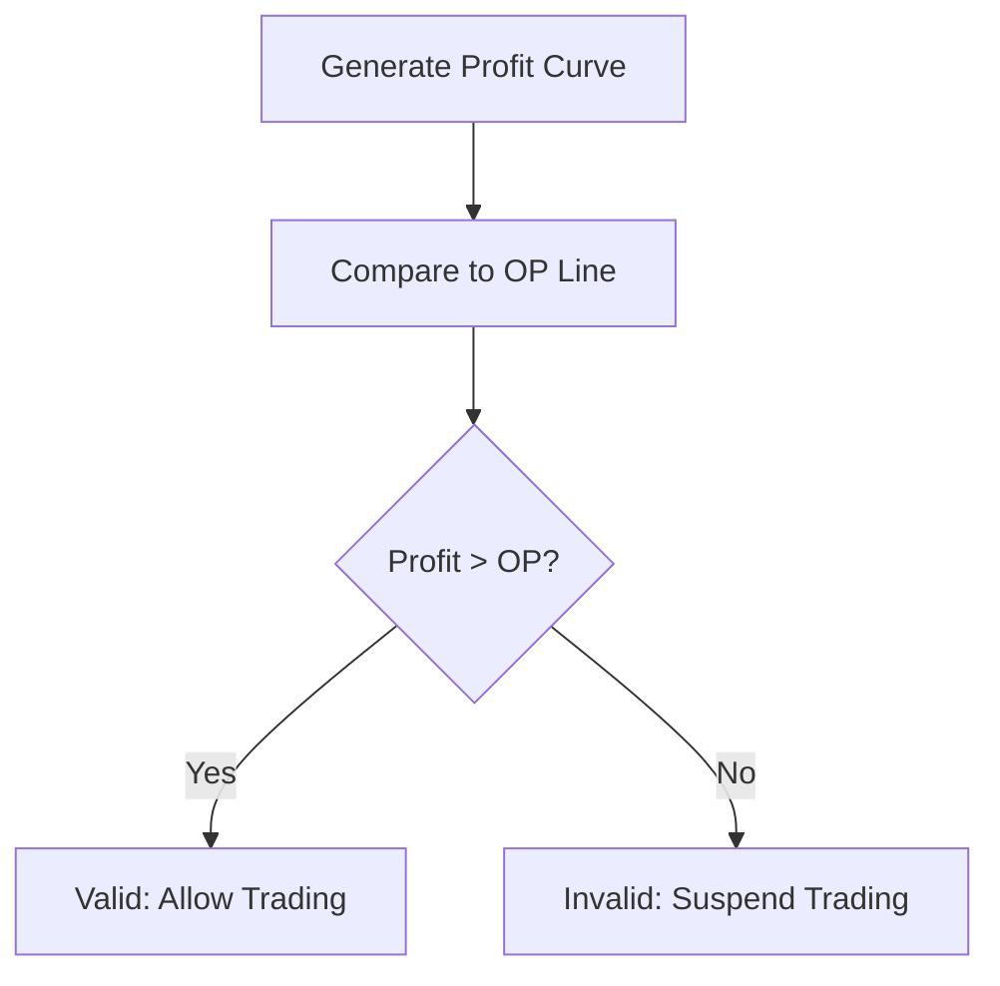

# Trading Conditions

<cite>
**Referenced Files in This Document**   
- [ConditionBase.h](file://hikyuu_cpp/hikyuu/trade_sys/condition/ConditionBase.h)
- [ConditionBase.cpp](file://hikyuu_cpp/hikyuu/trade_sys/condition/ConditionBase.cpp)
- [CN_Bool.h](file://hikyuu_cpp/hikyuu/trade_sys/condition/crt/CN_Bool.h)
- [BoolCondition.h](file://hikyuu_cpp/hikyuu/trade_sys/condition/imp/BoolCondition.h)
- [BoolCondition.cpp](file://hikyuu_cpp/hikyuu/trade_sys/condition/imp/BoolCondition.cpp)
- [CN_Logic.h](file://hikyuu_cpp/hikyuu/trade_sys/condition/crt/CN_Logic.h)
- [AndCondition.h](file://hikyuu_cpp/hikyuu/trade_sys/condition/imp/logic/AndCondition.h)
- [AndCondition.cpp](file://hikyuu_cpp/hikyuu/trade_sys/condition/imp/logic/AndCondition.cpp)
- [OrCondition.h](file://hikyuu_cpp/hikyuu/trade_sys/condition/imp/logic/OrCondition.h)
- [OrCondition.cpp](file://hikyuu_cpp/hikyuu/trade_sys/condition/imp/logic/OrCondition.cpp)
- [CN_Manual.h](file://hikyuu_cpp/hikyuu/trade_sys/condition/crt/CN_Manual.h)
- [ManualCondition.h](file://hikyuu_cpp/hikyuu/trade_sys/condition/imp/ManualCondition.h)
- [ManualCondition.cpp](file://hikyuu_cpp/hikyuu/trade_sys/condition/imp/ManualCondition.cpp)
- [CN_OPLine.h](file://hikyuu_cpp/hikyuu/trade_sys/condition/crt/CN_OPLine.h)
- [OPLineCondition.h](file://hikyuu_cpp/hikyuu/trade_sys/condition/imp/OPLineCondition.h)
- [OPLineCondition.cpp](file://hikyuu_cpp/hikyuu/trade_sys/condition/imp/OPLineCondition.cpp)
- [Condition.py](file://hikyuu/test/Condition.py)
</cite>

## Table of Contents
1. [Introduction](#introduction)
2. [ConditionBase Interface](#conditionbase-interface)
3. [CN_Bool Conditions](#cn_bool-conditions)
4. [CN_Logic Conditions](#cn_logic-conditions)
5. [CN_Manual Conditions](#cn_manual-conditions)
6. [CN_OPLine Conditions](#cn_opline-conditions)
7. [Usage Patterns](#usage-patterns)
8. [Performance Considerations](#performance-considerations)
9. [Troubleshooting Guide](#troubleshooting-guide)

## Introduction
This document provides comprehensive API documentation for trading conditions in the Hikyuu quantitative trading framework. Trading conditions are essential components that determine when a trading system is valid and can execute trades. The framework supports multiple condition types including CN_Bool, CN_Logic, CN_Manual, and CN_OPLine, each serving different purposes in filtering trades based on market state, technical indicators, or custom logic. These conditions work in conjunction with other system components like signals, money managers, and trade managers to form complete trading systems.

## ConditionBase Interface

The ConditionBase class serves as the abstract base class for all trading conditions in the Hikyuu framework. It defines the core interface and common functionality that all condition types must implement.

**Diagram sources**
- [ConditionBase.h](file://hikyuu_cpp/hikyuu/trade_sys/condition/ConditionBase.h#L24-L250)
- [BoolCondition.h](file://hikyuu_cpp/hikyuu/trade_sys/condition/imp/BoolCondition.h#L15-L40)
- [ManualCondition.h](file://hikyuu_cpp/hikyuu/trade_sys/condition/imp/ManualCondition.h#L14-L23)
- [OPLineCondition.h](file://hikyuu_cpp/hikyuu/trade_sys/condition/imp/OPLineCondition.h#L17-L45)
- [AndCondition.h](file://hikyuu_cpp/hikyuu/trade_sys/condition/imp/logic/AndCondition.h#L15-L27)
- [OrCondition.h](file://hikyuu_cpp/hikyuu/trade_sys/condition/imp/logic/OrCondition.h#L15-L27)

**Section sources**
- [ConditionBase.h](file://hikyuu_cpp/hikyuu/trade_sys/condition/ConditionBase.h#L19-L250)
- [ConditionBase.cpp](file://hikyuu_cpp/hikyuu/trade_sys/condition/ConditionBase.cpp#L1-L100)

## CN_Bool Conditions

CN_Bool conditions are used to create trading conditions based on boolean indicators. These conditions evaluate an indicator that returns boolean values (or numeric values where >0 indicates true) and determine system validity based on the indicator's output.

The CN_Bool condition implementation processes an indicator and marks dates as valid when the indicator value is greater than zero. This allows users to leverage any technical indicator that produces boolean signals as a trading condition.

**Diagram sources**
- [CN_Bool.h](file://hikyuu_cpp/hikyuu/trade_sys/condition/crt/CN_Bool.h#L15-L22)
- [BoolCondition.cpp](file://hikyuu_cpp/hikyuu/trade_sys/condition/imp/BoolCondition.cpp#L26-L35)

**Section sources**
- [CN_Bool.h](file://hikyuu_cpp/hikyuu/trade_sys/condition/crt/CN_Bool.h#L15-L22)
- [BoolCondition.h](file://hikyuu_cpp/hikyuu/trade_sys/condition/imp/BoolCondition.h#L15-L40)
- [BoolCondition.cpp](file://hikyuu_cpp/hikyuu/trade_sys/condition/imp/BoolCondition.cpp#L1-L41)

## CN_Logic Conditions

CN_Logic conditions provide logical operations (AND, OR, etc.) to combine multiple conditions. These conditions enable the creation of complex trading rules by combining simpler conditions using boolean logic.

The framework implements logical conditions through operator overloading, allowing intuitive syntax for combining conditions. The AND condition (operator&) returns true only when both constituent conditions are valid, while the OR condition (operator|) returns true when either condition is valid.

**Diagram sources**
- [CN_Logic.h](file://hikyuu_cpp/hikyuu/trade_sys/condition/crt/CN_Logic.h#L14-L35)
- [AndCondition.h](file://hikyuu_cpp/hikyuu/trade_sys/condition/imp/logic/AndCondition.h#L15-L27)
- [OrCondition.h](file://hikyuu_cpp/hikyuu/trade_sys/condition/imp/logic/OrCondition.h#L15-L27)

**Section sources**
- [CN_Logic.h](file://hikyuu_cpp/hikyuu/trade_sys/condition/crt/CN_Logic.h#L14-L35)
- [AndCondition.cpp](file://hikyuu_cpp/hikyuu/trade_sys/condition/imp/logic/AndCondition.cpp#L1-L30)
- [OrCondition.cpp](file://hikyuu_cpp/hikyuu/trade_sys/condition/imp/logic/OrCondition.cpp#L1-L30)

## CN_Manual Conditions

CN_Manual conditions provide a way to manually specify valid trading dates. This type of condition is particularly useful for testing, backtesting specific scenarios, or implementing discretionary trading rules that cannot be expressed through automated indicators.

The CN_Manual condition has an empty _calculate() implementation, meaning it doesn't automatically determine validity based on market data. Instead, validity is determined by manually added dates using the _addValid() method inherited from ConditionBase.

**Diagram sources**
- [CN_Manual.h](file://hikyuu_cpp/hikyuu/trade_sys/condition/crt/CN_Manual.h#L14-L20)
- [ManualCondition.cpp](file://hikyuu_cpp/hikyuu/trade_sys/condition/imp/ManualCondition.cpp#L1-L24)

**Section sources**
- [CN_Manual.h](file://hikyuu_cpp/hikyuu/trade_sys/condition/crt/CN_Manual.h#L14-L20)
- [ManualCondition.h](file://hikyuu_cpp/hikyuu/trade_sys/condition/imp/ManualCondition.h#L14-L23)
- [ManualCondition.cpp](file://hikyuu_cpp/hikyuu/trade_sys/condition/imp/ManualCondition.cpp#L1-L24)

## CN_OPLine Conditions

CN_OPLine conditions determine system validity based on the relationship between the profit curve and a reference line (OP line). This condition is particularly useful for implementing equity curve trading strategies, where trading is only allowed when the system's performance is above a certain threshold.

The implementation creates a simulated trading system with fixed parameters (using the minimum trade quantity) to generate a profit curve, then compares this curve to the provided OP line indicator. When the profit curve is above the OP line, the system is considered valid.

**Diagram sources**
- [CN_OPLine.h](file://hikyuu_cpp/hikyuu/trade_sys/condition/crt/CN_OPLine.h#L17-L27)
- [OPLineCondition.cpp](file://hikyuu_cpp/hikyuu/trade_sys/condition/imp/OPLineCondition.cpp#L31-L57)

**Section sources**
- [CN_OPLine.h](file://hikyuu_cpp/hikyuu/trade_sys/condition/crt/CN_OPLine.h#L17-L27)
- [OPLineCondition.h](file://hikyuu_cpp/hikyuu/trade_sys/condition/imp/OPLineCondition.h#L17-L45)
- [OPLineCondition.cpp](file://hikyuu_cpp/hikyuu/trade_sys/condition/imp/OPLineCondition.cpp#L1-L64)

## Usage Patterns

### Creating Boolean Conditions
Boolean conditions can be created from any indicator that produces boolean-like output. The condition is valid when the indicator value is greater than zero.

### Combining Conditions with Logic Operators
Multiple conditions can be combined using logical operators to create complex trading rules.

### Manual Condition for Specific Scenarios
Manual conditions allow precise control over when the system is valid, useful for testing specific market scenarios.

### OPLine for Equity Curve Filtering
OPLine conditions help filter trades based on system performance, preventing trading during drawdown periods.

**Section sources**
- [Condition.py](file://hikyuu/test/Condition.py#L16-L57)
- [BoolCondition.cpp](file://hikyuu_cpp/hikyuu/trade_sys/condition/imp/BoolCondition.cpp#L37-L39)
- [OPLineCondition.cpp](file://hikyuu_cpp/hikyuu/trade_sys/condition/imp/OPLineCondition.cpp#L59-L61)

## Performance Considerations

When working with complex condition trees, several performance considerations should be kept in mind:

1. **Condition Evaluation Order**: The framework evaluates conditions in the order they are combined. Place computationally expensive conditions later in the evaluation chain when possible, as earlier conditions may short-circuit the evaluation.

2. **Indicator Caching**: Indicators used in conditions are recalculated when the trading object (KData) changes. Reusing the same indicator across multiple conditions can benefit from internal caching mechanisms.

3. **Memory Usage**: Complex condition trees with many nested logical operations can consume significant memory. Consider simplifying complex conditions or breaking them into smaller, reusable components.

4. **Timing Synchronization**: Conditions are evaluated based on the KData time series they are associated with. Ensure that all conditions in a trading system use compatible time frames and that market data is properly synchronized.

5. **Discard Periods**: Indicators often have a discard period at the beginning of the time series where values are unreliable. The condition framework respects these discard periods, but users should be aware of their impact on backtesting results.

**Section sources**
- [ConditionBase.h](file://hikyuu_cpp/hikyuu/trade_sys/condition/ConditionBase.h#L75-L74)
- [BoolCondition.cpp](file://hikyuu_cpp/hikyuu/trade_sys/condition/imp/BoolCondition.cpp#L30-L31)
- [OPLineCondition.cpp](file://hikyuu_cpp/hikyuu/trade_sys/condition/imp/OPLineCondition.cpp#L44-L45)

## Troubleshooting Guide

### Common Issues and Solutions

**Issue**: Condition always returns invalid
- **Cause**: Indicator values never exceed zero or no valid dates were manually added
- **Solution**: Verify the indicator is producing expected values and check for proper condition setup

**Issue**: Unexpected valid dates in logical combinations
- **Cause**: Incorrect logical operator usage (using OR when AND was intended)
- **Solution**: Review the condition combination logic and ensure proper operator precedence

**Issue**: Performance degradation with complex conditions
- **Cause**: Deeply nested condition trees or computationally expensive indicators
- **Solution**: Simplify condition logic, cache intermediate results, or optimize indicator calculations

**Issue**: Timing mismatches between conditions
- **Cause**: Using KData with different time frames or frequencies
- **Solution**: Ensure all conditions use compatible time series data and consider resampling when necessary

**Issue**: OPLine condition not behaving as expected
- **Cause**: The OP line indicator may not be properly aligned with the profit curve
- **Solution**: Verify the OP line calculation and ensure it uses the same time frame as the trading system

**Section sources**
- [Condition.py](file://hikyuu/test/Condition.py#L37-L57)
- [ConditionBase.h](file://hikyuu_cpp/hikyuu/trade_sys/condition/ConditionBase.h#L91-L92)
- [BoolCondition.cpp](file://hikyuu_cpp/hikyuu/trade_sys/condition/imp/BoolCondition.cpp#L26-L35)