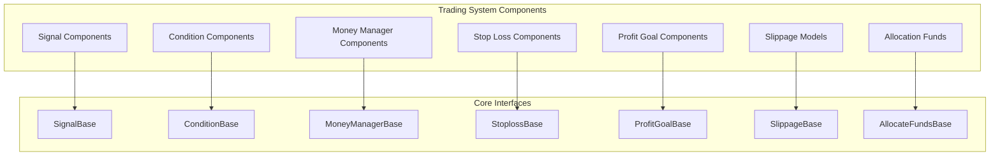
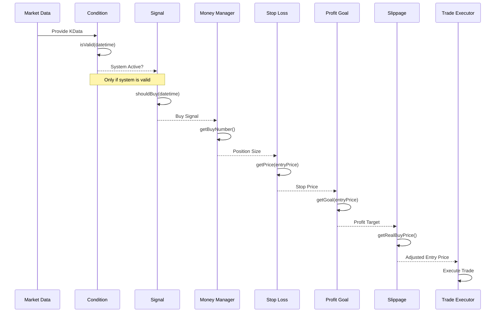

# Trading System Components

<cite>
**Referenced Files in This Document**   
- [SignalBase.h](file://hikyuu_cpp/hikyuu/trade_sys/signal/SignalBase.h)
- [MoneyManagerBase.h](file://hikyuu_cpp/hikyuu/trade_sys/moneymanager/MoneyManagerBase.h)
- [ConditionBase.h](file://hikyuu_cpp/hikyuu/trade_sys/condition/ConditionBase.h)
- [ProfitGoalBase.h](file://hikyuu_cpp/hikyuu/trade_sys/profitgoal/ProfitGoalBase.h)
- [StoplossBase.h](file://hikyuu_cpp/hikyuu/trade_sys/stoploss/StoplossBase.h)
- [SlippageBase.h](file://hikyuu_cpp/hikyuu/trade_sys/slippage/SlippageBase.h)
- [AllocateFundsBase.h](file://hikyuu_cpp/hikyuu/trade_sys/allocatefunds/AllocateFundsBase.h)
- [all.h](file://hikyuu_cpp/hikyuu/trade_sys/all.h)
</cite>

## Table of Contents
- [Trading System Components](#trading-system-components)
  - [Table of Contents](#table-of-contents)
  - [Introduction](#introduction)
  - [Core Component Architecture](#core-component-architecture)
  - [Signal Components](#signal-components)
  - [Condition Components](#condition-components)
  - [Money Management Components](#money-management-components)
  - [Stop Loss Algorithms](#stop-loss-algorithms)
  - [Profit Goal Components](#profit-goal-components)
  - [Slippage Models](#slippage-models)
  - [Allocation Funds Components](#allocation-funds-components)
  - [Execution Flow and Strategy Composition](#execution-flow-and-strategy-composition)
  - [Performance Considerations](#performance-considerations)

## Introduction
The Hikyuu trading system is built on a modular component architecture that allows for flexible strategy development. This document provides comprehensive API documentation for the trading system components, detailing the available implementations, their parameters, and usage patterns. The system follows a component-based design where each aspect of trading logic is encapsulated in specialized classes that can be combined to create complete trading strategies.

The core components include signals, conditions, money managers, stop loss algorithms, profit goals, slippage models, and allocation funds. Each component type has a base class interface that defines the contract for implementation, allowing users to develop custom components that integrate seamlessly with the system. The architecture supports both C++ and Python development, with consistent interfaces across both languages.

This documentation will cover the base class interfaces, available implementations, parameter configurations, and examples of how to combine these components into complete trading strategies. It will also explain the execution flow of how signals trigger trades, how money managers determine position size, and how stop loss and profit goals manage exits.

## Core Component Architecture

**Diagram sources**
- [SignalBase.h](file://hikyuu_cpp/hikyuu/trade_sys/signal/SignalBase.h)
- [MoneyManagerBase.h](file://hikyuu_cpp/hikyuu/trade_sys/moneymanager/MoneyManagerBase.h)
- [ConditionBase.h](file://hikyuu_cpp/hikyuu/trade_sys/condition/ConditionBase.h)
- [ProfitGoalBase.h](file://hikyuu_cpp/hikyuu/trade_sys/profitgoal/ProfitGoalBase.h)
- [StoplossBase.h](file://hikyuu_cpp/hikyuu/trade_sys/stoploss/StoplossBase.h)
- [SlippageBase.h](file://hikyuu_cpp/hikyuu/trade_sys/slippage/SlippageBase.h)
- [AllocateFundsBase.h](file://hikyuu_cpp/hikyuu/trade_sys/allocatefunds/AllocateFundsBase.h)

**Section sources**
- [all.h](file://hikyuu_cpp/hikyuu/trade_sys/all.h)

## Signal Components

Signal components in Hikyuu are responsible for generating buy and sell signals based on market data analysis. The base class `SignalBase` provides the interface for all signal implementations, defining methods to check if a buy or sell action should be taken at a specific datetime.

Available signal implementations include:
- `SG_AllwaysBuy`: Generates buy signals continuously
- `SG_Band`: Generates signals based on price band breakouts
- `SG_Bool`: Generates signals based on boolean conditions
- `SG_Cross`: Generates signals when indicators cross
- `SG_CrossGold`: Generates golden cross signals
- `SG_Cycle`: Generates cyclical signals
- `SG_Flex`: Flexible signal generator with customizable logic
- `SG_Logic`: Combines multiple signals using logical operations
- `SG_Manual`: Allows manual signal generation
- `SG_OneSide`: Generates signals for one side only (long or short)
- `SG_Single`: Generates single-entry signals

Each signal component can be configured with parameters specific to its implementation. For example, the `SG_Cross` component requires two indicators to monitor for crossovers, while the `SG_Band` component requires upper and lower band values.

The execution model follows a pattern where the trading system queries the signal component at each time step to determine if a trade should be executed. The signal component analyzes the historical data (KData) provided to it and returns whether a buy or sell signal is present at the current datetime.

**Section sources**
- [SignalBase.h](file://hikyuu_cpp/hikyuu/trade_sys/signal/SignalBase.h)
- [SG_Cross.h](file://hikyuu_cpp/hikyuu/trade_sys/signal/crt/SG_Cross.h)
- [SG_Band.h](file://hikyuu_cpp/hikyuu/trade_sys/signal/crt/SG_Band.h)

## Condition Components

Condition components define the system validity conditions that must be met for trading to occur. The base class `ConditionBase` provides the interface for all condition implementations, allowing them to determine whether the trading system is active at a given time.

Available condition implementations include:
- `CN_Bool`: Boolean condition based on a logical expression
- `CN_Logic`: Combines multiple conditions using logical operators
- `CN_Manual`: Manual condition control
- `CN_OPLine`: Condition based on an operating line threshold

Condition components work in conjunction with signal components to filter trading opportunities. Even if a signal component generates a buy or sell signal, the trade will only be executed if the condition component indicates that the system is valid at that time.

The condition evaluation is performed before signal evaluation in the trading pipeline. This allows for system-wide controls such as only trading during certain market conditions or avoiding trading during volatile periods.

**Section sources**
- [ConditionBase.h](file://hikyuu_cpp/hikyuu/trade_sys/condition/ConditionBase.h)
- [CN_Bool.h](file://hikyuu_cpp/hikyuu/trade_sys/condition/crt/CN_Bool.h)

## Money Management Components

Money management components determine the position size for each trade based on various risk and capital management strategies. The base class `MoneyManagerBase` defines the interface for calculating the number of units to buy or sell.

Available money management implementations include:
- `MM_FixedCapital`: Allocates a fixed amount of capital per trade
- `MM_FixedCapitalFunds`: Similar to FixedCapital but with fund-specific adjustments
- `MM_FixedCount`: Trades a fixed number of shares/contracts
- `MM_FixedCountTps`: Fixed count with take profit scaling
- `MM_FixedPercent`: Allocates a fixed percentage of capital
- `MM_FixedRisk`: Risk-based position sizing with fixed risk amount
- `MM_FixedUnits`: Trades a fixed number of units
- `MM_Nothing`: No position sizing control (maximum allocation)
- `MM_WilliamsFixedRisk`: Williams' fixed risk model

The money manager receives information about the trade opportunity, including the entry price and potential risk, and returns the appropriate position size. This allows for sophisticated risk management strategies that can adapt to changing market conditions and account equity.

**Section sources**
- [MoneyManagerBase.h](file://hikyuu_cpp/hikyuu/trade_sys/moneymanager/MoneyManagerBase.h)
- [MM_FixedRisk.h](file://hikyuu_cpp/hikyuu/trade_sys/moneymanager/crt/MM_FixedRisk.h)

## Stop Loss Algorithms

Stop loss components implement various strategies for defining exit points to limit losses. The base class `StoplossBase` provides the interface for calculating the stop loss price for a trade.

Available stop loss implementations include:
- `ST_FixedPercent`: Fixed percentage below entry price
- `ST_Indicator`: Based on technical indicators
- `ST_Saftyloss`: Safety-based stop loss with dynamic adjustment

The stop loss component is queried before each trade execution to determine the appropriate stop price. This price is then used by the trading system to place a stop order that will automatically exit the position if the market moves against it by a predetermined amount.

Stop loss algorithms can use various inputs including historical price data, volatility measures, and other market indicators to determine optimal stop levels that balance risk protection with avoiding premature exits due to normal market fluctuations.

**Section sources**
- [StoplossBase.h](file://hikyuu_cpp/hikyuu/trade_sys/stoploss/StoplossBase.h)
- [ST_FixedPercent.h](file://hikyuu_cpp/hikyuu/trade_sys/stoploss/crt/ST_FixedPercent.h)

## Profit Goal Components

Profit goal components define the target prices for taking profits on winning trades. The base class `ProfitGoalBase` provides the interface for calculating the profit target price.

Available profit goal implementations include:
- `PG_FixedHoldDays`: Holds positions for a fixed number of days
- `PG_FixedPercent`: Takes profit at a fixed percentage above entry
- `PG_NoGoal`: No predefined profit target (exit based on other conditions)

The profit goal component works in conjunction with the stop loss component to define the complete risk-reward profile of a trade. When the market reaches the profit goal price, the trading system will execute a sell order to capture the gains.

Profit goal strategies can be combined with trailing stop mechanisms to protect profits while allowing for additional upside potential.

**Section sources**
- [ProfitGoalBase.h](file://hikyuu_cpp/hikyuu/trade_sys/profitgoal/ProfitGoalBase.h)
- [PG_FixedPercent.h](file://hikyuu_cpp/hikyuu/trade_sys/profitgoal/crt/PG_FixedPercent.h)

## Slippage Models

Slippage components model the difference between expected trade prices and actual execution prices. The base class `SlippageBase` provides the interface for calculating realistic execution prices.

Available slippage implementations include:
- `SP_FixedPercent`: Fixed percentage slippage
- `SP_FixedValue`: Fixed monetary value slippage
- `SP_LogNormal`: Log-normal distribution model
- `SP_Normal`: Normal distribution model
- `SP_TruncNormal`: Truncated normal distribution
- `SP_Uniform`: Uniform distribution model

Slippage models are important for realistic backtesting as they account for market impact, liquidity constraints, and execution delays. The chosen model affects both entry and exit prices, providing a more accurate simulation of real-world trading performance.

These models can be calibrated based on historical execution data or market microstructure characteristics to improve the accuracy of performance simulations.

**Section sources**
- [SlippageBase.h](file://hikyuu_cpp/hikyuu/trade_sys/slippage/SlippageBase.h)
- [SP_FixedPercent.h](file://hikyuu_cpp/hikyuu/trade_sys/slippage/crt/SP_FixedPercent.h)

## Allocation Funds Components

Allocation funds components manage the distribution of capital across multiple trading systems or assets. The base class `AllocateFundsBase` provides the interface for asset allocation strategies.

Available allocation implementations include:
- `AF_EqualWeight`: Equal allocation across all systems
- `AF_FixedWeight`: Fixed weight allocation
- `AF_FixedWeightList`: Predefined weight list
- `AF_MultiFactor`: Multi-factor weighted allocation
- `AF_FixedAmount`: Fixed amount allocation

These components are particularly useful in portfolio management scenarios where capital must be optimally distributed across multiple strategies or asset classes. The allocation algorithm considers various factors such as performance, risk, and correlation to determine the optimal capital distribution.

The allocation process typically occurs at regular intervals (rebalancing periods) and may involve both adding capital to systems and reducing or eliminating allocations to underperforming systems.

**Section sources**
- [AllocateFundsBase.h](file://hikyuu_cpp/hikyuu/trade_sys/allocatefunds/AllocateFundsBase.h)
- [AF_EqualWeight.h](file://hikyuu_cpp/hikyuu/trade_sys/allocatefunds/crt/AF_EqualWeight.h)

## Execution Flow and Strategy Composition

**Diagram sources**
- [SignalBase.h](file://hikyuu_cpp/hikyuu/trade_sys/signal/SignalBase.h)
- [MoneyManagerBase.h](file://hikyuu_cpp/hikyuu/trade_sys/moneymanager/MoneyManagerBase.h)
- [ConditionBase.h](file://hikyuu_cpp/hikyuu/trade_sys/condition/ConditionBase.h)
- [StoplossBase.h](file://hikyuu_cpp/hikyuu/trade_sys/stoploss/StoplossBase.h)
- [ProfitGoalBase.h](file://hikyuu_cpp/hikyuu/trade_sys/profitgoal/ProfitGoalBase.h)
- [SlippageBase.h](file://hikyuu_cpp/hikyuu/trade_sys/slippage/SlippageBase.h)

**Section sources**
- [SignalBase.h](file://hikyuu_cpp/hikyuu/trade_sys/signal/SignalBase.h)
- [MoneyManagerBase.h](file://hikyuu_cpp/hikyuu/trade_sys/moneymanager/MoneyManagerBase.h)

The execution flow of the trading system follows a sequential pipeline where each component builds upon the output of the previous one:

1. **Condition Evaluation**: The system first checks if trading is allowed based on the condition component
2. **Signal Generation**: If the system is active, the signal component generates buy/sell signals
3. **Position Sizing**: The money manager determines the appropriate position size
4. **Risk Management**: The stop loss and profit goal components define exit parameters
5. **Slippage Modeling**: The slippage model adjusts expected prices for realism
6. **Trade Execution**: The final trade parameters are sent to the executor

This modular design allows for flexible strategy composition where different components can be mixed and matched to create customized trading systems. For example, a trend-following strategy might use a crossover signal with a fixed percentage stop loss and a risk-based money manager, while a mean-reversion strategy might use a band signal with a volatility-based stop and a fixed capital money manager.

## Performance Considerations

When using complex component combinations in the Hikyuu trading system, several performance considerations should be taken into account:

1. **Memory Usage**: Each component maintains its own state and data structures. Using multiple instances of components, especially those that store historical data, can increase memory consumption significantly.

2. **Computational Overhead**: The sequential evaluation of components adds computational overhead. Complex calculations in signal or condition components can become bottlenecks, especially when processing high-frequency data.

3. **Component Interaction**: The interaction between components can create unexpected behavior. For example, a tight stop loss combined with a high slippage model might result in frequent premature exits.

4. **Parameter Optimization**: With multiple components each having their own parameters, the parameter space can become very large, making optimization challenging and prone to overfitting.

5. **Execution Latency**: In live trading scenarios, the time required to evaluate all components can impact execution speed, potentially leading to missed opportunities or worse fills.

To mitigate these issues, it's recommended to:
- Profile component performance individually before combining them
- Use simpler models when possible, especially for high-frequency strategies
- Implement efficient data structures and algorithms in custom components
- Consider the overall complexity of the strategy relative to the expected returns
- Test component combinations thoroughly in backtesting before live deployment

The modular architecture, while flexible, requires careful consideration of these performance factors to ensure that the resulting trading system is both effective and efficient.