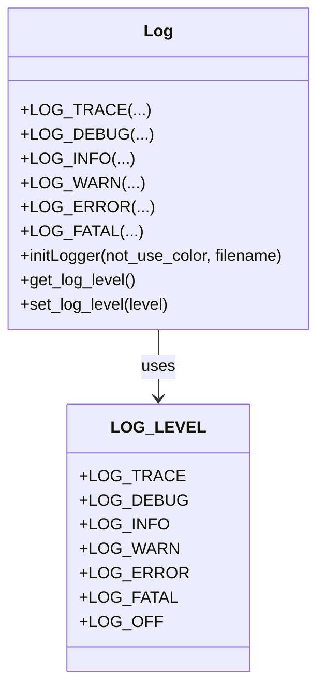
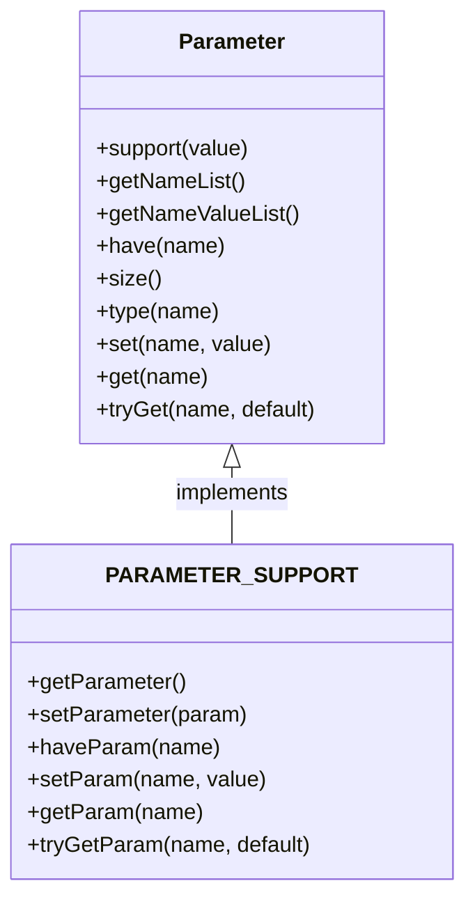
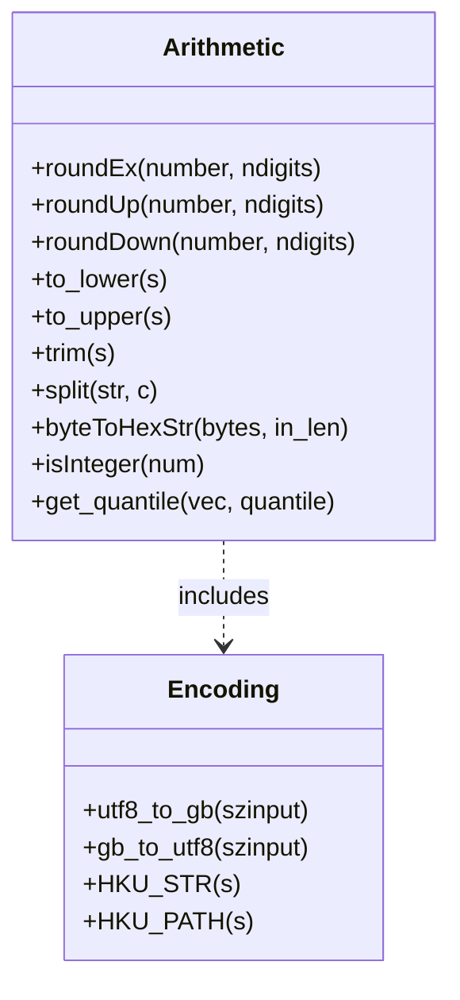
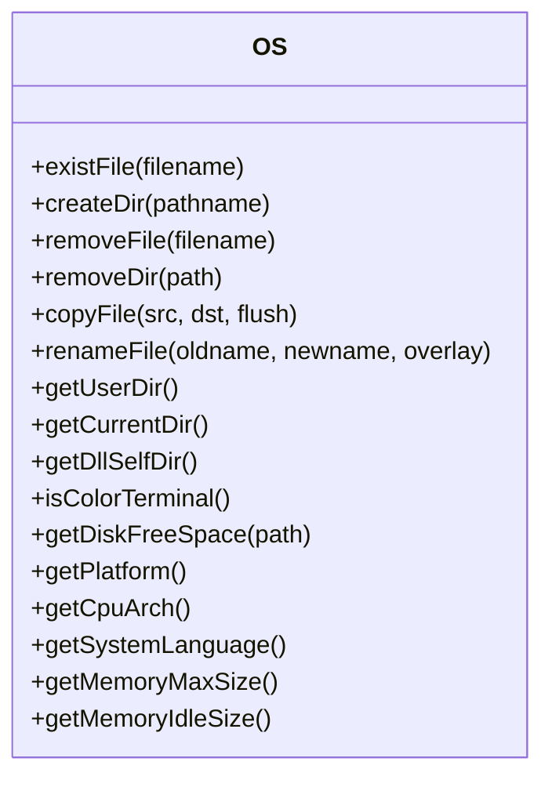
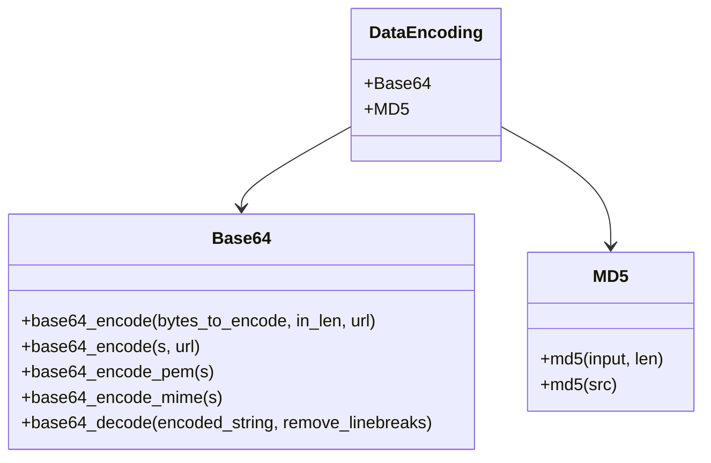
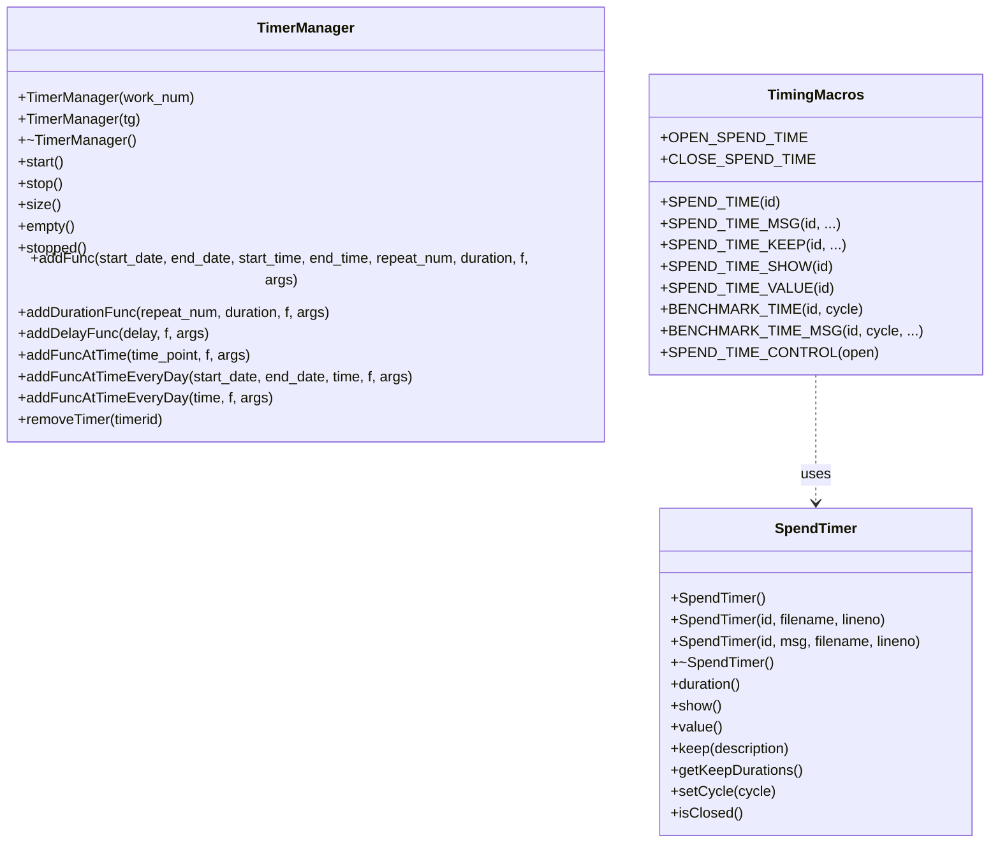
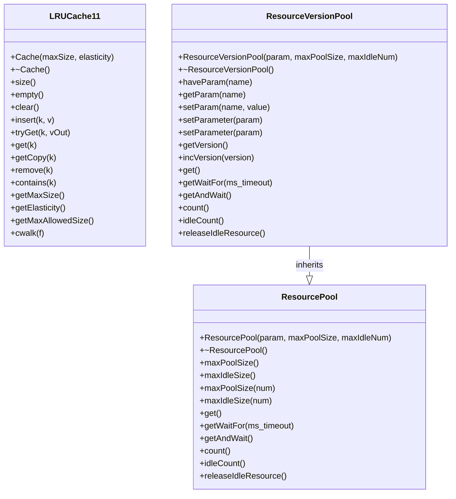

# Core Utilities

<cite>
**Referenced Files in This Document**   
- [Log.h](file://hikyuu_cpp/hikyuu/utilities/Log.h)
- [Log.cpp](file://hikyuu_cpp/hikyuu/utilities/Log.cpp)
- [Parameter.h](file://hikyuu_cpp/hikyuu/utilities/Parameter.h)
- [Parameter.cpp](file://hikyuu_cpp/hikyuu/utilities/Parameter.cpp)
- [exception.h](file://hikyuu_cpp/hikyuu/utilities/exception.h)
- [exception.cpp](file://hikyuu_cpp/hikyuu/utilities/exception.cpp)
- [arithmetic.h](file://hikyuu_cpp/hikyuu/utilities/arithmetic.h)
- [arithmetic.cpp](file://hikyuu_cpp/hikyuu/utilities/arithmetic.cpp)
- [os.h](file://hikyuu_cpp/hikyuu/utilities/os.h)
- [os.cpp](file://hikyuu_cpp/hikyuu/utilities/os.cpp)
- [base64.h](file://hikyuu_cpp/hikyuu/utilities/base64.h)
- [base64.cpp](file://hikyuu_cpp/hikyuu/utilities/base64.cpp)
- [md5.h](file://hikyuu_cpp/hikyuu/utilities/md5.h)
- [md5.cpp](file://hikyuu_cpp/hikyuu/utilities/md5.cpp)
- [TimerManager.h](file://hikyuu_cpp/hikyuu/utilities/TimerManager.h)
- [SpendTimer.h](file://hikyuu_cpp/hikyuu/utilities/SpendTimer.h)
- [LRUCache11.h](file://hikyuu_cpp/hikyuu/utilities/LRUCache11.h)
- [ResourcePool.h](file://hikyuu_cpp/hikyuu/utilities/ResourcePool.h)
</cite>

## Table of Contents
1. [Introduction](#introduction)
2. [Logging System](#logging-system)
3. [Parameter Class](#parameter-class)
4. [Exception Hierarchy](#exception-hierarchy)
5. [Arithmetic Utilities](#arithmetic-utilities)
6. [OS Abstraction Layer](#os-abstraction-layer)
7. [Base64 and MD5 Utilities](#base64-and-md5-utilities)
8. [TimerManager and SpendTimer](#timermanager-and-spendtimer)
9. [LRUCache11 and ResourcePool](#lrucache11-and-resourcepool)
10. [Practical Examples](#practical-examples)
11. [Conclusion](#conclusion)

## Introduction
This document provides comprehensive API documentation for the core utility classes in the hikyuu financial analysis framework. The utilities cover essential functionality for logging, configuration management, error handling, performance measurement, data encoding, and resource management. These components are designed to work seamlessly in both C++ and Python contexts, providing a consistent interface for developers. The documentation details each utility class, its methods, and practical usage patterns, enabling developers to effectively utilize these tools in their financial applications.

## Logging System

The logging system in hikyuu is built on the SPDLOG library, providing a flexible and efficient mechanism for recording application events at various severity levels. The system supports both file and console output with configurable formatting and color coding. The Log class provides a comprehensive set of macros and functions for logging messages with different severity levels, making it easy to implement detailed logging throughout the application.

The logging system defines six severity levels through the LOG_LEVEL enum:
- **LOG_TRACE**: Detailed tracing information for debugging
- **LOG_DEBUG**: Debug-level messages for development
- **LOG_INFO**: General information about application operation
- **LOG_WARN**: Warning messages indicating potential issues
- **LOG_ERROR**: Error messages indicating recoverable failures
- **LOG_FATAL**: Critical error messages indicating unrecoverable failures

The system can be initialized using the `initLogger` function, which configures the logger with optional parameters for color output and custom log file names. The default log file is "./hikyuu.log" in the current directory. The logging system also provides assertion macros like `HKU_ASSERT` and `HKU_CHECK` that automatically generate log entries when conditions fail, including stack trace information when enabled.



**Diagram sources**
- [Log.h](file://hikyuu_cpp/hikyuu/utilities/Log.h#L58-L66)
- [Log.cpp](file://hikyuu_cpp/hikyuu/utilities/Log.cpp#L43-L84)

**Section sources**
- [Log.h](file://hikyuu_cpp/hikyuu/utilities/Log.h#L1-L439)
- [Log.cpp](file://hikyuu_cpp/hikyuu/utilities/Log.cpp#L1-L87)

## Parameter Class

The Parameter class provides a flexible configuration system that allows objects to have named parameters with various data types. This utility enables dynamic configuration of components without requiring changes to their class definitions. The class uses a map-based storage system with boost::any to support multiple data types, including int, bool, double, string, Stock, Block, KQuery, KData, PriceList, and DatetimeList.

The Parameter class supports several key operations:
- **Adding parameters**: Using the `add` method to create new parameters with default values
- **Setting parameters**: Using the `set` method to modify existing parameter values
- **Getting parameters**: Using the `get` method to retrieve parameter values with type safety
- **Checking parameters**: Using the `have` method to verify if a parameter exists
- **Listing parameters**: Using `getNameList` and `getNameValueList` to retrieve parameter information

The class also provides template methods for type-safe parameter access and supports comparison operations for parameter state management. In Python, the Parameter class is accessible through the hikyuu module, allowing for seamless configuration management in both C++ and Python contexts.



**Diagram sources**
- [Parameter.h](file://hikyuu_cpp/hikyuu/utilities/Parameter.h#L106-L512)
- [Parameter.cpp](file://hikyuu_cpp/hikyuu/utilities/Parameter.cpp#L1-L252)

**Section sources**
- [Parameter.h](file://hikyuu_cpp/hikyuu/utilities/Parameter.h#L1-L512)
- [Parameter.cpp](file://hikyuu_cpp/hikyuu/utilities/Parameter.cpp#L1-L252)

## Exception Hierarchy

The exception hierarchy in hikyuu provides a robust error handling system based on the standard C++ exception mechanism. The core exception class is `hku::exception`, which inherits from `std::exception` and provides enhanced error reporting capabilities. This exception class supports both character string and std::string inputs, making it flexible for various error message formats.

The exception system is integrated with the logging system through assertion macros that automatically throw exceptions when conditions fail. These macros include:
- **HKU_ASSERT**: Throws an exception when a condition is false, with stack trace support
- **HKU_CHECK**: Throws an hku::exception when a condition is false
- **HKU_CHECK_THROW**: Throws a specified exception type when a condition is false
- **HKU_THROW**: Throws an hku::exception with a formatted message
- **HKU_THROW_EXCEPTION**: Throws a specified exception type with a formatted message

The system also provides conditional logging and return macros that combine logging with error handling, such as `HKU_ERROR_IF_RETURN` which logs an error message and returns a specified value when a condition is met. This integrated approach to error handling and logging ensures that errors are properly recorded and handled consistently throughout the application.

```mermaid
classDiagram
class exception {
+exception()
+exception(const char* msg)
+exception(const std : : string& msg)
+~exception()
+what()
}
class std : : exception {
+what()
}
exception --|> std : : exception : inherits
class AssertionMacros {
+HKU_ASSERT(expr)
+HKU_CHECK(expr, ...)
+HKU_CHECK_THROW(expr, except, ...)
+HKU_THROW(...)
+HKU_THROW_EXCEPTION(except, ...)
}
AssertionMacros ..> exception : uses
```

**Diagram sources**
- [exception.h](file://hikyuu_cpp/hikyuu/utilities/exception.h#L34-L44)
- [exception.cpp](file://hikyuu_cpp/hikyuu/utilities/exception.cpp#L1-L16)
- [Log.h](file://hikyuu_cpp/hikyuu/utilities/Log.h#L112-L213)

**Section sources**
- [exception.h](file://hikyuu_cpp/hikyuu/utilities/exception.h#L1-L53)
- [exception.cpp](file://hikyuu_cpp/hikyuu/utilities/exception.cpp#L1-L16)

## Arithmetic Utilities

The arithmetic utilities in hikyuu provide a collection of mathematical and string manipulation functions specifically designed for financial calculations. These utilities include rounding functions with different modes (roundEx, roundUp, roundDown), string processing functions (to_lower, to_upper, trim, split), and specialized financial calculation helpers.

Key features of the arithmetic utilities include:
- **Rounding functions**: The `roundEx` function implements traditional rounding (not banker's rounding) with configurable decimal places, while `roundUp` and `roundDown` provide ceiling and floor operations respectively
- **String utilities**: Functions for case conversion, whitespace trimming, and string splitting that handle UTF-8 encoding properly across different platforms
- **Financial helpers**: The `get_quantile` function calculates quantiles from sorted vectors, useful for statistical analysis in financial applications
- **Encoding conversion**: Functions to convert between UTF-8 and GB2312 encodings, important for handling Chinese characters in financial data on Windows platforms

The utilities also include functions for converting byte arrays to hexadecimal strings, which is useful for debugging and data representation. These functions are optimized for performance and handle edge cases appropriately, making them reliable for production use in financial applications.



**Diagram sources**
- [arithmetic.h](file://hikyuu_cpp/hikyuu/utilities/arithmetic.h#L85-L460)
- [arithmetic.cpp](file://hikyuu_cpp/hikyuu/utilities/arithmetic.cpp#L1-L248)

**Section sources**
- [arithmetic.h](file://hikyuu_cpp/hikyuu/utilities/arithmetic.h#L1-L466)
- [arithmetic.cpp](file://hikyuu_cpp/hikyuu/utilities/arithmetic.cpp#L1-L248)

## OS Abstraction Layer

The OS abstraction layer in hikyuu provides a consistent interface for file system operations and system information retrieval across different operating systems. This utility layer encapsulates platform-specific details, allowing the rest of the codebase to work uniformly on Windows, Linux, macOS, and other supported platforms.

The os.h header defines a comprehensive set of functions for:
- **File operations**: Checking file existence (`existFile`), creating directories (`createDir`), removing files and directories (`removeFile`, `removeDir`), copying files (`copyFile`), and renaming files (`renameFile`)
- **Path operations**: Retrieving user directory (`getUserDir`), current working directory (`getCurrentDir`), and DLL self directory (`getDllSelfDir`)
- **System information**: Getting platform name (`getPlatform`), CPU architecture (`getCpuArch`), system language (`getSystemLanguage`), and memory information (`getMemoryMaxSize`, `getMemoryIdleSize`)
- **Disk operations**: Retrieving free disk space (`getDiskFreeSpace`)

The implementation handles platform-specific differences in file system APIs, path separators, and encoding. For example, it automatically converts UTF-8 paths to GB2312 on Windows when necessary. The abstraction layer also provides a function to detect if the output terminal supports color codes (`isColorTerminal`), enabling conditional colored output in logs and console applications.



**Diagram sources**
- [os.h](file://hikyuu_cpp/hikyuu/utilities/os.h#L30-L114)
- [os.cpp](file://hikyuu_cpp/hikyuu/utilities/os.cpp#L1-L503)

**Section sources**
- [os.h](file://hikyuu_cpp/hikyuu/utilities/os.h#L1-L115)
- [os.cpp](file://hikyuu_cpp/hikyuu/utilities/os.cpp#L1-L503)

## Base64 and MD5 Utilities

The base64 and MD5 utilities in hikyuu provide essential functions for data encoding, decoding, and integrity verification. These utilities are crucial for secure data handling, authentication, and data transmission in financial applications.

The base64 utility provides functions for:
- **Encoding**: Converting binary data to base64 strings using `base64_encode` with support for URL-safe encoding
- **Decoding**: Converting base64 strings back to binary data using `base64_decode`
- **Formatted encoding**: Specialized functions for PEM and MIME formatted base64 encoding

The MD5 utility provides a reliable implementation of the MD5 hash algorithm for data integrity verification:
- **Hash calculation**: The `md5` function computes MD5 hashes from byte arrays or strings
- **Consistent results**: The implementation ensures consistent hash results across different platforms, addressing issues with boost's MD5 implementation
- **String convenience**: Overloaded functions to directly hash std::string objects

These utilities are designed to be efficient and reliable, with proper error handling for invalid inputs. The base64 implementation handles edge cases like line breaks and padding correctly, while the MD5 implementation follows the standard algorithm specification to ensure compatibility with other systems.



**Diagram sources**
- [base64.h](file://hikyuu_cpp/hikyuu/utilities/base64.h#L26-L52)
- [base64.cpp](file://hikyuu_cpp/hikyuu/utilities/base64.cpp#L1-L291)
- [md5.h](file://hikyuu_cpp/hikyuu/utilities/md5.h#L27-L37)
- [md5.cpp](file://hikyuu_cpp/hikyuu/utilities/md5.cpp#L1-L291)

**Section sources**
- [base64.h](file://hikyuu_cpp/hikyuu/utilities/base64.h#L1-L52)
- [base64.cpp](file://hikyuu_cpp/hikyuu/utilities/base64.cpp#L1-L291)
- [md5.h](file://hikyuu_cpp/hikyuu/utilities/md5.h#L1-L41)
- [md5.cpp](file://hikyuu_cpp/hikyuu/utilities/md5.cpp#L1-L291)

## TimerManager and SpendTimer

The TimerManager and SpendTimer utilities provide comprehensive timing and performance measurement capabilities for the hikyuu framework. These tools enable both scheduled task execution and detailed performance profiling.

The TimerManager class implements a sophisticated scheduling system that can:
- **Schedule recurring tasks**: Execute functions at regular intervals with `addDurationFunc`
- **Schedule delayed tasks**: Execute functions after a specified delay with `addDelayFunc`
- **Schedule at specific times**: Execute functions at precise moments with `addFuncAtTime`
- **Schedule daily tasks**: Execute functions at the same time every day with `addFuncAtTimeEveryDay`
- **Manage task lifecycle**: Add, remove, and monitor scheduled tasks

The TimerManager uses a priority queue to efficiently manage task execution order and supports multi-threaded execution through a configurable thread pool. It handles edge cases like system time adjustments and provides precise timing control for financial applications where timing accuracy is critical.

The SpendTimer utility provides performance profiling capabilities through a set of convenient macros:
- **SPEND_TIME**: Measure execution time of code blocks
- **SPEND_TIME_MSG**: Measure execution time with custom messages
- **SPEND_TIME_KEEP**: Record intermediate timings within a code block
- **BENCHMARK_TIME**: Measure performance of repeated operations

These tools work together to provide comprehensive timing capabilities, from high-level task scheduling to low-level performance measurement, enabling developers to optimize their financial algorithms and ensure timely execution of critical operations.



**Diagram sources**
- [TimerManager.h](file://hikyuu_cpp/hikyuu/utilities/TimerManager.h#L24-L552)
- [SpendTimer.h](file://hikyuu_cpp/hikyuu/utilities/SpendTimer.h#L152-L315)

**Section sources**
- [TimerManager.h](file://hikyuu_cpp/hikyuu/utilities/TimerManager.h#L1-L552)
- [SpendTimer.h](file://hikyuu_cpp/hikyuu/utilities/SpendTimer.h#L1-L315)

## LRUCache11 and ResourcePool

The LRUCache11 and ResourcePool utilities provide efficient resource management capabilities for the hikyuu framework. These tools help optimize performance by caching frequently accessed data and managing expensive resources like database connections.

The LRUCache11 class implements a high-performance LRU (Least Recently Used) cache with O(1) operations for insert, delete, and refresh. Key features include:
- **Template-based design**: Supports any key and value types
- **Configurable size**: Limits cache size with optional elasticity
- **Thread safety**: Optional synchronization using custom lock types
- **Efficient operations**: Uses a combination of hash map and linked list for optimal performance

The ResourcePool class provides a generic resource pooling mechanism that can manage any type of resource, such as database connections or network sockets. It features:
- **Parameter-based configuration**: Resources are created with configurable parameters
- **Size limits**: Configurable maximum pool and idle sizes
- **Thread-safe operations**: Uses mutexes and condition variables for safe concurrent access
- **Automatic cleanup**: Resources are properly destroyed when the pool is destroyed

The ResourceVersionPool extends the basic ResourcePool with versioning capabilities, allowing for seamless parameter changes without disrupting ongoing operations. When parameters change, new resources use the updated parameters while existing resources continue with their original configuration until they are returned to the pool.



**Diagram sources**
- [LRUCache11.h](file://hikyuu_cpp/hikyuu/utilities/LRUCache11.h#L82-L230)
- [ResourcePool.h](file://hikyuu_cpp/hikyuu/utilities/ResourcePool.h#L57-L636)

**Section sources**
- [LRUCache11.h](file://hikyuu_cpp/hikyuu/utilities/LRUCache11.h#L1-L230)
- [ResourcePool.h](file://hikyuu_cpp/hikyuu/utilities/ResourcePool.h#L1-L636)

## Practical Examples

This section provides practical examples demonstrating the use of hikyuu's core utilities in both C++ and Python contexts.

### Configuration Management Example
In C++, a class can use the PARAMETER_SUPPORT macro to enable parameter configuration:

```cpp
class MyStrategy {
    PARAMETER_SUPPORT
    
public:
    MyStrategy() {
        addParam<int>("period", 20);
        addParam<double>("threshold", 0.5);
    }
    
    void calculate() {
        int period = getParam<int>("period");
        double threshold = getParam<double>("threshold");
        // Use parameters in calculation
    }
};
```

In Python, the same functionality is available:

```python
param = Parameter()
param.add("period", 20)
param.add("threshold", 0.5)
strategy.setParameter(param)
```

### Error Handling Pattern
The integrated logging and exception system enables robust error handling:

```cpp
void processData(const Data& data) {
    HKU_CHECK(!data.empty(), "Data cannot be empty");
    HKU_CHECK(data.size() <= MAX_SIZE, "Data size {} exceeds limit {}", 
              data.size(), MAX_SIZE);
    
    try {
        // Process data
    } catch (const std::exception& e) {
        HKU_ERROR("Processing failed: {}", e.what());
        HKU_THROW("Failed to process data");
    }
}
```

### Performance Profiling
Using SpendTimer to measure performance:

```cpp
void criticalFunction() {
    SPEND_TIME(algorithm, "Executing trading algorithm");
    
    // Algorithm steps
    SPEND_TIME_KEEP(algorithm, "Loaded market data");
    
    // More processing
    SPEND_TIME_KEEP(algorithm, "Calculated indicators");
    
    // Final steps
    SPEND_TIME_SHOW(algorithm); // Print total time
}
```

### Secure Data Handling
Using base64 and MD5 for data integrity:

```cpp
std::string encodeAndVerify(const std::string& data) {
    // Encode data
    std::string encoded = base64_encode(data);
    
    // Verify integrity
    std::string hash = md5(data);
    
    return encoded + ":" + hash;
}
```

**Section sources**
- [Parameter.h](file://hikyuu_cpp/hikyuu/utilities/Parameter.h#L320-L361)
- [Log.h](file://hikyuu_cpp/hikyuu/utilities/Log.h#L112-L213)
- [SpendTimer.h](file://hikyuu_cpp/hikyuu/utilities/SpendTimer.h#L93-L143)
- [base64.h](file://hikyuu_cpp/hikyuu/utilities/base64.h#L35-L38)
- [md5.h](file://hikyuu_cpp/hikyuu/utilities/md5.h#L27-L37)

## Conclusion
The core utilities in hikyuu provide a comprehensive foundation for building robust financial applications. The logging system offers detailed insight into application behavior with configurable severity levels and output formats. The Parameter class enables flexible configuration management that works seamlessly across C++ and Python. The exception hierarchy ensures consistent error handling throughout the codebase.

The arithmetic utilities provide essential mathematical and string functions optimized for financial calculations, while the OS abstraction layer ensures cross-platform compatibility for file system operations. The base64 and MD5 utilities enable secure data handling and integrity verification. The TimerManager and SpendTimer classes offer comprehensive timing and performance measurement capabilities, from scheduled task execution to detailed code profiling.

Finally, the LRUCache11 and ResourcePool classes provide efficient resource management, helping to optimize performance by caching frequently accessed data and managing expensive resources. Together, these utilities form a powerful toolkit that enables developers to build high-performance, reliable financial applications with proper logging, configuration, error handling, and performance monitoring.