# Database Connectivity

<cite>
**Referenced Files in This Document**   
- [DBConnectBase.h](file://hikyuu_cpp/hikyuu/utilities/db_connect/DBConnectBase.h)
- [DBCondition.h](file://hikyuu_cpp/hikyuu/utilities/db_connect/DBCondition.h)
- [SQLResultSet.h](file://hikyuu_cpp/hikyuu/utilities/db_connect/SQLResultSet.h)
- [DBUpgrade.h](file://hikyuu_cpp/hikyuu/utilities/db_connect/DBUpgrade.h)
- [SQLiteConnect.h](file://hikyuu_cpp/hikyuu/utilities/db_connect/sqlite/SQLiteConnect.h)
- [MySQLConnect.h](file://hikyuu_cpp/hikyuu/utilities/db_connect/mysql/MySQLConnect.h)
- [SQLStatementBase.h](file://hikyuu_cpp/hikyuu/utilities/db_connect/SQLStatementBase.h)
- [TableMacro.h](file://hikyuu_cpp/hikyuu/utilities/db_connect/TableMacro.h)
- [test_sqlite.cpp](file://hikyuu_cpp/unit_test/hikyuu/utilities/db_connect/test_sqlite.cpp)
- [common_sqlite3.py](file://hikyuu/data/common_sqlite3.py)
- [common_mysql.py](file://hikyuu/data/common_mysql.py)
</cite>

## Table of Contents
1. [Introduction](#introduction)
2. [Connection Management](#connection-management)
3. [Transaction Handling](#transaction-handling)
4. [Statement Execution and Result Processing](#statement-execution-and-result-processing)
5. [Database Schema Management](#database-schema-management)
6. [Dynamic Query Building with DBCondition](#dynamic-query-building-with-dbcondition)
7. [Result Set Processing with SQLResultSet](#result-set-processing-with-sqlresultset)
8. [Database Upgrade System](#database-upgrade-system)
9. [Connection Pooling](#connection-pooling)
10. [Practical Examples](#practical-examples)
11. [Error Handling and Performance](#error-handling-and-performance)
12. [Conclusion](#conclusion)

## Introduction

The Hikyuu database connectivity layer provides a comprehensive, high-performance interface for database operations with support for both MySQL and SQLite databases. This documentation details the architecture, APIs, and usage patterns for the database connectivity components, focusing on connection management, transaction handling, query execution, and schema evolution.

The database layer is designed to abstract the underlying database specifics while providing efficient access to data storage and retrieval operations. It supports both direct SQL execution and an object-relational mapping approach through table binding macros, enabling developers to work with database records as C++ objects.

**Section sources**
- [DBConnectBase.h](file://hikyuu_cpp/hikyuu/utilities/db_connect/DBConnectBase.h#L1-L658)

## Connection Management

### MySQL and SQLite Connection Wrappers

The Hikyuu database connectivity layer provides two primary connection implementations: `MySQLConnect` for MySQL databases and `SQLiteConnect` for SQLite databases. Both classes inherit from the abstract base class `DBConnectBase`, which defines the common interface for database operations.

The `DBConnectBase` class serves as the foundation for all database connections, providing a consistent API regardless of the underlying database engine. It supports essential operations such as connection establishment, ping operations to verify connectivity, and execution of SQL statements.

For MySQL connections, the `MySQLConnect` class wraps the MySQL C API, providing a modern C++ interface to MySQL database operations. The connection is established using a `Parameter` object that contains connection parameters such as host, port, username, password, and database name.

For SQLite connections, the `SQLiteConnect` class wraps the SQLite3 C API, offering a thread-safe interface to SQLite database files. The connection parameters include the database file path, connection flags (such as read-write access and creation options), and optional encryption keys for SQLCipher-encrypted databases.

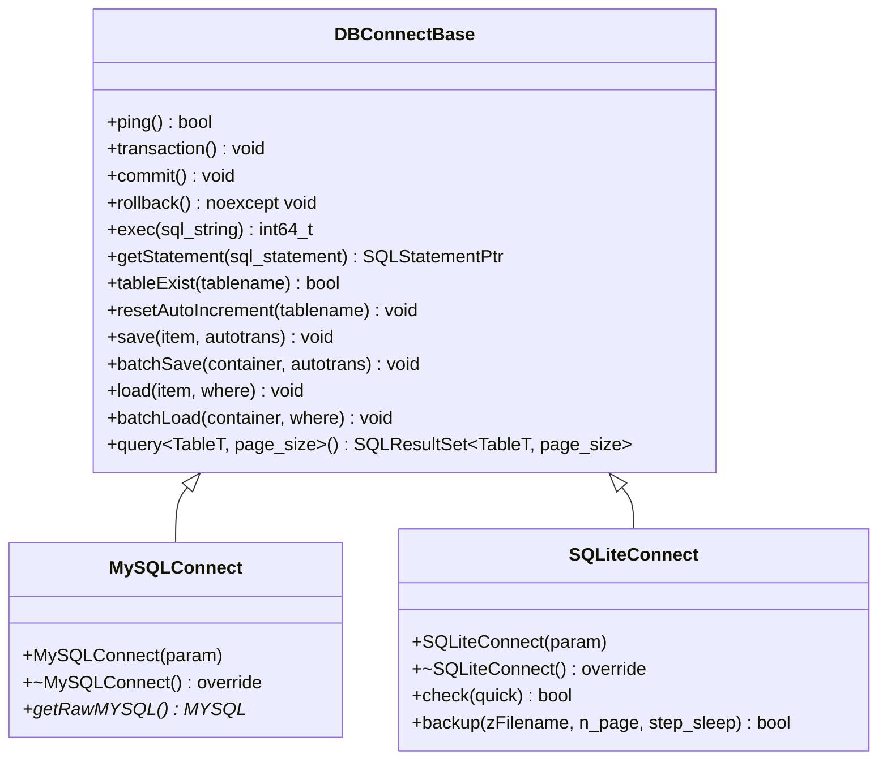
```mermaid
classDiagram
class DBConnectBase {
+ping() bool
+transaction() void
+commit() void
+rollback() noexcept void
+exec(sql_string) int64_t
+getStatement(sql_statement) SQLStatementPtr
+tableExist(tablename) bool
+resetAutoIncrement(tablename) void
+save(item, autotrans) void
+batchSave(container, autotrans) void
+load(item, where) void
+batchLoad(container, where) void
+query~TableT, page_size~() SQLResultSet~TableT, page_size~
}
class MySQLConnect {
+MySQLConnect(param)
+~MySQLConnect() override
+getRawMYSQL() MYSQL*
}
class SQLiteConnect {
+SQLiteConnect(param)
+~SQLiteConnect() override
+check(quick) bool
+backup(zFilename, n_page, step_sleep) bool
}
DBConnectBase <|-- MySQLConnect
DBConnectBase <|-- SQLiteConnect
```

**Diagram sources**
- [DBConnectBase.h](file://hikyuu_cpp/hikyuu/utilities/db_connect/DBConnectBase.h#L28-L297)
- [MySQLConnect.h](file://hikyuu_cpp/hikyuu/utilities/db_connect/mysql/MySQLConnect.h#L25-L60)
- [SQLiteConnect.h](file://hikyuu_cpp/hikyuu/utilities/db_connect/sqlite/SQLiteConnect.h#L28-L89)

### Connection Establishment

Database connections are established by creating instances of the appropriate connection class with a `Parameter` object containing the necessary connection parameters. For SQLite, the parameter must include the database file path, while for MySQL, it requires connection details such as host, port, username, and password.

The connection process is designed to be exception-safe, with proper error handling for connection failures. Both connection types support connection pooling through the `DriverConnectPool` class, which manages a pool of reusable connections to improve performance in multi-threaded applications.

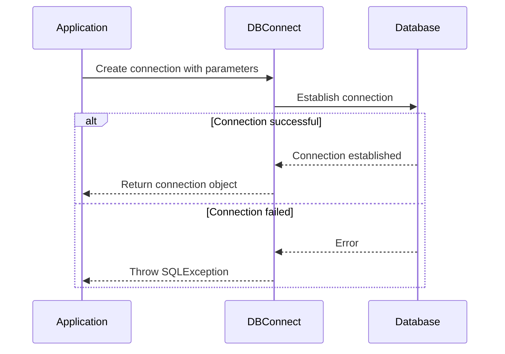
```mermaid
sequenceDiagram
participant Application
participant DBConnect
participant Database
Application->>DBConnect : Create connection with parameters
DBConnect->>Database : Establish connection
alt Connection successful
Database-->>DBConnect : Connection established
DBConnect-->>Application : Return connection object
else Connection failed
Database-->>DBConnect : Error
DBConnect-->>Application : Throw SQLException
end
```

**Diagram sources**
- [DBConnectBase.h](file://hikyuu_cpp/hikyuu/utilities/db_connect/DBConnectBase.h#L36-L37)
- [SQLiteConnect.cpp](file://hikyuu_cpp/hikyuu/utilities/db_connect/sqlite/SQLiteConnect.cpp#L48-L91)
- [MySQLConnect.cpp](file://hikyuu_cpp/hikyuu/utilities/db_connect/mysql/MySQLConnect.cpp)

**Section sources**
- [DBConnectBase.h](file://hikyuu_cpp/hikyuu/utilities/db_connect/DBConnectBase.h#L36-L37)
- [SQLiteConnect.h](file://hikyuu_cpp/hikyuu/utilities/db_connect/sqlite/SQLiteConnect.h#L40-L43)
- [MySQLConnect.h](file://hikyuu_cpp/hikyuu/utilities/db_connect/mysql/MySQLConnect.h#L27-L28)

## Transaction Handling

### Transaction Management

The Hikyuu database layer provides robust transaction management through the `DBConnectBase` interface. Transactions are managed using three primary methods: `transaction()` to begin a transaction, `commit()` to commit the transaction, and `rollback()` to roll back the transaction in case of errors.

Both MySQL and SQLite implementations follow the same transaction interface, ensuring consistency across different database backends. The transaction methods are virtual in the base class and implemented specifically for each database type.

For SQLite, the `transaction()` method executes the SQL statement "BEGIN IMMEDIATE" to start a transaction, while `commit()` executes "COMMIT TRANSACTION" and `rollback()` executes "ROLLBACK TRANSACTION". The MySQL implementation uses the corresponding MySQL API functions to manage transactions.

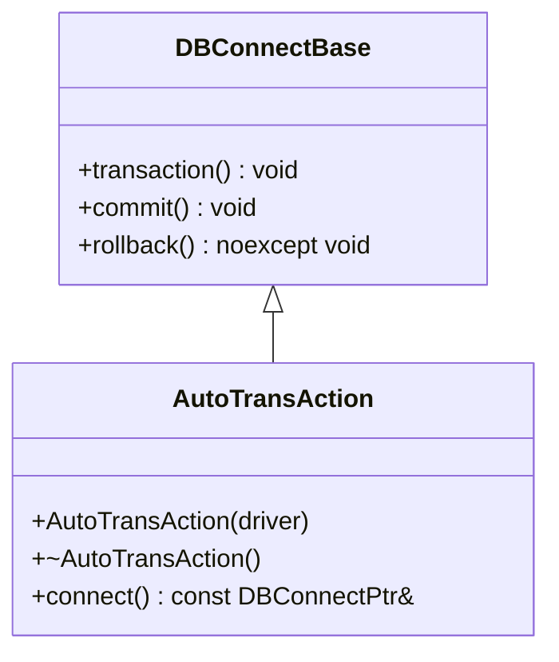
```mermaid
classDiagram
class DBConnectBase {
+transaction() void
+commit() void
+rollback() noexcept void
}
class AutoTransAction {
+AutoTransAction(driver)
+~AutoTransAction()
+connect() const DBConnectPtr&
}
DBConnectBase <|-- AutoTransAction
```

**Diagram sources**
- [DBConnectBase.h](file://hikyuu_cpp/hikyuu/utilities/db_connect/DBConnectBase.h#L47-L53)
- [AutoTransAction.h](file://hikyuu_cpp/hikyuu/utilities/db_connect/AutoTransAction.h#L1-L55)

### Automatic Transaction Management

The Hikyuu framework provides the `AutoTransAction` class for automatic transaction management. This RAII-style class automatically begins a transaction in its constructor and commits it in its destructor, with automatic rollback in case of exceptions.

The `AutoTransAction` class ensures that transactions are properly managed even in the presence of exceptions, preventing resource leaks and ensuring data consistency. If an exception occurs during the transaction, the destructor will automatically roll back the transaction and rethrow the exception.

This pattern is particularly useful for complex operations that involve multiple database operations, as it eliminates the need for explicit try-catch blocks for transaction management.

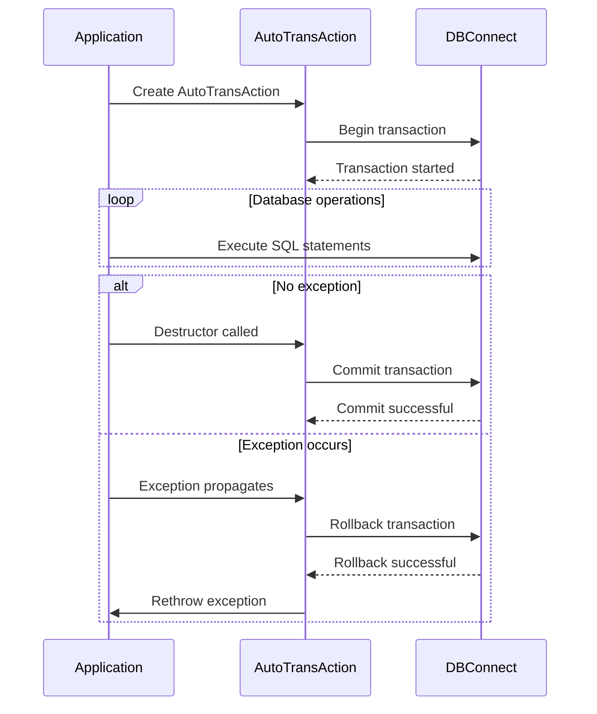
```mermaid
sequenceDiagram
participant Application
participant AutoTransAction
participant DBConnect
Application->>AutoTransAction : Create AutoTransAction
AutoTransAction->>DBConnect : Begin transaction
DBConnect-->>AutoTransAction : Transaction started
loop Database operations
Application->>DBConnect : Execute SQL statements
end
alt No exception
Application->>AutoTransAction : Destructor called
AutoTransAction->>DBConnect : Commit transaction
DBConnect-->>AutoTransAction : Commit successful
else Exception occurs
Application->>AutoTransAction : Exception propagates
AutoTransAction->>DBConnect : Rollback transaction
DBConnect-->>AutoTransAction : Rollback successful
AutoTransAction->>Application : Rethrow exception
end
```

**Diagram sources**
- [AutoTransAction.h](file://hikyuu_cpp/hikyuu/utilities/db_connect/AutoTransAction.h#L1-L55)

**Section sources**
- [DBConnectBase.h](file://hikyuu_cpp/hikyuu/utilities/db_connect/DBConnectBase.h#L47-L53)
- [AutoTransAction.h](file://hikyuu_cpp/hikyuu/utilities/db_connect/AutoTransAction.h#L1-L55)

## Statement Execution and Result Processing

### SQL Statement Interface

The `SQLStatementBase` class provides a unified interface for preparing and executing SQL statements across different database backends. This abstract base class defines the common operations for SQL statement execution, including parameter binding, result retrieval, and statement execution.

The interface supports parameterized queries through the `bind()` methods, which allow values to be bound to placeholders in the SQL statement. This approach prevents SQL injection attacks and improves performance by enabling statement reuse.

The result set from a query can be processed using the `moveNext()` method to iterate through rows, and the `getColumn()` methods to retrieve column values of various data types (integers, floating-point numbers, strings, dates, etc.).

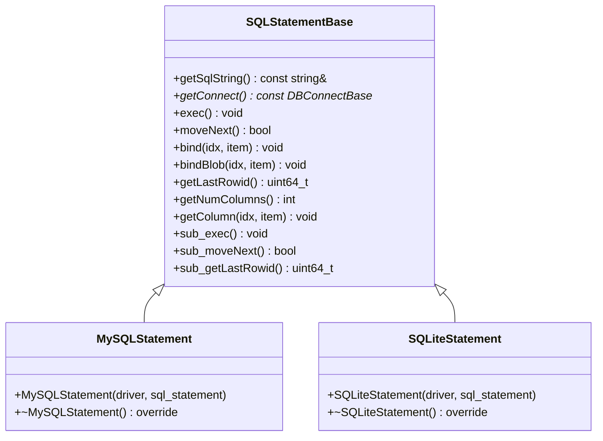
```mermaid
classDiagram
class SQLStatementBase {
+getSqlString() const string&
+getConnect() const DBConnectBase*
+exec() void
+moveNext() bool
+bind(idx, item) void
+bindBlob(idx, item) void
+getLastRowid() uint64_t
+getNumColumns() int
+getColumn(idx, item) void
+sub_exec() void
+sub_moveNext() bool
+sub_getLastRowid() uint64_t
}
class MySQLStatement {
+MySQLStatement(driver, sql_statement)
+~MySQLStatement() override
}
class SQLiteStatement {
+SQLiteStatement(driver, sql_statement)
+~SQLiteStatement() override
}
SQLStatementBase <|-- MySQLStatement
SQLStatementBase <|-- SQLiteStatement
```

**Diagram sources**
- [SQLStatementBase.h](file://hikyuu_cpp/hikyuu/utilities/db_connect/SQLStatementBase.h#L37-L306)
- [MySQLStatement.h](file://hikyuu_cpp/hikyuu/utilities/db_connect/mysql/MySQLStatement.h)
- [SQLiteStatement.h](file://hikyuu_cpp/hikyuu/utilities/db_connect/sqlite/SQLiteStatement.h)

### Result Set Handling

The database layer provides several methods for handling query results. For simple queries that return a single value, the `queryInt()` and `queryNumber()` template methods can be used to directly retrieve the result.

For queries that return multiple rows, the framework provides the `batchLoad()` method, which populates a container (such as a vector) with the query results. This method works in conjunction with the table binding macros to automatically map database rows to C++ objects.

The `SQLResultSet` class provides a more sophisticated approach to result set processing, offering a paginated interface to large result sets. This class implements lazy loading, where pages of results are loaded on-demand as the result set is iterated, reducing memory usage for large queries.

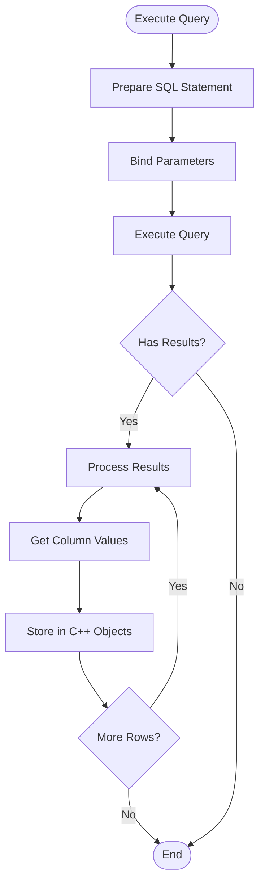
```mermaid
flowchart TD
Start([Execute Query]) --> PrepareStatement["Prepare SQL Statement"]
PrepareStatement --> BindParameters["Bind Parameters"]
BindParameters --> ExecuteQuery["Execute Query"]
ExecuteQuery --> HasResults{"Has Results?"}
HasResults --> |Yes| ProcessResults["Process Results"]
ProcessResults --> GetColumn["Get Column Values"]
GetColumn --> StoreData["Store in C++ Objects"]
StoreData --> MoreRows{"More Rows?"}
MoreRows --> |Yes| ProcessResults
MoreRows --> |No| End([End])
HasResults --> |No| End
```

**Diagram sources**
- [DBConnectBase.h](file://hikyuu_cpp/hikyuu/utilities/db_connect/DBConnectBase.h#L254-L264)
- [SQLResultSet.h](file://hikyuu_cpp/hikyuu/utilities/db_connect/SQLResultSet.h#L27-L248)

**Section sources**
- [SQLStatementBase.h](file://hikyuu_cpp/hikyuu/utilities/db_connect/SQLStatementBase.h#L54-L130)
- [DBConnectBase.h](file://hikyuu_cpp/hikyuu/utilities/db_connect/DBConnectBase.h#L254-L264)
- [SQLResultSet.h](file://hikyuu_cpp/hikyuu/utilities/db_connect/SQLResultSet.h#L27-L248)

## Database Schema Management

### Table Operations

The database connectivity layer provides methods for managing database tables and their structure. The `tableExist()` method checks whether a specified table exists in the database, which is useful for conditional table creation or schema migrations.

The `exec()` method allows execution of DDL (Data Definition Language) statements for creating, altering, or dropping tables. This method returns the number of affected rows, which can be used to verify the success of schema modification operations.

For tables with auto-incrementing primary keys, the `resetAutoIncrement()` method can be used to reset the auto-increment counter, typically after clearing all rows from a table.

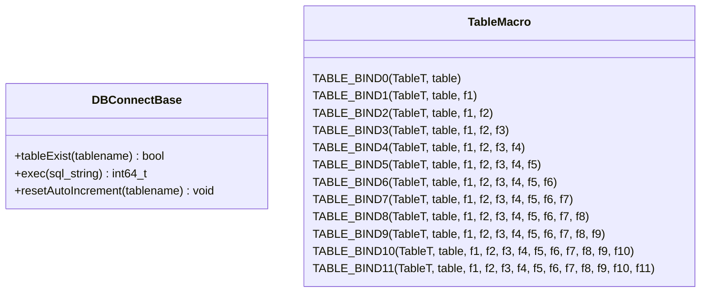
```mermaid
classDiagram
class DBConnectBase {
+tableExist(tablename) bool
+exec(sql_string) int64_t
+resetAutoIncrement(tablename) void
}
class TableMacro {
TABLE_BIND0(TableT, table)
TABLE_BIND1(TableT, table, f1)
TABLE_BIND2(TableT, table, f1, f2)
TABLE_BIND3(TableT, table, f1, f2, f3)
TABLE_BIND4(TableT, table, f1, f2, f3, f4)
TABLE_BIND5(TableT, table, f1, f2, f3, f4, f5)
TABLE_BIND6(TableT, table, f1, f2, f3, f4, f5, f6)
TABLE_BIND7(TableT, table, f1, f2, f3, f4, f5, f6, f7)
TABLE_BIND8(TableT, table, f1, f2, f3, f4, f5, f6, f7, f8)
TABLE_BIND9(TableT, table, f1, f2, f3, f4, f5, f6, f7, f8, f9)
TABLE_BIND10(TableT, table, f1, f2, f3, f4, f5, f6, f7, f8, f9, f10)
TABLE_BIND11(TableT, table, f1, f2, f3, f4, f5, f6, f7, f8, f9, f10, f11)
}
```

**Diagram sources**
- [DBConnectBase.h](file://hikyuu_cpp/hikyuu/utilities/db_connect/DBConnectBase.h#L61-L69)
- [TableMacro.h](file://hikyuu_cpp/hikyuu/utilities/db_connect/TableMacro.h#L1-L800)

### Object-Relational Mapping with Table Macros

The Hikyuu framework provides a powerful object-relational mapping system through a series of `TABLE_BIND` macros. These macros generate the necessary code to map C++ classes to database tables, enabling developers to work with database records as regular C++ objects.

The `TABLE_BIND` macros come in variants from `TABLE_BIND0` to `TABLE_BIND11`, supporting classes with 0 to 11 fields. Each macro generates methods for saving, loading, updating, and deleting records, as well as SQL statement generation for these operations.

When a class uses one of these macros, it gains methods such as `save()`, `load()`, `update()`, and `remove()` that automatically generate and execute the appropriate SQL statements. The framework also provides batch operations like `batchSave()`, `batchLoad()`, and `batchRemove()` for efficient processing of multiple records.

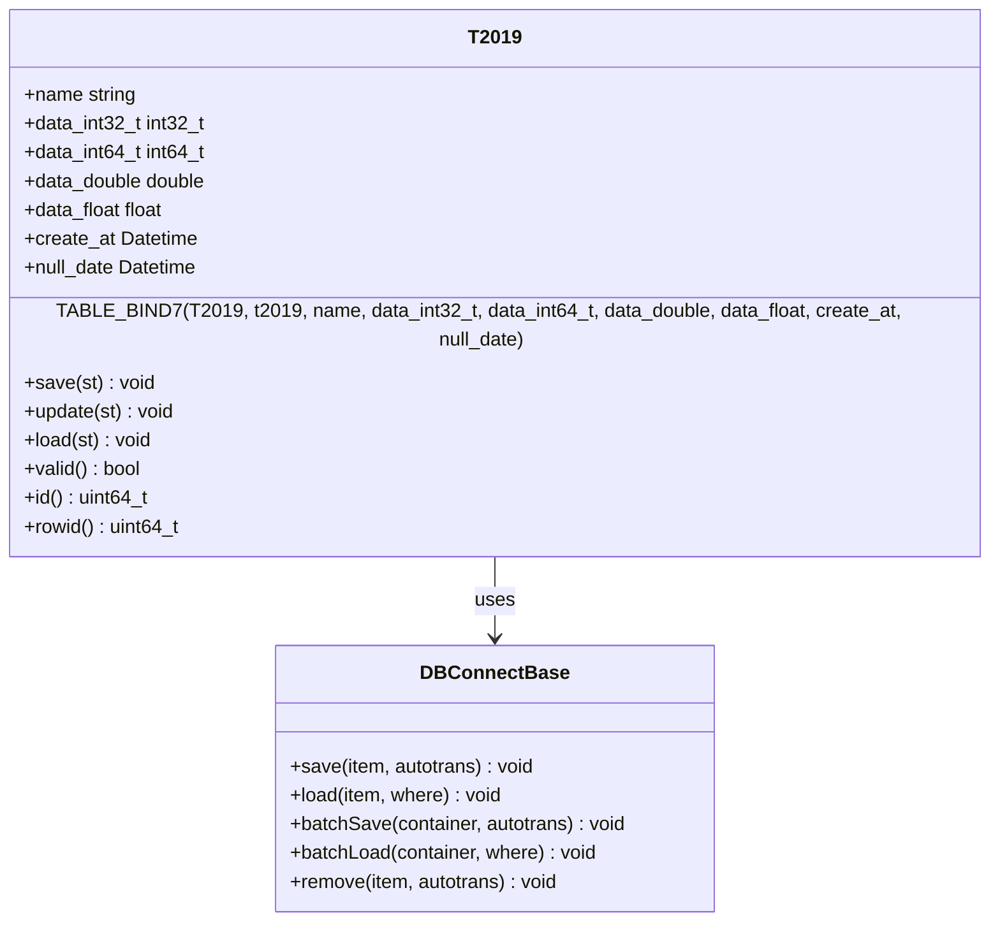
```mermaid
classDiagram
class T2019 {
TABLE_BIND7(T2019, t2019, name, data_int32_t, data_int64_t, data_double, data_float, create_at, null_date)
+name string
+data_int32_t int32_t
+data_int64_t int64_t
+data_double double
+data_float float
+create_at Datetime
+null_date Datetime
+save(st) void
+update(st) void
+load(st) void
+valid() bool
+id() uint64_t
+rowid() uint64_t
}
class DBConnectBase {
+save(item, autotrans) void
+load(item, where) void
+batchSave(container, autotrans) void
+batchLoad(container, where) void
+remove(item, autotrans) void
}
T2019 --> DBConnectBase : uses
```

**Diagram sources**
- [TableMacro.h](file://hikyuu_cpp/hikyuu/utilities/db_connect/TableMacro.h#L1-L800)
- [test_sqlite.cpp](file://hikyuu_cpp/unit_test/hikyuu/utilities/db_connect/test_sqlite.cpp#L46-L69)

**Section sources**
- [TableMacro.h](file://hikyuu_cpp/hikyuu/utilities/db_connect/TableMacro.h#L1-L800)
- [DBConnectBase.h](file://hikyuu_cpp/hikyuu/utilities/db_connect/DBConnectBase.h#L104-L247)

## Dynamic Query Building with DBCondition

### DBCondition Class

The `DBCondition` class provides a type-safe, composable interface for building dynamic SQL WHERE clauses. This class allows developers to construct complex query conditions programmatically without string concatenation, reducing the risk of SQL injection and syntax errors.

The class supports logical operations through operator overloading: the `&` operator for AND conditions and the `|` operator for OR conditions. It also provides methods for adding ORDER BY and LIMIT clauses to queries.

The `Field` struct is used in conjunction with `DBCondition` to represent database columns. It provides methods for common operations like equality, inequality, range comparisons, and pattern matching (LIKE). Specialized methods like `in()` and `not_in()` support IN and NOT IN clauses with vector parameters.

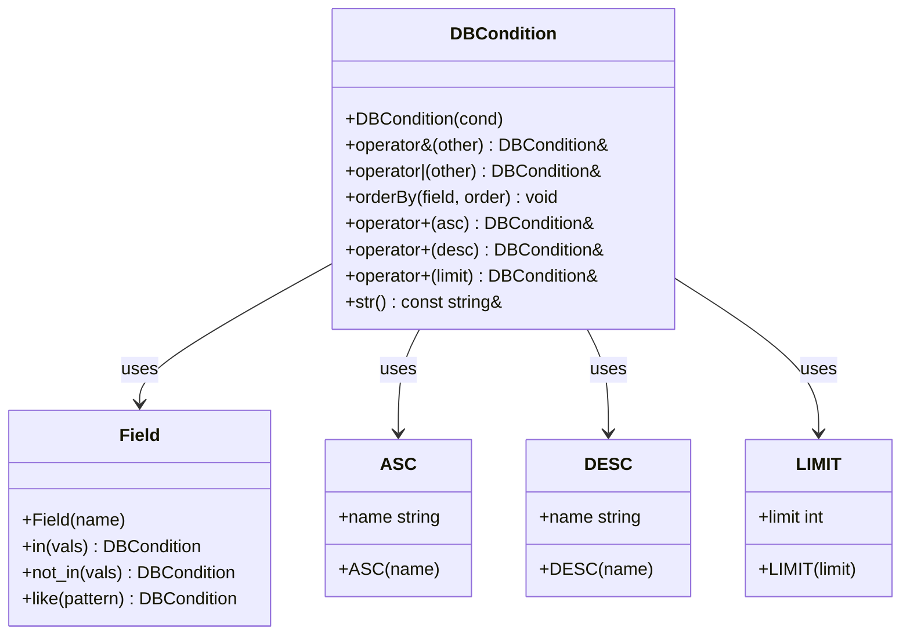
```mermaid
classDiagram
class DBCondition {
+DBCondition(cond)
+operator&(other) DBCondition&
+operator|(other) DBCondition&
+orderBy(field, order) void
+operator+(asc) DBCondition&
+operator+(desc) DBCondition&
+operator+(limit) DBCondition&
+str() const string&
}
class Field {
+Field(name)
+in(vals) DBCondition
+not_in(vals) DBCondition
+like(pattern) DBCondition
}
class ASC {
+ASC(name)
+name string
}
class DESC {
+DESC(name)
+name string
}
class LIMIT {
+LIMIT(limit)
+limit int
}
DBCondition --> Field : uses
DBCondition --> ASC : uses
DBCondition --> DESC : uses
DBCondition --> LIMIT : uses
```

**Diagram sources**
- [DBCondition.h](file://hikyuu_cpp/hikyuu/utilities/db_connect/DBCondition.h#L41-L252)

### Query Construction Examples

The `DBCondition` class enables the construction of complex queries through method chaining and operator overloading. Conditions can be combined using the `&` (AND) and `|` (OR) operators, and ordering and limiting can be added using the `+` operator with `ASC`, `DESC`, and `LIMIT` objects.

For example, to find all records where the name is "Davis" and the age is greater than 18, ordered by age in descending order, with a limit of 10 results:
```cpp
Field name("name");
Field age("age");
DBCondition cond = (name == "Davis") & (age > 18) + DESC("age") + LIMIT(10);
```

The resulting condition can then be used with the `query()` or `batchLoad()` methods to retrieve the matching records.

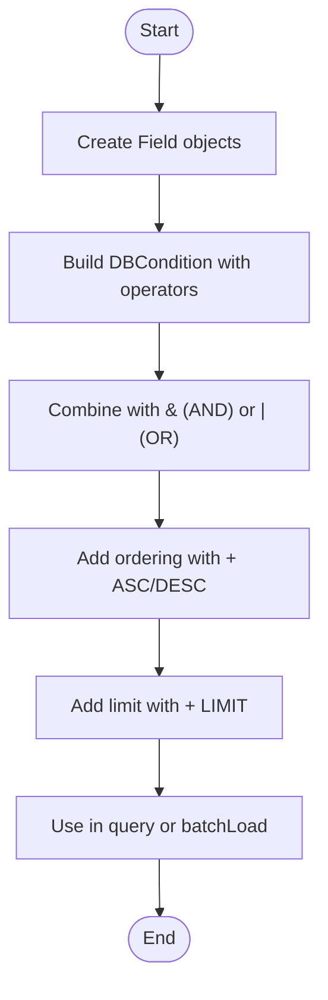
```mermaid
flowchart TD
Start([Start]) --> CreateField["Create Field objects"]
CreateField --> BuildCondition["Build DBCondition with operators"]
BuildCondition --> CombineConditions["Combine with & (AND) or | (OR)"]
CombineConditions --> AddOrdering["Add ordering with + ASC/DESC"]
AddOrdering --> AddLimit["Add limit with + LIMIT"]
AddLimit --> UseCondition["Use in query or batchLoad"]
UseCondition --> End([End])
```

**Diagram sources**
- [DBCondition.h](file://hikyuu_cpp/hikyuu/utilities/db_connect/DBCondition.h#L41-L252)

**Section sources**
- [DBCondition.h](file://hikyuu_cpp/hikyuu/utilities/db_connect/DBCondition.h#L41-L252)

## Result Set Processing with SQLResultSet

### SQLResultSet Class

The `SQLResultSet` class provides a paginated interface to database query results, enabling efficient processing of large datasets without loading all data into memory at once. This class implements lazy loading, where pages of results are loaded on-demand as the result set is iterated.

The class is templated on the result type and page size, allowing customization of the data structure and the number of records loaded per page. It provides standard container-like interface with `begin()`, `end()`, `size()`, and `empty()` methods, as well as random access through `operator[]` and `at()`.

The `SQLResultSet` class works in conjunction with the table binding macros, automatically mapping database rows to the specified C++ type. It also supports custom WHERE clauses, ORDER BY, and LIMIT clauses through the `DBCondition` class.

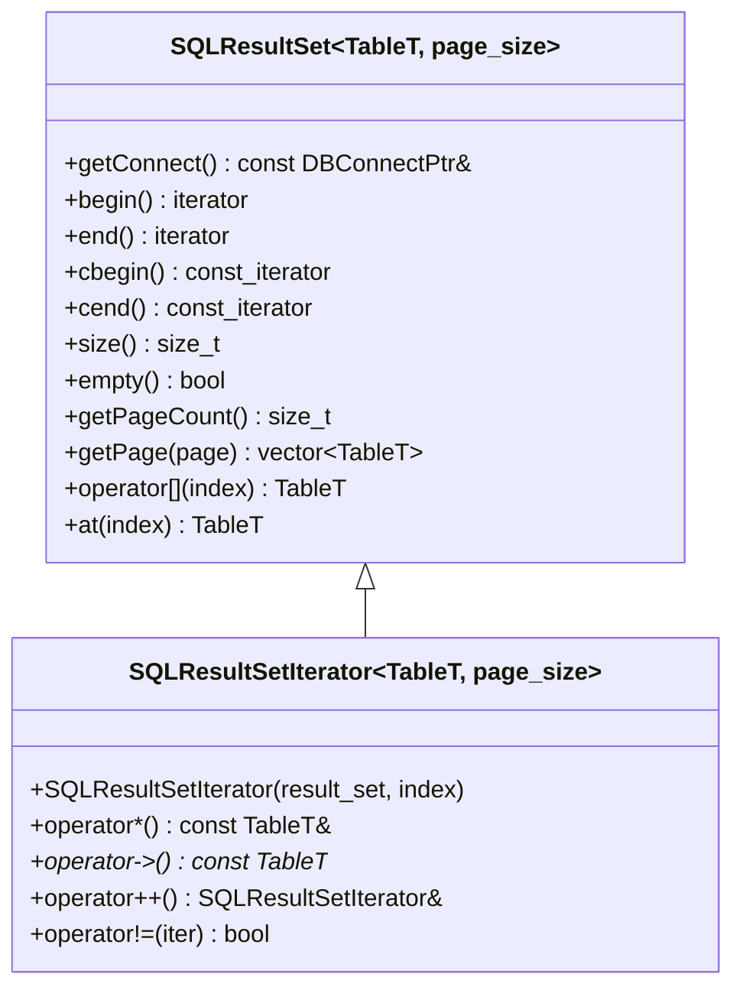
```mermaid
classDiagram
class SQLResultSet~TableT, page_size~ {
+getConnect() const DBConnectPtr&
+begin() iterator
+end() iterator
+cbegin() const_iterator
+cend() const_iterator
+size() size_t
+empty() bool
+getPageCount() size_t
+getPage(page) vector~TableT~
+operator[](index) TableT
+at(index) TableT
}
class SQLResultSetIterator~TableT, page_size~ {
+SQLResultSetIterator(result_set, index)
+operator*() const TableT&
+operator->() const TableT*
+operator++() SQLResultSetIterator&
+operator!=(iter) bool
}
SQLResultSet <|-- SQLResultSetIterator
```

**Diagram sources**
- [SQLResultSet.h](file://hikyuu_cpp/hikyuu/utilities/db_connect/SQLResultSet.h#L27-L248)

### Iteration and Pagination

The `SQLResultSet` class supports both iterator-based and index-based access to query results. The iterator interface allows for sequential processing of results using range-based for loops or STL algorithms.

When iterating through a result set, pages of data are loaded on-demand from the database. The page size is configurable through the template parameter, allowing optimization based on memory constraints and access patterns.

For random access, the `operator[]` and `at()` methods provide direct access to records by index. These methods handle the pagination transparently, loading the appropriate page when necessary.

The class also provides methods for retrieving specific pages of results with `getPage(page)`, which returns all records in the specified page as a vector.

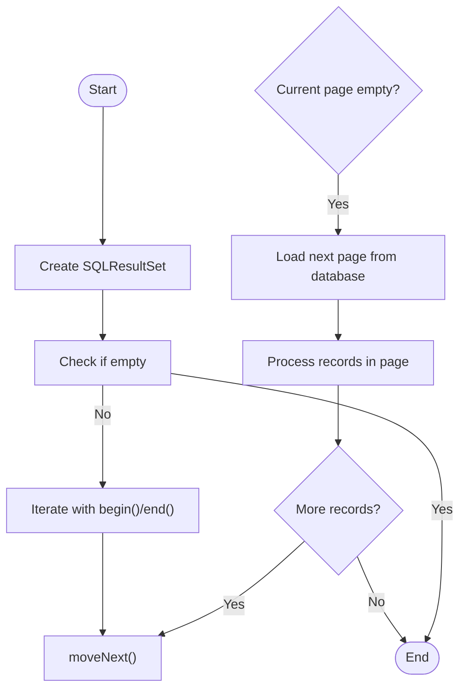
```mermaid
flowchart TD
Start([Start]) --> CreateResultSet["Create SQLResultSet"]
CreateResultSet --> CheckEmpty["Check if empty"]
CheckEmpty --> |No| Iterate["Iterate with begin()/end()"]
Iterate --> MoveNext["moveNext()"]
MoveEmptyPage{"Current page empty?"}
MoveEmptyPage --> |Yes| LoadPage["Load next page from database"]
LoadPage --> ProcessRecords["Process records in page"]
ProcessRecords --> MoreRecords{"More records?"}
MoreRecords --> |Yes| MoveNext
MoreRecords --> |No| End([End])
CheckEmpty --> |Yes| End
```

**Diagram sources**
- [SQLResultSet.h](file://hikyuu_cpp/hikyuu/utilities/db_connect/SQLResultSet.h#L27-L248)

**Section sources**
- [SQLResultSet.h](file://hikyuu_cpp/hikyuu/utilities/db_connect/SQLResultSet.h#L27-L248)

## Database Upgrade System

### Schema Migration Management

The Hikyuu framework includes a comprehensive database upgrade system for managing schema migrations and version control. This system is implemented in the `DBUpgrade` function, which handles both database creation and incremental upgrades from older versions.

The upgrade system uses a version table to track the current database schema version. When a database is opened, the system checks the current version and applies any necessary upgrade scripts to bring the database to the current version.

Upgrade scripts are stored as SQL files in the `sqlite_upgrade` and `mysql_upgrade` directories, named with sequential numbers (e.g., `0001.sql`, `0002.sql`). Each script contains the SQL statements needed to upgrade from the previous version to the next version.

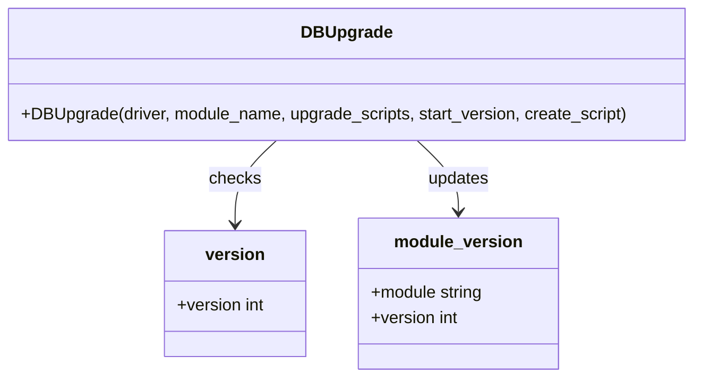
```mermaid
classDiagram
class DBUpgrade {
+DBUpgrade(driver, module_name, upgrade_scripts, start_version, create_script)
}
class version {
+version int
}
class module_version {
+module string
+version int
}
DBUpgrade --> version : checks
DBUpgrade --> module_version : updates
```

**Diagram sources**
- [DBUpgrade.h](file://hikyuu_cpp/hikyuu/utilities/db_connect/DBUpgrade.h#L1-L28)
- [0001.sql](file://hikyuu/data/sqlite_upgrade/0001.sql)
- [0001.sql](file://hikyuu/data/mysql_upgrade/0001.sql)

### Upgrade Process

The database upgrade process follows a systematic approach to ensure data integrity and compatibility. When a database connection is established, the system performs the following steps:

1. Check if the database exists and is accessible
2. Determine the current schema version by querying the version table
3. If the database doesn't exist and a creation script is provided, create the database with the initial schema
4. Identify the upgrade scripts needed to reach the current version
5. Execute the upgrade scripts in sequence
6. Update the version table to reflect the new schema version

The system is designed to handle partial upgrades gracefully. If an upgrade fails partway through, the transaction ensures that no changes are committed, preserving the previous schema version.

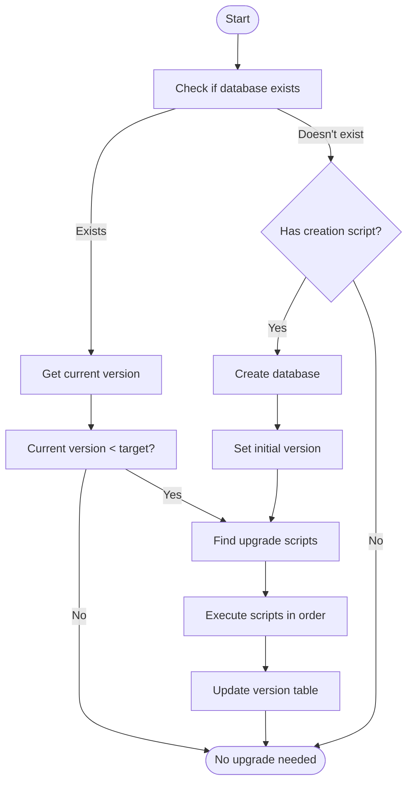
```mermaid
flowchart TD
Start([Start]) --> CheckDatabase["Check if database exists"]
CheckDatabase --> |Exists| GetVersion["Get current version"]
GetVersion --> CheckVersion["Current version < target?"]
CheckVersion --> |No| End([No upgrade needed])
CheckVersion --> |Yes| FindScripts["Find upgrade scripts"]
FindScripts --> ExecuteScripts["Execute scripts in order"]
ExecuteScripts --> UpdateVersion["Update version table"]
UpdateVersion --> End
CheckDatabase --> |Doesn't exist| HasCreateScript{"Has creation script?"}
HasCreateScript --> |Yes| CreateDatabase["Create database"]
CreateDatabase --> SetVersion["Set initial version"]
SetVersion --> FindScripts
HasCreateScript --> |No| End
```

**Diagram sources**
- [DBUpgrade.cpp](file://hikyuu_cpp/hikyuu/utilities/db_connect/DBUpgrade.cpp#L1-L144)

**Section sources**
- [DBUpgrade.h](file://hikyuu_cpp/hikyuu/utilities/db_connect/DBUpgrade.h#L1-L28)
- [DBUpgrade.cpp](file://hikyuu_cpp/hikyuu/utilities/db_connect/DBUpgrade.cpp#L1-L144)
- [0001.sql](file://hikyuu/data/sqlite_upgrade/0001.sql)
- [0001.sql](file://hikyuu/data/mysql_upgrade/0001.sql)

## Connection Pooling

### Resource Pool Implementation

The Hikyuu framework provides connection pooling through the `ResourcePool` and `DriverConnectPool` classes. These classes manage a pool of reusable database connections, improving performance by reducing the overhead of establishing new connections for each operation.

The `ResourcePool` template class provides a generic resource pooling mechanism that can be used for various types of resources, including database connections. It supports configuration of maximum pool size and maximum idle connections, with automatic cleanup of unused resources.

The `DriverConnectPool` class is a specialized connection pool for database drivers, providing thread-safe access to a pool of database connections. It uses a prototype pattern, where a prototype connection is used to create new connections as needed.

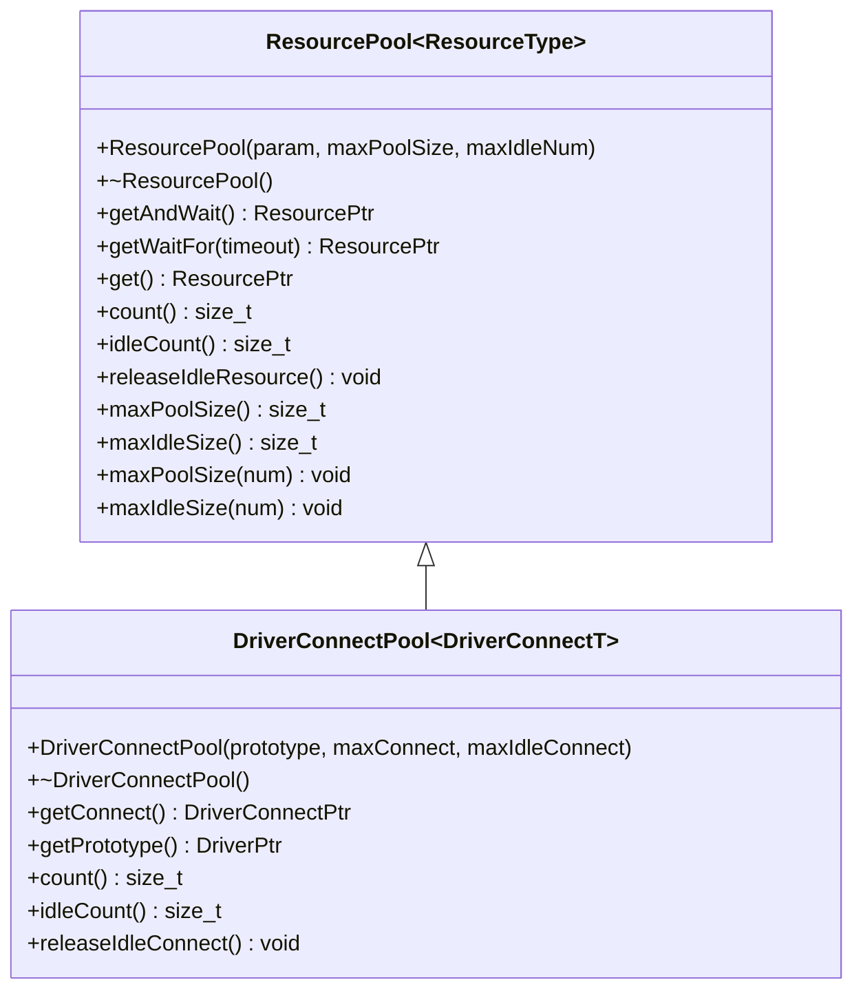
```mermaid
classDiagram
class ResourcePool~ResourceType~ {
+ResourcePool(param, maxPoolSize, maxIdleNum)
+~ResourcePool()
+getAndWait() ResourcePtr
+getWaitFor(timeout) ResourcePtr
+get() ResourcePtr
+count() size_t
+idleCount() size_t
+releaseIdleResource() void
+maxPoolSize() size_t
+maxIdleSize() size_t
+maxPoolSize(num) void
+maxIdleSize(num) void
}
class DriverConnectPool~DriverConnectT~ {
+DriverConnectPool(prototype, maxConnect, maxIdleConnect)
+~DriverConnectPool()
+getConnect() DriverConnectPtr
+getPrototype() DriverPtr
+count() size_t
+idleCount() size_t
+releaseIdleConnect() void
}
ResourcePool <|-- DriverConnectPool
```

**Diagram sources**
- [ResourcePool.h](file://hikyuu_cpp/hikyuu/utilities/ResourcePool.h#L1-L61)
- [DriverConnectPool.h](file://hikyuu_cpp/hikyuu/data_driver/DriverConnectPool.h#L1-L45)

### Connection Pool Usage

Connection pooling is implemented using a RAII (Resource Acquisition Is Initialization) pattern, where connections are automatically returned to the pool when they go out of scope. The pool returns a smart pointer (`shared_ptr`) with a custom deleter that returns the connection to the pool instead of deleting it.

When a connection is requested from the pool, it first checks for available idle connections. If none are available and the maximum pool size has not been reached, a new connection is created. If the maximum pool size has been reached, the request blocks until a connection becomes available.

This approach ensures efficient resource utilization while preventing resource exhaustion in high-concurrency scenarios.

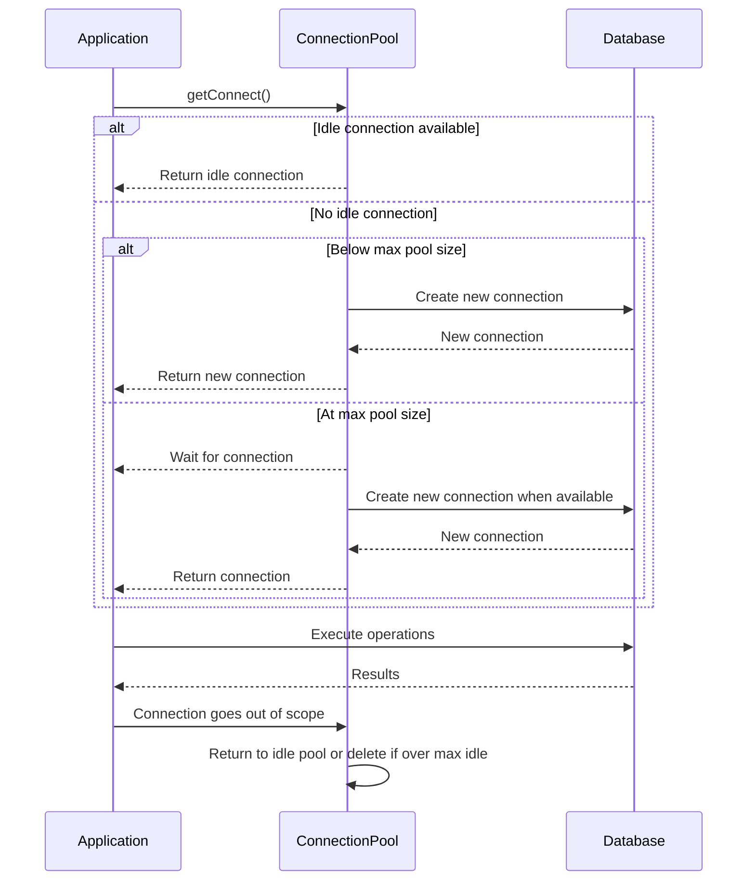
```mermaid
sequenceDiagram
participant Application
participant ConnectionPool
participant Database
Application->>ConnectionPool : getConnect()
alt Idle connection available
ConnectionPool-->>Application : Return idle connection
else No idle connection
alt Below max pool size
ConnectionPool->>Database : Create new connection
Database-->>ConnectionPool : New connection
ConnectionPool-->>Application : Return new connection
else At max pool size
ConnectionPool-->>Application : Wait for connection
ConnectionPool->>Database : Create new connection when available
Database-->>ConnectionPool : New connection
ConnectionPool-->>Application : Return connection
end
end
Application->>Database : Execute operations
Database-->>Application : Results
Application->>ConnectionPool : Connection goes out of scope
ConnectionPool->>ConnectionPool : Return to idle pool or delete if over max idle
```

**Diagram sources**
- [DriverConnectPool.h](file://hikyuu_cpp/hikyuu/data_driver/DriverConnectPool.h#L47-L88)
- [ResourcePool.h](file://hikyuu_cpp/hikyuu/utilities/ResourcePool.h#L198-L246)

**Section sources**
- [ResourcePool.h](file://hikyuu_cpp/hikyuu/utilities/ResourcePool.h#L1-L61)
- [DriverConnectPool.h](file://hikyuu_cpp/hikyuu/data_driver/DriverConnectPool.h#L1-L45)

## Practical Examples

### Market Data Retrieval

The following example demonstrates how to retrieve market data from the database using the Hikyuu connectivity layer:

```cpp
// Create database connection
Parameter param;
param.set<string>("db", "market_data.db");
auto con = std::make_shared<SQLiteConnect>(param);

// Define a data structure for market data
struct MarketData {
    TABLE_BIND4(MarketData, market_data, symbol, price, volume, timestamp)
    
    string symbol;
    double price;
    int64_t volume;
    Datetime timestamp;
};

// Query market data for a specific symbol
Field symbol("symbol");
DBCondition cond = symbol == "AAPL";
auto result = con->query<MarketData>(cond);

// Process the results
for (const auto& data : result) {
    cout << "Symbol: " << data.symbol 
         << ", Price: " << data.price 
         << ", Volume: " << data.volume 
         << ", Time: " << data.timestamp 
         << endl;
}
```

**Section sources**
- [test_sqlite.cpp](file://hikyuu_cpp/unit_test/hikyuu/utilities/db_connect/test_sqlite.cpp#L16-L192)
- [common_sqlite3.py](file://hikyuu/data/common_sqlite3.py#L1-L142)

### Backtesting Results Storage

The following example shows how to store backtesting results in the database:

```cpp
// Create database connection
Parameter param;
param.set<string>("db", "backtest.db");
auto con = std::make_shared<SQLiteConnect>(param);

// Define a data structure for backtesting results
struct BacktestResult {
    TABLE_BIND5(BacktestResult, backtest_results, strategy_name, start_date, end_date, total_return, sharpe_ratio)
    
    string strategy_name;
    Datetime start_date;
    Datetime end_date;
    double total_return;
    double sharpe_ratio;
};

// Create the table if it doesn't exist
if (!con->tableExist("backtest_results")) {
    con->exec(R"(
        CREATE TABLE backtest_results (
            id INTEGER PRIMARY KEY AUTOINCREMENT,
            strategy_name TEXT,
            start_date DATETIME,
            end_date DATETIME,
            total_return REAL,
            sharpe_ratio REAL
        )
    )");
}

// Save backtesting results
BacktestResult result;
result.strategy_name = "Moving Average Crossover";
result.start_date = Datetime(202001010000);
result.end_date = Datetime(202101010000);
result.total_return = 0.25;
result.sharpe_ratio = 1.8;

con->save(result);
```

**Section sources**
- [test_sqlite.cpp](file://hikyuu_cpp/unit_test/hikyuu/utilities/db_connect/test_sqlite.cpp#L16-L192)
- [common_sqlite3.py](file://hikyuu/data/common_sqlite3.py#L1-L142)

### Configuration Management

The following example demonstrates how to manage configuration data in the database:

```cpp
// Create database connection
Parameter param;
param.set<string>("db", "config.db");
auto con = std::make_shared<SQLiteConnect>(param);

// Define a data structure for configuration
struct ConfigItem {
    TABLE_BIND3(ConfigItem, config, key, value, description)
    
    string key;
    string value;
    string description;
};

// Load all configuration items
vector<ConfigItem> config_items;
con->batchLoad(config_items);

// Find a specific configuration item
ConfigItem db_host;
con->load(db_host, "key='database.host'");
if (db_host.valid()) {
    cout << "Database host: " << db_host.value << endl;
}

// Update a configuration item
if (db_host.valid()) {
    db_host.value = "new.database.server.com";
    con->save(db_host);
}

// Add a new configuration item
ConfigItem new_item;
new_item.key = "cache.size";
new_item.value = "1024";
new_item.description = "Cache size in MB";
con->save(new_item);
```

**Section sources**
- [test_sqlite.cpp](file://hikyuu_cpp/unit_test/hikyuu/utilities/db_connect/test_sqlite.cpp#L16-L192)
- [common_sqlite3.py](file://hikyuu/data/common_sqlite3.py#L1-L142)

## Error Handling and Performance

### Error Handling Patterns

The Hikyuu database layer uses a comprehensive error handling system based on C++ exceptions. Database operations that fail throw specific exception types that provide detailed information about the error.

The primary exception class is `SQLException`, which contains the SQL error code and message from the underlying database engine. This allows applications to handle database-specific errors appropriately.

For operations that involve transactions, the framework ensures that transactions are properly rolled back in case of exceptions, preventing data inconsistency. The `AutoTransAction` class automatically handles this by rolling back the transaction in its destructor if an exception has occurred.

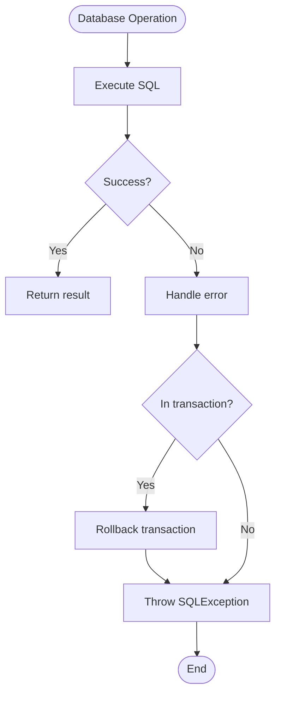
```mermaid
flowchart TD
Start([Database Operation]) --> Execute["Execute SQL"]
Execute --> Success{"Success?"}
Success --> |Yes| ReturnResult["Return result"]
Success --> |No| HandleError["Handle error"]
HandleError --> IsTransaction{"In transaction?"}
IsTransaction --> |Yes| Rollback["Rollback transaction"]
Rollback --> ThrowException["Throw SQLException"]
IsTransaction --> |No| ThrowException
ThrowException --> End([End])
```

**Diagram sources**
- [SQLException.h](file://hikyuu_cpp/hikyuu/utilities/db_connect/SQLException.h)
- [DBConnectBase.h](file://hikyuu_cpp/hikyuu/utilities/db_connect/DBConnectBase.h#L349-L384)

### Performance Optimization

The Hikyuu database connectivity layer includes several performance optimizations for high-volume data access:

1. **Connection Pooling**: Reusing database connections reduces the overhead of establishing new connections for each operation.

2. **Batch Operations**: The `batchSave()`, `batchLoad()`, and `batchRemove()` methods allow processing multiple records with a single database round-trip, significantly improving performance for bulk operations.

3. **Prepared Statements**: The `SQLStatement` interface uses prepared statements, which are compiled once and can be executed multiple times with different parameters, reducing parsing overhead.

4. **Lazy Loading**: The `SQLResultSet` class implements lazy loading of result pages, reducing memory usage for large queries.

5. **Index Usage**: The framework encourages the use of appropriate database indexes through the schema definition in upgrade scripts.

These optimizations make the database layer suitable for high-frequency trading applications and large-scale data processing tasks.

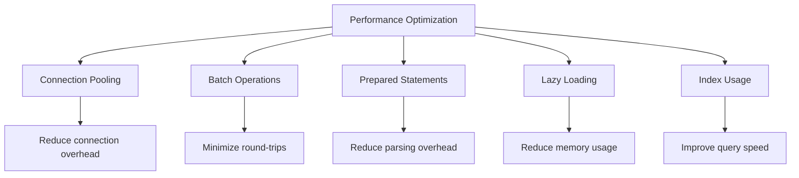
```mermaid
graph TD
A[Performance Optimization] --> B[Connection Pooling]
A --> C[Batch Operations]
A --> D[Prepared Statements]
A --> E[Lazy Loading]
A --> F[Index Usage]
B --> G[Reduce connection overhead]
C --> H[Minimize round-trips]
D --> I[Reduce parsing overhead]
E --> J[Reduce memory usage]
F --> K[Improve query speed]
```

**Diagram sources**
- [ResourcePool.h](file://hikyuu_cpp/hikyuu/utilities/ResourcePool.h#L1-L61)
- [DBConnectBase.h](file://hikyuu_cpp/hikyuu/utilities/db_connect/DBConnectBase.h#L388-L425)
- [SQLResultSet.h](file://hikyuu_cpp/hikyuu/utilities/db_connect/SQLResultSet.h#L27-L248)

**Section sources**
- [ResourcePool.h](file://hikyuu_cpp/hikyuu/utilities/ResourcePool.h#L1-L61)
- [DBConnectBase.h](file://hikyuu_cpp/hikyuu/utilities/db_connect/DBConnectBase.h#L112-L122)
- [SQLResultSet.h](file://hikyuu_cpp/hikyuu/utilities/db_connect/SQLResultSet.h#L27-L248)

## Conclusion

The Hikyuu database connectivity layer provides a comprehensive, high-performance interface for database operations with support for both MySQL and SQLite databases. The architecture is designed to balance ease of use with performance, offering both low-level SQL execution and high-level object-relational mapping capabilities.

Key features of the database layer include:
- Unified interface for MySQL and SQLite databases
- Robust transaction management with automatic rollback on exceptions
- Efficient statement execution with parameter binding
- Object-relational mapping through table binding macros
- Dynamic query building with the DBCondition class
- Paginated result set processing with SQLResultSet
- Automated schema migration and version management
- Connection pooling for improved performance
- Comprehensive error handling

The combination of these features makes the Hikyuu database layer well-suited for financial applications that require reliable, high-performance data storage and retrieval. The design emphasizes type safety, resource management, and performance optimization, enabling developers to build robust applications with confidence.