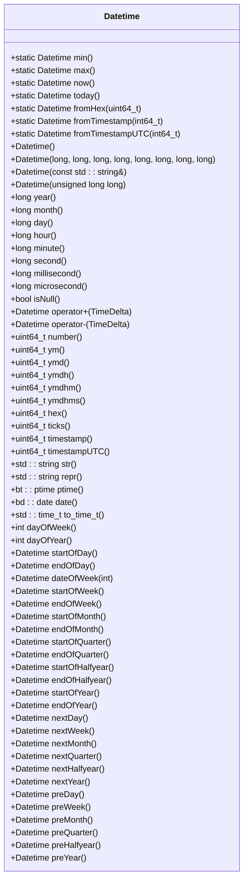
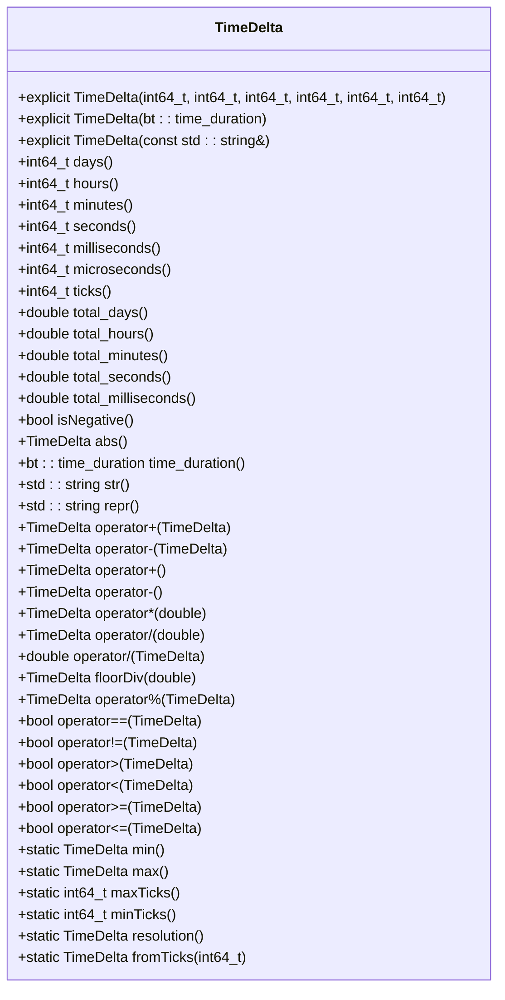
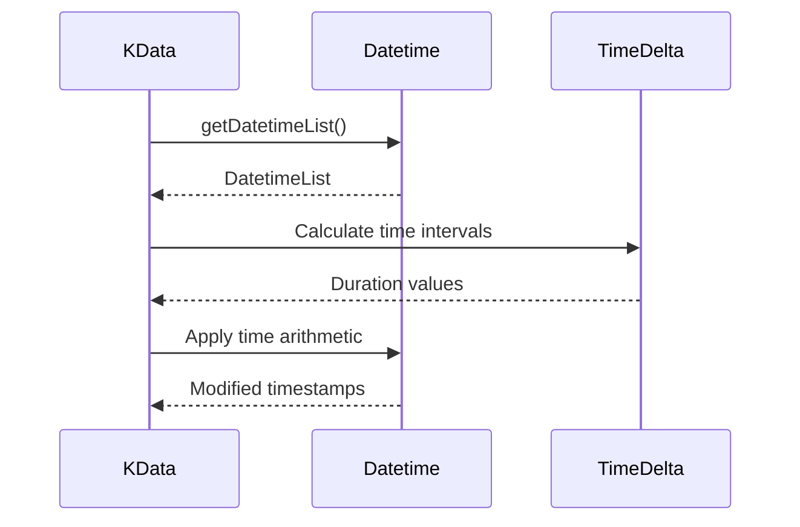
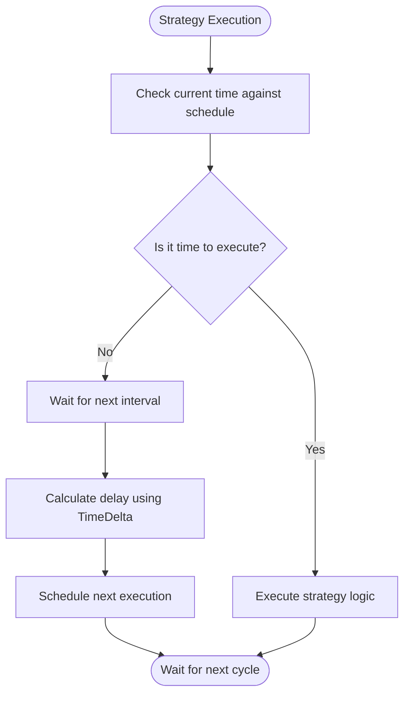
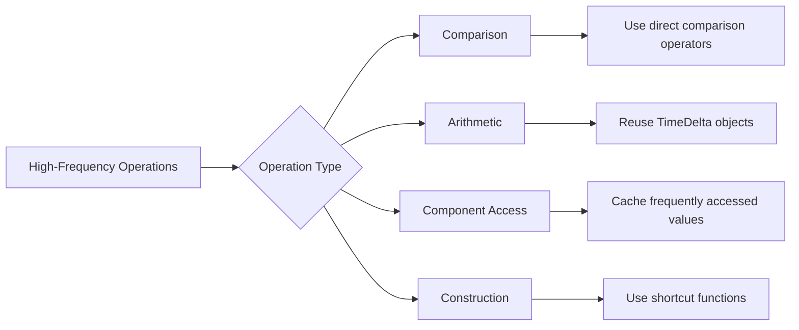

# Datetime Utilities

<cite>
**Referenced Files in This Document**   
- [Datetime.h](file://hikyuu_cpp/hikyuu/utilities/datetime/Datetime.h)
- [Datetime.cpp](file://hikyuu_cpp/hikyuu/utilities/datetime/Datetime.cpp)
- [TimeDelta.h](file://hikyuu_cpp/hikyuu/utilities/datetime/TimeDelta.h)
- [TimeDelta.cpp](file://hikyuu_cpp/hikyuu/utilities/datetime/TimeDelta.cpp)
- [_Datetime.cpp](file://hikyuu_pywrap/_Datetime.cpp)
- [_TimeDelta.cpp](file://hikyuu_pywrap/_TimeDelta.cpp)
- [test_Datetime.cpp](file://hikyuu_cpp/unit_test/hikyuu/utilities/datetime/test_Datetime.cpp)
- [test_TimeDelta.cpp](file://hikyuu_cpp/unit_test/hikyuu/utilities/datetime/test_TimeDelta.cpp)
- [Datetime_serialization.h](file://hikyuu_cpp/hikyuu/serialization/Datetime_serialization.h)
- [TimeDelta_serialization.h](file://hikyuu_cpp/hikyuu/serialization/TimeDelta_serialization.h)
</cite>

## Table of Contents
1. [Introduction](#introduction)
2. [Datetime Class](#datetime-class)
3. [TimeDelta Class](#timedelta-class)
4. [Integration with Framework](#integration-with-framework)
5. [Practical Examples](#practical-examples)
6. [Performance Considerations](#performance-considerations)
7. [Best Practices](#best-practices)
8. [Conclusion](#conclusion)

## Introduction
The Hikyuu datetime utilities provide a comprehensive system for representing and manipulating date and time values with microsecond precision. These utilities are essential for financial time-series analysis, backtesting, and strategy execution scheduling. The core components include the Datetime class for representing specific points in time and the TimeDelta class for representing time intervals and performing duration calculations. These classes are designed to work seamlessly across both C++ and Python contexts, providing consistent behavior and high performance for time-series data handling.

**Section sources**
- [Datetime.h](file://hikyuu_cpp/hikyuu/utilities/datetime/Datetime.h#L45-L311)
- [TimeDelta.h](file://hikyuu_cpp/hikyuu/utilities/datetime/TimeDelta.h#L36-L263)

## Datetime Class
The Datetime class represents a specific point in time with microsecond precision, ranging from January 1, 1400 to December 31, 9999. It provides comprehensive functionality for date and time manipulation, comparison, and formatting.

### Constructors
The Datetime class supports multiple construction methods:
- **Default constructor**: Creates a null Datetime object
- **Component constructor**: `Datetime(year, month, day, hour=0, minute=0, second=0, millisecond=0, microsecond=0)`
- **String constructor**: Supports formats like "2001-01-01", "20010101", "2001-01-01 18:00:00.12345"
- **Numeric constructor**: Supports formats like YYYYMMDDhhmm, YYYYMMDD
- **Static constructors**: `Datetime::min()`, `Datetime::max()`, `Datetime::now()`, `Datetime::today()`

### Properties and Methods
The Datetime class provides access to individual time components and various utility methods:



**Diagram sources**
- [Datetime.h](file://hikyuu_cpp/hikyuu/utilities/datetime/Datetime.h#L45-L311)

**Section sources**
- [Datetime.h](file://hikyuu_cpp/hikyuu/utilities/datetime/Datetime.h#L45-L311)
- [Datetime.cpp](file://hikyuu_cpp/hikyuu/utilities/datetime/Datetime.cpp#L1-L651)

## TimeDelta Class
The TimeDelta class represents a duration or time interval, enabling precise time arithmetic operations. It supports a wide range of time units from days to microseconds.

### Constructors
The TimeDelta class provides multiple ways to create time intervals:
- **Component constructor**: `TimeDelta(days=0, hours=0, minutes=0, seconds=0, milliseconds=0, microseconds=0)`
- **Ticks constructor**: `TimeDelta::fromTicks(ticks)` where ticks are microseconds
- **String constructor**: Parses strings like "-1 days, hh:mm:ss.000000"
- **Boost time_duration constructor**: `TimeDelta(bt::time_duration)`

### Properties and Methods
The TimeDelta class offers comprehensive functionality for duration manipulation and conversion:



**Diagram sources**
- [TimeDelta.h](file://hikyuu_cpp/hikyuu/utilities/datetime/TimeDelta.h#L36-L263)

**Section sources**
- [TimeDelta.h](file://hikyuu_cpp/hikyuu/utilities/datetime/TimeDelta.h#L36-L263)
- [TimeDelta.cpp](file://hikyuu_cpp/hikyuu/utilities/datetime/TimeDelta.cpp#L1-L433)

## Integration with Framework
The datetime utilities are deeply integrated into the Hikyuu framework for time-series data handling, backtesting timelines, and strategy execution scheduling.

### Time-Series Data Handling
The Datetime class is used extensively in KData structures to represent timestamps for financial data points. The getDatetimeList() method returns a DatetimeList containing all timestamps in a KData series, enabling time-based indexing and filtering.



**Diagram sources**
- [KData.h](file://hikyuu_cpp/hikyuu/KData.h#L42-L43)
- [Datetime.h](file://hikyuu_cpp/hikyuu/utilities/datetime/Datetime.h#L319-L327)

### Backtesting Timelines
The datetime utilities enable precise backtesting by providing methods to navigate through time periods. The startOfDay(), endOfDay(), startOfWeek(), endOfWeek(), and similar methods allow for period boundary detection, while nextDay(), nextWeek(), and related methods facilitate timeline progression.

### Strategy Execution Scheduling
The framework uses datetime utilities to schedule strategy execution at specific times or intervals. The TimeDelta class is particularly important for defining execution frequencies and delays.



**Diagram sources**
- [Strategy.cpp](file://hikyuu_cpp/hikyuu/strategy/Strategy.cpp#L227-L276)
- [TimeDelta.h](file://hikyuu_cpp/hikyuu/utilities/datetime/TimeDelta.h#L255-L256)

**Section sources**
- [Portfolio.cpp](file://hikyuu_cpp/hikyuu/trade_sys/portfolio/Portfolio.cpp#L295-L371)
- [ICycle.cpp](file://hikyuu_cpp/hikyuu/indicator/imp/ICycle.cpp#L63-L146)

## Practical Examples
This section provides practical examples demonstrating date parsing, time arithmetic, and duration calculations in both C++ and Python contexts.

### Date Parsing Examples
**C++ Example:**
```cpp
// From string
Datetime d1("2021-01-01 12:30:45.123456");
Datetime d2("20210101");
Datetime d3("2021-1-1");

// From numeric format
Datetime d4(202101011230LL);  // YYYYMMDDhhmm
Datetime d5(20210101LL);       // YYYYMMDD

// From components
Datetime d6(2021, 1, 1, 12, 30, 45, 123, 456);
```

**Python Example:**
```python
# From string
d1 = Datetime("2021-01-01 12:30:45.123456")
d2 = Datetime("20210101")
d3 = Datetime("2021-1-1")

# From numeric format
d4 = Datetime(202101011230)  # YYYYMMDDhhmm
d5 = Datetime(20210101)       # YYYYMMDD

# From Python datetime
from datetime import datetime
py_dt = datetime(2021, 1, 1, 12, 30, 45, 123456)
d6 = Datetime(py_dt)
```

### Time Arithmetic Examples
**C++ Example:**
```cpp
Datetime d(2021, 1, 1, 12, 0, 0);

// Add time intervals
Datetime d1 = d + Days(1);           // Next day
Datetime d2 = d + Hours(2);          // Two hours later
Datetime d3 = d + Minutes(30);       // Thirty minutes later
Datetime d4 = d - TimeDelta(0, 1);   // One hour earlier

// Calculate differences
TimeDelta diff = d1 - d;             // Duration between dates
```

**Python Example:**
```python
d = Datetime(2021, 1, 1, 12, 0, 0)

# Add time intervals
d1 = d + Days(1)           # Next day
d2 = d + Hours(2)          # Two hours later
d3 = d + Minutes(30)       # Thirty minutes later
d4 = d - TimeDelta(0, 1)   # One hour earlier

# Calculate differences
diff = d1 - d              # Duration between dates
```

### Duration Calculation Examples
**C++ Example:**
```cpp
// Create time deltas
TimeDelta td1(1, 2, 3, 4, 5, 6);  // 1 day, 2 hours, 3 minutes, etc.
TimeDelta td2 = Hours(24);        // 24 hours
TimeDelta td3 = Minutes(15);      // 15 minutes

// Arithmetic operations
TimeDelta sum = td1 + td2;
TimeDelta diff = td1 - td2;
TimeDelta scaled = td1 * 2.5;
TimeDelta divided = td1 / 2;

// Access components
int64_t days = td1.days();
int64_t hours = td1.hours();
int64_t total_seconds = td1.total_seconds();
```

**Python Example:**
```python
# Create time deltas
td1 = TimeDelta(1, 2, 3, 4, 5, 6)  # 1 day, 2 hours, 3 minutes, etc.
td2 = Hours(24)                     # 24 hours
td3 = Minutes(15)                   # 15 minutes

# Arithmetic operations
sum_td = td1 + td2
diff_td = td1 - td2
scaled_td = td1 * 2.5
divided_td = td1 / 2

# Access components
days = td1.days
hours = td1.hours
total_seconds = td1.total_seconds()
```

**Section sources**
- [_Datetime.cpp](file://hikyuu_pywrap/_Datetime.cpp#L1-L151)
- [_TimeDelta.cpp](file://hikyuu_pywrap/_TimeDelta.cpp#L1-L198)
- [test_Datetime.cpp](file://hikyuu_cpp/unit_test/hikyuu/utilities/datetime/test_Datetime.cpp#L1-L462)
- [test_TimeDelta.cpp](file://hikyuu_cpp/unit_test/hikyuu/utilities/datetime/test_TimeDelta.cpp#L1-L433)

## Performance Considerations
The datetime utilities are designed for high-frequency time operations with several performance optimizations.

### Memory Efficiency
The Datetime and TimeDelta classes use efficient internal representations based on Boost's date_time library, storing timestamps as 64-bit integers representing microseconds from a reference point. This compact representation minimizes memory usage and enables fast comparisons.

### Computational Efficiency
The classes are optimized for common operations:
- **Comparison operations**: Direct comparison of internal tick values
- **Arithmetic operations**: Efficient addition and subtraction of time intervals
- **Component access**: Cached values for frequently accessed properties

### High-Frequency Operation Best Practices
For applications requiring high-frequency time operations:
- Reuse Datetime and TimeDelta objects when possible
- Use the number() method for fast date comparisons when precision to the minute is sufficient
- Prefer TimeDelta arithmetic over repeated Datetime construction
- Use the provided shortcut functions (Days, Hours, Minutes, etc.) for common time intervals



**Diagram sources**
- [Datetime.h](file://hikyuu_cpp/hikyuu/utilities/datetime/Datetime.h#L169-L184)
- [TimeDelta.h](file://hikyuu_cpp/hikyuu/utilities/datetime/TimeDelta.h#L98-L121)

**Section sources**
- [Datetime.cpp](file://hikyuu_cpp/hikyuu/utilities/datetime/Datetime.cpp#L180-L193)
- [TimeDelta.cpp](file://hikyuu_cpp/hikyuu/utilities/datetime/TimeDelta.cpp#L98-L121)

## Best Practices
This section outlines best practices for using the datetime utilities effectively, particularly for handling timezone-aware computations.

### Timezone Handling
While the core Datetime class does not include timezone information, the framework provides utilities for timezone-aware computations:
- Use `Datetime::fromTimestampUTC()` and `Datetime::timestampUTC()` for UTC-based operations
- The `UTCOffset()` function provides the current system UTC offset
- For timezone conversions, convert to UTC timestamps and then to local time

### Error Handling
The datetime utilities follow consistent error handling patterns:
- Invalid date components throw std::out_of_range exceptions
- Null Datetime objects should be checked with isNull() before accessing components
- Division by zero in TimeDelta operations throws exceptions

### Serialization
Both classes support serialization for persistence and inter-process communication:
- Datetime serializes as a string representation
- TimeDelta serializes as a 64-bit integer (ticks)
- Both use Boost serialization framework

```mermaid
flowchart TD
A[Best Practices] --> B[Timezone Handling]
A --> C[Error Handling]
A --> D[Serialization]
A --> E[Memory Management]
B --> B1[Use UTC for storage]
B --> B2[Convert to local time for display]
B --> B3[Use UTCOffset() for conversions]
C --> C1[Check isNull() before access]
C --> C2[Handle std::out_of_range]
C --> C3[Validate inputs]
D --> D1[Use Boost serialization]
D --> D2[Store as string or ticks]
D --> D3[Persist across sessions]
E --> E1[Reuse objects]
E --> E2[Minimize constructions]
E --> E3[Use pools for frequent operations]
```

**Diagram sources**
- [Datetime_serialization.h](file://hikyuu_cpp/hikyuu/serialization/Datetime_serialization.h#L1-L41)
- [TimeDelta_serialization.h](file://hikyuu_cpp/hikyuu/serialization/TimeDelta_serialization.h#L1-L45)

**Section sources**
- [Datetime_serialization.h](file://hikyuu_cpp/hikyuu/serialization/Datetime_serialization.h#L1-L41)
- [TimeDelta_serialization.h](file://hikyuu_cpp/hikyuu/serialization/TimeDelta_serialization.h#L1-L45)
- [Datetime.h](file://hikyuu_cpp/hikyuu/utilities/datetime/Datetime.h#L156-L157)
- [TimeDelta.h](file://hikyuu_cpp/hikyuu/utilities/datetime/TimeDelta.h#L124-L126)

## Conclusion
The Hikyuu datetime utilities provide a robust and efficient system for date and time manipulation in financial applications. The Datetime and TimeDelta classes offer comprehensive functionality for representing points in time and time intervals, with microsecond precision and extensive arithmetic capabilities. These utilities are deeply integrated into the framework for time-series data handling, backtesting, and strategy execution, enabling precise temporal operations across both C++ and Python contexts. By following the best practices outlined in this documentation, developers can effectively leverage these tools for high-performance financial analysis and algorithmic trading applications.