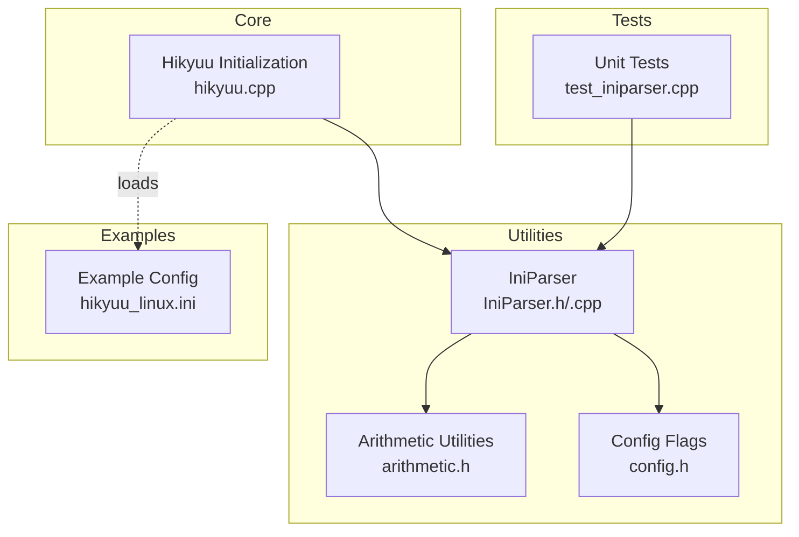
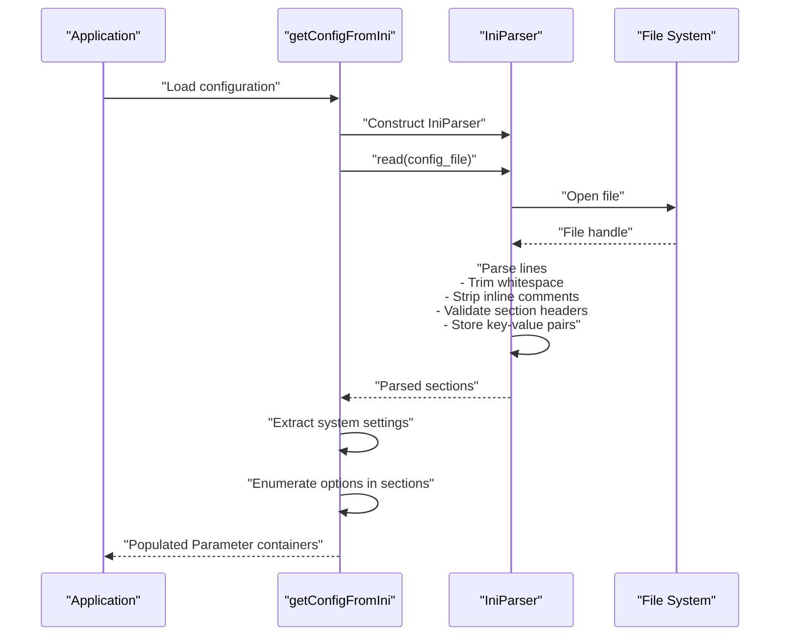
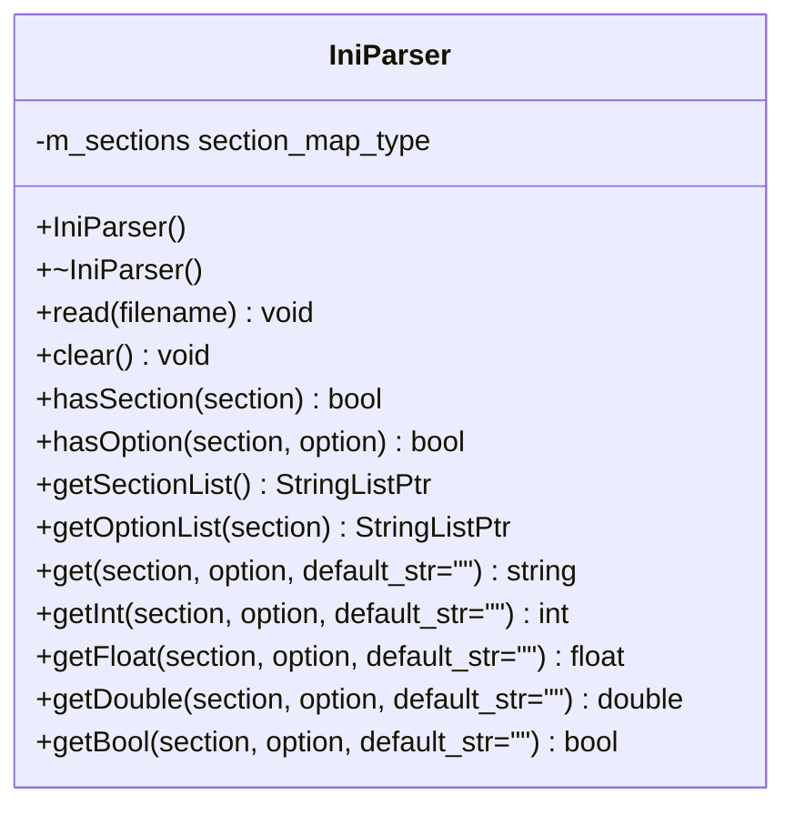
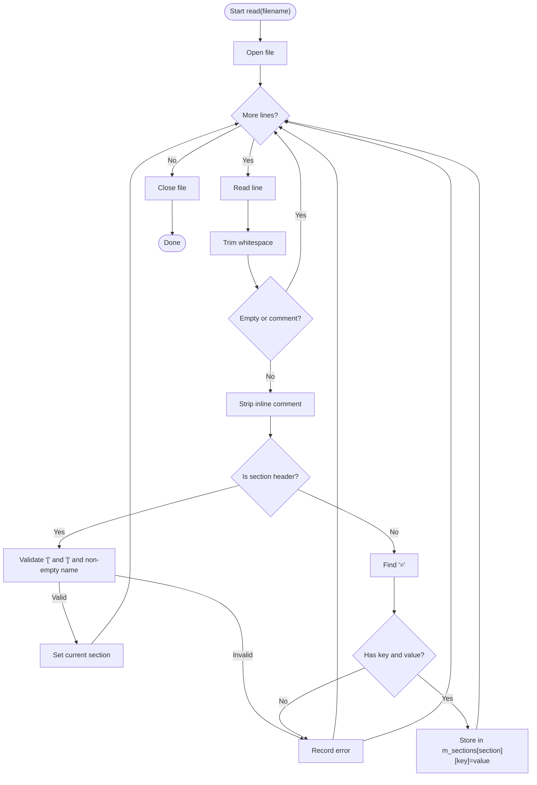
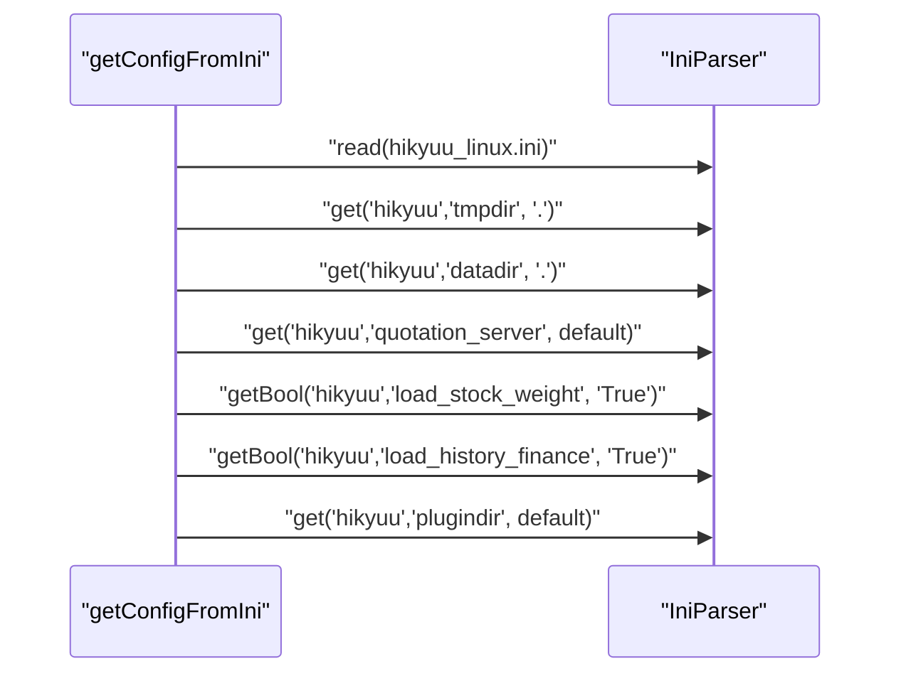
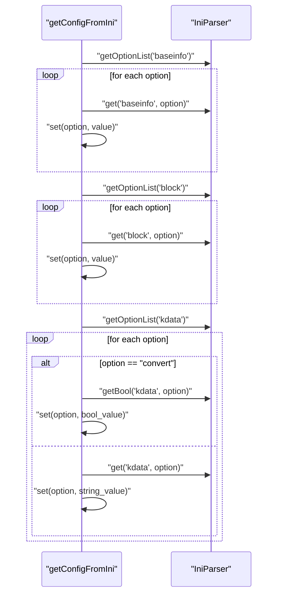
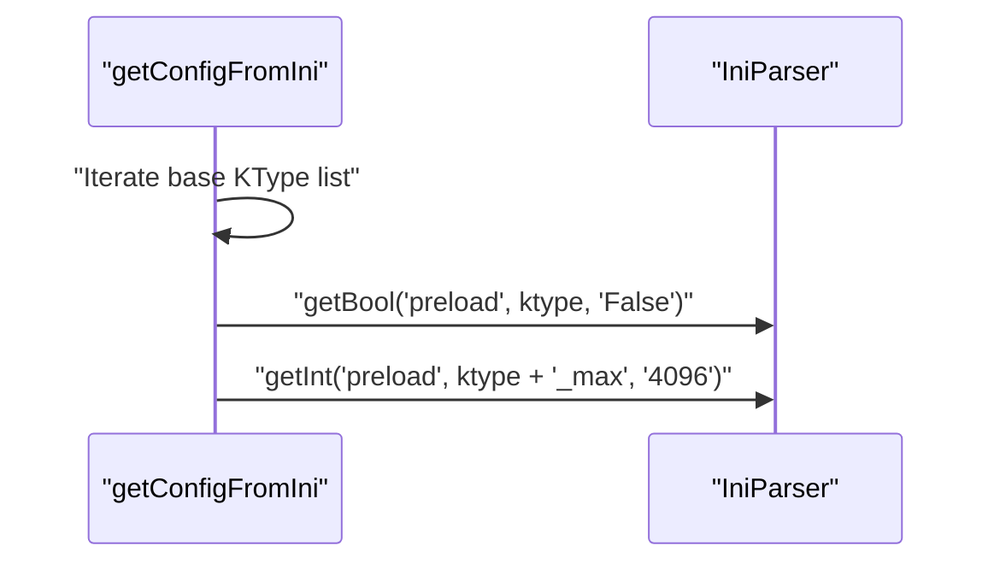
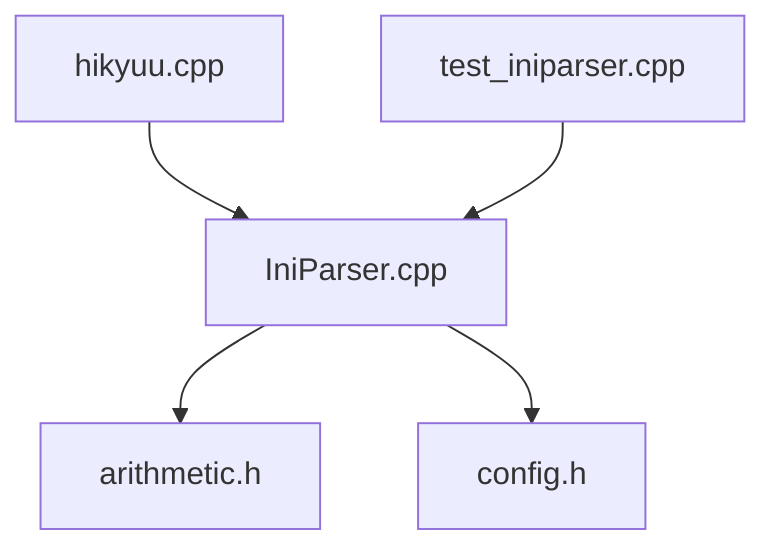

# INI Parser

<cite>
**Referenced Files in This Document**
- [IniParser.h](file://hikyuu_cpp/hikyuu/utilities/ini_parser/IniParser.h)
- [IniParser.cpp](file://hikyuu_cpp/hikyuu/utilities/ini_parser/IniParser.cpp)
- [config.h](file://hikyuu_cpp/hikyuu/utilities/config.h)
- [arithmetic.h](file://hikyuu_cpp/hikyuu/utilities/arithmetic.h)
- [hikyuu.cpp](file://hikyuu_cpp/hikyuu/hikyuu.cpp)
- [test_iniparser.cpp](file://hikyuu_cpp/unit_test/hikyuu/utilities/test_iniparser.cpp)
- [hikyuu_linux.ini](file://test_data/hikyuu_linux.ini)
</cite>

## Table of Contents
1. [Introduction](#introduction)
2. [Project Structure](#project-structure)
3. [Core Components](#core-components)
4. [Architecture Overview](#architecture-overview)
5. [Detailed Component Analysis](#detailed-component-analysis)
6. [Dependency Analysis](#dependency-analysis)
7. [Performance Considerations](#performance-considerations)
8. [Troubleshooting Guide](#troubleshooting-guide)
9. [Conclusion](#conclusion)
10. [Appendices](#appendices)

## Introduction
This document provides comprehensive API documentation for the INI file parser utility in Hikyuu. It focuses on the IniParser class interface for reading, writing, and modifying INI configuration files. It explains the parsing algorithm, error handling mechanisms, and the methods for accessing sections, keys, and values with type conversion. Practical examples demonstrate configuration loading for data sources, strategy parameters, and system settings. Thread-safety considerations, performance implications for large configuration files, and best practices for configuration management in both development and production environments are also addressed.

## Project Structure
The INI parser resides under the utilities module and integrates with the broader Hikyuu initialization pipeline. The primary files are:
- IniParser header and implementation define the public API and internal parsing logic.
- Arithmetic utilities support trimming and case conversions used during parsing.
- Configuration flags enable or disable the INI parser feature.
- The Hikyuu initialization routine demonstrates practical usage of IniParser to load system settings and data source configurations.
- Unit tests validate parsing behavior, error conditions, and type conversion semantics.

**Diagram sources**
- [IniParser.h](file://hikyuu_cpp/hikyuu/utilities/ini_parser/IniParser.h#L60-L105)
- [IniParser.cpp](file://hikyuu_cpp/hikyuu/utilities/ini_parser/IniParser.cpp#L56-L139)
- [arithmetic.h](file://hikyuu_cpp/hikyuu/utilities/arithmetic.h#L211-L231)
- [config.h](file://hikyuu_cpp/hikyuu/utilities/config.h#L22-L22)
- [hikyuu.cpp](file://hikyuu_cpp/hikyuu/hikyuu.cpp#L39-L92)
- [test_iniparser.cpp](file://hikyuu_cpp/unit_test/hikyuu/utilities/test_iniparser.cpp#L29-L86)
- [hikyuu_linux.ini](file://test_data/hikyuu_linux.ini#L1-L56)

**Section sources**
- [IniParser.h](file://hikyuu_cpp/hikyuu/utilities/ini_parser/IniParser.h#L60-L105)
- [IniParser.cpp](file://hikyuu_cpp/hikyuu/utilities/ini_parser/IniParser.cpp#L56-L139)
- [arithmetic.h](file://hikyuu_cpp/hikyuu/utilities/arithmetic.h#L211-L231)
- [config.h](file://hikyuu_cpp/hikyuu/utilities/config.h#L22-L22)
- [hikyuu.cpp](file://hikyuu_cpp/hikyuu/hikyuu.cpp#L39-L92)
- [test_iniparser.cpp](file://hikyuu_cpp/unit_test/hikyuu/utilities/test_iniparser.cpp#L29-L86)
- [hikyuu_linux.ini](file://test_data/hikyuu_linux.ini#L1-L56)

## Core Components
- IniParser class
  - Public API:
    - read(filename): Loads and parses an INI file.
    - clear(): Resets parsed state.
    - hasSection(section): Checks existence of a section.
    - hasOption(section, option): Checks existence of an option within a section.
    - getSectionList(): Retrieves all section names.
    - getOptionList(section): Retrieves all option names within a section.
    - get(section, option, default_str): Returns a string value with optional default fallback.
    - getInt(section, option, default_str): Returns an integer value with optional default fallback.
    - getFloat(section, option, default_str): Returns a float value with optional default fallback.
    - getDouble(section, option, default_str): Returns a double value with optional default fallback.
    - getBool(section, option, default_str): Returns a boolean value with optional default fallback.
  - Internal storage:
    - A nested map structure stores sections and their key-value pairs.
  - Exceptions:
    - std::invalid_argument: Thrown when a file cannot be opened or when missing section headers or invalid entries are encountered.
    - std::logic_error: Thrown when the file format is incorrect (e.g., malformed section headers).
    - std::domain_error: Thrown when type conversion fails for numeric or boolean values.

Key behaviors:
- Sections can be redefined later in the file; later values overwrite earlier ones for the same key.
- Comments are supported using semicolon prefix; inline comments are stripped.
- Whitespace is trimmed around keys, values, and section names.
- Type conversion validates defaults before attempting conversion of actual values.

**Section sources**
- [IniParser.h](file://hikyuu_cpp/hikyuu/utilities/ini_parser/IniParser.h#L60-L105)
- [IniParser.cpp](file://hikyuu_cpp/hikyuu/utilities/ini_parser/IniParser.cpp#L56-L139)
- [IniParser.cpp](file://hikyuu_cpp/hikyuu/utilities/ini_parser/IniParser.cpp#L213-L383)

## Architecture Overview
The IniParser is used by the Hikyuu initialization routine to load configuration from a single INI file into several Parameter containers. The flow is:
- Create an IniParser instance.
- Call read(file) to parse the INI.
- Extract values for system settings (e.g., tmpdir, datadir, plugindir).
- Extract lists of options from named sections (e.g., baseinfo, block, kdata) and populate corresponding Parameter sets.
- Iterate over predefined keys (e.g., preload flags and max counts) and set values accordingly.

**Diagram sources**
- [hikyuu.cpp](file://hikyuu_cpp/hikyuu/hikyuu.cpp#L39-L92)
- [IniParser.cpp](file://hikyuu_cpp/hikyuu/utilities/ini_parser/IniParser.cpp#L56-L139)

## Detailed Component Analysis

### IniParser Class API
- Construction and destruction:
  - IniParser(): Default constructor.
  - ~IniParser(): Destructor.
  - Copy constructor and assignment deleted to prevent copying.
- File operations:
  - read(filename): Parses the INI file and throws exceptions on errors.
  - clear(): Empties the parsed state.
- Existence checks:
  - hasSection(section): Returns whether a section exists.
  - hasOption(section, option): Returns whether an option exists within a section.
- Enumeration:
  - getSectionList(): Returns a shared pointer to a list of section names.
  - getOptionList(section): Returns a shared pointer to a list of option names for a given section; throws if the section does not exist.
- Value accessors:
  - get(section, option, default_str): Returns a string value; throws if missing and no default provided.
  - getInt/Float/Double/Bool: Return typed values; validate defaults and actual values; throw exceptions on conversion failures.

**Diagram sources**
- [IniParser.h](file://hikyuu_cpp/hikyuu/utilities/ini_parser/IniParser.h#L60-L105)

**Section sources**
- [IniParser.h](file://hikyuu_cpp/hikyuu/utilities/ini_parser/IniParser.h#L60-L105)
- [IniParser.cpp](file://hikyuu_cpp/hikyuu/utilities/ini_parser/IniParser.cpp#L141-L146)
- [IniParser.cpp](file://hikyuu_cpp/hikyuu/utilities/ini_parser/IniParser.cpp#L150-L169)
- [IniParser.cpp](file://hikyuu_cpp/hikyuu/utilities/ini_parser/IniParser.cpp#L171-L203)
- [IniParser.cpp](file://hikyuu_cpp/hikyuu/utilities/ini_parser/IniParser.cpp#L205-L233)
- [IniParser.cpp](file://hikyuu_cpp/hikyuu/utilities/ini_parser/IniParser.cpp#L235-L383)

### Parsing Algorithm
The parser reads the file line by line and applies the following steps:
- Open the file and iterate through lines.
- Trim leading/trailing whitespace.
- Skip empty lines and lines starting with a semicolon.
- Strip inline comments after the first semicolon.
- Detect section headers: lines starting with '[' and ending with ']'; validate non-empty section names.
- For non-section lines, detect key-value pairs separated by '='; validate presence of both key and value.
- Store values in a nested map keyed by section and then by option.
- Track and report parsing errors; if any occur, close the file and throw a logic_error with collected messages.
- Close the file upon completion.

**Diagram sources**
- [IniParser.cpp](file://hikyuu_cpp/hikyuu/utilities/ini_parser/IniParser.cpp#L56-L139)

**Section sources**
- [IniParser.cpp](file://hikyuu_cpp/hikyuu/utilities/ini_parser/IniParser.cpp#L56-L139)

### Error Handling Mechanisms
- File opening failures:
  - Throws std::invalid_argument with a descriptive message when the file cannot be opened.
- Format errors:
  - Throws std::logic_error when encountering:
    - Missing section header before key-value lines.
    - Malformed section headers (missing closing bracket or empty name).
    - Missing key or value in key=value lines.
- Access errors:
  - get(section, option, default_str) throws std::invalid_argument if the section or option does not exist and no default is provided.
  - getInt/getFloat/getDouble throw std::invalid_argument for invalid default values and std::domain_error for values that cannot be converted to the requested type.
  - getBool throws std::invalid_argument for invalid default values and std::domain_error for values that cannot be converted to boolean.

Validation specifics:
- getInt/getFloat/getDouble validate the default_str before conversion.
- getBool accepts numeric 0/1 and case-insensitive true/false, yes/no, on/off.

**Section sources**
- [IniParser.cpp](file://hikyuu_cpp/hikyuu/utilities/ini_parser/IniParser.cpp#L56-L67)
- [IniParser.cpp](file://hikyuu_cpp/hikyuu/utilities/ini_parser/IniParser.cpp#L213-L233)
- [IniParser.cpp](file://hikyuu_cpp/hikyuu/utilities/ini_parser/IniParser.cpp#L235-L383)
- [test_iniparser.cpp](file://hikyuu_cpp/unit_test/hikyuu/utilities/test_iniparser.cpp#L29-L86)
- [test_iniparser.cpp](file://hikyuu_cpp/unit_test/hikyuu/utilities/test_iniparser.cpp#L242-L289)
- [test_iniparser.cpp](file://hikyuu_cpp/unit_test/hikyuu/utilities/test_iniparser.cpp#L291-L403)
- [test_iniparser.cpp](file://hikyuu_cpp/unit_test/hikyuu/utilities/test_iniparser.cpp#L405-L512)

### Practical Examples

#### Example 1: Loading System Settings
- Load basic system parameters such as temporary directory, data directory, and plugin directory.
- Load boolean flags for loading stock weights and historical finance data.
- Example configuration file demonstrates typical entries under the [hikyuu] section.

**Diagram sources**
- [hikyuu.cpp](file://hikyuu_cpp/hikyuu/hikyuu.cpp#L39-L58)
- [hikyuu_linux.ini](file://test_data/hikyuu_linux.ini#L1-L13)

**Section sources**
- [hikyuu.cpp](file://hikyuu_cpp/hikyuu/hikyuu.cpp#L39-L58)
- [hikyuu_linux.ini](file://test_data/hikyuu_linux.ini#L1-L13)

#### Example 2: Loading Data Source Configurations
- Enumerate options under [baseinfo], [block], and [kdata] sections.
- Populate corresponding Parameter sets with key-value pairs.
- Special handling for the "convert" option in [kdata].

**Diagram sources**
- [hikyuu.cpp](file://hikyuu_cpp/hikyuu/hikyuu.cpp#L59-L80)

**Section sources**
- [hikyuu.cpp](file://hikyuu_cpp/hikyuu/hikyuu.cpp#L59-L80)

#### Example 3: Preloading Configuration
- Iterate over base KType list and set preload flags and max counts from the [preload] section.
- Uses lowercased KType names for keys.

**Diagram sources**
- [hikyuu.cpp](file://hikyuu_cpp/hikyuu/hikyuu.cpp#L81-L89)

**Section sources**
- [hikyuu.cpp](file://hikyuu_cpp/hikyuu/hikyuu.cpp#L81-L89)

## Dependency Analysis
- IniParser depends on:
  - Arithmetic utilities for trimming and case conversions.
  - Configuration flags to ensure the INI parser feature is enabled.
- IniParser is consumed by:
  - Hikyuu initialization routine to load system and data configurations.
  - Unit tests validating parsing correctness and error handling.

**Diagram sources**
- [IniParser.cpp](file://hikyuu_cpp/hikyuu/utilities/ini_parser/IniParser.cpp#L12-L14)
- [arithmetic.h](file://hikyuu_cpp/hikyuu/utilities/arithmetic.h#L211-L231)
- [config.h](file://hikyuu_cpp/hikyuu/utilities/config.h#L22-L22)
- [hikyuu.cpp](file://hikyuu_cpp/hikyuu/hikyuu.cpp#L39-L92)
- [test_iniparser.cpp](file://hikyuu_cpp/unit_test/hikyuu/utilities/test_iniparser.cpp#L29-L86)

**Section sources**
- [IniParser.cpp](file://hikyuu_cpp/hikyuu/utilities/ini_parser/IniParser.cpp#L12-L14)
- [arithmetic.h](file://hikyuu_cpp/hikyuu/utilities/arithmetic.h#L211-L231)
- [config.h](file://hikyuu_cpp/hikyuu/utilities/config.h#L22-L22)
- [hikyuu.cpp](file://hikyuu_cpp/hikyuu/hikyuu.cpp#L39-L92)
- [test_iniparser.cpp](file://hikyuu_cpp/unit_test/hikyuu/utilities/test_iniparser.cpp#L29-L86)

## Performance Considerations
- Parsing complexity:
  - Linear time O(N) with respect to the number of lines in the INI file.
  - Each line incurs constant-time operations for trimming, splitting, and map insertions.
- Memory footprint:
  - Storage grows with the number of sections and options; nested map structure is efficient for lookups.
- Large configuration files:
  - Prefer batching reads and avoiding repeated parsing by reusing a single IniParser instance where appropriate.
  - Use getOptionList to enumerate options efficiently rather than iterating unknown keys manually.
- I/O considerations:
  - Ensure the file path is valid and accessible to minimize open/close overhead.
  - Consider caching frequently accessed values if the application performs repeated reads.

[No sources needed since this section provides general guidance]

## Troubleshooting Guide
Common issues and resolutions:
- File not found or unreadable:
  - Verify the file path and permissions; IniParser throws std::invalid_argument on failure to open.
- Missing section header:
  - Ensure every key=value line appears after a valid section header; otherwise, parsing stops early with a logic_error.
- Malformed section or key=value lines:
  - Confirm section headers are enclosed in brackets and non-empty; confirm key=value lines contain both key and value.
- Type conversion errors:
  - For numeric types, ensure defaults and values are valid numbers; for boolean, use accepted forms (0/1 or case-insensitive true/false, yes/no, on/off).
- Duplicate sections and keys:
  - Later values overwrite earlier ones for the same key; avoid scattering identical sections across files to prevent unexpected overrides.

Validation references:
- Unit tests cover missing section headers, malformed section lines, missing keys/values, and type conversion failures.

**Section sources**
- [IniParser.cpp](file://hikyuu_cpp/hikyuu/utilities/ini_parser/IniParser.cpp#L56-L67)
- [IniParser.cpp](file://hikyuu_cpp/hikyuu/utilities/ini_parser/IniParser.cpp#L213-L383)
- [test_iniparser.cpp](file://hikyuu_cpp/unit_test/hikyuu/utilities/test_iniparser.cpp#L29-L86)
- [test_iniparser.cpp](file://hikyuu_cpp/unit_test/hikyuu/utilities/test_iniparser.cpp#L242-L289)
- [test_iniparser.cpp](file://hikyuu_cpp/unit_test/hikyuu/utilities/test_iniparser.cpp#L291-L403)
- [test_iniparser.cpp](file://hikyuu_cpp/unit_test/hikyuu/utilities/test_iniparser.cpp#L405-L512)

## Conclusion
The IniParser provides a lightweight, robust mechanism for reading and interpreting INI configuration files in Hikyuu. Its API supports safe access with defaults, strict error reporting, and convenient type conversion. The parsing algorithm is straightforward and efficient, suitable for typical configuration sizes. Integrating IniParser into the Hikyuu initialization pipeline enables flexible configuration of system settings, data sources, and preloading behavior. Adhering to the provided best practices ensures reliable operation in both development and production environments.

[No sources needed since this section summarizes without analyzing specific files]

## Appendices

### API Reference Summary
- IniParser::read(filename)
  - Purpose: Parse and load an INI file.
  - Exceptions: std::invalid_argument (file open failure), std::logic_error (format errors).
- IniParser::clear()
  - Purpose: Reset parsed state.
- IniParser::hasSection(section), hasOption(section, option)
  - Purpose: Existence checks.
- IniParser::getSectionList(), getOptionList(section)
  - Purpose: Enumerate sections/options; getOptionList throws if section does not exist.
- IniParser::get, getInt, getFloat, getDouble, getBool
  - Purpose: Typed access with default fallback; throws on conversion errors.

**Section sources**
- [IniParser.h](file://hikyuu_cpp/hikyuu/utilities/ini_parser/IniParser.h#L60-L105)
- [IniParser.cpp](file://hikyuu_cpp/hikyuu/utilities/ini_parser/IniParser.cpp#L141-L146)
- [IniParser.cpp](file://hikyuu_cpp/hikyuu/utilities/ini_parser/IniParser.cpp#L150-L169)
- [IniParser.cpp](file://hikyuu_cpp/hikyuu/utilities/ini_parser/IniParser.cpp#L171-L203)
- [IniParser.cpp](file://hikyuu_cpp/hikyuu/utilities/ini_parser/IniParser.cpp#L205-L233)
- [IniParser.cpp](file://hikyuu_cpp/hikyuu/utilities/ini_parser/IniParser.cpp#L235-L383)

### Configuration Management Best Practices
- Keep configuration centralized and validated by unit tests.
- Use defaults judiciously; validate defaults during type conversion.
- Avoid scattering identical sections across multiple files to prevent unintended overrides.
- For large configurations, consider grouping related options under dedicated sections and enumerating them via getOptionList.
- In multithreaded contexts, treat IniParser instances as read-only after parsing; avoid concurrent writes to the same instance.

[No sources needed since this section provides general guidance]