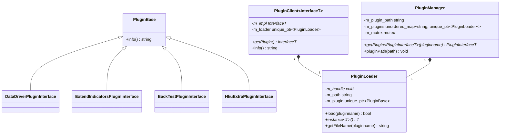

# Plugin System

<cite>
**Referenced Files in This Document**   
- [PluginBase.h](file://hikyuu_cpp/hikyuu/utilities/plugin/PluginBase.h)
- [PluginLoader.h](file://hikyuu_cpp/hikyuu/utilities/plugin/PluginLoader.h)
- [PluginManager.h](file://hikyuu_cpp/hikyuu/utilities/plugin/PluginManager.h)
- [PluginClient.h](file://hikyuu_cpp/hikyuu/utilities/plugin/PluginClient.h)
- [plugins.h](file://hikyuu_cpp/hikyuu/plugin/interface/plugins.h)
- [DataDriverPluginInterface.h](file://hikyuu_cpp/hikyuu/plugin/interface/DataDriverPluginInterface.h)
- [ExtendIndicatorsPluginInterface.h](file://hikyuu_cpp/hikyuu/plugin/interface/ExtendIndicatorsPluginInterface.h)
- [BackTestPluginInterface.h](file://hikyuu_cpp/hikyuu/plugin/interface/BackTestPluginInterface.h)
- [HkuExtraPluginInterface.h](file://hikyuu_cpp/hikyuu/plugin/interface/HkuExtraPluginInterface.h)
- [extind.h](file://hikyuu_cpp/hikyuu/plugin/extind.h)
- [extind.cpp](file://hikyuu_cpp/hikyuu/plugin/extind.cpp)
</cite>

## Table of Contents
1. [Introduction](#introduction)
2. [Core Components](#core-components)
3. [Plugin Lifecycle Management](#plugin-lifecycle-management)
4. [Plugin Interfaces](#plugin-interfaces)
5. [Plugin Loading and Discovery](#plugin-loading-and-discovery)
6. [Inter-Plugin Communication](#inter-plugin-communication)
7. [Developing Custom Plugins](#developing-custom-plugins)
8. [Error Handling and Security](#error-handling-and-security)
9. [Plugin Packaging and Distribution](#plugin-packaging-and-distribution)
10. [Conclusion](#conclusion)

## Introduction
The Hikyuu plugin system provides a flexible and extensible architecture for enhancing the functionality of the quantitative trading framework. This documentation details the plugin infrastructure, including the core interfaces, lifecycle management, dynamic loading mechanisms, and communication patterns. The system enables developers to extend Hikyuu's capabilities through custom data drivers, indicators, trading components, and other specialized modules without modifying the core codebase.

## Core Components

The Hikyuu plugin system consists of several key components that work together to provide a robust extension mechanism. At the foundation is the `PluginBase` interface, which defines the minimal contract that all plugins must implement. The `PluginLoader` handles dynamic library loading across different platforms, while the `PluginManager` provides centralized registration and discovery capabilities. The `PluginClient` facilitates inter-plugin communication and access to plugin functionality.



**Diagram sources**
- [PluginBase.h](file://hikyuu_cpp/hikyuu/utilities/plugin/PluginBase.h#L18-L31)
- [PluginLoader.h](file://hikyuu_cpp/hikyuu/utilities/plugin/PluginLoader.h#L29-L117)
- [PluginManager.h](file://hikyuu_cpp/hikyuu/utilities/plugin/PluginManager.h#L19-L61)
- [PluginClient.h](file://hikyuu_cpp/hikyuu/utilities/plugin/PluginClient.h#L15-L53)

**Section sources**
- [PluginBase.h](file://hikyuu_cpp/hikyuu/utilities/plugin/PluginBase.h#L1-L47)
- [PluginLoader.h](file://hikyuu_cpp/hikyuu/utilities/plugin/PluginLoader.h#L1-L121)
- [PluginManager.h](file://hikyuu_cpp/hikyuu/utilities/plugin/PluginManager.h#L1-L72)
- [PluginClient.h](file://hikyuu_cpp/hikyuu/utilities/plugin/PluginClient.h#L1-L56)

## Plugin Lifecycle Management

The plugin lifecycle in Hikyuu is managed through a well-defined sequence of initialization, loading, execution, and cleanup phases. All plugins must inherit from the `PluginBase` class, which requires implementing the `info()` method to provide metadata about the plugin in JSON format, including name, version, description, and author information.

The `HKU_PLUGIN_DEFINE` macro simplifies plugin creation by automatically generating the required `createPlugin` export function that serves as the entry point for dynamic loading. This macro handles platform-specific differences between Windows (using `__declspec(dllexport)`) and Unix-like systems (using standard C linkage).


**Diagram sources**
- [PluginBase.h](file://hikyuu_cpp/hikyuu/utilities/plugin/PluginBase.h#L18-L47)
- [PluginLoader.h](file://hikyuu_cpp/hikyuu/utilities/plugin/PluginLoader.h#L29-L117)
- [PluginManager.h](file://hikyuu_cpp/hikyuu/utilities/plugin/PluginManager.h#L19-L72)

**Section sources**
- [PluginBase.h](file://hikyuu_cpp/hikyuu/utilities/plugin/PluginBase.h#L1-L47)
- [PluginLoader.h](file://hikyuu_cpp/hikyuu/utilities/plugin/PluginLoader.h#L1-L121)

## Plugin Interfaces

Hikyuu defines several specialized plugin interfaces for different extension points within the system. These interfaces inherit from `PluginBase` and define specific functionality for their respective domains.

### Data Driver Plugin Interface
The `DataDriverPluginInterface` enables the integration of custom data sources into Hikyuu. Plugins implementing this interface must provide implementations for KData, block information, and base information drivers.


**Diagram sources**
- [DataDriverPluginInterface.h](file://hikyuu_cpp/hikyuu/plugin/interface/DataDriverPluginInterface.h#L17-L25)

### Extended Indicators Plugin Interface
The `ExtendIndicatorsPluginInterface` allows for the creation of custom technical indicators and aggregation functions. This interface supports both standard indicators and specialized aggregation/grouping operations.


**Diagram sources**
- [ExtendIndicatorsPluginInterface.h](file://hikyuu_cpp/hikyuu/plugin/interface/ExtendIndicatorsPluginInterface.h#L15-L36)

### Other Plugin Interfaces
Hikyuu also defines interfaces for backtesting, device integration, data serving, and additional functionality:


**Diagram sources**
- [BackTestPluginInterface.h](file://hikyuu_cpp/hikyuu/plugin/interface/BackTestPluginInterface.h#L15-L24)
- [HkuExtraPluginInterface.h](file://hikyuu_cpp/hikyuu/plugin/interface/HkuExtraPluginInterface.h#L14-L37)

**Section sources**
- [DataDriverPluginInterface.h](file://hikyuu_cpp/hikyuu/plugin/interface/DataDriverPluginInterface.h#L1-L28)
- [ExtendIndicatorsPluginInterface.h](file://hikyuu_cpp/hikyuu/plugin/interface/ExtendIndicatorsPluginInterface.h#L1-L39)
- [BackTestPluginInterface.h](file://hikyuu_cpp/hikyuu/plugin/interface/BackTestPluginInterface.h#L1-L28)
- [HkuExtraPluginInterface.h](file://hikyuu_cpp/hikyuu/plugin/interface/HkuExtraPluginInterface.h#L1-L41)
- [plugins.h](file://hikyuu_cpp/hikyuu/plugin/interface/plugins.h#L1-L32)

## Plugin Loading and Discovery

The `PluginLoader` and `PluginManager` classes work together to handle the dynamic loading and discovery of plugins. The `PluginLoader` is responsible for the low-level details of loading shared libraries and instantiating plugin objects, while the `PluginManager` provides a higher-level interface for plugin registration and retrieval.

### Plugin Loading Process
The loading process involves several steps to ensure proper initialization and error handling:


**Diagram sources**
- [PluginLoader.h](file://hikyuu_cpp/hikyuu/utilities/plugin/PluginLoader.h#L47-L75)

### Plugin Discovery and Caching
The `PluginManager` implements a lazy loading strategy with caching to optimize performance and resource usage:


**Diagram sources**
- [PluginManager.h](file://hikyuu_cpp/hikyuu/utilities/plugin/PluginManager.h#L40-L70)

**Section sources**
- [PluginLoader.h](file://hikyuu_cpp/hikyuu/utilities/plugin/PluginLoader.h#L1-L121)
- [PluginManager.h](file://hikyuu_cpp/hikyuu/utilities/plugin/PluginManager.h#L1-L72)

## Inter-Plugin Communication

The `PluginClient` template class provides a convenient wrapper for accessing plugin functionality and enables inter-plugin communication patterns. It combines the loading and interface access functionality into a single, easy-to-use class.

### Plugin Client Pattern
The `PluginClient` follows the proxy pattern, providing a local interface to a remotely loaded plugin:


**Diagram sources**
- [PluginClient.h](file://hikyuu_cpp/hikyuu/utilities/plugin/PluginClient.h#L15-L53)

### Communication Example
The following sequence diagram illustrates how plugins can communicate through the `PluginManager`:


**Section sources**
- [PluginClient.h](file://hikyuu_cpp/hikyuu/utilities/plugin/PluginClient.h#L1-L56)

## Developing Custom Plugins

Creating custom plugins for Hikyuu involves implementing one of the provided interface classes and following the plugin development guidelines.

### Data Driver Plugin Example
To create a custom data driver plugin, implement the `DataDriverPluginInterface`:


**Section sources**
- [DataDriverPluginInterface.h](file://hikyuu_cpp/hikyuu/plugin/interface/DataDriverPluginInterface.h#L17-L25)

### Indicator Plugin Example
For custom indicators, implement the `ExtendIndicatorsPluginInterface`:


**Section sources**
- [ExtendIndicatorsPluginInterface.h](file://hikyuu_cpp/hikyuu/plugin/interface/ExtendIndicatorsPluginInterface.h#L15-L36)

### Trading Component Plugin
For backtesting and trading functionality, implement the `BackTestPluginInterface`:


**Section sources**
- [BackTestPluginInterface.h](file://hikyuu_cpp/hikyuu/plugin/interface/BackTestPluginInterface.h#L15-L24)

## Error Handling and Security

The plugin system includes several mechanisms for error handling and security considerations when executing third-party code.

### Error Handling
The plugin loading process includes comprehensive error handling at multiple levels:


**Section sources**
- [PluginLoader.h](file://hikyuu_cpp/hikyuu/utilities/plugin/PluginLoader.h#L47-L75)

### Security Considerations
When executing third-party plugin code, several security considerations must be addressed:

1. **Code Verification**: Validate the source and integrity of plugin binaries before loading
2. **Sandboxing**: Consider running plugins in isolated environments or containers
3. **Permission Control**: Limit the system resources and APIs accessible to plugins
4. **Input Validation**: Validate all inputs passed to plugin functions
5. **Error Containment**: Ensure plugin errors do not crash the main application

The current implementation relies on standard operating system mechanisms for library loading, which provides some isolation but does not offer complete sandboxing. Developers should exercise caution when loading untrusted plugins.

## Plugin Packaging and Distribution

### File Naming Conventions
Plugins must follow platform-specific naming conventions:

- **Windows**: `plugin_name.dll`
- **Linux**: `libplugin_name.so`
- **macOS**: `libplugin_name.dylib`

The `PluginLoader` automatically constructs the correct filename based on the operating system.

### Directory Structure
Plugins should be organized in a dedicated directory, typically specified when creating the `PluginManager`:

```
plugins/
├── dataserver.dll (Windows)
├── libdataserver.so (Linux)
├── libdataserver.dylib (macOS)
├── backtest.dll
├── libbacktest.so
└── libbacktest.dylib
```

### Build Configuration
When building plugins, ensure the following:

1. Link against the Hikyuu core libraries
2. Export the `createPlugin` function using the `HKU_PLUGIN_DEFINE` macro
3. Include the necessary header files from the Hikyuu distribution
4. Follow the same compilation flags and standards as the core system

### Version Compatibility
To ensure version compatibility:

1. Include version information in the plugin's `info()` method
2. Verify API compatibility between the plugin and the host application
3. Use semantic versioning for plugin releases
4. Test plugins against the target Hikyuu version before distribution

## Conclusion
The Hikyuu plugin system provides a comprehensive infrastructure for extending the framework's capabilities through modular, dynamically loaded components. By implementing the provided interfaces and following the development guidelines, users can create custom data drivers, indicators, trading systems, and other specialized functionality. The system's design emphasizes flexibility, maintainability, and ease of integration while providing robust error handling and lifecycle management. When developing and deploying plugins, attention should be paid to security considerations and version compatibility to ensure stable and reliable operation.