# Threading and Concurrency

<cite>
**Referenced Files in This Document**   
- [GlobalThreadPool.h](file://hikyuu_cpp/hikyuu/utilities/thread/GlobalThreadPool.h)
- [GlobalMQThreadPool.h](file://hikyuu_cpp/hikyuu/utilities/thread/GlobalMQThreadPool.h)
- [GlobalMQStealThreadPool.h](file://hikyuu_cpp/hikyuu/utilities/thread/GlobalMQStealThreadPool.h)
- [ThreadSafeQueue.h](file://hikyuu_cpp/hikyuu/utilities/thread/ThreadSafeQueue.h)
- [FuncWrapper.h](file://hikyuu_cpp/hikyuu/utilities/thread/FuncWrapper.h)
- [WorkStealQueue.h](file://hikyuu_cpp/hikyuu/utilities/thread/WorkStealQueue.h)
- [MQStealQueue.h](file://hikyuu_cpp/hikyuu/utilities/thread/MQStealQueue.h)
- [InterruptFlag.h](file://hikyuu_cpp/hikyuu/utilities/thread/InterruptFlag.h)
- [algorithm.h](file://hikyuu_cpp/hikyuu/utilities/thread/algorithm.h)
- [test_ThreadPool.cpp](file://hikyuu_cpp/unit_test/hikyuu/utilities/thread/test_ThreadPool.cpp)
- [misc.cpp](file://hikyuu_cpp/hikyuu/misc.cpp)
</cite>

## Table of Contents
1. [Introduction](#introduction)
2. [Thread Pool Implementations](#thread-pool-implementations)
3. [Synchronization Primitives](#synchronization-primitives)
4. [Task Encapsulation](#task-encapsulation)
5. [Parallel Processing Algorithms](#parallel-processing-algorithms)
6. [Practical Examples](#practical-examples)
7. [Thread Safety and Performance](#thread-safety-and-performance)
8. [Conclusion](#conclusion)

## Introduction
The Hikyuu quantitative trading framework provides a comprehensive threading and concurrency infrastructure designed to handle CPU-intensive quantitative analysis tasks efficiently. This documentation covers the thread pool implementations, synchronization primitives, and parallel processing utilities that enable high-performance concurrent execution for data loading, backtesting, and strategy execution. The system is optimized for quantitative finance workloads that require parallel processing of large datasets and complex calculations.

**Section sources**
- [GlobalThreadPool.h](file://hikyuu_cpp/hikyuu/utilities/thread/GlobalThreadPool.h#L34-L38)
- [GlobalMQThreadPool.h](file://hikyuu_cpp/hikyuu/utilities/thread/GlobalMQThreadPool.h#L32-L35)

## Thread Pool Implementations

### GlobalThreadPool
The GlobalThreadPool is a centralized thread pool implementation with a single shared task queue. It is designed for scenarios where tasks are independent and do not have dependencies on each other. The thread pool creates a fixed number of worker threads that consume tasks from the shared queue. This implementation is suitable for general-purpose parallel processing where load balancing is handled by the central queue.

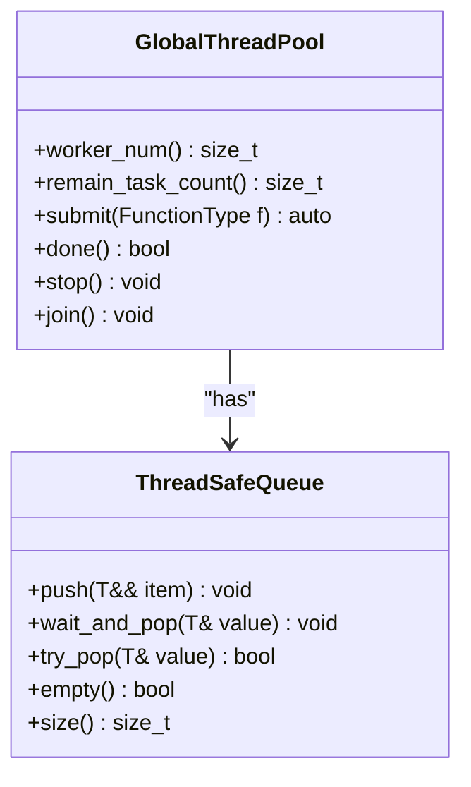

**Diagram sources**
- [GlobalThreadPool.h](file://hikyuu_cpp/hikyuu/utilities/thread/GlobalThreadPool.h#L37-L216)
- [ThreadSafeQueue.h](file://hikyuu_cpp/hikyuu/utilities/thread/ThreadSafeQueue.h#L23-L101)

**Section sources**
- [GlobalThreadPool.h](file://hikyuu_cpp/hikyuu/utilities/thread/GlobalThreadPool.h#L37-L216)

### GlobalMQThreadPool
The GlobalMQThreadPool is a distributed thread pool implementation with multiple task queues, one for each worker thread. When submitting a task, it is placed in the queue with the fewest tasks to achieve load balancing. This approach reduces contention compared to a single shared queue and provides better cache locality. The implementation is particularly effective for workloads with varying task execution times.

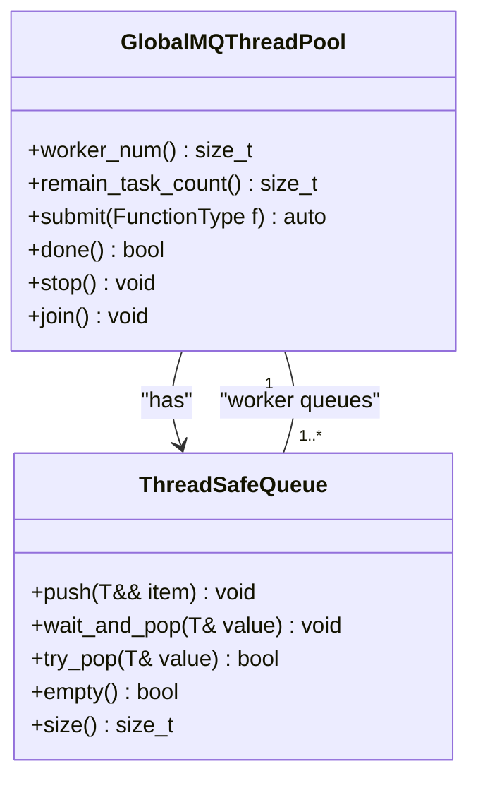

**Diagram sources**
- [GlobalMQThreadPool.h](file://hikyuu_cpp/hikyuu/utilities/thread/GlobalMQThreadPool.h#L37-L265)
- [ThreadSafeQueue.h](file://hikyuu_cpp/hikyuu/utilities/thread/ThreadSafeQueue.h#L23-L101)

**Section sources**
- [GlobalMQThreadPool.h](file://hikyuu_cpp/hikyuu/utilities/thread/GlobalMQThreadPool.h#L37-L265)

### GlobalMQStealThreadPool
The GlobalMQStealThreadPool implements a work-stealing algorithm with multiple queues. Each worker thread has its own queue and can "steal" tasks from other threads' queues when its own queue is empty. This approach provides excellent load balancing for irregular workloads and recursive algorithms. The work-stealing mechanism ensures that all threads remain busy, maximizing CPU utilization.

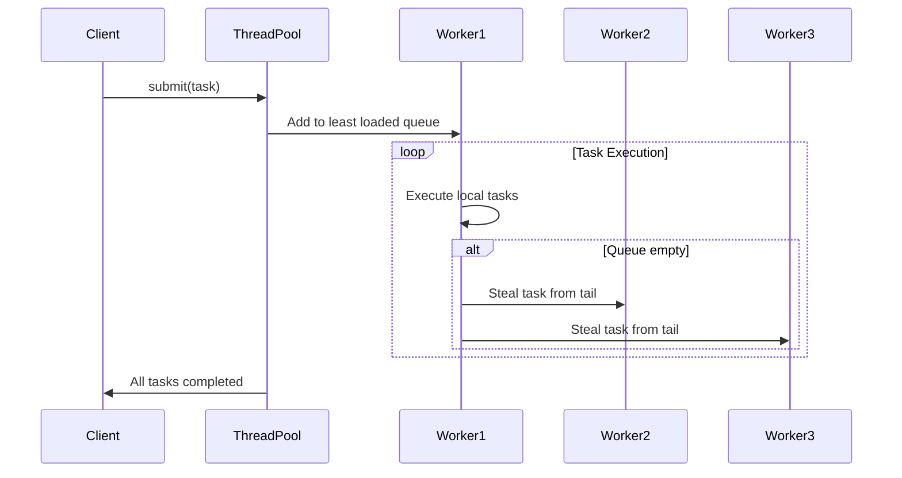

**Diagram sources**
- [GlobalMQStealThreadPool.h](file://hikyuu_cpp/hikyuu/utilities/thread/GlobalMQStealThreadPool.h#L35-L309)
- [MQStealQueue.h](file://hikyuu_cpp/hikyuu/utilities/thread/MQStealQueue.h#L18-L110)

**Section sources**
- [GlobalMQStealThreadPool.h](file://hikyuu_cpp/hikyuu/utilities/thread/GlobalMQStealThreadPool.h#L35-L309)

## Synchronization Primitives

### ThreadSafeQueue
The ThreadSafeQueue is a thread-safe FIFO queue implementation that uses mutex and condition variables for synchronization. It provides blocking and non-blocking operations for task submission and retrieval. The queue is used as the underlying data structure for task distribution in the thread pool implementations.

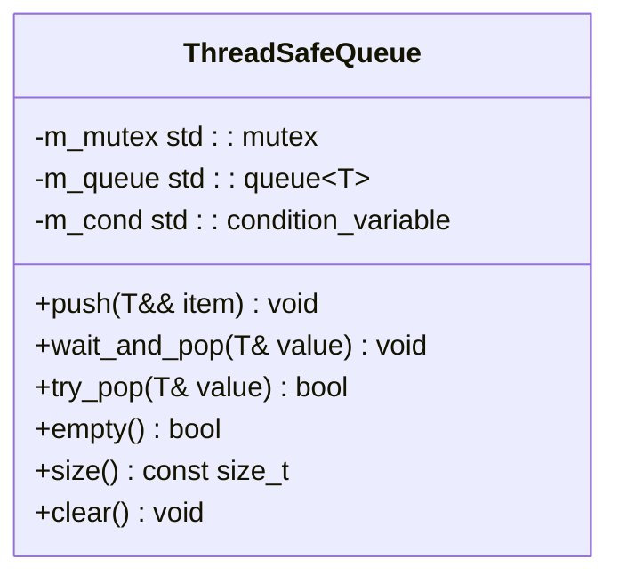

**Diagram sources**
- [ThreadSafeQueue.h](file://hikyuu_cpp/hikyuu/utilities/thread/ThreadSafeQueue.h#L23-L101)

**Section sources**
- [ThreadSafeQueue.h](file://hikyuu_cpp/hikyuu/utilities/thread/ThreadSafeQueue.h#L23-L101)

### MQStealQueue
The MQStealQueue extends the thread-safe queue with work-stealing capabilities. It uses a deque (double-ended queue) to allow tasks to be added to the front (push_front) and stolen from the back (try_steal). This design enables the work-stealing algorithm where idle threads can steal tasks from the tail of busy threads' queues.

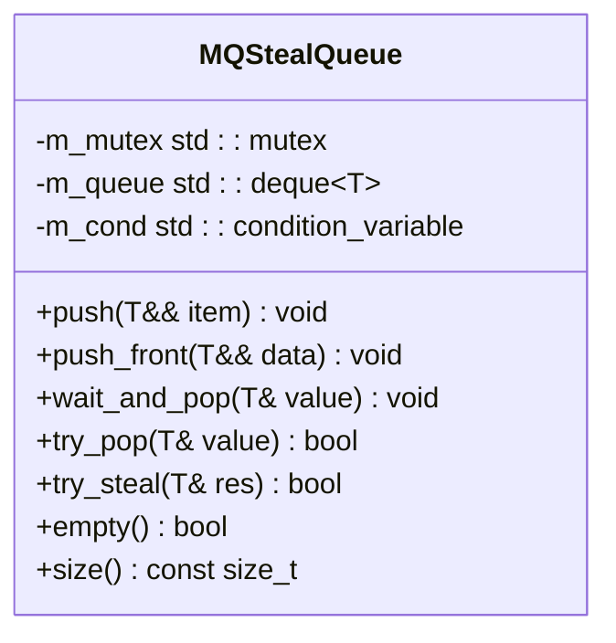

**Diagram sources**
- [MQStealQueue.h](file://hikyuu_cpp/hikyuu/utilities/thread/MQStealQueue.h#L18-L110)

**Section sources**
- [MQStealQueue.h](file://hikyuu_cpp/hikyuu/utilities/thread/MQStealQueue.h#L18-L110)

### InterruptFlag
The InterruptFlag is a thread-safe boolean flag used for signaling thread interruption. It wraps an atomic boolean and provides thread-safe operations for setting and checking the flag state. This primitive is used by thread pools to signal worker threads to stop execution gracefully.

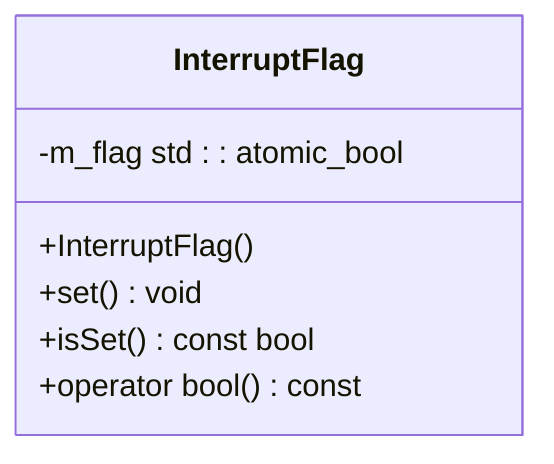

**Diagram sources**
- [InterruptFlag.h](file://hikyuu_cpp/hikyuu/utilities/thread/InterruptFlag.h#L14-L44)

**Section sources**
- [InterruptFlag.h](file://hikyuu_cpp/hikyuu/utilities/thread/InterruptFlag.h#L14-L44)

## Task Encapsulation

### FuncWrapper
The FuncWrapper class provides a type-erased wrapper for callable objects (functions, lambdas, functors) that enables move semantics. This allows different types of tasks to be stored uniformly in the thread pool's task queues. The wrapper uses the "type erasure" pattern with a polymorphic base class and template-derived classes.

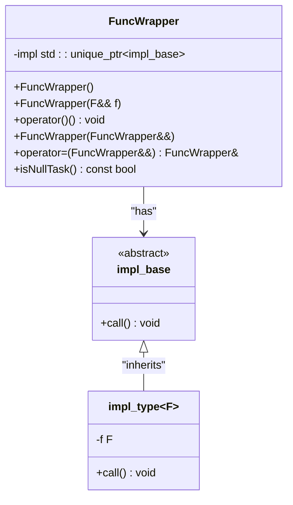

**Diagram sources**
- [FuncWrapper.h](file://hikyuu_cpp/hikyuu/utilities/thread/FuncWrapper.h#L27-L77)

**Section sources**
- [FuncWrapper.h](file://hikyuu_cpp/hikyuu/utilities/thread/FuncWrapper.h#L27-L77)

## Parallel Processing Algorithms

### Parallel For Extensions
The threading utilities include algorithm extensions for parallel processing, such as parallel_for_index and parallel_for_range. These functions provide high-level interfaces for parallelizing loops and range-based operations. They automatically partition the work and distribute it across the thread pool.

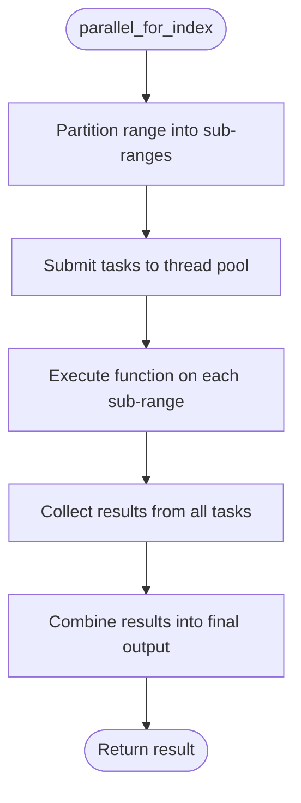

**Diagram sources**
- [algorithm.h](file://hikyuu_cpp/hikyuu/utilities/thread/algorithm.h#L26-L114)

**Section sources**
- [algorithm.h](file://hikyuu_cpp/hikyuu/utilities/thread/algorithm.h#L26-L114)

## Practical Examples

### Parallel Data Loading
The threading utilities enable efficient parallel loading of market data. By distributing data loading tasks across multiple threads, the system can significantly reduce the time required to load large datasets from various sources.

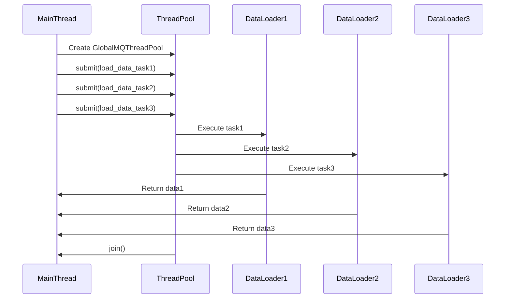

**Section sources**
- [test_ThreadPool.cpp](file://hikyuu_cpp/unit_test/hikyuu/utilities/thread/test_ThreadPool.cpp#L45-L64)

### Concurrent Backtesting
The framework supports concurrent backtesting of multiple trading strategies. Each strategy can be executed in parallel, allowing for rapid evaluation of different parameter sets or strategy variations.

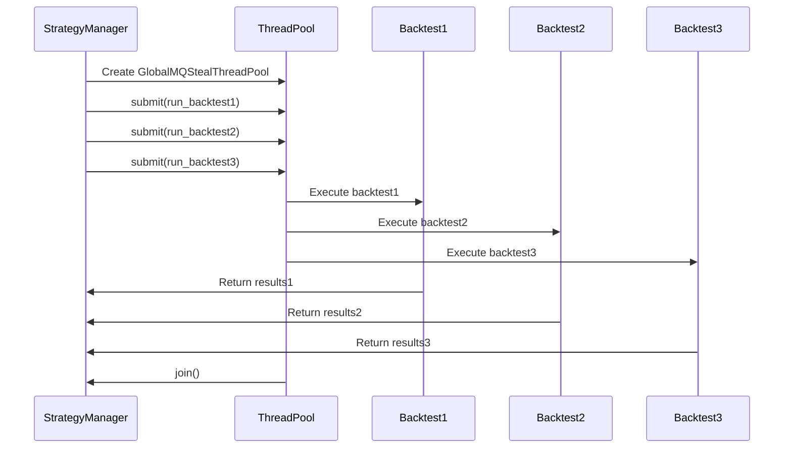

**Section sources**
- [misc.cpp](file://hikyuu_cpp/hikyuu/misc.cpp#L1-L50)

### Multi-threaded Strategy Execution
Complex trading strategies can leverage multi-threading for real-time execution. The work-stealing thread pool ensures efficient load balancing when processing multiple securities or timeframes simultaneously.

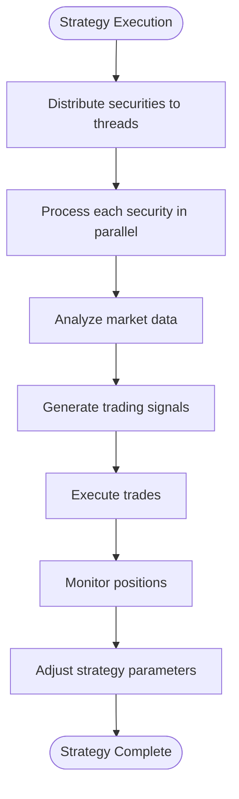

**Section sources**
- [misc.cpp](file://hikyuu_cpp/hikyuu/misc.cpp#L1-L50)

## Thread Safety and Performance

### Thread Safety Considerations
The threading utilities are designed with thread safety as a primary concern. All shared data structures use appropriate synchronization mechanisms to prevent race conditions. The FuncWrapper ensures that tasks can be safely moved between threads, while the ThreadSafeQueue provides atomic operations for task submission and retrieval.

### Deadlock Prevention
The framework employs several strategies to prevent deadlocks:
- Using non-blocking operations when possible
- Consistent lock ordering
- Timeout mechanisms for blocking operations
- Work-stealing algorithms that avoid circular dependencies

### Performance Optimization
The threading infrastructure is optimized for CPU-intensive quantitative analysis tasks:
- Work-stealing algorithms maximize CPU utilization
- Multiple queue implementations reduce contention
- Type-erased task wrappers minimize overhead
- Efficient memory management with smart pointers

**Section sources**
- [GlobalMQStealThreadPool.h](file://hikyuu_cpp/hikyuu/utilities/thread/GlobalMQStealThreadPool.h#L257-L297)
- [GlobalMQThreadPool.h](file://hikyuu_cpp/hikyuu/utilities/thread/GlobalMQThreadPool.h#L246-L264)

## Conclusion
The Hikyuu threading and concurrency utilities provide a robust foundation for high-performance quantitative analysis. The various thread pool implementations offer flexibility for different workload patterns, from simple parallel processing to complex recursive algorithms. The synchronization primitives ensure thread safety while minimizing overhead, and the task encapsulation mechanisms enable efficient execution of diverse workloads. These utilities are essential for handling the computational demands of modern quantitative trading strategies, enabling faster backtesting, real-time strategy execution, and efficient data processing.