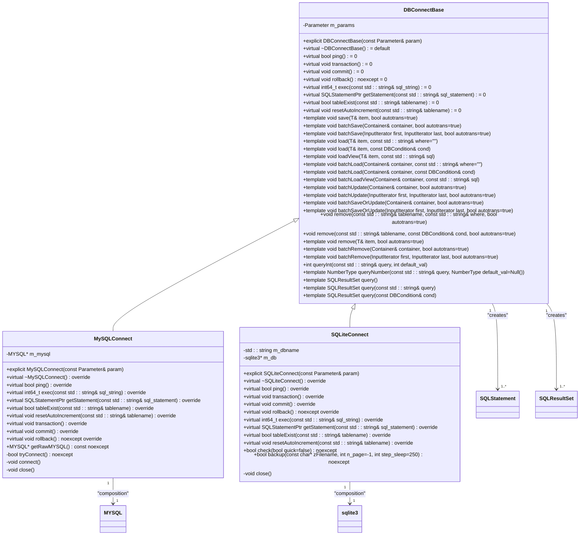

# Utilities and Helpers

<cite>
**Referenced Files in This Document**   
- [Datetime.h](file://hikyuu_cpp/hikyuu/utilities/datetime/Datetime.h)
- [TimeDelta.h](file://hikyuu_cpp/hikyuu/utilities/datetime/TimeDelta.h)
- [DBConnect.h](file://hikyuu_cpp/hikyuu/utilities/db_connect/DBConnect.h)
- [DBConnectBase.h](file://hikyuu_cpp/hikyuu/utilities/db_connect/DBConnectBase.h)
- [MySQLConnect.h](file://hikyuu_cpp/hikyuu/utilities/db_connect/mysql/MySQLConnect.h)
- [SQLiteConnect.h](file://hikyuu_cpp/hikyuu/utilities/db_connect/sqlite/SQLiteConnect.h)
- [IniParser.h](file://hikyuu_cpp/hikyuu/utilities/ini_parser/IniParser.h)
- [GlobalThreadPool.h](file://hikyuu_cpp/hikyuu/utilities/thread/GlobalThreadPool.h)
- [Log.h](file://hikyuu_cpp/hikyuu/utilities/Log.h)
- [Parameter.h](file://hikyuu_cpp/hikyuu/utilities/Parameter.h)
- [PluginBase.h](file://hikyuu_cpp/hikyuu/utilities/plugin/PluginBase.h)
- [PluginManager.h](file://hikyuu_cpp/hikyuu/utilities/plugin/PluginManager.h)
- [exception.h](file://hikyuu_cpp/hikyuu/utilities/exception.h)
- [base64.h](file://hikyuu_cpp/hikyuu/utilities/base64.h)
</cite>

## Table of Contents
1. [Introduction](#introduction)
2. [Datetime Utilities](#datetime-utilities)
3. [Database Connectivity](#database-connectivity)
4. [INI File Parser and Configuration Management](#ini-file-parser-and-configuration-management)
5. [Threading and Concurrency Utilities](#threading-and-concurrency-utilities)
6. [Plugin System Infrastructure](#plugin-system-infrastructure)
7. [Other Utility Components](#other-utility-components)
8. [Performance Implications and Best Practices](#performance-implications-and-best-practices)
9. [Conclusion](#conclusion)

## Introduction
This document provides comprehensive API documentation for the utility classes and helper functions in the Hikyuu financial analysis framework. The utilities cover essential aspects of temporal data handling, database connectivity, configuration management, threading, plugin infrastructure, and various other helper components. These utilities are designed to support both C++ and Python contexts, providing a robust foundation for financial data analysis and algorithmic trading applications. The documentation details the core functionality, usage patterns, and integration methods for each utility component.

## Datetime Utilities
The datetime utilities in Hikyuu provide comprehensive temporal data handling capabilities through the Datetime and TimeDelta classes. These classes offer robust functionality for date and time manipulation, formatting, and arithmetic operations.

The Datetime class represents date and time information with microsecond precision, supporting a wide range of construction methods including from timestamps, boost::posix_time::ptime, and various string formats. It provides methods for extracting individual components (year, month, day, hour, minute, second, millisecond, microsecond) and performing date arithmetic through the TimeDelta class. The class supports various output formats including string representations, numeric formats (YYYYMMDDhhmm, YYYYMMDD, etc.), and conversion to different time representations (boost::posix_time::ptime, std::time_t).

The TimeDelta class represents a duration or time interval, enabling precise time arithmetic operations. It supports construction from various time components (days, hours, minutes, seconds, milliseconds, microseconds) and provides methods for accessing normalized components. The class implements standard arithmetic operations (addition, subtraction, multiplication, division) and comparison operators, making it suitable for complex time calculations.

```mermaid
classDiagram
class Datetime {
+static Datetime min()
+static Datetime max()
+static Datetime now()
+static Datetime today()
+static Datetime fromHex(uint64_t time)
+static Datetime fromTimestamp(int64_t timestamp)
+static Datetime fromTimestampUTC(int64_t timestamp)
+Datetime()
+Datetime(long year, long month, long day, long hh=0, long mm=0, long sec=0, long millisec=0, long microsec=0)
+Datetime(const bd : : date&)
+Datetime(const bt : : ptime&)
+Datetime(unsigned long long)
+Datetime(const std : : string&)
+long year() const
+long month() const
+long day() const
+long hour() const
+long minute() const
+long second() const
+long millisecond() const
+long microsecond() const
+bool isNull() const
+Datetime operator+(TimeDelta d) const
+Datetime operator-(TimeDelta d) const
+uint64_t number() const noexcept
+uint64_t ym() const noexcept
+uint64_t ymd() const noexcept
+uint64_t ymdh() const noexcept
+uint64_t ymdhm() const noexcept
+uint64_t ymdhms() const noexcept
+uint64_t hex() const noexcept
+uint64_t ticks() const noexcept
+uint64_t timestamp() const noexcept
+uint64_t timestampUTC() const noexcept
+std : : string str() const
+std : : string repr() const
+bt : : ptime ptime() const
+bd : : date date() const
+std : : time_t to_time_t() const
+int dayOfWeek() const
+int dayOfYear() const
+Datetime startOfDay() const
+Datetime endOfDay() const
+Datetime dateOfWeek(int day) const
+Datetime startOfWeek() const
+Datetime endOfWeek() const
+Datetime startOfMonth() const
+Datetime endOfMonth() const
+Datetime startOfQuarter() const
+Datetime endOfQuarter() const
+Datetime startOfHalfyear() const
+Datetime endOfHalfyear() const
+Datetime startOfYear() const
+Datetime endOfYear() const
+Datetime nextDay() const
+Datetime nextWeek() const
+Datetime nextMonth() const
+Datetime nextQuarter() const
+Datetime nextHalfyear() const
+Datetime nextYear() const
+Datetime preDay() const
+Datetime preWeek() const
+Datetime preMonth() const
+Datetime preQuarter() const
+Datetime preHalfyear() const
+Datetime preYear() const
-bt : : ptime m_data
}
class TimeDelta {
+explicit TimeDelta(int64_t days=0, int64_t hours=0, int64_t minutes=0, int64_t seconds=0, int64_t milliseconds=0, int64_t microseconds=0)
+explicit TimeDelta(bt : : time_duration td)
+explicit TimeDelta(const std : : string& delta)
+int64_t days() const
+int64_t hours() const
+int64_t minutes() const
+int64_t seconds() const
+int64_t milliseconds() const
+int64_t microseconds() const
+int64_t ticks() const
+double total_days() const
+double total_hours() const
+double total_minutes() const
+double total_seconds() const
+double total_milliseconds() const
+bool isNegative() const
+TimeDelta abs() const
+bt : : time_duration time_duration() const
+std : : string str() const
+std : : string repr() const
+TimeDelta operator+(TimeDelta td) const
+TimeDelta operator-(TimeDelta td) const
+TimeDelta operator+() const
+TimeDelta operator-() const
+TimeDelta operator*(double p) const
+TimeDelta operator/(double p) const
+double operator/(TimeDelta td) const
+TimeDelta floorDiv(double p) const
+TimeDelta operator%(TimeDelta td) const
+bool operator==(TimeDelta td) const
+bool operator!=(TimeDelta td) const
+bool operator>(TimeDelta td) const
+bool operator<(TimeDelta td) const
+bool operator>=(TimeDelta td) const
+bool operator<=(TimeDelta td) const
+static TimeDelta min()
+static TimeDelta max()
+static int64_t maxTicks()
+static int64_t minTicks()
+static TimeDelta resolution()
+static TimeDelta fromTicks(int64_t ticks)
-bt : : time_duration m_duration
-static constexpr const int64_t m_max_micro_seconds
-static constexpr const int64_t m_min_micro_seconds
-static constexpr const int64_t m_one_day_ticks
}
Datetime --> TimeDelta : "uses in arithmetic"
TimeDelta "1" --> "1" bt : : time_duration : "composition"
Datetime "1" --> "1" bt : : ptime : "composition"
Datetime "1" --> "1" bd : : date : "composition"
```

**Diagram sources**
- [Datetime.h](file://hikyuu_cpp/hikyuu/utilities/datetime/Datetime.h)
- [TimeDelta.h](file://hikyuu_cpp/hikyuu/utilities/datetime/TimeDelta.h)

**Section sources**
- [Datetime.h](file://hikyuu_cpp/hikyuu/utilities/datetime/Datetime.h)
- [TimeDelta.h](file://hikyuu_cpp/hikyuu/utilities/datetime/TimeDelta.h)

## Database Connectivity
The database connectivity layer in Hikyuu provides a unified interface for working with both MySQL and SQLite databases through a consistent API. The architecture is built around a base class DBConnectBase that defines the common interface, with specific implementations for MySQLConnect and SQLiteConnect.

The DBConnectBase class serves as the foundation for database operations, providing template methods for common database operations such as saving, loading, batch operations, and querying. It supports parameterized queries through the Parameter class and provides transaction management capabilities. The class hierarchy allows for database-agnostic code development, where the specific database implementation can be swapped without changing the application logic.

For MySQL connectivity, the MySQLConnect class implements the DBConnectBase interface using the MySQL C API. It provides direct access to the underlying MYSQL connection through the getRawMYSQL() method, allowing for advanced MySQL-specific operations when needed. The class handles connection management, including automatic reconnection attempts and proper resource cleanup.

The SQLiteConnect class implements SQLite database connectivity, supporting both standard SQLite and sqlcipher-encrypted databases. It provides additional SQLite-specific features such as database integrity checking and online backup capabilities that don't interrupt other database connections. The class supports various SQLite connection flags and encryption options through the Parameter interface.



**Diagram sources**
- [DBConnectBase.h](file://hikyuu_cpp/hikyuu/utilities/db_connect/DBConnectBase.h)
- [MySQLConnect.h](file://hikyuu_cpp/hikyuu/utilities/db_connect/mysql/MySQLConnect.h)
- [SQLiteConnect.h](file://hikyuu_cpp/hikyuu/utilities/db_connect/sqlite/SQLiteConnect.h)

**Section sources**
- [DBConnect.h](file://hikyuu_cpp/hikyuu/utilities/db_connect/DBConnect.h)
- [DBConnectBase.h](file://hikyuu_cpp/hikyuu/utilities/db_connect/DBConnectBase.h)
- [MySQLConnect.h](file://hikyuu_cpp/hikyuu/utilities/db_connect/mysql/MySQLConnect.h)
- [SQLiteConnect.h](file://hikyuu_cpp/hikyuu/utilities/db_connect/sqlite/SQLiteConnect.h)

## INI File Parser and Configuration Management
The INI file parser in Hikyuu provides a simple yet effective mechanism for reading and managing configuration data stored in INI format files. The IniParser class implements a straightforward interface for accessing configuration values with support for multiple data types.

The IniParser class reads configuration files with a standard INI format, supporting sections enclosed in square brackets and key-value pairs separated by equals signs. It handles comments indicated by semicolons and provides methods for checking the existence of sections and options. The parser supports retrieving values as strings, integers, floating-point numbers, and boolean values, with appropriate type conversion and error handling.

Configuration management in Hikyuu is further enhanced by the Parameter class, which provides a flexible mechanism for named parameter setting and retrieval. The Parameter class uses boost::any to store values of different types and provides a type-safe interface for accessing these values. It supports common operations such as adding, setting, getting, and checking parameters, with appropriate error handling for type mismatches and missing parameters.

```mermaid
classDiagram
class IniParser {
+typedef std : : list<std : : string> StringList
+typedef std : : shared_ptr<std : : list<std : : string>> StringListPtr
+IniParser()
+virtual ~IniParser()
+void read(const std : : string& filename)
+void clear()
+bool hasSection(const std : : string& section) const
+bool hasOption(const std : : string& section, const std : : string& option) const
+StringListPtr getSectionList() const
+StringListPtr getOptionList(const std : : string& section) const
+std : : string get(const std : : string& section, const std : : string& option, const std : : string& default_str=std : : string()) const
+int getInt(const std : : string& section, const std : : string& option, const std : : string& default_str=std : : string()) const
+float getFloat(const std : : string& section, const std : : string& option, const std : : string& default_str=std : : string()) const
+double getDouble(const std : : string& section, const std : : string& option, const std : : string& default_str=std : : string()) const
+bool getBool(const std : : string& section, const std : : string& option, const std : : string& default_str=std : : string()) const
-typedef std : : map<std : : string, std : : string> item_map_type
-typedef std : : map<std : : string, item_map_type> section_map_type
-section_map_type m_sections
}
class Parameter {
+Parameter()
+Parameter(const Parameter&)
+virtual ~Parameter()
+Parameter& operator=(const Parameter&)
+static bool support(const boost : : any&)
+StringList getNameList() const
+string getNameValueList() const
+bool have(const string& name) const noexcept
+size_t size() const
+string type(const string& name) const
+template<typename ValueType> void set(const string& name, const ValueType& value)
+template<typename ValueType> ValueType get(const string& name) const
+template<typename ValueType> ValueType tryGet(const string& name, const ValueType& val) const
+typedef map<string, boost : : any> param_map_t
+typedef param_map_t : : const_iterator iterator
+iterator begin() const
+iterator end() const
-param_map_t m_params
}
class PARAMETER_SUPPORT {
+const Parameter& getParameter() const
+void setParameter(const Parameter& param)
+bool haveParam(const string& name) const noexcept
+template<typename ValueType> void setParam(const string& name, const ValueType& value)
+template<typename ValueType> ValueType getParam(const string& name) const
+template<typename ValueType> ValueType tryGetParam(const string& name, const ValueType& val) const
+template<typename ValueType> ValueType getParamFromOther(const Parameter& other, const string& name, const ValueType& default_value)
-Parameter m_params
}
IniParser "1" --> "1..*" section_map_type : "composition"
Parameter "1" --> "1..*" param_map_t : "composition"
Parameter "1" --> "1..*" boost : : any : "type erasure"
PARAMETER_SUPPORT "1" --> "1" Parameter : "composition"
```

**Diagram sources**
- [IniParser.h](file://hikyuu_cpp/hikyuu/utilities/ini_parser/IniParser.h)
- [Parameter.h](file://hikyuu_cpp/hikyuu/utilities/Parameter.h)

**Section sources**
- [IniParser.h](file://hikyuu_cpp/hikyuu/utilities/ini_parser/IniParser.h)
- [Parameter.h](file://hikyuu_cpp/hikyuu/utilities/Parameter.h)

## Threading and Concurrency Utilities
The threading and concurrency utilities in Hikyuu provide a comprehensive set of tools for managing concurrent operations and parallel processing. The core component is the GlobalThreadPool class, which implements a centralized task queue-based thread pool that can efficiently manage multiple worker threads.

The GlobalThreadPool class creates a specified number of worker threads that continuously poll a shared task queue for work. It supports submitting tasks as function objects and returns std::future objects that can be used to retrieve the results or wait for completion. The thread pool implements proper shutdown semantics, ensuring that all running tasks are completed before the pool is destroyed. It also provides mechanisms for interrupting running tasks and handling exceptions in worker threads.

In addition to the thread pool, Hikyuu provides various synchronization primitives and utility classes for concurrent programming. These include ThreadSafeQueue for thread-safe data exchange between threads, InterruptFlag for cooperative thread interruption, and various work-stealing queue implementations for load balancing across threads. The utilities are designed to be efficient and minimize contention, making them suitable for high-performance financial applications.

```mermaid
classDiagram
class GlobalThreadPool {
+GlobalThreadPool()
+explicit GlobalThreadPool(size_t n, bool until_empty=true)
+~GlobalThreadPool()
+size_t worker_num() const
+template<typename ResultType> using task_handle = std : : future<ResultType>
+template<typename FunctionType> auto submit(FunctionType f)
+bool done() const
+size_t remain_task_count() const
+void stop()
+void join()
-void worker_thread(int index)
-void run_pending_task()
-std : : atomic_bool m_done
-size_t m_worker_num
-bool m_running_until_empty
-ThreadSafeQueue<task_type> m_master_work_queue
-std : : vector<std : : thread> m_threads
-std : : vector<InterruptFlag*> m_interrupt_flags
-static thread_local InterruptFlag m_thread_need_stop
}
class ThreadSafeQueue {
+ThreadSafeQueue()
+void push(task_type data)
+bool try_pop(task_type& res)
+void wait_and_pop(task_type& res)
+bool empty() const
+size_t size() const
+void clear()
-std : : queue<task_type> m_queue
-mutable std : : mutex m_mutex
-std : : condition_variable m_cond
}
class InterruptFlag {
+void set()
+bool isSet() const
-std : : atomic<bool> m_flag
}
class FuncWrapper {
+FuncWrapper()
+template<typename F> FuncWrapper(F&& f)
+void operator()()
+bool isNullTask() const
-std : : unique_ptr<impl_base> m_impl
}
GlobalThreadPool "1" --> "1..*" ThreadSafeQueue : "uses"
GlobalThreadPool "1" --> "1..*" std : : thread : "creates"
GlobalThreadPool "1" --> "1..*" InterruptFlag : "uses"
GlobalThreadPool "1" --> "1..*" FuncWrapper : "uses"
ThreadSafeQueue "1" --> "1" std : : mutex : "composition"
ThreadSafeQueue "1" --> "1" std : : condition_variable : "composition"
FuncWrapper "1" --> "1..*" impl_base : "composition"
```

**Diagram sources**
- [GlobalThreadPool.h](file://hikyuu_cpp/hikyuu/utilities/thread/GlobalThreadPool.h)

**Section sources**
- [GlobalThreadPool.h](file://hikyuu_cpp/hikyuu/utilities/thread/GlobalThreadPool.h)

## Plugin System Infrastructure
The plugin system infrastructure in Hikyuu provides a flexible mechanism for extending the framework's functionality through dynamically loaded modules. The system is built around the PluginBase abstract base class and the PluginManager class that handles plugin loading and management.

The PluginBase class defines the interface that all plugins must implement, including a pure virtual info() method that returns plugin metadata in JSON format. The class provides a macro HKU_PLUGIN_DEFINE that simplifies plugin creation by automatically generating the required export function for dynamic loading. This design allows plugins to be developed independently of the main application and loaded at runtime.

The PluginManager class is responsible for discovering, loading, and managing plugins. It maintains a cache of loaded plugins and provides a template getPlugin() method that returns a pointer to a specific plugin interface. The manager handles the platform-specific details of dynamic library loading and ensures thread-safe access to plugins through a mutex. Plugins are loaded on-demand when first requested, reducing startup time and memory usage.

```mermaid
classDiagram
class PluginBase {
+PluginBase() = default
+virtual ~PluginBase() = default
+virtual std : : string info() const noexcept = 0
}
class PluginLoader {
+PluginLoader(const std : : string& plugin_path)
+~PluginLoader()
+bool load(const std : : string& pluginname)
+template<typename PluginInterfaceT> PluginInterfaceT* instance()
-void* m_handle
-std : : string m_plugin_path
}
class PluginManager {
+PluginManager()
+explicit PluginManager(const std : : string& plugin_path)
+~PluginManager() = default
+const std : : string& pluginPath() const noexcept
+void pluginPath(const std : : string& plugin_path) noexcept
+template<typename PluginInterfaceT> PluginInterfaceT* getPlugin(const std : : string& pluginname) noexcept
-std : : unordered_map<std : : string, std : : unique_ptr<PluginLoader>> : : iterator load(const std : : string& pluginname) noexcept
-std : : string m_plugin_path
-std : : unordered_map<std : : string, std : : unique_ptr<PluginLoader>> m_plugins
-std : : mutex m_mutex
}
PluginBase <|-- CustomPlugin
PluginManager "1" --> "1..*" PluginLoader : "creates and manages"
PluginLoader "1" --> "1" PluginBase : "loads and instantiates"
PluginManager "1" --> "1" std : : mutex : "synchronization"
```

**Diagram sources**
- [PluginBase.h](file://hikyuu_cpp/hikyuu/utilities/plugin/PluginBase.h)
- [PluginManager.h](file://hikyuu_cpp/hikyuu/utilities/plugin/PluginManager.h)

**Section sources**
- [PluginBase.h](file://hikyuu_cpp/hikyuu/utilities/plugin/PluginBase.h)
- [PluginManager.h](file://hikyuu_cpp/hikyuu/utilities/plugin/PluginManager.h)

## Other Utility Components
Hikyuu provides a comprehensive set of additional utility components that support various aspects of application development. These include logging, exception handling, data encoding, and other helper functions that enhance the framework's functionality.

The logging system is built on top of the spdlog library and provides a flexible mechanism for recording application events at different severity levels (trace, debug, info, warn, error, fatal). The Log.h header defines macros for logging at different levels and provides functions for initializing the logger and setting the log level. The system supports both synchronous and asynchronous logging modes, allowing for high-performance logging in production environments.

Exception handling in Hikyuu is implemented through a custom exception class that inherits from std::exception. The exception class provides a simple interface for throwing and catching exceptions with descriptive messages. The framework also defines various macros (HKU_CHECK, HKU_THROW, etc.) that simplify error checking and exception throwing in both C++ and Python contexts.

Additional utility components include base64 encoding/decoding functions, MD5 hashing, string manipulation utilities, and various mathematical functions. These utilities are designed to be lightweight and efficient, providing commonly needed functionality without introducing external dependencies.

```mermaid
classDiagram
class Log {
+enum LOG_LEVEL
+void initLogger(bool not_use_color=false, const std : : string& filename=std : : string())
+LOG_LEVEL get_log_level()
+void set_log_level(LOG_LEVEL level)
+std : : shared_ptr<spdlog : : logger> getHikyuuLogger()
+HKU_TRACE(...)
+HKU_DEBUG(...)
+HKU_INFO(...)
+HKU_WARN(...)
+HKU_ERROR(...)
+HKU_FATAL(...)
+HKU_CHECK(expr, ...)
+HKU_THROW(...)
+g_unknown_error_msg
}
class exception {
+exception()
+exception(const char* msg)
+exception(const std : : string& msg)
+virtual ~exception() noexcept
+virtual const char* what() const noexcept
-std : : string m_msg
}
class base64 {
+std : : string base64_decode(std : : string const& encoded_string, bool remove_linebreaks=false)
+std : : string base64_encode(unsigned char const* bytes_to_encode, size_t in_len, bool url=false)
+std : : string base64_encode(const std : : string& s, bool url=false)
+std : : string base64_encode_pem(const std : : string& s)
+std : : string base64_encode_mime(const std : : string& s)
}
class md5 {
+std : : string md5_encode(const std : : string& input)
+std : : string md5_encode_hex(const std : : string& input)
}
Log "1" --> "1" spdlog : : logger : "uses"
exception "1" --> "1" std : : exception : "inheritance"
base64 "1" --> "1" string_view : "uses"
```

**Diagram sources**
- [Log.h](file://hikyuu_cpp/hikyuu/utilities/Log.h)
- [exception.h](file://hikyuu_cpp/hikyuu/utilities/exception.h)
- [base64.h](file://hikyuu_cpp/hikyuu/utilities/base64.h)

**Section sources**
- [Log.h](file://hikyuu_cpp/hikyuu/utilities/Log.h)
- [exception.h](file://hikyuu_cpp/hikyuu/utilities/exception.h)
- [base64.h](file://hikyuu_cpp/hikyuu/utilities/base64.h)

## Performance Implications and Best Practices
When using the utility components in Hikyuu, several performance considerations and best practices should be followed to ensure optimal application performance and reliability.

For datetime operations, it's recommended to use the provided factory methods (now(), today(), etc.) rather than constructing Datetime objects from strings when possible, as this avoids the overhead of string parsing. When performing multiple date arithmetic operations, consider using TimeDelta objects to represent durations rather than creating intermediate Datetime objects, as this reduces memory allocation and improves performance.

In database operations, batch operations should be preferred over individual operations when dealing with multiple records. The batchSave, batchLoad, and batchUpdate methods provided by DBConnectBase are optimized for bulk operations and can significantly improve performance compared to individual record operations. Additionally, using parameterized queries through SQLStatement helps prevent SQL injection attacks and can improve query execution performance through query plan caching.

For threading and concurrency, the GlobalThreadPool should be used for CPU-bound tasks that can benefit from parallel execution. However, care should be taken to avoid creating too many threads, as this can lead to excessive context switching and reduced performance. The thread pool size should typically be set to the number of CPU cores available, or slightly higher for I/O-bound tasks.

When working with plugins, it's recommended to load plugins only when needed and cache the plugin instances for reuse. This reduces the overhead of dynamic library loading and initialization. Plugin interfaces should be designed to be stateless or have minimal state to avoid thread-safety issues in multi-threaded environments.

For logging, the appropriate log level should be used based on the importance and frequency of the message. Debug and trace messages should be used sparingly in production environments, as they can generate large amounts of output and impact performance. Asynchronous logging should be enabled in production to avoid blocking the main application thread.

Finally, memory management should be considered when using utility components that return large data structures. Where possible, use move semantics and avoid unnecessary copying of data. For long-running applications, monitor memory usage and ensure that resources are properly released when no longer needed.

## Conclusion
The utility classes and helper functions in Hikyuu provide a comprehensive foundation for developing financial analysis and algorithmic trading applications. The documented components cover essential aspects of temporal data handling, database connectivity, configuration management, threading, plugin infrastructure, and various other helper functions. These utilities are designed to be efficient, reliable, and easy to use in both C++ and Python contexts. By following the best practices outlined in this documentation, developers can leverage these utilities to build high-performance financial applications with robust functionality and maintainable code.