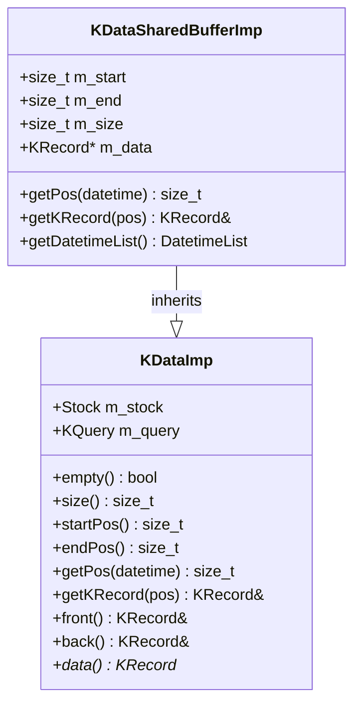
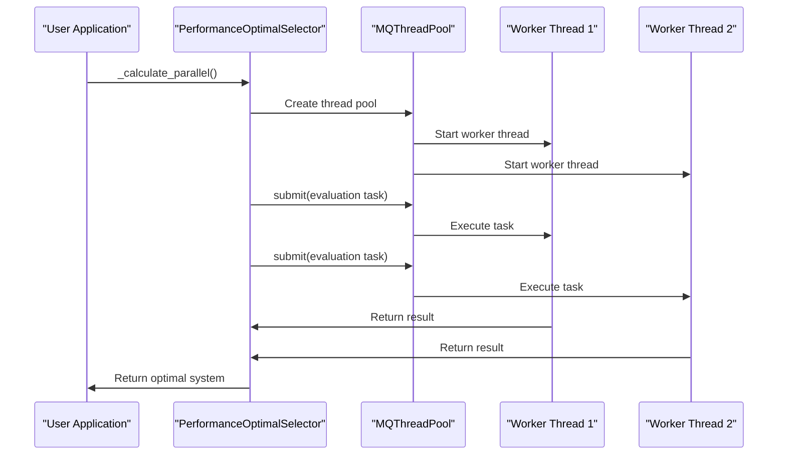
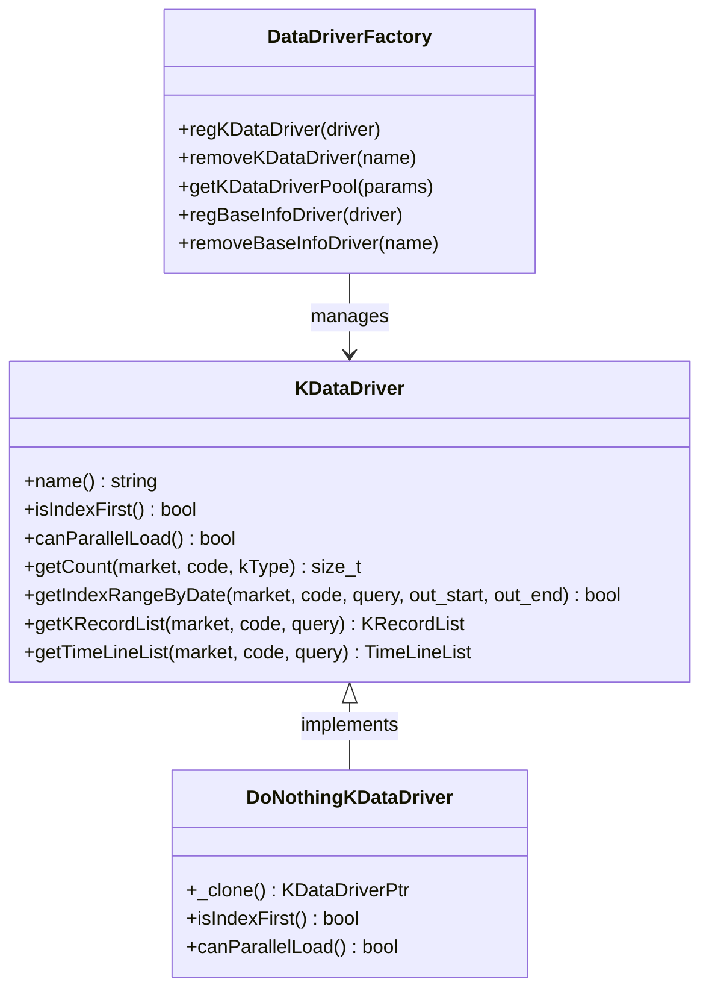

# Advanced Topics

<cite>
**Referenced Files in This Document**   
- [algorithm.h](file://hikyuu_cpp/hikyuu/utilities/thread/algorithm.h)
- [KDataSharedBufferImp.h](file://hikyuu_cpp/hikyuu/KDataSharedBufferImp.h)
- [KDataSharedBufferImp.cpp](file://hikyuu_cpp/hikyuu/KDataSharedBufferImp.cpp)
- [DataDriverFactory.cpp](file://hikyuu_cpp/hikyuu/data_driver/DataDriverFactory.cpp)
- [KDataDriver.h](file://hikyuu_cpp/hikyuu/data_driver/KDataDriver.h)
- [DoNothingKDataDriver.h](file://hikyuu_cpp/hikyuu/data_driver/kdata/DoNothingKDataDriver.h)
- [PerformanceOptimalSelector.cpp](file://hikyuu_cpp/hikyuu/trade_sys/selector/imp/optimal/PerformanceOptimalSelector.cpp)
- [analysis_sys.cpp](file://hikyuu_cpp/hikyuu/analysis/analysis_sys.cpp)
- [LRUCache11.h](file://hikyuu_cpp/hikyuu/utilities/LRUCache11.h)
- [KData.h](file://hikyuu_cpp/hikyuu/KData.h)
- [MQThreadPool.h](file://hikyuu_cpp/hikyuu/utilities/thread/MQThreadPool.h)
- [GlobalMQThreadPool.h](file://hikyuu_cpp/hikyuu/utilities/thread/GlobalMQThreadPool.h)
</cite>

## Table of Contents
1. [Performance Optimization Techniques](#performance-optimization-techniques)
2. [Memory Management Strategies](#memory-management-strategies)
3. [Multi-threading Capabilities](#multi-threading-capabilities)
4. [Custom Data Sources Implementation](#custom-data-sources-implementation)
5. [Advanced Configuration and Tuning](#advanced-configuration-and-tuning)
6. [Common Challenges and Solutions](#common-challenges-and-solutions)

## Performance Optimization Techniques

Hikyuu implements several performance optimization techniques to improve strategy execution speed and data processing efficiency. The framework leverages parallel processing at multiple levels to maximize computational efficiency. The core parallelization mechanism is provided by the `parallel_for_index` and `parallel_for_range` templates in the utilities/thread/algorithm.h file, which distribute workloads across available CPU cores based on hardware concurrency.

The framework employs algorithmic optimizations such as efficient range partitioning that divides workloads into chunks proportional to the number of available CPU cores. For uneven workloads, remaining tasks are distributed as single-unit chunks to ensure balanced processing. This approach minimizes idle time and maximizes CPU utilization during intensive operations like backtesting multiple strategies or processing large datasets.

In strategy analysis, the `findOptimalSystemMulti` function in analysis_sys.cpp demonstrates optimized execution by processing system lists in parallel, significantly reducing computation time for portfolio optimization tasks. The implementation includes error handling to ensure robustness during parallel execution, with proper exception handling to prevent thread crashes from affecting the entire process.

**Section sources**
- [algorithm.h](file://hikyuu_cpp/hikyuu/utilities/thread/algorithm.h#L47-L116)
- [analysis_sys.cpp](file://hikyuu_cpp/hikyuu/analysis/analysis_sys.cpp#L105-L144)

## Memory Management Strategies

Hikyuu employs sophisticated memory management strategies to handle large datasets efficiently while minimizing memory footprint and preventing leaks. The framework uses shared memory buffers through the `KDataSharedBufferImp` class, which allows multiple components to access the same underlying data without duplication. This approach reduces memory consumption when multiple strategies or indicators access the same historical data.

The memory management system implements a reference counting mechanism through smart pointers, ensuring that data is only kept in memory as long as it's needed by active components. When the last reference to a data block is released, the memory is automatically reclaimed. The `KDataSharedBufferImp` implementation provides direct access to the underlying KRecord array through the `data()` method, enabling zero-copy data access for performance-critical operations.

For caching frequently accessed data, Hikyuu utilizes an LRU (Least Recently Used) cache implementation based on the LRUCache11 library. This cache stores recently accessed data blocks and automatically evicts the least recently used items when memory limits are reached, providing an optimal balance between memory usage and data access speed.

**Diagram sources**
- [KDataSharedBufferImp.h](file://hikyuu_cpp/hikyuu/KDataSharedBufferImp.h#L1-L69)
- [KDataSharedBufferImp.cpp](file://hikyuu_cpp/hikyuu/KDataSharedBufferImp.cpp#L1-L61)

**Section sources**
- [KDataSharedBufferImp.h](file://hikyuu_cpp/hikyuu/KDataSharedBufferImp.h#L1-L69)
- [KDataSharedBufferImp.cpp](file://hikyuu_cpp/hikyuu/KDataSharedBufferImp.cpp#L1-L61)
- [LRUCache11.h](file://hikyuu_cpp/hikyuu/utilities/LRUCache11.h#L1-L230)

## Multi-threading Capabilities

Hikyuu provides comprehensive multi-threading capabilities that enable parallel processing of multiple strategies or data streams. The framework implements a multi-queue thread pool (MQThreadPool) architecture that distributes tasks across multiple worker threads, allowing for concurrent execution of independent operations. The thread pool automatically scales to the number of available CPU cores, optimizing resource utilization.

The `MQThreadPool` class provides a submit method that accepts any callable function and returns a future for result retrieval. This design enables asynchronous execution of computationally intensive tasks such as backtesting, data processing, and indicator calculations. The thread pool uses a work-stealing algorithm to balance the load across threads, ensuring that no thread remains idle while others are overloaded.

For strategy optimization, the `PerformanceOptimalSelector` class demonstrates advanced multi-threading by parallelizing the evaluation of multiple trading systems. The `_calculate_parallel` method uses `parallel_for_index` to distribute system evaluations across available threads, significantly reducing optimization time. Each thread operates on a cloned system instance to prevent data races and ensure thread safety.

**Diagram sources**
- [MQThreadPool.h](file://hikyuu_cpp/hikyuu/utilities/thread/MQThreadPool.h#L49-L145)
- [PerformanceOptimalSelector.cpp](file://hikyuu_cpp/hikyuu/trade_sys/selector/imp/optimal/PerformanceOptimalSelector.cpp#L163-L253)

**Section sources**
- [algorithm.h](file://hikyuu_cpp/hikyuu/utilities/thread/algorithm.h#L47-L116)
- [MQThreadPool.h](file://hikyuu_cpp/hikyuu/utilities/thread/MQThreadPool.h#L49-L145)
- [PerformanceOptimalSelector.cpp](file://hikyuu_cpp/hikyuu/trade_sys/selector/imp/optimal/PerformanceOptimalSelector.cpp#L163-L253)

## Custom Data Sources Implementation

Hikyuu supports the implementation of custom data sources beyond the built-in options through its extensible data driver architecture. The framework provides a plugin system that allows developers to create and register custom data drivers for various data formats and sources. The `DataDriverFactory` class serves as the central registry for all data drivers, enabling dynamic loading and management of different data source implementations.

To implement a custom data source, developers need to create a class that inherits from the appropriate base driver class (such as `KDataDriver`) and implement the required virtual methods. The `DoNothingKDataDriver` example demonstrates the minimal implementation required, including the `name()`, `isIndexFirst()`, and `canParallelLoad()` methods. Custom drivers can then be registered with the factory using the `regKDataDriver` method, making them available for use throughout the framework.

The data driver interface supports various data access patterns, including random access by date range, sequential access, and bulk loading. Drivers can also specify whether they support parallel loading through the `canParallelLoad()` method, allowing the framework to optimize data retrieval strategies based on the capabilities of each driver.

**Diagram sources**
- [DataDriverFactory.cpp](file://hikyuu_cpp/hikyuu/data_driver/DataDriverFactory.cpp#L45-L202)
- [KDataDriver.h](file://hikyuu_cpp/hikyuu/data_driver/KDataDriver.h#L163-L202)
- [DoNothingKDataDriver.h](file://hikyuu_cpp/hikyuu/data_driver/kdata/DoNothingKDataDriver.h#L1-L33)

**Section sources**
- [DataDriverFactory.cpp](file://hikyuu_cpp/hikyuu/data_driver/DataDriverFactory.cpp#L45-L202)
- [KDataDriver.h](file://hikyuu_cpp/hikyuu/data_driver/KDataDriver.h#L163-L202)
- [DoNothingKDataDriver.h](file://hikyuu_cpp/hikyuu/data_driver/kdata/DoNothingKDataDriver.h#L1-L33)

## Advanced Configuration and Tuning

Hikyuu offers extensive configuration options and tuning parameters for specialized use cases. The framework's configuration system is designed to be flexible and extensible, allowing users to customize behavior at multiple levels. The `DataDriverFactory` initialization process demonstrates this flexibility by conditionally registering drivers based on compile-time flags (e.g., HKU_ENABLE_SQLITE_KDATA, HKU_ENABLE_MYSQL_KDATA), enabling selective inclusion of database backends.

Advanced configuration options include thread pool sizing, cache capacity settings, and data loading strategies. The LRU cache implementation allows tuning of both maximum size and elasticity parameters, which control the soft and hard limits of the cache respectively. This enables users to balance memory usage against performance requirements based on their specific hardware constraints and data access patterns.

For performance tuning, the framework provides multiple thread pool implementations with different characteristics. The `GlobalMQThreadPool` is designed for long-running applications where the thread pool persists for the entire program lifetime, while the `MQThreadPool` is suitable for shorter-lived operations. Users can select the appropriate pool type based on their application's threading requirements and lifetime expectations.

**Section sources**
- [DataDriverFactory.cpp](file://hikyuu_cpp/hikyuu/data_driver/DataDriverFactory.cpp#L45-L202)
- [GlobalMQThreadPool.h](file://hikyuu_cpp/hikyuu/utilities/thread/GlobalMQThreadPool.h#L48-L142)
- [LRUCache11.h](file://hikyuu_cpp/hikyuu/utilities/LRUCache11.h#L101-L102)

## Common Challenges and Solutions

When working with large datasets or complex strategies in Hikyuu, users may encounter several common challenges. One frequent issue is memory pressure when loading extensive historical data. The solution is to leverage the framework's shared buffer system and LRU caching, which automatically manages memory usage by sharing data between components and evicting least recently used items.

Another challenge is thread safety when accessing shared data structures. Hikyuu addresses this through careful design of its parallel processing system, where each worker thread operates on cloned instances of trading systems to prevent data races. The `PerformanceOptimalSelector` explicitly clones systems before running them in parallel, ensuring that each thread has its own isolated copy of the strategy state.

Performance bottlenecks in data loading can be mitigated by implementing custom data drivers that support parallel loading (indicated by returning true from `canParallelLoad()`). This allows the framework to distribute data retrieval operations across multiple threads, significantly improving throughput for I/O-bound operations.

For users experiencing slow strategy optimization, the solution is to ensure proper utilization of the multi-threading capabilities. This includes verifying that the thread pool is correctly configured and that computationally intensive operations are being parallelized effectively. Monitoring tools can help identify whether CPU resources are being fully utilized or if there are bottlenecks in the processing pipeline.

**Section sources**
- [PerformanceOptimalSelector.cpp](file://hikyuu_cpp/hikyuu/trade_sys/selector/imp/optimal/PerformanceOptimalSelector.cpp#L180-L214)
- [KDataSharedBufferImp.h](file://hikyuu_cpp/hikyuu/KDataSharedBufferImp.h#L1-L69)
- [algorithm.h](file://hikyuu_cpp/hikyuu/utilities/thread/algorithm.h#L47-L116)