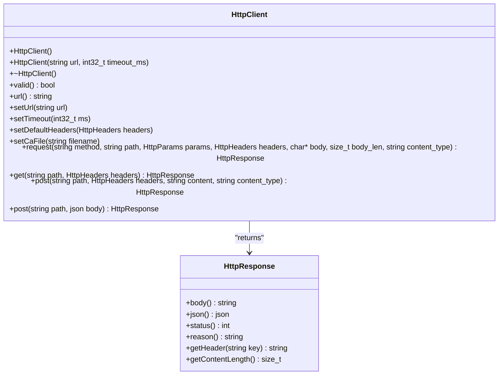
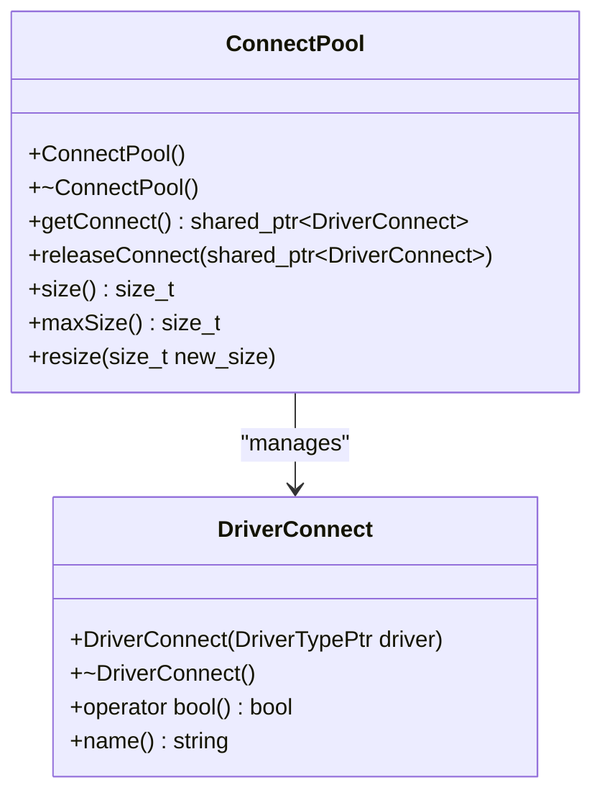
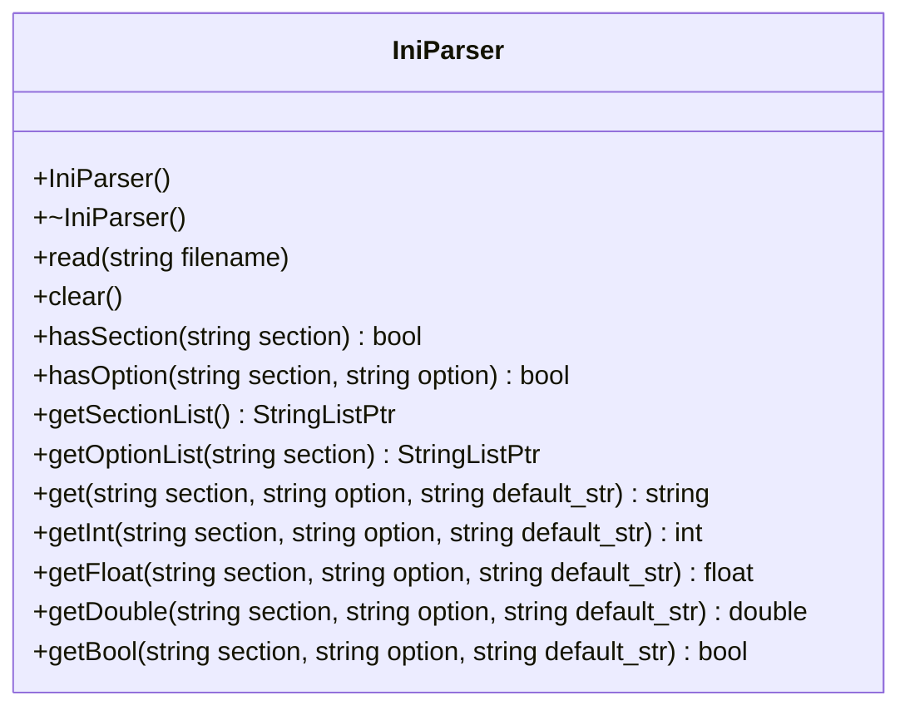
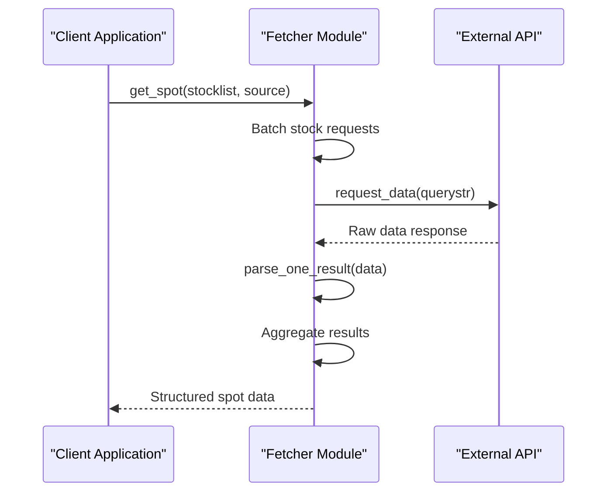
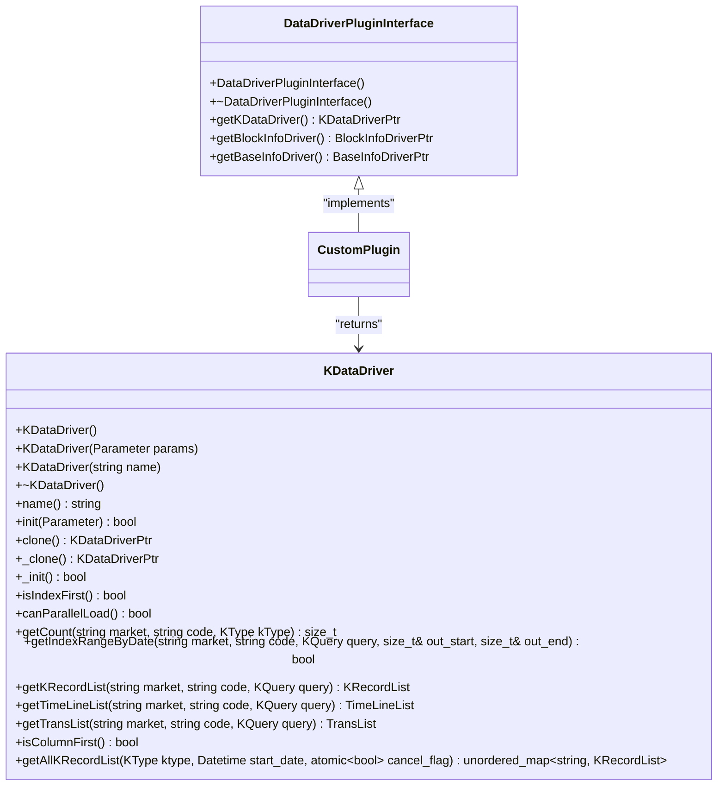
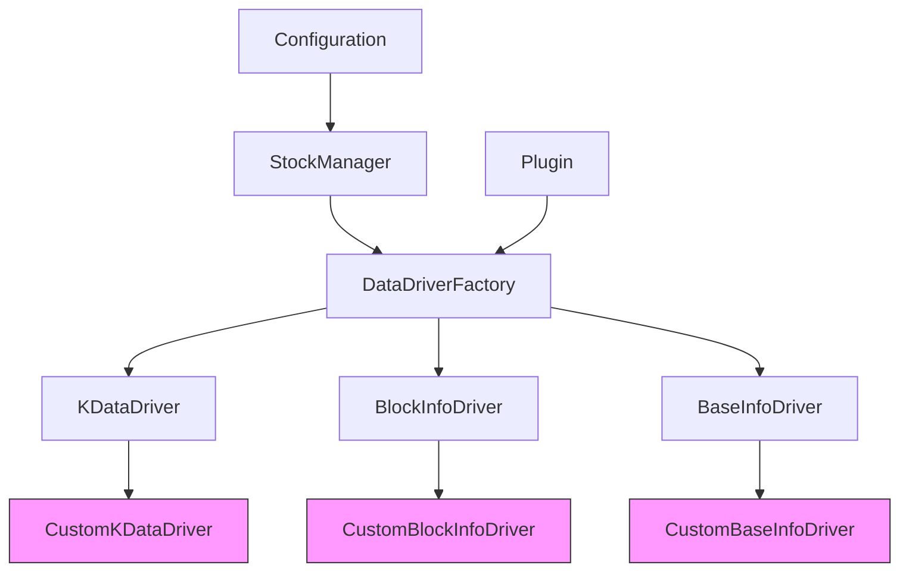

# Custom Data Sources

<cite>
**Referenced Files in This Document**   
- [HttpClient.h](file://hikyuu_cpp/hikyuu/utilities/http_client/HttpClient.h)
- [IniParser.h](file://hikyuu_cpp/hikyuu/utilities/ini_parser/IniParser.h)
- [DataDriverPluginInterface.h](file://hikyuu_cpp/hikyuu/plugin/interface/DataDriverPluginInterface.h)
- [DataDriverFactory.cpp](file://hikyuu_cpp/hikyuu/data_driver/DataDriverFactory.cpp)
- [StockManager.cpp](file://hikyuu_cpp/hikyuu/StockManager.cpp)
- [zh_stock_a_sina_qq.py](file://hikyuu/fetcher/stock/zh_stock_a_sina_qq.py)
- [zh_stock_a_qmt.py](file://hikyuu/fetcher/stock/zh_stock_a_qmt.py)
- [KDataDriver.h](file://hikyuu_cpp/hikyuu/data_driver/KDataDriver.h)
- [BaseInfoDriver.h](file://hikyuu_cpp/hikyuu/data_driver/BaseInfoDriver.h)
- [ConnectPool.h](file://hikyuu_cpp/hikyuu/utilities/ConnectPool.h)
- [PluginBase.h](file://hikyuu_cpp/hikyuu/utilities/plugin/PluginBase.h)
</cite>

## Table of Contents
1. [Introduction](#introduction)
2. [Core Components](#core-components)
3. [HTTP Client for REST API Integration](#http-client-for-rest-api-integration)
4. [Database Connectivity Utilities](#database-connectivity-utilities)
5. [Configuration Management with IniParser](#configuration-management-with-iniparser)
6. [Fetcher Module and Data Source Implementation](#fetcher-module-and-data-source-implementation)
7. [Creating a New Data Source Plugin](#creating-a-new-data-source-plugin)
8. [Data Normalization and Error Handling](#data-normalization-and-error-handling)
9. [Integration with Data Driver Architecture](#integration-with-data-driver-architecture)
10. [Best Practices and Recommendations](#best-practices-and-recommendations)

## Introduction
This document provides comprehensive guidance on implementing custom data sources in the Hikyuu financial analysis framework. It covers the essential components for connecting to external data providers through REST APIs and databases, managing configuration through INI files, and integrating with the core data driver architecture. The documentation focuses on practical implementation patterns based on existing data source implementations such as Sina/QQ and EM, providing a clear path for extending the framework with new data providers.

## Core Components
The Hikyuu framework employs a modular architecture for data source integration, with distinct components handling HTTP communication, database connectivity, configuration management, and data driver registration. The system is designed to support both real-time market data fetching and historical data storage through various database backends. The architecture separates concerns between data acquisition (fetcher module), data storage (data driver), and configuration management (IniParser), enabling flexible integration of new data sources.

**Section sources**
- [HttpClient.h](file://hikyuu_cpp/hikyuu/utilities/http_client/HttpClient.h)
- [IniParser.h](file://hikyuu_cpp/hikyuu/utilities/ini_parser/IniParser.h)
- [DataDriverPluginInterface.h](file://hikyuu_cpp/hikyuu/plugin/interface/DataDriverPluginInterface.h)

## HTTP Client for REST API Integration
The HttpClient class provides a robust interface for connecting to REST APIs and web services for financial data. Implemented using the NNG library, it supports synchronous HTTP requests with configurable timeouts, headers, and SSL/TLS settings. The client handles various HTTP methods including GET, POST, and JSON payloads, making it suitable for interacting with modern financial data APIs.

The HttpResponse class encapsulates the response from HTTP requests, providing access to the response body, status code, headers, and JSON parsing capabilities. This allows for easy extraction of financial data from API responses in various formats.

**Diagram sources**
- [HttpClient.h](file://hikyuu_cpp/hikyuu/utilities/http_client/HttpClient.h)

**Section sources**
- [HttpClient.h](file://hikyuu_cpp/hikyuu/utilities/http_client/HttpClient.h)

## Database Connectivity Utilities
Hikyuu provides database connectivity utilities through a connection pool mechanism that supports multiple database types including MySQL, SQLite, and ClickHouse. The ConnectPool class manages database connections efficiently, reducing the overhead of establishing new connections for each data operation.

The framework uses a plugin-based architecture for database drivers, allowing for easy extension to support additional database systems. The DataDriverFactory registers and manages different data drivers, which can be configured through parameters specifying the database type and connection details.

**Diagram sources**
- [ConnectPool.h](file://hikyuu_cpp/hikyuu/utilities/ConnectPool.h)

**Section sources**
- [ConnectPool.h](file://hikyuu_cpp/hikyuu/utilities/ConnectPool.h)
- [DataDriverFactory.cpp](file://hikyuu_cpp/hikyuu/data_driver/DataDriverFactory.cpp)

## Configuration Management with IniParser
The IniParser class provides a simple interface for reading and parsing INI configuration files, which are used extensively in Hikyuu for storing data source configurations. The parser supports reading configuration values as strings, integers, floats, doubles, and booleans, with optional default values for missing entries.

Configuration sections and options can be queried dynamically, allowing for flexible configuration of data sources. The parser handles common INI file syntax including sections, key-value pairs, and comments, making it easy to manage connection parameters, API keys, and other data source settings.

**Diagram sources**
- [IniParser.h](file://hikyuu_cpp/hikyuu/utilities/ini_parser/IniParser.h)

**Section sources**
- [IniParser.h](file://hikyuu_cpp/hikyuu/utilities/ini_parser/IniParser.h)

## Fetcher Module and Data Source Implementation
The fetcher module contains implementations for various data sources, with the zh_stock_a_sina_qq.py and zh_stock_a_qmt.py files serving as examples of how to integrate with different data providers. These implementations demonstrate the pattern of requesting data from external sources, parsing the responses, and returning structured data that can be used by the core framework.

The fetcher functions typically follow a pattern of batching requests to improve efficiency, parsing the raw data into a standardized format, and optionally processing the data through a callback function for immediate storage or analysis. Error handling is implemented using decorators that catch exceptions and log warnings, ensuring that failures in data fetching do not crash the entire application.

**Diagram sources**
- [zh_stock_a_sina_qq.py](file://hikyuu/fetcher/stock/zh_stock_a_sina_qq.py)
- [zh_stock_a_qmt.py](file://hikyuu/fetcher/stock/zh_stock_a_qmt.py)

**Section sources**
- [zh_stock_a_sina_qq.py](file://hikyuu/fetcher/stock/zh_stock_a_sina_qq.py)
- [zh_stock_a_qmt.py](file://hikyuu/fetcher/stock/zh_stock_a_qmt.py)

## Creating a New Data Source Plugin
To create a new data source plugin, implement the DataDriverPluginInterface which requires three factory methods: getKDataDriver, getBlockInfoDriver, and getBaseInfoDriver. These methods return instances of the corresponding driver classes that handle K-line data, block information, and base information respectively.

The plugin should be registered with the DataDriverFactory during initialization, typically through the StockManager which reads configuration parameters and loads the appropriate plugins based on the specified data source type. The plugin architecture allows for dynamic loading of data drivers without modifying the core framework.

**Diagram sources**
- [DataDriverPluginInterface.h](file://hikyuu_cpp/hikyuu/plugin/interface/DataDriverPluginInterface.h)
- [KDataDriver.h](file://hikyuu_cpp/hikyuu/data_driver/KDataDriver.h)

**Section sources**
- [DataDriverPluginInterface.h](file://hikyuu_cpp/hikyuu/plugin/interface/DataDriverPluginInterface.h)
- [KDataDriver.h](file://hikyuu_cpp/hikyuu/data_driver/KDataDriver.h)
- [StockManager.cpp](file://hikyuu_cpp/hikyuu/StockManager.cpp)

## Data Normalization and Error Handling
When implementing custom data sources, it's essential to handle data normalization to ensure consistency across different providers. This includes standardizing date/time formats, price precision, volume units, and field names. The framework expects data to be returned in a standardized format regardless of the source, requiring transformation of provider-specific data structures.

Error handling should be comprehensive, addressing network failures, rate limiting, authentication issues, and data parsing errors. The use of timeouts and retry mechanisms is recommended to handle transient network issues. For rate-limited APIs, implement request throttling to avoid being blocked by the provider.

Authentication credentials should be managed securely through configuration files rather than being hardcoded in the source code. The IniParser can be used to read API keys and other sensitive information from configuration files that are not included in version control.

**Section sources**
- [zh_stock_a_sina_qq.py](file://hikyuu/fetcher/stock/zh_stock_a_sina_qq.py)
- [HttpClient.h](file://hikyuu_cpp/hikyuu/utilities/http_client/HttpClient.h)

## Integration with Data Driver Architecture
Custom data sources integrate with the existing data driver architecture through the DataDriverFactory, which acts as a registry and factory for different data drivers. When a data source is configured in the system, the StockManager reads the configuration parameters and requests the appropriate driver from the factory.

The factory pattern allows for multiple implementations of the same data driver interface, enabling the system to support various storage backends and data sources. The connection pool mechanism ensures efficient reuse of database connections, while the plugin architecture allows for dynamic loading of data drivers without recompiling the core framework.

**Diagram sources**
- [DataDriverFactory.cpp](file://hikyuu_cpp/hikyuu/data_driver/DataDriverFactory.cpp)
- [StockManager.cpp](file://hikyuu_cpp/hikyuu/StockManager.cpp)

**Section sources**
- [DataDriverFactory.cpp](file://hikyuu_cpp/hikyuu/data_driver/DataDriverFactory.cpp)
- [StockManager.cpp](file://hikyuu_cpp/hikyuu/StockManager.cpp)

## Best Practices and Recommendations
When implementing custom data sources in Hikyuu, follow these best practices:

1. **Use connection pooling**: Leverage the ConnectPool class to manage database connections efficiently and avoid the overhead of establishing new connections for each request.

2. **Implement proper error handling**: Use try-catch blocks and logging to handle network failures, parsing errors, and other exceptions gracefully.

3. **Respect rate limits**: Implement request throttling for APIs with rate limits to avoid being blocked by the provider.

4. **Secure authentication**: Store API keys and credentials in configuration files rather than hardcoding them in the source code.

5. **Normalize data**: Transform provider-specific data formats into the standardized format expected by the Hikyuu framework.

6. **Use batch requests**: Where possible, batch multiple data requests into a single API call to improve efficiency.

7. **Handle time zones correctly**: Ensure date/time values are properly converted to the framework's expected time zone (typically UTC or local exchange time).

8. **Document configuration requirements**: Provide clear documentation of the configuration parameters needed for your data source.

9. **Test thoroughly**: Verify that your implementation handles edge cases, error conditions, and large data volumes correctly.

10. **Follow existing patterns**: Use the Sina/QQ and EM implementations as reference models for structuring your code.

**Section sources**
- [zh_stock_a_sina_qq.py](file://hikyuu/fetcher/stock/zh_stock_a_sina_qq.py)
- [HttpClient.h](file://hikyuu_cpp/hikyuu/utilities/http_client/HttpClient.h)
- [IniParser.h](file://hikyuu_cpp/hikyuu/utilities/ini_parser/IniParser.h)