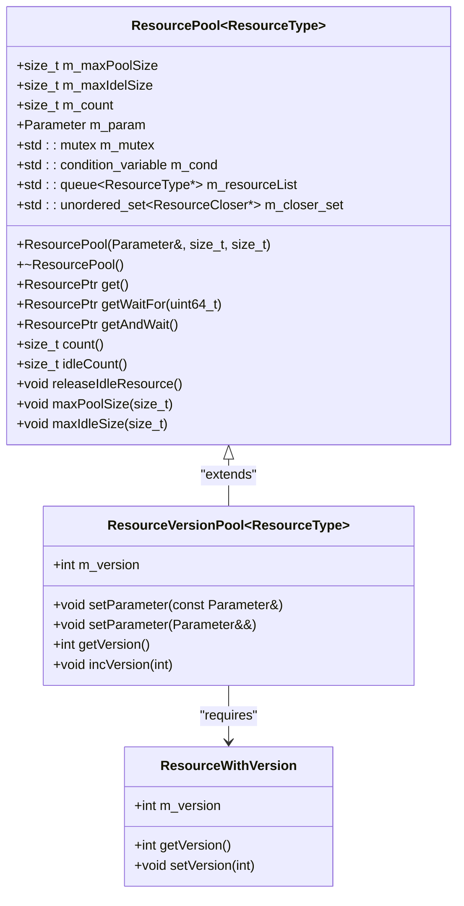
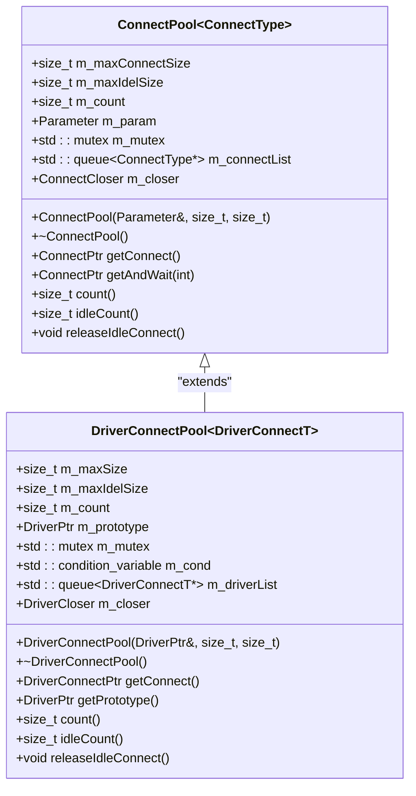
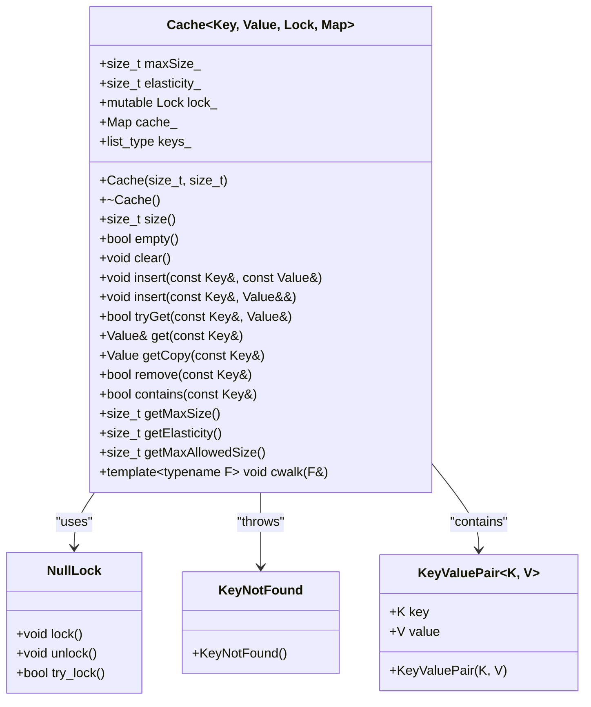

# Memory Management

<cite>
**Referenced Files in This Document**   
- [ResourcePool.h](file://hikyuu_cpp/hikyuu/utilities/ResourcePool.h)
- [ConnectPool.h](file://hikyuu_cpp/hikyuu/utilities/ConnectPool.h)
- [LRUCache11.h](file://hikyuu_cpp/hikyuu/utilities/LRUCache11.h)
- [Parameter.h](file://hikyuu_cpp/hikyuu/utilities/Parameter.h)
- [Parameter.cpp](file://hikyuu_cpp/hikyuu/utilities/Parameter.cpp)
- [DriverConnectPool.h](file://hikyuu_cpp/hikyuu/data_driver/DriverConnectPool.h)
</cite>

## Table of Contents
1. [Introduction](#introduction)
2. [Resource Pooling](#resource-pooling)
3. [Connection Pooling](#connection-pooling)
4. [LRU Cache Implementation](#lru-cache-implementation)
5. [Parameter Management](#parameter-management)
6. [Memory Management Trade-offs](#memory-management-trade-offs)
7. [Performance Tuning Guidelines](#performance-tuning-guidelines)
8. [Common Memory Issues](#common-memory-issues)
9. [Conclusion](#conclusion)

## Introduction

Hikyuu implements a comprehensive memory management system designed specifically for quantitative trading applications that handle large datasets and require high performance. The framework employs several sophisticated techniques to optimize memory usage, reduce allocation overhead, and prevent common memory-related issues. This document details the key components of Hikyuu's memory management architecture, including resource pooling, connection pooling, LRU caching, and parameter management.

The memory management system is particularly important in quantitative trading scenarios where applications must process vast amounts of market data efficiently while maintaining low latency. Hikyuu's approach balances memory usage with performance requirements, providing mechanisms to handle large datasets without excessive memory allocation or garbage collection overhead.

**Section sources**
- [ResourcePool.h](file://hikyuu_cpp/hikyuu/utilities/ResourcePool.h#L1-L636)
- [ConnectPool.h](file://hikyuu_cpp/hikyuu/utilities/ConnectPool.h#L1-L163)
- [LRUCache11.h](file://hikyuu_cpp/hikyuu/utilities/LRUCache11.h#L1-L230)

## Resource Pooling

Hikyuu implements a sophisticated resource pooling mechanism through the `ResourcePool` template class, which provides efficient reuse of expensive-to-create resources. The resource pool follows the object pool design pattern, maintaining a collection of pre-initialized resources that can be reused without the overhead of repeated creation and destruction.



**Diagram sources**
- [ResourcePool.h](file://hikyuu_cpp/hikyuu/utilities/ResourcePool.h#L56-L632)

The `ResourcePool` class provides several key features:

- **Configurable limits**: The pool allows setting maximum pool size and maximum idle resources through constructor parameters
- **Thread-safe operations**: Uses mutex and condition variables to ensure thread safety in concurrent environments
- **Exception handling**: Provides specific exceptions for resource timeout and creation failures
- **Smart pointer integration**: Returns resources as `std::shared_ptr` with custom deleters that return resources to the pool

The `ResourceVersionPool` extends the basic resource pool by adding version management capabilities. When parameters change, the pool increments its version number and releases all idle resources, ensuring that new resources are created with updated parameters while allowing existing resources to complete their operations before being destroyed.

**Section sources**
- [ResourcePool.h](file://hikyuu_cpp/hikyuu/utilities/ResourcePool.h#L56-L632)

## Connection Pooling

Hikyuu provides a specialized connection pooling mechanism through the `ConnectPool` and `DriverConnectPool` classes, optimized for database and data driver connections in quantitative trading applications.



**Diagram sources**
- [ConnectPool.h](file://hikyuu_cpp/hikyuu/utilities/ConnectPool.h#L24-L163)
- [DriverConnectPool.h](file://hikyuu_cpp/hikyuu/data_driver/DriverConnectPool.h#L23-L147)

The connection pooling system offers several advantages for trading applications:

- **Reduced connection overhead**: Database connections are expensive to establish; pooling eliminates this overhead
- **Configurable sizing**: Maximum connections and idle connections can be tuned based on system resources
- **Automatic resource cleanup**: The pool automatically releases idle connections when limits are exceeded
- **Thread safety**: Mutex protection ensures safe concurrent access from multiple threads

The `DriverConnectPool` is a specialized version designed for data drivers, which maintains a prototype of the driver and uses its clone method to create new connections. This ensures consistency across pooled connections while allowing for efficient resource reuse.

**Section sources**
- [ConnectPool.h](file://hikyuu_cpp/hikyuu/utilities/ConnectPool.h#L24-L163)
- [DriverConnectPool.h](file://hikyuu_cpp/hikyuu/data_driver/DriverConnectPool.h#L23-L147)

## LRU Cache Implementation

Hikyuu employs an efficient LRU (Least Recently Used) cache implementation based on the `LRUCache11` library, optimized for caching frequently accessed data in quantitative trading scenarios.



**Diagram sources**
- [LRUCache11.h](file://hikyuu_cpp/hikyuu/utilities/LRUCache11.h#L82-L230)

The LRU cache implementation provides several key features:

- **O(1) operations**: Uses a combination of hash map and linked list to achieve constant time complexity for insert, delete, and refresh operations
- **Configurable size limits**: Supports both soft and hard size limits with elasticity parameter
- **Thread safety options**: Can be made thread-safe by specifying a mutex as the lock type
- **Memory pressure management**: Automatically prunes the cache when it exceeds the maximum allowed size

In trading applications, this cache is particularly effective for storing frequently accessed market data, technical indicators, or configuration information that would be expensive to recompute or retrieve from external sources.

**Section sources**
- [LRUCache11.h](file://hikyuu_cpp/hikyuu/utilities/LRUCache11.h#L82-L230)

## Parameter Management

Hikyuu's `Parameter` class provides an efficient mechanism for storing and retrieving configuration data, using `boost::any` to support multiple data types while maintaining type safety.

```mermaid
flowchart TD
Start([Parameter Creation]) --> AddParam["Add Parameter\nset<int>(\"n\", 10)"]
AddParam --> Store["Store in\nparam_map_t m_params"]
Store --> Retrieve["Retrieve Parameter\nget<int>(\"n\")"]
Retrieve --> CheckType{"Type Check?"}
CheckType --> |Valid| Return["Return Value"]
CheckType --> |Invalid| Throw["Throw Exception"]
Store --> Modify["Modify Parameter\nset<int>(\"n\", 20)"]
Modify --> Validate["Validate Type\nEnsure type consistency"]
Validate --> Update["Update in map"]
Update --> End([Parameter Ready])
style Start fill:#f9f,stroke:#333
style End fill:#f9f,stroke:#333
```

**Diagram sources**
- [Parameter.h](file://hikyuu_cpp/hikyuu/utilities/Parameter.h#L106-L512)
- [Parameter.cpp](file://hikyuu_cpp/hikyuu/utilities/Parameter.cpp#L1-L252)

The parameter management system offers several advantages:

- **Type safety**: Uses `boost::any` with runtime type checking to ensure type consistency
- **Supported types**: Includes int, bool, double, string, and various domain-specific types like Stock, Block, and KData
- **Efficient storage**: Uses a map for O(log n) lookup performance
- **Serialization support**: Can be serialized for persistence or inter-process communication

The `PARAMETER_SUPPORT` and `PARAMETER_SUPPORT_WITH_CHECK` macros simplify the integration of parameter management into other classes, providing a consistent interface for parameter handling across the framework.

**Section sources**
- [Parameter.h](file://hikyuu_cpp/hikyuu/utilities/Parameter.h#L106-L512)
- [Parameter.cpp](file://hikyuu_cpp/hikyuu/utilities/Parameter.cpp#L1-L252)

## Memory Management Trade-offs

Hikyuu's memory management design involves several important trade-offs between memory usage and performance that are particularly relevant in quantitative trading scenarios:

### Resource Pooling Trade-offs
- **Memory vs. CPU**: Maintaining idle resources consumes memory but reduces CPU overhead from repeated creation/destruction
- **Latency vs. Throughput**: Blocking on resource exhaustion ensures fairness but may increase latency; non-blocking approaches improve latency but may reduce throughput
- **Complexity vs. Efficiency**: The versioned resource pool adds complexity but ensures parameter consistency across resources

### Caching Trade-offs
- **Hit rate vs. Memory**: Larger caches improve hit rates but consume more memory
- **Staleness vs. Freshness**: Cached data may become stale, requiring mechanisms to ensure data freshness
- **Overhead vs. Benefit**: Cache maintenance has overhead that must be justified by performance benefits

### Connection Management Trade-offs
- **Connection reuse vs. Resource exhaustion**: Pooling prevents connection exhaustion but requires careful sizing
- **Idle cleanup vs. Reconnection cost**: Aggressive cleanup saves memory but increases reconnection costs
- **Thread safety vs. Performance**: Synchronization ensures thread safety but adds performance overhead

These trade-offs are carefully balanced in Hikyuu to optimize for the specific requirements of quantitative trading applications, where predictable performance and low latency are often more important than absolute memory efficiency.

**Section sources**
- [ResourcePool.h](file://hikyuu_cpp/hikyuu/utilities/ResourcePool.h#L56-L632)
- [ConnectPool.h](file://hikyuu_cpp/hikyuu/utilities/ConnectPool.h#L24-L163)
- [LRUCache11.h](file://hikyuu_cpp/hikyuu/utilities/LRUCache11.h#L82-L230)

## Performance Tuning Guidelines

To optimize memory management settings for different workload patterns in Hikyuu, consider the following guidelines:

### Resource Pool Configuration
For high-frequency trading workloads:
- Set `maxPoolSize` to match the expected concurrent usage
- Use moderate `maxIdleNum` (50-100) to balance memory usage and availability
- Monitor `count()` and `idleCount()` to adjust sizing

For batch processing workloads:
- Set `maxPoolSize` higher to accommodate bursty workloads
- Use lower `maxIdleNum` to conserve memory between batches
- Consider using `releaseIdleResource()` between processing phases

### Connection Pool Configuration
For database-intensive workloads:
- Size `maxConnect` based on database connection limits
- Set `maxIdleConnect` to CPU core count for optimal parallelism
- Monitor connection wait times to detect bottlenecks

For data retrieval workloads:
- Adjust pool size based on data source limitations
- Use appropriate timeout values in `getAndWait()`
- Implement connection health checks for long-running processes

### Cache Configuration
For frequently accessed data:
- Set `maxSize` based on working set size
- Use appropriate `elasticity` (10-20% of maxSize) for burst handling
- Choose thread-safe version (`std::mutex`) for multi-threaded access

For memory-constrained environments:
- Reduce cache sizes and increase eviction frequency
- Use `clear()` or `prune()` methods to manually manage memory
- Monitor cache hit rates to validate effectiveness

### General Recommendations
- Profile memory usage under realistic workloads
- Monitor key metrics: allocation rate, memory footprint, cache hit rates
- Adjust settings incrementally and measure impact
- Consider workload patterns (bursty vs. steady, read-heavy vs. write-heavy)

**Section sources**
- [ResourcePool.h](file://hikyuu_cpp/hikyuu/utilities/ResourcePool.h#L56-L632)
- [ConnectPool.h](file://hikyuu_cpp/hikyuu/utilities/ConnectPool.h#L24-L163)
- [LRUCache11.h](file://hikyuu_cpp/hikyuu/utilities/LRUCache11.h#L82-L230)

## Common Memory Issues

Hikyuu's memory management system addresses several common issues in trading applications:

### Memory Leaks
The framework prevents memory leaks through:
- Smart pointer usage (`std::shared_ptr`) with custom deleters
- RAII (Resource Acquisition Is Initialization) principles
- Proper cleanup in destructors
- Versioned resource pools that clean up obsolete resources

### Fragmentation
Memory fragmentation is minimized by:
- Object pooling that reuses allocated memory
- Avoiding frequent small allocations
- Using contiguous data structures where possible
- Regular cleanup of idle resources

### Excessive Allocation
The system reduces excessive allocation through:
- Resource reuse via pooling
- Caching of frequently accessed data
- Efficient parameter storage
- Batch operations that minimize allocation frequency

### Best Practices for Developers
- Use the provided pooling and caching mechanisms
- Monitor resource usage metrics
- Clean up resources promptly
- Avoid holding references to pooled resources longer than necessary
- Test under realistic memory constraints

**Section sources**
- [ResourcePool.h](file://hikyuu_cpp/hikyuu/utilities/ResourcePool.h#L56-L632)
- [ConnectPool.h](file://hikyuu_cpp/hikyuu/utilities/ConnectPool.h#L24-L163)
- [LRUCache11.h](file://hikyuu_cpp/hikyuu/utilities/LRUCache11.h#L82-L230)

## Conclusion

Hikyuu's memory management system provides a comprehensive solution for the demanding requirements of quantitative trading applications. By combining resource pooling, connection pooling, LRU caching, and efficient parameter management, the framework achieves optimal balance between memory usage and performance.

The key strengths of the system include:
- Efficient resource reuse that minimizes allocation overhead
- Configurable limits that adapt to different workload patterns
- Thread-safe operations for concurrent environments
- Automatic cleanup mechanisms that prevent memory leaks
- Type-safe parameter management for configuration data

These memory management techniques enable Hikyuu to handle large datasets efficiently while maintaining low latency and predictable performance. By following the tuning guidelines and best practices outlined in this document, developers can optimize the framework for their specific trading strategies and hardware environments.

The design demonstrates careful consideration of the trade-offs inherent in memory management, prioritizing performance and reliability while providing flexibility for different use cases. This makes Hikyuu well-suited for both high-frequency trading applications and large-scale data analysis tasks in the quantitative finance domain.