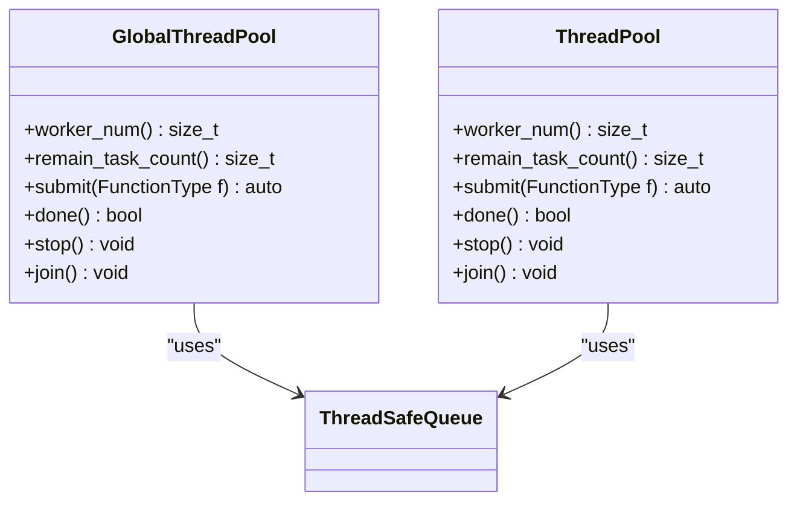
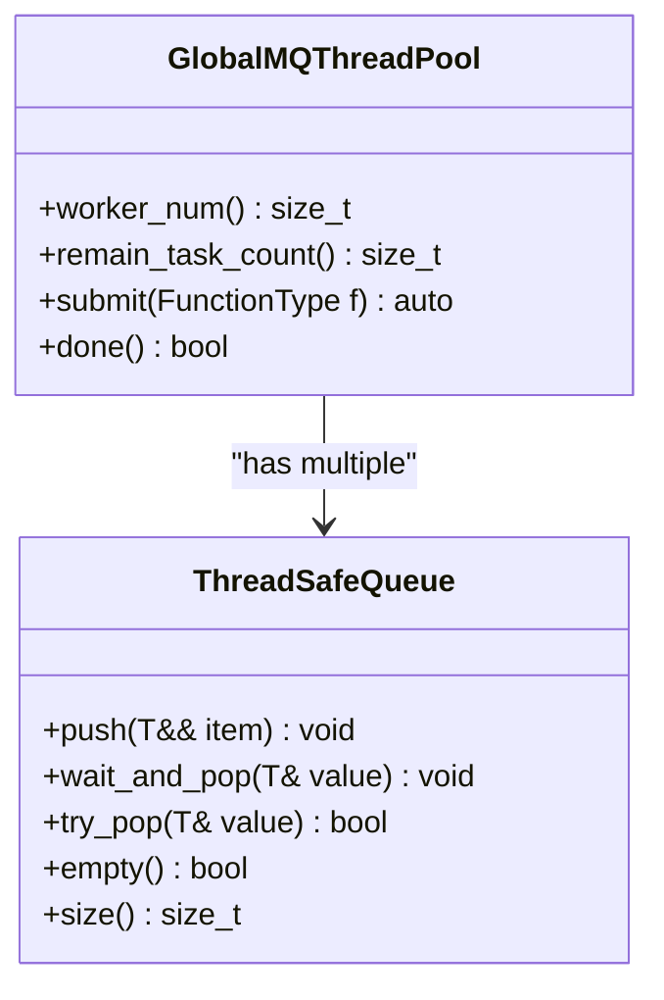
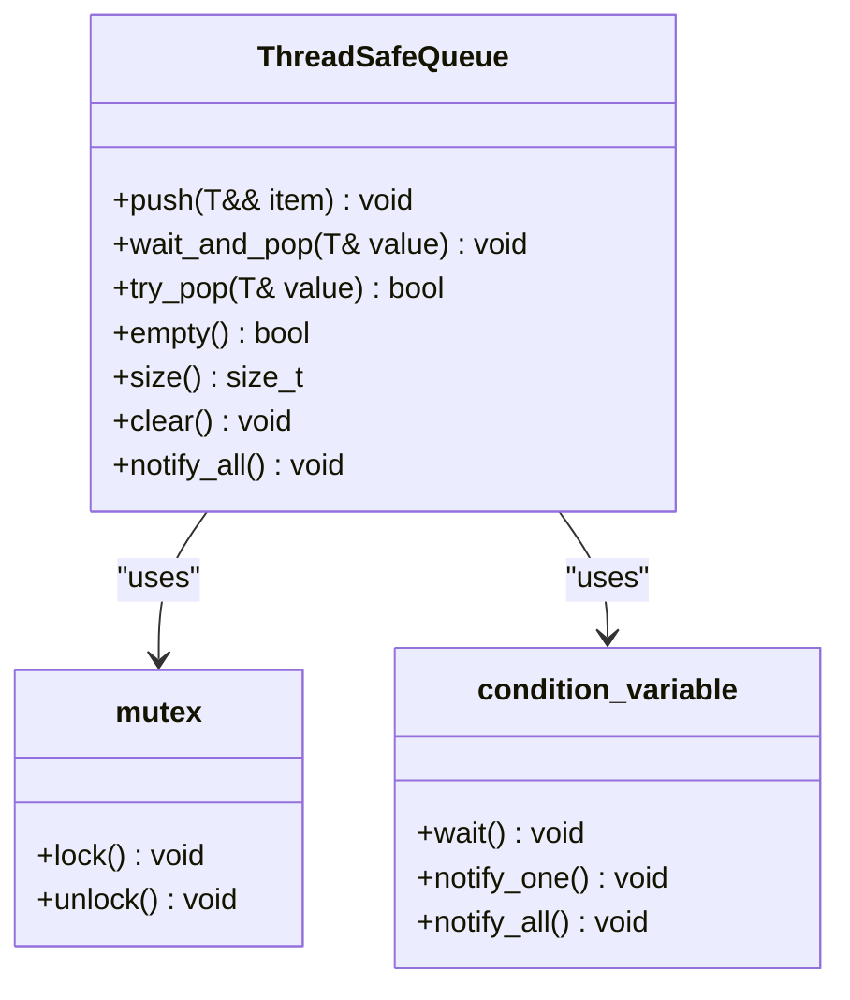
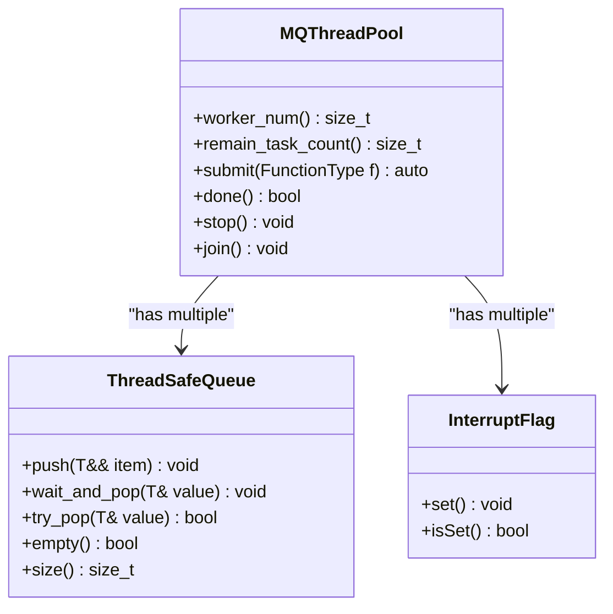
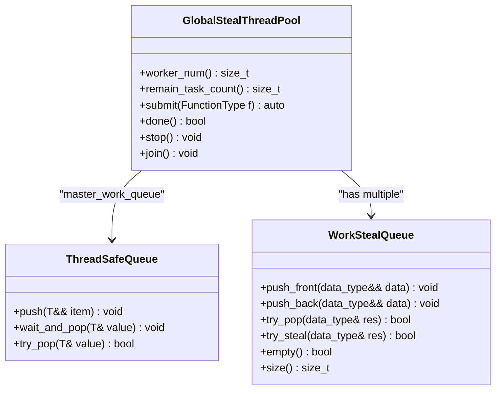
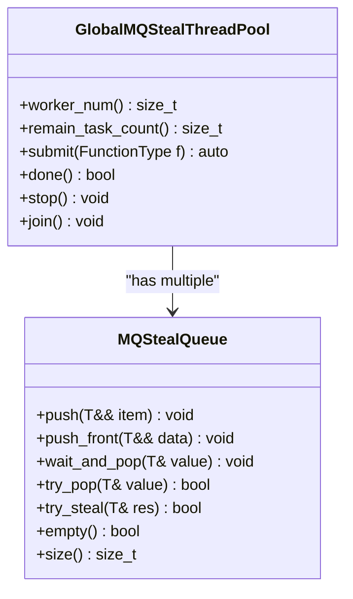
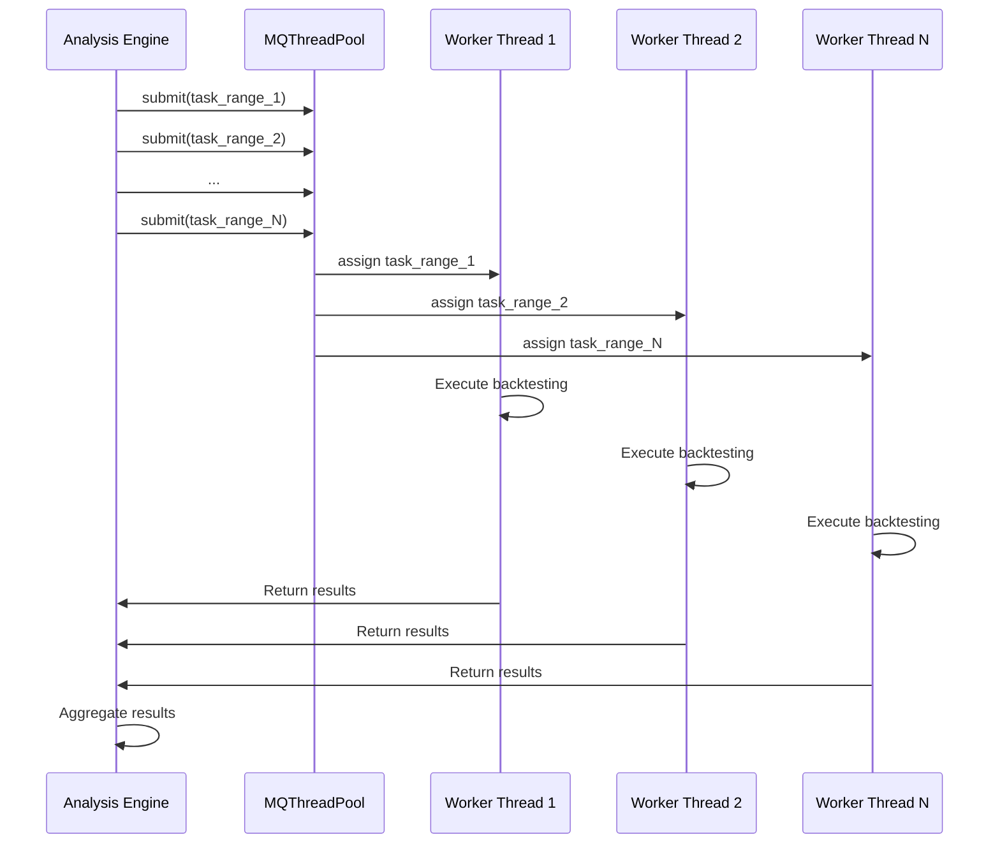
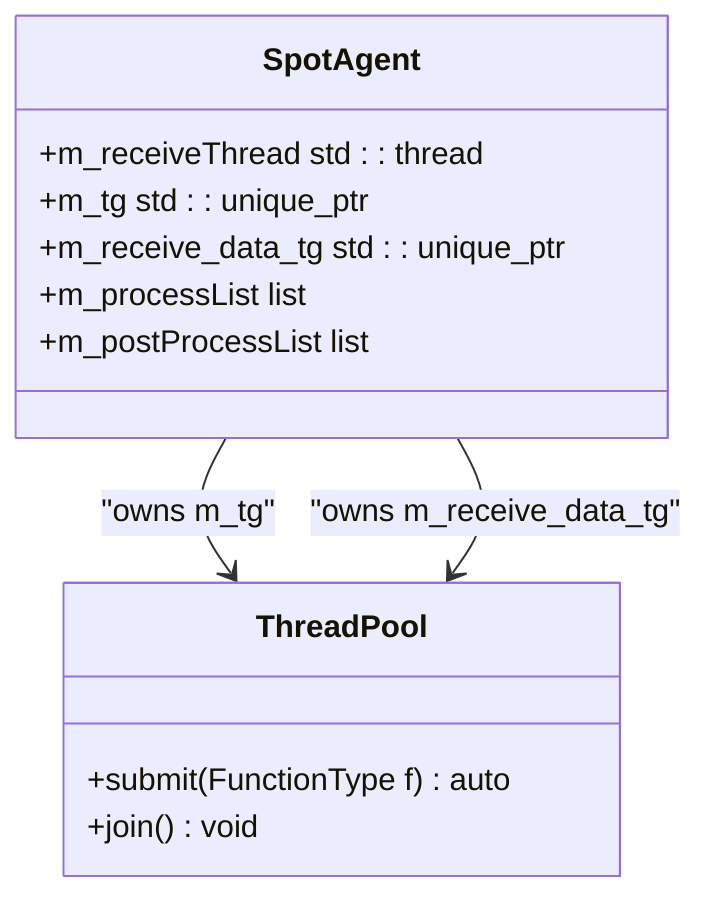

# Multi-threading

<cite>
**Referenced Files in This Document**   
- [GlobalThreadPool.h](file://hikyuu_cpp/hikyuu/utilities/thread/GlobalThreadPool.h)
- [ThreadPool.h](file://hikyuu_cpp/hikyuu/utilities/thread/ThreadPool.h)
- [GlobalStealThreadPool.h](file://hikyuu_cpp/hikyuu/utilities/thread/GlobalStealThreadPool.h)
- [GlobalMQThreadPool.h](file://hikyuu_cpp/hikyuu/utilities/thread/GlobalMQThreadPool.h)
- [GlobalMQStealThreadPool.h](file://hikyuu_cpp/hikyuu/utilities/thread/GlobalMQStealThreadPool.h)
- [ThreadSafeQueue.h](file://hikyuu_cpp/hikyuu/utilities/thread/ThreadSafeQueue.h)
- [WorkStealQueue.h](file://hikyuu_cpp/hikyuu/utilities/thread/WorkStealQueue.h)
- [MQStealQueue.h](file://hikyuu_cpp/hikyuu/utilities/thread/MQStealQueue.h)
- [algorithm.h](file://hikyuu_cpp/hikyuu/utilities/thread/algorithm.h)
- [SpotAgent.h](file://hikyuu_cpp/hikyuu/global/agent/SpotAgent.h)
- [combinate.cpp](file://hikyuu_cpp/hikyuu/analysis/combinate.cpp)
</cite>

## Table of Contents
1. [Introduction](#introduction)
2. [Thread Pool Implementations](#thread-pool-implementations)
3. [Safe Inter-thread Communication](#safe-inter-thread-communication)
4. [Work-Stealing Algorithms](#work-stealing-algorithms)
5. [Practical Applications](#practical-applications)
6. [Concurrency Issues in Quantitative Trading](#concurrency-issues-in-quantitative-trading)
7. [Performance Considerations](#performance-considerations)
8. [Conclusion](#conclusion)

## Introduction
Hikyuu provides a comprehensive multi-threading framework designed for high-performance quantitative trading systems. The framework includes various thread pool implementations with different scheduling strategies, safe inter-thread communication mechanisms, and work-stealing algorithms for optimal load balancing. This documentation explains the architecture and usage of these components, focusing on their application in strategy backtesting, data processing, and real-time analysis.

**Section sources**
- [GlobalThreadPool.h](file://hikyuu_cpp/hikyuu/utilities/thread/GlobalThreadPool.h#L1-L50)
- [ThreadPool.h](file://hikyuu_cpp/hikyuu/utilities/thread/ThreadPool.h#L1-L50)

## Thread Pool Implementations

### GlobalThreadPool and ThreadPool
Hikyuu implements two primary thread pool classes: `GlobalThreadPool` and `ThreadPool`. Both classes manage a fixed number of worker threads that execute submitted tasks, but they differ in their scope and lifecycle management.

The `GlobalThreadPool` is designed for global, long-running applications where the thread pool should persist for the entire program duration. It uses a centralized task queue (master_work_queue) that all worker threads access for tasks. When a task is submitted via the `submit()` method, it is placed in this shared queue, and any available worker thread can retrieve and execute it.

**Diagram sources**
- [GlobalThreadPool.h](file://hikyuu_cpp/hikyuu/utilities/thread/GlobalThreadPool.h#L40-L225)
- [ThreadPool.h](file://hikyuu_cpp/hikyuu/utilities/thread/ThreadPool.h#L37-L204)

The `ThreadPool` class is similar but designed for more localized use cases where the thread pool has a defined beginning and end. Both implementations use `std::packaged_task` and `std::future` to enable asynchronous execution with result retrieval.

**Section sources**
- [GlobalThreadPool.h](file://hikyuu_cpp/hikyuu/utilities/thread/GlobalThreadPool.h#L40-L225)
- [ThreadPool.h](file://hikyuu_cpp/hikyuu/utilities/thread/ThreadPool.h#L37-L204)

### GlobalMQThreadPool
The `GlobalMQThreadPool` (Global Multi-Queue Thread Pool) implements a multi-queue approach to task distribution. Unlike the single-queue models, this implementation creates a separate `ThreadSafeQueue` for each worker thread. When submitting a task, the pool selects the queue with the fewest pending tasks or an empty queue to ensure balanced load distribution.

**Diagram sources**
- [GlobalMQThreadPool.h](file://hikyuu_cpp/hikyuu/utilities/thread/GlobalMQThreadPool.h#L46-L142)
- [ThreadSafeQueue.h](file://hikyuu_cpp/hikyuu/utilities/thread/ThreadSafeQueue.h#L23-L106)

This approach reduces contention compared to single-queue implementations, as threads primarily interact with their dedicated queues. The task submission algorithm specifically looks for empty queues first, then selects the queue with the minimum task count, ensuring optimal load balancing across all worker threads.

**Section sources**
- [GlobalMQThreadPool.h](file://hikyuu_cpp/hikyuu/utilities/thread/GlobalMQThreadPool.h#L46-L142)

## Safe Inter-thread Communication

### ThreadSafeQueue
The `ThreadSafeQueue` class provides thread-safe operations for a FIFO (First-In-First-Out) queue using mutex and condition variable synchronization. It supports both blocking and non-blocking operations for task retrieval, ensuring safe communication between producer and consumer threads.

**Diagram sources**
- [ThreadSafeQueue.h](file://hikyuu_cpp/hikyuu/utilities/thread/ThreadSafeQueue.h#L23-L106)

The queue implements several key methods: `push()` for adding tasks with notification, `wait_and_pop()` for blocking retrieval, `try_pop()` for non-blocking retrieval, and `notify_all()` for waking all waiting threads. This design ensures that worker threads can efficiently wait for tasks without consuming CPU resources when idle.

**Section sources**
- [ThreadSafeQueue.h](file://hikyuu_cpp/hikyuu/utilities/thread/ThreadSafeQueue.h#L23-L106)

### MQThreadPool
The `MQThreadPool` (Multi-Queue Thread Pool) combines multiple `ThreadSafeQueue` instances with thread-local interrupt flags to manage task distribution. Each worker thread has its own dedicated queue, reducing contention and improving performance in high-concurrency scenarios.

**Diagram sources**
- [MQThreadPool.h](file://hikyuu_cpp/hikyuu/utilities/thread/MQThreadPool.h#L39-L238)
- [ThreadSafeQueue.h](file://hikyuu_cpp/hikyuu/utilities/thread/ThreadSafeQueue.h#L23-L106)

When submitting tasks, the pool examines all queues to find either an empty one or the one with the minimum task count, ensuring balanced workload distribution. This approach is particularly effective for independent tasks that don't require coordination between threads.

**Section sources**
- [MQThreadPool.h](file://hikyuu_cpp/hikyuu/utilities/thread/MQThreadPool.h#L39-L238)

## Work-Stealing Algorithms

### GlobalStealThreadPool
The `GlobalStealThreadPool` implements a work-stealing algorithm that combines a global master queue with individual work-stealing queues for each worker thread. This hybrid approach optimizes performance for both independent tasks and recursive task generation.

**Diagram sources**
- [GlobalStealThreadPool.h](file://hikyuu_cpp/hikyuu/utilities/thread/GlobalStealThreadPool.h#L40-L311)
- [WorkStealQueue.h](file://hikyuu_cpp/hikyuu/utilities/thread/WorkStealQueue.h#L23-L106)

The work-stealing algorithm follows a specific execution pattern: each worker thread first attempts to execute tasks from its local queue (using LIFO - Last In, First Out order), then checks the global master queue, and finally attempts to "steal" tasks from other threads' queues (using FIFO - First In, First Out order). This hierarchical approach minimizes cache misses and improves data locality.

**Section sources**
- [GlobalStealThreadPool.h](file://hikyuu_cpp/hikyuu/utilities/thread/GlobalStealThreadPool.h#L40-L311)

### GlobalMQStealThreadPool
The `GlobalMQStealThreadPool` extends the work-stealing concept with multiple queues and enhanced load balancing. It uses `MQStealQueue`, which combines the features of a thread-safe queue with work-stealing capabilities.

**Diagram sources**
- [GlobalMQStealThreadPool.h](file://hikyuu_cpp/hikyuu/utilities/thread/GlobalMQStealThreadPool.h#L40-L138)
- [MQStealQueue.h](file://hikyuu_cpp/hikyuu/utilities/thread/MQStealQueue.h#L19-L113)

The key innovation in this implementation is the use of thread-local storage for the local work queue pointer (`m_local_work_queue`). When a task is submitted from within a worker thread, it is added to the front of the local queue (creating a stack-like behavior for recursive tasks). This design is particularly effective for divide-and-conquer algorithms where tasks generate subtasks.

**Section sources**
- [GlobalMQStealThreadPool.h](file://hikyuu_cpp/hikyuu/utilities/thread/GlobalMQStealThreadPool.h#L40-L138)

## Practical Applications

### Parallel Strategy Backtesting
Hikyuu leverages its threading framework for parallel strategy backtesting, as demonstrated in the combinate analysis implementation. The framework divides the workload into ranges and processes them concurrently using the `MQThreadPool`.

**Diagram sources**
- [combinate.cpp](file://hikyuu_cpp/hikyuu/analysis/combinate.cpp#L82-L129)
- [algorithm.h](file://hikyuu_cpp/hikyuu/utilities/thread/algorithm.h#L54-L94)

The `parallel_for_index` function template in `algorithm.h` provides a convenient interface for parallelizing index-based operations, automatically dividing the work among available threads and aggregating results.

**Section sources**
- [combinate.cpp](file://hikyuu_cpp/hikyuu/analysis/combinate.cpp#L82-L129)
- [algorithm.h](file://hikyuu_cpp/hikyuu/utilities/thread/algorithm.h#L54-L94)

### Data Processing Pipeline
The threading framework is also used in data processing pipelines, such as in the `SpotAgent` class which manages real-time market data processing. It uses dedicated thread pools for data reception and processing tasks.

**Diagram sources**
- [SpotAgent.h](file://hikyuu_cpp/hikyuu/global/agent/SpotAgent.h#L133-L148)

This architecture separates data reception from data processing, allowing the system to handle high-frequency data streams efficiently while performing complex analysis in parallel.

**Section sources**
- [SpotAgent.h](file://hikyuu_cpp/hikyuu/global/agent/SpotAgent.h#L133-L148)

## Concurrency Issues in Quantitative Trading

### Race Conditions and Thread Safety
Quantitative trading systems must address several concurrency issues. The Hikyuu framework mitigates race conditions through careful design of its threading components. The `ThreadSafeQueue` ensures that task submission and retrieval are atomic operations, preventing data corruption.

For shared state management, the framework uses thread-local storage where appropriate (such as in work-stealing thread pools) and provides synchronization primitives for cases where shared state is necessary. The `InterruptFlag` class provides a thread-safe mechanism for signaling thread termination, preventing race conditions during shutdown.

### Deadlock Prevention
The framework avoids deadlocks through several design principles:
1. Using non-blocking operations when possible (try_pop)
2. Implementing timeout mechanisms for blocking operations
3. Following a consistent lock ordering strategy
4. Minimizing the scope of critical sections

The work-stealing algorithms are particularly effective at preventing deadlocks because they allow threads to continue working even when their primary queue is empty by stealing work from other threads.

**Section sources**
- [ThreadSafeQueue.h](file://hikyuu_cpp/hikyuu/utilities/thread/ThreadSafeQueue.h#L23-L106)
- [WorkStealQueue.h](file://hikyuu_cpp/hikyuu/utilities/thread/WorkStealQueue.h#L23-L106)
- [InterruptFlag.h](file://hikyuu_cpp/hikyuu/utilities/thread/InterruptFlag.h)

## Performance Considerations

### Load Balancing Strategies
Hikyuu's threading framework implements multiple load balancing strategies optimized for different use cases:

1. **Centralized Queue (GlobalThreadPool)**: Simple but can create contention under high load
2. **Multiple Queues (GlobalMQThreadPool)**: Reduces contention by distributing tasks across multiple queues
3. **Work-Stealing (GlobalStealThreadPool)**: Optimizes for recursive algorithms and improves cache locality
4. **Hybrid Work-Stealing (GlobalMQStealThreadPool)**: Combines the benefits of multiple queues with work-stealing

The choice of strategy depends on the workload characteristics. For independent, uniform tasks, multiple queues provide excellent performance. For recursive algorithms or tasks with varying execution times, work-stealing algorithms are more efficient.

### Memory and Cache Efficiency
The framework considers memory and cache efficiency in its design:
- Work-stealing algorithms favor LIFO processing of local tasks, improving cache locality
- Thread-local storage reduces memory contention
- The use of `std::packaged_task` and `std::future` provides efficient memory management for task results

### Configuration Recommendations
For optimal performance in quantitative trading applications:
1. Set thread pool size based on CPU cores for CPU-bound tasks
2. Use work-stealing pools for recursive algorithms like tree traversal
3. Use multiple queue pools for independent, parallelizable tasks
4. Consider task granularity - too fine-grained tasks increase overhead
5. Monitor queue depths to identify load imbalance

**Section sources**
- [GlobalThreadPool.h](file://hikyuu_cpp/hikyuu/utilities/thread/GlobalThreadPool.h)
- [GlobalMQThreadPool.h](file://hikyuu_cpp/hikyuu/utilities/thread/GlobalMQThreadPool.h)
- [GlobalStealThreadPool.h](file://hikyuu_cpp/hikyuu/utilities/thread/GlobalStealThreadPool.h)
- [GlobalMQStealThreadPool.h](file://hikyuu_cpp/hikyuu/utilities/thread/GlobalMQStealThreadPool.h)

## Conclusion
Hikyuu's multi-threading framework provides a comprehensive set of tools for building high-performance quantitative trading systems. The various thread pool implementations offer flexibility in choosing the appropriate scheduling strategy for different types of workloads. The safe inter-thread communication mechanisms ensure data integrity, while the work-stealing algorithms provide efficient load balancing across cores.

By leveraging these components, developers can effectively parallelize strategy backtesting, data processing, and real-time analysis, significantly improving performance. The framework's design addresses common concurrency issues and provides performance optimizations specifically tailored to the demands of financial data processing.

[No sources needed since this section summarizes without analyzing specific files]