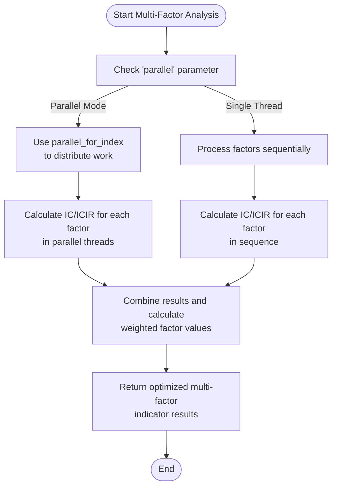

# Performance Optimization

<cite>
**Referenced Files in This Document**   
- [SpendTimer.h](file://hikyuu_cpp/hikyuu/utilities/SpendTimer.h)
- [SpendTimer.cpp](file://hikyuu_cpp/hikyuu/utilities/SpendTimer.cpp)
- [arithmetic.h](file://hikyuu_cpp/hikyuu/utilities/arithmetic.h)
- [arithmetic.cpp](file://hikyuu_cpp/hikyuu/utilities/arithmetic.cpp)
- [LRUCache11.h](file://hikyuu_cpp/hikyuu/utilities/LRUCache11.h)
- [thread/algorithm.h](file://hikyuu_cpp/hikyuu/utilities/thread/algorithm.h)
- [ICMultiFactor.cpp](file://hikyuu_cpp/hikyuu/trade_sys/multifactor/imp/ICMultiFactor.cpp)
- [ICIRMultiFactor.cpp](file://hikyuu_cpp/hikyuu/trade_sys/multifactor/imp/ICIRMultiFactor.cpp)
</cite>

## Table of Contents
1. [Introduction](#introduction)
2. [Arithmetic Optimization Techniques](#arithmetic-optimization-techniques)
3. [SpendTimer for Performance Profiling](#spendtimer-for-performance-profiling)
4. [Algorithmic Optimizations in Utilities](#algorithmic-optimizations-in-utilities)
5. [Practical Performance Optimization Examples](#practical-performance-optimization-examples)
6. [Common Performance Issues and Solutions](#common-performance-issues-and-solutions)
7. [Impact on Backtesting and Real-time Trading](#impact-on-backtesting-and-real-time-trading)

## Introduction
The hikyuu quantitative trading framework implements comprehensive performance optimization strategies to accelerate mathematical computations in trading algorithms. This document details the arithmetic optimization techniques, profiling tools, and algorithmic enhancements that contribute to the framework's computational efficiency. The optimizations are designed to address the demanding computational requirements of quantitative trading systems, particularly in backtesting and real-time trading scenarios where performance directly impacts strategy effectiveness and execution speed.

## Arithmetic Optimization Techniques
The hikyuu framework implements specialized arithmetic functions in the utilities library to enhance computational efficiency for financial calculations. These optimizations focus on precision handling, mathematical operations, and data processing algorithms that are critical for trading systems.

The framework provides optimized implementations of common mathematical operations such as rounding, truncation, and statistical calculations. The `roundEx` function implements a precision-aware rounding algorithm that addresses floating-point precision issues common in financial calculations. This function uses a dynamic epsilon adjustment based on the desired precision level to avoid common floating-point arithmetic errors that can accumulate in trading algorithms.

For statistical computations, the framework includes optimized functions like `get_quantile` for calculating quantiles from sorted data arrays. This implementation efficiently handles edge cases and NaN values while providing accurate quantile calculations essential for risk management and statistical arbitrage strategies. The function uses linear interpolation between data points for non-integer quantile positions, ensuring smooth transitions in statistical measures.

String manipulation functions are also optimized for performance-critical operations. The framework implements efficient string splitting algorithms that use `string_view` for zero-copy operations when possible, reducing memory allocation overhead. These optimizations are particularly beneficial when processing large volumes of market data or parsing financial data feeds.

**Section sources**
- [arithmetic.h](file://hikyuu_cpp/hikyuu/utilities/arithmetic.h#L85-L465)
- [arithmetic.cpp](file://hikyuu_cpp/hikyuu/utilities/arithmetic.cpp#L22-L204)

## SpendTimer for Performance Profiling
The SpendTimer class provides a comprehensive profiling system for measuring execution time of critical code paths in the hikyuu framework. This tool enables developers to identify performance bottlenecks and optimize computationally intensive operations in trading algorithms.

The SpendTimer implementation uses C++ macros to simplify the integration of timing measurements into the codebase. The primary macro `SPEND_TIME(id)` creates a timer instance with a custom identifier, automatically recording the start time upon construction and calculating the elapsed time upon destruction. This RAII (Resource Acquisition Is Initialization) pattern ensures accurate timing measurements without requiring explicit start and stop calls.

For benchmarking scenarios, the framework provides `BENCHMARK_TIME(id, cycle)` and `BENCHMARK_TIME_MSG(id, cycle, ...)` macros that allow developers to measure the average execution time over multiple iterations. These macros are particularly useful for evaluating the performance of trading strategy components under realistic workloads.

The SpendTimer class supports several advanced features:
- Conditional timing control through `SPEND_TIME_CONTROL(open)` which allows dynamic enabling/disabling of timing measurements
- Global control via `OPEN_SPEND_TIME` and `CLOSE_SPEND_TIME` macros to toggle all timing output
- Intermediate timing measurements using `SPEND_TIME_KEEP(id, ...)` to record lap times within a code block
- Runtime access to elapsed time through `SPEND_TIME_VALUE(id)`

The timing output is automatically formatted with appropriate time units (nanoseconds, microseconds, milliseconds, seconds, minutes, or hours) based on the measured duration, providing human-readable performance metrics. The output includes contextual information such as the source file and line number, facilitating quick identification of performance-critical code sections.

**Section sources**
- [SpendTimer.h](file://hikyuu_cpp/hikyuu/utilities/SpendTimer.h#L61-L145)
- [SpendTimer.cpp](file://hikyuu_cpp/hikyuu/utilities/SpendTimer.cpp#L48-L122)

## Algorithmic Optimizations in Utilities
The hikyuu framework incorporates several algorithmic optimizations in its utilities library to enhance computational efficiency. These optimizations address common performance challenges in quantitative trading systems, particularly in data processing, caching, and parallel computation.

One key optimization is the implementation of an LRU (Least Recently Used) cache using the LRUCache11 library. This cache provides O(1) insert, delete, and refresh operations by combining a hash map with a doubly-linked list. The cache is configurable with a maximum size and elasticity parameter, allowing it to temporarily exceed the maximum size before pruning back to the configured limit. This optimization is particularly effective for caching frequently accessed market data, indicator calculations, and other expensive computations.

The framework also implements parallel processing capabilities through the `parallel_for_index` function in the thread utilities. This function automatically divides workloads across available CPU cores, significantly accelerating computations that can be parallelized. The implementation uses a thread pool with work-stealing capabilities to ensure efficient load balancing across threads.

For string processing operations, the framework optimizes memory usage by implementing functions that work with `string_view` when possible, avoiding unnecessary string copying. The split functions are optimized to minimize memory allocations and provide efficient access to substrings, which is beneficial when processing large volumes of financial data.

The utilities library also includes optimized mathematical functions for common financial calculations. These include specialized implementations of statistical functions, correlation calculations, and time series operations that are optimized for the specific data patterns encountered in financial markets.

**Section sources**
- [LRUCache11.h](file://hikyuu_cpp/hikyuu/utilities/LRUCache11.h#L70-L230)
- [thread/algorithm.h](file://hikyuu_cpp/hikyuu/utilities/thread/algorithm.h#L47-L116)

## Practical Performance Optimization Examples
The hikyuu framework demonstrates practical performance optimization techniques through its implementation of multi-factor analysis algorithms. These examples illustrate how to identify performance bottlenecks and apply optimization strategies to trading strategies.

The ICMultiFactor and ICIRMultiFactor implementations showcase the use of parallel processing to accelerate factor analysis. These algorithms process multiple indicators across numerous stocks, a computationally intensive task that benefits significantly from parallelization. The framework uses the `parallel_for_index` function to distribute the computation of IC (Information Coefficient) and ICIR (Information Coefficient Information Ratio) calculations across multiple threads.

**Diagram sources**
- [ICMultiFactor.cpp](file://hikyuu_cpp/hikyuu/trade_sys/multifactor/imp/ICMultiFactor.cpp#L49-L142)
- [ICIRMultiFactor.cpp](file://hikyuu_cpp/hikyuu/trade_sys/multifactor/imp/ICIRMultiFactor.cpp#L48-L141)

The framework also demonstrates optimization through efficient memory management in the multi-factor calculations. By pre-allocating PriceList objects and reusing memory buffers, the implementation minimizes memory allocation overhead during the intensive calculation phase. The use of direct pointer access to indicator data arrays avoids the overhead of bounds checking and function call indirection.

To identify performance bottlenecks, developers can use SpendTimer to profile specific components of their trading strategies. For example, wrapping the factor calculation loop with `SPEND_TIME(factor_calculation)` allows measurement of the time spent in this critical section. If the profiling reveals that factor calculations are a bottleneck, the developer can then enable parallel processing by setting the 'parallel' parameter to true.

**Section sources**
- [ICMultiFactor.cpp](file://hikyuu_cpp/hikyuu/trade_sys/multifactor/imp/ICMultiFactor.cpp#L39-L142)
- [ICIRMultiFactor.cpp](file://hikyuu_cpp/hikyuu/trade_sys/multifactor/imp/ICIRMultiFactor.cpp#L39-L141)

## Common Performance Issues and Solutions
Quantitative trading systems often encounter specific performance challenges that can impact both backtesting accuracy and real-time trading effectiveness. The hikyuu framework addresses these common issues with targeted optimization strategies.

One common issue is the computational overhead of indicator calculations, particularly when using complex technical indicators or processing high-frequency data. The framework addresses this through caching mechanisms and efficient algorithm implementations. The LRUCache11 implementation allows frequently accessed indicator values to be retrieved from cache rather than recalculated, significantly reducing computation time for strategies that reuse indicator values.

Memory allocation overhead is another common performance bottleneck, especially in high-frequency trading scenarios. The framework mitigates this through object pooling and memory reuse strategies. For example, the multi-factor analysis components pre-allocate PriceList objects and reuse them across calculations, avoiding the overhead of repeated memory allocation and deallocation.

I/O bottlenecks can occur when loading large volumes of historical market data. The framework optimizes data access through efficient data drivers and caching layers. The data driver architecture allows for optimized implementations for different data storage backends, while the caching layer reduces redundant database queries.

Algorithmic complexity issues arise when strategies involve nested loops or complex mathematical operations. The framework addresses this through parallel processing capabilities and optimized mathematical functions. The `parallel_for_index` function automatically distributes computationally intensive loops across available CPU cores, while the optimized arithmetic functions reduce the computational cost of mathematical operations.

For real-time trading systems, latency is a critical concern. The framework minimizes latency through efficient event handling, optimized data structures, and reduced function call overhead. The use of inline functions for frequently called operations and direct memory access patterns helps reduce execution time in time-critical code paths.

**Section sources**
- [LRUCache11.h](file://hikyuu_cpp/hikyuu/utilities/LRUCache11.h#L70-L230)
- [thread/algorithm.h](file://hikyuu_cpp/hikyuu/utilities/thread/algorithm.h#L47-L116)
- [arithmetic.h](file://hikyuu_cpp/hikyuu/utilities/arithmetic.h#L85-L465)

## Impact on Backtesting and Real-time Trading
The performance optimizations in the hikyuu framework have significant impacts on both backtesting speed and real-time trading performance, directly affecting the effectiveness and profitability of trading strategies.

In backtesting scenarios, the optimizations enable faster execution of strategy simulations, allowing for more comprehensive parameter optimization and robustness testing. The parallel processing capabilities can reduce backtesting time from hours to minutes, particularly for multi-asset strategies or parameter sweeps. This acceleration enables traders to test more hypotheses and refine their strategies more quickly, leading to better-performing trading systems.

The efficient memory management and caching mechanisms reduce the memory footprint of backtesting operations, allowing larger datasets to be processed on standard hardware. This is particularly beneficial when conducting long-term backtests across multiple asset classes, where memory constraints might otherwise limit the scope of analysis.

For real-time trading, the optimizations contribute to lower latency and more responsive trading systems. The efficient arithmetic operations and optimized data structures reduce the time required to process market data and generate trading signals. This reduced latency can be critical in high-frequency trading environments where milliseconds can determine trading success.

The profiling capabilities provided by SpendTimer enable continuous performance monitoring and optimization of live trading systems. By identifying performance bottlenecks in real-time, traders can make informed decisions about system upgrades, algorithm modifications, or infrastructure changes to maintain optimal trading performance.

The combination of these optimizations ensures that the hikyuu framework can handle the computational demands of modern quantitative trading, from complex multi-factor models to high-frequency trading strategies, while maintaining the accuracy and reliability required for financial applications.

**Section sources**
- [SpendTimer.h](file://hikyuu_cpp/hikyuu/utilities/SpendTimer.h#L61-L145)
- [thread/algorithm.h](file://hikyuu_cpp/hikyuu/utilities/thread/algorithm.h#L47-L116)
- [ICMultiFactor.cpp](file://hikyuu_cpp/hikyuu/trade_sys/multifactor/imp/ICMultiFactor.cpp#L49-L142)