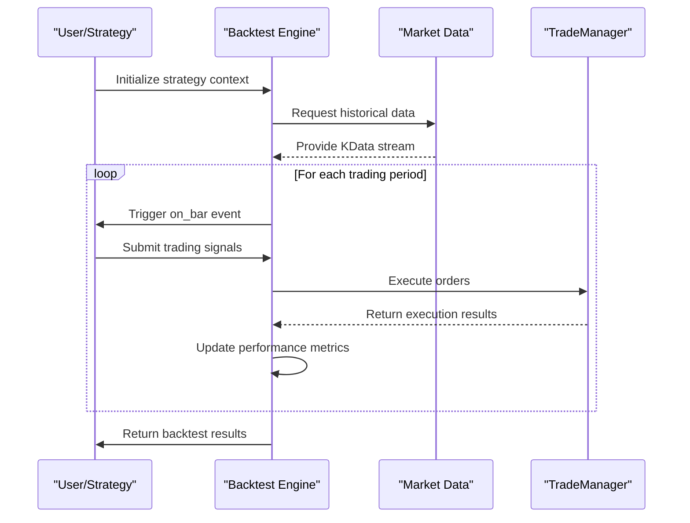
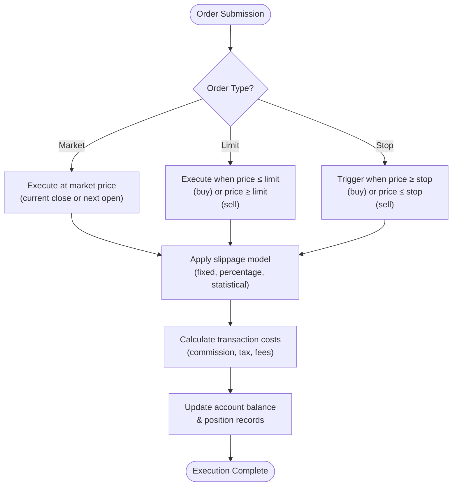
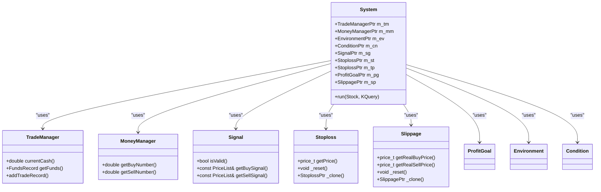
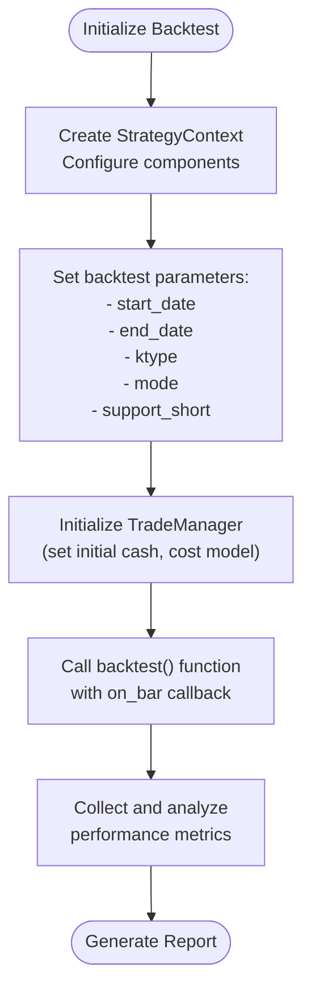
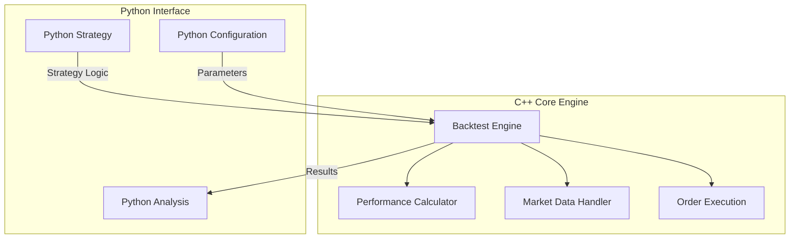

# Backtesting Engine

<cite>
**Referenced Files in This Document**   
- [analysis_sys.cpp](file://hikyuu_cpp/hikyuu/analysis/analysis_sys.cpp)
- [analysis_sys.h](file://hikyuu_cpp/hikyuu/analysis/analysis_sys.h)
- [backtest.h](file://hikyuu_cpp/hikyuu/plugin/backtest.h)
- [backtest.cpp](file://hikyuu_cpp/hikyuu/plugin/backtest.cpp)
- [System.h](file://hikyuu_cpp/hikyuu/trade_sys/system/System.h)
- [Performance.h](file://hikyuu_cpp/hikyuu/trade_manage/Performance.h)
- [_backtest.cpp](file://hikyuu_pywrap/plugin/_backtest.cpp)
- [_System.cpp](file://hikyuu_pywrap/trade_sys/_System.cpp)
- [_Slippage.cpp](file://hikyuu_pywrap/trade_sys/_Slippage.cpp)
- [_TradeCost.cpp](file://hikyuu_pywrap/trade_manage/_TradeCost.cpp)
- [test_Simple_SYS_for_cn.cpp](file://hikyuu_cpp/unit_test/hikyuu/trade_sys/system/test_Simple_SYS_for_cn.cpp)
- [test_Simple_SYS_for_ev.cpp](file://hikyuu_cpp/unit_test/hikyuu/trade_sys/system/test_Simple_SYS_for_ev.cpp)
</cite>

## Table of Contents
1. [Introduction](#introduction)
2. [Event-Driven Simulation Architecture](#event-driven-simulation-architecture)
3. [Order Execution Simulation](#order-execution-simulation)
4. [Trading System Integration](#trading-system-integration)
5. [Configuration and Execution Examples](#configuration-and-execution-examples)
6. [C++ Core and Python Interface](#c-core-and-python-interface)
7. [Bias Mitigation Strategies](#bias-mitigation-strategies)
8. [Performance Considerations](#performance-considerations)
9. [Conclusion](#conclusion)

## Introduction
The Hikyuu backtesting engine provides a comprehensive framework for evaluating trading strategies through historical market data simulation. This document details the architecture and implementation of the backtesting system, focusing on its event-driven simulation model, order execution mechanics, and integration with various trading components. The engine supports multiple order types, sophisticated slippage modeling, and transaction cost calculations, enabling realistic simulation of trading strategies. The system is designed with a clear separation between the high-performance C++ core and the accessible Python interface, allowing for both efficient computation and flexible strategy development.

## Event-Driven Simulation Architecture
The Hikyuu backtesting engine employs an event-driven architecture that processes market data in chronological order, simulating the execution of trading strategies based on historical price movements. The core of this architecture is the `backtest` function defined in the plugin interface, which orchestrates the simulation process by iterating through historical market data and triggering strategy execution at each time step.

The simulation begins with the initialization of a strategy context that contains all necessary components for trading decisions, including signals, money management, and risk control modules. Market data is fed into the engine through the `KData` structure, which represents historical price information for a specific security. The engine processes this data sequentially, advancing through each trading period and invoking the strategy's decision-making logic.

Key aspects of the event-driven architecture include:
- **Chronological Processing**: Market data is processed in strict chronological order, ensuring that trading decisions are based only on information available at each point in time
- **Event Queue**: The system maintains an event queue that handles various trading events such as order executions, position updates, and performance calculations
- **State Management**: The engine maintains the current state of the trading account, including cash balance, positions, and performance metrics
- **Component Integration**: Various trading system components are integrated into the simulation, allowing for comprehensive strategy evaluation

The architecture ensures that trading signals are processed in the correct temporal sequence, preventing look-ahead bias and providing a realistic simulation environment.

**Diagram sources**
- [backtest.h](file://hikyuu_cpp/hikyuu/plugin/backtest.h#L13-L40)
- [System.h](file://hikyuu_cpp/hikyuu/trade_sys/system/System.h#L197-L214)

**Section sources**
- [backtest.h](file://hikyuu_cpp/hikyuu/plugin/backtest.h#L13-L40)
- [System.h](file://hikyuu_cpp/hikyuu/trade_sys/system/System.h#L197-L214)

## Order Execution Simulation
The order execution simulation in Hikyuu supports multiple order types and incorporates realistic market conditions through slippage modeling and transaction cost calculations. The engine handles market, limit, and stop orders, simulating their execution based on the available market data.

### Order Types
The backtesting engine supports three primary order types:
- **Market Orders**: Executed at the current market price, either at the current bar's close or the next bar's open, depending on the execution mode
- **Limit Orders**: Executed only when the market price reaches the specified limit price
- **Stop Orders**: Triggered when the market price reaches a specified stop price, then executed as market orders

The execution mode is configurable through the `mode` parameter in the backtest function, where mode 0 executes trades at the current bar's close price, and mode 1 executes at the next bar's open price. This allows for different simulation scenarios that reflect various trading styles and market conditions.

### Slippage Modeling
Slippage is modeled through the `Slippage` component, which calculates the difference between the intended execution price and the actual execution price. The engine supports multiple slippage models:
- **Fixed Slippage**: Applies a constant price difference regardless of market conditions
- **Percentage Slippage**: Applies a percentage-based difference relative to the intended price
- **Statistical Distribution**: Models slippage using statistical distributions that reflect real market behavior

The slippage calculation is integrated into the order execution process through the `_getRealBuyPrice` and `_getRealSellPrice` methods in the `System` class, which modify the planned execution price based on the configured slippage model.

### Transaction Cost Calculation
Transaction costs are calculated using the `TradeCost` component, which accounts for various fees and commissions associated with trading. The cost calculation includes:
- **Commission Fees**: Brokerage commissions based on trade value or volume
- **Stamp Duty**: Government-imposed taxes on transactions
- **Transfer Fees**: Fees for transferring securities
- **Other Costs**: Any additional transaction-related expenses

The cost calculation is performed during order execution and deducted from the trading account, providing a realistic assessment of strategy performance.

**Diagram sources**
- [System.h](file://hikyuu_cpp/hikyuu/trade_sys/system/System.h#L636-L642)
- [backtest.h](file://hikyuu_cpp/hikyuu/plugin/backtest.h#L23-L24)
- [_TradeCost.cpp](file://hikyuu_pywrap/trade_manage/_TradeCost.cpp#L68-L100)

**Section sources**
- [System.h](file://hikyuu_cpp/hikyuu/trade_sys/system/System.h#L636-L642)
- [backtest.h](file://hikyuu_cpp/hikyuu/plugin/backtest.h#L23-L24)
- [_TradeCost.cpp](file://hikyuu_pywrap/trade_manage/_TradeCost.cpp#L68-L100)

## Trading System Integration
The Hikyuu backtesting engine integrates seamlessly with various trading system components, including signals, money management, and stop-loss modules. This integration allows for comprehensive strategy evaluation that considers multiple aspects of trading beyond simple entry and exit signals.

### Signal Integration
Trading signals are generated by the `Signal` component, which analyzes market data to identify potential trading opportunities. The signal component is integrated into the strategy execution loop, where it processes the current market data and generates buy or sell signals based on its internal logic. The signals are then passed to the order execution system for processing.

### Money Management
The money management component (`MoneyManager`) determines the position size for each trade based on the current account status and risk parameters. It considers factors such as available capital, risk tolerance, and position concentration limits when calculating the appropriate trade size. The money manager is invoked during the order preparation phase, where it calculates the number of shares or contracts to trade.

### Stop-Loss and Risk Control
The stop-loss module (`Stoploss`) provides risk management by automatically closing positions when predefined loss thresholds are reached. The stop-loss component monitors the current position value and market conditions, triggering sell orders when the stop-loss price is reached. This helps protect the trading account from excessive losses and enforces disciplined risk management.

### Component Interactions
The integration of these components follows a well-defined sequence during each trading period:
1. Market data is updated for the current period
2. The environment and condition components evaluate market conditions
3. The signal component generates trading signals
4. The money manager calculates position size
5. The stop-loss and profit goal components update their levels
6. Orders are executed with slippage and cost calculations
7. Account and performance metrics are updated

This modular design allows for flexible strategy development and easy component replacement or customization.

**Diagram sources**
- [System.h](file://hikyuu_cpp/hikyuu/trade_sys/system/System.h#L340-L369)
- [backtest.h](file://hikyuu_cpp/hikyuu/plugin/backtest.h#L13-L40)

**Section sources**
- [System.h](file://hikyuu_cpp/hikyuu/trade_sys/system/System.h#L340-L369)
- [backtest.h](file://hikyuu_cpp/hikyuu/plugin/backtest.h#L13-L40)

## Configuration and Execution Examples
The Hikyuu backtesting engine can be configured and executed through both C++ and Python interfaces. The following examples demonstrate how to set up and run a backtest using the analysis system functions.

### Analysis System Configuration
The `analysisSystemList` function provides a high-level interface for running multiple backtests and comparing their performance. This function accepts a list of system strategies and corresponding stocks, executing each strategy on its designated security and returning performance metrics for comparison.

**Diagram sources**
- [analysis_sys.cpp](file://hikyuu_cpp/hikyuu/analysis/analysis_sys.cpp#L13-L190)
- [backtest.h](file://hikyuu_cpp/hikyuu/plugin/backtest.h#L13-L40)

**Section sources**
- [analysis_sys.cpp](file://hikyuu_cpp/hikyuu/analysis/analysis_sys.cpp#L13-L190)
- [backtest.h](file://hikyuu_cpp/hikyuu/plugin/backtest.h#L13-L40)

## C++ Core and Python Interface
The Hikyuu backtesting engine features a dual-layer architecture with a high-performance C++ core and a user-friendly Python interface. This design leverages the computational efficiency of C++ for intensive calculations while providing the accessibility and flexibility of Python for strategy development.

### C++ Core Engine
The C++ core implements the fundamental backtesting algorithms and data structures, optimized for performance and memory efficiency. Key components include:
- **Event Processing**: High-speed event queue and processing loop
- **Data Structures**: Efficient representations of market data, positions, and trading records
- **Mathematical Calculations**: Optimized implementations of performance metrics and statistical calculations
- **Memory Management**: Careful memory allocation and deallocation to minimize overhead

The C++ core is compiled as a shared library, exposing its functionality through a well-defined API.

### Python Interface
The Python interface, implemented using pybind11, provides a convenient wrapper around the C++ core. This interface allows users to:
- Define trading strategies using Python code
- Configure backtest parameters through Python functions
- Access and analyze results using Python data structures
- Integrate with popular Python data analysis libraries

The interface maintains the performance benefits of the C++ core while providing the ease of use and rapid development capabilities of Python. The `export_plugin_backtest` function in the Python wrapper exposes the backtest functionality to Python, allowing users to define their strategy logic in Python while executing it through the high-performance C++ engine.

### Performance Optimization
The C++ core includes several performance optimizations:
- **Parallel Processing**: The `analysisSystemList` function uses parallel execution to run multiple backtests simultaneously
- **Memory Efficiency**: Data structures are designed to minimize memory footprint and cache misses
- **Algorithm Optimization**: Critical algorithms are optimized for speed and numerical stability
- **Reduced Overhead**: The core minimizes function call overhead and object creation during the simulation loop

This architecture enables efficient execution of large-scale backtests while maintaining the flexibility needed for strategy development.

**Diagram sources**
- [_backtest.cpp](file://hikyuu_pywrap/plugin/_backtest.cpp#L1-L75)
- [backtest.cpp](file://hikyuu_cpp/hikyuu/plugin/backtest.cpp#L1-L35)

**Section sources**
- [_backtest.cpp](file://hikyuu_pywrap/plugin/_backtest.cpp#L1-L75)
- [backtest.cpp](file://hikyuu_cpp/hikyuu/plugin/backtest.cpp#L1-L35)

## Bias Mitigation Strategies
The Hikyuu backtesting engine incorporates several mechanisms to mitigate common biases that can lead to overly optimistic performance estimates.

### Look-Ahead Bias Prevention
Look-ahead bias is prevented through strict chronological processing of market data. The engine ensures that trading decisions at any point in time are based only on information available up to that moment. This is achieved by:
- Processing market data in sequential order without peeking at future data
- Using appropriate execution modes (current close vs. next open) to reflect realistic trading conditions
- Implementing proper data alignment between different data sources

The event-driven architecture ensures that each trading decision is made based on the current state of the market and historical data, without access to future information.

### Survivorship Bias Mitigation
Survivorship bias is addressed by including delisted securities in the backtesting universe when appropriate. The engine can be configured to:
- Include securities that were active during the backtest period, regardless of current listing status
- Handle corporate actions such as mergers, acquisitions, and bankruptcies
- Account for the impact of delistings on portfolio performance

This approach provides a more realistic assessment of strategy performance by considering the full universe of securities that would have been available to traders during the historical period.

### Other Bias Considerations
Additional bias mitigation strategies include:
- **Data Snooping Prevention**: The engine supports walk-forward optimization and out-of-sample testing to validate strategy robustness
- **Transaction Cost Realism**: Comprehensive transaction cost modeling prevents overestimation of net returns
- **Slippage Modeling**: Realistic slippage assumptions account for market impact and liquidity constraints
- **Position Sizing Constraints**: Money management rules prevent unrealistic position sizes that could distort performance

These measures help ensure that backtest results provide a reliable indication of how a strategy might perform in live trading.

**Section sources**
- [System.h](file://hikyuu_cpp/hikyuu/trade_sys/system/System.h#L197-L214)
- [backtest.h](file://hikyuu_cpp/hikyuu/plugin/backtest.h#L23-L24)

## Performance Considerations
Running large-scale backtests efficiently requires careful consideration of computational resources and optimization strategies. The Hikyuu backtesting engine provides several features to support efficient execution of extensive backtesting scenarios.

### Parallel Execution
The engine supports parallel execution of multiple backtests through the `analysisSystemList` function, which uses the `parallel_for_index` utility to distribute computations across multiple CPU cores. This allows for simultaneous evaluation of multiple strategies or parameter combinations, significantly reducing total execution time.

### Memory Management
Efficient memory management is critical for large-scale backtests. The engine employs several strategies to minimize memory usage:
- **Data Streaming**: Market data is loaded incrementally rather than all at once
- **Object Reuse**: Components are reused across multiple backtests when possible
- **Memory Pooling**: Frequently allocated objects are managed through memory pools to reduce allocation overhead

### Optimization Techniques
Additional performance optimizations include:
- **Caching**: Results of expensive calculations are cached when appropriate
- **Algorithm Selection**: Different algorithms are available for various performance vs. accuracy trade-offs
- **Batch Processing**: Related operations are grouped to minimize overhead
- **I/O Optimization**: Data access patterns are optimized for disk and memory performance

### Scalability
The engine is designed to scale from single-strategy backtests to large-scale strategy optimization and parameter sweeps. Users can configure the level of detail in the output to balance between comprehensive analysis and computational efficiency.

**Section sources**
- [analysis_sys.cpp](file://hikyuu_cpp/hikyuu/analysis/analysis_sys.cpp#L26-L48)
- [System.h](file://hikyuu_cpp/hikyuu/trade_sys/system/System.h#L197-L214)

## Conclusion
The Hikyuu backtesting engine provides a comprehensive and flexible framework for evaluating trading strategies through historical simulation. Its event-driven architecture ensures realistic execution of trading signals in chronological order, while its modular design allows for integration with various trading components such as signals, money management, and risk control modules. The engine supports multiple order types and incorporates realistic market conditions through sophisticated slippage modeling and transaction cost calculations.

The dual-layer architecture, with a high-performance C++ core and accessible Python interface, combines computational efficiency with development flexibility. This design enables both rapid strategy prototyping and efficient execution of large-scale backtests. The engine includes mechanisms to mitigate common biases such as look-ahead and survivorship bias, helping to ensure that backtest results provide a reliable indication of potential live trading performance.

For optimal results, users should carefully configure the backtest parameters, including execution mode, slippage model, and transaction costs, to reflect their intended trading style and market conditions. The engine's support for parallel execution and efficient memory management makes it suitable for both single-strategy evaluation and large-scale strategy optimization.