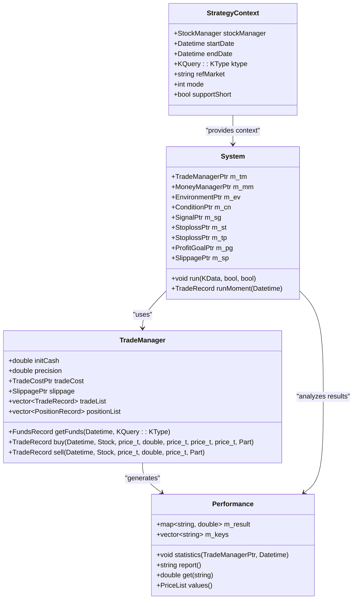
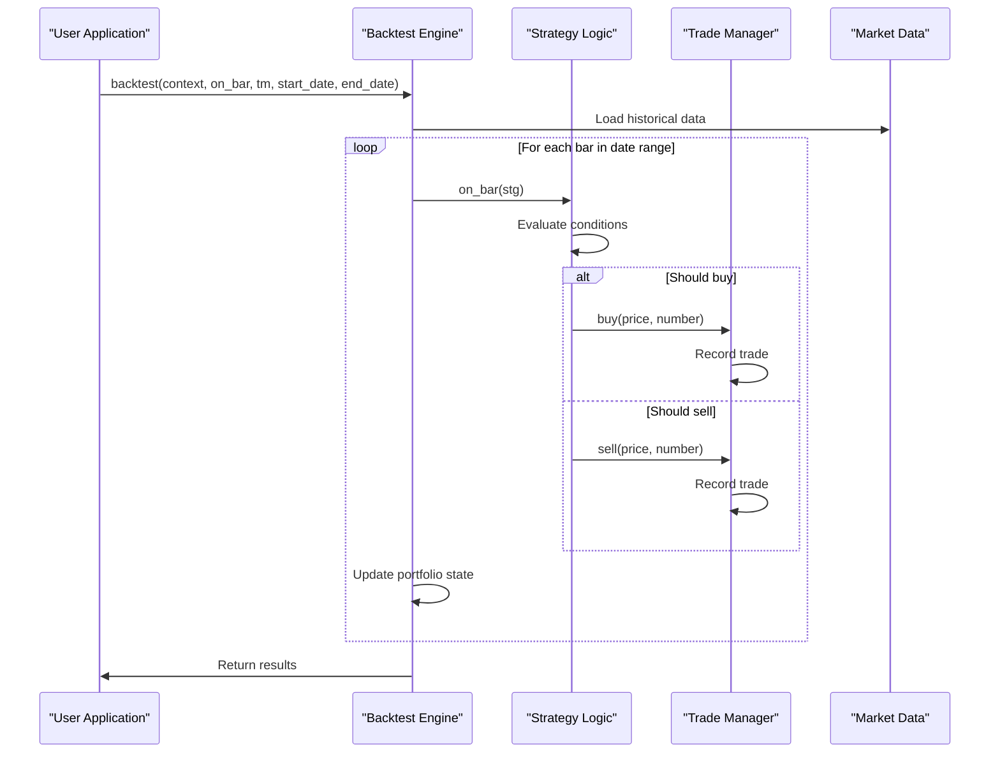
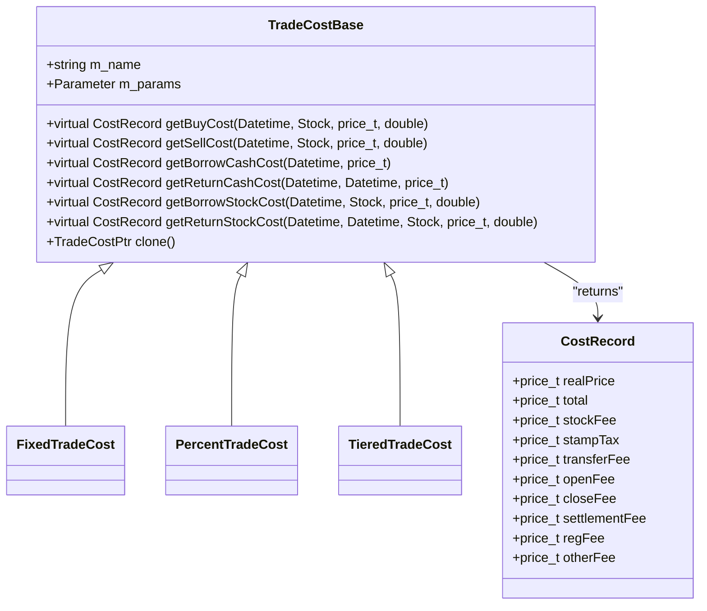
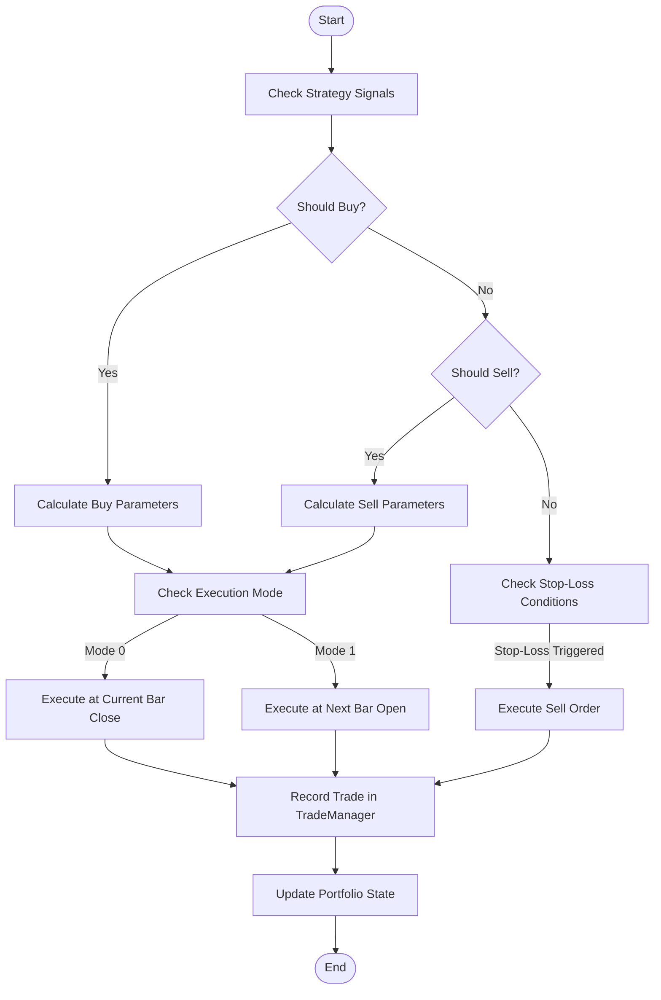
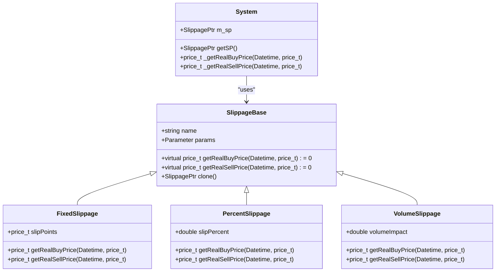
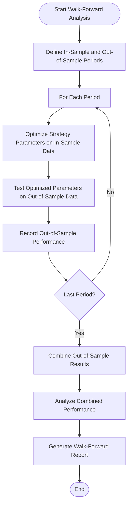
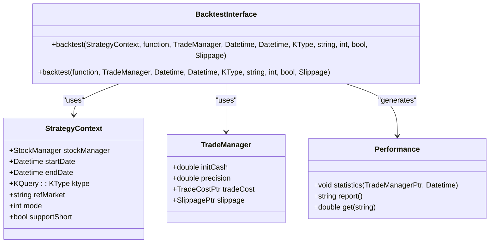

# Backtesting Framework

<cite>
**Referenced Files in This Document**   
- [backtest.h](file://hikyuu_cpp/hikyuu/plugin/backtest.h)
- [backtest.cpp](file://hikyuu_cpp/hikyuu/plugin/backtest.cpp)
- [_backtest.cpp](file://hikyuu_pywrap/plugin/_backtest.cpp)
- [Performance.h](file://hikyuu_cpp/hikyuu/trade_manage/Performance.h)
- [Performance.cpp](file://hikyuu_cpp/hikyuu/trade_manage/Performance.cpp)
- [TradeCostBase.h](file://hikyuu_cpp/hikyuu/trade_manage/TradeCostBase.h)
- [TradeCostBase.cpp](file://hikyuu_cpp/hikyuu/trade_manage/TradeCostBase.cpp)
- [System.h](file://hikyuu_cpp/hikyuu/trade_sys/system/System.h)
- [System.cpp](file://hikyuu_cpp/hikyuu/trade_sys/system/System.cpp)
</cite>

## Table of Contents
1. [Introduction](#introduction)
2. [Backtesting Engine Architecture](#backtesting-engine-architecture)
3. [Event-Driven Simulation](#event-driven-simulation)
4. [Transaction Cost Modeling](#transaction-cost-modeling)
5. [Order Types and Execution Models](#order-types-and-execution-models)
6. [Slippage Models](#slippage-models)
7. [Performance Metrics and Analysis](#performance-metrics-and-analysis)
8. [Walk-Forward Analysis](#walk-forward-analysis)
9. [Public Interfaces and Usage Examples](#public-interfaces-and-usage-examples)
10. [Conclusion](#conclusion)

## Introduction

The Hikyuu backtesting framework provides a comprehensive environment for evaluating trading strategies against historical market data. This framework enables users to test the performance and robustness of trading strategies by simulating their execution on historical price data. The system supports event-driven simulation, realistic transaction cost modeling, and various performance metrics to assess strategy effectiveness.

The backtesting process in Hikyuu is designed to be both accurate and flexible, allowing for the testing of complex trading strategies with various market conditions and execution parameters. The framework supports different order types, slippage models, and commission structures to provide realistic simulations of trading behavior.

This documentation covers both conceptual overviews for beginners and technical details for experienced developers, providing a complete understanding of the backtesting capabilities within the Hikyuu framework.

## Backtesting Engine Architecture

The Hikyuu backtesting framework is built on an event-driven architecture that processes market data chronologically, simulating the execution of trading strategies in a realistic market environment. The core components of the backtesting engine include the strategy context, trade manager, performance analyzer, and various strategy components that work together to execute and evaluate trading strategies.



**Diagram sources**
- [System.h](file://hikyuu_cpp/hikyuu/trade_sys/system/System.h#L39-L450)
- [Performance.h](file://hikyuu_cpp/hikyuu/trade_manage/Performance.h#L22-L85)
- [TradeCostBase.h](file://hikyuu_cpp/hikyuu/trade_manage/TradeCostBase.h#L22-L179)

**Section sources**
- [System.h](file://hikyuu_cpp/hikyuu/trade_sys/system/System.h#L39-L450)
- [Performance.h](file://hikyuu_cpp/hikyuu/trade_manage/Performance.h#L22-L85)

## Event-Driven Simulation

The Hikyuu backtesting framework employs an event-driven simulation model that processes market data on a bar-by-bar basis, simulating the chronological execution of trading strategies. This approach ensures that trading decisions are made based on available information at each point in time, preventing lookahead bias and providing realistic simulation results.

The event-driven architecture processes each market data point (bar) in sequence, triggering strategy evaluation and potential trade execution. The simulation supports two execution modes:
- Mode 0: Execute trades at the current bar's closing price
- Mode 1: Execute trades at the next bar's opening price

This flexibility allows users to test different execution assumptions and evaluate their impact on strategy performance. The framework also supports both long and short positions, enabling the testing of market-neutral and directional strategies.

The core backtesting function is implemented in the `backtest` function, which takes a strategy context, a strategy execution function, a trade manager, and various parameters to control the backtesting process. The function processes historical data chronologically, applying the strategy logic at each time step and recording the resulting trades and portfolio changes.



**Diagram sources**
- [backtest.h](file://hikyuu_cpp/hikyuu/plugin/backtest.h#L28-L38)
- [System.cpp](file://hikyuu_cpp/hikyuu/trade_sys/system/System.cpp#L444-L443)

**Section sources**
- [backtest.h](file://hikyuu_cpp/hikyuu/plugin/backtest.h#L28-L38)
- [backtest.cpp](file://hikyuu_cpp/hikyuu/plugin/backtest.cpp#L13-L33)

## Transaction Cost Modeling

The Hikyuu backtesting framework includes comprehensive transaction cost modeling to provide realistic simulations of trading expenses. The framework uses a flexible `TradeCostBase` class that serves as the foundation for various commission and fee structures.

The transaction cost system is designed to calculate both explicit costs (commissions, fees) and implicit costs (slippage, market impact) associated with trading activities. The base class `TradeCostBase` defines the interface for calculating buy and sell costs, with virtual methods that can be overridden by specific implementations:

```cpp
virtual CostRecord getBuyCost(const Datetime& datetime, const Stock& stock, price_t price, double num) const = 0;
virtual CostRecord getSellCost(const Datetime& datetime, const Stock& stock, price_t price, double num) const = 0;
```

These methods return a `CostRecord` object containing detailed cost information, including commissions, taxes, and other fees. The framework supports different commission structures, such as fixed fees, percentage-based commissions, or tiered pricing models based on trade volume.

The transaction cost model is integrated into the trade execution process, ensuring that all trades account for realistic costs. This is crucial for accurate performance evaluation, as transaction costs can significantly impact the profitability of trading strategies, especially for high-frequency or high-turnover strategies.



**Diagram sources**
- [TradeCostBase.h](file://hikyuu_cpp/hikyuu/trade_manage/TradeCostBase.h#L22-L179)
- [TradeCostBase.cpp](file://hikyuu_cpp/hikyuu/trade_manage/TradeCostBase.cpp#L30-L42)

**Section sources**
- [TradeCostBase.h](file://hikyuu_cpp/hikyuu/trade_manage/TradeCostBase.h#L22-L179)
- [TradeCostBase.cpp](file://hikyuu_cpp/hikyuu/trade_manage/TradeCostBase.cpp#L30-L42)

## Order Types and Execution Models

The Hikyuu backtesting framework supports various order types and execution models to simulate realistic trading scenarios. The system handles different order execution modes through the `mode` parameter in the backtesting function, which determines when trades are executed relative to the current market data bar.

The framework supports two primary execution modes:
- Mode 0: Execute trades at the current bar's closing price
- Mode 1: Execute trades at the next bar's opening price

This allows users to test different execution assumptions and evaluate their impact on strategy performance. The system also supports delayed execution through the `buy_delay` and `sell_delay` parameters in the System class, which can be used to simulate order execution at the next bar's opening price.

The trade execution process is managed by the `TradeManager` class, which handles the creation and recording of trade records. The `buy` and `sell` methods of the `TradeManager` class take parameters including the trade date, stock, price, quantity, stop-loss price, goal price, and the source of the trade request.

The framework also supports various order types through the strategy components, including market orders, limit orders, and stop orders. These order types are implemented through the signal, stop-loss, and profit goal components of the trading system, allowing for complex trading logic and risk management.



**Diagram sources**
- [System.h](file://hikyuu_cpp/hikyuu/trade_sys/system/System.h#L214-L215)
- [System.cpp](file://hikyuu_cpp/hikyuu/trade_sys/system/System.cpp#L667-L753)

**Section sources**
- [System.h](file://hikyuu_cpp/hikyuu/trade_sys/system/System.h#L214-L215)
- [System.cpp](file://hikyuu_cpp/hikyuu/trade_sys/system/System.cpp#L667-L753)

## Slippage Models

The Hikyuu backtesting framework includes sophisticated slippage modeling to account for the difference between expected and actual trade execution prices. Slippage is a critical factor in realistic trading simulations, as it represents the market impact of trading activity and the difficulty of executing large orders at desired prices.

The framework uses a `SlippagePtr` parameter in the backtesting function to specify the slippage model to be used during the simulation. The slippage model is applied when calculating the actual execution price for trades, modifying the planned price based on the specific slippage algorithm.

The base slippage functionality is integrated into the `System` class through the `getSP()` method, which returns the current slippage model, and the `_getRealBuyPrice` and `_getRealSellPrice` methods, which apply the slippage model to calculate actual execution prices:

```cpp
inline price_t System::_getRealBuyPrice(const Datetime& datetime, price_t planPrice) {
    return m_sp ? m_sp->getRealBuyPrice(datetime, planPrice) : planPrice;
}

inline price_t System::_getRealSellPrice(const Datetime& datetime, price_t planPrice) {
    return m_sp ? m_sp->getRealSellPrice(datetime, planPrice) : planPrice;
}
```

These methods check if a slippage model is configured and, if so, use it to calculate the actual execution price; otherwise, they return the planned price. This allows for flexible slippage modeling, where different algorithms can be implemented and selected based on the specific trading strategy and market conditions.

The slippage model is particularly important for high-volume strategies or strategies trading in less liquid markets, where the impact of trading activity on prices can be significant. By incorporating realistic slippage models, the backtesting framework provides more accurate performance estimates and helps identify potential issues with strategy execution.



**Diagram sources**
- [System.h](file://hikyuu_cpp/hikyuu/trade_sys/system/System.h#L111-L112)
- [System.cpp](file://hikyuu_cpp/hikyuu/trade_sys/system/System.cpp#L636-L641)

**Section sources**
- [System.h](file://hikyuu_cpp/hikyuu/trade_sys/system/System.h#L111-L112)
- [System.cpp](file://hikyuu_cpp/hikyuu/trade_sys/system/System.cpp#L636-L641)

## Performance Metrics and Analysis

The Hikyuu backtesting framework provides comprehensive performance analysis tools to evaluate strategy results using various metrics, including risk-adjusted returns, drawdown analysis, and statistical significance testing. The `Performance` class serves as the central component for calculating and reporting these metrics.

The performance analysis system calculates a wide range of metrics, including:

- Account performance: initial capital, total assets, cash balance, market value
- Return metrics: account return rate, compound annual growth rate, average annual return
- Risk metrics: maximum drawdown, volatility, risk-adjusted returns
- Trade statistics: number of trades, win rate, average profit/loss, profit factor
- Position metrics: average holding time, maximum holding time, position concentration
- Risk management metrics: stop-loss effectiveness, take-profit effectiveness, R-multiple analysis

The `Performance` class provides methods to calculate these metrics based on the trade records generated during backtesting:

```cpp
void statistics(const TradeManagerPtr& tm, const Datetime& datetime = Datetime::now());
string report();
double get(const string& name) const;
```

The `statistics` method processes the trade records from the `TradeManager` and calculates all performance metrics, while the `report` method generates a formatted text report of the results. The `get` method allows access to individual metrics by name.

The framework also includes specialized metrics for advanced analysis, such as R-multiple expectations, trade opportunity frequency, and annualized R-multiples, which are particularly useful for evaluating the risk-reward profile of trading strategies.

```mermaid
erDiagram
PERFORMANCE_METRICS {
string "帐户初始金额" PK
double "累计投入本金"
double "累计投入资产"
double "累计借入现金"
double "累计借入资产"
double "累计红利"
double "现金余额"
double "未平仓头寸净值"
double "当前总资产"
double "已平仓交易总成本"
double "已平仓净利润总额"
double "单笔交易最大占用现金比例%"
double "交易平均占用现金比例%"
double "未平仓帐户收益率%"
double "已平仓帐户收益率%"
double "帐户年复合收益率%"
double "帐户平均年收益率%"
double "赢利交易赢利总额"
double "亏损交易亏损总额"
double "已平仓交易总数"
double "赢利交易数"
double "亏损交易数"
double "赢利交易比例%"
double "赢利期望值"
double "赢利交易平均赢利"
double "亏损交易平均亏损"
double "平均赢利/平均亏损比例"
double "净赢利/亏损比例"
double "最大单笔赢利"
double "最大单笔盈利百分比%"
double "最大单笔亏损"
double "最大单笔亏损百分比%"
double "赢利交易平均持仓时间"
double "赢利交易最大持仓时间"
double "亏损交易平均持仓时间"
double "亏损交易最大持仓时间"
double "空仓总时间"
double "空仓时间/总时间%"
double "平均空仓时间"
double "最长空仓时间"
double "最大连续赢利笔数"
double "最大连续亏损笔数"
double "最大连续赢利金额"
double "最大连续亏损金额"
double "R乘数期望值"
double "交易机会频率/年"
double "年度期望R乘数"
double "赢利交易平均R乘数"
double "亏损交易平均R乘数"
double "最大单笔赢利R乘数"
double "最大单笔亏损R乘数"
double "最大连续赢利R乘数"
double "最大连续亏损R乘数"
}
```

**Diagram sources**
- [Performance.h](file://hikyuu_cpp/hikyuu/trade_manage/Performance.h#L22-L85)
- [Performance.cpp](file://hikyuu_cpp/hikyuu/trade_manage/Performance.cpp#L13-L65)

**Section sources**
- [Performance.h](file://hikyuu_cpp/hikyuu/trade_manage/Performance.h#L22-L85)
- [Performance.cpp](file://hikyuu_cpp/hikyuu/trade_manage/Performance.cpp#L13-L65)

## Walk-Forward Analysis

The Hikyuu framework supports walk-forward analysis, a robust method for strategy optimization and validation that helps prevent overfitting and provides more realistic performance estimates. Walk-forward analysis involves repeatedly optimizing strategy parameters on in-sample data and then testing the optimized parameters on out-of-sample data.

This approach mimics the real-world process of periodically re-optimizing strategy parameters based on recent market data and then trading with those parameters until the next optimization cycle. The walk-forward analysis process in Hikyuu can be implemented using the framework's flexible backtesting and optimization capabilities.

The walk-forward analysis process typically follows these steps:
1. Divide the historical data into multiple in-sample and out-of-sample periods
2. For each period, optimize strategy parameters using the in-sample data
3. Test the optimized parameters on the subsequent out-of-sample data
4. Combine the out-of-sample results to form a continuous equity curve
5. Analyze the combined results to evaluate strategy robustness

This method provides several advantages over simple backtesting:
- Reduces the risk of overfitting to historical data
- Provides a more realistic estimate of future performance
- Helps identify strategies that are robust across different market conditions
- Allows for the evaluation of parameter stability over time

The Hikyuu framework's modular design and comprehensive performance analysis tools make it well-suited for implementing walk-forward analysis. The ability to programmatically control the backtesting process and extract detailed performance metrics enables the automation of walk-forward analysis procedures.



**Section sources**
- [System.h](file://hikyuu_cpp/hikyuu/trade_sys/system/System.h#L197-L206)
- [Performance.h](file://hikyuu_cpp/hikyuu/trade_manage/Performance.h#L61-L62)

## Public Interfaces and Usage Examples

The Hikyuu backtesting framework provides a comprehensive set of public interfaces for backtesting operations, allowing users to easily run backtests and analyze results. The primary interface is the `backtest` function, which serves as the entry point for executing strategy simulations.

The `backtest` function has two overloaded versions, providing flexibility in how strategies are specified:

```cpp
void backtest(const StrategyContext& context, const std::function<void(Strategy*)>& on_bar,
              const TradeManagerPtr& tm, const Datetime& start_date,
              const Datetime& end_date = Null<Datetime>(),
              const KQuery::KType& ktype = KQuery::DAY, const string& ref_market = "SH",
              int mode = 0, bool support_short = false, SlippagePtr slip = SlippagePtr());

void backtest(const std::function<void(Strategy*)>& on_bar, const TradeManagerPtr& tm,
              const Datetime& start_date, const Datetime& end_date = Null<Datetime>(),
              const KQuery::KType& ktype = KQuery::DAY, const string& ref_market = "SH",
              int mode = 0, bool support_short = false, SlippagePtr slip = SlippagePtr());
```

These interfaces allow users to specify the strategy logic as a function that operates on a `Strategy` object, along with the trade manager, date range, and other parameters controlling the backtesting process.

To run a backtest, users typically follow these steps:
1. Create a `TradeManager` with initial capital and transaction cost settings
2. Define the strategy logic as a function that operates on the `Strategy` object
3. Call the `backtest` function with the appropriate parameters
4. Analyze the results using the `Performance` class

The Python wrapper provides a convenient interface for using the backtesting framework from Python code, with parameter names and documentation translated for ease of use:

```python
def backtest([context], on_bar, tm, start_date, end_date, ktype, ref_market, mode)
    """Event-driven backtest, typically testing the main function of a Strategy
    
    If hikyuu has already loaded data, the context parameter can be ignored. Otherwise, similar to using Strategy,
    you need to explicitly pass the context parameter, which contains information such as stock codes to load,
    K-line type, number of K-lines, and K-line start date.
    
    :param StrategyContext context: Strategy context
    :param func on_bar: Strategy execution function, e.g., on_bar(stg: Strategy)
    :param TradeManager tm: Strategy test account
    :param Datetime start_date: Start date
    :param Datetime end_date: End date (not including itself)
    :param Query.KType ktype: K-line type (execute test by this type per Bar)
    :param str ref_market: Reference market
    :param mode: Mode 0: Execute buy/sell operations at current bar's closing price; 1: Execute at next bar's opening price
    :param support_short: Whether short selling is supported
    :param Slippage sp: Slippage algorithm"""
```

This interface design provides both flexibility and ease of use, allowing users to quickly set up and run backtests while maintaining access to the full power of the underlying C++ implementation.



**Diagram sources**
- [backtest.h](file://hikyuu_cpp/hikyuu/plugin/backtest.h#L28-L38)
- [_backtest.cpp](file://hikyuu_pywrap/plugin/_backtest.cpp#L77-L93)

**Section sources**
- [backtest.h](file://hikyuu_cpp/hikyuu/plugin/backtest.h#L28-L38)
- [_backtest.cpp](file://hikyuu_pywrap/plugin/_backtest.cpp#L77-L93)

## Conclusion

The Hikyuu backtesting framework provides a comprehensive and flexible environment for evaluating trading strategies against historical market data. The framework's event-driven architecture ensures realistic simulation of trading activities, while its comprehensive transaction cost modeling, slippage models, and performance analysis tools provide accurate assessment of strategy performance.

Key features of the framework include:
- Event-driven simulation with support for different execution modes
- Realistic transaction cost modeling with flexible commission structures
- Comprehensive slippage models to account for market impact
- Detailed performance analysis with risk-adjusted return metrics
- Support for walk-forward analysis to validate strategy robustness
- Flexible public interfaces for easy integration and usage

The framework's modular design and extensive documentation make it accessible to both beginners and experienced developers. By providing both conceptual overviews and technical details, this documentation aims to help users fully leverage the capabilities of the Hikyuu backtesting framework to develop and evaluate effective trading strategies.

The combination of accurate simulation, realistic market assumptions, and comprehensive analysis tools makes the Hikyuu backtesting framework a powerful tool for quantitative finance research and strategy development.