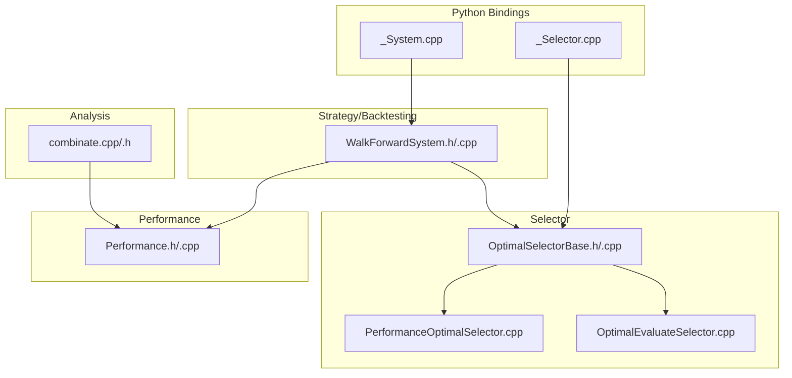
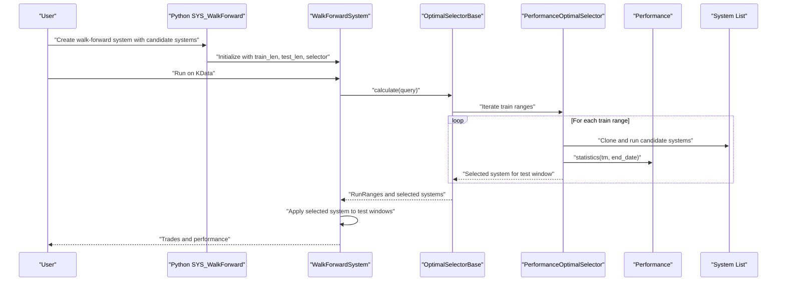
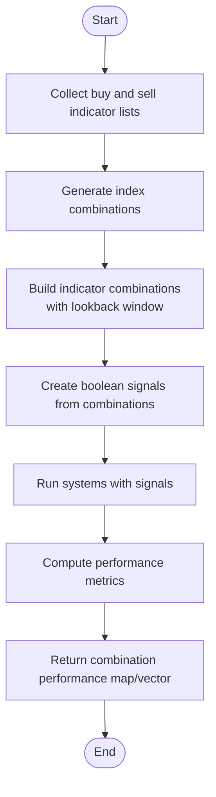
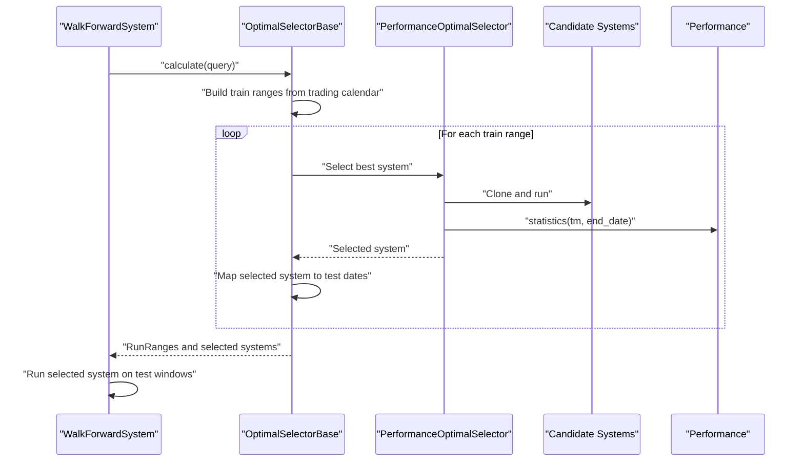
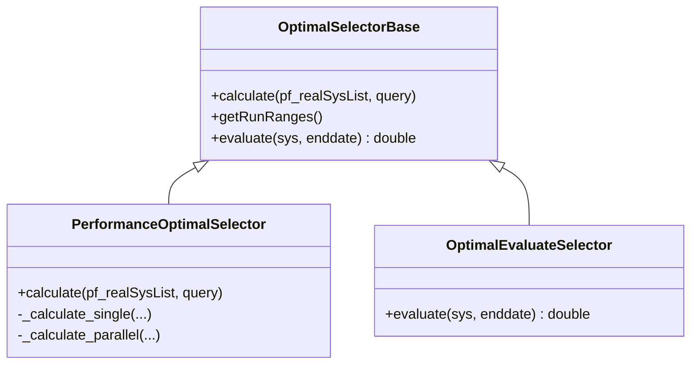
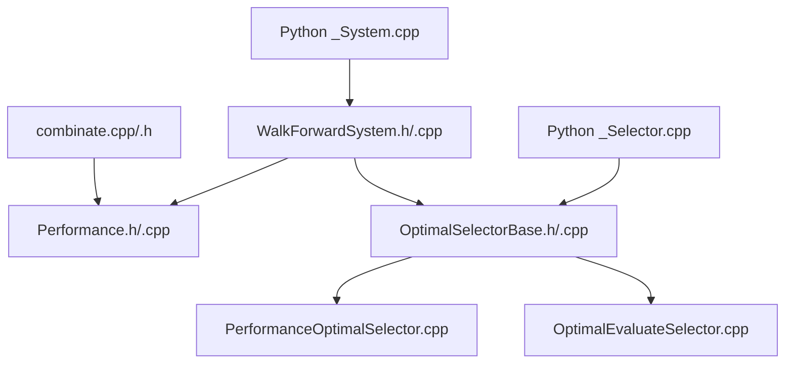

# Optimization Techniques

<cite>
**Referenced Files in This Document**
- [combinate.cpp](file://hikyuu_cpp/hikyuu/analysis/combinate.cpp)
- [combinate.h](file://hikyuu_cpp/hikyuu/analysis/combinate.h)
- [WalkForwardSystem.h](file://hikyuu_cpp/hikyuu/trade_sys/system/imp/WalkForwardSystem.h)
- [WalkForwardSystem.cpp](file://hikyuu_cpp/hikyuu/trade_sys/system/imp/WalkForwardSystem.cpp)
- [OptimalSelectorBase.h](file://hikyuu_cpp/hikyuu/trade_sys/selector/imp/optimal/OptimalSelectorBase.h)
- [OptimalSelectorBase.cpp](file://hikyuu_cpp/hikyuu/trade_sys/selector/imp/optimal/OptimalSelectorBase.cpp)
- [PerformanceOptimalSelector.cpp](file://hikyuu_cpp/hikyuu/trade_sys/selector/imp/optimal/PerformanceOptimalSelector.cpp)
- [OptimalEvaluateSelector.cpp](file://hikyuu_cpp/hikyuu/trade_sys/selector/imp/optimal/OptimalEvaluateSelector.cpp)
- [_System.cpp](file://hikyuu_pywrap/trade_sys/_System.cpp)
- [_Selector.cpp](file://hikyuu_pywrap/trade_sys/_Selector.cpp)
- [Performance.h](file://hikyuu_cpp/hikyuu/trade_manage/Performance.h)
- [Performance.cpp](file://hikyuu_cpp/hikyuu/trade_manage/Performance.cpp)
- [test_SYS_WalkForward.cpp](file://hikyuu_cpp/unit_test/hikyuu/trade_sys/system/test_SYS_WalkForward.cpp)
- [test_SE_PerformanceOptimal.cpp](file://hikyuu_cpp/unit_test/hikyuu/trade_sys/selector/test_SE_PerformanceOptimal.cpp)
- [test_SE_MaxFundsOptimal.cpp](file://hikyuu_cpp/unit_test/hikyuu/trade_sys/selector/test_SE_MaxFundsOptimal.cpp)
- [Turtle_SG.py](file://hikyuu/examples/Turtle_SG.py)
</cite>

## Table of Contents
1. [Introduction](#introduction)
2. [Project Structure](#project-structure)
3. [Core Components](#core-components)
4. [Architecture Overview](#architecture-overview)
5. [Detailed Component Analysis](#detailed-component-analysis)
6. [Dependency Analysis](#dependency-analysis)
7. [Performance Considerations](#performance-considerations)
8. [Troubleshooting Guide](#troubleshooting-guide)
9. [Conclusion](#conclusion)
10. [Appendices](#appendices)

## Introduction
This document explains the optimization techniques supported by hikyuu’s backtesting framework with a focus on walk-forward analysis for robust strategy parameter optimization and validation. It covers:
- How the combinate module enables rapid testing of parameter combinations for signals and indicators
- How walk-forward analysis divides historical data into in-sample and out-of-sample periods, optimizes parameters on in-sample windows, and validates on out-of-sample windows
- How the framework explores parameter spaces and integrates with the backtesting engine
- Guidance on avoiding overfitting and curve-fitting, selecting parameter ranges, and choosing lookback periods
- Practical performance considerations for computationally intensive optimization runs

## Project Structure
The optimization capabilities are implemented across several modules:
- Analysis: combinate module for indicator combination testing
- Strategy/Backtesting: WalkForwardSystem for rolling window optimization
- Selector: OptimalSelectorBase and derived selectors for in-sample evaluation and selection
- Performance: Performance statistics for evaluation metrics
- Python bindings: convenient constructors and helpers for walk-forward and custom evaluators

**Diagram sources**
- [combinate.cpp](file://hikyuu_cpp/hikyuu/analysis/combinate.cpp#L1-L129)
- [combinate.h](file://hikyuu_cpp/hikyuu/analysis/combinate.h#L1-L115)
- [WalkForwardSystem.h](file://hikyuu_cpp/hikyuu/trade_sys/system/imp/WalkForwardSystem.h#L1-L69)
- [WalkForwardSystem.cpp](file://hikyuu_cpp/hikyuu/trade_sys/system/imp/WalkForwardSystem.cpp#L1-L38)
- [OptimalSelectorBase.h](file://hikyuu_cpp/hikyuu/trade_sys/selector/imp/optimal/OptimalSelectorBase.h#L1-L87)
- [OptimalSelectorBase.cpp](file://hikyuu_cpp/hikyuu/trade_sys/selector/imp/optimal/OptimalSelectorBase.cpp#L1-L39)
- [PerformanceOptimalSelector.cpp](file://hikyuu_cpp/hikyuu/trade_sys/selector/imp/optimal/PerformanceOptimalSelector.cpp#L1-L41)
- [OptimalEvaluateSelector.cpp](file://hikyuu_cpp/hikyuu/trade_sys/selector/imp/optimal/OptimalEvaluateSelector.cpp#L1-L41)
- [Performance.h](file://hikyuu_cpp/hikyuu/trade_manage/Performance.h#L1-L88)
- [_System.cpp](file://hikyuu_pywrap/trade_sys/_System.cpp#L280-L304)
- [_Selector.cpp](file://hikyuu_pywrap/trade_sys/_Selector.cpp#L47-L95)

**Section sources**
- [combinate.cpp](file://hikyuu_cpp/hikyuu/analysis/combinate.cpp#L1-L129)
- [combinate.h](file://hikyuu_cpp/hikyuu/analysis/combinate.h#L1-L115)
- [WalkForwardSystem.h](file://hikyuu_cpp/hikyuu/trade_sys/system/imp/WalkForwardSystem.h#L1-L69)
- [WalkForwardSystem.cpp](file://hikyuu_cpp/hikyuu/trade_sys/system/imp/WalkForwardSystem.cpp#L1-L38)
- [OptimalSelectorBase.h](file://hikyuu_cpp/hikyuu/trade_sys/selector/imp/optimal/OptimalSelectorBase.h#L1-L87)
- [OptimalSelectorBase.cpp](file://hikyuu_cpp/hikyuu/trade_sys/selector/imp/optimal/OptimalSelectorBase.cpp#L1-L39)
- [PerformanceOptimalSelector.cpp](file://hikyuu_cpp/hikyuu/trade_sys/selector/imp/optimal/PerformanceOptimalSelector.cpp#L1-L41)
- [OptimalEvaluateSelector.cpp](file://hikyuu_cpp/hikyuu/trade_sys/selector/imp/optimal/OptimalEvaluateSelector.cpp#L1-L41)
- [Performance.h](file://hikyuu_cpp/hikyuu/trade_manage/Performance.h#L1-L88)
- [_System.cpp](file://hikyuu_pywrap/trade_sys/_System.cpp#L280-L304)
- [_Selector.cpp](file://hikyuu_pywrap/trade_sys/_Selector.cpp#L47-L95)

## Core Components
- combinate module: Generates indicator combinations and evaluates them across a single stock or a block of stocks, returning performance metrics for each combination.
- WalkForwardSystem: Implements rolling window optimization by evaluating candidate systems on training windows and applying the selected system to subsequent test windows.
- OptimalSelectorBase and derived selectors: Define the in-sample evaluation process and produce run ranges for walk-forward execution.
- Performance: Provides standardized performance statistics used for optimization criteria.

**Section sources**
- [combinate.cpp](file://hikyuu_cpp/hikyuu/analysis/combinate.cpp#L1-L129)
- [combinate.h](file://hikyuu_cpp/hikyuu/analysis/combinate.h#L1-L115)
- [WalkForwardSystem.h](file://hikyuu_cpp/hikyuu/trade_sys/system/imp/WalkForwardSystem.h#L1-L69)
- [OptimalSelectorBase.h](file://hikyuu_cpp/hikyuu/trade_sys/selector/imp/optimal/OptimalSelectorBase.h#L1-L87)
- [Performance.h](file://hikyuu_cpp/hikyuu/trade_manage/Performance.h#L1-L88)

## Architecture Overview
The optimization architecture centers around two complementary workflows:
- Indicator/Signal Combination Testing (Analysis): Quickly explore parameter combinations for signals/indicators and rank by performance.
- Walk-Forward Parameter Optimization (Strategy): Divide history into rolling in-sample and out-of-sample windows, select the best-performing system in-sample, and validate on-out-of-sample.

**Diagram sources**
- [_System.cpp](file://hikyuu_pywrap/trade_sys/_System.cpp#L280-L304)
- [WalkForwardSystem.cpp](file://hikyuu_cpp/hikyuu/trade_sys/system/imp/WalkForwardSystem.cpp#L157-L195)
- [OptimalSelectorBase.cpp](file://hikyuu_cpp/hikyuu/trade_sys/selector/imp/optimal/OptimalSelectorBase.cpp#L102-L137)
- [PerformanceOptimalSelector.cpp](file://hikyuu_cpp/hikyuu/trade_sys/selector/imp/optimal/PerformanceOptimalSelector.cpp#L99-L126)
- [Performance.cpp](file://hikyuu_cpp/hikyuu/trade_manage/Performance.cpp#L71-L132)

## Detailed Component Analysis

### Indicator Combination Testing with combinate
The combinate module enables fast parameter-space exploration for signals/indicators by:
- Generating indicator combinations from buy and sell indicator sets
- Creating boolean signals from combinations
- Running systems with these signals and computing performance metrics
- Supporting single-stock and block-wide evaluation with parallelism

Key capabilities:
- Index combination generation with a practical upper bound on input size
- Indicator combination creation with a configurable lookback window
- Single-stock and block-wide analysis returning performance vectors per combination

**Diagram sources**
- [combinate.h](file://hikyuu_cpp/hikyuu/analysis/combinate.h#L17-L44)
- [combinate.h](file://hikyuu_cpp/hikyuu/analysis/combinate.h#L55-L71)
- [combinate.h](file://hikyuu_cpp/hikyuu/analysis/combinate.h#L100-L114)
- [combinate.cpp](file://hikyuu_cpp/hikyuu/analysis/combinate.cpp#L16-L31)
- [combinate.cpp](file://hikyuu_cpp/hikyuu/analysis/combinate.cpp#L33-L57)
- [combinate.cpp](file://hikyuu_cpp/hikyuu/analysis/combinate.cpp#L59-L127)

Practical usage examples:
- See the example signal class in Python that demonstrates parameterized signals and how to integrate them into the backtesting pipeline.
- The combinate module is ideal for quickly scanning small to medium-sized parameter grids for signal thresholds or indicator parameters.

**Section sources**
- [combinate.h](file://hikyuu_cpp/hikyuu/analysis/combinate.h#L17-L44)
- [combinate.h](file://hikyuu_cpp/hikyuu/analysis/combinate.h#L55-L71)
- [combinate.h](file://hikyuu_cpp/hikyuu/analysis/combinate.h#L100-L114)
- [combinate.cpp](file://hikyuu_cpp/hikyuu/analysis/combinate.cpp#L16-L31)
- [combinate.cpp](file://hikyuu_cpp/hikyuu/analysis/combinate.cpp#L33-L57)
- [combinate.cpp](file://hikyuu_cpp/hikyuu/analysis/combinate.cpp#L59-L127)
- [Turtle_SG.py](file://hikyuu/examples/Turtle_SG.py#L1-L48)

### Walk-Forward Analysis Implementation
Walk-forward analysis divides the historical dataset into overlapping rolling windows:
- In-sample (training) window: used to evaluate candidate systems and select the best performer
- Out-of-sample (test) window: used to validate the selected system’s performance

The framework:
- Builds trading calendar from query and market
- Defines train ranges and shifts by test_len to create overlapping windows
- Evaluates candidates in-sample and maps selected systems to out-of-sample dates
- Applies the selected system to test windows during run

**Diagram sources**
- [WalkForwardSystem.cpp](file://hikyuu_cpp/hikyuu/trade_sys/system/imp/WalkForwardSystem.cpp#L157-L195)
- [OptimalSelectorBase.cpp](file://hikyuu_cpp/hikyuu/trade_sys/selector/imp/optimal/OptimalSelectorBase.cpp#L102-L137)
- [PerformanceOptimalSelector.cpp](file://hikyuu_cpp/hikyuu/trade_sys/selector/imp/optimal/PerformanceOptimalSelector.cpp#L99-L126)
- [PerformanceOptimalSelector.cpp](file://hikyuu_cpp/hikyuu/trade_sys/selector/imp/optimal/PerformanceOptimalSelector.cpp#L163-L214)
- [OptimalSelectorBase.h](file://hikyuu_cpp/hikyuu/trade_sys/selector/imp/optimal/OptimalSelectorBase.h#L13-L24)

**Section sources**
- [WalkForwardSystem.h](file://hikyuu_cpp/hikyuu/trade_sys/system/imp/WalkForwardSystem.h#L1-L69)
- [WalkForwardSystem.cpp](file://hikyuu_cpp/hikyuu/trade_sys/system/imp/WalkForwardSystem.cpp#L1-L38)
- [WalkForwardSystem.cpp](file://hikyuu_cpp/hikyuu/trade_sys/system/imp/WalkForwardSystem.cpp#L157-L195)
- [OptimalSelectorBase.h](file://hikyuu_cpp/hikyuu/trade_sys/selector/imp/optimal/OptimalSelectorBase.h#L13-L24)
- [OptimalSelectorBase.cpp](file://hikyuu_cpp/hikyuu/trade_sys/selector/imp/optimal/OptimalSelectorBase.cpp#L102-L137)
- [PerformanceOptimalSelector.cpp](file://hikyuu_cpp/hikyuu/trade_sys/selector/imp/optimal/PerformanceOptimalSelector.cpp#L99-L126)
- [PerformanceOptimalSelector.cpp](file://hikyuu_cpp/hikyuu/trade_sys/selector/imp/optimal/PerformanceOptimalSelector.cpp#L163-L214)

### Parameter Space Exploration and Evaluation
- Grid search: The combinate module generates combinations of indicator parameters and evaluates them systematically. This is a form of grid search over small parameter sets.
- Custom evaluation: The OptimalSelectorBase allows custom evaluation functions via SE_EvaluateOptimal, enabling advanced optimization strategies beyond simple grid search.
- Performance metrics: Performance statistics provide standardized measures for ranking candidate systems.

**Diagram sources**
- [OptimalSelectorBase.h](file://hikyuu_cpp/hikyuu/trade_sys/selector/imp/optimal/OptimalSelectorBase.h#L26-L87)
- [PerformanceOptimalSelector.cpp](file://hikyuu_cpp/hikyuu/trade_sys/selector/imp/optimal/PerformanceOptimalSelector.cpp#L1-L41)
- [OptimalEvaluateSelector.cpp](file://hikyuu_cpp/hikyuu/trade_sys/selector/imp/optimal/OptimalEvaluateSelector.cpp#L1-L41)

**Section sources**
- [OptimalSelectorBase.h](file://hikyuu_cpp/hikyuu/trade_sys/selector/imp/optimal/OptimalSelectorBase.h#L26-L87)
- [PerformanceOptimalSelector.cpp](file://hikyuu_cpp/hikyuu/trade_sys/selector/imp/optimal/PerformanceOptimalSelector.cpp#L1-L41)
- [OptimalEvaluateSelector.cpp](file://hikyuu_cpp/hikyuu/trade_sys/selector/imp/optimal/OptimalEvaluateSelector.cpp#L1-L41)
- [_Selector.cpp](file://hikyuu_pywrap/trade_sys/_Selector.cpp#L424-L442)

### Methodology: In-Sample vs Out-of-Sample Periods
- In-sample (train) windows: Used to evaluate candidate systems and select the best performing system according to a chosen metric.
- Out-of-sample (test) windows: Used to validate the selected system’s performance without re-optimizing parameters.
- Overlapping windows: train_len and test_len define the window sizes; the sliding window ensures continuous coverage of the dataset.

Validation and correctness checks:
- Unit tests demonstrate correct run-range construction and selection behavior for both single and multiple candidate systems.

**Section sources**
- [OptimalSelectorBase.cpp](file://hikyuu_cpp/hikyuu/trade_sys/selector/imp/optimal/OptimalSelectorBase.cpp#L102-L137)
- [PerformanceOptimalSelector.cpp](file://hikyuu_cpp/hikyuu/trade_sys/selector/imp/optimal/PerformanceOptimalSelector.cpp#L163-L214)
- [test_SE_PerformanceOptimal.cpp](file://hikyuu_cpp/unit_test/hikyuu/trade_sys/selector/test_SE_PerformanceOptimal.cpp#L85-L123)
- [test_SE_PerformanceOptimal.cpp](file://hikyuu_cpp/unit_test/hikyuu/trade_sys/selector/test_SE_PerformanceOptimal.cpp#L125-L161)
- [test_SE_MaxFundsOptimal.cpp](file://hikyuu_cpp/unit_test/hikyuu/trade_sys/selector/test_SE_MaxFundsOptimal.cpp#L85-L123)
- [test_SE_MaxFundsOptimal.cpp](file://hikyuu_cpp/unit_test/hikyuu/trade_sys/selector/test_SE_MaxFundsOptimal.cpp#L125-L162)

### Relationship Between Optimization Results and Strategy Robustness
- Robustness hinges on out-of-sample validation: systems that perform well in-sample but fail out-of-sample likely overfit.
- Walk-forward analysis mitigates overfitting by preventing parameter leakage from test windows into training decisions.
- Metrics-based selection: Using Performance statistics ensures consistent evaluation criteria across systems.

Guidance:
- Prefer out-of-sample metrics for final selection.
- Use walk-forward with reasonable train_len/test_len to simulate realistic deployment conditions.
- Avoid excessive parameter tuning; keep parameter ranges narrow and meaningful.

**Section sources**
- [Performance.h](file://hikyuu_cpp/hikyuu/trade_manage/Performance.h#L1-L88)
- [Performance.cpp](file://hikyuu_cpp/hikyuu/trade_manage/Performance.cpp#L71-L132)
- [test_SYS_WalkForward.cpp](file://hikyuu_cpp/unit_test/hikyuu/trade_sys/system/test_SYS_WalkForward.cpp#L1-L42)
- [test_SYS_WalkForward.cpp](file://hikyuu_cpp/unit_test/hikyuu/trade_sys/system/test_SYS_WalkForward.cpp#L159-L187)

### Selecting Parameter Ranges and Lookback Periods
- Parameter ranges: Start narrow and expand gradually; use domain knowledge to constrain plausible ranges.
- Lookback periods: Align with the typical turnover and mean reversion characteristics of the asset class; too short may overfit noise; too long may miss recent regime changes.
- Train/test lengths: Choose train_len to capture enough dynamics for robust selection; choose test_len to provide meaningful validation without excessive computation.

[No sources needed since this section provides general guidance]

### Concrete Examples from combinate.cpp
- Indicator combination generation and evaluation for buy/sell signals
- Block-wide evaluation with parallel execution and error handling
- Output structure for downstream analysis

Refer to the following paths for implementation details:
- [combinate.cpp](file://hikyuu_cpp/hikyuu/analysis/combinate.cpp#L16-L31)
- [combinate.cpp](file://hikyuu_cpp/hikyuu/analysis/combinate.cpp#L33-L57)
- [combinate.cpp](file://hikyuu_cpp/hikyuu/analysis/combinate.cpp#L59-L127)
- [combinate.h](file://hikyuu_cpp/hikyuu/analysis/combinate.h#L55-L71)
- [combinate.h](file://hikyuu_cpp/hikyuu/analysis/combinate.h#L100-L114)

**Section sources**
- [combinate.cpp](file://hikyuu_cpp/hikyuu/analysis/combinate.cpp#L16-L31)
- [combinate.cpp](file://hikyuu_cpp/hikyuu/analysis/combinate.cpp#L33-L57)
- [combinate.cpp](file://hikyuu_cpp/hikyuu/analysis/combinate.cpp#L59-L127)
- [combinate.h](file://hikyuu_cpp/hikyuu/analysis/combinate.h#L55-L71)
- [combinate.h](file://hikyuu_cpp/hikyuu/analysis/combinate.h#L100-L114)

## Dependency Analysis
The optimization stack exhibits clear separation of concerns:
- combinate depends on indicator and system infrastructure and returns performance vectors
- WalkForwardSystem orchestrates run ranges and applies selected systems
- OptimalSelectorBase defines the evaluation contract and produces run ranges
- Performance provides the evaluation metrics used by selectors

**Diagram sources**
- [combinate.cpp](file://hikyuu_cpp/hikyuu/analysis/combinate.cpp#L1-L129)
- [combinate.h](file://hikyuu_cpp/hikyuu/analysis/combinate.h#L1-L115)
- [WalkForwardSystem.h](file://hikyuu_cpp/hikyuu/trade_sys/system/imp/WalkForwardSystem.h#L1-L69)
- [WalkForwardSystem.cpp](file://hikyuu_cpp/hikyuu/trade_sys/system/imp/WalkForwardSystem.cpp#L1-L38)
- [OptimalSelectorBase.h](file://hikyuu_cpp/hikyuu/trade_sys/selector/imp/optimal/OptimalSelectorBase.h#L1-L87)
- [OptimalSelectorBase.cpp](file://hikyuu_cpp/hikyuu/trade_sys/selector/imp/optimal/OptimalSelectorBase.cpp#L1-L39)
- [PerformanceOptimalSelector.cpp](file://hikyuu_cpp/hikyuu/trade_sys/selector/imp/optimal/PerformanceOptimalSelector.cpp#L1-L41)
- [OptimalEvaluateSelector.cpp](file://hikyuu_cpp/hikyuu/trade_sys/selector/imp/optimal/OptimalEvaluateSelector.cpp#L1-L41)
- [Performance.h](file://hikyuu_cpp/hikyuu/trade_manage/Performance.h#L1-L88)
- [_System.cpp](file://hikyuu_pywrap/trade_sys/_System.cpp#L280-L304)
- [_Selector.cpp](file://hikyuu_pywrap/trade_sys/_Selector.cpp#L47-L95)

**Section sources**
- [combinate.cpp](file://hikyuu_cpp/hikyuu/analysis/combinate.cpp#L1-L129)
- [WalkForwardSystem.cpp](file://hikyuu_cpp/hikyuu/trade_sys/system/imp/WalkForwardSystem.cpp#L157-L195)
- [OptimalSelectorBase.cpp](file://hikyuu_cpp/hikyuu/trade_sys/selector/imp/optimal/OptimalSelectorBase.cpp#L102-L137)
- [PerformanceOptimalSelector.cpp](file://hikyuu_cpp/hikyuu/trade_sys/selector/imp/optimal/PerformanceOptimalSelector.cpp#L99-L126)

## Performance Considerations
- Parallel evaluation: Both combinate block-wide analysis and selector calculations support parallel execution to reduce wall-clock time.
- Memory and CPU: Large parameter grids and long histories increase memory and compute requirements; tune train_len/test_len accordingly.
- I/O and serialization: Serialization support in selectors and systems enables persistence and reuse of evaluation results.

[No sources needed since this section provides general guidance]

## Troubleshooting Guide
Common issues and remedies:
- Empty candidate system list: Ensure candidate systems are added and properly initialized with a stock.
- Invalid market or query: Verify market code and query parameters align with available trading calendar.
- Overfitting symptoms: If in-sample performance drops significantly out-of-sample, reduce parameter complexity or increase test_len.
- Performance evaluation errors: Wrap custom evaluators in try-catch blocks; the framework logs errors and continues.

**Section sources**
- [test_SYS_WalkForward.cpp](file://hikyuu_cpp/unit_test/hikyuu/trade_sys/system/test_SYS_WalkForward.cpp#L1-L42)
- [test_SYS_WalkForward.cpp](file://hikyuu_cpp/unit_test/hikyuu/trade_sys/system/test_SYS_WalkForward.cpp#L159-L187)
- [OptimalEvaluateSelector.cpp](file://hikyuu_cpp/hikyuu/trade_sys/selector/imp/optimal/OptimalEvaluateSelector.cpp#L1-L41)
- [combinate.cpp](file://hikyuu_cpp/hikyuu/analysis/combinate.cpp#L90-L117)

## Conclusion
hikyuu’s optimization toolkit combines:
- Rapid indicator/signal combination testing via combinate for small-scale parameter grids
- Robust walk-forward analysis for parameter-free validation across rolling windows
- Flexible evaluation via custom selectors and standardized performance metrics

Adopting walk-forward with careful parameter range selection and out-of-sample validation helps mitigate overfitting and improves strategy robustness.

[No sources needed since this section summarizes without analyzing specific files]

## Appendices
- Python convenience: SYS_WalkForward and SE_EvaluateOptimal streamline setup and custom evaluation in Python bindings.

**Section sources**
- [_System.cpp](file://hikyuu_pywrap/trade_sys/_System.cpp#L280-L304)
- [_Selector.cpp](file://hikyuu_pywrap/trade_sys/_Selector.cpp#L424-L442)