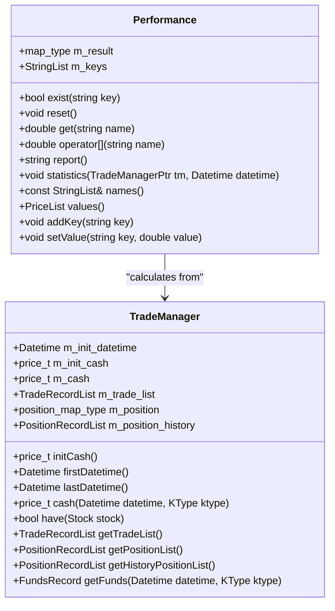

# Performance Analysis

<cite>
**Referenced Files in This Document**   
- [analysis.py](file://hikyuu/analysis/analysis.py)
- [Performance.h](file://hikyuu_cpp/hikyuu/trade_manage/Performance.h)
- [Performance.cpp](file://hikyuu_cpp/hikyuu/trade_manage/Performance.cpp)
- [TradeManager.h](file://hikyuu_cpp/hikyuu/trade_manage/TradeManager.h)
- [TradeManager.cpp](file://hikyuu_cpp/hikyuu/trade_manage/TradeManager.cpp)
- [_analysis.cpp](file://hikyuu_pywrap/analysis/_analysis.cpp)
- [combinate.h](file://hikyuu_cpp/hikyuu/analysis/combinate.h)
- [combinate.cpp](file://hikyuu_cpp/hikyuu/analysis/combinate.cpp)
- [analysis_sys.h](file://hikyuu_cpp/hikyuu/analysis/analysis_sys.h)
- [analysis_sys.cpp](file://hikyuu_cpp/hikyuu/analysis/analysis_sys.cpp)
- [PerformanceOptimalSelector.h](file://hikyuu_cpp/hikyuu/trade_sys/selector/imp/optimal/PerformanceOptimalSelector.h)
- [PerformanceOptimalSelector.cpp](file://hikyuu_cpp/hikyuu/trade_sys/selector/imp/optimal/PerformanceOptimalSelector.cpp)
</cite>

## Table of Contents
1. [Introduction](#introduction)
2. [Core Performance Metrics](#core-performance-metrics)
3. [Performance Data Structures](#performance-data-structures)
4. [Statistical Significance and Strategy Optimization](#statistical-significance-and-strategy-optimization)
5. [Monte Carlo Simulation and Robustness Evaluation](#monte-carlo-simulation-and-robustness-evaluation)
6. [Performance Reporting and Visualization](#performance-reporting-and-visualization)
7. [Accessing Performance Metrics via C++ and Python Interfaces](#accessing-performance-metrics-via-c-and-python-interfaces)
8. [Common Issues in Performance Interpretation](#common-issues-in-performance-interpretation)
9. [Best Practices for Strategy Evaluation](#best-practices-for-strategy-evaluation)
10. [Conclusion](#conclusion)

## Introduction
The hikyuu backtesting framework provides a comprehensive suite of performance analysis capabilities designed to evaluate trading strategies across multiple dimensions. This document details the framework's performance metrics, statistical analysis methods, and reporting capabilities. The system calculates a wide range of performance indicators including absolute returns, risk-adjusted returns, volatility measures, and various risk metrics. It also implements advanced analysis techniques such as statistical significance testing and Monte Carlo simulations to assess strategy robustness. The framework supports both C++ and Python interfaces, allowing users to access performance data and generate detailed reports. This documentation will explore the implementation of these features, the data structures used to store performance results, and best practices for interpreting and evaluating strategy performance beyond simple profitability metrics.

**Section sources**
- [analysis.py](file://hikyuu/analysis/analysis.py#L1-L152)
- [Performance.h](file://hikyuu_cpp/hikyuu/trade_manage/Performance.h#L1-L88)

## Core Performance Metrics
The hikyuu framework calculates an extensive set of performance metrics that can be categorized into several key groups: profitability metrics, risk metrics, efficiency metrics, and trading behavior metrics. The profitability metrics include absolute returns, cumulative invested principal, current total assets, cash balance, and unrealized position net value. The framework also calculates account compound annual growth rate (%) and account average annual return (%), providing insights into long-term performance. For risk assessment, the system computes volatility measures, maximum drawdown percentage, and various risk-adjusted return ratios including the Sharpe ratio and Sortino ratio. The Calmar ratio is also calculated to evaluate return relative to maximum drawdown. Trading efficiency metrics include profit expectancy, average profit/average loss ratio, and net profit/loss ratio. The framework tracks trading behavior through metrics such as winning trade ratio (%), maximum consecutive winning trades, maximum consecutive losing trades, average holding time for profitable and losing trades, and maximum holding time for profitable and losing trades. Additional metrics include transaction opportunity frequency per year, R-multiple expectancy, and annual expected R-multiple. The system also calculates position sizing metrics such as single transaction maximum cash usage ratio (%) and average transaction cash usage ratio (%), providing insights into capital allocation efficiency.

**Section sources**
- [Performance.cpp](file://hikyuu_cpp/hikyuu/trade_manage/Performance.cpp#L12-L65)
- [analysis.py](file://hikyuu/analysis/analysis.py#L19-L20)

## Performance Data Structures
The performance analysis system in hikyuu is built around the Performance class, which serves as the central data structure for storing and managing performance metrics. This class contains a map_type (std::map<string, double>) member variable m_result that stores all performance metrics as key-value pairs, with metric names as strings and their corresponding values as doubles. To maintain the order of metrics as they were originally defined, the class also includes a StringList member variable m_keys, which preserves the insertion order of metrics since standard maps do not guarantee order preservation. The Performance class provides methods for accessing metrics through both named lookup (get method) and array-style indexing (operator[]), with the values method returning all metric values in the order specified by m_keys. The class is designed to work in conjunction with the TradeManager class, which manages the underlying trading records and position data used to calculate performance metrics. When the statistics method is called on a Performance instance, it processes the trade records from a TradeManager instance to compute all metrics up to a specified datetime. The framework also includes specialized data structures for performance analysis across multiple strategies and securities, such as the CombinateAnalysisOutput struct for storing results from indicator combination testing and the AnalysisSystemOutput struct for storing system-level performance analysis results.

**Diagram sources **
- [Performance.h](file://hikyuu_cpp/hikyuu/trade_manage/Performance.h#L22-L88)
- [TradeManager.h](file://hikyuu_cpp/hikyuu/trade_manage/TradeManager.h#L35-L494)

## Statistical Significance and Strategy Optimization
The hikyuu framework implements several methods for statistical significance testing and strategy optimization. The system provides functions to compare performance metrics across different strategy configurations and select optimal parameters based on specified criteria. The findOptimalSystem and findOptimalSystemMulti functions allow users to identify the best-performing strategy from a list of system prototypes by comparing a specified performance metric, with the option to select either the maximum or minimum value. These functions iterate through a list of system instances, execute each system on the specified stock and query range, calculate performance metrics, and return the system with the optimal value for the specified metric. The framework also includes the PerformanceOptimalSelector class, which implements a more sophisticated optimization approach by dividing the data into training and testing periods. This selector calculates performance metrics over multiple training ranges and selects the system that performs best according to the specified criteria. The system supports parallel execution of performance calculations through the use of thread pools and parallel_for_index functions, enabling efficient evaluation of multiple strategy configurations. The statistical significance testing is implemented through direct comparison of performance metrics, with the framework providing the necessary infrastructure to execute multiple backtests and compare their results systematically. This approach allows users to assess whether performance differences between strategies are meaningful or potentially due to random variation.

**Section sources**
- [analysis_sys.cpp](file://hikyuu_cpp/hikyuu/analysis/analysis_sys.cpp#L88-L190)
- [PerformanceOptimalSelector.cpp](file://hikyuu_cpp/hikyuu/trade_sys/selector/imp/optimal/PerformanceOptimalSelector.cpp#L180-L214)

## Monte Carlo Simulation and Robustness Evaluation
The hikyuu framework incorporates Monte Carlo simulation capabilities through its performance analysis and strategy optimization components. While the codebase does not contain a dedicated Monte Carlo simulation module, the framework's design enables robustness evaluation through systematic parameter variation and out-of-sample testing. The PerformanceOptimalSelector class implements a form of Monte Carlo-like analysis by evaluating strategy performance across multiple training and testing periods, effectively creating multiple scenarios to assess strategy robustness. This approach involves dividing the available data into sequential training and testing windows, optimizing strategy parameters on the training data, and evaluating performance on the testing data. By repeating this process across multiple time periods, the framework can assess how consistently a strategy performs under different market conditions. The system also supports combinatorial testing of indicator parameters through functions like combinateIndicatorAnalysis, which tests all possible combinations of buy and sell indicators within specified constraints. This combinatorial approach, combined with parallel execution capabilities, allows for extensive scenario testing that approximates Monte Carlo simulation principles. The framework's ability to efficiently execute multiple backtests and compare their results provides a foundation for robustness evaluation, helping users identify strategies that perform well across different market regimes rather than being overfitted to specific historical conditions.

**Section sources**
- [PerformanceOptimalSelector.cpp](file://hikyuu_cpp/hikyuu/trade_sys/selector/imp/optimal/PerformanceOptimalSelector.cpp#L163-L178)
- [combinate.cpp](file://hikyuu_cpp/hikyuu/analysis/combinate.cpp#L33-L57)

## Performance Reporting and Visualization
The hikyuu framework provides comprehensive performance reporting capabilities through both programmatic interfaces and integrated visualization tools. The Performance class includes a report method that generates a formatted text output of all performance metrics, presenting each metric name followed by its value in a readable format. This text-based report can be directly printed or logged for analysis. The framework integrates with pandas DataFrames through Python bindings, allowing performance results to be easily converted into structured data tables for further analysis and visualization. Functions like combinate_ind_analysis and analysis_sys_list return pandas DataFrames containing performance metrics for multiple securities or strategy combinations, facilitating comparative analysis. The system also supports exporting performance data to CSV format through the tocsv method in the TradeManager class, enabling integration with external analysis tools. For visualization, the framework leverages Python's matplotlib and other plotting libraries through its draw module, allowing users to create charts of performance metrics, equity curves, and other analytical visualizations. The integration with Jupyter notebooks, as demonstrated in the example notebooks, enables interactive exploration of performance results with rich visual outputs. The reporting system is designed to be extensible, allowing users to customize the metrics included in reports and the format of the output to suit their specific analysis needs.

**Section sources**
- [Performance.cpp](file://hikyuu_cpp/hikyuu/trade_manage/Performance.cpp#L134-L149)
- [analysis.py](file://hikyuu/analysis/analysis.py#L39-L58)
- [TradeManager.h](file://hikyuu_cpp/hikyuu/trade_manage/TradeManager.h#L370-L371)

## Accessing Performance Metrics via C++ and Python Interfaces
The hikyuu framework provides seamless access to performance metrics through both C++ and Python interfaces, with the Python interface serving as a wrapper around the underlying C++ implementation. In C++, users can directly instantiate the Performance class and call its methods to calculate and retrieve performance metrics. The statistics method takes a TradeManager pointer and a datetime parameter to calculate metrics up to the specified date. Metrics can then be accessed using the get method with the metric name as a string parameter, or through the array-style operator[] for convenience. The names method returns a list of all available metric names in their defined order, while the values method returns all metric values as a PriceList. In Python, the interface is designed to be more user-friendly, with functions like combinate_ind_analysis and analysis_sys_list that abstract away the lower-level details and return pandas DataFrames containing performance results. These functions accept Python objects such as Stock, Query, TradeManager, and System instances, along with parameters for the analysis, and return structured data that can be easily manipulated and analyzed. The Python interface also supports keyword arguments for specifying which metrics to include in the output, with default metrics defined in the function signatures. The framework uses pybind11 to expose C++ classes and functions to Python, ensuring high performance while providing a Pythonic interface. This dual-interface design allows users to choose the appropriate level of abstraction based on their needs, with C++ providing fine-grained control and Python offering convenience and integration with the broader data science ecosystem.

**Section sources**
- [Performance.h](file://hikyuu_cpp/hikyuu/trade_manage/Performance.h#L41-L46)
- [analysis.py](file://hikyuu/analysis/analysis.py#L11-L58)
- [_analysis.cpp](file://hikyuu_pywrap/analysis/_analysis.cpp#L42-L66)

## Common Issues in Performance Interpretation
When interpreting performance results from the hikyuu framework, several common issues should be considered to avoid misleading conclusions. One major issue is overfitting, where a strategy appears to perform well on historical data but fails to generalize to new market conditions. This can occur when optimizing too many parameters or when the backtest period is not representative of future market behavior. Another issue is look-ahead bias, which can occur if performance metrics are calculated using information that would not have been available at the time of trading decisions. The framework helps mitigate this by requiring explicit specification of the calculation datetime in the statistics method. Survivorship bias is another concern, as the performance analysis may be based on securities that have survived to the present day, excluding those that were delisted or went bankrupt. Data mining bias can also affect results when testing multiple strategy variations and selecting the best performer without proper out-of-sample validation. Additionally, transaction cost assumptions can significantly impact performance metrics, and unrealistic cost models may lead to overly optimistic results. The framework addresses some of these issues through its support for realistic transaction cost modeling and its ability to test strategies across multiple time periods. However, users should still exercise caution and employ proper validation techniques, such as walk-forward analysis and out-of-sample testing, to ensure that performance results are robust and not simply the result of random chance or data mining.

**Section sources**
- [Performance.cpp](file://hikyuu_cpp/hikyuu/trade_manage/Performance.cpp#L151-L473)
- [TradeManager.cpp](file://hikyuu_cpp/hikyuu/trade_manage/TradeManager.cpp#L427-L432)

## Best Practices for Strategy Evaluation
To effectively evaluate trading strategies using the hikyuu framework, several best practices should be followed beyond simply examining profitability metrics. First, users should assess strategy consistency by examining performance across multiple market regimes and economic conditions, rather than focusing solely on overall profitability. This can be achieved by dividing the backtest period into sub-periods and analyzing performance in each segment. Second, risk-adjusted return metrics such as the Sharpe ratio, Sortino ratio, and Calmar ratio should be given significant weight in the evaluation process, as they provide insight into the efficiency of risk-taking. Third, users should conduct sensitivity analysis by varying key strategy parameters to assess robustness and avoid overfitting. The framework's combinatorial testing functions can be particularly useful for this purpose. Fourth, out-of-sample testing should be performed by reserving a portion of the data for validation after optimizing strategy parameters on the training data. Fifth, stress testing under extreme market conditions, such as periods of high volatility or market crashes, can help identify potential weaknesses in a strategy. Sixth, users should consider the practical aspects of strategy implementation, including transaction costs, slippage, and position sizing constraints, which can significantly impact real-world performance. Finally, it is important to evaluate the statistical significance of results by comparing the strategy's performance against appropriate benchmarks and considering the number of trades and time period over which the results were achieved. By following these best practices, users can develop a more comprehensive understanding of strategy performance and make more informed decisions about strategy selection and optimization.

**Section sources**
- [analysis.py](file://hikyuu/analysis/analysis.py#L11-L152)
- [Performance.cpp](file://hikyuu_cpp/hikyuu/trade_manage/Performance.cpp#L151-L473)

## Conclusion
The hikyuu backtesting framework provides a comprehensive and sophisticated set of performance analysis capabilities that enable thorough evaluation of trading strategies. The system calculates a wide range of performance metrics spanning profitability, risk, efficiency, and trading behavior, providing users with a multi-dimensional view of strategy performance. The framework's architecture, centered around the Performance class and integrated with the TradeManager, allows for accurate calculation of metrics based on detailed trade records and position data. Advanced features such as statistical significance testing, combinatorial analysis, and robustness evaluation through multiple testing periods enable users to assess strategy quality beyond simple profitability. The dual C++ and Python interfaces provide flexibility for both high-performance computing and user-friendly analysis, with seamless integration with popular data science tools like pandas. However, users must be aware of common pitfalls in performance interpretation, such as overfitting and various forms of bias, and should follow best practices for strategy evaluation that emphasize consistency, risk-adjusted returns, and out-of-sample validation. By leveraging the full capabilities of the hikyuu performance analysis framework while adhering to sound evaluation principles, users can develop and refine trading strategies with greater confidence in their potential real-world performance.