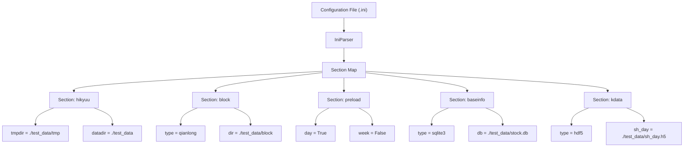
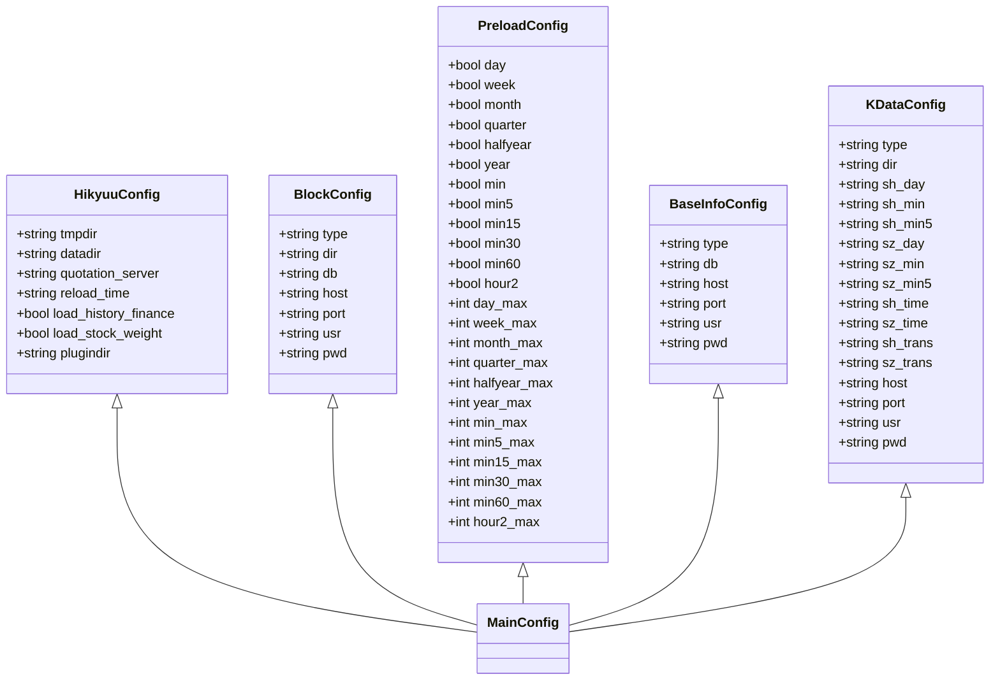
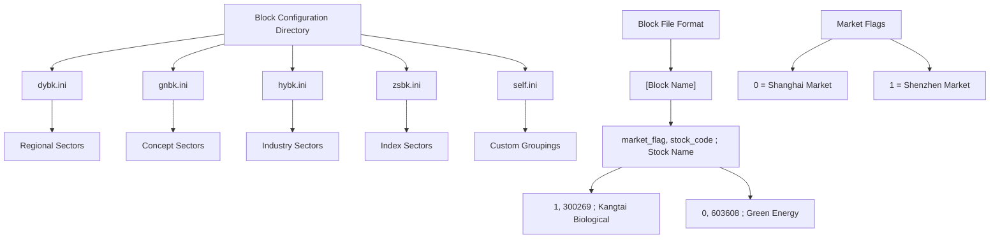
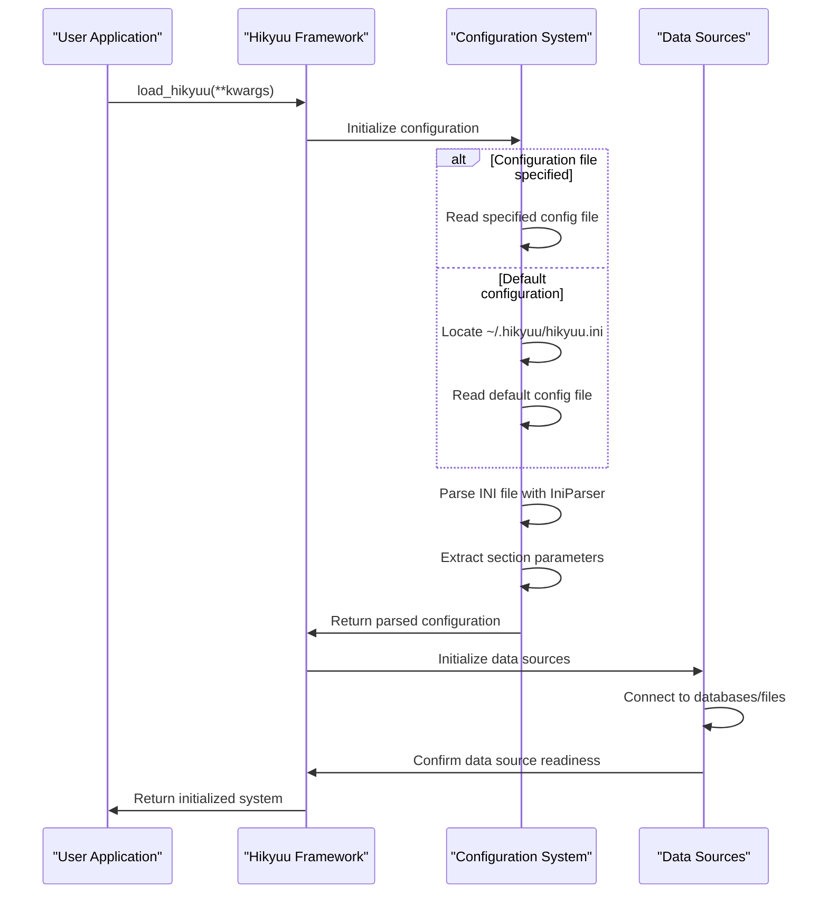
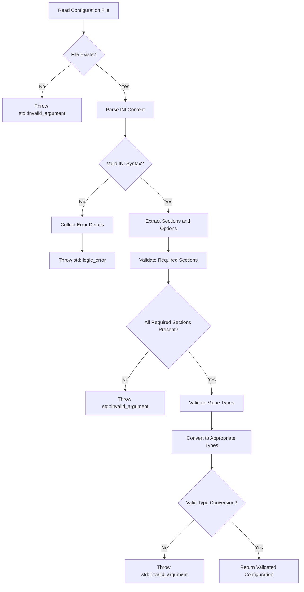

# Configuration Reference

<cite>
**Referenced Files in This Document**   
- [hikyuu.ini](file://test_data/hikyuu_linux.ini)
- [hikyuu_win.ini](file://test_data/hikyuu_win.ini)
- [dybk.ini](file://hikyuu/config/block/dybk.ini)
- [gnbk.ini](file://hikyuu/config/block/gnbk.ini)
- [hybk.ini](file://hikyuu/config/block/hybk.ini)
- [self.ini](file://hikyuu/config/block/self.ini)
- [zsbk.ini](file://hikyuu/config/block/zsbk.ini)
- [hku_config_template.py](file://hikyuu/data/hku_config_template.py)
- [IniParser.h](file://hikyuu_cpp/hikyuu/utilities/ini_parser/IniParser.h)
- [IniParser.cpp](file://hikyuu_cpp/hikyuu/utilities/ini_parser/IniParser.cpp)
- [__init__.py](file://hikyuu/__init__.py)
- [hikyuu.cpp](file://hikyuu_cpp/hikyuu/hikyuu.cpp)
</cite>

## Table of Contents
1. [Introduction](#introduction)
2. [Configuration File Structure](#configuration-file-structure)
3. [Core Configuration Sections](#core-configuration-sections)
4. [Block Configuration Files](#block-configuration-files)
5. [Runtime Configuration Mechanisms](#runtime-configuration-mechanisms)
6. [Environment Variables](#environment-variables)
7. [Configuration Validation and Error Handling](#configuration-validation-and-error-handling)
8. [Best Practices for Configuration Organization](#best-practices-for-configuration-organization)
9. [Troubleshooting Common Configuration Issues](#troubleshooting-common-configuration-issues)
10. [Complete Configuration Examples](#complete-configuration-examples)

## Introduction
Hikyuu is a quantitative trading framework that relies on comprehensive configuration files to define its behavior, data sources, and system parameters. This documentation provides a complete reference for all configuration aspects of the Hikyuu framework, covering both INI files for block definitions and Python files for system configuration. The configuration system enables users to customize data storage locations, specify data sources, control preloading behavior, and configure various system parameters without modifying source code. Understanding the configuration system is essential for deploying Hikyuu in different environments and for integrating with various data sources.

**Section sources**
- [hikyuu.ini](file://test_data/hikyuu_linux.ini#L1-L56)
- [hku_config_template.py](file://hikyuu/data/hku_config_template.py#L1-L339)

## Configuration File Structure
The Hikyuu framework uses INI-style configuration files as its primary configuration mechanism. These text-based files follow a standard INI format with sections, options, and values. The main configuration file, typically named `hikyuu.ini`, is located in the user's home directory under the `.hikyuu` folder. The framework also uses a collection of INI files for block definitions, stored in the `block` directory within the data directory.

The configuration system is implemented using the `IniParser` class in the C++ core, which provides robust parsing capabilities for INI files. The parser supports standard INI syntax with sections enclosed in square brackets, key-value pairs separated by equals signs, and comments indicated by semicolons. The parser includes comprehensive error handling for malformed configuration files, throwing appropriate exceptions when syntax errors are encountered.

Configuration files can be read and processed using the `read` method of the `IniParser` class, which loads the entire file into memory for efficient access. The parser maintains an internal map structure to store section and option data, allowing for quick lookups of configuration values. Various getter methods are provided to retrieve values as strings, integers, floating-point numbers, or boolean values, with support for default values when specified options are not present.



**Diagram sources**
- [IniParser.h](file://hikyuu_cpp/hikyuu/utilities/ini_parser/IniParser.h#L60-L100)
- [IniParser.cpp](file://hikyuu_cpp/hikyuu/utilities/ini_parser/IniParser.cpp#L56-L139)

**Section sources**
- [IniParser.h](file://hikyuu_cpp/hikyuu/utilities/ini_parser/IniParser.h#L1-L105)
- [IniParser.cpp](file://hikyuu_cpp/hikyuu/utilities/ini_parser/IniParser.cpp#L1-L386)

## Core Configuration Sections
The main configuration file contains several key sections that control different aspects of the Hikyuu framework. Each section serves a specific purpose and contains options relevant to that functionality.

### hikyuu Section
The `[hikyuu]` section contains general framework settings that affect the overall behavior of the system. Key options include:

- **tmpdir**: Specifies the directory for temporary files. This directory is used for storing intermediate data during various operations.
- **datadir**: Defines the root directory for all data files. This path is used as a base for locating various data files and directories.
- **quotation_server**: Sets the address for the quotation server, typically specified as an IPC (Inter-Process Communication) endpoint.
- **reload_time**: Determines when the system should reload data, specified in HH:MM format.
- **load_history_finance**: Boolean flag indicating whether historical financial data should be loaded into memory.
- **load_stock_weight**: Boolean flag controlling whether stock weight data should be loaded.
- **plugindir**: Specifies the directory where plugins are located.

### block Section
The `[block]` section configures the block data source, which contains groupings of stocks such as industry sectors, concepts, and regions. Configuration options vary depending on the data source type:

- **type**: Specifies the block data source type, which can be 'qianlong', 'sqlite3', 'mysql', or 'clickhouse'.
- **dir**: When using qianlong format, specifies the directory containing block definition files.
- **db**: For SQLite databases, specifies the database file path.
- **host, port, usr, pwd**: Connection parameters for MySQL or ClickHouse databases.

### preload Section
The `[preload]` section controls which KData series are preloaded into memory when the system starts. This optimization improves performance by reducing disk I/O during analysis. Each KData type has two corresponding options:

- **{ktype}**: Boolean flag enabling or disabling preloading for a specific KData type (e.g., day, week, min).
- **{ktype}_max**: Integer specifying the maximum number of records to preload for each stock.

Supported KData types include: day, week, month, quarter, halfyear, year, min, min5, min15, min30, min60, and hour2.

### baseinfo Section
The `[baseinfo]` section configures the source for basic stock information such as stock codes, names, and market information. The configuration parallels the block section with similar options for different data source types:

- **type**: Specifies the data source type ('sqlite3', 'mysql', or 'clickhouse').
- **db**: Database file path for SQLite.
- **host, port, usr, pwd**: Connection parameters for MySQL or ClickHouse.

### kdata Section
The `[kdata]` section defines the configuration for KData (candlestick data) storage. The options depend on the chosen data source type:

- **type**: Data source type ('tdx', 'hdf5', 'mysql', or 'clickhouse').
- For TDX format: **dir** specifies the root directory of TDX data.
- For HDF5 format: Various options specify file paths for different markets and KData types (e.g., sh_day, sz_min).
- For database formats: Connection parameters (host, port, usr, pwd).



**Diagram sources**
- [hikyuu.ini](file://test_data/hikyuu_linux.ini#L1-L56)
- [hikyuu.cpp](file://hikyuu_cpp/hikyuu/hikyuu.cpp#L45-L70)

**Section sources**
- [hikyuu.ini](file://test_data/hikyuu_linux.ini#L1-L56)
- [hikyuu.cpp](file://hikyuu_cpp/hikyuu/hikyuu.cpp#L45-L70)
- [__init__.py](file://hikyuu/__init__.py#L267-L291)

## Block Configuration Files
Block configuration files define groupings of stocks based on various criteria such as industry, concept, region, or custom groupings. These INI files are stored in the `block` directory and follow a specific format.

Each block file contains one or more sections, where the section name represents the block name (e.g., "广东板块" for Guangdong sector). Within each section, stock entries are listed with the format: `market_flag, stock_code`, where market_flag is 1 for Shenzhen market and 0 for Shanghai market.

The framework includes several standard block files:

- **dybk.ini**: Regional板块 (Regional sectors)
- **gnbk.ini**: Concept板块 (Concept sectors)
- **hybk.ini**: Industry板块 (Industry sectors)
- **zsbk.ini**: Index板块 (Index sectors)
- **self.ini**: Custom user-defined groupings

The `self.ini` file serves as an example of a custom block definition, allowing users to create personalized stock groupings for analysis. Each entry in a block file consists of a market flag and stock code, separated by a comma. Comments can be added after a semicolon to provide additional information about the stock.

Block files are typically generated automatically by data import tools, but can also be edited manually to add or remove stocks from specific groups. The framework reads these files to enable sector-based analysis, portfolio construction, and other functionality that relies on stock groupings.



**Diagram sources**
- [dybk.ini](file://hikyuu/config/block/dybk.ini#L1-L800)
- [gnbk.ini](file://hikyuu/config/block/gnbk.ini#L1-L800)
- [hybk.ini](file://hikyuu/config/block/hybk.ini#L1-L800)
- [zsbk.ini](file://hikyuu/config/block/zsbk.ini#L1-L800)
- [self.ini](file://hikyuu/config/block/self.ini#L1-L10)

**Section sources**
- [dybk.ini](file://hikyuu/config/block/dybk.ini#L1-L800)
- [gnbk.ini](file://hikyuu/config/block/gnbk.ini#L1-L800)
- [hybk.ini](file://hikyuu/config/block/hybk.ini#L1-L800)
- [zsbk.ini](file://hikyuu/config/block/zsbk.ini#L1-L800)
- [self.ini](file://hikyuu/config/block/self.ini#L1-L10)

## Runtime Configuration Mechanisms
Hikyuu provides multiple mechanisms for configuring the system at runtime, allowing for flexible deployment in different environments and use cases.

### Configuration File Loading
The framework loads configuration through a well-defined process that begins with locating the configuration file. By default, the system looks for `hikyuu.ini` in the user's home directory under the `.hikyuu` folder. The `load_hikyuu` function in the Python interface provides a convenient way to initialize the system with custom configuration options.

The configuration loading process involves several steps:
1. Locate and read the main configuration file
2. Parse the INI file using the `IniParser` class
3. Extract configuration parameters for different subsystems
4. Initialize global parameters with the parsed values
5. Set up data sources based on the configuration

### Programmatic Configuration
In addition to file-based configuration, Hikyuu allows for programmatic configuration through function parameters. The `load_hikyuu` function accepts keyword arguments that override settings in the configuration file:

- **config_file**: Specify an alternative configuration file path
- **stock_list**: Limit loaded stocks to a specific list instead of all available stocks
- **ktype_list**: Specify which KData types to preload
- **preload_num**: Override the maximum number of records to preload for each KData type
- **load_history_finance**: Override the setting for loading historical financial data
- **load_weight**: Override the setting for loading stock weight data
- **start_spot**: Control whether to start the spot price collection service
- **spot_worker_num**: Set the number of worker threads for spot price collection
- **reload_time**: Override the data reload time

### Configuration Templates
The framework includes configuration templates in the `hku_config_template.py` file, which provides predefined templates for different data storage backends. These templates include:

- **hdf5_template**: Configuration for HDF5 data storage
- **mysql_template**: Configuration for MySQL database storage
- **clickhouse_template**: Configuration for ClickHouse database storage
- **import_config_template**: Configuration for data import operations

These templates use Python string formatting to allow for dynamic configuration based on user-specified parameters such as data directory, reload time, and database connection details.



**Diagram sources**
- [__init__.py](file://hikyuu/__init__.py#L219-L248)
- [hikyuu.cpp](file://hikyuu_cpp/hikyuu/hikyuu.cpp#L45-L70)
- [hku_config_template.py](file://hikyuu/data/hku_config_template.py#L25-L304)

**Section sources**
- [__init__.py](file://hikyuu/__init__.py#L219-L248)
- [hikyuu.cpp](file://hikyuu_cpp/hikyuu/hikyuu.cpp#L45-L70)
- [hku_config_template.py](file://hikyuu/data/hku_config_template.py#L25-L304)

## Environment Variables
While Hikyuu primarily relies on configuration files, certain environment variables can influence framework behavior, particularly in development and deployment scenarios.

The framework does not explicitly use environment variables for configuration, instead relying on the configuration file system. However, the location of the configuration file is determined by the user's home directory, which is typically set by the HOME (on Unix-like systems) or USERPROFILE (on Windows) environment variable.

When running in different environments, users can influence the configuration behavior by:

1. Setting the user home directory environment variable to redirect the configuration file location
2. Using containerization technologies like Docker, where environment variables can be used to mount configuration volumes
3. Setting environment variables for database connections when using MySQL or ClickHouse, though these are typically specified in the configuration file

The framework's design encourages configuration through files rather than environment variables, promoting consistency across different deployment environments. This approach ensures that configuration is version-controlled and easily reproducible.

For Docker deployments, the framework provides Dockerfiles that demonstrate how to set up the environment, including volume mounting for configuration and data directories. These Dockerfiles use standard practices for containerized applications, allowing environment variables to be used for runtime configuration when deployed in container orchestration systems.

**Section sources**
- [Dockerfile_dev](file://docker/Dockerfile_dev)
- [Dockerfile_dev_debian](file://docker/Dockerfile_dev_debian)
- [Dockerfile_dev_fedora](file://docker/Dockerfile_dev_fedora)
- [Dockerfile_miniconda](file://docker/Dockerfile_miniconda)

## Configuration Validation and Error Handling
Hikyuu implements comprehensive validation and error handling for configuration files to ensure system stability and provide meaningful feedback to users.

### INI File Validation
The `IniParser` class performs rigorous validation of INI files during the reading process. The validation includes:

- Checking for the existence of the specified file
- Verifying correct INI syntax, including properly formatted section headers (enclosed in square brackets)
- Ensuring key-value pairs are properly separated by equals signs
- Validating that section headers are not empty
- Confirming that keys and values are not empty

When validation fails, the parser throws appropriate exceptions:
- `std::invalid_argument` for non-existent files or missing sections/options without default values
- `std::logic_error` for syntax errors in the INI file format

The parser collects detailed error information, including line numbers and the content of problematic lines, to assist users in diagnosing configuration issues.

### Value Type Conversion
The configuration system provides type-safe methods for retrieving configuration values, with appropriate error handling:

- **get()**: Retrieves string values, throwing `std::invalid_argument` if the option doesn't exist and no default is provided
- **getInt()**: Converts values to integers, throwing exceptions for invalid integer formats
- **getFloat()** and **getDouble()**: Convert values to floating-point numbers, with validation for valid numeric formats
- **getBool()**: Converts values to boolean, accepting various representations (1/0, true/false, yes/no, on/off, case-insensitive)

These methods first validate that default values (if provided) can be converted to the requested type before attempting to retrieve the actual configuration value.

### Configuration Consistency
The framework ensures configuration consistency by validating interdependent settings. For example, when configuring database connections, the system verifies that all required parameters (host, port, username, password) are present when the type is set to a database backend.

The Python interface provides additional validation through the `load_hikyuu` function, which checks the validity of programmatic configuration parameters before initializing the system. This includes validating stock lists, KData type specifications, and preload limits.



**Diagram sources**
- [IniParser.cpp](file://hikyuu_cpp/hikyuu/utilities/ini_parser/IniParser.cpp#L56-L139)
- [IniParser.cpp](file://hikyuu_cpp/hikyuu/utilities/ini_parser/IniParser.cpp#L214-L383)

**Section sources**
- [IniParser.h](file://hikyuu_cpp/hikyuu/utilities/ini_parser/IniParser.h#L1-L105)
- [IniParser.cpp](file://hikyuu_cpp/hikyuu/utilities/ini_parser/IniParser.cpp#L1-L386)

## Best Practices for Configuration Organization
Proper organization of configuration files is essential for maintaining a reliable and scalable Hikyuu deployment. The following best practices are recommended:

### Development vs. Production Environments
Maintain separate configuration files for development and production environments. Use the provided `hikyuu_linux.ini` and `hikyuu_win.ini` files as templates, customizing them for specific deployment scenarios. This separation prevents accidental changes to production settings during development.

### Configuration File Location
Keep the main configuration file in the default location (`~/.hikyuu/hikyuu.ini`) to ensure compatibility with the framework's expectations. If multiple configurations are needed, create symbolic links to the appropriate configuration file rather than modifying the framework's search path.

### Block File Management
Organize block files in the `block` directory with clear naming conventions. Use the standard file names (dybk.ini, gnbk.ini, hybk.ini, zsbk.ini) for consistency. For custom block definitions, use descriptive names that indicate the grouping criteria.

When creating custom block files, follow the same format as the standard files, with clear section headers and properly formatted stock entries. Include comments to document the purpose of each block and any special considerations.

### Version Control
Include configuration files in version control systems to track changes and enable collaboration. However, exclude sensitive information such as database passwords from version control by using environment-specific configuration files or secure credential storage mechanisms.

### Backup and Recovery
Regularly back up configuration files along with data files. The configuration represents critical system settings that are necessary for system recovery in case of hardware failure or data corruption.

### Documentation
Maintain documentation for custom configuration settings and block definitions. This documentation should include:
- The purpose of each custom block
- The criteria used for stock selection
- Any dependencies between configuration settings
- Performance implications of different configuration choices

**Section sources**
- [hikyuu_linux.ini](file://test_data/hikyuu_linux.ini#L1-L56)
- [hikyuu_win.ini](file://test_data/hikyuu_win.ini#L1-L56)
- [hku_config_template.py](file://hikyuu/data/hku_config_template.py#L25-L304)

## Troubleshooting Common Configuration Issues
When encountering configuration issues with Hikyuu, the following troubleshooting steps can help identify and resolve problems:

### Missing Configuration File
If the system cannot find the configuration file, verify that:
- The `.hikyuu` directory exists in the user's home directory
- The `hikyuu.ini` file is present in the `.hikyuu` directory
- The user has read permissions for the configuration file
- The home directory environment variable is correctly set

The framework provides a `generate_default_config()` function in `hku_config_template.py` that can create a default configuration file if none exists.

### Syntax Errors in INI Files
When INI file syntax errors occur, the error messages typically include the line number and content of the problematic line. Common syntax issues include:
- Missing closing bracket in section headers
- Missing equals sign in key-value pairs
- Empty section names
- Malformed key or value

Use a text editor with INI syntax highlighting to identify these issues more easily.

### Database Connection Problems
For database-backed configurations (MySQL, ClickHouse), connection issues may arise from:
- Incorrect host, port, username, or password
- Network connectivity problems
- Database server not running
- Firewall blocking the connection

Verify the connection parameters in the configuration file and test the database connection independently using database client tools.

### Data Path Issues
Problems with data paths can occur when:
- The specified directory does not exist
- The user lacks read/write permissions for the directory
- The path contains special characters or spaces

Ensure that all directories specified in the configuration exist and have appropriate permissions. Use absolute paths when possible to avoid ambiguity.

### Block File Loading Issues
If block files are not loading correctly:
- Verify that the block directory path is correctly specified in the configuration
- Check that the block files have the correct format with proper section headers
- Ensure that stock codes are correctly formatted with the appropriate market flag
- Validate that the file encoding is UTF-8, especially for files with Chinese characters

The framework's logging system can provide additional diagnostic information when configuration issues occur. Enable verbose logging to get more detailed information about the configuration loading process.

**Section sources**
- [hikyuu.ini](file://test_data/hikyuu_linux.ini#L1-L56)
- [IniParser.cpp](file://hikyuu_cpp/hikyuu/utilities/ini_parser/IniParser.cpp#L56-L139)
- [hku_config_template.py](file://hikyuu/data/hku_config_template.py#L303-L339)

## Complete Configuration Examples
This section provides complete examples of configuration files for different deployment scenarios.

### Default HDF5 Configuration
The following example shows a typical configuration for using HDF5 files as the data backend:

```ini
[hikyuu]
tmpdir = /home/user/stock/tmp
datadir = /home/user/stock
reload_time = 00:00
quotation_server = ipc:///tmp/hikyuu_real.ipc

[block]
type = sqlite3
db = /home/user/stock/stock.db

[preload]
day = True
week = False
month = False
quarter = False
halfyear = False
year = False
min = False
min5 = False
min15 = False
min30 = False
min60 = False
hour2 = False
day_max = 100000
week_max = 100000
month_max = 100000
quarter_max = 100000
halfyear_max = 100000
year_max = 100000
min_max = 5120
min5_max = 5120
min15_max = 5120
min30_max = 5120
min60_max = 5120
hour2_max = 5120

[baseinfo]
type = sqlite3
db = /home/user/stock/stock.db

[kdata]
type = hdf5
sh_day = /home/user/stock/sh_day.h5
sh_min = /home/user/stock/sh_1min.h5
sh_min5 = /home/user/stock/sh_5min.h5
sz_day = /home/user/stock/sz_day.h5
sz_min = /home/user/stock/sz_1min.h5
sz_min5 = /home/user/stock/sz_5min.h5
sh_time = /home/user/stock/sh_time.h5
sz_time = /home/user/stock/sz_time.h5
sh_trans = /home/user/stock/sh_trans.h5
sz_trans = /home/user/stock/sz_trans.h5
```

### MySQL Database Configuration
The following example demonstrates configuration for using MySQL as the data backend:

```ini
[hikyuu]
tmpdir = /home/user/stock
datadir = /home/user/stock
reload_time = 00:00
quotation_server = ipc:///tmp/hikyuu_real.ipc

[block]
type = mysql
host = localhost
port = 3306
usr = hikyuu
pwd = password

[preload]
day = True
week = False
month = False
quarter = False
halfyear = False
year = False
min = False
min5 = False
min15 = False
min30 = False
min60 = False
hour2 = False
day_max = 100000
week_max = 100000
month_max = 100000
quarter_max = 100000
halfyear_max = 100000
year_max = 100000
min_max = 5120
min5_max = 5120
min15_max = 5120
min30_max = 5120
min60_max = 5120
hour2_max = 5120

[baseinfo]
type = mysql
host = localhost
port = 3306
usr = hikyuu
pwd = password

[kdata]
type = mysql
host = localhost
port = 3306
usr = hikyuu
pwd = password
```

### Custom Block File Example
The following example shows a custom block file for a user-defined stock grouping:

```ini
[Technology Stocks]
1, 300750 ; Ningbo Xingwei Precision
1, 300661 ; Changchun Changsheng
0, 600745 ; Huahai Technology
1, 300682 ; Languang Shares
0, 600733 ; Sichuan Jiuzhou

[Consumer Stocks]
0, 600887 ; Inner Mongolia Yili
0, 600600 ; Qingdao Beer
0, 600519 ; Guizhou Moutai
1, 300498 ; Wenkang Livestock
0, 600809 ; Guosheng Liquor
```

These examples illustrate the flexibility of the Hikyuu configuration system and provide templates for common deployment scenarios.

**Section sources**
- [hikyuu_linux.ini](file://test_data/hikyuu_linux.ini#L1-L56)
- [hku_config_template.py](file://hikyuu/data/hku_config_template.py#L25-L148)
- [self.ini](file://hikyuu/config/block/self.ini#L1-L10)