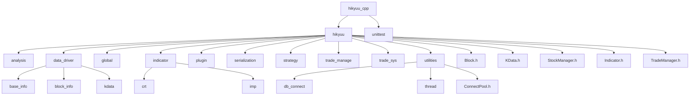
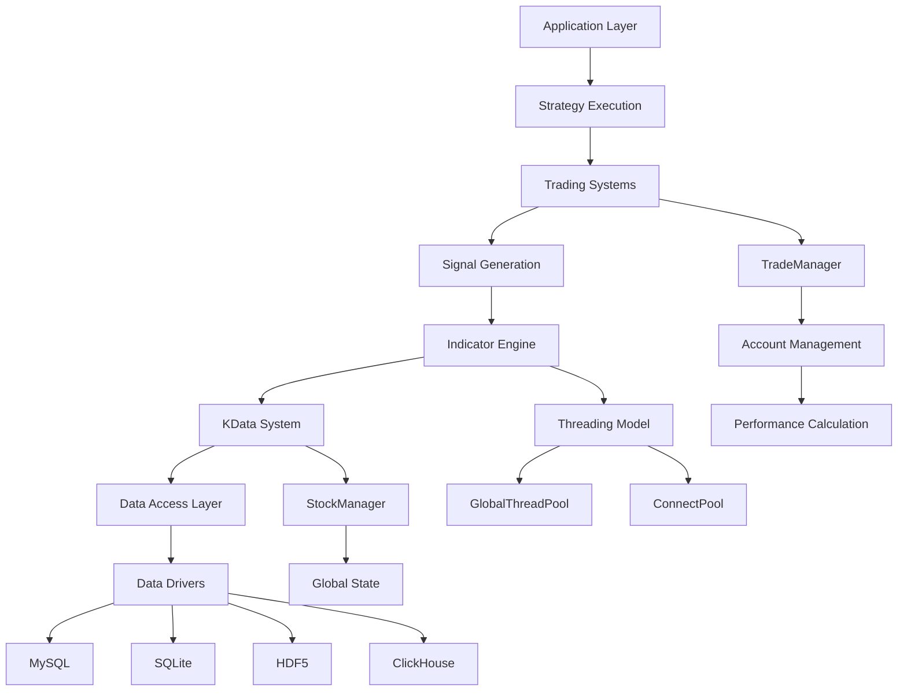
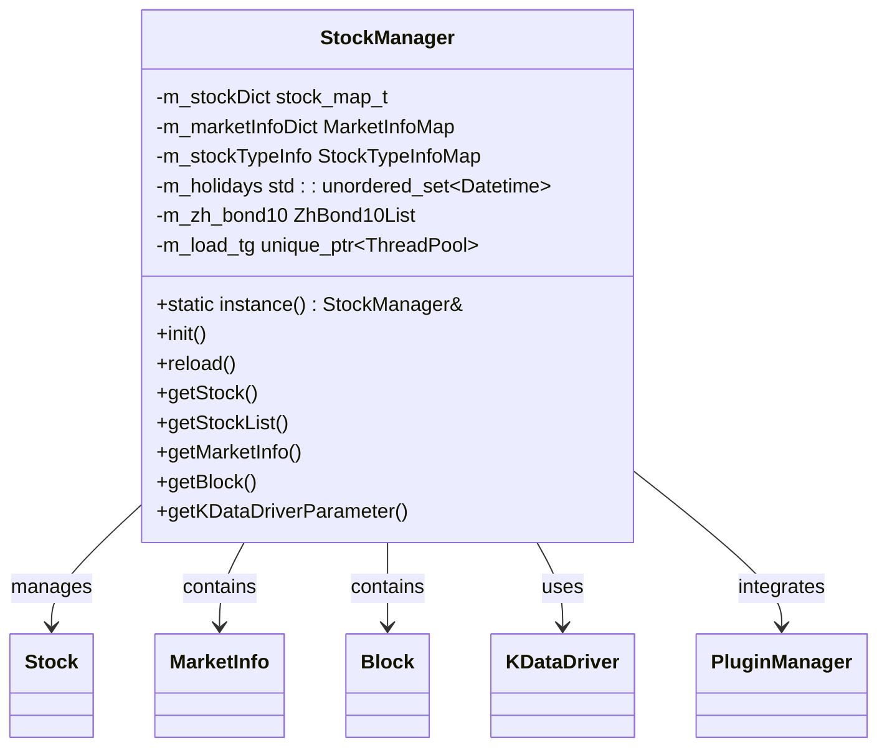
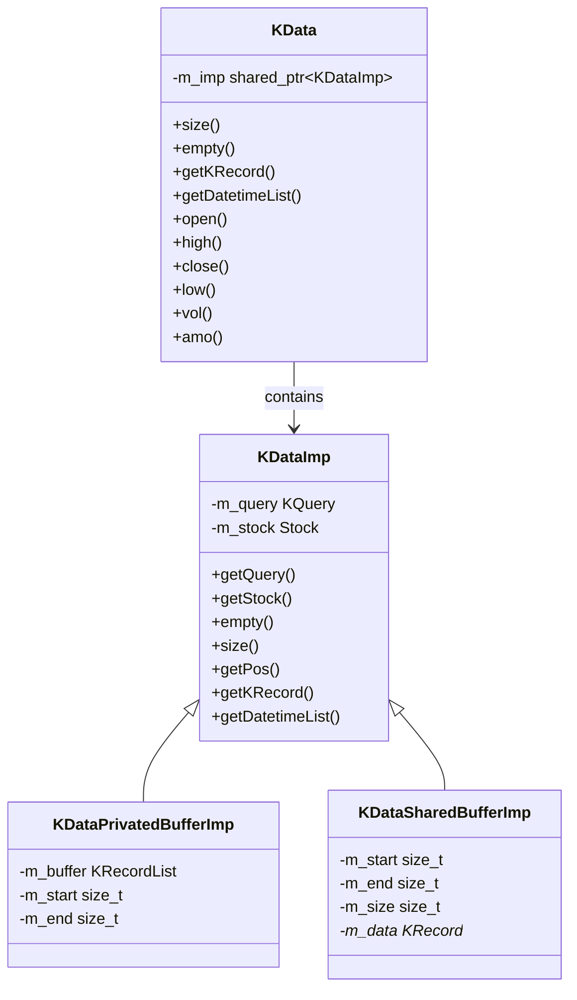
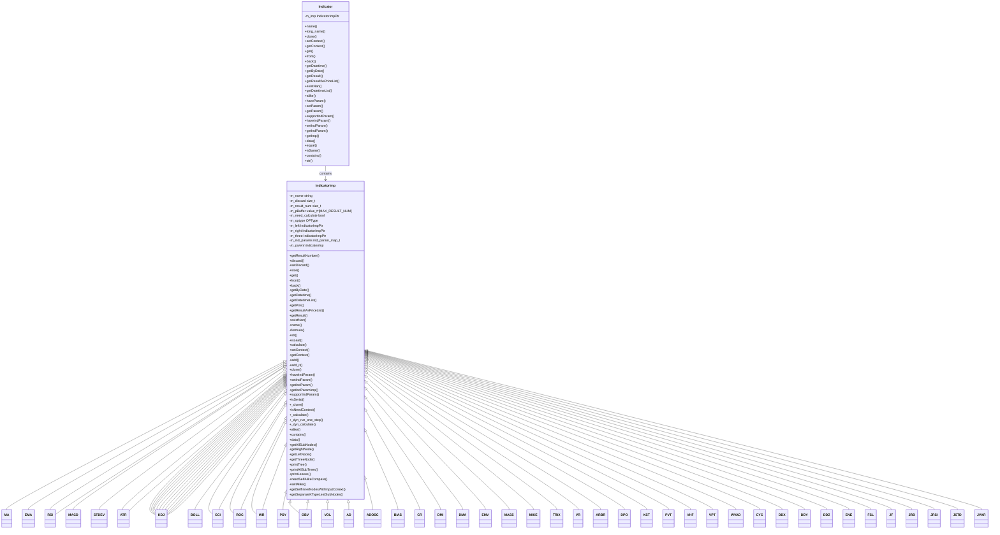
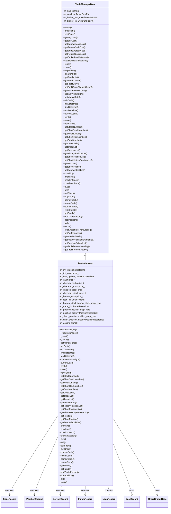
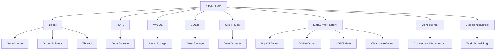

# C++ Core

<cite>
**Referenced Files in This Document**   
- [StockManager.h](file://hikyuu_cpp/hikyuu/StockManager.h)
- [KData.h](file://hikyuu_cpp/hikyuu/KData.h)
- [KDataImp.h](file://hikyuu_cpp/hikyuu/KDataImp.h)
- [KDataPrivatedBufferImp.h](file://hikyuu_cpp/hikyuu/KDataPrivatedBufferImp.h)
- [KDataSharedBufferImp.h](file://hikyuu_cpp/hikyuu/KDataSharedBufferImp.h)
- [Indicator.h](file://hikyuu_cpp/hikyuu/indicator/Indicator.h)
- [IndicatorImp.h](file://hikyuu_cpp/hikyuu/indicator/IndicatorImp.h)
- [TradeManager.h](file://hikyuu_cpp/hikyuu/trade_manage/TradeManager.h)
- [TradeManagerBase.h](file://hikyuu_cpp/hikyuu/trade_manage/TradeManagerBase.h)
- [DataDriverFactory.h](file://hikyuu_cpp/hikyuu/data_driver/DataDriverFactory.h)
- [KDataDriver.h](file://hikyuu_cpp/hikyuu/data_driver/KDataDriver.h)
- [GlobalThreadPool.h](file://hikyuu_cpp/hikyuu/utilities/thread/GlobalThreadPool.h)
- [ConnectPool.h](file://hikyuu_cpp/hikyuu/utilities/ConnectPool.h)
- [Strategy.h](file://hikyuu_cpp/hikyuu/strategy/Strategy.h)
</cite>

## Table of Contents
1. [Introduction](#introduction)
2. [Project Structure](#project-structure)
3. [Core Components](#core-components)
4. [Architecture Overview](#architecture-overview)
5. [Detailed Component Analysis](#detailed-component-analysis)
6. [Dependency Analysis](#dependency-analysis)
7. [Performance Considerations](#performance-considerations)
8. [Troubleshooting Guide](#troubleshooting-guide)
9. [Conclusion](#conclusion)

## Introduction
The hikyuu framework is a high-performance computing engine designed for quantitative trading research, with its core implemented in C++. This document provides comprehensive architectural documentation of the C++ core, focusing on the optimized data structures and computational patterns used for financial time series processing. The system is designed to handle computationally intensive operations such as backtesting and technical indicator calculations with maximum efficiency.

The framework's architecture centers around several key components: the StockManager for global securities management, the KData system for market data handling, the Indicator engine for technical analysis calculations, and trading system components for strategy execution. The design incorporates several architectural patterns including the Singleton pattern for the StockManager, the Strategy pattern for trading components, and the Factory pattern for data drivers.

Performance optimization is a primary concern throughout the architecture, with careful attention to memory management, threading models, and computational efficiency. The system leverages C++ features and optimizations to achieve high performance in computationally intensive operations. The core components are designed to work together seamlessly while maintaining separation of concerns and modularity.

## Project Structure
The hikyuu framework is organized into a well-structured directory hierarchy that separates concerns and facilitates maintainability. The C++ core components are located in the hikyuu_cpp directory, which contains the primary implementation files for the framework's high-performance computing engine.

**Diagram sources**
- [hikyuu_cpp/hikyuu](file://hikyuu_cpp/hikyuu)
- [hikyuu_cpp/hikyuu/data_driver](file://hikyuu_cpp/hikyuu/data_driver)
- [hikyuu_cpp/hikyuu/indicator](file://hikyuu_cpp/hikyuu/indicator)
- [hikyuu_cpp/hikyuu/utilities](file://hikyuu_cpp/hikyuu/utilities)

**Section sources**
- [hikyuu_cpp](file://hikyuu_cpp)

## Core Components
The hikyuu framework's C++ core consists of several key components that work together to provide a high-performance platform for quantitative trading research. The StockManager serves as the central repository for all securities information, implemented as a Singleton to ensure global access and consistency. This component manages the lifecycle of all stock data and provides a unified interface for accessing market information.

The KData system is responsible for handling market data, providing optimized data structures for financial time series processing. It supports various data types including K-line data, tick data, and time series data, with efficient memory management through shared and private buffers. The Indicator engine forms the computational core of the framework, enabling the calculation of technical analysis indicators with high performance.

The trading system components, including TradeManager and related classes, manage account information, execute trades, and track performance. These components implement the Strategy pattern, allowing for flexible and extensible trading system designs. The architecture also includes a sophisticated data driver system that uses the Factory pattern to instantiate appropriate data access implementations based on configuration.

**Section sources**
- [StockManager.h](file://hikyuu_cpp/hikyuu/StockManager.h)
- [KData.h](file://hikyuu_cpp/hikyuu/KData.h)
- [Indicator.h](file://hikyuu_cpp/hikyuu/indicator/Indicator.h)
- [TradeManager.h](file://hikyuu_cpp/hikyuu/trade_manage/TradeManager.h)

## Architecture Overview
The hikyuu C++ core architecture is designed as a layered system with clear separation of concerns. At the foundation is the data access layer, which handles retrieval and storage of financial data through various drivers. Above this layer sits the data processing layer, which includes the KData system and Indicator engine for manipulating and analyzing financial time series.

**Diagram sources**
- [StockManager.h](file://hikyuu_cpp/hikyuu/StockManager.h)
- [KData.h](file://hikyuu_cpp/hikyuu/KData.h)
- [Indicator.h](file://hikyuu_cpp/hikyuu/indicator/Indicator.h)
- [TradeManager.h](file://hikyuu_cpp/hikyuu/trade_manage/TradeManager.h)
- [DataDriverFactory.h](file://hikyuu_cpp/hikyuu/data_driver/DataDriverFactory.h)
- [GlobalThreadPool.h](file://hikyuu_cpp/hikyuu/utilities/thread/GlobalThreadPool.h)
- [ConnectPool.h](file://hikyuu_cpp/hikyuu/utilities/ConnectPool.h)

## Detailed Component Analysis

### StockManager Analysis
The StockManager component is implemented as a Singleton, ensuring that only one instance exists throughout the application lifecycle. This design choice provides global access to securities information while maintaining data consistency across the system. The StockManager is responsible for initializing and managing all stock data, including market information, stock type details, and block classifications.

The component uses a lazy initialization pattern, loading data only when needed, which improves startup performance. It maintains several internal data structures, including a stock dictionary (m_stockDict), market information dictionary (m_marketInfoDict), and stock type information map (m_stockTypeInfo). These structures are protected by shared mutexes to ensure thread safety during concurrent access.

**Diagram sources**
- [StockManager.h](file://hikyuu_cpp/hikyuu/StockManager.h#L29-L428)

**Section sources**
- [StockManager.h](file://hikyuu_cpp/hikyuu/StockManager.h#L1-L428)

### KData System Analysis
The KData system is designed for efficient financial time series processing, with optimized data structures and memory management strategies. The system uses a polymorphic design with KData serving as the interface and various implementation classes providing specific functionality. The core of the system is the KDataImp hierarchy, which includes both shared and private buffer implementations.

The KDataPrivatedBufferImp class uses a private vector (m_buffer) to store K-line records, providing direct access to data with O(1) complexity for most operations. In contrast, the KDataSharedBufferImp class uses a pointer to shared data (m_data), allowing multiple KData instances to reference the same underlying data buffer, which reduces memory consumption when multiple views of the same data are needed.

**Diagram sources**
- [KData.h](file://hikyuu_cpp/hikyuu/KData.h#L22-L201)
- [KDataImp.h](file://hikyuu_cpp/hikyuu/KDataImp.h#L14-L79)
- [KDataPrivatedBufferImp.h](file://hikyuu_cpp/hikyuu/KDataPrivatedBufferImp.h#L14-L69)
- [KDataSharedBufferImp.h](file://hikyuu_cpp/hikyuu/KDataSharedBufferImp.h#L14-L66)

**Section sources**
- [KData.h](file://hikyuu_cpp/hikyuu/KData.h#L1-L346)
- [KDataImp.h](file://hikyuu_cpp/hikyuu/KDataImp.h#L1-L84)
- [KDataPrivatedBufferImp.h](file://hikyuu_cpp/hikyuu/KDataPrivatedBufferImp.h#L1-L74)
- [KDataSharedBufferImp.h](file://hikyuu_cpp/hikyuu/KDataSharedBufferImp.h#L1-L70)

### Indicator Engine Analysis
The Indicator engine is the computational heart of the hikyuu framework, responsible for calculating technical analysis indicators. The design follows a composite pattern, with Indicator serving as the interface and IndicatorImp providing the implementation. The engine supports both built-in indicators and custom indicators through a plugin architecture.

The IndicatorImp class uses a sophisticated internal structure with multiple result sets (m_pBuffer) and operation types (OPType) to support complex indicator calculations. The system supports dynamic parameterization, allowing indicators to be parameterized with other indicators, enabling the creation of complex trading strategies. The implementation includes optimizations for common operations and supports both serial and parallel execution.

**Diagram sources**
- [Indicator.h](file://hikyuu_cpp/hikyuu/indicator/Indicator.h#L40-L258)
- [IndicatorImp.h](file://hikyuu_cpp/hikyuu/indicator/IndicatorImp.h#L28-L167)

**Section sources**
- [Indicator.h](file://hikyuu_cpp/hikyuu/indicator/Indicator.h#L1-L488)
- [IndicatorImp.h](file://hikyuu_cpp/hikyuu/indicator/IndicatorImp.h#L1-L491)

### Trading System Components Analysis
The trading system components in hikyuu are designed around the Strategy pattern, with TradeManager serving as the base class for account management and trade execution. The TradeManagerBase class provides the core interface for trading operations, while the TradeManager class implements the specific functionality for backtesting and simulation.

The system maintains detailed records of all trading activities, including transaction history, position records, and fund movements. The design supports both long and short positions, with separate tracking for each. The component also handles complex scenarios such as margin trading, borrowing, and lending, providing a comprehensive simulation environment for trading strategies.

**Diagram sources**
- [TradeManagerBase.h](file://hikyuu_cpp/hikyuu/trade_manage/TradeManagerBase.h#L34-L800)
- [TradeManager.h](file://hikyuu_cpp/hikyuu/trade_manage/TradeManager.h#L35-L494)

**Section sources**
- [TradeManagerBase.h](file://hikyuu_cpp/hikyuu/trade_manage/TradeManagerBase.h#L1-L859)
- [TradeManager.h](file://hikyuu_cpp/hikyuu/trade_manage/TradeManager.h#L1-L495)

## Dependency Analysis
The hikyuu C++ core has several key dependencies that are integrated into the architecture to provide essential functionality. The framework relies heavily on Boost for serialization, smart pointers, and other utilities. The use of shared_ptr and enable_shared_from_this throughout the codebase indicates a strong dependency on Boost's smart pointer implementation for memory management.

For data storage and retrieval, the framework supports multiple database backends including MySQL, SQLite, HDF5, and ClickHouse. These are integrated through a plugin-based data driver system that uses the Factory pattern to instantiate the appropriate driver based on configuration. The DataDriverFactory class manages the registration and creation of these drivers, providing a unified interface regardless of the underlying storage technology.

**Diagram sources**
- [DataDriverFactory.h](file://hikyuu_cpp/hikyuu/data_driver/DataDriverFactory.h#L26-L58)
- [ConnectPool.h](file://hikyuu_cpp/hikyuu/utilities/ConnectPool.h)
- [GlobalThreadPool.h](file://hikyuu_cpp/hikyuu/utilities/thread/GlobalThreadPool.h#L40-L224)

**Section sources**
- [DataDriverFactory.h](file://hikyuu_cpp/hikyuu/data_driver/DataDriverFactory.h#L1-L59)
- [ConnectPool.h](file://hikyuu_cpp/hikyuu/utilities/ConnectPool.h)
- [GlobalThreadPool.h](file://hikyuu_cpp/hikyuu/utilities/thread/GlobalThreadPool.h#L1-L225)

## Performance Considerations
The hikyuu framework incorporates several performance optimizations in its C++ core to handle computationally intensive operations efficiently. The most significant optimization is the use of shared memory buffers in the KData system, which allows multiple KData instances to reference the same underlying data, reducing memory consumption and improving cache locality.

The threading model is designed for maximum concurrency, with a GlobalThreadPool that creates a pool of worker threads equal to the number of CPU cores. This allows for parallel execution of independent tasks, such as loading multiple data series simultaneously. The thread-safe queue implementation ensures efficient task distribution without excessive locking overhead.

Memory management is carefully optimized throughout the system. The use of shared_ptr and weak_ptr prevents memory leaks while allowing for efficient sharing of data between components. The KData system's dual buffer implementation (shared and private) provides flexibility in memory usage patterns, allowing the system to optimize for either memory efficiency or data isolation as needed.

Computational efficiency is enhanced through several techniques. The Indicator engine uses pre-allocated buffers for calculation results, avoiding repeated memory allocation during indicator computation. The system also employs lazy evaluation where possible, deferring expensive calculations until the results are actually needed.

**Section sources**
- [KDataSharedBufferImp.h](file://hikyuu_cpp/hikyuu/KDataSharedBufferImp.h#L1-L70)
- [KDataPrivatedBufferImp.h](file://hikyuu_cpp/hikyuu/KDataPrivatedBufferImp.h#L1-L74)
- [GlobalThreadPool.h](file://hikyuu_cpp/hikyuu/utilities/thread/GlobalThreadPool.h#L1-L225)
- [IndicatorImp.h](file://hikyuu_cpp/hikyuu/indicator/IndicatorImp.h#L1-L491)

## Troubleshooting Guide
When troubleshooting issues with the hikyuu C++ core, several common problems should be considered. Memory management issues may arise from improper use of shared pointers or circular references. The use of shared_ptr throughout the codebase requires careful attention to object lifetimes to prevent memory leaks.

Thread safety is another potential source of issues, particularly when accessing shared data structures. The StockManager and other components use shared mutexes to protect critical sections, but improper usage patterns could lead to race conditions or deadlocks. When debugging threading issues, it's important to verify that all access to shared data is properly synchronized.

Performance bottlenecks can occur in several areas. The data loading process may be slow if the appropriate data driver is not configured or if the connection pool is not properly tuned. Indicator calculations can be computationally expensive, particularly for complex formulas or large datasets. In such cases, optimizing the indicator formula or using more efficient data structures may be necessary.

Data consistency issues may arise from improper initialization of the StockManager or incorrect configuration of data drivers. Ensuring that the init() method is called with the correct parameters and that all required data sources are available is crucial for proper operation.

**Section sources**
- [StockManager.h](file://hikyuu_cpp/hikyuu/StockManager.h#L1-L428)
- [KData.h](file://hikyuu_cpp/hikyuu/KData.h#L1-L346)
- [Indicator.h](file://hikyuu_cpp/hikyuu/indicator/Indicator.h#L1-L488)
- [TradeManager.h](file://hikyuu_cpp/hikyuu/trade_manage/TradeManager.h#L1-L495)

## Conclusion
The hikyuu C++ core is a sophisticated high-performance computing engine designed specifically for quantitative trading research. Its architecture combines several well-established design patterns with C++-specific optimizations to create a system that is both powerful and efficient. The Singleton pattern used in the StockManager ensures global access to securities information, while the Factory pattern in the data driver system provides flexibility in data source integration.

The framework's performance optimizations are particularly noteworthy, with careful attention to memory management, threading, and computational efficiency. The dual buffer implementation in the KData system, the use of shared pointers for memory management, and the global thread pool for parallel execution all contribute to the system's high performance. These optimizations enable the framework to handle computationally intensive operations such as backtesting and indicator calculations efficiently.

The modular design of the system, with clear separation between data access, processing, and trading components, makes it both flexible and maintainable. The use of established design patterns like Strategy and Factory allows for easy extension and customization. The integration of multiple database technologies through a unified interface provides flexibility in data storage and retrieval.

Overall, the hikyuu C++ core represents a well-designed, high-performance platform for quantitative trading research, combining robust architecture with practical performance optimizations to meet the demanding requirements of financial data processing and analysis.