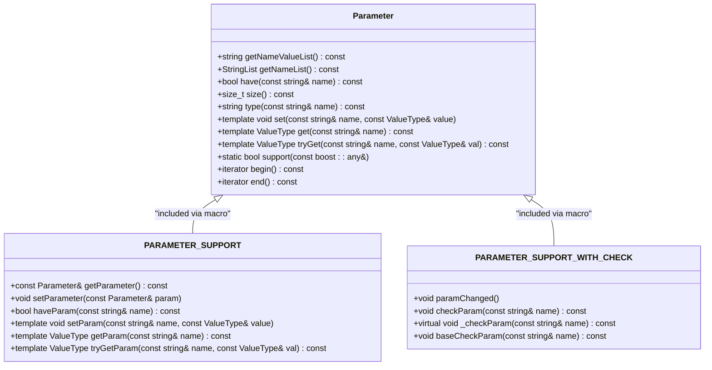
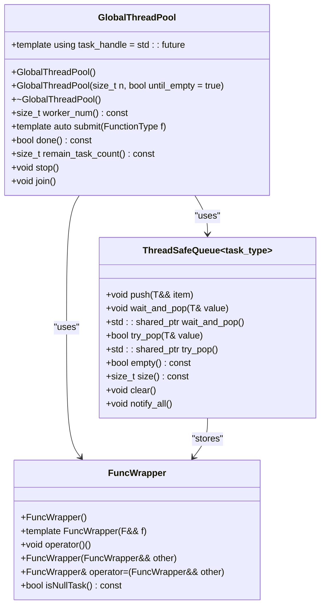
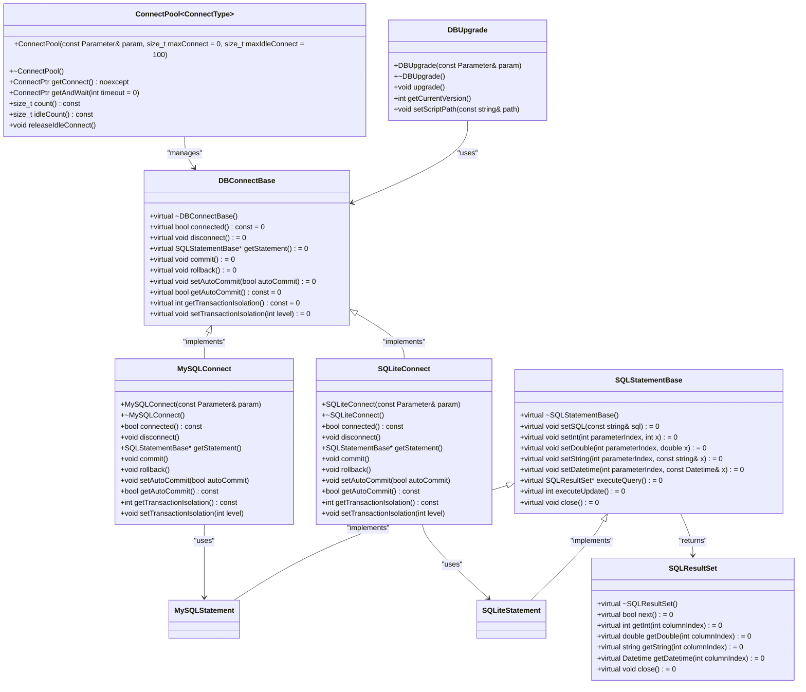
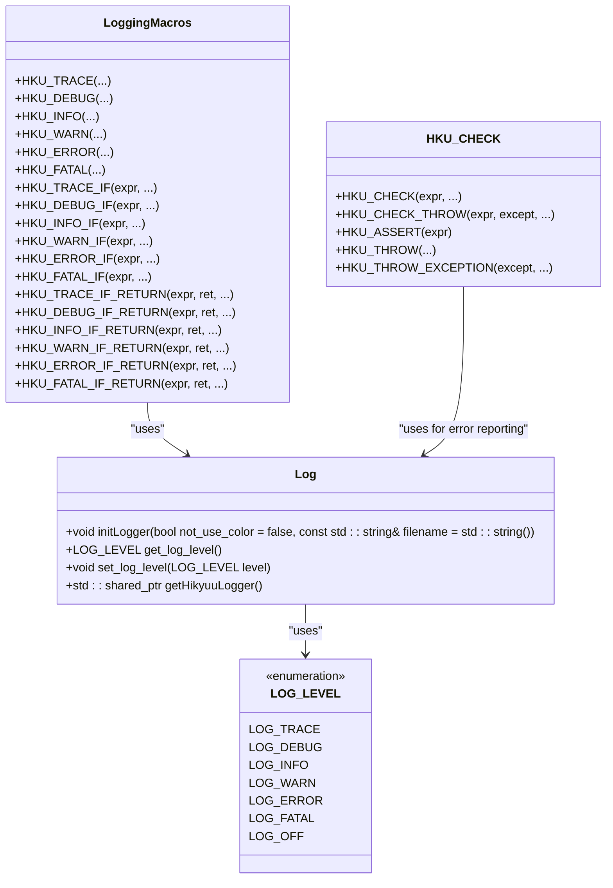
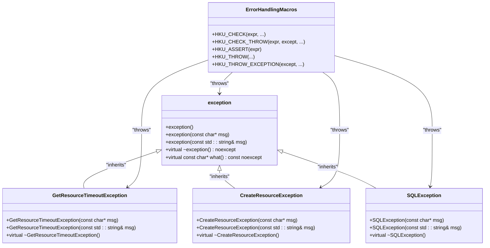
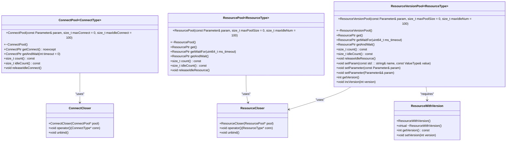
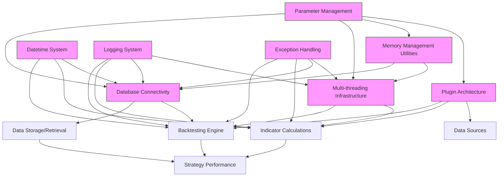

# Core Utilities

<cite>
**Referenced Files in This Document**   
- [Parameter.h](file://hikyuu_cpp/hikyuu/utilities/Parameter.h)
- [Log.h](file://hikyuu_cpp/hikyuu/utilities/Log.h)
- [exception.h](file://hikyuu_cpp/hikyuu/utilities/exception.h)
- [Datetime.h](file://hikyuu_cpp/hikyuu/utilities/datetime/Datetime.h)
- [GlobalThreadPool.h](file://hikyuu_cpp/hikyuu/utilities/thread/GlobalThreadPool.h)
- [ConnectPool.h](file://hikyuu_cpp/hikyuu/utilities/ConnectPool.h)
- [ResourcePool.h](file://hikyuu_cpp/hikyuu/utilities/ResourcePool.h)
- [DllLoader.h](file://hikyuu_cpp/hikyuu/utilities/DllLoader.h)
- [DBConnect.h](file://hikyuu_cpp/hikyuu/utilities/db_connect/DBConnect.h)
- [PluginManager.h](file://hikyuu_cpp/hikyuu/utilities/plugin/PluginManager.h)
- [PluginLoader.h](file://hikyuu_cpp/hikyuu/utilities/plugin/PluginLoader.h)
- [ThreadSafeQueue.h](file://hikyuu_cpp/hikyuu/utilities/thread/ThreadSafeQueue.h)
- [FuncWrapper.h](file://hikyuu_cpp/hikyuu/utilities/thread/FuncWrapper.h)
</cite>

## Table of Contents
1. [Introduction](#introduction)
2. [Parameter Management](#parameter-management)
3. [Multi-threading Infrastructure](#multi-threading-infrastructure)
4. [Database Connectivity Layer](#database-connectivity-layer)
5. [Datetime System](#datetime-system)
6. [Plugin Architecture](#plugin-architecture)
7. [Logging System](#logging-system)
8. [Exception Handling Framework](#exception-handling-framework)
9. [Memory Management Utilities](#memory-management-utilities)
10. [Integration and System Impact](#integration-and-system-impact)

## Introduction
The Hikyuu framework provides a comprehensive set of C++ core utilities that form the foundation for its financial analysis and backtesting capabilities. These utilities offer essential services including configuration management, multi-threading support, database connectivity, datetime handling, plugin loading, logging, exception handling, and memory management. This documentation details these foundational components and their integration across the framework, highlighting their impact on system performance and reliability.

## Parameter Management

The Parameter class serves as the central configuration management component in Hikyuu, enabling flexible and type-safe parameter handling for various framework components. It provides a unified interface for storing, retrieving, and validating named parameters with support for multiple data types.

The Parameter class uses boost::any to store values of different types in a type-safe manner, supporting fundamental types like int, bool, double, and string, as well as complex types such as Stock, Block, KQuery, KData, PriceList, and DatetimeList. The class implements a map-based storage system with string keys and boost::any values, allowing for efficient parameter lookup and modification.

Two macros, PARAMETER_SUPPORT and PARAMETER_SUPPORT_WITH_CHECK, facilitate integration with other classes. The former provides basic parameter functionality, while the latter adds support for parameter validation and change notification. This design enables components to validate parameters upon setting and respond to configuration changes appropriately.

The Parameter class also supports serialization through Boost.Serialization, allowing parameter configurations to be saved and restored. This feature is particularly valuable for persisting strategy configurations, backtesting parameters, and system settings across sessions.



**Diagram sources**
- [Parameter.h](file://hikyuu_cpp/hikyuu/utilities/Parameter.h#L106-L509)

**Section sources**
- [Parameter.h](file://hikyuu_cpp/hikyuu/utilities/Parameter.h#L1-L509)

## Multi-threading Infrastructure

The multi-threading infrastructure in Hikyuu is centered around the GlobalThreadPool class, which provides a centralized task queue system for efficient parallel processing. This infrastructure is critical for the backtesting engine, enabling concurrent execution of multiple strategies and data processing tasks.

The GlobalThreadPool implements a work-stealing algorithm with a single master work queue shared among all worker threads. When a task is submitted via the submit() method, it is packaged using std::packaged_task and placed in the thread-safe master queue. Worker threads continuously poll this queue for tasks, executing them and returning results via std::future objects.

The thread pool is designed with several key features for reliability and performance:
- Dynamic thread creation based on hardware concurrency
- Thread-safe task queue using ThreadSafeQueue
- Graceful shutdown with stop() and join() methods
- Support for interruptible operations through InterruptFlag
- Exception safety with proper resource cleanup

The implementation uses FuncWrapper to encapsulate various callable objects (functions, lambdas, functors) into a uniform interface that can be stored and executed by worker threads. This design allows the thread pool to handle diverse task types while maintaining type safety.



**Diagram sources**
- [GlobalThreadPool.h](file://hikyuu_cpp/hikyuu/utilities/thread/GlobalThreadPool.h#L40-L216)
- [ThreadSafeQueue.h](file://hikyuu_cpp/hikyuu/utilities/thread/ThreadSafeQueue.h#L23-L101)
- [FuncWrapper.h](file://hikyuu_cpp/hikyuu/utilities/thread/FuncWrapper.h#L27-L77)

**Section sources**
- [GlobalThreadPool.h](file://hikyuu_cpp/hikyuu/utilities/thread/GlobalThreadPool.h#L40-L216)
- [ThreadSafeQueue.h](file://hikyuu_cpp/hikyuu/utilities/thread/ThreadSafeQueue.h#L23-L101)
- [FuncWrapper.h](file://hikyuu_cpp/hikyuu/utilities/thread/FuncWrapper.h#L27-L77)

## Database Connectivity Layer

The database connectivity layer in Hikyuu provides a unified interface for accessing both MySQL and SQLite databases, supporting the framework's data storage and retrieval requirements. The architecture is designed to be extensible, allowing for additional database backends to be integrated in the future.

The core of the database connectivity system is the DBConnect hierarchy, which abstracts database operations through a common interface. The system supports both MySQL and SQLite through dedicated implementations that inherit from base classes providing common functionality. Database connections can be configured through the Parameter class, allowing for flexible connection settings.

Key components of the database connectivity layer include:
- DBConnectBase: Abstract base class defining the common interface
- MySQLConnect and SQLiteConnect: Concrete implementations for specific databases
- SQLStatementBase: Base class for SQL statement execution
- SQLResultSet: Encapsulation of query results
- DBUpgrade: Database schema migration and versioning
- ConnectPool: Connection pooling for improved performance

The connection pooling mechanism is particularly important for performance, as it reduces the overhead of establishing new database connections. The ConnectPool template class manages a pool of database connections, reusing them across multiple operations and limiting the total number of concurrent connections.



**Diagram sources**
- [DBConnect.h](file://hikyuu_cpp/hikyuu/utilities/db_connect/DBConnect.h#L13-L30)
- [MySQLConnect.h](file://hikyuu_cpp/hikyuu/utilities/db_connect/mysql/MySQLConnect.h)
- [SQLiteConnect.h](file://hikyuu_cpp/hikyuu/utilities/db_connect/sqlite/SQLiteConnect.h)
- [SQLStatementBase.h](file://hikyuu_cpp/hikyuu/utilities/db_connect/SQLStatementBase.h)
- [SQLResultSet.h](file://hikyuu_cpp/hikyuu/utilities/db_connect/SQLResultSet.h)
- [ConnectPool.h](file://hikyuu_cpp/hikyuu/utilities/ConnectPool.h#L24-L158)
- [DBUpgrade.h](file://hikyuu_cpp/hikyuu/utilities/db_connect/DBUpgrade.h)

**Section sources**
- [DBConnect.h](file://hikyuu_cpp/hikyuu/utilities/db_connect/DBConnect.h#L13-L30)
- [ConnectPool.h](file://hikyuu_cpp/hikyuu/utilities/ConnectPool.h#L24-L158)

## Datetime System

The datetime system in Hikyuu provides comprehensive support for handling financial time series timestamps with millisecond precision. The Datetime class is designed to meet the specific requirements of financial applications, offering robust date and time manipulation capabilities.

The Datetime class is built on top of Boost.DateTime, providing a high-level interface for date and time operations. It supports various constructors for creating datetime objects from different input formats, including:
- Year, month, day, hour, minute, second, millisecond, and microsecond components
- Boost gregorian date objects
- Boost posix time objects
- Numeric representations (YYYYMMDDhhmm, YYYYMMDD, YYYYMMDDhhmmss)
- String representations in multiple formats

The class implements a rich set of methods for date arithmetic, period calculations, and formatting. Key features include:
- Support for null datetime values
- Date arithmetic with TimeDelta objects
- Various formatting options for string representation
- Methods for extracting date components (year, month, day, etc.)
- Functions for calculating start and end of periods (day, week, month, quarter, year)
- Support for time zone conversions and UTC operations

The datetime system also includes specialized functions for financial applications, such as retrieving trading calendar dates and handling market session times. The implementation ensures millisecond precision throughout, which is essential for high-frequency trading analysis.

```mermaid
classDiagram
class Datetime {
+static Datetime min()
+static Datetime max()
+static Datetime now()
+static Datetime today()
+static Datetime fromHex(uint64_t time)
+static Datetime fromTimestamp(int64_t timestamp)
+static Datetime fromTimestampUTC(int64_t timestamp)
+Datetime()
+Datetime(const Datetime&)
+Datetime(long year, long month, long day, long hh = 0, long mm = 0, long sec = 0, long millisec = 0, long microsec = 0)
+Datetime(const bd : : date&)
+Datetime(const bt : : ptime&)
+Datetime(unsigned long long)
+Datetime(const std : : string&)
+long year() const
+long month() const
+long day() const
+long hour() const
+long minute() const
+long second() const
+long millisecond() const
+long microsecond() const
+bool isNull() const
+Datetime operator+(TimeDelta d) const
+Datetime operator-(TimeDelta d) const
+uint64_t number() const
+uint64_t ym() const
+uint64_t ymd() const
+uint64_t ymdh() const
+uint64_t ymdhm() const
+uint64_t ymdhms() const
+uint64_t hex() const
+uint64_t ticks() const
+uint64_t timestamp() const
+uint64_t timestampUTC() const
+std : : string str() const
+std : : string repr() const
+bt : : ptime ptime() const
+bd : : date date() const
+std : : time_t to_time_t() const
+int dayOfWeek() const
+int dayOfYear() const
+Datetime startOfDay() const
+Datetime endOfDay() const
+Datetime dateOfWeek(int day) const
+Datetime startOfWeek() const
+Datetime endOfWeek() const
+Datetime startOfMonth() const
+Datetime endOfMonth() const
+Datetime startOfQuarter() const
+Datetime endOfQuarter() const
+Datetime startOfHalfyear() const
+Datetime endOfHalfyear() const
+Datetime startOfYear() const
+Datetime endOfYear() const
+Datetime nextDay() const
+Datetime nextWeek() const
+Datetime nextMonth() const
+Datetime nextQuarter() const
+Datetime nextHalfyear() const
+Datetime nextYear() const
+Datetime preDay() const
+Datetime preWeek() const
+Datetime preMonth() const
+Datetime preQuarter() const
+Datetime preHalfyear() const
+Datetime preYear() const
}
class TimeDelta {
+TimeDelta()
+TimeDelta(const TimeDelta&)
+TimeDelta(long days, long hours = 0, long minutes = 0, long seconds = 0, long millisec = 0, long microsec = 0)
+TimeDelta(const bt : : time_duration&)
+long days() const
+long hours() const
+long minutes() const
+long seconds() const
+long milliseconds() const
+long microseconds() const
+bt : : time_duration time_duration() const
}
Datetime --> TimeDelta : "uses in arithmetic"
Datetime --> bt : : ptime : "wraps"
Datetime --> bd : : date : "wraps"
```

**Diagram sources**
- [Datetime.h](file://hikyuu_cpp/hikyuu/utilities/datetime/Datetime.h#L45-L311)
- [TimeDelta.h](file://hikyuu_cpp/hikyuu/utilities/datetime/TimeDelta.h)

**Section sources**
- [Datetime.h](file://hikyuu_cpp/hikyuu/utilities/datetime/Datetime.h#L45-L311)

## Plugin Architecture

The plugin architecture in Hikyuu enables runtime loading of extensions, providing a flexible mechanism for extending the framework's functionality without recompilation. This system is based on dynamic library loading and a well-defined plugin interface.

The core components of the plugin architecture are:
- PluginBase: Abstract base class defining the plugin interface
- PluginLoader: Responsible for loading and managing individual plugins
- PluginManager: Central registry and factory for plugins

The PluginManager class maintains a collection of loaded plugins and provides a factory method for obtaining plugin instances. It supports lazy loading, where plugins are only loaded when first requested. The manager maintains a search path for locating plugin libraries and handles the lifecycle of loaded plugins.

The PluginLoader class encapsulates the platform-specific details of dynamic library loading, providing a uniform interface across different operating systems. It uses DllLoader to handle the underlying system calls for loading shared libraries (DLLs on Windows, SO files on Linux, DYLIB files on macOS).

Plugins are expected to export a createPlugin function that returns a pointer to a PluginBase-derived object. This convention allows the framework to instantiate plugins without knowing their concrete types at compile time.

```mermaid
classDiagram
class PluginBase {
+virtual ~PluginBase()
+virtual const char* name() const = 0
+virtual const char* category() const = 0
+virtual const char* description() const = 0
+virtual void initialize() = 0
+virtual void finalize() = 0
}
class PluginLoader {
+PluginLoader()
+explicit PluginLoader(const std : : string& path)
+~PluginLoader()
+template<typename T> T* instance() const
+bool load(const std : : string& pluginname)
+std : : string getFileName(const std : : string& pluginname) const
}
class PluginManager {
+PluginManager()
+explicit PluginManager(const std : : string& plugin_path)
+~PluginManager()
+const std : : string& pluginPath() const
+void pluginPath(const std : : string& plugin_path)
+template<typename PluginInterfaceT> PluginInterfaceT* getPlugin(const std : : string& pluginname)
}
class DllLoader {
+DllLoader()
+explicit DllLoader(const std : : vector<std : : string>& path)
+~DllLoader()
+bool load(const std : : string& dllname)
+void unload()
+std : : string search(const std : : string& dllname) const
+void* getSymbol(const char* symbol)
}
PluginManager --> PluginLoader : "creates and manages"
PluginLoader --> DllLoader : "uses for loading"
PluginLoader --> PluginBase : "loads instances of"
PluginManager --> PluginBase : "returns instances of"
DllLoader --> "Shared Libraries" : "loads"
```

**Diagram sources**
- [PluginBase.h](file://hikyuu_cpp/hikyuu/utilities/plugin/PluginBase.h)
- [PluginLoader.h](file://hikyuu_cpp/hikyuu/utilities/plugin/PluginLoader.h#L29-L117)
- [PluginManager.h](file://hikyuu_cpp/hikyuu/utilities/plugin/PluginManager.h#L19-L61)
- [DllLoader.h](file://hikyuu_cpp/hikyuu/utilities/DllLoader.h#L29-L221)

**Section sources**
- [PluginLoader.h](file://hikyuu_cpp/hikyuu/utilities/plugin/PluginLoader.h#L29-L117)
- [PluginManager.h](file://hikyuu_cpp/hikyuu/utilities/plugin/PluginManager.h#L19-L61)
- [DllLoader.h](file://hikyuu_cpp/hikyuu/utilities/DllLoader.h#L29-L221)

## Logging System

The logging system in Hikyuu provides configurable log levels and output targets, enabling detailed monitoring and debugging of framework operations. Built on top of the SPDLOG library, the system offers high-performance logging with minimal overhead.

The logging infrastructure defines six log levels through the LOG_LEVEL enum:
- LOG_TRACE: Detailed tracing information
- LOG_DEBUG: Debugging information
- LOG_INFO: General information
- LOG_WARN: Warning messages
- LOG_ERROR: Error conditions
- LOG_FATAL: Critical errors that may cause program termination

The system provides both function-based and macro-based interfaces for logging. The macro interface (HKU_TRACE, HKU_DEBUG, HKU_INFO, etc.) offers better performance by evaluating log messages only when the corresponding log level is active. These macros automatically include contextual information such as the source file, line number, and function name.

Key features of the logging system include:
- Configurable log level through set_log_level()
- Initialization with optional color output and custom filename
- Thread-safe operations suitable for multi-threaded environments
- Support for asynchronous logging to minimize performance impact
- Integration with the exception handling framework

The logging system is designed to be lightweight and efficient, with minimal impact on application performance. Conditional compilation allows certain logging features to be disabled in production builds.



**Diagram sources**
- [Log.h](file://hikyuu_cpp/hikyuu/utilities/Log.h#L58-L66)
- [Log.h](file://hikyuu_cpp/hikyuu/utilities/Log.h#L73-L95)
- [Log.h](file://hikyuu_cpp/hikyuu/utilities/Log.h#L112-L152)
- [Log.h](file://hikyuu_cpp/hikyuu/utilities/Log.h#L184-L212)

**Section sources**
- [Log.h](file://hikyuu_cpp/hikyuu/utilities/Log.h#L58-L438)

## Exception Handling Framework

The exception handling framework in Hikyuu provides a robust mechanism for error reporting and recovery. At its core is the exception class, which extends std::exception with additional functionality for debugging and error analysis.

The exception class includes several key features:
- Support for formatted error messages using fmt library
- Optional stack trace capture for debugging
- Integration with the logging system for automatic error reporting
- Macros for common error checking patterns

The framework provides several macros that simplify error checking and exception throwing:
- HKU_CHECK: Throws exception if condition is false
- HKU_ASSERT: Internal assertion checking
- HKU_THROW: Throws exception with formatted message
- HKU_CHECK_THROW: Throws specified exception type if condition is false

When stack trace support is enabled (HKU_ENABLE_STACK_TRACE), exceptions include a full stack trace in the error message, greatly aiding in debugging complex issues. This feature is particularly valuable in a financial context where understanding the exact sequence of operations leading to an error is crucial.

The exception handling system is designed to be both comprehensive and efficient, ensuring that error conditions are properly reported without significant performance overhead in normal operation.



**Diagram sources**
- [exception.h](file://hikyuu_cpp/hikyuu/utilities/exception.h#L34-L44)
- [ResourcePool.h](file://hikyuu_cpp/hikyuu/utilities/ResourcePool.h#L27-L50)
- [DBConnect.h](file://hikyuu_cpp/hikyuu/utilities/db_connect/SQLException.h)
- [Log.h](file://hikyuu_cpp/hikyuu/utilities/Log.h#L112-L212)

**Section sources**
- [exception.h](file://hikyuu_cpp/hikyuu/utilities/exception.h#L34-L44)
- [ResourcePool.h](file://hikyuu_cpp/hikyuu/utilities/ResourcePool.h#L27-L50)
- [Log.h](file://hikyuu_cpp/hikyuu/utilities/Log.h#L112-L212)

## Memory Management Utilities

The memory management utilities in Hikyuu provide smart pointers and resource pools to ensure efficient and safe memory usage. These components help prevent memory leaks and improve performance through resource reuse.

The primary memory management components are:
- ConnectPool: Generic connection pool for database connections
- ResourcePool: Generic resource pool for various resource types
- ResourceVersionPool: Versioned resource pool that supports configuration changes
- Smart pointers: std::shared_ptr with custom deleters for automatic resource cleanup

The ConnectPool and ResourcePool classes implement object pooling patterns, reducing the overhead of creating and destroying expensive resources like database connections. The pools maintain a queue of idle resources and provide methods for acquiring and releasing resources in a thread-safe manner.

The ResourceVersionPool extends the basic resource pool with versioning support, allowing for graceful transitions when configuration parameters change. When parameters are updated, the pool increments its version number and releases all idle resources. New resources are created with the updated parameters, while existing resources continue to operate with the old configuration until they are returned to the pool.

These memory management utilities use custom deleters (ConnectCloser and ResourceCloser) that return resources to the pool instead of destroying them, enabling efficient resource reuse.



**Diagram sources**
- [ConnectPool.h](file://hikyuu_cpp/hikyuu/utilities/ConnectPool.h#L24-L158)
- [ResourcePool.h](file://hikyuu_cpp/hikyuu/utilities/ResourcePool.h#L57-L291)
- [ResourcePool.h](file://hikyuu_cpp/hikyuu/utilities/ResourcePool.h#L324-L632)
- [ResourcePool.h](file://hikyuu_cpp/hikyuu/utilities/ResourcePool.h#L297-L317)

**Section sources**
- [ConnectPool.h](file://hikyuu_cpp/hikyuu/utilities/ConnectPool.h#L24-L158)
- [ResourcePool.h](file://hikyuu_cpp/hikyuu/utilities/ResourcePool.h#L57-L632)

## Integration and System Impact

The core utilities in Hikyuu are tightly integrated to provide a cohesive foundation for the entire framework. This integration enables high performance, reliability, and extensibility in financial analysis and backtesting applications.

The Parameter class serves as the central configuration mechanism, with other components using it for initialization and runtime configuration. The database connectivity layer uses Parameter objects to configure connection parameters, while the thread pool and resource pools use them for operational settings.

The multi-threading infrastructure is critical for the backtesting engine, allowing multiple strategies to be tested concurrently. The GlobalThreadPool enables parallel execution of backtesting tasks, significantly reducing computation time for large-scale analysis. The thread-safe design of the utility classes ensures that they can be safely used in multi-threaded contexts.

The datetime system provides precise timestamp handling essential for financial time series analysis. Its integration with the database layer allows for efficient storage and retrieval of time series data, while its compatibility with the indicator and strategy components enables accurate backtesting.

The plugin architecture enables extensibility without compromising stability. New data sources, indicators, or trading strategies can be added as plugins without modifying the core framework. This modular design facilitates community contributions and custom extensions.

The logging and exception handling systems work together to provide comprehensive error reporting and debugging capabilities. Errors are logged with detailed context, including stack traces when enabled, and exceptions are propagated through the system in a controlled manner.

The memory management utilities improve performance by reducing the overhead of resource creation and destruction. Connection pooling minimizes database connection latency, while the resource pools ensure efficient use of system resources.

Together, these core utilities create a robust foundation that supports the complex requirements of financial analysis and algorithmic trading. Their careful design and integration enable Hikyuu to handle large datasets, perform complex calculations, and provide reliable results for investment decision-making.



**Diagram sources**
- [Parameter.h](file://hikyuu_cpp/hikyuu/utilities/Parameter.h#L106-L509)
- [GlobalThreadPool.h](file://hikyuu_cpp/hikyuu/utilities/thread/GlobalThreadPool.h#L40-L216)
- [DBConnect.h](file://hikyuu_cpp/hikyuu/utilities/db_connect/DBConnect.h#L13-L30)
- [Datetime.h](file://hikyuu_cpp/hikyuu/utilities/datetime/Datetime.h#L45-L311)
- [PluginManager.h](file://hikyuu_cpp/hikyuu/utilities/plugin/PluginManager.h#L19-L61)
- [Log.h](file://hikyuu_cpp/hikyuu/utilities/Log.h#L73-L438)
- [exception.h](file://hikyuu_cpp/hikyuu/utilities/exception.h#L34-L44)
- [ConnectPool.h](file://hikyuu_cpp/hikyuu/utilities/ConnectPool.h#L24-L158)
- [ResourcePool.h](file://hikyuu_cpp/hikyuu/utilities/ResourcePool.h#L57-L632)

**Section sources**
- [Parameter.h](file://hikyuu_cpp/hikyuu/utilities/Parameter.h#L106-L509)
- [GlobalThreadPool.h](file://hikyuu_cpp/hikyuu/utilities/thread/GlobalThreadPool.h#L40-L216)
- [DBConnect.h](file://hikyuu_cpp/hikyuu/utilities/db_connect/DBConnect.h#L13-L30)
- [Datetime.h](file://hikyuu_cpp/hikyuu/utilities/datetime/Datetime.h#L45-L311)
- [PluginManager.h](file://hikyuu_cpp/hikyuu/utilities/plugin/PluginManager.h#L19-L61)
- [Log.h](file://hikyuu_cpp/hikyuu/utilities/Log.h#L73-L438)
- [exception.h](file://hikyuu_cpp/hikyuu/utilities/exception.h#L34-L44)
- [ConnectPool.h](file://hikyuu_cpp/hikyuu/utilities/ConnectPool.h#L24-L158)
- [ResourcePool.h](file://hikyuu_cpp/hikyuu/utilities/ResourcePool.h#L57-L632)