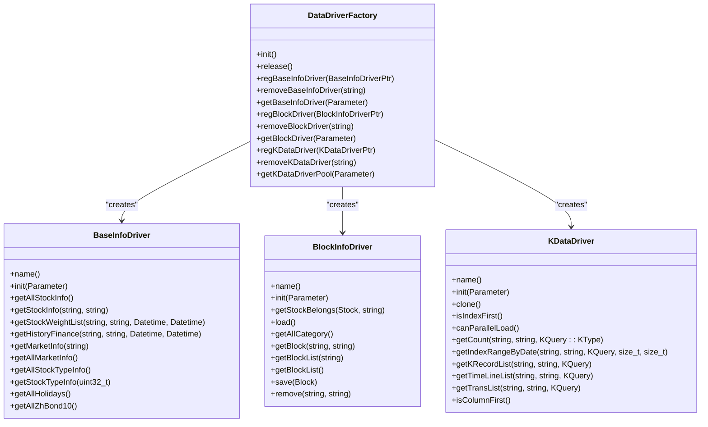
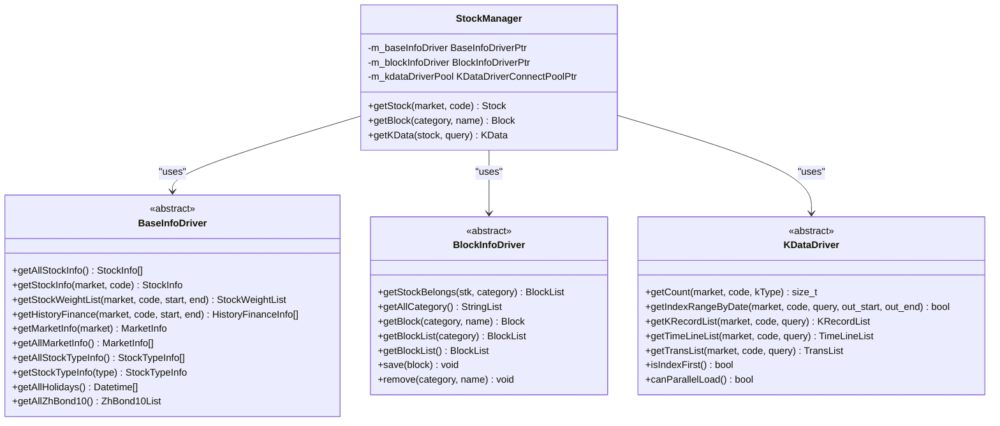
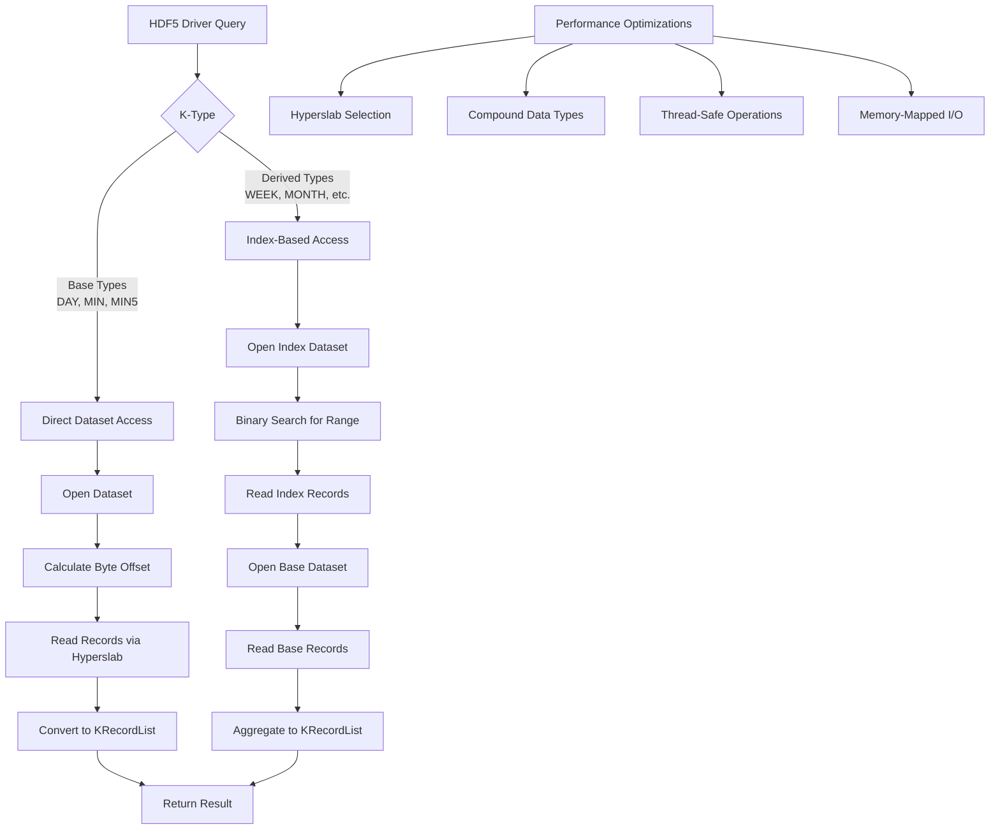
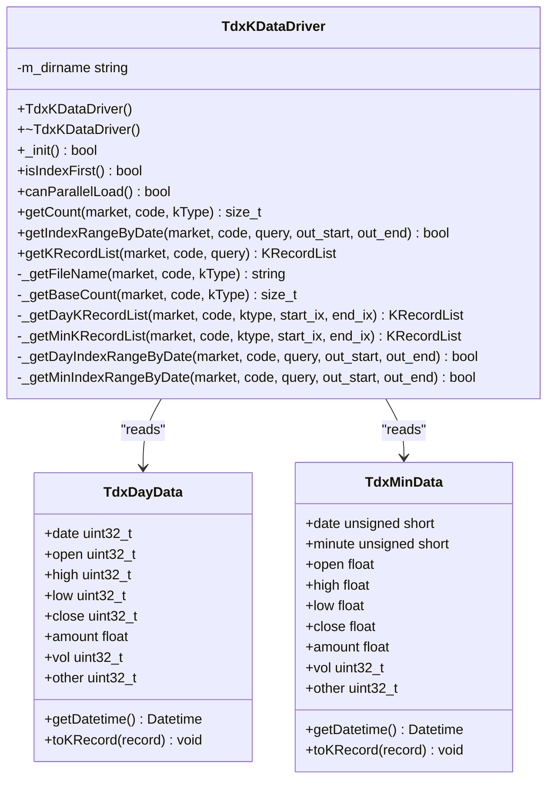
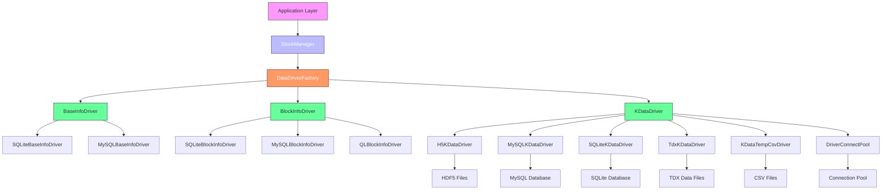

# Data Management

<cite>
**Referenced Files in This Document**   
- [DataDriverFactory.h](file://hikyuu_cpp/hikyuu/data_driver/DataDriverFactory.h)
- [DataDriverFactory.cpp](file://hikyuu_cpp/hikyuu/data_driver/DataDriverFactory.cpp)
- [BaseInfoDriver.h](file://hikyuu_cpp/hikyuu/data_driver/BaseInfoDriver.h)
- [BlockInfoDriver.h](file://hikyuu_cpp/hikyuu/data_driver/BlockInfoDriver.h)
- [KDataDriver.h](file://hikyuu_cpp/hikyuu/data_driver/KDataDriver.h)
- [DriverConnectPool.h](file://hikyuu_cpp/hikyuu/data_driver/DriverConnectPool.h)
- [H5KDataDriver.h](file://hikyuu_cpp/hikyuu/data_driver/kdata/hdf5/H5KDataDriver.h)
- [H5KDataDriver.cpp](file://hikyuu_cpp/hikyuu/data_driver/kdata/hdf5/H5KDataDriver.cpp)
- [TdxKDataDriver.h](file://hikyuu_cpp/hikyuu/data_driver/kdata/tdx/TdxKDataDriver.h)
- [TdxKDataDriver.cpp](file://hikyuu_cpp/hikyuu/data_driver/kdata/tdx/TdxKDataDriver.cpp)
- [StockManager.h](file://hikyuu_cpp/hikyuu/StockManager.h)
</cite>

## Table of Contents
1. [Introduction](#introduction)
2. [Pluggable Data Driver Architecture](#pluggable-data-driver-architecture)
3. [Factory Pattern Implementation](#factory-pattern-implementation)
4. [Driver Type Separation of Concerns](#driver-type-separation-of-concerns)
5. [HDF5 Driver Performance Optimizations](#hdf5-driver-performance-optimizations)
6. [Connection Pooling Mechanism](#connection-pooling-mechanism)
7. [TDX Driver Implementation](#tdx-driver-implementation)
8. [Storage Backend Support](#storage-backend-support)
9. [Configuration Options and Performance Characteristics](#configuration-options-and-performance-characteristics)
10. [Thread Safety Considerations](#thread-safety-considerations)
11. [Architecture Overview](#architecture-overview)

## Introduction
The Hikyuu C++ data management system provides a flexible and extensible architecture for handling financial data from multiple storage backends. This document details the pluggable data driver architecture that supports HDF5, MySQL, SQLite, ClickHouse, and TongDaXin (TDX) formats. The system is designed with separation of concerns, allowing different driver types to handle specific data categories while maintaining a consistent interface. The architecture leverages design patterns such as Factory and connection pooling to ensure efficient resource management and high performance for financial data operations.

## Pluggable Data Driver Architecture
The Hikyuu data management system implements a pluggable architecture that allows seamless integration of multiple storage backends. This architecture is built around abstract base classes that define common interfaces for different types of data drivers, enabling the system to work with various storage technologies without changing the core application logic. The pluggable design allows users to configure and switch between different storage backends based on their specific requirements for performance, scalability, and data access patterns.

The architecture supports multiple storage backends including HDF5 for high-performance time series data storage, MySQL and SQLite for relational database storage, ClickHouse for column-oriented analytics, and direct file access for TongDaXin format files. Each backend is implemented as a separate driver that adheres to the common interface defined by the base classes. This design enables the system to maintain data consistency across different storage technologies while providing optimized access patterns for each backend.

**Section sources**
- [BaseInfoDriver.h](file://hikyuu_cpp/hikyuu/data_driver/BaseInfoDriver.h#L99-L245)
- [BlockInfoDriver.h](file://hikyuu_cpp/hikyuu/data_driver/BlockInfoDriver.h#L21-L115)
- [KDataDriver.h](file://hikyuu_cpp/hikyuu/data_driver/KDataDriver.h#L23-L225)

## Factory Pattern Implementation
The DataDriverFactory class implements the Factory pattern to create and manage appropriate data drivers based on configuration parameters. This implementation provides a centralized mechanism for driver instantiation, ensuring consistent initialization and configuration across the system. The factory maintains static maps of registered drivers for different driver types, allowing for efficient lookup and creation of driver instances.

The factory supports three main driver categories: BaseInfoDriver for stock metadata, BlockInfoDriver for block data, and KDataDriver for market time series data. Each driver type is registered with a unique name that is used for configuration and lookup. The factory methods (getBaseInfoDriver, getBlockDriver, and getKDataDriverPool) take configuration parameters as input and return appropriately configured driver instances. The factory also handles driver lifecycle management, including initialization and resource cleanup.



**Diagram sources**
- [DataDriverFactory.h](file://hikyuu_cpp/hikyuu/data_driver/DataDriverFactory.h#L26-L58)
- [BaseInfoDriver.h](file://hikyuu_cpp/hikyuu/data_driver/BaseInfoDriver.h#L99-L245)
- [BlockInfoDriver.h](file://hikyuu_cpp/hikyuu/data_driver/BlockInfoDriver.h#L21-L115)
- [KDataDriver.h](file://hikyuu_cpp/hikyuu/data_driver/KDataDriver.h#L23-L225)

**Section sources**
- [DataDriverFactory.h](file://hikyuu_cpp/hikyuu/data_driver/DataDriverFactory.h#L26-L58)
- [DataDriverFactory.cpp](file://hikyuu_cpp/hikyuu/data_driver/DataDriverFactory.cpp#L47-L203)

## Driver Type Separation of Concerns
The Hikyuu data management system implements a clear separation of concerns through three distinct driver types: BaseInfoDriver, BlockInfoDriver, and KDataDriver. Each driver type is responsible for a specific category of financial data, ensuring that the system maintains a clean architectural boundary between different data domains.

The BaseInfoDriver handles stock metadata and fundamental information, including stock details, market information, stock type information, holidays, and bond data. It provides methods to retrieve comprehensive stock information, market configurations, and historical financial data. This driver is essential for applications that require access to security metadata and fundamental analysis data.

The BlockInfoDriver manages block data, which represents groupings of securities such as industry sectors, concepts, or custom portfolios. It provides functionality to retrieve block categories, specific blocks, and membership information for securities. This driver supports operations to save and remove blocks, enabling dynamic management of security groupings.

The KDataDriver specializes in market time series data, including K-line data, time series data, and transaction data. It offers optimized methods for retrieving time series data based on various query parameters, supporting both index-based and date-based queries. This driver is critical for technical analysis and algorithmic trading applications that require high-performance access to historical market data.



**Diagram sources**
- [BaseInfoDriver.h](file://hikyuu_cpp/hikyuu/data_driver/BaseInfoDriver.h#L99-L245)
- [BlockInfoDriver.h](file://hikyuu_cpp/hikyuu/data_driver/BlockInfoDriver.h#L21-L115)
- [KDataDriver.h](file://hikyuu_cpp/hikyuu/data_driver/KDataDriver.h#L23-L225)
- [StockManager.h](file://hikyuu_cpp/hikyuu/StockManager.h)

**Section sources**
- [BaseInfoDriver.h](file://hikyuu_cpp/hikyuu/data_driver/BaseInfoDriver.h#L99-L245)
- [BlockInfoDriver.h](file://hikyuu_cpp/hikyuu/data_driver/BlockInfoDriver.h#L21-L115)
- [KDataDriver.h](file://hikyuu_cpp/hikyuu/data_driver/KDataDriver.h#L23-L225)

## HDF5 Driver Performance Optimizations
The HDF5 driver implementation in Hikyuu is optimized for efficient storage and retrieval of K-line data, leveraging the hierarchical data format's capabilities for high-performance time series data management. The driver uses a sophisticated indexing strategy that combines direct access with binary search algorithms to minimize query latency. For base K-line types (daily, minute, 5-minute), the driver stores data directly in datasets, enabling O(1) access to individual records by index.

For derived K-line types (weekly, monthly, quarterly, etc.), the driver implements an index-based approach that stores mapping information between the derived time frames and the base data. This optimization reduces storage requirements while maintaining fast query performance. The index records contain the datetime and the starting position in the base data, allowing the driver to efficiently reconstruct derived K-lines by aggregating the relevant base records.

The driver also implements several performance optimizations at the HDF5 library level. It uses hyperslab selection for efficient bulk data reading, minimizing the number of I/O operations. The implementation takes advantage of HDF5's native data types and compound types to ensure efficient serialization and deserialization of financial data records. When the HDF5 library is compiled with thread-safe support, the driver enables parallel data loading, further improving performance in multi-threaded applications.



**Diagram sources**
- [H5KDataDriver.h](file://hikyuu_cpp/hikyuu/data_driver/kdata/hdf5/H5KDataDriver.h#L17-L85)
- [H5KDataDriver.cpp](file://hikyuu_cpp/hikyuu/data_driver/kdata/hdf5/H5KDataDriver.cpp#L54-L800)

**Section sources**
- [H5KDataDriver.h](file://hikyuu_cpp/hikyuu/data_driver/kdata/hdf5/H5KDataDriver.h#L17-L85)
- [H5KDataDriver.cpp](file://hikyuu_cpp/hikyuu/data_driver/kdata/hdf5/H5KDataDriver.cpp#L54-L800)

## Connection Pooling Mechanism
The DriverConnectPool template class implements a connection pooling mechanism for database drivers, optimizing resource utilization and improving performance in multi-threaded environments. The pool manages a collection of driver connections, allowing clients to acquire and release connections efficiently without the overhead of creating and destroying connections for each operation.

The connection pool supports configurable limits on the maximum number of connections and the maximum number of idle connections. When a client requests a connection, the pool first attempts to provide an existing idle connection. If no idle connections are available and the maximum connection limit has not been reached, the pool creates a new connection. If the maximum limit has been reached, the request blocks until a connection becomes available.

The pool implements a sophisticated resource management strategy that balances performance and memory usage. Idle connections are retained up to a configurable limit, reducing the overhead of frequent connection creation and destruction. When the number of idle connections exceeds the limit, excess connections are destroyed to free resources. The pool uses thread-safe operations with mutexes and condition variables to ensure safe concurrent access from multiple threads.

```mermaid
classDiagram
class DriverConnectPool~DriverConnectT~ {
-m_maxSize size_t
-m_maxIdelSize size_t
-m_count size_t
-m_prototype DriverPtr
-m_mutex mutex
-m_cond condition_variable
-m_driverList queue~DriverConnectT*~
-m_closer DriverCloser
+DriverConnectPool(DriverPtr, size_t, size_t)
+~DriverConnectPool()
+getConnect() DriverConnectPtr
+getPrototype() DriverPtr
+count() size_t
+idleCount() size_t
+releaseIdleConnect() void
-returnDriver(DriverConnectT*) void
}
class DriverCloser {
-m_pool DriverConnectPool*
+DriverCloser(DriverConnectPool*)
+operator()(DriverConnectT*) void
}
DriverConnectPool --> DriverCloser : "contains"
DriverConnectPool --> "DriverConnectT" : "manages"
```

**Diagram sources**
- [DriverConnectPool.h](file://hikyuu_cpp/hikyuu/data_driver/DriverConnectPool.h#L23-L147)

**Section sources**
- [DriverConnectPool.h](file://hikyuu_cpp/hikyuu/data_driver/DriverConnectPool.h#L23-L147)

## TDX Driver Implementation
The TDX driver implementation provides direct access to financial data stored in TongDaXin format files, enabling integration with this popular trading software's data format. The driver is designed to read data from TDX's proprietary binary file formats (.day, .lc1, .lc5) without requiring external dependencies or conversion tools. This implementation allows Hikyuu to leverage existing TDX data installations, reducing data acquisition and preparation overhead.

The TDX driver supports three main file formats: daily data (.day files), minute-level data (.lc1 files), and 5-minute aggregated data (.lc5 files). Each format has a specific binary structure that the driver parses to extract financial data. The daily data format uses a 32-bit date representation combined with price and volume information, while the minute-level formats use a compact representation of date and time components.

The driver implements efficient binary search algorithms to locate data by date, providing fast random access to historical records. For date-based queries, the driver performs a binary search on the file to find the appropriate record range, then reads the specified records sequentially. This approach minimizes I/O operations and provides good performance even with large data files. The driver also handles data conversion from TDX's internal representation to Hikyuu's standard data types, including price scaling and datetime formatting.



**Diagram sources**
- [TdxKDataDriver.h](file://hikyuu_cpp/hikyuu/data_driver/kdata/tdx/TdxKDataDriver.h#L16-L64)
- [TdxKDataDriver.cpp](file://hikyuu_cpp/hikyuu/data_driver/kdata/tdx/TdxKDataDriver.cpp#L1-L428)

**Section sources**
- [TdxKDataDriver.h](file://hikyuu_cpp/hikyuu/data_driver/kdata/tdx/TdxKDataDriver.h#L16-L64)
- [TdxKDataDriver.cpp](file://hikyuu_cpp/hikyuu/data_driver/kdata/tdx/TdxKDataDriver.cpp#L1-L428)

## Storage Backend Support
The Hikyuu data management system supports multiple storage backends through a unified driver interface, allowing users to choose the most appropriate technology for their specific use case. The system currently supports HDF5, MySQL, SQLite, ClickHouse, and TDX file formats, with the architecture designed to easily accommodate additional backends.

For high-performance time series data storage, the HDF5 backend provides excellent I/O performance and efficient compression, making it ideal for large-scale historical data analysis. The MySQL and SQLite backends offer relational database capabilities, supporting complex queries and data relationships. ClickHouse provides column-oriented storage optimized for analytical workloads, enabling fast aggregation and analysis of large datasets. The TDX backend allows direct access to data from the popular TongDaXin trading software, facilitating integration with existing data sources.

Each backend is implemented as a separate driver that inherits from the appropriate base driver class (BaseInfoDriver, BlockInfoDriver, or KDataDriver). The drivers are registered with the DataDriverFactory during system initialization, making them available for configuration. The factory pattern ensures that the application code remains independent of the specific backend implementation, allowing for seamless switching between storage technologies.

**Section sources**
- [DataDriverFactory.cpp](file://hikyuu_cpp/hikyuu/data_driver/DataDriverFactory.cpp#L47-L82)
- [BaseInfoDriver.h](file://hikyuu_cpp/hikyuu/data_driver/BaseInfoDriver.h#L99-L245)
- [KDataDriver.h](file://hikyuu_cpp/hikyuu/data_driver/KDataDriver.h#L23-L225)

## Configuration Options and Performance Characteristics
The Hikyuu data drivers support various configuration options that allow users to optimize performance based on their specific requirements and hardware capabilities. Configuration is handled through the Parameter class, which provides a flexible key-value interface for driver settings. Each driver type has specific configuration parameters that control its behavior and performance characteristics.

For the HDF5 driver, configuration includes file paths for different market data, with naming conventions that map market identifiers to HDF5 files. The driver's performance is characterized by fast random access to time series data, with O(log n) search complexity for date-based queries and O(1) access for index-based queries. The HDF5 format's built-in compression reduces storage requirements while maintaining good read performance.

The MySQL and SQLite drivers are configured with database connection parameters such as host, port, username, password, and database name. These drivers offer ACID compliance and support for complex queries, but may have higher latency for simple data retrieval operations compared to file-based storage. The connection pooling mechanism helps mitigate this by reusing database connections.

The TDX driver is configured with the root directory path where TDX data files are stored. Its performance characteristics include fast sequential reads and efficient binary search for date-based queries. The driver's simplicity and direct file access make it lightweight and fast for reading historical data, though it lacks the advanced features of database systems.

**Section sources**
- [DataDriverFactory.cpp](file://hikyuu_cpp/hikyuu/data_driver/DataDriverFactory.cpp#L90-L150)
- [H5KDataDriver.cpp](file://hikyuu_cpp/hikyuu/data_driver/kdata/hdf5/H5KDataDriver.cpp#L90-L152)
- [TdxKDataDriver.cpp](file://hikyuu_cpp/hikyuu/data_driver/kdata/tdx/TdxKDataDriver.cpp#L78-L87)

## Thread Safety Considerations
The Hikyuu data driver implementations incorporate several thread safety mechanisms to ensure reliable operation in multi-threaded environments. The DriverConnectPool class is designed with thread-safe operations using mutexes and condition variables, allowing multiple threads to safely acquire and release connections concurrently. The pool's internal data structures are protected by a mutex, and condition variables are used to coordinate access when the maximum connection limit is reached.

The HDF5 driver's thread safety depends on the underlying HDF5 library compilation. When the HDF5 library is compiled with thread-safe support (H5_HAVE_THREADSAFE), the driver enables parallel data loading by returning true from the canParallelLoad method. Otherwise, the driver disables parallel loading and issues a warning. This design allows the system to take advantage of thread-safe HDF5 libraries when available while maintaining compatibility with standard builds.

The TDX driver is designed to be thread-safe by opening and closing files for each operation, avoiding shared file handles between threads. This approach ensures that multiple threads can access TDX data simultaneously without conflicts, though it may impact performance due to repeated file operations. The driver's binary search algorithms are implemented to be reentrant, allowing safe concurrent access to the same data files.

**Section sources**
- [DriverConnectPool.h](file://hikyuu_cpp/hikyuu/data_driver/DriverConnectPool.h#L23-L147)
- [H5KDataDriver.h](file://hikyuu_cpp/hikyuu/data_driver/kdata/hdf5/H5KDataDriver.h#L31-L39)
- [TdxKDataDriver.cpp](file://hikyuu_cpp/hikyuu/data_driver/kdata/tdx/TdxKDataDriver.cpp#L117-L134)

## Architecture Overview
The Hikyuu data management architecture is designed as a layered system with clear separation between data access, business logic, and application layers. At the core is the DataDriverFactory, which serves as the entry point for all data driver creation and management. The factory provides a unified interface to multiple storage backends through the pluggable driver architecture.

The system implements three main driver types that handle different categories of financial data: BaseInfoDriver for metadata, BlockInfoDriver for security groupings, and KDataDriver for time series data. Each driver type is implemented as a hierarchy of classes, with abstract base classes defining the interface and concrete implementations for specific storage backends.

Connection management is handled by the DriverConnectPool template class, which provides efficient resource pooling for database connections. This mechanism reduces the overhead of connection creation and destruction, improving performance in multi-threaded applications. The pool's thread-safe design ensures reliable operation in concurrent environments.

The architecture supports multiple storage backends including HDF5, MySQL, SQLite, ClickHouse, and TDX file formats, allowing users to choose the most appropriate technology for their specific use case. The factory pattern and abstract base classes ensure that the application code remains independent of the specific backend implementation, enabling seamless switching between storage technologies.



**Diagram sources**
- [DataDriverFactory.h](file://hikyuu_cpp/hikyuu/data_driver/DataDriverFactory.h#L26-L58)
- [BaseInfoDriver.h](file://hikyuu_cpp/hikyuu/data_driver/BaseInfoDriver.h#L99-L245)
- [BlockInfoDriver.h](file://hikyuu_cpp/hikyuu/data_driver/BlockInfoDriver.h#L21-L115)
- [KDataDriver.h](file://hikyuu_cpp/hikyuu/data_driver/KDataDriver.h#L23-L225)
- [DriverConnectPool.h](file://hikyuu_cpp/hikyuu/data_driver/DriverConnectPool.h#L23-L147)
- [StockManager.h](file://hikyuu_cpp/hikyuu/StockManager.h)

**Section sources**
- [DataDriverFactory.h](file://hikyuu_cpp/hikyuu/data_driver/DataDriverFactory.h#L26-L58)
- [BaseInfoDriver.h](file://hikyuu_cpp/hikyuu/data_driver/BaseInfoDriver.h#L99-L245)
- [BlockInfoDriver.h](file://hikyuu_cpp/hikyuu/data_driver/BlockInfoDriver.h#L21-L115)
- [KDataDriver.h](file://hikyuu_cpp/hikyuu/data_driver/KDataDriver.h#L23-L225)
- [DriverConnectPool.h](file://hikyuu_cpp/hikyuu/data_driver/DriverConnectPool.h#L23-L147)