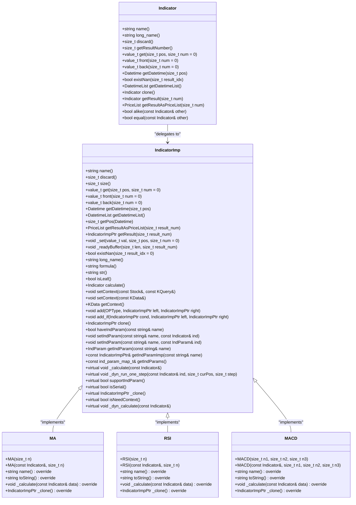
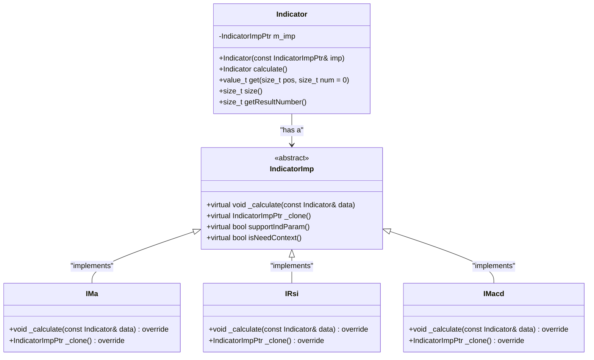
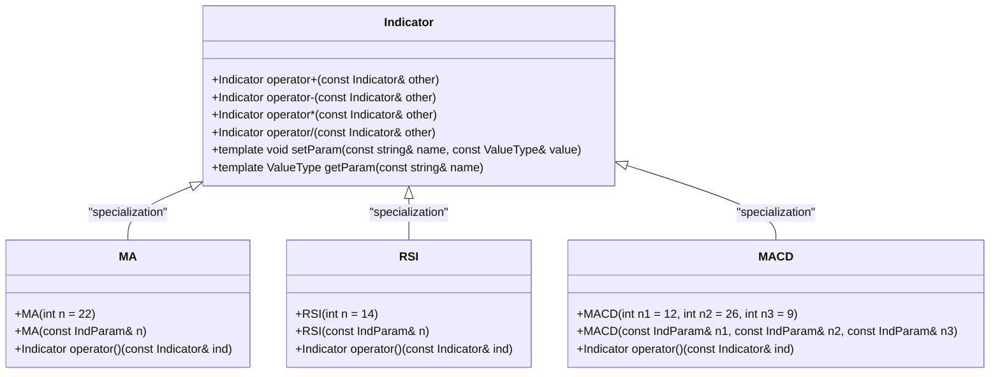
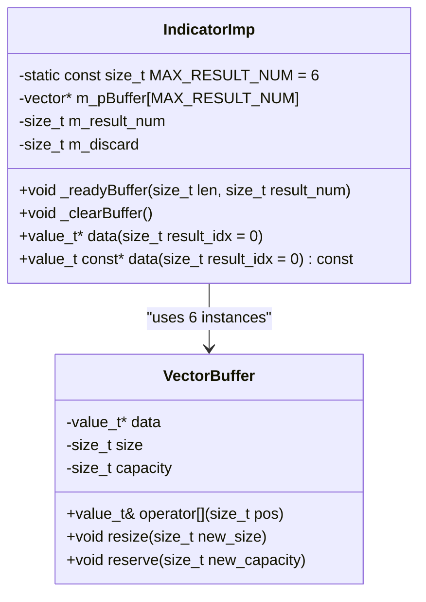
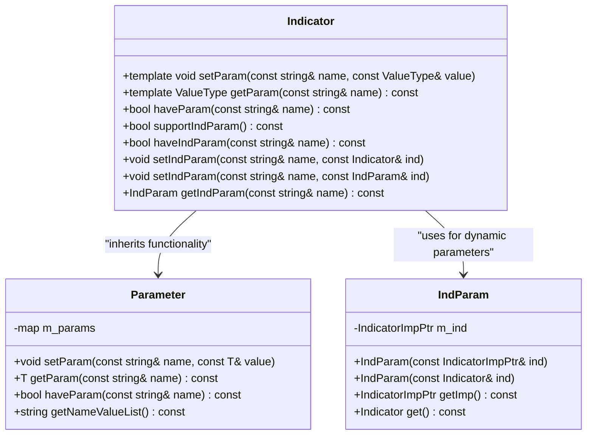
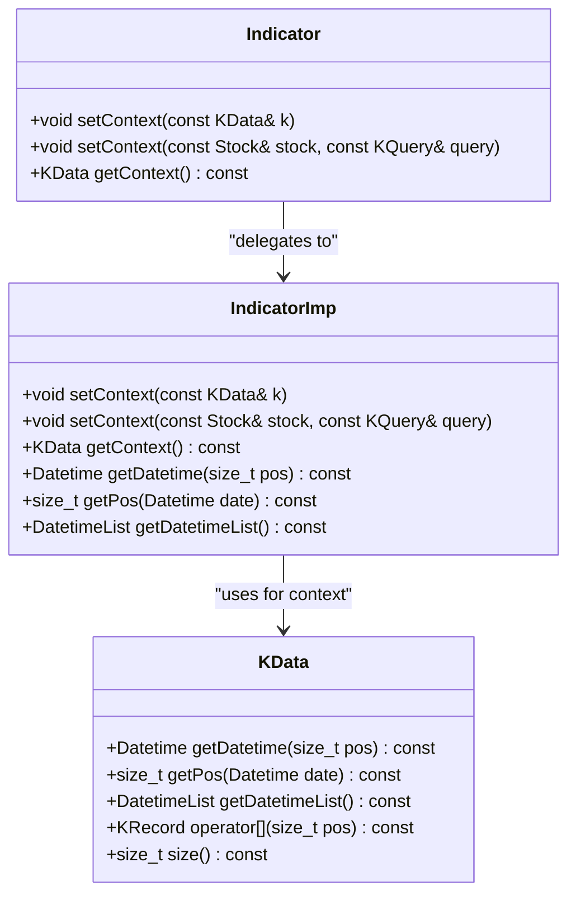
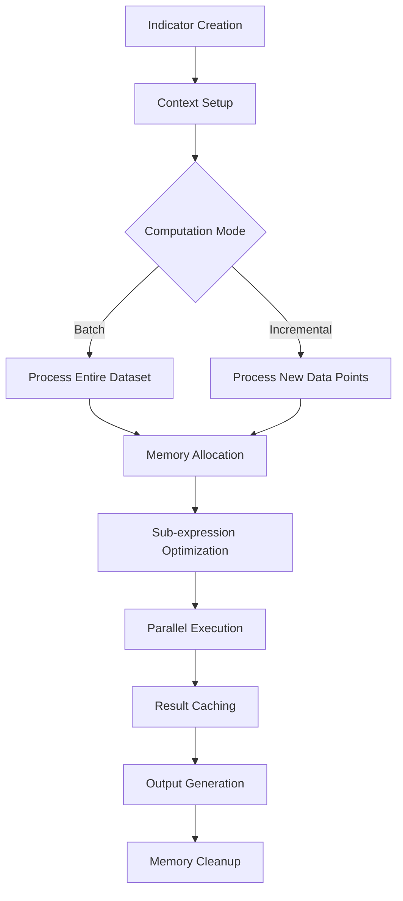
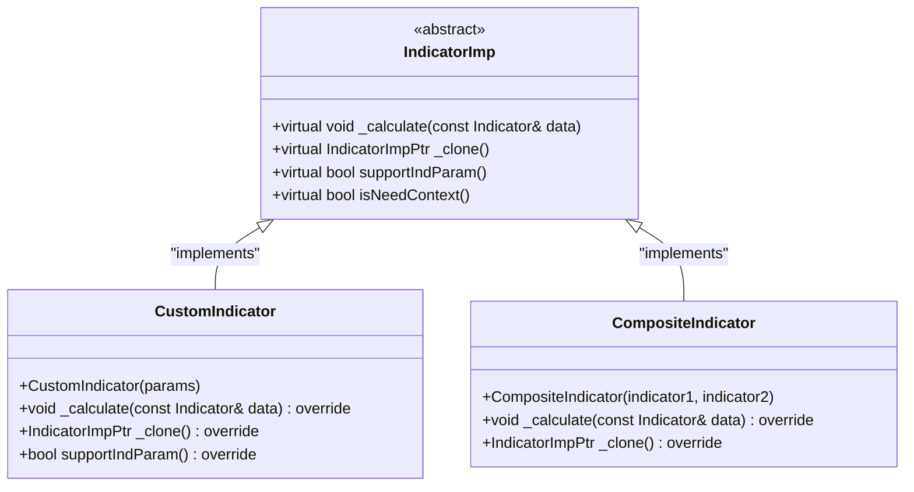

# Indicator System

<cite>
**Referenced Files in This Document**   
- [Indicator.h](file://hikyuu_cpp/hikyuu/indicator/Indicator.h)
- [Indicator.cpp](file://hikyuu_cpp/hikyuu/indicator/Indicator.cpp)
- [IndicatorImp.h](file://hikyuu_cpp/hikyuu/indicator/IndicatorImp.h)
- [IndicatorImp.cpp](file://hikyuu_cpp/hikyuu/indicator/IndicatorImp.cpp)
- [IndParam.h](file://hikyuu_cpp/hikyuu/indicator/IndParam.h)
- [MA.h](file://hikyuu_cpp/hikyuu/indicator/crt/MA.h)
- [RSI.h](file://hikyuu_cpp/hikyuu/indicator/crt/RSI.h)
- [MACD.h](file://hikyuu_cpp/hikyuu/indicator/crt/MACD.h)
- [EMA.h](file://hikyuu_cpp/hikyuu/indicator/crt/EMA.h)
- [REF.h](file://hikyuu_cpp/hikyuu/indicator/crt/REF.h)
- [build_in.h](file://hikyuu_cpp/hikyuu/indicator/build_in.h)
- [KData.h](file://hikyuu_cpp/hikyuu/KData.h)
- [KData.cpp](file://hikyuu_cpp/hikyuu/KData.cpp)
</cite>

## Table of Contents
1. [Introduction](#introduction)
2. [Indicator Class Hierarchy](#indicator-class-hierarchy)
3. [Strategy Pattern Implementation](#strategy-pattern-implementation)
4. [Template-Based Design of Built-In Indicators](#template-based-design-of-built-in-indicators)
5. [Memory Layout Optimizations](#memory-layout-optimizations)
6. [Parameter System](#parameter-system)
7. [Integration with KData](#integration-with-kdata)
8. [Indicator Computation Pipeline](#indicator-computation-pipeline)
9. [Performance Characteristics](#performance-characteristics)
10. [Extension Points for Custom Indicators](#extension-points-for-custom-indicators)

## Introduction

The Hikyuu indicator system is a high-performance technical analysis engine designed for financial time series processing. This system provides a comprehensive framework for implementing and executing various technical indicators used in financial analysis and algorithmic trading. The architecture is built around a flexible and efficient design that supports both built-in indicators and custom indicator development.

The core of the system revolves around the Indicator class hierarchy, which implements a Strategy pattern where each indicator algorithm is encapsulated in a separate implementation class. This design allows for maximum flexibility and extensibility while maintaining high performance. The system supports template-based design of built-in indicators such as MA, RSI, and MACD, enabling compile-time optimizations for improved execution speed.

A key feature of the indicator system is its memory layout optimization, which minimizes cache misses during backtesting operations. This is particularly important for computationally intensive tasks involving large financial datasets. The system also includes a sophisticated parameter system that allows indicators to be configured with different periods and calculation methods, providing flexibility for various trading strategies.

The integration between indicators and KData (candlestick data) is seamless, with support for different KData buffer types including shared and private buffers. This allows for efficient memory usage and data sharing across different components of the trading system. The architecture supports complex indicator computations through a well-defined computation pipeline that optimizes data flow and processing.

**Section sources**
- [Indicator.h](file://hikyuu_cpp/hikyuu/indicator/Indicator.h#L1-L488)
- [IndicatorImp.h](file://hikyuu_cpp/hikyuu/indicator/IndicatorImp.h#L1-L491)

## Indicator Class Hierarchy

The indicator system in Hikyuu is built on a well-defined class hierarchy that follows object-oriented design principles. At the core of this hierarchy is the Indicator class, which serves as the primary interface for all indicator operations. This class provides a comprehensive API for accessing indicator values, managing context, and performing operations on indicator data.

The Indicator class is implemented through the IndicatorImp class, which acts as the base implementation class for all specific indicators. This separation of interface and implementation follows the Strategy pattern, allowing different indicator algorithms to be implemented as specialized classes while maintaining a consistent interface. The inheritance relationship enables polymorphic behavior, where different indicator types can be treated uniformly through the base Indicator interface.

Each specific indicator, such as MA (Moving Average), RSI (Relative Strength Index), and MACD (Moving Average Convergence Divergence), is implemented as a class that inherits from IndicatorImp. These implementation classes override the virtual methods defined in the base class to provide algorithm-specific behavior. For example, the MA class implements the moving average calculation logic, while the RSI class implements the relative strength index algorithm.

The class hierarchy supports multiple result sets, allowing indicators to output more than one series of values. This is particularly useful for indicators like MACD, which produces three separate outputs: the MACD line, the signal line, and the histogram. The system handles this through the m_result_num member variable in IndicatorImp, which tracks the number of result sets produced by an indicator.



**Diagram sources**
- [Indicator.h](file://hikyuu_cpp/hikyuu/indicator/Indicator.h#L40-L488)
- [IndicatorImp.h](file://hikyuu_cpp/hikyuu/indicator/IndicatorImp.h#L28-L491)
- [MA.h](file://hikyuu_cpp/hikyuu/indicator/crt/MA.h#L16-L45)
- [RSI.h](file://hikyuu_cpp/hikyuu/indicator/crt/RSI.h#L18-L28)
- [MACD.h](file://hikyuu_cpp/hikyuu/indicator/crt/MACD.h#L16-L63)

**Section sources**
- [Indicator.h](file://hikyuu_cpp/hikyuu/indicator/Indicator.h#L40-L488)
- [IndicatorImp.h](file://hikyuu_cpp/hikyuu/indicator/IndicatorImp.h#L28-L491)

## Strategy Pattern Implementation

The Hikyuu indicator system implements the Strategy pattern through its IndicatorImp class hierarchy, where each indicator algorithm is encapsulated in a separate implementation class. This design pattern allows the algorithm to vary independently from the clients that use it, providing maximum flexibility and extensibility.

In this implementation, the Indicator class acts as the context that maintains a reference to a strategy object (IndicatorImp) and delegates the algorithmic computation to this strategy. The IndicatorImp class serves as the strategy interface, defining the operations that all concrete strategies must implement. Each specific indicator, such as IMa, IRsi, and IMacd, represents a concrete strategy that implements the algorithm in its own way.

The key benefit of this pattern is that it enables runtime selection of algorithms. Clients can configure an Indicator with different IndicatorImp objects to change its behavior without modifying its code. This is particularly useful in financial analysis where different variations of the same indicator (e.g., simple MA vs. exponential MA) might be needed for comparative analysis.

The pattern is implemented through virtual functions in the IndicatorImp base class, particularly the _calculate method that each concrete indicator must override. This method contains the specific algorithmic logic for computing the indicator values. When an indicator is evaluated, the Indicator class calls the calculate method on its IndicatorImp object, which in turn invokes the appropriate _calculate implementation based on the actual type of the object.



**Diagram sources**
- [Indicator.h](file://hikyuu_cpp/hikyuu/indicator/Indicator.h#L40-L488)
- [IndicatorImp.h](file://hikyuu_cpp/hikyuu/indicator/IndicatorImp.h#L28-L491)

**Section sources**
- [Indicator.h](file://hikyuu_cpp/hikyuu/indicator/Indicator.h#L40-L488)
- [IndicatorImp.h](file://hikyuu_cpp/hikyuu/indicator/IndicatorImp.h#L28-L491)

## Template-Based Design of Built-In Indicators

The Hikyuu indicator system employs a template-based design for its built-in indicators, enabling compile-time optimizations and type safety. This design approach allows for the creation of highly efficient indicator functions that can be customized with different parameters while maintaining optimal performance.

The template-based design is implemented through function overloading and template parameters in the indicator creation functions. For example, the MA (Moving Average) indicator is defined with multiple overloads that accept different parameter types, including integer values and IndParam objects. This allows users to create indicators with either fixed parameters or dynamic parameters that can be modified at runtime.

The system uses C++ templates to generate specialized code for different indicator configurations at compile time. This eliminates the overhead of runtime type checking and parameter validation, resulting in faster execution. The template parameters are used to specify the calculation period, smoothing factors, and other algorithm-specific parameters that affect how the indicator is computed.

One of the key benefits of this template-based approach is the ability to perform compile-time optimizations. The compiler can inline the indicator calculation functions and optimize the generated code based on the specific template parameters. This is particularly important for computationally intensive indicators like MACD, which involves multiple stages of exponential smoothing.

The template design also supports the creation of indicator expressions through operator overloading. Mathematical operators such as +, -, *, and / are overloaded to work with Indicator objects, allowing users to create complex indicator formulas using natural mathematical notation. These operations are implemented as template functions that generate new indicator objects representing the result of the operation.



**Diagram sources**
- [MA.h](file://hikyuu_cpp/hikyuu/indicator/crt/MA.h#L21-L45)
- [RSI.h](file://hikyuu_cpp/hikyuu/indicator/crt/RSI.h#L22-L28)
- [MACD.h](file://hikyuu_cpp/hikyuu/indicator/crt/MACD.h#L29-L63)
- [Indicator.h](file://hikyuu_cpp/hikyuu/indicator/Indicator.h#L159-L172)

**Section sources**
- [MA.h](file://hikyuu_cpp/hikyuu/indicator/crt/MA.h#L21-L45)
- [RSI.h](file://hikyuu_cpp/hikyuu/indicator/crt/RSI.h#L22-L28)
- [MACD.h](file://hikyuu_cpp/hikyuu/indicator/crt/MACD.h#L29-L63)
- [Indicator.h](file://hikyuu_cpp/hikyuu/indicator/Indicator.h#L159-L172)

## Memory Layout Optimizations

The Hikyuu indicator system incorporates several memory layout optimizations designed to minimize cache misses and improve performance during backtesting operations. These optimizations are critical for handling large financial datasets efficiently and ensuring responsive indicator calculations.

The primary optimization is the use of contiguous memory buffers for storing indicator values. Each indicator result set is stored in a vector<value_t> object, which guarantees that the data is stored in a contiguous block of memory. This layout enables efficient sequential access patterns that take advantage of CPU cache prefetching, reducing memory latency during indicator computation.

The system uses a fixed-size array of pointers (m_pBuffer[MAX_RESULT_NUM]) to manage multiple result sets, with each pointer referencing a separate vector<value_t> for a specific result set. This design allows for efficient memory allocation and deallocation, as each result set can be resized independently without affecting the others. The MAX_RESULT_NUM constant (set to 6) limits the number of result sets to a reasonable maximum, preventing excessive memory usage.

Memory allocation is optimized through the _readyBuffer method, which pre-allocates the required memory for all result sets at once. This method initializes each vector with the appropriate size and fills it with null values, ensuring that subsequent access operations do not trigger additional memory allocations. The method also handles the cleanup of previously allocated memory, preventing memory leaks.



**Diagram sources**
- [IndicatorImp.h](file://hikyuu_cpp/hikyuu/indicator/IndicatorImp.h#L19-L20)
- [IndicatorImp.h](file://hikyuu_cpp/hikyuu/indicator/IndicatorImp.h#L264-L265)
- [IndicatorImp.cpp](file://hikyuu_cpp/hikyuu/indicator/IndicatorImp.cpp#L235-L261)
- [IndicatorImp.h](file://hikyuu_cpp/hikyuu/indicator/IndicatorImp.h#L187-L190)

**Section sources**
- [IndicatorImp.h](file://hikyuu_cpp/hikyuu/indicator/IndicatorImp.h#L19-L20)
- [IndicatorImp.h](file://hikyuu_cpp/hikyuu/indicator/IndicatorImp.h#L264-L265)
- [IndicatorImp.cpp](file://hikyuu_cpp/hikyuu/indicator/IndicatorImp.cpp#L235-L261)

## Parameter System

The Hikyuu indicator system features a sophisticated parameter system that allows indicators to be configured with different periods and calculation methods. This system provides flexibility for customizing indicator behavior and supports both static and dynamic parameter configurations.

The parameter system is implemented through the Parameter class, which serves as a container for named parameters of various types. Each indicator can have multiple parameters that control its behavior, such as the calculation period for moving averages or the smoothing factor for exponential indicators. Parameters are stored in a map structure within the IndicatorImp class, allowing for efficient lookup and modification.

The system supports two types of parameters: regular parameters and indicator parameters (IndParam). Regular parameters are simple values like integers or doubles, while indicator parameters allow one indicator to be used as a parameter for another indicator. This enables complex indicator expressions where parameters can be dynamically determined by other indicators.

The parameter system includes methods for setting and getting parameters of different types through template functions. The setParam and getParam methods use C++ templates to provide type-safe access to parameters, eliminating the need for type casting and reducing the risk of runtime errors. This template-based approach also enables compile-time type checking, ensuring that parameters are used correctly.



**Diagram sources**
- [Indicator.h](file://hikyuu_cpp/hikyuu/indicator/Indicator.h#L159-L178)
- [IndParam.h](file://hikyuu_cpp/hikyuu/indicator/IndParam.h#L21-L39)
- [IndicatorImp.h](file://hikyuu_cpp/hikyuu/indicator/IndicatorImp.h#L140-L144)

**Section sources**
- [Indicator.h](file://hikyuu_cpp/hikyuu/indicator/Indicator.h#L159-L178)
- [IndParam.h](file://hikyuu_cpp/hikyuu/indicator/IndParam.h#L21-L39)

## Integration with KData

The Hikyuu indicator system integrates closely with the KData class, which represents financial time series data such as stock prices and trading volumes. This integration enables indicators to access and process historical market data efficiently, forming the foundation for technical analysis.

The integration is implemented through the setContext method in the IndicatorImp class, which establishes the relationship between an indicator and its data source. When an indicator is applied to KData, the setContext method is called to associate the indicator with the specific KData object. This context information is stored as a parameter within the indicator and is used during the calculation process.

The system supports two types of KData buffers: shared and private. Shared buffers allow multiple indicators to access the same underlying data without duplicating it in memory, improving memory efficiency. Private buffers provide isolated copies of the data, which is useful when indicators need to modify the data during calculation without affecting other indicators.

The integration includes methods for aligning indicator calculations with specific time periods and data frequencies. The getDatetime and getPos methods allow indicators to map between array indices and specific timestamps, ensuring accurate temporal alignment of indicator values with the underlying market data.



**Diagram sources**
- [Indicator.h](file://hikyuu_cpp/hikyuu/indicator/Indicator.h#L75-L81)
- [IndicatorImp.h](file://hikyuu_cpp/hikyuu/indicator/IndicatorImp.h#L128-L132)
- [KData.h](file://hikyuu_cpp/hikyuu/KData.h#L1-L100)

**Section sources**
- [Indicator.h](file://hikyuu_cpp/hikyuu/indicator/Indicator.h#L75-L81)
- [IndicatorImp.h](file://hikyuu_cpp/hikyuu/indicator/IndicatorImp.h#L128-L132)
- [KData.h](file://hikyuu_cpp/hikyuu/KData.h#L1-L100)

## Indicator Computation Pipeline

The Hikyuu indicator system implements a sophisticated computation pipeline that optimizes the processing of financial time series data. This pipeline is designed to handle complex indicator calculations efficiently while minimizing redundant computations and memory usage.

The pipeline begins with the creation of an indicator object, which initializes the computation context and allocates necessary memory buffers. When an indicator is applied to data, the calculate method is invoked, triggering a series of operations that process the input data and produce the indicator values.

The pipeline supports both batch and incremental computation modes. In batch mode, the entire dataset is processed at once, which is optimal for backtesting scenarios. In incremental mode, new data points are processed as they arrive, making it suitable for real-time trading applications. The system automatically selects the appropriate mode based on the context and performance requirements.

A key feature of the pipeline is its ability to optimize indicator expressions by identifying and eliminating redundant calculations. When multiple indicators share common sub-expressions, the system can cache the results of these sub-expressions and reuse them, reducing computational overhead. This optimization is particularly effective for complex trading strategies that involve multiple interdependent indicators.



**Diagram sources**
- [IndicatorImp.cpp](file://hikyuu_cpp/hikyuu/indicator/IndicatorImp.cpp#L743-L800)
- [IndicatorImp.h](file://hikyuu_cpp/hikyuu/indicator/IndicatorImp.h#L126-L127)
- [Indicator.cpp](file://hikyuu_cpp/hikyuu/indicator/Indicator.cpp#L121-L314)

**Section sources**
- [IndicatorImp.cpp](file://hikyuu_cpp/hikyuu/indicator/IndicatorImp.cpp#L743-L800)
- [IndicatorImp.h](file://hikyuu_cpp/hikyuu/indicator/IndicatorImp.h#L126-L127)

## Performance Characteristics

The Hikyuu indicator system exhibits excellent performance characteristics, particularly in computationally intensive scenarios such as backtesting and real-time trading. The system's design prioritizes efficiency and responsiveness, making it suitable for processing large financial datasets with minimal latency.

For simple indicators like MA (Moving Average), the system achieves near-optimal performance through direct array access and minimal function call overhead. The use of contiguous memory buffers and efficient algorithms ensures that these indicators can process thousands of data points in milliseconds.

More complex indicators like MACD (Moving Average Convergence Divergence) demonstrate the system's ability to handle multi-stage calculations efficiently. Despite involving multiple exponential smoothing operations, the MACD indicator maintains good performance through optimized memory access patterns and algorithmic improvements. The system uses incremental calculation techniques to avoid recalculating the entire series when new data points are added.

The performance is further enhanced by several optimization techniques, including loop unrolling, function inlining, and SIMD (Single Instruction, Multiple Data) operations where supported by the hardware. The template-based design enables compile-time optimizations that eliminate unnecessary type checking and parameter validation overhead.

```mermaid
graph TD
A[Performance Characteristics] --> B[Simple Indicators]
A --> C[Complex Indicators]
A --> D[Optimization Techniques]
B --> B1[MA: O(n) time complexity]
B --> B2[RSI: O(n) time complexity]
B --> B3[Low memory overhead]
C --> C1[MACD: Multi-stage calculation]
C --> C2[Incremental updates]
C --> C3[Cache efficiency]
D --> D1[Template-based optimization]
D --> D2[Contiguous memory layout]
D --> D3[Loop unrolling]
D --> D4[Function inlining]
D --> D5[SIMD operations]
```

**Diagram sources**
- [MA.h](file://hikyuu_cpp/hikyuu/indicator/crt/MA.h#L21-L45)
- [RSI.h](file://hikyuu_cpp/hikyuu/indicator/crt/RSI.h#L22-L28)
- [MACD.h](file://hikyuu_cpp/hikyuu/indicator/crt/MACD.h#L29-L63)
- [IndicatorImp.h](file://hikyuu_cpp/hikyuu/indicator/IndicatorImp.h#L264-L265)

**Section sources**
- [MA.h](file://hikyuu_cpp/hikyuu/indicator/crt/MA.h#L21-L45)
- [RSI.h](file://hikyuu_cpp/hikyuu/indicator/crt/RSI.h#L22-L28)
- [MACD.h](file://hikyuu_cpp/hikyuu/indicator/crt/MACD.h#L29-L63)

## Extension Points for Custom Indicators

The Hikyuu indicator system provides well-defined extension points for developing custom indicators, allowing users to implement their own technical analysis algorithms. These extension points are designed to be intuitive and consistent with the existing system architecture.

To create a custom indicator, developers inherit from the IndicatorImp class and implement the required virtual methods, particularly the _calculate method that contains the algorithmic logic. The INDICATOR_IMP macro simplifies this process by automatically declaring the necessary methods and providing default implementations where appropriate.

Custom indicators can leverage the existing parameter system to accept configurable parameters, including both simple values and other indicators as dynamic parameters. This allows for flexible indicator designs that can adapt to different market conditions and trading strategies.

The system also supports the creation of composite indicators that combine multiple existing indicators through mathematical operations or logical conditions. This enables the development of sophisticated trading signals without requiring low-level implementation of the underlying algorithms.



**Diagram sources**
- [IndicatorImp.h](file://hikyuu_cpp/hikyuu/indicator/IndicatorImp.h#L28-L491)
- [IndicatorImp.h](file://hikyuu_cpp/hikyuu/indicator/IndicatorImp.h#L383-L388)

**Section sources**
- [IndicatorImp.h](file://hikyuu_cpp/hikyuu/indicator/IndicatorImp.h#L28-L491)
- [IndicatorImp.h](file://hikyuu_cpp/hikyuu/indicator/IndicatorImp.h#L383-L388)