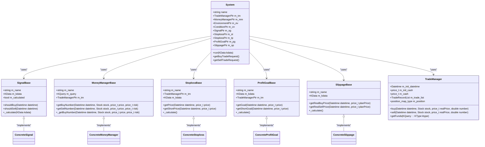
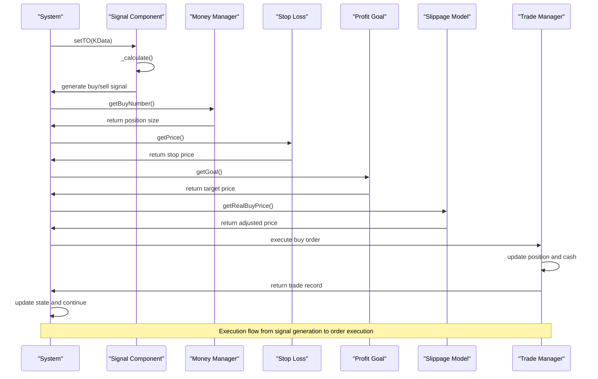

# Trading Components

<cite>
**Referenced Files in This Document**   
- [System.h](file://hikyuu_cpp/hikyuu/trade_sys/system/System.h)
- [TradeManager.h](file://hikyuu_cpp/hikyuu/trade_manage/TradeManager.h)
- [TradeManagerBase.h](file://hikyuu_cpp/hikyuu/trade_manage/TradeManagerBase.h)
- [SignalBase.h](file://hikyuu_cpp/hikyuu/trade_sys/signal/SignalBase.h)
- [MoneyManagerBase.h](file://hikyuu_cpp/hikyuu/trade_sys/moneymanager/MoneyManagerBase.h)
- [StoplossBase.h](file://hikyuu_cpp/hikyuu/trade_sys/stoploss/StoplossBase.h)
- [ProfitGoalBase.h](file://hikyuu_cpp/hikyuu/trade_sys/profitgoal/ProfitGoalBase.h)
- [SlippageBase.h](file://hikyuu_cpp/hikyuu/trade_sys/slippage/SlippageBase.h)
</cite>

## Table of Contents
1. [Introduction](#introduction)
2. [Modular Trading System Architecture](#modular-trading-system-architecture)
3. [Base Component Classes](#base-component-classes)
4. [Component Composition Model](#component-composition-model)
5. [Parameter System](#parameter-system)
6. [Execution Flow](#execution-flow)
7. [TradeManager Implementation](#trademanager-implementation)
8. [Performance Considerations](#performance-considerations)
9. [Extension Points](#extension-points)
10. [Diagrams](#diagrams)

## Introduction
The Hikyuu trading system implements a modular architecture based on the Strategy pattern, where each trading decision component is designed as a pluggable module. This documentation provides a comprehensive overview of the system's architecture, focusing on the component-based design that enables flexible and extensible trading strategy development. The system allows complex trading systems to be built by combining simple, independent components for signal generation, money management, stop loss, profit goal, and other trading decisions.

## Modular Trading System Architecture
The Hikyuu trading system follows a modular design pattern where each trading decision component is implemented as a pluggable module. This architecture enables the creation of complex trading systems by combining simple, independent components. The system is organized around a central System class that orchestrates the interaction between various trading components. Each component type has a base class that defines the interface and common functionality, with concrete implementations providing specific trading logic.

The core architectural principle is the separation of concerns, where each component is responsible for a specific aspect of the trading decision process. This design allows for maximum flexibility and reusability, as components can be mixed and matched to create different trading strategies. The system supports both simple and complex trading strategies by allowing components to be combined in various configurations.

The modular architecture also facilitates testing and optimization, as individual components can be tested and optimized independently. This approach enables systematic evaluation of different trading strategies by swapping out individual components while keeping the rest of the system unchanged.

**Section sources**
- [System.h](file://hikyuu_cpp/hikyuu/trade_sys/system/System.h#L39-L666)

## Base Component Classes
The Hikyuu trading system defines several base classes for different types of trading components. Each base class provides a common interface and shared functionality for its component type, while allowing for specific implementations through inheritance.

### SignalBase
The SignalBase class serves as the foundation for all signal generation components. It provides methods for determining when to buy or sell based on market conditions. The base class manages the state of buy and sell signals and provides a framework for calculating signals based on historical data. Concrete signal implementations must override the _calculate method to provide specific signal generation logic.

### MoneyManagerBase
The MoneyManagerBase class is the base for all money management components. It handles position sizing and risk management decisions. The base class provides access to the trading account information and market data, allowing money management strategies to make informed decisions about position size based on risk parameters and account equity.

### StoplossBase
The StoplossBase class defines the interface for stop loss and take profit strategies. It provides methods for calculating stop loss and profit target prices based on market conditions and trading parameters. The base class manages the connection to the trading account and market data, enabling stop loss strategies to consider current market volatility and price levels.

### ProfitGoalBase
The ProfitGoalBase class serves as the foundation for profit target strategies. It defines methods for determining profit targets for trades, allowing the system to automatically exit positions when profit goals are reached. The base class provides access to trading account information and market data to inform profit target calculations.

### SlippageBase
The SlippageBase class defines the interface for slippage models. It provides methods for calculating the actual execution price based on the planned price and market conditions. This component is crucial for realistic backtesting, as it accounts for the difference between expected and actual execution prices.

**Section sources**
- [SignalBase.h](file://hikyuu_cpp/hikyuu/trade_sys/signal/SignalBase.h#L24-L294)
- [MoneyManagerBase.h](file://hikyuu_cpp/hikyuu/trade_sys/moneymanager/MoneyManagerBase.h#L22-L248)
- [StoplossBase.h](file://hikyuu_cpp/hikyuu/trade_sys/stoploss/StoplossBase.h#L23-L204)
- [ProfitGoalBase.h](file://hikyuu_cpp/hikyuu/trade_sys/profitgoal/ProfitGoalBase.h#L23-L193)
- [SlippageBase.h](file://hikyuu_cpp/hikyuu/trade_sys/slippage/SlippageBase.h#L21-L175)

## Component Composition Model
The Hikyuu trading system employs a composition model that allows complex trading systems to be built by combining simple components. This approach follows the Strategy pattern, where each trading decision component is implemented as a pluggable module that can be easily swapped or replaced.

The composition model is centered around the System class, which acts as a container for all trading components. Each component is injected into the system through setter methods, allowing for flexible configuration. The system maintains references to all components and coordinates their interaction during the trading decision process.

Components are designed to be independent and stateless, with the exception of their internal configuration parameters. This design ensures that components can be reused across different trading systems without side effects. The system handles the state management and execution flow, while components focus on their specific decision-making logic.

The composition model supports both sequential and conditional execution of components. For example, a signal component may generate a buy signal, which is then passed to the money management component to determine position size, followed by the stop loss component to set the stop price. This sequential processing ensures that each component can make informed decisions based on the outputs of previous components.

Additionally, the system supports conditional execution through environment and condition components. These components can enable or disable other components based on market conditions or user-defined criteria, allowing for sophisticated trading strategies that adapt to changing market environments.

**Section sources**
- [System.h](file://hikyuu_cpp/hikyuu/trade_sys/system/System.h#L39-L666)

## Parameter System
The Hikyuu trading system features a comprehensive parameter system that allows each component to be configured independently. This system enables fine-tuning of trading strategies by adjusting the behavior of individual components without modifying their core logic.

Each component inherits parameter support from the base classes, which provides a standardized interface for setting and retrieving parameters. Parameters are stored in a dictionary-like structure, allowing for flexible configuration through key-value pairs. This design enables both programmatic and configuration file-based parameter management.

The parameter system supports various data types, including integers, floating-point numbers, strings, and boolean values. This flexibility allows components to expose their configurable aspects through parameters, such as lookback periods, threshold values, risk percentages, and other strategy-specific settings.

Parameters can be set at both the component level and the system level. Component-level parameters control the specific behavior of individual components, while system-level parameters affect the overall operation of the trading system. This hierarchical parameter structure enables both granular control and global configuration.

The parameter system also supports parameter validation and default values. Each component can define default parameter values and validation rules to ensure that parameters are within acceptable ranges. This feature helps prevent configuration errors and ensures that components operate with valid parameters.

Furthermore, the parameter system facilitates optimization and backtesting by allowing easy modification of strategy parameters. This capability is essential for systematic strategy development, as it enables the evaluation of different parameter combinations to identify optimal settings.

**Section sources**
- [System.h](file://hikyuu_cpp/hikyuu/trade_sys/system/System.h#L40)
- [SignalBase.h](file://hikyuu_cpp/hikyuu/trade_sys/signal/SignalBase.h#L25)
- [MoneyManagerBase.h](file://hikyuu_cpp/hikyuu/trade_sys/moneymanager/MoneyManagerBase.h#L23)
- [StoplossBase.h](file://hikyuu_cpp/hikyuu/trade_sys/stoploss/StoplossBase.h#L24)
- [ProfitGoalBase.h](file://hikyuu_cpp/hikyuu/trade_sys/profitgoal/ProfitGoalBase.h#L24)
- [SlippageBase.h](file://hikyuu_cpp/hikyuu/trade_sys/slippage/SlippageBase.h#L22)

## Execution Flow
The execution flow in the Hikyuu trading system follows a well-defined sequence from signal generation to order execution. This process ensures that trading decisions are made systematically and consistently, with each component contributing to the final trading decision.

The execution flow begins with the signal generation component, which analyzes market data to determine potential trading opportunities. When a signal component generates a buy or sell signal, it triggers the subsequent components in the decision pipeline. The signal is passed to the environment and condition components, which validate whether the current market conditions are suitable for trading.

If the environment and condition checks pass, the signal is forwarded to the money management component. This component calculates the appropriate position size based on the trading account's equity, risk parameters, and the specific trading opportunity. The money management component considers factors such as account size, risk tolerance, and position concentration limits when determining the trade size.

Next, the stop loss component calculates the stop price for the trade, defining the maximum acceptable loss. Simultaneously, the profit goal component determines the target price for taking profits. These price levels are used to set order parameters and manage the trade's risk-reward profile.

Before order execution, the slippage model is applied to adjust the expected execution price based on market conditions. This step accounts for the difference between the theoretical price and the actual execution price, providing a more realistic simulation of trading performance.

Finally, the TradeManager component executes the order, updating the trading account's state and recording the transaction. The TradeManager handles all aspects of order execution, including position tracking, cash management, and transaction cost calculation.

Throughout this process, each component can access the trading account's current state and historical market data, ensuring that decisions are made with complete context. The system also supports delayed execution, where trading signals are generated at one point in time but executed at a later time, allowing for more sophisticated trading strategies.

**Section sources**
- [System.h](file://hikyuu_cpp/hikyuu/trade_sys/system/System.h#L214-L334)
- [TradeManager.h](file://hikyuu_cpp/hikyuu/trade_manage/TradeManager.h#L231-L290)

## TradeManager Implementation
The TradeManager class is responsible for order execution and position tracking in the Hikyuu trading system. It serves as the central component for managing the trading account, handling all aspects of trade execution, position management, and performance tracking.

The TradeManager maintains a record of all executed trades, including entry and exit prices, quantities, timestamps, and associated costs. It tracks both open and closed positions, providing a comprehensive view of the account's current holdings. The class also manages cash balances, accounting for deposits, withdrawals, and transaction costs.

One of the key features of the TradeManager is its support for different order types and execution modes. It can handle market orders, limit orders, and stop orders, allowing for flexible trading strategies. The class also supports both long and short positions, enabling the implementation of directional and market-neutral strategies.

The TradeManager integrates with the slippage model to calculate realistic execution prices, accounting for market impact and liquidity constraints. It also applies transaction cost models to accurately reflect the costs associated with trading, including commissions, fees, and taxes.

Position tracking is a critical function of the TradeManager. It maintains detailed records of each position, including entry price, current market value, unrealized profit/loss, and associated stop loss and profit target levels. The class also handles position adjustments due to corporate actions such as stock splits, dividends, and mergers.

The TradeManager provides comprehensive performance measurement capabilities, calculating key metrics such as total return, annualized return, maximum drawdown, Sharpe ratio, and other risk-adjusted performance measures. These metrics are essential for evaluating the effectiveness of trading strategies and making informed decisions about strategy optimization.

Additionally, the TradeManager supports portfolio-level operations, allowing for the management of multiple positions across different securities. It can calculate portfolio-level metrics such as diversification, sector exposure, and overall risk profile, providing valuable insights for portfolio management.

**Section sources**
- [TradeManager.h](file://hikyuu_cpp/hikyuu/trade_manage/TradeManager.h#L35-L494)
- [TradeManagerBase.h](file://hikyuu_cpp/hikyuu/trade_manage/TradeManagerBase.h#L34-L800)

## Performance Considerations
The Hikyuu trading system incorporates several performance optimizations to ensure efficient execution, particularly during backtesting scenarios that involve processing large volumes of historical data.

The component evaluation engine is designed for high performance through careful memory management and algorithmic efficiency. Components are implemented to minimize redundant calculations and cache intermediate results when possible. The system also employs lazy evaluation, where components only perform calculations when their outputs are actually needed.

For backtesting, the system uses optimized data structures and algorithms to process historical market data efficiently. The KData class, which represents historical price data, is designed for fast access and minimal memory overhead. The system also supports data chunking and streaming, allowing for the processing of large datasets that may not fit entirely in memory.

The parameter system is optimized for fast access and modification, enabling rapid strategy optimization and parameter scanning. Parameters are stored in a hash table for O(1) lookup time, and the system minimizes the overhead of parameter validation and type conversion.

The TradeManager implementation is optimized for fast trade processing and position tracking. It uses efficient data structures such as hash maps and sorted lists to maintain trade records and position information, ensuring O(log n) or better performance for common operations like trade lookup and position updates.

The system also incorporates parallel processing capabilities where appropriate, allowing for the concurrent evaluation of multiple trading strategies or the processing of multiple securities. This parallelization significantly reduces backtesting time for complex strategies or large portfolios.

Memory usage is carefully managed throughout the system, with components designed to release resources when not in use. The system also supports object pooling for frequently created and destroyed objects, reducing garbage collection overhead and improving overall performance.

Finally, the system provides profiling and performance monitoring tools to help identify bottlenecks and optimize critical code paths. These tools enable developers to focus their optimization efforts on the most impactful areas of the codebase.

**Section sources**
- [System.h](file://hikyuu_cpp/hikyuu/trade_sys/system/System.h#L214-L334)
- [TradeManager.h](file://hikyuu_cpp/hikyuu/trade_manage/TradeManager.h#L231-L290)

## Extension Points
The Hikyuu trading system provides several extension points for custom trading component development. These extension points allow users to create new components that integrate seamlessly with the existing system architecture.

The primary extension point is through inheritance from the base component classes. Developers can create custom signal generators, money management strategies, stop loss algorithms, profit targets, and slippage models by extending the respective base classes and implementing the required virtual methods. This approach ensures that custom components adhere to the system's interface contracts and can be used interchangeably with built-in components.

The system also supports plugin-based extensions through a well-defined plugin interface. This allows for the dynamic loading of custom components without modifying the core system code. Plugins can be developed independently and distributed separately, enabling a rich ecosystem of third-party trading components.

Parameterization is another key extension point, allowing custom components to expose configurable parameters through the standard parameter system. This enables users to fine-tune the behavior of custom components without requiring code changes.

The event system provides additional extension capabilities, allowing custom components to respond to system events such as trade execution, position changes, and market data updates. This enables the development of reactive components that can adapt to changing market conditions or account states.

The system also supports custom data sources and market data providers through a pluggable data interface. This allows for the integration of alternative data feeds, including real-time market data, alternative data sources, and custom financial indicators.

Finally, the system provides extension points for performance measurement and reporting. Custom performance metrics and reporting formats can be implemented to meet specific analytical needs, allowing for tailored evaluation of trading strategies.

**Section sources**
- [SignalBase.h](file://hikyuu_cpp/hikyuu/trade_sys/signal/SignalBase.h#L128-L131)
- [MoneyManagerBase.h](file://hikyuu_cpp/hikyuu/trade_sys/moneymanager/MoneyManagerBase.h#L153)
- [StoplossBase.h](file://hikyuu_cpp/hikyuu/trade_sys/stoploss/StoplossBase.h#L84-L87)
- [ProfitGoalBase.h](file://hikyuu_cpp/hikyuu/trade_sys/profitgoal/ProfitGoalBase.h#L80)
- [SlippageBase.h](file://hikyuu_cpp/hikyuu/trade_sys/slippage/SlippageBase.h#L66-L72)

## Diagrams

**Diagram sources**
- [System.h](file://hikyuu_cpp/hikyuu/trade_sys/system/System.h#L39-L666)
- [SignalBase.h](file://hikyuu_cpp/hikyuu/trade_sys/signal/SignalBase.h#L24-L294)
- [MoneyManagerBase.h](file://hikyuu_cpp/hikyuu/trade_sys/moneymanager/MoneyManagerBase.h#L22-L248)
- [StoplossBase.h](file://hikyuu_cpp/hikyuu/trade_sys/stoploss/StoplossBase.h#L23-L204)
- [ProfitGoalBase.h](file://hikyuu_cpp/hikyuu/trade_sys/profitgoal/ProfitGoalBase.h#L23-L193)
- [SlippageBase.h](file://hikyuu_cpp/hikyuu/trade_sys/slippage/SlippageBase.h#L21-L175)
- [TradeManager.h](file://hikyuu_cpp/hikyuu/trade_manage/TradeManager.h#L35-L494)

**Diagram sources**
- [System.h](file://hikyuu_cpp/hikyuu/trade_sys/system/System.h#L214-L334)
- [TradeManager.h](file://hikyuu_cpp/hikyuu/trade_manage/TradeManager.h#L231-L290)