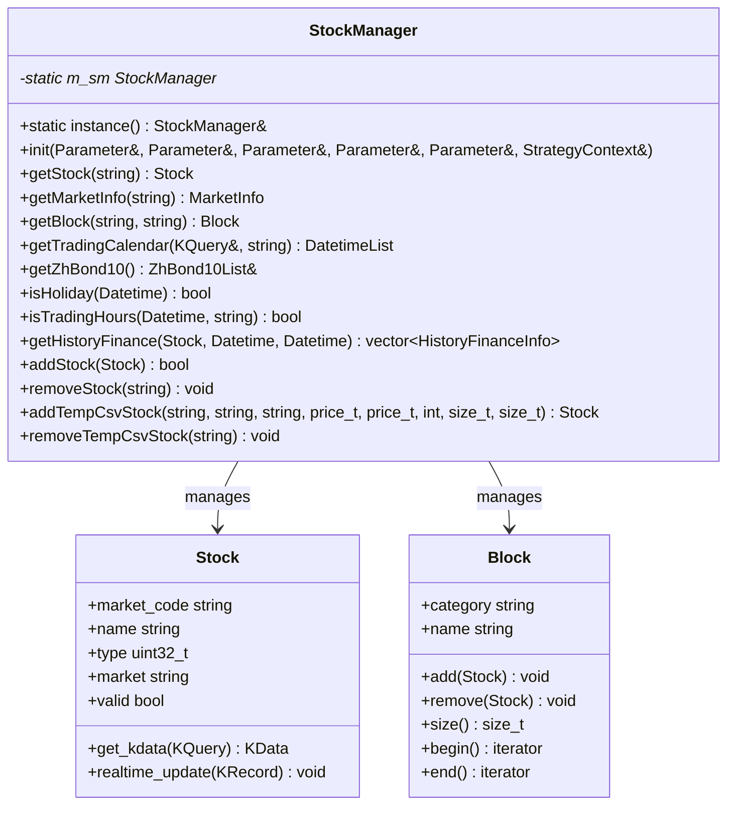
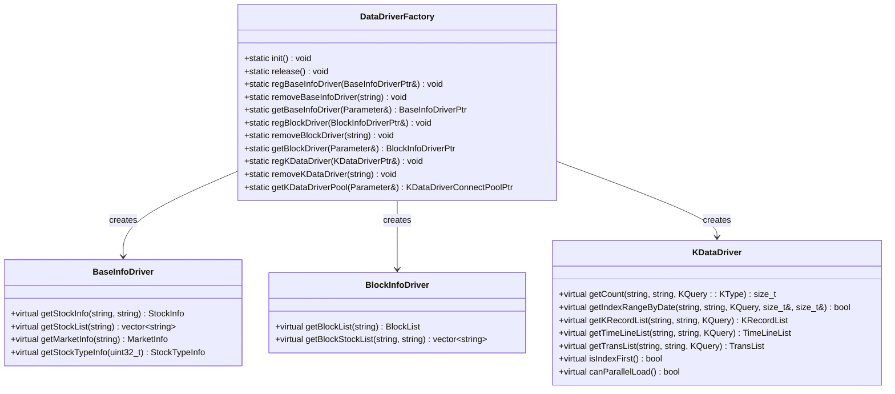
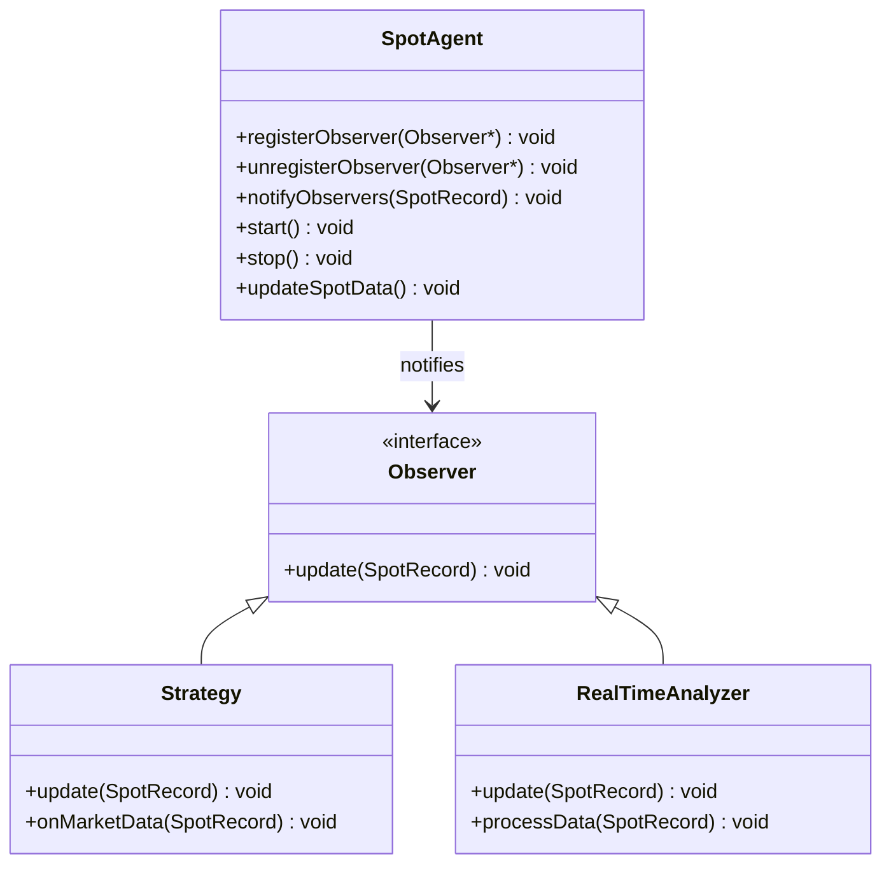
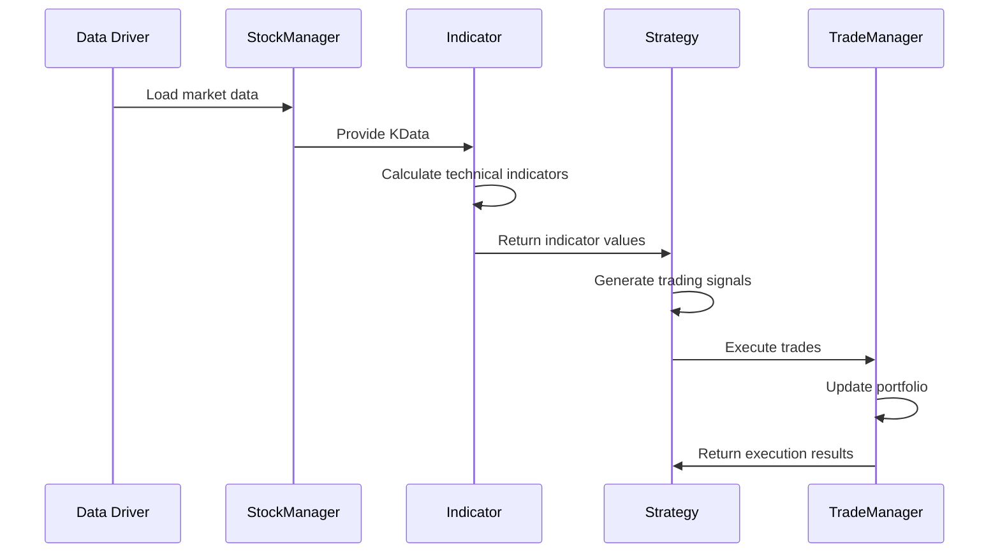
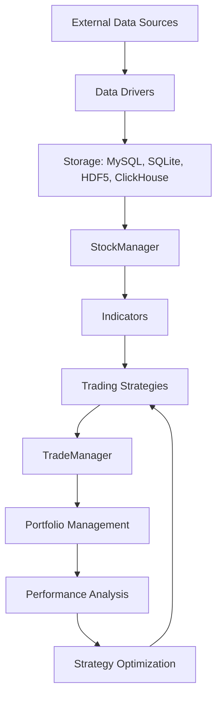
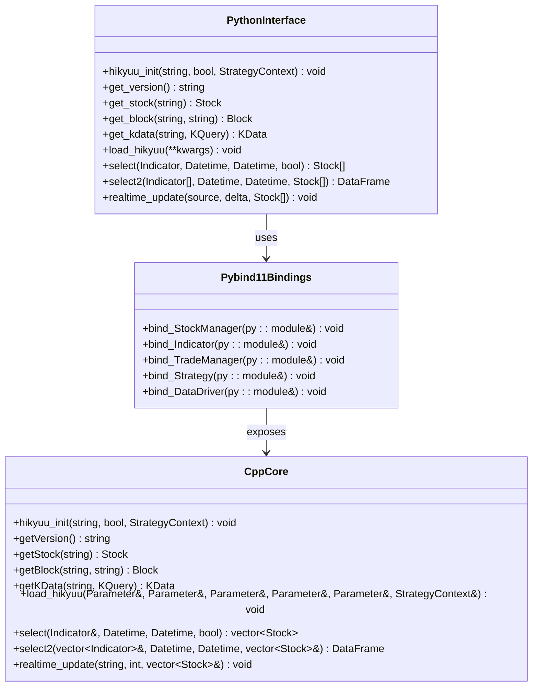
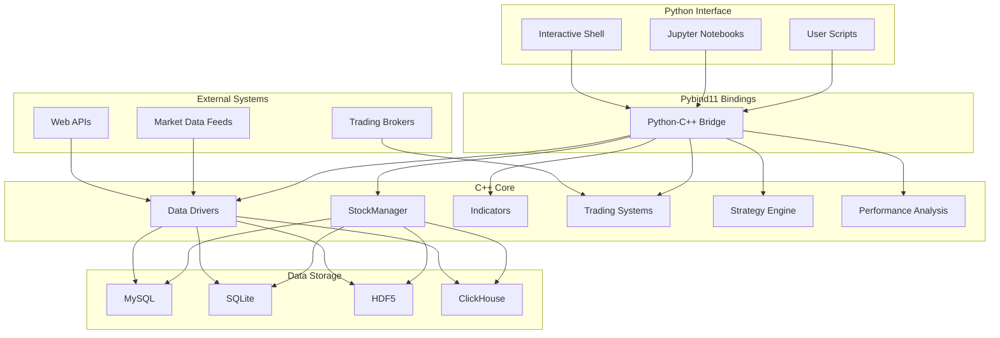

# Core Architecture

<cite>
**Referenced Files in This Document**   
- [__init__.py](file://hikyuu/__init__.py)
- [core.py](file://hikyuu/core.py)
- [hikyuu.h](file://hikyuu_cpp/hikyuu/hikyuu.h)
- [StockManager.h](file://hikyuu_cpp/hikyuu/StockManager.h)
- [DataDriverFactory.h](file://hikyuu_cpp/hikyuu/data_driver/DataDriverFactory.h)
- [Indicator.h](file://hikyuu_cpp/hikyuu/indicator/Indicator.h)
- [TradeManager.h](file://hikyuu_cpp/hikyuu/trade_manage/TradeManager.h)
- [Strategy.h](file://hikyuu_cpp/hikyuu/strategy/Strategy.h)
- [PluginManager.h](file://hikyuu_cpp/hikyuu/utilities/plugin/PluginManager.h)
- [scheduler.h](file://hikyuu_cpp/hikyuu/global/schedule/scheduler.h)
- [main.cpp](file://hikyuu_pywrap/main.cpp)
- [KDataDriver.h](file://hikyuu_cpp/hikyuu/data_driver/KDataDriver.h)
- [thread.h](file://hikyuu_cpp/hikyuu/utilities/thread/thread.h)
- [Log.h](file://hikyuu_cpp/hikyuu/utilities/Log.h)
- [setup.py](file://setup.py)
</cite>

## Table of Contents
1. [Introduction](#introduction)
2. [Hybrid C++/Python Architecture](#hybrid-cpython-architecture)
3. [Architectural Patterns](#architectural-patterns)
4. [Component Interactions](#component-interactions)
5. [Data Flow](#data-flow)
6. [C++/Python Integration](#cpython-integration)
7. [Technology Stack](#technology-stack)
8. [Cross-Cutting Concerns](#cross-cutting-concerns)
9. [System Context Diagram](#system-context-diagram)

## Introduction
The Hikyuu framework is a high-performance quantitative trading system that combines the computational efficiency of C++ with the usability and ecosystem integration of Python. This architectural documentation provides a comprehensive overview of the framework's design, focusing on its hybrid implementation, architectural patterns, component interactions, and technical decisions. The framework is designed to handle financial data processing, technical analysis, and trading system execution with optimal performance while maintaining developer accessibility through Python interfaces.

## Hybrid C++/Python Architecture
The Hikyuu framework employs a hybrid architecture that leverages C++ for high-performance computing and Python for ease of use and integration with the data science ecosystem. The core computational components are implemented in C++ to ensure optimal performance for computationally intensive tasks such as technical indicator calculations, backtesting, and real-time data processing. These C++ components are exposed to Python through pybind11 bindings, allowing Python developers to access high-performance functionality with a familiar interface.

The architecture follows a layered approach where the C++ core provides fundamental data structures, algorithms, and performance-critical operations, while the Python layer offers a user-friendly API, integration with popular data science libraries (such as pandas), and scripting capabilities for strategy development. This design enables users to benefit from C++'s performance advantages while enjoying Python's rich ecosystem and ease of development.

The framework's entry point is typically through Python, where users initialize the system and interact with the core components. The Python layer handles configuration, data loading, and high-level orchestration, delegating computationally intensive tasks to the C++ core. This separation of concerns allows for efficient resource utilization while maintaining a clean and intuitive user experience.

**Section sources**
- [__init__.py](file://hikyuu/__init__.py#L1-L595)
- [core.py](file://hikyuu/core.py#L1-L30)
- [main.cpp](file://hikyuu_pywrap/main.cpp#L1-L192)

## Architectural Patterns
The Hikyuu framework implements several key architectural patterns to achieve its design goals of performance, flexibility, and maintainability.

### Singleton Pattern
The StockManager class implements the Singleton pattern to ensure a single, globally accessible instance that manages all stock data and related information. This pattern is appropriate for the StockManager as it serves as a central repository for market data, and having multiple instances would lead to inconsistent state and inefficient memory usage. The singleton instance is accessed through the static `instance()` method, providing a global point of access while encapsulating the instantiation logic.

**Diagram sources **
- [StockManager.h](file://hikyuu_cpp/hikyuu/StockManager.h#L29-L429)
- [__init__.py](file://hikyuu/__init__.py#L85)

### Factory Pattern
The framework employs the Factory pattern through the DataDriverFactory class to create and manage various data drivers for different data sources and storage formats. This pattern allows the system to dynamically instantiate appropriate data drivers based on configuration without exposing the creation logic to the client code. The factory supports registration of custom drivers, enabling extensibility for new data sources.

**Diagram sources **
- [DataDriverFactory.h](file://hikyuu_cpp/hikyuu/data_driver/DataDriverFactory.h#L26-L59)
- [KDataDriver.h](file://hikyuu_cpp/hikyuu/data_driver/KDataDriver.h#L23-L225)

### Strategy Pattern
The framework implements the Strategy pattern in its trading components, allowing different trading algorithms and rules to be defined and interchanged at runtime. This pattern is evident in the Signal, Condition, and MoneyManager components, which can be configured with different implementations to create diverse trading strategies. The pattern promotes flexibility and reusability, as different strategy components can be combined in various ways to create complex trading systems.

### Observer Pattern
The Observer pattern is used for real-time data handling, where the SpotAgent class acts as the subject that notifies registered observers (such as trading strategies) when new market data is available. This pattern enables event-driven processing of real-time data, allowing strategies to react immediately to market changes without the need for polling. The pattern supports loose coupling between data sources and consumers, making the system more modular and easier to extend.

**Diagram sources **
- [strategy.h](file://hikyuu_cpp/hikyuu/strategy/Strategy.h#L30-L271)
- [scheduler.h](file://hikyuu_cpp/hikyuu/global/schedule/scheduler.h#L1-L24)

## Component Interactions
The Hikyuu framework consists of several key components that interact to provide a complete quantitative trading solution. The StockManager serves as the central component, managing all stock data and providing access to market information, trading calendars, and historical data. Data drivers are responsible for loading and storing financial data from various sources and formats, including MySQL, SQLite, HDF5, and ClickHouse.

Indicators are implemented as C++ classes that perform technical analysis calculations on price data. These indicators can be combined and manipulated using mathematical operations to create complex analytical expressions. The trading system components, including the TradeManager and various strategy components, use these indicators to make trading decisions and manage portfolio performance.

The component interactions follow a clear flow: data drivers load market data into the StockManager, which provides this data to indicators for analysis. Trading strategies use the results of these analyses to generate trading signals, which are executed by the TradeManager. This modular design allows for easy replacement or extension of individual components without affecting the overall system architecture.

**Diagram sources **
- [StockManager.h](file://hikyuu_cpp/hikyuu/StockManager.h#L29-L429)
- [Indicator.h](file://hikyuu_cpp/hikyuu/indicator/Indicator.h#L40-L488)
- [TradeManager.h](file://hikyuu_cpp/hikyuu/trade_manage/TradeManager.h#L35-L495)
- [Strategy.h](file://hikyuu_cpp/hikyuu/strategy/Strategy.h#L30-L271)

## Data Flow
The data flow in the Hikyuu framework follows a well-defined path from external data sources through storage and processing to analysis and trading execution. External financial data is first ingested through data drivers that support various formats and protocols. This data is then stored in a structured format using supported databases or file systems such as MySQL, SQLite, HDF5, or ClickHouse.

When a user requests data for analysis, the StockManager coordinates with the appropriate data driver to retrieve the requested information. The data is then processed and made available to indicators for technical analysis. Indicators perform calculations on the price data to generate signals that inform trading decisions. These signals are used by trading strategies to determine when to buy or sell securities.

The results of trading decisions are executed by the TradeManager, which updates the portfolio state and records all transactions. Performance metrics are calculated based on the trading results, providing feedback on the effectiveness of the trading strategy. This closed-loop system allows for continuous refinement of trading strategies based on historical performance.

**Diagram sources **
- [data_driver](file://hikyuu/data/)
- [StockManager.h](file://hikyuu_cpp/hikyuu/StockManager.h#L29-L429)
- [indicator](file://hikyuu/indicator/)
- [trade_sys](file://hikyuu/trade_sys/)
- [trade_manage](file://hikyuu/trade_manage/)

## C++/Python Integration
The Hikyuu framework uses pybind11 to create seamless integration between its C++ core and Python interface. This integration allows Python code to call C++ functions and use C++ objects as if they were native Python objects, while maintaining the performance benefits of compiled C++ code. The pybind11 library generates the necessary bindings automatically, reducing the overhead of maintaining the interface between the two languages.

The integration strategy involves exposing C++ classes and functions to Python with minimal modifications, preserving the original C++ API as much as possible. This approach ensures that the Python interface remains consistent with the underlying C++ implementation, making it easier for developers to understand and use the framework. The bindings are organized in a way that mirrors the C++ namespace structure, providing a logical and intuitive API for Python users.

Performance considerations were a key factor in the integration design. By using pybind11, the framework minimizes the overhead of crossing the Python-C++ boundary, allowing for efficient data transfer and function calls. This is particularly important for financial data processing, where large datasets and complex calculations require optimal performance. The integration also supports efficient memory management, preventing unnecessary data copying between Python and C++.

**Diagram sources **
- [main.cpp](file://hikyuu_pywrap/main.cpp#L1-L192)
- [__init__.py](file://hikyuu/__init__.py#L1-L595)
- [core.py](file://hikyuu/core.py#L1-L30)

## Technology Stack
The Hikyuu framework relies on a robust technology stack that combines high-performance C++ libraries with popular Python data science tools. The C++ core is built using modern C++ standards (C++17 and later) and leverages several key libraries:

- **Boost**: Used for various utilities including serialization, smart pointers, and multi-threading support
- **HDF5**: Provides high-performance storage for large datasets, particularly useful for historical market data
- **MySQL**: Used as a relational database option for storing structured financial data
- **SQLite**: Provides a lightweight, file-based database option for smaller datasets or portable installations
- **ClickHouse**: Offers a high-performance columnar database option for analytical queries on large datasets
- **pybind11**: Enables seamless integration between C++ and Python, allowing the framework to combine the strengths of both languages
- **spdlog**: Provides high-performance logging capabilities for debugging and monitoring
- **fmt**: Used for efficient string formatting operations

On the Python side, the framework integrates with the broader data science ecosystem, supporting libraries such as pandas for data manipulation and analysis, matplotlib and other plotting libraries for visualization, and Jupyter for interactive development. This combination of technologies allows the framework to handle large volumes of financial data efficiently while providing a user-friendly interface for strategy development and analysis.

**Section sources**
- [setup.py](file://setup.py#L1-L437)
- [hikyuu.h](file://hikyuu_cpp/hikyuu/hikyuu.h#L1-L56)
- [Log.h](file://hikyuu_cpp/hikyuu/utilities/Log.h#L1-L439)

## Cross-Cutting Concerns
The Hikyuu framework addresses several cross-cutting concerns that are critical for a financial data processing system.

### Memory Management
Memory management is handled through a combination of C++ RAII (Resource Acquisition Is Initialization) principles and smart pointers (shared_ptr, unique_ptr). This approach ensures that resources are automatically released when they are no longer needed, preventing memory leaks. The framework also implements object pooling for frequently used data structures to reduce allocation overhead and improve performance.

### Thread Safety
Thread safety is achieved through careful design of shared resources and the use of appropriate synchronization primitives. The StockManager and other shared components use mutexes and atomic operations to protect critical sections, allowing safe concurrent access from multiple threads. The framework also provides thread-safe data structures and containers to facilitate parallel processing of financial data.

### Error Handling
The framework implements a comprehensive error handling strategy using C++ exceptions combined with Python exception handling. Critical operations are wrapped in try-catch blocks to prevent crashes and provide meaningful error messages. The logging system (based on spdlog) captures detailed information about errors and warnings, aiding in debugging and system monitoring. The framework also includes validation checks at various levels to catch potential issues early in the processing pipeline.

### Performance Optimization
Performance optimization is a key concern throughout the framework. The C++ core is designed with performance in mind, using efficient algorithms and data structures. The framework supports parallel data loading and processing through thread pools, allowing it to take advantage of multi-core processors. Data access patterns are optimized for cache efficiency, and memory layout is designed to minimize cache misses. The integration with high-performance storage systems like HDF5 and ClickHouse further enhances data access speed.

**Section sources**
- [StockManager.h](file://hikyuu_cpp/hikyuu/StockManager.h#L29-L429)
- [Log.h](file://hikyuu_cpp/hikyuu/utilities/Log.h#L1-L439)
- [thread.h](file://hikyuu_cpp/hikyuu/utilities/thread/thread.h#L1-L15)
- [PluginManager.h](file://hikyuu_cpp/hikyuu/utilities/plugin/PluginManager.h#L1-L72)

## System Context Diagram
The system context diagram illustrates the major components of the Hikyuu framework and their relationships. The diagram shows how the C++ core components interact with the Python interface and external systems.

**Diagram sources **
- [__init__.py](file://hikyuu/__init__.py#L1-L595)
- [hikyuu.h](file://hikyuu_cpp/hikyuu/hikyuu.h#L1-L56)
- [main.cpp](file://hikyuu_pywrap/main.cpp#L1-L192)