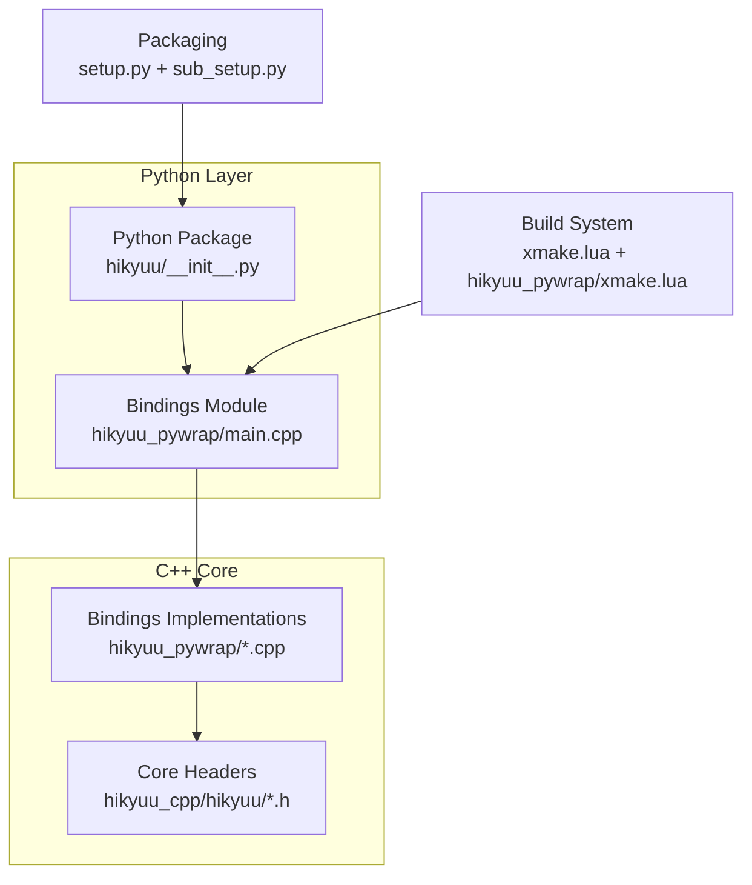
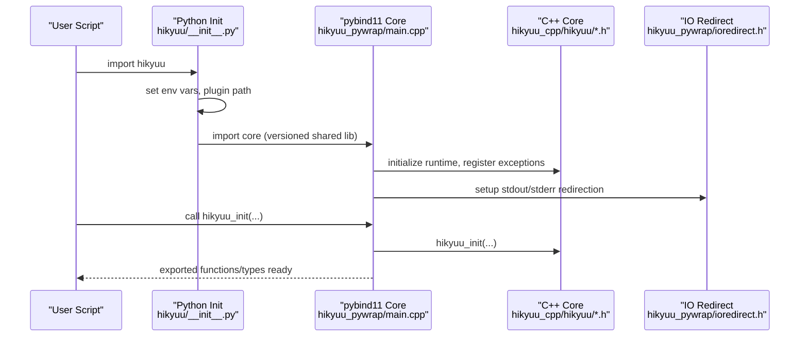
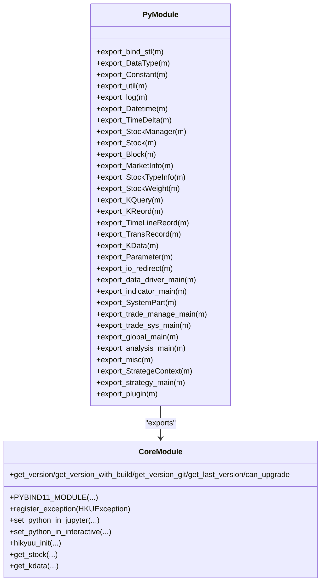
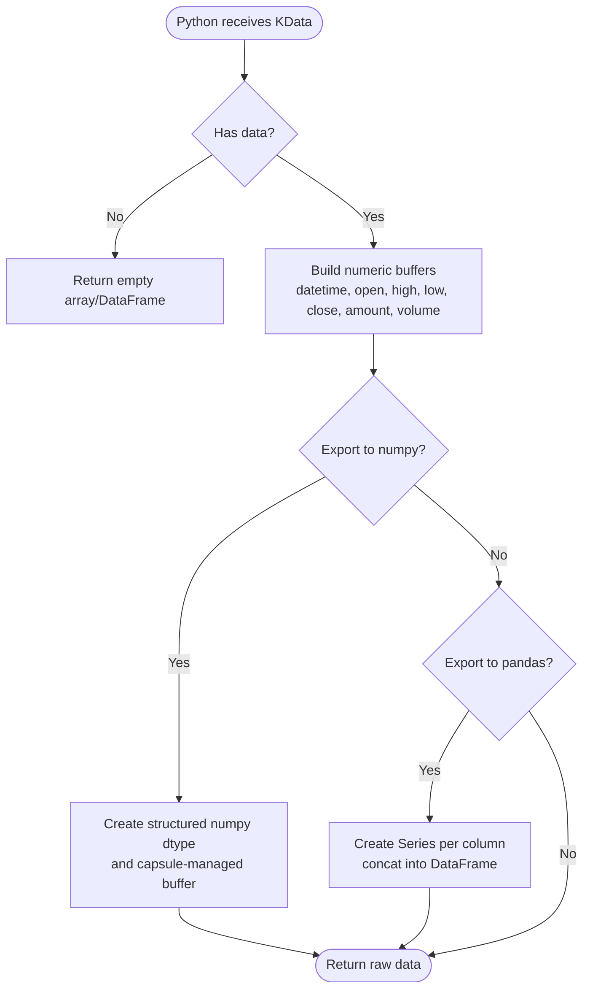
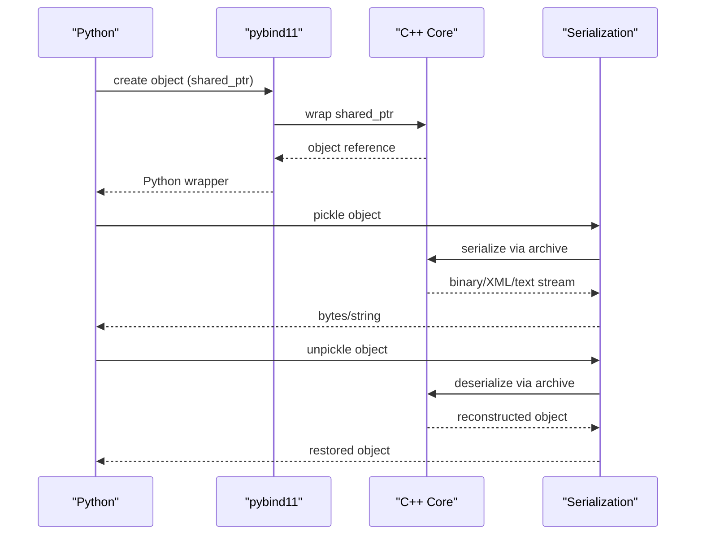
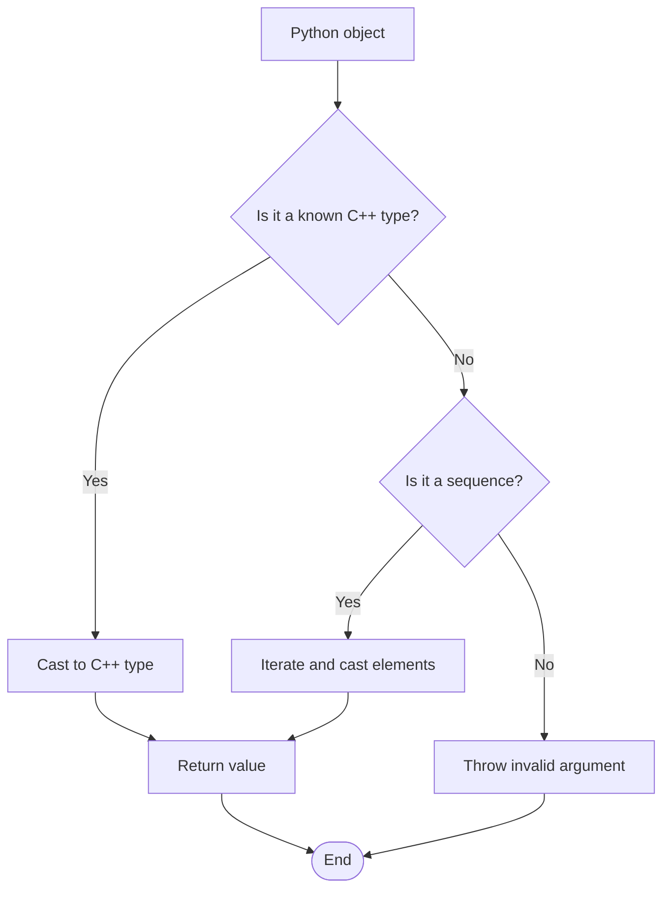
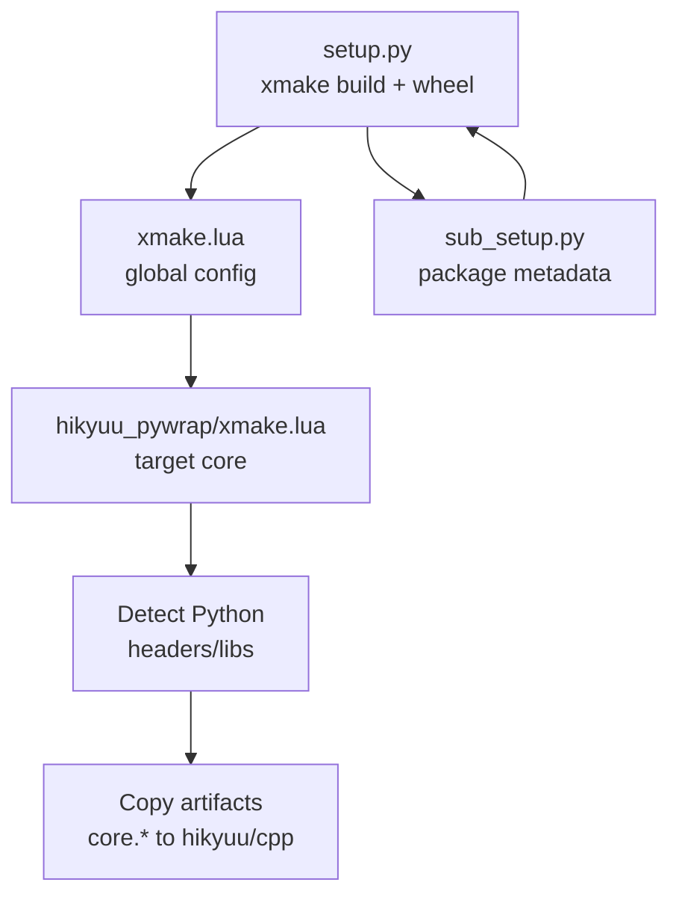
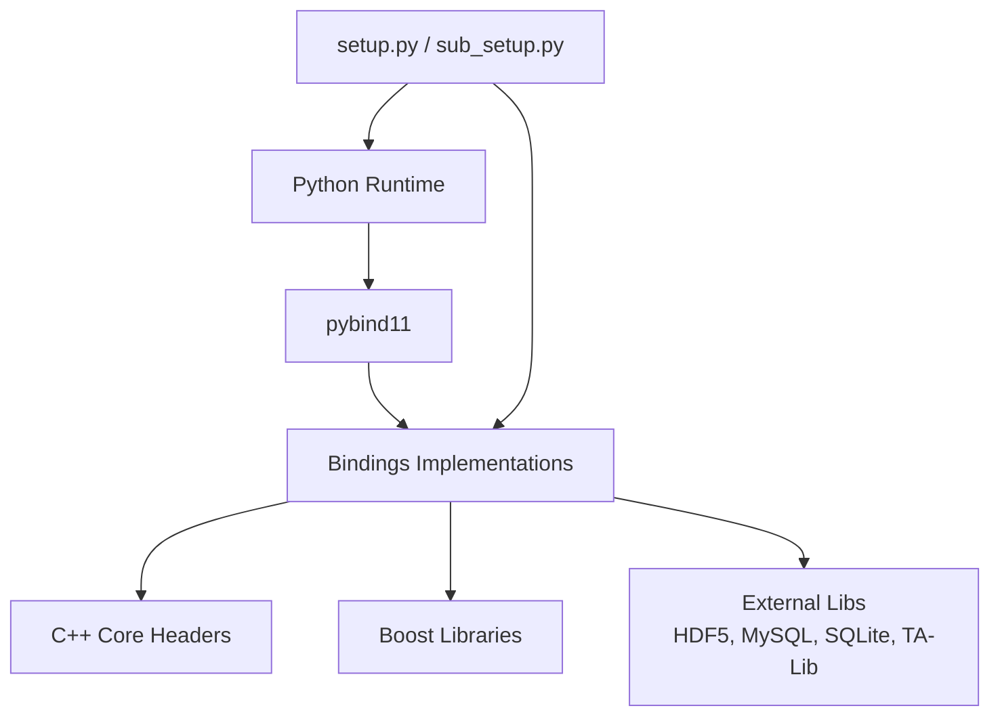

# Integration Architecture

<cite>
**Referenced Files in This Document**
- [setup.py](file://setup.py)
- [sub_setup.py](file://sub_setup.py)
- [xmake.lua](file://xmake.lua)
- [hikyuu_cpp/hikyuu/hikyuu.h](file://hikyuu_cpp/hikyuu/hikyuu.h)
- [hikyuu_cpp/hikyuu/KData.h](file://hikyuu_cpp/hikyuu/KData.h)
- [hikyuu_cpp/hikyuu/Stock.h](file://hikyuu_cpp/hikyuu/Stock.h)
- [hikyuu/__init__.py](file://hikyuu/__init__.py)
- [hikyuu_pywrap/main.cpp](file://hikyuu_pywrap/main.cpp)
- [hikyuu_pywrap/xmake.lua](file://hikyuu_pywrap/xmake.lua)
- [hikyuu_pywrap/_KData.cpp](file://hikyuu_pywrap/_KData.cpp)
- [hikyuu_pywrap/indicator/indicator_main.cpp](file://hikyuu_pywrap/indicator/indicator_main.cpp)
- [hikyuu_pywrap/pybind_utils.h](file://hikyuu_pywrap/pybind_utils.h)
- [hikyuu_pywrap/convert_any.h](file://hikyuu_pywrap/convert_any.h)
- [hikyuu_pywrap/bind_stl.cpp](file://hikyuu_pywrap/bind_stl.cpp)
- [hikyuu_pywrap/pickle_support.h](file://hikyuu_pywrap/pickle_support.h)
- [hikyuu_pywrap/ioredirect.h](file://hikyuu_pywrap/ioredirect.h)
</cite>

## Table of Contents
1. [Introduction](#introduction)
2. [Project Structure](#project-structure)
3. [Core Components](#core-components)
4. [Architecture Overview](#architecture-overview)
5. [Detailed Component Analysis](#detailed-component-analysis)
6. [Dependency Analysis](#dependency-analysis)
7. [Performance Considerations](#performance-considerations)
8. [Troubleshooting Guide](#troubleshooting-guide)
9. [Conclusion](#conclusion)

## Introduction
This document describes the integration architecture between C++ and Python in the Hikyuu framework. It explains how pybind11 is used to expose the high-performance C++ core to Python, enabling a unified developer experience across both languages. The document covers the bindings layer design, memory management strategies across the language boundary, build system integration using xmake and setup.py, data conversion mechanisms for financial time series, and strategies for API consistency and performance.

## Project Structure
The integration spans two primary areas:
- C++ core library and headers under hikyuu_cpp/hikyuu
- Python bindings layer under hikyuu_pywrap, which compiles into a shared library loaded by Python

Key build orchestration files:
- xmake.lua: Top-level build configuration and options
- hikyuu_pywrap/xmake.lua: Target definition for the Python extension core module
- setup.py and sub_setup.py: Python packaging and distribution

**Diagram sources**
- [hikyuu/__init__.py](file://hikyuu/__init__.py#L1-L120)
- [hikyuu_pywrap/main.cpp](file://hikyuu_pywrap/main.cpp#L1-L120)
- [hikyuu_pywrap/xmake.lua](file://hikyuu_pywrap/xmake.lua#L1-L60)
- [xmake.lua](file://xmake.lua#L1-L120)
- [setup.py](file://setup.py#L1-L120)
- [sub_setup.py](file://sub_setup.py#L60-L120)

**Section sources**
- [xmake.lua](file://xmake.lua#L1-L120)
- [hikyuu_pywrap/xmake.lua](file://hikyuu_pywrap/xmake.lua#L1-L60)
- [hikyuu/__init__.py](file://hikyuu/__init__.py#L1-L120)

## Core Components
- Python package initialization sets up environment variables, plugin paths, and IO redirection for interactive sessions and Jupyter.
- The pybind11 module exports core C++ types and functions, including financial data types (Stock, KData, KQuery), utilities, and APIs for loading and querying data.
- Bindings implement conversions between Python and C++ types, including STL containers, datetime, and picklable serialization support.
- Build targets produce a shared library named core with versioned filenames per Python minor version.

Key responsibilities:
- Type exposure: Stock, KData, KQuery, Indicator, and related types are exposed to Python.
- Data conversion: Seamless conversion between Python sequences, lists, and C++ vectors; datetime conversion; numpy/pandas interoperability.
- Memory management: Shared ownership via std::shared_ptr and pybind11’s return value policies; pickling support for persistence.
- Packaging: Wheel building and installation orchestrated by setup.py and sub_setup.py.

**Section sources**
- [hikyuu/__init__.py](file://hikyuu/__init__.py#L1-L120)
- [hikyuu_pywrap/main.cpp](file://hikyuu_pywrap/main.cpp#L1-L120)
- [hikyuu_pywrap/_KData.cpp](file://hikyuu_pywrap/_KData.cpp#L1-L120)
- [hikyuu_pywrap/indicator/indicator_main.cpp](file://hikyuu_pywrap/indicator/indicator_main.cpp#L1-L47)
- [hikyuu_pywrap/pybind_utils.h](file://hikyuu_pywrap/pybind_utils.h#L1-L130)
- [hikyuu_pywrap/convert_any.h](file://hikyuu_pywrap/convert_any.h#L1-L120)
- [hikyuu_pywrap/pickle_support.h](file://hikyuu_pywrap/pickle_support.h#L1-L91)

## Architecture Overview
The integration architecture follows a layered approach:
- Python layer initializes the environment, loads the shared core module, and exposes convenience APIs.
- The core module (compiled from hikyuu_pywrap) binds C++ classes and functions to Python using pybind11.
- C++ core provides financial data models (Stock, KData, KQuery) and computation primitives (Indicator).
- Data exchange uses typed conversions and zero-copy buffers where appropriate (e.g., numpy arrays).

**Diagram sources**
- [hikyuu/__init__.py](file://hikyuu/__init__.py#L1-L120)
- [hikyuu_pywrap/main.cpp](file://hikyuu_pywrap/main.cpp#L1-L120)
- [hikyuu_cpp/hikyuu/hikyuu.h](file://hikyuu_cpp/hikyuu/hikyuu.h#L1-L56)
- [hikyuu_pywrap/ioredirect.h](file://hikyuu_pywrap/ioredirect.h#L1-L54)

## Detailed Component Analysis

### Python Bindings Layer (pybind11)
The bindings layer is defined in hikyuu_pywrap/main.cpp, which creates a versioned module per Python minor version and registers:
- Core types: Stock, KData, KQuery, MarketInfo, StockTypeInfo, StockWeight, Block, Parameter, etc.
- Utilities: Datetime, TimeDelta, logging, and misc helpers
- Data drivers, indicators, strategies, trade management, and plugins
- Global APIs: hikyuu_init, get_version, get_stock, get_kdata overloads, and IO redirection controls

**Diagram sources**
- [hikyuu_pywrap/main.cpp](file://hikyuu_pywrap/main.cpp#L1-L120)

**Section sources**
- [hikyuu_pywrap/main.cpp](file://hikyuu_pywrap/main.cpp#L1-L120)

### Data Types and Conversion
Financial time series data is modeled in C++ with KData representing arrays of KRecord entries. The bindings expose:
- KData slicing, iteration, and property accessors
- Conversion to numpy arrays and pandas DataFrames
- Conversion utilities for datetime and arbitrary sequences

**Diagram sources**
- [hikyuu_pywrap/_KData.cpp](file://hikyuu_pywrap/_KData.cpp#L200-L336)

**Section sources**
- [hikyuu_pywrap/_KData.cpp](file://hikyuu_pywrap/_KData.cpp#L1-L120)
- [hikyuu_pywrap/_KData.cpp](file://hikyuu_pywrap/_KData.cpp#L200-L336)

### Memory Management and Lifetime
- C++ core uses std::shared_ptr internally for resource sharing; pybind11 return value policies are used to control object lifetimes in Python.
- Pickle support is enabled when serialization is available, allowing persistent storage and transport of core objects.
- IO redirection integrates with pybind11 iostream to capture C++ stdout/stderr in interactive environments.

**Diagram sources**
- [hikyuu_pywrap/pickle_support.h](file://hikyuu_pywrap/pickle_support.h#L1-L91)
- [hikyuu_pywrap/_KData.cpp](file://hikyuu_pywrap/_KData.cpp#L320-L336)

**Section sources**
- [hikyuu_pywrap/pickle_support.h](file://hikyuu_pywrap/pickle_support.h#L1-L91)
- [hikyuu_pywrap/ioredirect.h](file://hikyuu_pywrap/ioredirect.h#L1-L54)

### Data Conversion Utilities
- convert_any.h implements a type caster for boost::any, enabling polymorphic conversion between Python objects and C++ types such as Datetime, Stock, Block, KQuery, KData, and sequences.
- pybind_utils.h provides helpers for vector/list conversions, bytes interop, and clone behavior preservation for Python subclasses.

**Diagram sources**
- [hikyuu_pywrap/convert_any.h](file://hikyuu_pywrap/convert_any.h#L1-L120)
- [hikyuu_pywrap/pybind_utils.h](file://hikyuu_pywrap/pybind_utils.h#L1-L130)

**Section sources**
- [hikyuu_pywrap/convert_any.h](file://hikyuu_pywrap/convert_any.h#L1-L120)
- [hikyuu_pywrap/pybind_utils.h](file://hikyuu_pywrap/pybind_utils.h#L1-L130)

### Build System Integration
- xmake.lua configures global options, dependencies, and feature toggles (e.g., HDF5, MySQL, SQLite, TA-Lib, serialization).
- hikyuu_pywrap/xmake.lua defines the core target, links against boost, pybind11, and other libraries, detects Python include/libs, and copies built artifacts to hikyuu/cpp with versioned filenames.
- setup.py orchestrates xmake invocations, manages compile info, wheel building, and installs include headers alongside the package.

**Diagram sources**
- [xmake.lua](file://xmake.lua#L1-L120)
- [hikyuu_pywrap/xmake.lua](file://hikyuu_pywrap/xmake.lua#L60-L174)
- [setup.py](file://setup.py#L1-L120)
- [sub_setup.py](file://sub_setup.py#L60-L120)

**Section sources**
- [xmake.lua](file://xmake.lua#L1-L120)
- [hikyuu_pywrap/xmake.lua](file://hikyuu_pywrap/xmake.lua#L60-L174)
- [setup.py](file://setup.py#L1-L120)
- [sub_setup.py](file://sub_setup.py#L60-L120)

### API Consistency and Developer Experience
- Versioned module naming ensures compatibility across Python minor versions.
- Convenience functions in Python (e.g., load_hikyuu) encapsulate C++ initialization and configuration.
- Interactive and Jupyter-aware IO redirection improves usability in notebooks and REPLs.
- Unified naming and grouping of exported modules (data drivers, indicators, strategies) provides a cohesive API surface.

**Section sources**
- [hikyuu_pywrap/main.cpp](file://hikyuu_pywrap/main.cpp#L50-L120)
- [hikyuu/__init__.py](file://hikyuu/__init__.py#L1-L120)
- [hikyuu_pywrap/ioredirect.h](file://hikyuu_pywrap/ioredirect.h#L1-L54)

## Dependency Analysis
The integration depends on:
- pybind11 for C++/Python interoperability
- Boost (serialization, system, filesystem, etc.) for robustness and cross-platform support
- Third-party libraries (HDF5, MySQL, SQLite, TA-Lib, etc.) controlled by xmake options
- Python packaging and distribution via setuptools and wheel

**Diagram sources**
- [hikyuu_pywrap/xmake.lua](file://hikyuu_pywrap/xmake.lua#L1-L60)
- [xmake.lua](file://xmake.lua#L120-L247)
- [setup.py](file://setup.py#L1-L120)
- [sub_setup.py](file://sub_setup.py#L60-L120)

**Section sources**
- [hikyuu_pywrap/xmake.lua](file://hikyuu_pywrap/xmake.lua#L1-L60)
- [xmake.lua](file://xmake.lua#L120-L247)
- [setup.py](file://setup.py#L1-L120)
- [sub_setup.py](file://sub_setup.py#L60-L120)

## Performance Considerations
- Vector-to-list conversions are bound selectively to avoid unnecessary overhead; only performance-sensitive types are explicitly bound.
- Zero-copy numpy conversion is implemented for KData to minimize memory duplication during DataFrame export.
- Parallel indicator calculation is exposed via batch_calculate_inds to leverage multi-core processing.
- Build-time options enable low-precision mode and selective feature toggles to balance performance and compatibility.

[No sources needed since this section provides general guidance]

## Troubleshooting Guide
Common issues and remedies:
- Python version mismatch: setup.py clears cached builds when Python version changes to prevent ABI mismatches.
- Dynamic library loading: hikyuu/__init__.py adjusts PATH/LD_LIBRARY_PATH to ensure the shared core module and dependencies are discoverable.
- IO visibility in notebooks: ioredirect.h enables capturing C++ stdout/stderr in Jupyter and interactive sessions.
- Serialization availability: pickle_support.h guards pickling behind configuration flags; ensure serialization is enabled if persistence is required.

**Section sources**
- [setup.py](file://setup.py#L70-L120)
- [hikyuu/__init__.py](file://hikyuu/__init__.py#L1-L120)
- [hikyuu_pywrap/ioredirect.h](file://hikyuu_pywrap/ioredirect.h#L1-L54)
- [hikyuu_pywrap/pickle_support.h](file://hikyuu_pywrap/pickle_support.h#L1-L91)

## Conclusion
The Hikyuu integration architecture successfully combines the performance of C++ with the ergonomics of Python through pybind11. The bindings layer exposes a comprehensive financial data model, provides efficient data conversion pathways, and maintains type safety and performance. The build system integrates seamlessly with xmake and setuptools, delivering a consistent developer experience across platforms. Together, these components enable rapid prototyping in Python while leveraging the C++ core for heavy computations and large-scale datasets.