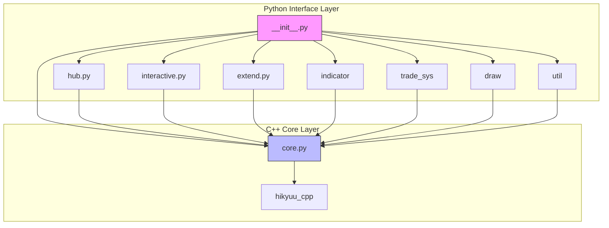
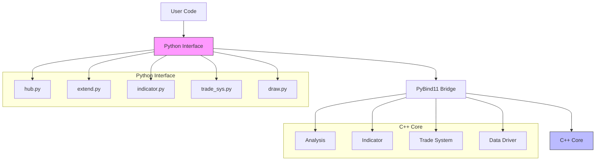
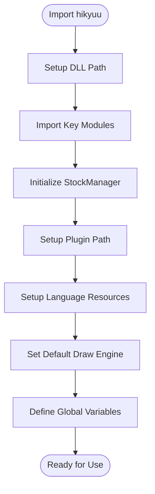
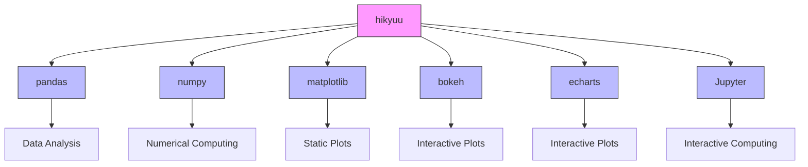
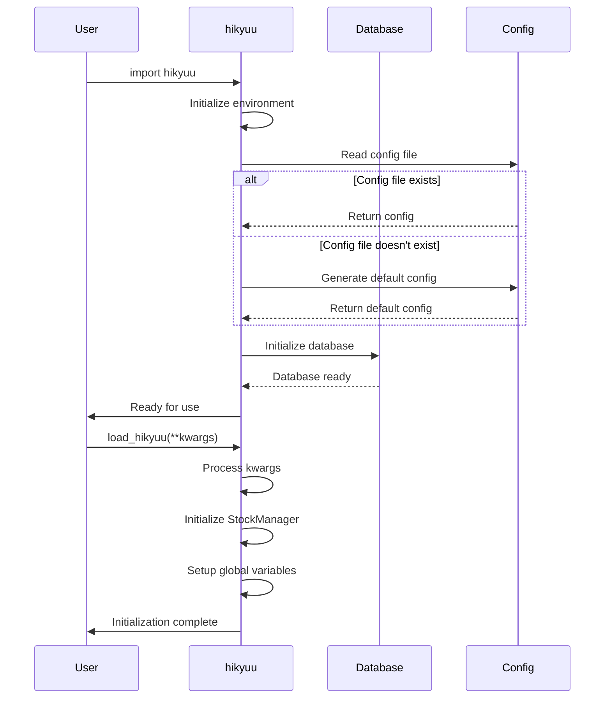
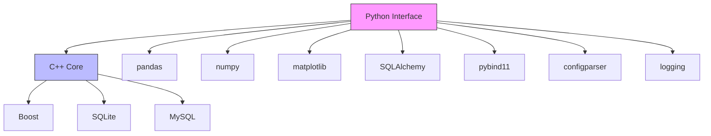
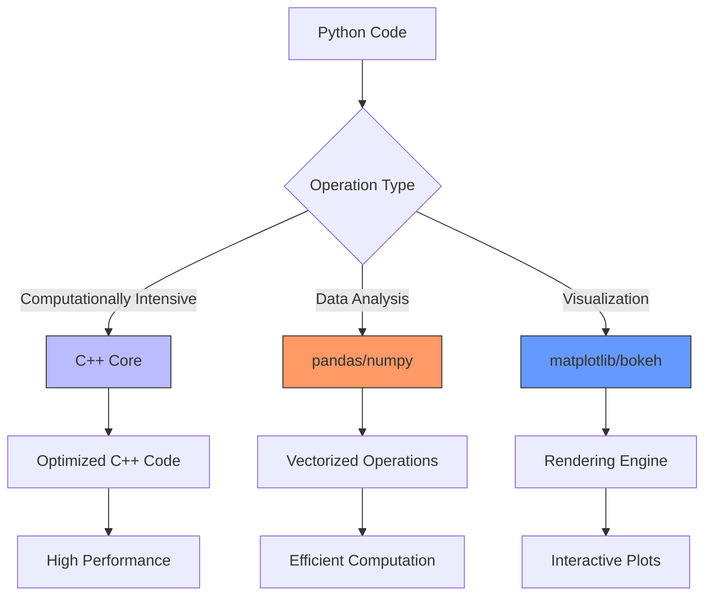

# Python Interface

<cite>
**Referenced Files in This Document**   
- [__init__.py](file://hikyuu/__init__.py)
- [hub.py](file://hikyuu/hub.py)
- [interactive.py](file://hikyuu/interactive.py)
- [core.py](file://hikyuu/core.py)
- [extend.py](file://hikyuu/extend.py)
- [mylog.py](file://hikyuu/util/mylog.py)
- [notebook.py](file://hikyuu/util/notebook.py)
- [indicator.py](file://hikyuu/indicator/indicator.py)
- [trade_sys/__init__.py](file://hikyuu/trade_sys/__init__.py)
- [draw/__init__.py](file://hikyuu/draw/__init__.py)
</cite>

## Table of Contents
1. [Introduction](#introduction)
2. [Project Structure](#project-structure)
3. [Core Components](#core-components)
4. [Architecture Overview](#architecture-overview)
5. [Detailed Component Analysis](#detailed-component-analysis)
6. [Dependency Analysis](#dependency-analysis)
7. [Performance Considerations](#performance-considerations)
8. [Troubleshooting Guide](#troubleshooting-guide)
9. [Conclusion](#conclusion)

## Introduction
The hikyuu framework provides a comprehensive Python interface for quantitative trading research, designed to offer an accessible and user-friendly API that seamlessly integrates with the Python data science ecosystem. This interface enables researchers and developers to leverage powerful functionality for strategy development and analysis while abstracting the complexity of the underlying C++ core. The architecture emphasizes usability, discoverability, and consistency with Python conventions, making it suitable for both interactive exploration and script-based workflows. The interface supports multiple usage patterns including interactive mode, Jupyter notebook integration, and traditional script execution, providing flexibility for different research workflows.

## Project Structure
The hikyuu Python interface is organized in a modular structure that separates concerns and facilitates extensibility. The core package contains several submodules that handle different aspects of quantitative trading research:

- **analysis**: Provides tools for combinatorial analysis of indicators and systems
- **config**: Contains configuration files for market blocks and other settings
- **data**: Handles data drivers and database upgrades for various storage backends
- **draw**: Offers visualization capabilities with support for multiple plotting engines
- **examples**: Includes Jupyter notebooks and scripts demonstrating various features
- **fetcher**: Contains data fetchers for different sources like Sina, QQ, and QMT
- **indicator**: Implements technical indicators and related functionality
- **shell**: Provides command-line interface components
- **strategy**: Contains strategy examples and templates
- **trade_manage**: Handles trade management and order execution
- **trade_sys**: Implements trading systems and related components
- **util**: Contains utility functions and classes
- **hub.py**: Implements the hub pattern for convenient access to commonly used functions
- **interactive.py**: Entry point for interactive sessions

The interface architecture follows a layered approach where the Python layer serves as a user-friendly wrapper around the high-performance C++ core, exposing functionality through a Pythonic API.



**Diagram sources**
- [__init__.py](file://hikyuu/__init__.py)
- [core.py](file://hikyuu/core.py)
- [hub.py](file://hikyuu/hub.py)

**Section sources**
- [__init__.py](file://hikyuu/__init__.py)
- [hub.py](file://hikyuu/hub.py)

## Core Components
The Python interface of hikyuu consists of several core components that work together to provide a comprehensive quantitative trading research environment. The main entry point is the `__init__.py` file, which sets up the environment, loads necessary modules, and initializes global variables. The interface provides convenient access to commonly used functions through the hub pattern implemented in `hub.py`, which acts as a central registry for strategies, indicators, and other components.

Key components include:
- Global variable initialization for commonly used stock blocks
- Integration with Jupyter notebooks through output redirection
- Support for multiple drawing engines (matplotlib, bokeh, echarts)
- Error handling and logging mechanisms
- Serialization functions for saving and loading objects
- Real-time data update capabilities

The interface also provides utility functions for selecting stocks based on conditions and exporting indicator values to pandas DataFrames, facilitating integration with the broader Python data science ecosystem.

**Section sources**
- [__init__.py](file://hikyuu/__init__.py#L1-L595)
- [hub.py](file://hikyuu/hub.py#L1-L772)
- [interactive.py](file://hikyuu/interactive.py#L1-L69)

## Architecture Overview
The Python interface architecture follows a layered design pattern where the Python layer provides a user-friendly API that abstracts the complexity of the underlying C++ core. The interface is designed to be discoverable and consistent with Python conventions, making it accessible to users with varying levels of programming expertise.

The architecture can be understood as having three main layers:
1. **Presentation Layer**: The Python interface that users interact with directly
2. **Integration Layer**: The bridge between Python and C++ that handles data conversion and function calls
3. **Core Layer**: The high-performance C++ implementation of algorithms and data structures

The interface exposes the functionality of the C++ core through Python classes and functions that follow Python naming conventions and idioms. This includes supporting Python's data model protocols (such as `__hash__` and `__add__`) for key classes, enabling natural integration with Python code.



**Diagram sources**
- [__init__.py](file://hikyuu/__init__.py)
- [core.py](file://hikyuu/core.py)
- [extend.py](file://hikyuu/extend.py)

## Detailed Component Analysis

### Python Interface Layer
The Python interface layer is responsible for providing a user-friendly API that follows Python conventions and integrates well with the Python data science ecosystem. This layer handles tasks such as:

- Module initialization and global variable setup
- Error handling and exception translation
- Logging and debugging support
- Integration with Jupyter notebooks
- Support for interactive sessions

The interface is designed to be discoverable, with functions and classes named using Python conventions (lowercase with underscores). It also provides convenience functions that simplify common tasks, such as the `select` and `select2` functions for filtering stocks based on conditions.

#### Module Initialization and Global Variables
The `__init__.py` file performs several important initialization tasks when the package is imported:

1. Sets up the dynamic library path for the C++ components
2. Imports key modules and exposes them at the package level
3. Initializes the StockManager instance
4. Sets up plugin paths and language resources
5. Configures the default drawing engine
6. Defines global variables for commonly used stock blocks

This initialization ensures that the interface is ready to use immediately after import, without requiring additional setup steps.



**Diagram sources**
- [__init__.py](file://hikyuu/__init__.py#L35-L148)

**Section sources**
- [__init__.py](file://hikyuu/__init__.py#L1-L595)

### Hub Pattern Implementation
The hub pattern implemented in `hub.py` provides a central registry for strategies, indicators, and other components, making them easily discoverable and accessible. This pattern follows the principle of convention over configuration, allowing users to organize their code in a standard directory structure while providing flexibility for custom organization.

The hub system supports both local and remote repositories, enabling sharing and collaboration. Remote repositories are stored in a local cache and can be updated as needed. The system uses a SQLite database to store metadata about available components, including their names, authors, versions, and documentation.

Key features of the hub system include:
- Support for local and remote repositories
- Automatic discovery of components in standard directory structures
- Metadata storage in SQLite database
- Version tracking and update capabilities
- Search functionality for finding components

```mermaid
classDiagram
class HubManager {
+logger : Logger
+_session : Session
+_scoped_Session : scoped_session
+remote_cache_dir : str
+setup_hub()
+add_remote_hub(name, url, branch)
+add_local_hub(name, path)
+update_hub(name)
+remove_hub(name)
+get_part(name, **kwargs)
+get_part_info(name)
+get_hub_path(name)
+get_hub_name_list()
+get_part_name_list(hub, part_type)
+search_part(name, hub, part_type, label)
}
class HubModel {
+id : int
+name : str
+hub_type : str
+local_base : str
+local : str
+url : str
+branch : str
}
class PartModel {
+id : int
+hub_name : str
+part : str
+name : str
+author : str
+version : str
+doc : str
+module_name : str
+label : str
}
class ConfigModel {
+id : int
+key : str
+value : str
}
HubManager --> HubModel : "manages"
HubManager --> PartModel : "manages"
HubManager --> ConfigModel : "uses"
HubManager --> "sqlite : ///hub.db" : "stores data in"
```

**Diagram sources**
- [hub.py](file://hikyuu/hub.py#L36-L772)

**Section sources**
- [hub.py](file://hikyuu/hub.py#L1-L772)

### Integration with Python Ecosystem
The Python interface is designed to integrate seamlessly with the Python data science ecosystem, particularly with pandas, numpy, and visualization libraries. This integration is achieved through several mechanisms:

1. **Data Conversion**: Classes like `DatetimeList`, `KRecordList`, and `Indicator` provide methods to convert to numpy arrays and pandas DataFrames, enabling easy integration with data analysis workflows.

2. **Visualization Support**: The `draw` module supports multiple plotting engines (matplotlib, bokeh, echarts) and provides a consistent API for creating financial charts.

3. **Interactive Environment Support**: Special handling for Jupyter notebooks ensures that C++ stdout/stderr output is properly redirected to the notebook interface.

4. **Data Science Integration**: Functions like `select2` return pandas DataFrames, making it easy to incorporate hikyuu data into broader data analysis pipelines.

The interface also provides utility functions that follow pandas conventions, such as `to_numpy()` and `to_pandas()` methods on key classes, making the API familiar to users of the Python data science ecosystem.



**Diagram sources**
- [extend.py](file://hikyuu/extend.py#L216-L253)
- [indicator/indicator.py](file://hikyuu/indicator/indicator.py#L32-L36)
- [trade_sys/__init__.py](file://hikyuu/trade_sys/__init__.py#L33-L42)
- [draw/__init__.py](file://hikyuu/draw/__init__.py#L32-L44)

**Section sources**
- [extend.py](file://hikyuu/extend.py#L1-L283)
- [indicator/indicator.py](file://hikyuu/indicator/indicator.py#L1-L120)
- [trade_sys/__init__.py](file://hikyuu/trade_sys/__init__.py#L1-L43)
- [draw/__init__.py](file://hikyuu/draw/__init__.py#L1-L66)

### Entry Points and Usage Patterns
The hikyuu framework supports multiple entry points and usage patterns to accommodate different research workflows:

1. **Interactive Mode**: The `interactive.py` script provides a ready-to-use environment with pre-loaded data and global variables, ideal for exploratory analysis.

2. **Jupyter Notebook Integration**: Special handling ensures that C++ output is properly redirected to notebook cells, and the interface works seamlessly within the notebook environment.

3. **Script-Based Usage**: The standard Python import mechanism allows the framework to be used in traditional scripts for automated analysis and backtesting.

4. **Command-Line Interface**: The shell module provides command-line tools for managing the framework and running analyses.

The `load_hikyuu()` function is the primary entry point for initializing the framework, allowing users to customize which data is loaded and how it is configured. This function handles configuration file management, database initialization, and data loading according to user-specified parameters.



**Diagram sources**
- [__init__.py](file://hikyuu/__init__.py#L219-L421)
- [interactive.py](file://hikyuu/interactive.py#L28-L69)
- [util/notebook.py](file://hikyuu/util/notebook.py#L9-L48)

**Section sources**
- [__init__.py](file://hikyuu/__init__.py#L219-L421)
- [interactive.py](file://hikyuu/interactive.py#L1-L69)
- [util/notebook.py](file://hikyuu/util/notebook.py#L1-L48)

## Dependency Analysis
The Python interface has a well-defined dependency structure that separates the interface layer from the implementation details. The main dependencies are:

1. **C++ Core**: The Python interface depends on the C++ core for high-performance computations and data storage. This dependency is managed through pybind11, which provides seamless integration between Python and C++.

2. **Data Science Libraries**: The interface integrates with pandas, numpy, and matplotlib for data analysis and visualization.

3. **Database Libraries**: SQLAlchemy is used for the hub system's SQLite database, while other database drivers are used for market data storage.

4. **Utility Libraries**: Various utility libraries are used for tasks like configuration parsing, logging, and file operations.

The dependency graph shows a clear separation between the interface layer (Python) and the implementation layer (C++), with the interface depending on the implementation but not vice versa. This separation allows the interface to evolve independently of the core implementation, as long as the API remains stable.



**Diagram sources**
- [__init__.py](file://hikyuu/__init__.py)
- [core.py](file://hikyuu/core.py)
- [hub.py](file://hikyuu/hub.py)
- [extend.py](file://hikyuu/extend.py)

**Section sources**
- [__init__.py](file://hikyuu/__init__.py)
- [core.py](file://hikyuu/core.py)
- [hub.py](file://hikyuu/hub.py)
- [extend.py](file://hikyuu/extend.py)

## Performance Considerations
The hikyuu framework is designed with performance in mind, leveraging the high-performance C++ core for computationally intensive tasks while providing a Python interface for ease of use. This hybrid approach allows researchers to benefit from Python's productivity while maintaining the performance needed for quantitative trading research.

Key performance considerations include:

1. **C++ Core**: Computationally intensive operations are implemented in C++ for maximum performance, with Python serving as a thin wrapper.

2. **Memory Management**: The interface uses efficient data structures and memory management techniques to minimize overhead.

3. **Caching**: Frequently accessed data is cached to reduce computation time.

4. **Parallel Processing**: The framework supports parallel processing for tasks that can be distributed across multiple cores.

5. **Lazy Loading**: Data is loaded on-demand to minimize memory usage and startup time.

The interface also provides tools for profiling and benchmarking code, such as the `spend_time` and `hku_benchmark` decorators in the `mylog.py` module, which help users identify performance bottlenecks in their research code.



**Diagram sources**
- [core.py](file://hikyuu/core.py)
- [extend.py](file://hikyuu/extend.py)
- [util/mylog.py](file://hikyuu/util/mylog.py)

**Section sources**
- [core.py](file://hikyuu/core.py)
- [extend.py](file://hikyuu/extend.py)
- [util/mylog.py](file://hikyuu/util/mylog.py)

## Troubleshooting Guide
When working with the hikyuu Python interface, several common issues may arise. This section provides guidance on identifying and resolving these issues.

### Common Issues and Solutions

1. **Import Errors**
   - **Symptom**: ImportError when importing hikyuu
   - **Cause**: Missing dependencies or incorrect Python version
   - **Solution**: Check that all dependencies are installed and that you're using a supported Python version

2. **C++ Output Not Displaying in Jupyter**
   - **Symptom**: C++ print statements don't appear in Jupyter notebook cells
   - **Cause**: Output redirection not properly set up
   - **Solution**: Ensure that `in_ipython_frontend()` returns True and that `iodog.open()` has been called

3. **Missing Data**
   - **Symptom**: Empty KData objects or missing stock information
   - **Cause**: Data not properly loaded or configured
   - **Solution**: Run `load_hikyuu()` and verify that the configuration file points to the correct data directory

4. **Performance Issues**
   - **Symptom**: Slow execution of indicator calculations or backtests
   - **Cause**: Large datasets or inefficient code
   - **Solution**: Use the profiling tools in `mylog.py` to identify bottlenecks and optimize code

5. **Hub System Issues**
   - **Symptom**: Unable to find or load hub components
   - **Cause**: Incorrect repository setup or network issues
   - **Solution**: Verify repository URLs and check network connectivity

### Debugging Tools
The framework provides several tools to help with debugging and troubleshooting:

- **Logging**: Comprehensive logging through the `hku_debug`, `hku_info`, `hku_warn`, `hku_error`, and `hku_fatal` functions
- **Profiling**: Decorators like `spend_time` and `hku_benchmark` for measuring execution time
- **Interactive Inspection**: The ability to inspect objects and their properties in an interactive environment

**Section sources**
- [__init__.py](file://hikyuu/__init__.py#L53-L71)
- [util/mylog.py](file://hikyuu/util/mylog.py#L113-L235)
- [util/notebook.py](file://hikyuu/util/notebook.py#L9-L48)

## Conclusion
The Python interface of the hikyuu framework provides a powerful and user-friendly environment for quantitative trading research. By combining a high-performance C++ core with a Python interface that follows Python conventions and integrates well with the Python data science ecosystem, the framework offers the best of both worlds: performance and productivity.

Key strengths of the interface include:
- **Usability**: The interface is designed to be discoverable and intuitive, with clear function and variable names.
- **Integration**: Seamless integration with pandas, numpy, and visualization libraries enables comprehensive data analysis workflows.
- **Flexibility**: Support for multiple usage patterns (interactive, notebook, script-based) accommodates different research styles.
- **Extensibility**: The hub pattern and plugin system allow for easy extension and sharing of components.

The architecture successfully abstracts the complexity of the underlying C++ core while exposing powerful functionality for strategy development and analysis. This makes hikyuu an excellent choice for quantitative researchers who need both performance and ease of use in their trading research workflows.