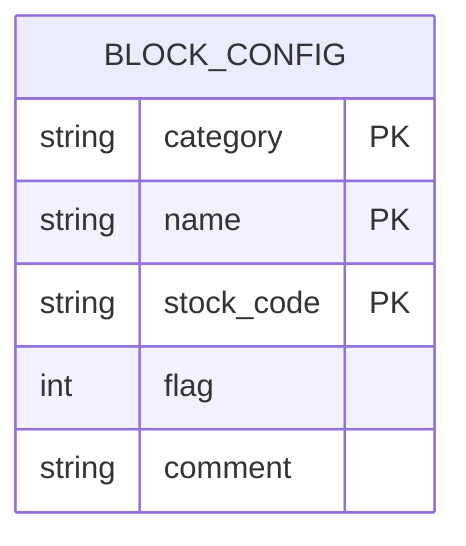
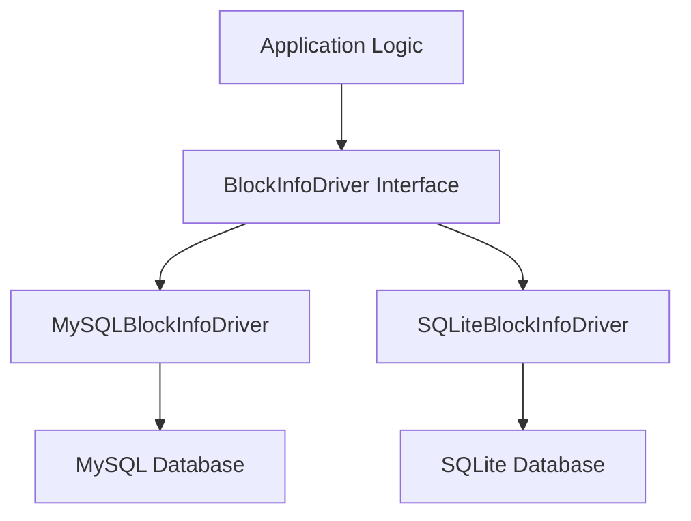
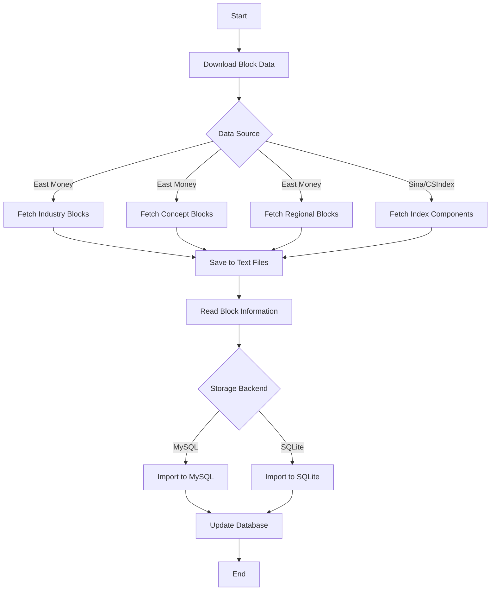

# Block Management

<cite>
**Referenced Files in This Document**   
- [download_block.py](file://hikyuu/data/download_block.py)
- [em_block_to_mysql.py](file://hikyuu/data/em_block_to_mysql.py)
- [em_block_to_sqlite.py](file://hikyuu/data/em_block_to_sqlite.py)
- [hybk.ini](file://hikyuu/config/block/hybk.ini)
- [gnbk.ini](file://hikyuu/config/block/gnbk.ini)
- [self.ini](file://hikyuu/config/block/self.ini)
- [createdb.sql](file://hikyuu/data/mysql_upgrade/createdb.sql)
- [createdb.sql](file://hikyuu/data/sqlite_upgrade/createdb.sql)
- [Block.h](file://hikyuu_cpp/hikyuu/Block.h)
- [Block.cpp](file://hikyuu_cpp/hikyuu/Block.cpp)
- [MySQLBlockInfoDriver.cpp](file://hikyuu_cpp/hikyuu/data_driver/block_info/mysql/MySQLBlockInfoDriver.cpp)
- [SQLiteBlockInfoDriver.cpp](file://hikyuu_cpp/hikyuu/data_driver/block_info/sqlite/SQLiteBlockInfoDriver.cpp)
</cite>

## Table of Contents
1. [Introduction](#introduction)
2. [Block Data Model](#block-data-model)
3. [INI Configuration Files](#ini-configuration-files)
4. [Data Storage Backends](#data-storage-backends)
5. [Block Management Workflow](#block-management-workflow)
6. [Implementation Examples](#implementation-examples)
7. [Relationship with Strategy Development](#relationship-with-strategy-development)
8. [Common Issues and Performance Considerations](#common-issues-and-performance-considerations)
9. [Custom Block Types and External Integration](#custom-block-types-and-external-integration)
10. [Conclusion](#conclusion)

## Introduction
Block management in Hikyuu provides a systematic approach to grouping stocks into logical categories for enhanced analysis and strategy development. The system supports multiple classification types including industries (hybk.ini), concepts (gnbk.ini), and custom blocks (self.ini), enabling users to organize securities based on various criteria. This documentation details the implementation of block management, covering the data model, storage mechanisms, configuration options, and integration with analytical workflows. The block system serves as a foundation for advanced investment strategies such as sector rotation and relative strength analysis, providing a structured framework for organizing and analyzing market segments.

## Block Data Model
The block data model in Hikyuu is designed to represent logical groupings of securities with a flexible structure that supports various classification schemes. At its core, a block consists of a category, name, and collection of securities identified by their market codes. The model also supports an optional index code that can be associated with each block, typically representing a benchmark index for that particular group.

The implementation is based on the Block class defined in the C++ core, which provides methods for adding, removing, and querying securities within a block. Each block maintains a dictionary of securities (m_stockDict) that allows for efficient lookups and membership testing. The block structure supports iteration through its securities and provides methods to retrieve the complete list of stocks within a block.

Blocks are organized hierarchically by category and name, allowing for a two-level classification system. This structure enables users to create multiple blocks within the same category (e.g., different industry sectors) while maintaining clear separation between different classification schemes. The data model also includes functionality for calculating a strong hash of the block content, which can be used for versioning and change detection.

**Section sources**
- [Block.h](file://hikyuu_cpp/hikyuu/Block.h#L1-L194)
- [Block.cpp](file://hikyuu_cpp/hikyuu/Block.cpp#L1-L195)

## INI Configuration Files
Hikyuu utilizes INI configuration files to define and manage block definitions, with separate files for different classification types. The primary configuration files include hybk.ini for industry blocks, gnbk.ini for concept blocks, and self.ini for custom user-defined blocks. Each file follows a consistent format where blocks are defined as sections with stock codes listed as entries.

The file format uses a simple key-value structure where each line within a block section contains a flag (0 or 1) followed by a stock code, separated by a comma. The flag typically indicates whether the stock is active or should be included in the block. Block names are defined as section headers enclosed in square brackets, such as [光学光电子] for the Optoelectronics industry or [MicroLED] for the MicroLED concept.

The self.ini file allows users to create personalized blocks by manually editing the configuration file. This file demonstrates the format with entries like "1, 000728 ;国元证券" where the first number is the flag, followed by the stock code and an optional comment after a semicolon. This flexible format enables users to organize stocks according to their specific investment strategies or research interests.

The configuration files are stored in the hikyuu/config/block directory and are designed to be human-readable and easily editable. This approach allows both automated systems and manual intervention to maintain block definitions, providing flexibility in how blocks are curated and updated over time.

**Diagram sources**
- [hybk.ini](file://hikyuu/config/block/hybk.ini#L1-L800)
- [gnbk.ini](file://hikyuu/config/block/gnbk.ini#L1-L800)
- [self.ini](file://hikyuu/config/block/self.ini#L1-L10)

**Section sources**
- [hybk.ini](file://hikyuu/config/block/hybk.ini#L1-L800)
- [gnbk.ini](file://hikyuu/config/block/gnbk.ini#L1-L800)
- [self.ini](file://hikyuu/config/block/self.ini#L1-L10)

## Data Storage Backends
Hikyuu supports multiple data storage backends for block information, including MySQL and SQLite, providing flexibility in deployment scenarios and performance requirements. The system is designed with a driver-based architecture that abstracts the underlying storage mechanism, allowing seamless switching between different database systems.

For MySQL storage, block information is stored in the hku_base schema with two primary tables: block and BlockIndex. The block table contains the core block membership data with columns for category, name, and market_code, while the BlockIndex table stores the optional index codes associated with each block. This schema design enables efficient querying of block memberships and relationships.

The SQLite backend uses a similar schema structure but with SQLite-specific syntax and constraints. The createdb.sql file in the sqlite_upgrade directory defines the table structure with appropriate data types and indexes to optimize query performance. Both backends implement the same logical structure, ensuring consistency in how block data is accessed regardless of the storage system.

The data driver implementation provides a unified interface for loading, saving, and querying block information. The MySQLBlockInfoDriver and SQLiteBlockInfoDriver classes handle the specific database operations while maintaining a consistent API. This abstraction allows the core application logic to remain database-agnostic, focusing on the business logic of block management rather than database-specific details.

**Diagram sources**
- [createdb.sql](file://hikyuu/data/mysql_upgrade/createdb.sql#L1-L265)
- [createdb.sql](file://hikyuu/data/sqlite_upgrade/createdb.sql#L1-L62)
- [MySQLBlockInfoDriver.cpp](file://hikyuu_cpp/hikyuu/data_driver/block_info/mysql/MySQLBlockInfoDriver.cpp#L1-L179)
- [SQLiteBlockInfoDriver.cpp](file://hikyuu_cpp/hikyuu/data_driver/block_info/sqlite/SQLiteBlockInfoDriver.cpp#L1-L174)

**Section sources**
- [createdb.sql](file://hikyuu/data/mysql_upgrade/createdb.sql#L1-L265)
- [createdb.sql](file://hikyuu/data/sqlite_upgrade/createdb.sql#L1-L62)

## Block Management Workflow
The block management workflow in Hikyuu follows a systematic process that begins with data acquisition and ends with database persistence. The workflow is orchestrated through a series of Python scripts that handle different aspects of block management, starting with the download_block.py script responsible for retrieving block data from external sources.

The process begins with downloading block information from East Money (Dongfangcaifu) and other financial data providers. The download_block.py script contains functions like down_em_all_hybk_info() and down_em_all_gnbk_info() that fetch industry and concept block data respectively. These functions retrieve the latest block compositions and save them as text files in a structured directory hierarchy based on block category.

Once the raw block data is downloaded, the em_block_to_mysql.py and em_block_to_sqlite.py scripts handle the import process. These scripts first call download_block_info() to ensure the latest data is available, then read the block information using read_block_from_path(). The import process involves deleting existing records for the affected categories and inserting the new block data into the database.

The workflow includes several important features for data integrity and efficiency. The is_file_can_download() function implements a time-based caching mechanism that prevents unnecessary downloads by checking the file modification time against configurable thresholds. This ensures that block data is refreshed at appropriate intervals without overwhelming the data source with frequent requests.

**Diagram sources**
- [download_block.py](file://hikyuu/data/download_block.py#L1-L352)
- [em_block_to_mysql.py](file://hikyuu/data/em_block_to_mysql.py#L1-L72)
- [em_block_to_sqlite.py](file://hikyuu/data/em_block_to_sqlite.py#L1-L71)

**Section sources**
- [download_block.py](file://hikyuu/data/download_block.py#L1-L352)
- [em_block_to_mysql.py](file://hikyuu/data/em_block_to_mysql.py#L1-L72)
- [em_block_to_sqlite.py](file://hikyuu/data/em_block_to_sqlite.py#L1-L71)

## Implementation Examples
The implementation of block management in Hikyuu can be demonstrated through concrete examples of the key scripts and their usage patterns. The download_block.py script provides the foundation for block data acquisition, with functions designed to retrieve specific types of block information from external sources.

For example, the down_em_all_hybk_info() function systematically downloads all industry block information from East Money. It creates a directory structure for industry blocks and iterates through the available industry categories, fetching the constituent stocks for each industry. The function includes error handling for connection issues and implements random delays between requests to avoid being blocked by the data provider.

The em_block_to_mysql.py script demonstrates the database import process. When executed, it first calls download_block_info() to ensure the latest block data is available, then reads the block information from the downloaded files using read_block_from_path(). The import function connects to the MySQL database, deletes existing records for the affected categories, and inserts the new block data using executemany() for efficiency.

A practical example of using these scripts would involve updating the block database with the latest industry and concept information. This could be accomplished by running the em_import_block_to_mysql() function with a valid database connection. The script handles the entire process from data acquisition to database persistence, providing feedback on the number of records inserted.

The self.ini file provides an example of manual block creation, where users can define their own custom blocks by editing the configuration file directly. This approach allows for personalized groupings of stocks based on specific investment themes or research interests that may not be covered by the standard industry or concept classifications.

**Section sources**
- [download_block.py](file://hikyuu/data/download_block.py#L1-L352)
- [em_block_to_mysql.py](file://hikyuu/data/em_block_to_mysql.py#L1-L72)
- [self.ini](file://hikyuu/config/block/self.ini#L1-L10)

## Relationship with Strategy Development
Block management plays a crucial role in strategy development within Hikyuu, particularly for approaches such as sector rotation and relative strength analysis. By organizing stocks into logical groups, the block system enables strategies to analyze performance at the sector or concept level, identifying trends and opportunities that might be obscured in individual stock analysis.

For sector rotation strategies, blocks provide the foundation for comparing the relative performance of different industry sectors. Traders can use block data to identify which sectors are outperforming the market and allocate capital accordingly. The system's support for multiple block types allows for sophisticated rotation strategies that consider not only traditional industry sectors but also emerging concepts and thematic investments.

Relative strength analysis benefits from the block structure by enabling comparisons between stocks within the same category. This approach helps identify leaders within specific sectors or concepts, which can be valuable for momentum-based strategies. The ability to quickly query all stocks within a particular block makes it efficient to calculate relative strength metrics across large groups of securities.

The block system also facilitates portfolio construction by allowing strategies to implement sector diversification rules. For example, a strategy might limit exposure to any single industry block or ensure balanced representation across different concept groups. This risk management approach helps prevent over-concentration in particular market segments.

Furthermore, the integration of block data with technical indicators enables advanced analytical techniques. For instance, a strategy might combine relative strength calculations with moving average crossovers, using block membership to filter potential candidates. This multi-dimensional approach leverages both the organizational benefits of blocks and the analytical power of technical indicators.

**Section sources**
- [download_block.py](file://hikyuu/data/download_block.py#L1-L352)
- [Block.h](file://hikyuu_cpp/hikyuu/Block.h#L1-L194)

## Common Issues and Performance Considerations
Block management in Hikyuu presents several common issues and performance considerations that users should be aware of when working with large block sets. One primary challenge is handling dynamic block membership, as companies may change industries or new concepts may emerge, requiring regular updates to block definitions.

Performance considerations become significant when querying large block sets, particularly when performing operations across multiple blocks simultaneously. The current implementation loads all block data into memory when initializing the block driver, which can lead to high memory usage for extensive block collections. This design choice optimizes query performance at the expense of memory efficiency.

Another issue is the potential for overlapping blocks, where a stock may belong to multiple categories simultaneously. While this reflects real-world market conditions (e.g., a technology company participating in both semiconductor and artificial intelligence trends), it can complicate analysis and require careful handling in strategies that assume exclusive block membership.

The system's reliance on external data sources introduces dependency risks, as changes to the data provider's API or website structure can break the download functionality. The current implementation includes basic error handling for connection issues but may require manual intervention when structural changes occur.

For performance optimization, the system implements several strategies. The time-based caching mechanism in is_file_can_download() reduces unnecessary network requests, while the batch operations in the import scripts minimize database round-trips. However, users working with very large block sets may need to consider additional optimization techniques, such as implementing incremental updates rather than full refreshes.

**Section sources**
- [download_block.py](file://hikyuu/data/download_block.py#L1-L352)
- [em_block_to_mysql.py](file://hikyuu/data/em_block_to_mysql.py#L1-L72)
- [Block.h](file://hikyuu_cpp/hikyuu/Block.h#L1-L194)

## Custom Block Types and External Integration
Hikyuu provides mechanisms for creating custom block types and integrating external classification systems, extending the functionality beyond the predefined industry and concept blocks. The self.ini file serves as the primary interface for user-defined blocks, allowing manual creation and modification of custom groupings.

The system's modular design enables the addition of new block types through configuration files and corresponding import scripts. Users can create new INI files following the same format as the existing block configuration files, then develop custom import functions to populate these blocks from external sources. This approach allows for integration with specialized classification systems, such as ESG ratings, market capitalization tiers, or proprietary research categories.

External integration is facilitated by the flexible data model and the script-based import system. Users can develop custom fetchers that retrieve block data from alternative sources, such as financial data APIs, research reports, or internal databases. These fetchers can then format the data according to the expected structure and use the existing import infrastructure to persist the information in the chosen backend.

The block system's support for index codes provides a mechanism for linking custom blocks to benchmark indices, enabling performance comparison and relative strength analysis. This feature is particularly valuable when integrating external classification systems that have established benchmark indices.

For advanced use cases, the C++ core's Block class can be extended or utilized directly in custom modules, allowing for programmatic creation and manipulation of blocks. This capability enables sophisticated workflows where blocks are generated dynamically based on complex criteria or machine learning algorithms.

**Section sources**
- [self.ini](file://hikyuu/config/block/self.ini#L1-L10)
- [download_block.py](file://hikyuu/data/download_block.py#L1-L352)
- [Block.h](file://hikyuu_cpp/hikyuu/Block.h#L1-L194)

## Conclusion
The block management system in Hikyuu provides a comprehensive framework for organizing and analyzing stocks through logical categorization. By supporting multiple classification types including industries, concepts, and custom blocks, the system enables sophisticated investment strategies such as sector rotation and relative strength analysis. The implementation combines a flexible data model with robust storage backends (MySQL and SQLite) and a well-defined workflow for data acquisition and persistence.

Key strengths of the system include its modular architecture, support for both automated and manual block creation, and integration with the broader analytical capabilities of Hikyuu. The use of INI configuration files provides a user-friendly interface for block definition, while the script-based import system ensures reliable data synchronization from external sources.

For optimal results, users should consider the performance implications of working with large block sets and implement appropriate caching and optimization strategies. The system's extensibility allows for integration with external classification systems and the creation of custom block types, making it adaptable to various investment approaches and research methodologies.

Overall, the block management system serves as a foundational component for advanced analysis in Hikyuu, providing the organizational structure necessary for systematic investment strategies and comprehensive market analysis.