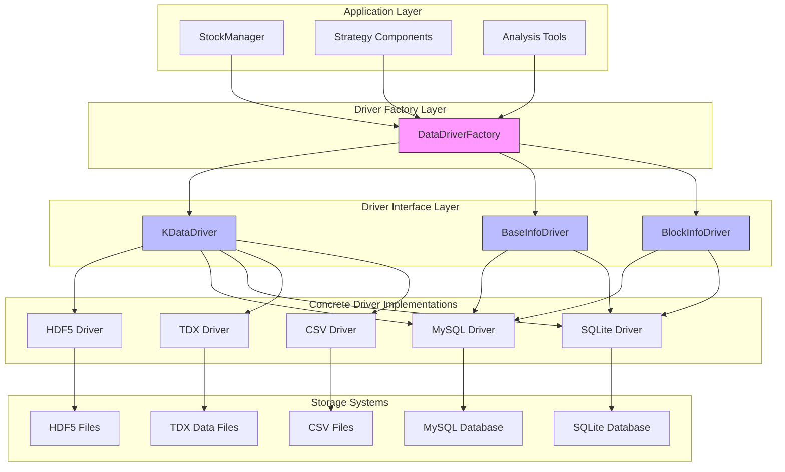
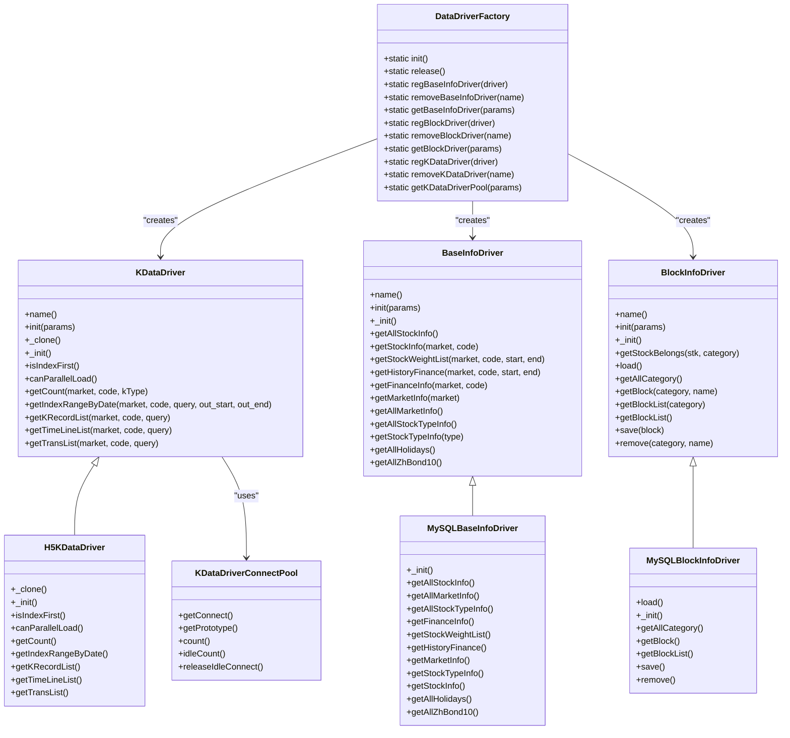
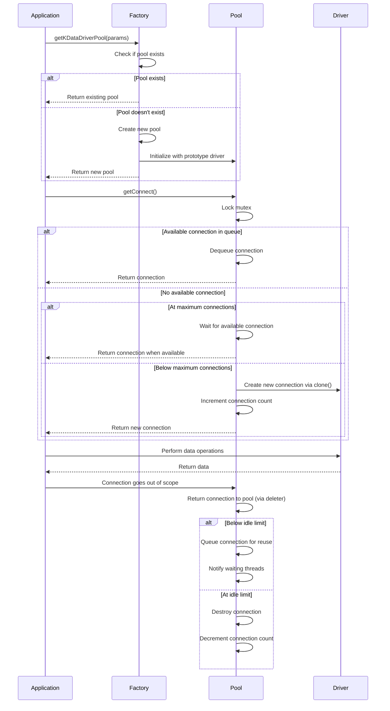
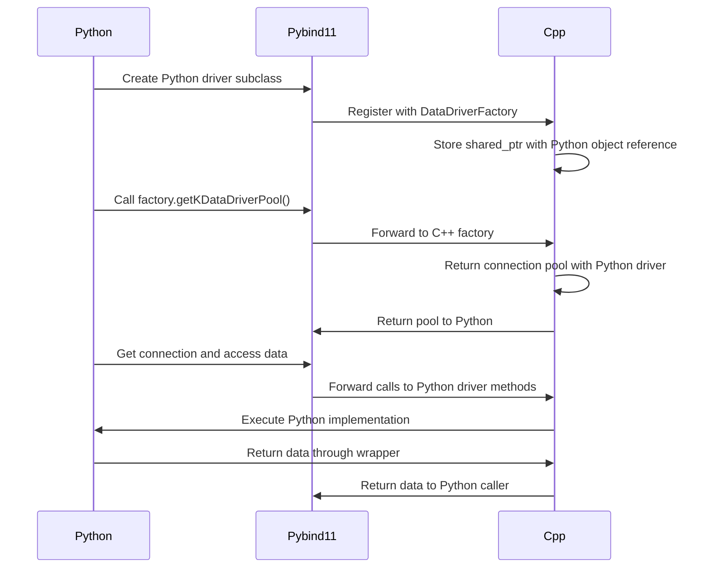

# Data Driver Architecture

<cite>
**Referenced Files in This Document**   
- [DataDriverFactory.h](file://hikyuu_cpp/hikyuu/data_driver/DataDriverFactory.h)
- [DataDriverFactory.cpp](file://hikyuu_cpp/hikyuu/data_driver/DataDriverFactory.cpp)
- [KDataDriver.h](file://hikyuu_cpp/hikyuu/data_driver/KDataDriver.h)
- [KDataDriver.cpp](file://hikyuu_cpp/hikyuu/data_driver/KDataDriver.cpp)
- [BaseInfoDriver.h](file://hikyuu_cpp/hikyuu/data_driver/BaseInfoDriver.h)
- [BlockInfoDriver.h](file://hikyuu_cpp/hikyuu/data_driver/BlockInfoDriver.h)
- [DriverConnectPool.h](file://hikyuu_cpp/hikyuu/data_driver/DriverConnectPool.h)
- [MySQLBaseInfoDriver.h](file://hikyuu_cpp/hikyuu/data_driver/base_info/mysql/MySQLBaseInfoDriver.h)
- [MySQLBlockInfoDriver.h](file://hikyuu_cpp/hikyuu/data_driver/block_info/mysql/MySQLBlockInfoDriver.h)
- [H5KDataDriver.h](file://hikyuu_cpp/hikyuu/data_driver/kdata/hdf5/H5KDataDriver.h)
- [_DataDriverFactory.cpp](file://hikyuu_pywrap/data_driver/_DataDriverFactory.cpp)
- [_KDataDriver.cpp](file://hikyuu_pywrap/data_driver/_KDataDriver.cpp)
</cite>

## Table of Contents
1. [Introduction](#introduction)
2. [Core Components](#core-components)
3. [Architecture Overview](#architecture-overview)
4. [Factory Pattern Implementation](#factory-pattern-implementation)
5. [Connection Pooling and Thread Safety](#connection-pooling-and-thread-safety)
6. [Technology Stack and Dependencies](#technology-stack-and-dependencies)
7. [Python Integration and Wrappers](#python-integration-and-wrappers)
8. [Performance Considerations](#performance-considerations)
9. [Custom Driver Implementation Guidelines](#custom-driver-implementation-guidelines)
10. [Error Handling and Cross-Cutting Concerns](#error-handling-and-cross-cutting-concerns)

## Introduction
The Hikyuu data driver system provides a unified interface for accessing financial market data from multiple storage systems. This architecture abstracts the complexity of different data storage technologies behind a common interface, enabling seamless integration of various data sources while maintaining high performance for quantitative trading applications. The system is designed with a focus on performance-critical operations through C++ implementation, while providing accessible Python wrappers for ease of use in data analysis and strategy development.

## Core Components

The data driver system consists of four primary components that work together to provide a flexible and efficient data access layer:

1. **DataDriverFactory**: Implements the Factory pattern to create and manage instances of different driver types
2. **KDataDriver**: Abstracts K-line and time-series data access across different storage systems
3. **BaseInfoDriver**: Manages basic security information, market metadata, and financial data
4. **BlockInfoDriver**: Handles sector/industry grouping information for securities

These components are designed with inheritance hierarchies that define common interfaces while allowing specific implementations for different storage technologies such as MySQL, SQLite, HDF5, and TDX formats.

**Section sources**
- [DataDriverFactory.h](file://hikyuu_cpp/hikyuu/data_driver/DataDriverFactory.h)
- [KDataDriver.h](file://hikyuu_cpp/hikyuu/data_driver/KDataDriver.h)
- [BaseInfoDriver.h](file://hikyuu_cpp/hikyuu/data_driver/BaseInfoDriver.h)
- [BlockInfoDriver.h](file://hikyuu_cpp/hikyuu/data_driver/BlockInfoDriver.h)

## Architecture Overview

The data driver architecture follows a layered design pattern with clear separation of concerns. At the core is the Factory pattern implementation that decouples driver creation from usage, allowing the system to support multiple storage backends without requiring changes to client code.

**Diagram sources**
- [DataDriverFactory.h](file://hikyuu_cpp/hikyuu/data_driver/DataDriverFactory.h)
- [KDataDriver.h](file://hikyuu_cpp/hikyuu/data_driver/KDataDriver.h)
- [BaseInfoDriver.h](file://hikyuu_cpp/hikyuu/data_driver/BaseInfoDriver.h)
- [BlockInfoDriver.h](file://hikyuu_cpp/hikyuu/data_driver/BlockInfoDriver.h)

## Factory Pattern Implementation

The DataDriverFactory class implements the Factory pattern to provide a centralized mechanism for creating and managing data driver instances. This design enables the system to support multiple storage backends while maintaining a consistent interface for client code.

The factory maintains static maps of registered drivers for each driver type (KData, BaseInfo, and BlockInfo), allowing for dynamic registration and retrieval of driver implementations. The factory initialization process registers all supported drivers based on compile-time configuration flags, enabling conditional compilation of specific driver types.

Key features of the factory implementation include:
- Static registration of driver prototypes during initialization
- Parameter-based driver instantiation with type checking
- Case-insensitive driver type lookup
- Support for driver unregistration and cleanup

The factory pattern enables the system to easily extend support for new storage systems by implementing the appropriate driver interface and registering it with the factory, without requiring modifications to client code.

**Diagram sources**
- [DataDriverFactory.h](file://hikyuu_cpp/hikyuu/data_driver/DataDriverFactory.h)
- [KDataDriver.h](file://hikyuu_cpp/hikyuu/data_driver/KDataDriver.h)
- [BaseInfoDriver.h](file://hikyuu_cpp/hikyuu/data_driver/BaseInfoDriver.h)
- [BlockInfoDriver.h](file://hikyuu_cpp/hikyuu/data_driver/BlockInfoDriver.h)
- [H5KDataDriver.h](file://hikyuu_cpp/hikyuu/data_driver/kdata/hdf5/H5KDataDriver.h)
- [MySQLBaseInfoDriver.h](file://hikyuu_cpp/hikyuu/data_driver/base_info/mysql/MySQLBaseInfoDriver.h)
- [MySQLBlockInfoDriver.h](file://hikyuu_cpp/hikyuu/data_driver/block_info/mysql/MySQLBlockInfoDriver.h)

**Section sources**
- [DataDriverFactory.h](file://hikyuu_cpp/hikyuu/data_driver/DataDriverFactory.h)
- [DataDriverFactory.cpp](file://hikyuu_cpp/hikyuu/data_driver/DataDriverFactory.cpp)

## Connection Pooling and Thread Safety

The data driver system implements a sophisticated connection pooling mechanism to optimize resource utilization and ensure thread safety in multi-threaded environments. The DriverConnectPool template class provides a generic connection pooling solution that can be used with any driver type that supports the clone operation.

Key features of the connection pooling implementation include:
- Configurable maximum connection limits
- Automatic management of idle connections
- Thread-safe access using mutex and condition variables
- RAII-style connection management with automatic return to pool
- Support for connection reuse to minimize resource allocation overhead

The connection pool is particularly important for KDataDriver implementations, as K-line data access is often performance-critical in quantitative trading applications. The pool allows multiple threads to concurrently access data while sharing a limited number of underlying driver instances, reducing memory footprint and initialization overhead.

For HDF5-based drivers, the system checks for thread safety support in the HDF5 library at compile time, enabling parallel data loading only when the underlying library supports it. This ensures that the system can take advantage of multi-core processors for data-intensive operations while maintaining compatibility with different HDF5 library configurations.

**Diagram sources**
- [DriverConnectPool.h](file://hikyuu_cpp/hikyuu/data_driver/DriverConnectPool.h)
- [DataDriverFactory.h](file://hikyuu_cpp/hikyuu/data_driver/DataDriverFactory.h)
- [KDataDriver.h](file://hikyuu_cpp/hikyuu/data_driver/KDataDriver.h)

**Section sources**
- [DriverConnectPool.h](file://hikyuu_cpp/hikyuu/data_driver/DriverConnectPool.h)
- [DataDriverFactory.cpp](file://hikyuu_cpp/hikyuu/data_driver/DataDriverFactory.cpp)

## Technology Stack and Dependencies

The data driver system leverages several key technologies and libraries to provide robust data access capabilities:

1. **Boost**: Used for string manipulation and algorithmic utilities, particularly in the factory initialization code for case conversion
2. **HDF5**: Provides high-performance hierarchical data storage for K-line data, supporting efficient compression and fast random access
3. **MySQL Connector**: Enables integration with MySQL databases for storing and retrieving financial data
4. **SQLite**: Offers a lightweight, file-based database option for smaller datasets or development environments
5. **TDX Format**: Supports direct reading of Tongdaxin (TDX) format data files commonly used in Chinese financial markets

The system is designed with conditional compilation directives (e.g., HKU_ENABLE_HDF5_KDATA, HKU_ENABLE_MYSQL_KDATA) that allow selective compilation of specific driver types based on available dependencies and deployment requirements. This modular approach enables users to build the system with only the components they need, reducing binary size and dependency requirements.

The C++ implementation focuses on performance-critical operations, particularly for K-line data access, where low latency and high throughput are essential for quantitative trading strategies. The use of C++ templates and RAII patterns ensures efficient memory management and exception safety.

**Section sources**
- [DataDriverFactory.cpp](file://hikyuu_cpp/hikyuu/data_driver/DataDriverFactory.cpp)
- [H5KDataDriver.h](file://hikyuu_cpp/hikyuu/data_driver/kdata/hdf5/H5KDataDriver.h)
- [MySQLBaseInfoDriver.h](file://hikyuu_cpp/hikyuu/data_driver/base_info/mysql/MySQLBaseInfoDriver.h)

## Python Integration and Wrappers

The system provides Python bindings through pybind11 to expose the C++ data driver functionality to Python applications. The Python wrapper layer enables data scientists and quantitative analysts to leverage the high-performance C++ implementation while working in the more accessible Python environment.

Key aspects of the Python integration include:
- Export of the DataDriverFactory class with static methods for driver creation and management
- Wrapper classes for driver interfaces (PyKDataDriver, PyBaseInfoDriver, PyBlockInfoDriver) that can be subclassed in Python
- Support for registering Python-implemented drivers with the factory system
- Proper memory management to prevent leaks when Python objects are used in C++ contexts

The wrapper implementation uses shared pointers with custom deleters to maintain references to Python objects while they are used in the C++ code, ensuring that Python's garbage collector does not prematurely destroy objects that are still in use by the data driver system.

**Diagram sources**
- [_DataDriverFactory.cpp](file://hikyuu_pywrap/data_driver/_DataDriverFactory.cpp)
- [_KDataDriver.cpp](file://hikyuu_pywrap/data_driver/_KDataDriver.cpp)

**Section sources**
- [_DataDriverFactory.cpp](file://hikyuu_pywrap/data_driver/_DataDriverFactory.cpp)
- [_KDataDriver.cpp](file://hikyuu_pywrap/data_driver/_KDataDriver.cpp)

## Performance Considerations

The data driver architecture incorporates several performance optimization strategies to handle high-frequency data access requirements:

1. **Connection Pooling**: Reduces the overhead of creating and destroying driver instances by reusing connections
2. **Lazy Initialization**: Driver instances are only created when first requested, minimizing startup time and memory usage
3. **Efficient Memory Management**: Use of shared pointers and RAII patterns to prevent memory leaks and ensure proper resource cleanup
4. **Thread-Safe Design**: Support for concurrent access from multiple threads, enabling parallel data processing
5. **Storage-Specific Optimizations**: Each concrete driver implementation is optimized for its specific storage technology

For K-line data access, the system provides methods to determine the most efficient query approach (index-based vs. date-based) through the isIndexFirst() method. This allows client code to optimize query patterns based on the underlying storage characteristics.

The HDF5 driver implementation includes specific optimizations for hierarchical data access, including pre-defined compound types for efficient data transfer and specialized methods for reading contiguous data ranges. When the HDF5 library is compiled with thread safety support, the driver can leverage parallel data loading to improve throughput on multi-core systems.

**Section sources**
- [KDataDriver.h](file://hikyuu_cpp/hikyuu/data_driver/KDataDriver.h)
- [H5KDataDriver.h](file://hikyuu_cpp/hikyuu/data_driver/kdata/hdf5/H5KDataDriver.h)
- [DriverConnectPool.h](file://hikyuu_cpp/hikyuu/data_driver/DriverConnectPool.h)

## Custom Driver Implementation Guidelines

To implement a custom data driver for a new storage system, follow these guidelines:

1. **Choose the appropriate base class**:
   - Inherit from KDataDriver for K-line and time-series data
   - Inherit from BaseInfoDriver for security metadata and financial data
   - Inherit from BlockInfoDriver for sector/industry grouping data

2. **Implement required virtual methods**:
   - Override _init() for driver-specific initialization
   - Implement all pure virtual methods specific to your data type
   - Provide appropriate error handling and resource cleanup

3. **Register with the factory**:
   - Create an instance of your driver
   - Register it with the appropriate factory method (regKDataDriver, regBaseInfoDriver, or regBlockDriver)
   - Ensure the driver name is unique and descriptive

4. **Handle thread safety considerations**:
   - Ensure your implementation is thread-safe if it will be used in multi-threaded contexts
   - Consider the implications of connection pooling on your driver's state management

5. **Optimize for performance**:
   - Implement isIndexFirst() to indicate the most efficient query method
   - Support parallel loading if your storage system allows it (canParallelLoad())
   - Minimize memory allocations in performance-critical paths

6. **Provide Python bindings (optional)**:
   - Create a Python wrapper class that inherits from the appropriate Py* base class
   - Export your driver to Python using the pybind11 module system
   - Register the Python driver with the factory system

The factory pattern and abstract base classes provide a clear contract for custom driver implementations, ensuring consistency across different storage systems while allowing flexibility to leverage the unique capabilities of each storage technology.

**Section sources**
- [KDataDriver.h](file://hikyuu_cpp/hikyuu/data_driver/KDataDriver.h)
- [BaseInfoDriver.h](file://hikyuu_cpp/hikyuu/data_driver/BaseInfoDriver.h)
- [BlockInfoDriver.h](file://hikyuu_cpp/hikyuu/data_driver/BlockInfoDriver.h)
- [DataDriverFactory.h](file://hikyuu_cpp/hikyuu/data_driver/DataDriverFactory.h)

## Error Handling and Cross-Cutting Concerns

The data driver system implements comprehensive error handling and addresses several cross-cutting concerns:

1. **Error Propagation**: Methods return boolean values or appropriate error codes to indicate success/failure, with detailed error messages logged through the system's logging infrastructure
2. **Resource Management**: RAII patterns and smart pointers ensure proper cleanup of resources even in error conditions
3. **Type Safety**: Parameter validation and type checking prevent misuse of the driver interfaces
4. **Memory Management**: The system uses shared ownership semantics to prevent memory leaks while allowing flexible object lifetime management
5. **Logging**: Comprehensive logging at multiple levels (INFO, WARN, ERROR) provides visibility into driver operations and issues

The factory system includes validation checks to ensure that drivers are properly registered and that parameter types match expected values. The connection pool implementation includes safeguards against resource exhaustion and provides mechanisms to release idle connections when system resources are constrained.

For production deployments, the system supports connection pooling limits and idle connection management to prevent resource leaks and ensure stable operation under varying load conditions. The thread-safe design allows for concurrent access while protecting against race conditions and data corruption.

**Section sources**
- [DataDriverFactory.cpp](file://hikyuu_cpp/hikyuu/data_driver/DataDriverFactory.cpp)
- [KDataDriver.cpp](file://hikyuu_cpp/hikyuu/data_driver/KDataDriver.cpp)
- [DriverConnectPool.h](file://hikyuu_cpp/hikyuu/data_driver/DriverConnectPool.h)
- [BaseInfoDriver.h](file://hikyuu_cpp/hikyuu/data_driver/BaseInfoDriver.h)