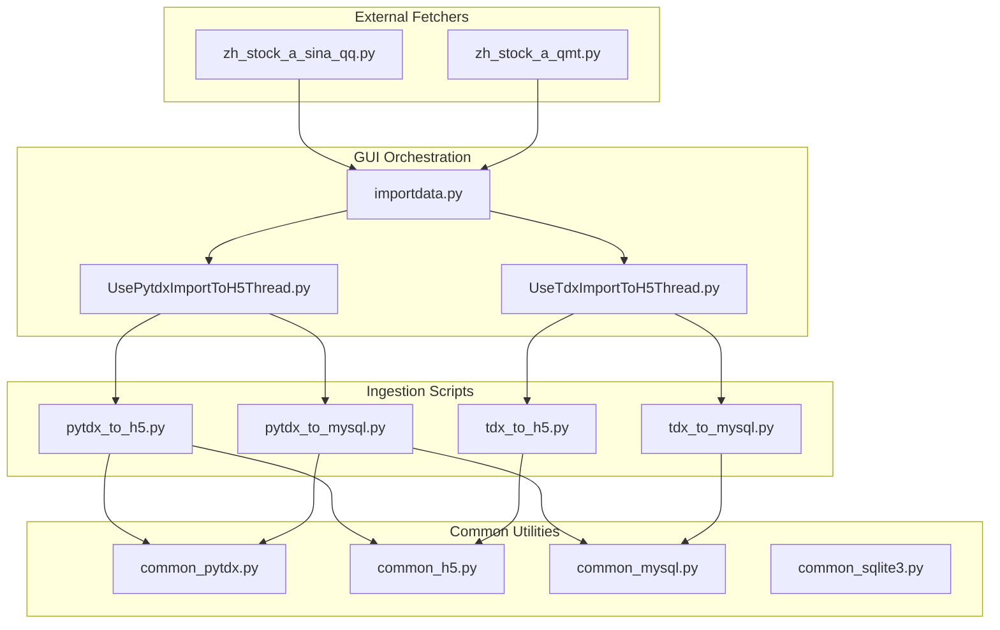
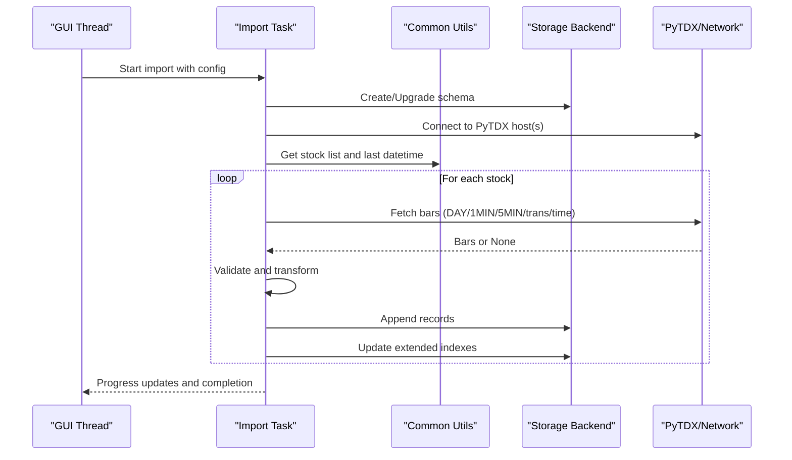
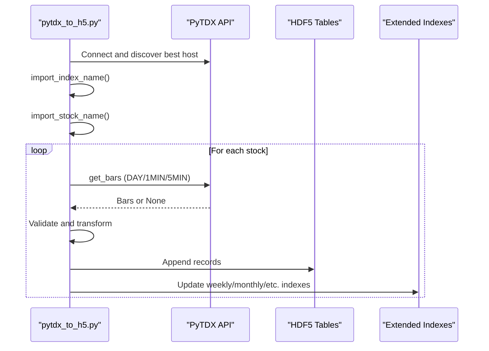
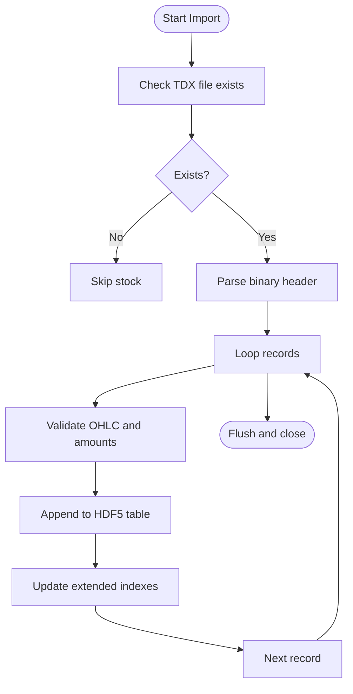
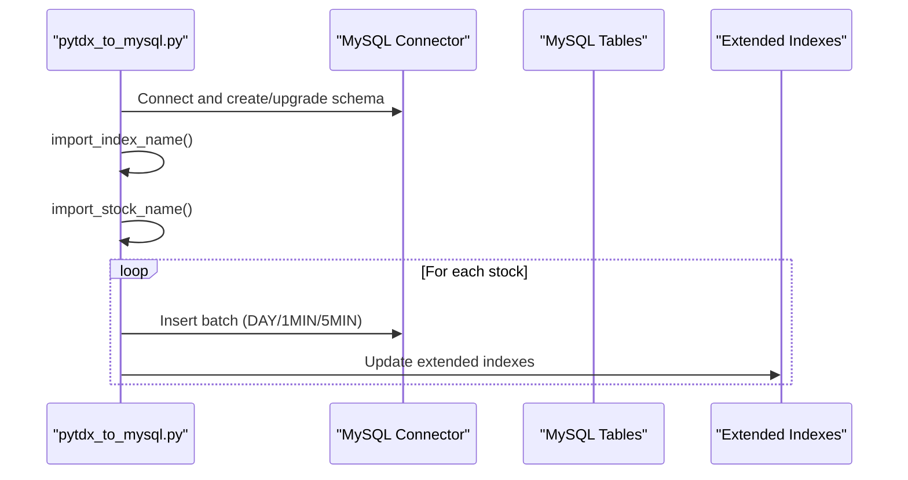
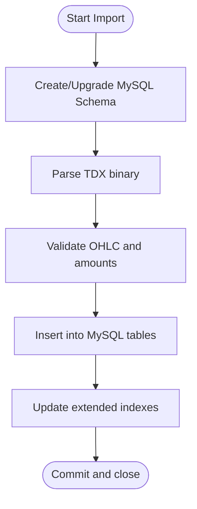
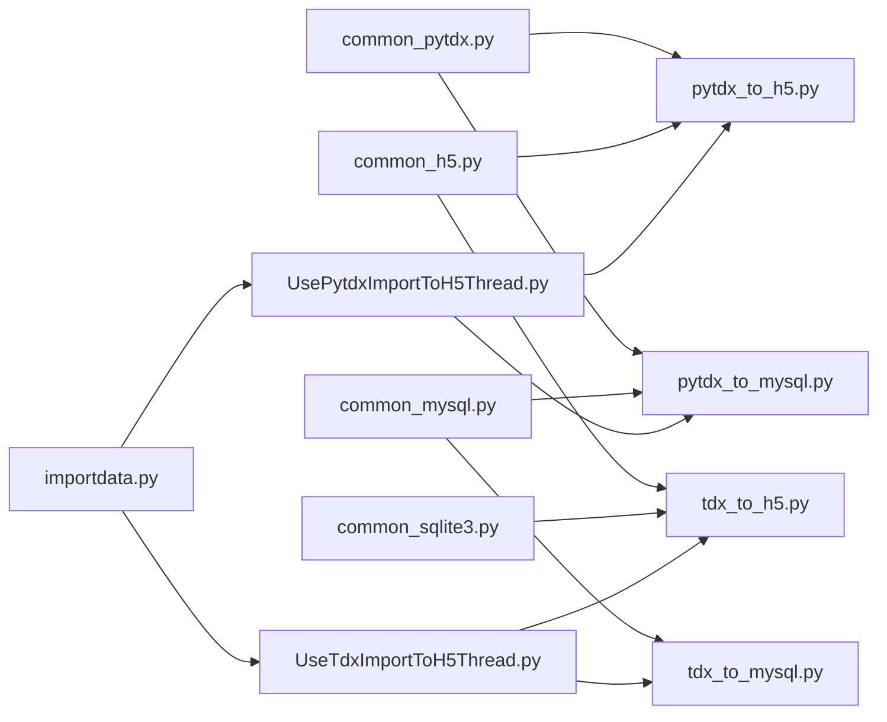

# Data Import and Export

<cite>
**Referenced Files in This Document**
- [pytdx_to_h5.py](file://hikyuu/data/pytdx_to_h5.py)
- [tdx_to_h5.py](file://hikyuu/data/tdx_to_h5.py)
- [pytdx_to_mysql.py](file://hikyuu/data/pytdx_to_mysql.py)
- [tdx_to_mysql.py](file://hikyuu/data/tdx_to_mysql.py)
- [common_pytdx.py](file://hikyuu/data/common_pytdx.py)
- [common_h5.py](file://hikyuu/data/common_h5.py)
- [common_mysql.py](file://hikyuu/data/common_mysql.py)
- [common_sqlite3.py](file://hikyuu/data/common_sqlite3.py)
- [importdata.py](file://hikyuu/gui/importdata.py)
- [UsePytdxImportToH5Thread.py](file://hikyuu/gui/data/UsePytdxImportToH5Thread.py)
- [UseTdxImportToH5Thread.py](file://hikyuu/gui/data/UseTdxImportToH5Thread.py)
- [zh_stock_a_sina_qq.py](file://hikyuu/fetcher/stock/zh_stock_a_sina_qq.py)
- [zh_stock_a_qmt.py](file://hikyuu/fetcher/stock/zh_stock_a_qmt.py)
</cite>

## Table of Contents
1. [Introduction](#introduction)
2. [Project Structure](#project-structure)
3. [Core Components](#core-components)
4. [Architecture Overview](#architecture-overview)
5. [Detailed Component Analysis](#detailed-component-analysis)
6. [Dependency Analysis](#dependency-analysis)
7. [Performance Considerations](#performance-considerations)
8. [Troubleshooting Guide](#troubleshooting-guide)
9. [Conclusion](#conclusion)
10. [Appendices](#appendices)

## Introduction
This document explains the data import and export subsystem in Hikyuu, focusing on how market data is ingested from external sources (PyTDX, TDX local files, East Money, Sina, QMT) and transformed into Hikyuu’s internal format. It covers:
- How raw data is fetched and validated
- Transformation pipelines into Hikyuu’s standardized internal representation
- Domain model of the import process (validation, error handling, progress tracking)
- Configuration and command-line parameters for import tools
- Relationship between import processes and storage backends (HDF5, MySQL, SQLite, ClickHouse)
- Solutions for common issues (data corruption, network failures, incremental updates)
- Performance optimization tips for large-scale imports

## Project Structure
The import/export functionality is organized around modular scripts and shared utilities:
- Data ingestion scripts:
  - PyTDX live data to HDF5 and MySQL
  - Local TDX disk files to HDF5 and MySQL
- Shared utilities:
  - PyTDX connectivity helpers and best-host selection
  - HDF5 schema and index management
  - MySQL/SQLite/ClickHouse schema creation and maintenance
- GUI orchestration:
  - Multi-process import threads coordinating tasks and progress reporting

**Diagram sources**
- [pytdx_to_h5.py](file://hikyuu/data/pytdx_to_h5.py#L1-L710)
- [tdx_to_h5.py](file://hikyuu/data/tdx_to_h5.py#L1-L465)
- [pytdx_to_mysql.py](file://hikyuu/data/pytdx_to_mysql.py#L1-L844)
- [tdx_to_mysql.py](file://hikyuu/data/tdx_to_mysql.py#L1-L465)
- [common_pytdx.py](file://hikyuu/data/common_pytdx.py#L1-L127)
- [common_h5.py](file://hikyuu/data/common_h5.py#L1-L398)
- [common_mysql.py](file://hikyuu/data/common_mysql.py#L1-L522)
- [common_sqlite3.py](file://hikyuu/data/common_sqlite3.py#L1-L142)
- [importdata.py](file://hikyuu/gui/importdata.py#L1-L171)
- [UsePytdxImportToH5Thread.py](file://hikyuu/gui/data/UsePytdxImportToH5Thread.py#L1-L395)
- [UseTdxImportToH5Thread.py](file://hikyuu/gui/data/UseTdxImportToH5Thread.py#L1-L358)
- [zh_stock_a_sina_qq.py](file://hikyuu/fetcher/stock/zh_stock_a_sina_qq.py#L1-L186)
- [zh_stock_a_qmt.py](file://hikyuu/fetcher/stock/zh_stock_a_qmt.py#L1-L58)

**Section sources**
- [pytdx_to_h5.py](file://hikyuu/data/pytdx_to_h5.py#L1-L710)
- [tdx_to_h5.py](file://hikyuu/data/tdx_to_h5.py#L1-L465)
- [pytdx_to_mysql.py](file://hikyuu/data/pytdx_to_mysql.py#L1-L844)
- [tdx_to_mysql.py](file://hikyuu/data/tdx_to_mysql.py#L1-L465)
- [common_pytdx.py](file://hikyuu/data/common_pytdx.py#L1-L127)
- [common_h5.py](file://hikyuu/data/common_h5.py#L1-L398)
- [common_mysql.py](file://hikyuu/data/common_mysql.py#L1-L522)
- [common_sqlite3.py](file://hikyuu/data/common_sqlite3.py#L1-L142)
- [importdata.py](file://hikyuu/gui/importdata.py#L1-L171)
- [UsePytdxImportToH5Thread.py](file://hikyuu/gui/data/UsePytdxImportToH5Thread.py#L1-L395)
- [UseTdxImportToH5Thread.py](file://hikyuu/gui/data/UseTdxImportToH5Thread.py#L1-L358)
- [zh_stock_a_sina_qq.py](file://hikyuu/fetcher/stock/zh_stock_a_sina_qq.py#L1-L186)
- [zh_stock_a_qmt.py](file://hikyuu/fetcher/stock/zh_stock_a_qmt.py#L1-L58)

## Core Components
- PyTDX ingestion to HDF5 and MySQL:
  - Live market data fetching via PyTDX
  - Validation and deduplication against last-record checks
  - Incremental updates based on last available datetime
  - Index updates for extended K-lines (weekly/monthly/etc.)
- Local TDX disk file ingestion to HDF5 and MySQL:
  - Binary file parsing for daily and minute bars
  - Range-based import using last-datetime checkpoints
  - Schema creation and table management
- Common utilities:
  - Best PyTDX host selection and connectivity testing
  - HDF5 schema definitions and index builders
  - MySQL/SQLite/ClickHouse schema creation and migration
- GUI orchestration:
  - Multi-process task scheduling and progress aggregation
  - Unified import control with configurable backends

**Section sources**
- [pytdx_to_h5.py](file://hikyuu/data/pytdx_to_h5.py#L1-L710)
- [tdx_to_h5.py](file://hikyuu/data/tdx_to_h5.py#L1-L465)
- [pytdx_to_mysql.py](file://hikyuu/data/pytdx_to_mysql.py#L1-L844)
- [tdx_to_mysql.py](file://hikyuu/data/tdx_to_mysql.py#L1-L465)
- [common_pytdx.py](file://hikyuu/data/common_pytdx.py#L1-L127)
- [common_h5.py](file://hikyuu/data/common_h5.py#L1-L398)
- [common_mysql.py](file://hikyuu/data/common_mysql.py#L1-L522)
- [common_sqlite3.py](file://hikyuu/data/common_sqlite3.py#L1-L142)
- [importdata.py](file://hikyuu/gui/importdata.py#L1-L171)
- [UsePytdxImportToH5Thread.py](file://hikyuu/gui/data/UsePytdxImportToH5Thread.py#L1-L395)
- [UseTdxImportToH5Thread.py](file://hikyuu/gui/data/UseTdxImportToH5Thread.py#L1-L358)

## Architecture Overview
The import pipeline follows a consistent flow across backends:
- Initialize backend connection and schema
- Fetch or parse raw data
- Validate and transform into Hikyuu internal units
- Append records and update indices
- Track progress and handle errors

**Diagram sources**
- [UsePytdxImportToH5Thread.py](file://hikyuu/gui/data/UsePytdxImportToH5Thread.py#L1-L395)
- [UseTdxImportToH5Thread.py](file://hikyuu/gui/data/UseTdxImportToH5Thread.py#L1-L358)
- [pytdx_to_h5.py](file://hikyuu/data/pytdx_to_h5.py#L1-L710)
- [pytdx_to_mysql.py](file://hikyuu/data/pytdx_to_mysql.py#L1-L844)
- [tdx_to_h5.py](file://hikyuu/data/tdx_to_h5.py#L1-L465)
- [tdx_to_mysql.py](file://hikyuu/data/tdx_to_mysql.py#L1-L465)
- [common_h5.py](file://hikyuu/data/common_h5.py#L1-L398)
- [common_mysql.py](file://hikyuu/data/common_mysql.py#L1-L522)
- [common_pytdx.py](file://hikyuu/data/common_pytdx.py#L1-L127)

## Detailed Component Analysis

### PyTDX to HDF5 Pipeline
- Purpose: Import live market data from PyTDX into HDF5 format
- Key steps:
  - Connect to PyTDX and select best host
  - Import index and stock name lists
  - For each stock, compute n and step windows to minimize API calls
  - Validate incoming bars against last record to detect corruption
  - Transform to internal units and append to HDF5 tables
  - Update extended indexes (weekly/monthly/quarterly/half-year/year, or minute-based aggregates)
- Data validation:
  - DateTime translation and bounds checking
  - OHLC validity and non-negative volume/amount checks
  - Last-record comparison thresholds for open/high/low/close/amount/volume
- Progress tracking:
  - Per-stock progress callbacks
  - Aggregated progress across markets

**Diagram sources**
- [pytdx_to_h5.py](file://hikyuu/data/pytdx_to_h5.py#L1-L710)
- [common_h5.py](file://hikyuu/data/common_h5.py#L1-L398)
- [common_pytdx.py](file://hikyuu/data/common_pytdx.py#L1-L127)

**Section sources**
- [pytdx_to_h5.py](file://hikyuu/data/pytdx_to_h5.py#L1-L710)
- [common_h5.py](file://hikyuu/data/common_h5.py#L1-L398)
- [common_pytdx.py](file://hikyuu/data/common_pytdx.py#L1-L127)

### Local TDX Disk Files to HDF5 Pipeline
- Purpose: Convert TDX binary files (.day, .lc1, .lc5) into HDF5
- Key steps:
  - Parse binary headers and records
  - Range-based import using last-datetime checkpoint
  - Transform OHLC and volumes to internal units
  - Append to HDF5 tables and update extended indexes
- Robustness:
  - File existence checks
  - Structured parsing with endianness and field validation
  - Date range seek optimization for minute files

**Diagram sources**
- [tdx_to_h5.py](file://hikyuu/data/tdx_to_h5.py#L1-L465)
- [common_h5.py](file://hikyuu/data/common_h5.py#L1-L398)

**Section sources**
- [tdx_to_h5.py](file://hikyuu/data/tdx_to_h5.py#L1-L465)
- [common_h5.py](file://hikyuu/data/common_h5.py#L1-L398)

### PyTDX to MySQL Pipeline
- Purpose: Import live market data from PyTDX into MySQL
- Key steps:
  - Create/upgrade MySQL schemas and tables per market/ktype
  - Batch insert using prepared statements
  - Update extended indexes (weekly/monthly/quarterly/half-year/year, minute-based)
  - Manage trans and time tables per market/code
- Data validation:
  - Same OHLC and amount checks as HDF5 pipeline
  - Last-record comparison thresholds
- Progress tracking:
  - Per-stock counters and aggregated progress

**Diagram sources**
- [pytdx_to_mysql.py](file://hikyuu/data/pytdx_to_mysql.py#L1-L844)
- [common_mysql.py](file://hikyuu/data/common_mysql.py#L1-L522)

**Section sources**
- [pytdx_to_mysql.py](file://hikyuu/data/pytdx_to_mysql.py#L1-L844)
- [common_mysql.py](file://hikyuu/data/common_mysql.py#L1-L522)

### Local TDX Disk Files to MySQL Pipeline
- Purpose: Convert TDX binary files into MySQL tables
- Key steps:
  - Create/upgrade schemas and tables per market/ktype
  - Parse binary files and insert records
  - Update extended indexes
- Robustness:
  - Structured parsing and validation
  - Date-range seek optimization for minute files

**Diagram sources**
- [tdx_to_mysql.py](file://hikyuu/data/tdx_to_mysql.py#L1-L465)
- [common_mysql.py](file://hikyuu/data/common_mysql.py#L1-L522)

**Section sources**
- [tdx_to_mysql.py](file://hikyuu/data/tdx_to_mysql.py#L1-L465)
- [common_mysql.py](file://hikyuu/data/common_mysql.py#L1-L522)

### External Data Sources (East Money, Sina, QMT)
- East Money block/weight data:
  - Weight downloads and import into SQLite/MySQL/ClickHouse via dedicated modules
- Real-time fetchers:
  - Sina/QQ: HTTP-based real-time quotes parsing
  - QMT: Full-tick data via xtquant library
- These are complementary to the import pipelines and can be integrated into broader workflows

**Section sources**
- [zh_stock_a_sina_qq.py](file://hikyuu/fetcher/stock/zh_stock_a_sina_qq.py#L1-L186)
- [zh_stock_a_qmt.py](file://hikyuu/fetcher/stock/zh_stock_a_qmt.py#L1-L58)

## Dependency Analysis
- PyTDX connectivity:
  - Host discovery and best-host selection
  - Connectivity testing and fallback
- Storage backends:
  - HDF5: schema and index management
  - MySQL: schema creation, table management, extended index updates
  - SQLite: schema creation and maintenance
  - ClickHouse: schema creation and maintenance (via dedicated modules)
- GUI orchestration:
  - Multi-process task distribution
  - Progress aggregation and messaging

**Diagram sources**
- [common_pytdx.py](file://hikyuu/data/common_pytdx.py#L1-L127)
- [common_h5.py](file://hikyuu/data/common_h5.py#L1-L398)
- [common_mysql.py](file://hikyuu/data/common_mysql.py#L1-L522)
- [common_sqlite3.py](file://hikyuu/data/common_sqlite3.py#L1-L142)
- [pytdx_to_h5.py](file://hikyuu/data/pytdx_to_h5.py#L1-L710)
- [pytdx_to_mysql.py](file://hikyuu/data/pytdx_to_mysql.py#L1-L844)
- [tdx_to_h5.py](file://hikyuu/data/tdx_to_h5.py#L1-L465)
- [tdx_to_mysql.py](file://hikyuu/data/tdx_to_mysql.py#L1-L465)
- [UsePytdxImportToH5Thread.py](file://hikyuu/gui/data/UsePytdxImportToH5Thread.py#L1-L395)
- [UseTdxImportToH5Thread.py](file://hikyuu/gui/data/UseTdxImportToH5Thread.py#L1-L358)
- [importdata.py](file://hikyuu/gui/importdata.py#L1-L171)

**Section sources**
- [common_pytdx.py](file://hikyuu/data/common_pytdx.py#L1-L127)
- [common_h5.py](file://hikyuu/data/common_h5.py#L1-L398)
- [common_mysql.py](file://hikyuu/data/common_mysql.py#L1-L522)
- [common_sqlite3.py](file://hikyuu/data/common_sqlite3.py#L1-L142)
- [pytdx_to_h5.py](file://hikyuu/data/pytdx_to_h5.py#L1-L710)
- [pytdx_to_mysql.py](file://hikyuu/data/pytdx_to_mysql.py#L1-L844)
- [tdx_to_h5.py](file://hikyuu/data/tdx_to_h5.py#L1-L465)
- [tdx_to_mysql.py](file://hikyuu/data/tdx_to_mysql.py#L1-L465)
- [UsePytdxImportToH5Thread.py](file://hikyuu/gui/data/UsePytdxImportToH5Thread.py#L1-L395)
- [UseTdxImportToH5Thread.py](file://hikyuu/gui/data/UseTdxImportToH5Thread.py#L1-L358)
- [importdata.py](file://hikyuu/gui/importdata.py#L1-L171)

## Performance Considerations
- Minimize API calls:
  - Compute n and step windows based on last datetime to reduce round trips
  - Batch inserts for MySQL
- Efficient indexing:
  - Update extended indexes incrementally after appending
  - Use date-range seeks for minute files to skip already-imported data
- Concurrency:
  - Multi-process task distribution in GUI threads
  - Best-host selection to maximize throughput
- Data validation overhead:
  - Early filtering of invalid OHLC/amount/volume
  - Last-record comparison to detect corruption quickly

[No sources needed since this section provides general guidance]

## Troubleshooting Guide
- Data corruption detection:
  - Last-record threshold comparisons for open/high/low/close/amount/volume
  - DateTime translation and field presence checks
- Network failures:
  - Best-host selection and fallback
  - Graceful handling of None returns from PyTDX API
- Incremental updates:
  - Use last-datetime checkpoints to avoid duplicates
  - Update extended indexes only when new data is appended
- Storage backend issues:
  - Ensure schema creation/upgrade runs before import
  - Verify table existence and create if missing

**Section sources**
- [pytdx_to_h5.py](file://hikyuu/data/pytdx_to_h5.py#L1-L710)
- [pytdx_to_mysql.py](file://hikyuu/data/pytdx_to_mysql.py#L1-L844)
- [tdx_to_h5.py](file://hikyuu/data/tdx_to_h5.py#L1-L465)
- [tdx_to_mysql.py](file://hikyuu/data/tdx_to_mysql.py#L1-L465)
- [common_mysql.py](file://hikyuu/data/common_mysql.py#L1-L522)
- [common_sqlite3.py](file://hikyuu/data/common_sqlite3.py#L1-L142)
- [common_h5.py](file://hikyuu/data/common_h5.py#L1-L398)

## Conclusion
Hikyuu’s import/export subsystem provides robust, incremental, and efficient ingestion from multiple sources into standardized internal formats. The design emphasizes:
- Clear separation of concerns (ingestion scripts, common utilities, GUI orchestration)
- Strong validation and error handling
- Flexible storage backends with consistent schema management
- Practical performance optimizations for large-scale imports

[No sources needed since this section summarizes without analyzing specific files]

## Appendices

### Configuration Options and Command-Line Parameters
- GUI configuration (importdata-gui.ini):
  - Enable/disable backends (HDF5, MySQL, ClickHouse)
  - Enable/disable data types (DAY, 1MIN, 5MIN, TRANS, TIME)
  - Select quotations (stock, fund, bond)
  - Configure start dates for incremental imports
  - PyTDX host selection and concurrency limits
- Example usage:
  - Launch GUI import with optional ignore flag to skip K-line data
  - Tasks are distributed across multiple processes with progress reporting

**Section sources**
- [importdata.py](file://hikyuu/gui/importdata.py#L1-L171)
- [UsePytdxImportToH5Thread.py](file://hikyuu/gui/data/UsePytdxImportToH5Thread.py#L1-L395)
- [UseTdxImportToH5Thread.py](file://hikyuu/gui/data/UseTdxImportToH5Thread.py#L1-L358)

### Domain Model of Import Process
- Entities:
  - Stock, Market, CodeRuleType, Holiday, Version
- Relationships:
  - Stock belongs to Market and CodeRuleType
  - Extended indexes depend on base K-line tables
- Validation:
  - OHLC validity, non-negative amounts/volumes
  - Field presence checks
  - Last-record threshold comparisons
- Progress:
  - Per-stock progress callbacks
  - Aggregated progress across markets and data types

**Section sources**
- [common_mysql.py](file://hikyuu/data/common_mysql.py#L1-L522)
- [common_sqlite3.py](file://hikyuu/data/common_sqlite3.py#L1-L142)
- [common_h5.py](file://hikyuu/data/common_h5.py#L1-L398)