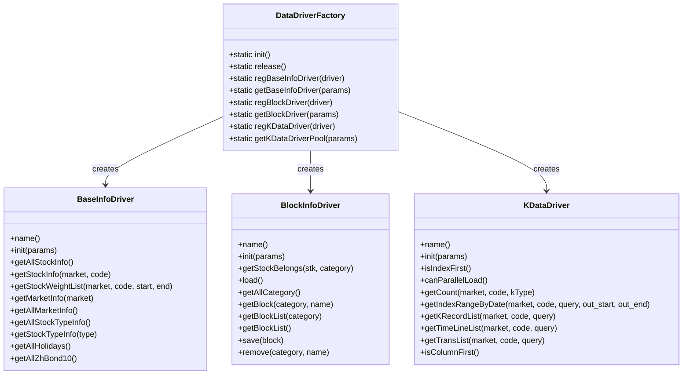

# Data Management

<cite>
**Referenced Files in This Document**   
- [common.py](file://hikyuu/data/common.py)
- [common_h5.py](file://hikyuu/data/common_h5.py)
- [common_mysql.py](file://hikyuu/data/common_mysql.py)
- [common_sqlite3.py](file://hikyuu/data/common_sqlite3.py)
- [pytdx_to_h5.py](file://hikyuu/data/pytdx_to_h5.py)
- [tdx_to_h5.py](file://hikyuu/data/tdx_to_h5.py)
- [em_block_to_mysql.py](file://hikyuu/data/em_block_to_mysql.py)
- [DataDriverFactory.h](file://hikyuu_cpp/hikyuu/data_driver/DataDriverFactory.h)
- [KDataDriver.h](file://hikyuu_cpp/hikyuu/data_driver/KDataDriver.h)
- [BaseInfoDriver.h](file://hikyuu_cpp/hikyuu/data_driver/BaseInfoDriver.h)
- [BlockInfoDriver.h](file://hikyuu_cpp/hikyuu/data_driver/BlockInfoDriver.h)
- [self.ini](file://hikyuu/config/block/self.ini)
</cite>

## Table of Contents
1. [Introduction](#introduction)
2. [Storage Backends](#storage-backends)
3. [Data Import/Export Processes](#data-importexport-processes)
4. [Block Management System](#block-management-system)
5. [Data Driver Architecture](#data-driver-architecture)
6. [Public Interfaces and Usage Examples](#public-interfaces-and-usage-examples)
7. [Conclusion](#conclusion)

## Introduction

The Hikyuu data management system is designed to efficiently handle market data from various sources for quantitative analysis. It provides a flexible architecture that supports multiple storage backends, enabling users to choose the most appropriate solution based on their performance requirements, data volume, and infrastructure constraints. The system is built to handle historical market data, financial information, and block (grouping) data for stocks, providing comprehensive support for quantitative trading strategies.

The core purpose of this data management system is to provide reliable, efficient, and scalable storage and retrieval of financial market data. It addresses the challenges of handling large volumes of time-series data while maintaining fast query performance for backtesting and analysis. The system supports various data frequencies including daily, minute, and tick-level data, making it suitable for different trading strategies from long-term investing to high-frequency trading.

**Section sources**
- [common.py](file://hikyuu/data/common.py#L1-L249)
- [common_h5.py](file://hikyuu/data/common_h5.py#L1-L398)

## Storage Backends

Hikyuu supports multiple storage backends to accommodate different use cases and performance requirements. Each backend has its own advantages and ideal use cases, allowing users to select the most appropriate solution for their specific needs.

### HDF5 Storage

HDF5 (Hierarchical Data Format version 5) is a high-performance data storage format designed for large datasets. In Hikyuu, HDF5 is used as a primary storage backend for market data, offering excellent compression and fast I/O operations for time-series data.

The HDF5 implementation in Hikyuu uses PyTables (a Python library built on top of HDF5) to manage data storage. It defines specific record structures for different types of market data:

- **H5Record**: Stores basic K-line data (daily, minute) with fields for datetime, open, high, low, close prices, transaction amount, and count
- **H5Index**: Provides indexing for extended K-line data (weekly, monthly, etc.)
- **H5Transaction**: Stores tick-level transaction data
- **H5TransactionIndex**: Indexes transaction data by day
- **H5MinuteTime**: Stores intraday minute-level data

HDF5 offers several advantages:
- High compression ratios (using zlib with level 9 compression)
- Fast sequential and random access to time-series data
- Efficient storage of large datasets
- Built-in support for data chunking and indexing

HDF5 is particularly well-suited for scenarios with large volumes of historical market data where storage efficiency and fast sequential reads are important.

### MySQL Storage

MySQL is a widely-used relational database management system that Hikyuu supports as a storage backend. This backend is ideal for users who prefer a traditional SQL-based approach to data management and need robust transaction support.

The MySQL implementation creates separate schemas for different market data types (e.g., `sh_day`, `sz_min5`) with tables for individual securities. Key features include:

- Schema creation and version management through SQL upgrade scripts
- Support for various K-line frequencies (daily, weekly, monthly, minute intervals)
- Efficient indexing on date fields for fast time-based queries
- Use of MyISAM storage engine for optimized read performance

MySQL is particularly advantageous when:
- Integration with existing database infrastructure is required
- Complex queries involving multiple securities or data types are needed
- Multiple applications need to access the same data simultaneously
- Advanced data management features (backups, replication, etc.) are required

### SQLite Storage

SQLite provides a lightweight, file-based database solution that requires no separate server process. It's an excellent choice for personal use, development, and smaller datasets.

The SQLite backend in Hikyuu offers:
- Zero-configuration deployment
- Single-file database storage
- Full SQL support with ACID transactions
- Good performance for moderate data volumes

SQLite is ideal for:
- Individual researchers and developers
- Portable applications
- Testing and development environments
- Situations where simplicity and ease of setup are prioritized

### ClickHouse Storage

ClickHouse is a column-oriented database management system designed for online analytical processing (OLAP). While not detailed in the provided files, Hikyuu's architecture supports ClickHouse as a backend for high-performance analytical queries on large datasets.

ClickHouse would be beneficial for:
- Very large datasets requiring fast aggregation queries
- Real-time analytics on streaming market data
- Complex analytical queries across extensive historical data

**Section sources**
- [common_h5.py](file://hikyuu/data/common_h5.py#L1-L398)
- [common_mysql.py](file://hikyuu/data/common_mysql.py#L1-L522)
- [common_sqlite3.py](file://hikyuu/data/common_sqlite3.py#L1-L142)

## Data Import/Export Processes

Hikyuu provides comprehensive tools for importing market data from various sources into its supported storage backends. The system supports multiple data sources and import methods to accommodate different data availability and quality requirements.

### PyTDX Data Import

PyTDX is a Python library for accessing Tongdaxin (TDX) financial data. Hikyuu integrates with PyTDX to import market data directly from this popular Chinese financial data provider.

The import process involves:
1. Connecting to TDX servers to retrieve stock and index code lists
2. Downloading historical K-line data for each security
3. Converting the data to Hikyuu's internal format
4. Storing the data in the selected backend (HDF5, MySQL, etc.)

Key files for PyTDX integration:
- `pytdx_to_h5.py`: Imports data from PyTDX to HDF5 storage
- `pytdx_to_mysql.py`: Imports data from PyTDX to MySQL storage
- `pytdx_to_sqlite.py`: Imports data from PyTDX to SQLite storage

The import process handles various data types including:
- Daily, minute, and tick-level K-line data
- Stock name and metadata updates
- Index data

### East Money Data Import

East Money (Eastmoney) is a major Chinese financial information provider. Hikyuu supports importing block (sector/industry) data from East Money through the `em_block_to_mysql.py`, `em_block_to_sqlite.py`, and `em_block_to_clickhouse.py` scripts.

The East Money import process:
1. Downloads block information (industry, concept, region, etc.) from East Money
2. Parses the block data into Hikyuu's block structure
3. Stores the block information in the selected database backend
4. Maintains relationships between stocks and their respective blocks

This allows users to analyze stocks by various groupings such as industries, concepts, and regions, which is essential for sector rotation strategies and relative strength analysis.

### Sina Data Import

Sina Finance is another major source of Chinese financial data. Hikyuu can import index data from Sina through the `get_index_code_name_list()` function in `common.py`.

The Sina import functionality:
- Retrieves current index codes and names
- Handles potential IP blocking by implementing request throttling
- Provides a fallback mechanism if Sina's API changes
- Integrates index data with other market data sources

### Data Import Workflow

The typical data import workflow in Hikyuu follows these steps:

1. **Source Connection**: Establish connection to the data source (PyTDX, local TDX files, web APIs)
2. **Metadata Update**: Refresh stock and index metadata (names, validity, etc.)
3. **Historical Data Import**: Download and process historical market data
4. **Data Transformation**: Convert data to Hikyuu's internal format
5. **Storage**: Write data to the selected backend
6. **Indexing**: Create necessary indexes for efficient querying
7. **Validation**: Verify data integrity and completeness

The system includes progress tracking and error handling to ensure reliable data imports, even when dealing with large datasets or unstable network connections.

**Section sources**
- [pytdx_to_h5.py](file://hikyuu/data/pytdx_to_h5.py#L1-L710)
- [tdx_to_h5.py](file://hikyuu/data/tdx_to_h5.py#L1-L465)
- [em_block_to_mysql.py](file://hikyuu/data/em_block_to_mysql.py#L1-L72)
- [common.py](file://hikyuu/data/common.py#L1-L249)

## Block Management System

The block management system in Hikyuu provides a flexible way to group stocks into categories such as industries, concepts, regions, and custom portfolios. This system enables sophisticated analysis based on stock groupings rather than individual securities.

### Block Configuration

Blocks are defined in configuration files located in the `hikyuu/config/block/` directory. Each block file follows a simple INI format where sections represent different block categories and entries specify stock codes belonging to each block.

For example, the `self.ini` file defines a custom portfolio:
```ini
[1]
1, 000728 ;国元证券
1, 002685 ;华东重机
1, 002339 ;积成电子
```

The first number indicates whether the stock is included (1) or excluded (0) from the block.

### Block Categories

Hikyuu supports multiple block categories, including:
- **Industry blocks (hybk.ini)**: Stocks grouped by industry sectors
- **Concept blocks (gnbk.ini)**: Stocks grouped by investment concepts
- **Region blocks (dybk.ini)**: Stocks grouped by geographic regions
- **Custom blocks (self.ini)**: User-defined stock groupings
- **Thematic blocks (zsbk.ini)**: Stocks grouped by specific investment themes

### Block Operations

The block system supports various operations:
- **Creation**: Define new blocks through configuration files or programmatically
- **Querying**: Retrieve stocks belonging to specific blocks or categories
- **Analysis**: Perform group-level analysis on block constituents
- **Dynamic Updates**: Refresh block membership from external sources like East Money

The block management system is integrated with the data driver architecture, allowing blocks to be stored in different backends (MySQL, SQLite, etc.) and accessed efficiently during analysis.

**Section sources**
- [self.ini](file://hikyuu/config/block/self.ini#L1-L10)
- [em_block_to_mysql.py](file://hikyuu/data/em_block_to_mysql.py#L1-L72)

## Data Driver Architecture

Hikyuu's data driver architecture provides a unified interface for accessing different data storage backends, abstracting the underlying implementation details. This design enables seamless switching between storage systems while maintaining consistent data access patterns.

### Driver Factory Pattern

The `DataDriverFactory` class implements the factory pattern to manage different data drivers. It provides a centralized mechanism for:

- Registering new drivers
- Retrieving driver instances based on configuration
- Managing driver lifecycle
- Providing connection pooling

The factory supports three main types of drivers:
- **BaseInfoDriver**: Handles basic security information (names, types, trading parameters)
- **BlockInfoDriver**: Manages block (grouping) information
- **KDataDriver**: Handles historical market data (K-lines, tick data)



**Diagram sources**
- [DataDriverFactory.h](file://hikyuu_cpp/hikyuu/data_driver/DataDriverFactory.h#L1-L59)
- [BaseInfoDriver.h](file://hikyuu_cpp/hikyuu/data_driver/BaseInfoDriver.h#L1-L245)
- [BlockInfoDriver.h](file://hikyuu_cpp/hikyuu/data_driver/BlockInfoDriver.h#L1-L115)
- [KDataDriver.h](file://hikyuu_cpp/hikyuu/data_driver/KDataDriver.h#L1-L225)

### Abstract Base Classes

The data driver architecture is built on abstract base classes that define the contract for all implementations:

#### KDataDriver
The `KDataDriver` class defines the interface for accessing historical market data. Key methods include:
- `getKRecordList()`: Retrieves K-line data based on query parameters
- `getTimeLineList()`: Retrieves intraday minute-level data
- `getTransList()`: Retrieves tick-level transaction data
- `getCount()`: Returns the number of records for a security
- `getIndexRangeByDate()`: Maps date ranges to record indices for efficient querying

The driver supports both index-based and date-based querying, with the `isIndexFirst()` method indicating which approach is more efficient for the specific implementation.

#### BaseInfoDriver
The `BaseInfoDriver` handles basic security information and metadata:
- Stock and market information
- Trading parameters (tick size, precision)
- Validity periods
- Weighting information (dividends, splits)
- Holiday calendars
- Bond yield data

#### BlockInfoDriver
The `BlockInfoDriver` manages stock groupings and categories:
- Retrieving stocks belonging to specific blocks
- Loading block definitions from various sources
- Saving and removing blocks
- Querying block hierarchies and relationships

### Implementation Benefits

This architecture provides several key benefits:
- **Abstraction**: Applications can access data without knowing the underlying storage mechanism
- **Extensibility**: New storage backends can be added by implementing the driver interfaces
- **Consistency**: Uniform API across different storage systems
- **Performance Optimization**: Drivers can implement backend-specific optimizations
- **Configuration-Driven**: Storage backend can be changed through configuration without code changes

The driver architecture enables Hikyuu to support multiple storage systems while providing a consistent and efficient interface for quantitative analysis.

**Section sources**
- [DataDriverFactory.h](file://hikyuu_cpp/hikyuu/data_driver/DataDriverFactory.h#L1-L59)
- [KDataDriver.h](file://hikyuu_cpp/hikyuu/data_driver/KDataDriver.h#L1-L225)
- [BaseInfoDriver.h](file://hikyuu_cpp/hikyuu/data_driver/BaseInfoDriver.h#L1-L245)
- [BlockInfoDriver.h](file://hikyuu_cpp/hikyuu/data_driver/BlockInfoDriver.h#L1-L115)

## Public Interfaces and Usage Examples

Hikyuu provides a comprehensive set of public interfaces for data operations, enabling users to import, configure, and query market data efficiently.

### Storage Configuration

To configure storage, users can specify the backend and connection parameters through configuration files or programmatically. For example, to use MySQL storage:

```python
# Configuration would specify MySQL connection parameters
# host, port, username, password, database name
```

For HDF5 storage, the destination directory is specified where individual HDF5 files will be created for each market.

### Data Import Examples

#### Importing from PyTDX to HDF5

```python
from hikyuu.data.pytdx_to_h5 import import_data

# Import data for Shanghai and Shenzhen markets
import_data(dest_dir="/path/to/hdf5/data", market_list=["SH", "SZ"])
```

#### Importing Block Data from East Money to MySQL

```python
from hikyuu.data.em_block_to_mysql import em_import_block_to_mysql
import mysql.connector

# Connect to MySQL
connect = mysql.connector.connect(
    user='username', 
    password='password', 
    host='localhost', 
    port=3306
)

# Import block data
em_import_block_to_mysql(connect)
connect.close()
```

### Data Querying

Once data is imported, it can be queried using Hikyuu's unified interface:

```python
# Get historical K-line data
kdata = stock.get_kdata(Query(start_date="20200101", end_date="20230101"))

# Get stocks in a specific block
block = get_block("行业", "银行")
stocks_in_block = block.get_stocks()

# Get real-time data
current_price = stock.get_current_price()
```

### Practical Implementation

The system provides practical tools for common data management tasks:

1. **Regular Data Updates**: Scripts can be scheduled to update data daily after market close
2. **Data Validation**: Built-in functions to verify data completeness and integrity
3. **Error Handling**: Robust error handling for network issues and data inconsistencies
4. **Progress Monitoring**: Progress bars and logging for long-running import operations

The public interfaces are designed to be intuitive for beginners while providing the flexibility and power needed by experienced developers. The consistent API across different storage backends means that code written for one backend will work with others, allowing users to switch storage systems as their needs evolve.

**Section sources**
- [pytdx_to_h5.py](file://hikyuu/data/pytdx_to_h5.py#L1-L710)
- [em_block_to_mysql.py](file://hikyuu/data/em_block_to_mysql.py#L1-L72)
- [common_h5.py](file://hikyuu/data/common_h5.py#L1-L398)

## Conclusion

The Hikyuu data management system provides a comprehensive solution for handling market data in quantitative analysis. By supporting multiple storage backends including HDF5, MySQL, SQLite, and ClickHouse, it offers flexibility to accommodate different performance requirements, data volumes, and infrastructure constraints.

The system's architecture, built around the data driver pattern, provides a unified interface that abstracts the complexities of different storage systems. This allows users to focus on analysis rather than data management details. The support for multiple data sources like PyTDX, East Money, and Sina ensures comprehensive market coverage.

The block management system enables sophisticated analysis based on stock groupings, which is essential for modern quantitative strategies. Combined with efficient data import/export processes, Hikyuu provides a complete ecosystem for quantitative researchers and traders.

Whether you're a beginner starting with SQLite for personal research or an institution deploying ClickHouse for enterprise-scale analysis, Hikyuu's data management system scales to meet your needs while maintaining a consistent and intuitive interface.