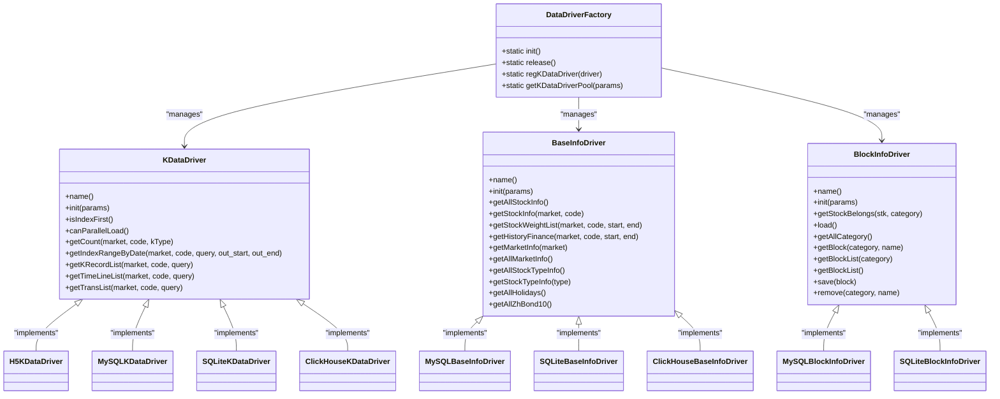

# Storage Backends

<cite>
**Referenced Files in This Document**   
- [common.py](file://hikyuu/data/common.py)
- [common_h5.py](file://hikyuu/data/common_h5.py)
- [common_mysql.py](file://hikyuu/data/common_mysql.py)
- [common_sqlite3.py](file://hikyuu/data/common_sqlite3.py)
- [common_clickhouse.py](file://hikyuu/data/common_clickhouse.py)
- [DataDriverFactory.h](file://hikyuu_cpp/hikyuu/data_driver/DataDriverFactory.h)
- [KDataDriver.h](file://hikyuu_cpp/hikyuu/data_driver/KDataDriver.h)
- [BaseInfoDriver.h](file://hikyuu_cpp/hikyuu/data_driver/BaseInfoDriver.h)
- [H5KDataDriver.h](file://hikyuu_cpp/hikyuu/data_driver/kdata/hdf5/H5KDataDriver.h)
- [MySQLKDataDriver.h](file://hikyuu_cpp/hikyuu/data_driver/kdata/mysql/MySQLKDataDriver.h)
- [SQLiteKDataDriver.h](file://hikyuu_cpp/hikyuu/data_driver/kdata/sqlite/SQLiteKDataDriver.h)
- [clickhouse_upgrade/createdb.sql](file://hikyuu/data/clickhouse_upgrade/createdb.sql)
- [mysql_upgrade/createdb.sql](file://hikyuu/data/mysql_upgrade/createdb.sql)
- [sqlite_upgrade/createdb.sql](file://hikyuu/data/sqlite_upgrade/createdb.sql)
</cite>

## Table of Contents
1. [Introduction](#introduction)
2. [Architecture Overview](#architecture-overview)
3. [HDF5 Backend](#hdf5-backend)
4. [MySQL Backend](#mysql-backend)
5. [SQLite Backend](#sqlite-backend)
6. [ClickHouse Backend](#clickhouse-backend)
7. [Data Schema and Models](#data-schema-and-models)
8. [Backend Selection Guidance](#backend-selection-guidance)
9. [Configuration and Usage](#configuration-and-usage)
10. [Common Issues and Solutions](#common-issues-and-solutions)

## Introduction

Hikyuu provides a flexible and extensible storage architecture that supports multiple backend systems for financial data management. The framework is designed to accommodate various data storage requirements through its support for HDF5, MySQL, SQLite, and ClickHouse backends. Each storage system serves different use cases and performance requirements, allowing users to select the most appropriate solution based on their specific needs.

The multi-backend architecture enables Hikyuu to handle diverse data workloads efficiently, from high-performance time series analysis to scalable relational data management and analytical processing. This document provides a comprehensive overview of each storage backend, detailing their implementation, advantages, use cases, and configuration options. The design follows a driver-based pattern where each backend implements a common interface, allowing for seamless integration and interchangeability within the Hikyuu ecosystem.

**Section sources**
- [common.py](file://hikyuu/data/common.py#L1-L249)
- [DataDriverFactory.h](file://hikyuu_cpp/hikyuu/data_driver/DataDriverFactory.h#L1-L59)

## Architecture Overview

Hikyuu's storage architecture follows a modular driver-based design that abstracts the underlying storage implementation from the core application logic. The architecture is built around three primary driver types: KDataDriver for time series data, BaseInfoDriver for reference data, and BlockInfoDriver for grouping information. These drivers are managed by the DataDriverFactory, which handles initialization, connection pooling, and driver registration.

The system employs a factory pattern to instantiate and manage storage drivers, allowing for dynamic registration and selection of different backend implementations. Each driver type defines a common interface that all concrete implementations must adhere to, ensuring consistency across different storage systems. This design enables Hikyuu to support multiple storage backends while maintaining a uniform API for data access operations.

The C++ core provides the foundational driver interfaces, while Python wrappers expose these capabilities to the higher-level application. This hybrid approach combines the performance benefits of C++ with the flexibility and ease of use of Python. The architecture supports both row-oriented and column-oriented storage models, with specific optimizations for time series data access patterns.



**Diagram sources **
- [DataDriverFactory.h](file://hikyuu_cpp/hikyuu/data_driver/DataDriverFactory.h#L1-L59)
- [KDataDriver.h](file://hikyuu_cpp/hikyuu/data_driver/KDataDriver.h#L1-L225)
- [BaseInfoDriver.h](file://hikyuu_cpp/hikyuu/data_driver/BaseInfoDriver.h#L1-L245)
- [BlockInfoDriver.h](file://hikyuu_cpp/hikyuu/data_driver/BlockInfoDriver.h#L1-L115)

## HDF5 Backend

The HDF5 backend in Hikyuu is optimized for high-performance time series data storage and retrieval. It leverages the Hierarchical Data Format (HDF5) to provide efficient storage of financial market data, particularly suited for applications requiring fast access to large volumes of historical price data. The implementation uses PyTables as the Python interface to HDF5, providing a high-level API for data manipulation.

The HDF5 driver stores data in a hierarchical structure with separate files for different K-line types (daily, minute, etc.) and markets. Each security's data is stored as a table within the appropriate market group, with optimized data types that minimize storage requirements while maintaining precision. The backend uses zlib compression at level 9 to reduce disk footprint, which is particularly beneficial for long-term historical data storage.

One of the key advantages of the HDF5 backend is its excellent performance for sequential data access patterns, making it ideal for backtesting and technical analysis applications. The storage format supports efficient range queries and can handle large datasets that might be challenging for traditional relational databases. The backend also includes specialized indexing for different time frames (weekly, monthly, etc.), allowing for quick aggregation from higher-frequency data.

The HDF5 implementation includes support for three primary data types: K-line data, transaction data, and time series data. Each type has a specific record structure optimized for the data characteristics. For example, K-line data uses 32-bit unsigned integers for price fields (scaled by 1000) and 64-bit integers for volume and amount fields, balancing precision with storage efficiency.

**Section sources**
- [common_h5.py](file://hikyuu/data/common_h5.py#L1-L398)
- [H5KDataDriver.h](file://hikyuu_cpp/hikyuu/data_driver/kdata/hdf5/H5KDataDriver.h#L1-L150)

## MySQL Backend

The MySQL backend in Hikyuu provides a robust relational database solution for financial data storage. It is designed for scenarios requiring strong data consistency, complex querying capabilities, and scalability across multiple users or applications. The implementation uses the mysql-connector-python library to interface with MySQL databases, supporting modern MySQL features and connection management.

The MySQL backend follows a schema design that separates different data types into distinct databases and tables. Market reference data is stored in the hku_base database, while time series data is organized into separate databases for each market and K-line type (e.g., sh_day, sz_min5). This schema organization allows for efficient data partitioning and optimized query performance based on market and time frame.

Each security's time series data is stored in a dedicated table named after its code, with a composite structure that includes date as the primary key and indexed fields for efficient range queries. The schema uses appropriate data types to balance precision and storage efficiency, with DOUBLE for price fields and BIGINT for volume and amount fields. The backend supports MyISAM storage engine by default, which provides good performance for read-heavy workloads typical in financial analysis.

The MySQL implementation includes comprehensive database migration support through versioned SQL scripts stored in the mysql_upgrade directory. These scripts handle schema evolution over time, ensuring backward compatibility while allowing for structural improvements. The backend also provides utilities for creating and upgrading databases, managing connection parameters, and handling schema changes.

**Section sources**
- [common_mysql.py](file://hikyuu/data/common_mysql.py#L1-L522)
- [MySQLKDataDriver.h](file://hikyuu_cpp/hikyuu/data_driver/kdata/mysql/MySQLKDataDriver.h#L1-L120)
- [mysql_upgrade/createdb.sql](file://hikyuu/data/mysql_upgrade/createdb.sql#L1-L100)

## SQLite Backend

The SQLite backend in Hikyuu offers a lightweight, file-based storage solution ideal for local development, single-user applications, and portable data storage. It provides a self-contained, serverless database engine that requires minimal configuration and administration. The implementation uses Python's built-in sqlite3 module, ensuring broad compatibility and ease of deployment.

The SQLite backend stores all data in a single file, making it easy to backup, transfer, and version control financial datasets. The schema design follows a similar pattern to the MySQL backend but is optimized for the constraints and capabilities of SQLite. Market reference data and time series data are stored in the same database file, with appropriate indexing to maintain query performance.

One of the primary advantages of the SQLite backend is its simplicity and low overhead. It requires no separate database server process, making it ideal for desktop applications and development environments. The backend supports ACID transactions and provides reasonable performance for moderate data volumes, though it may not scale as well as client-server databases for very large datasets or high-concurrency scenarios.

The implementation includes utilities for database creation, schema migration, and data import/export. Like other backends, it supports versioned schema upgrades through SQL scripts in the sqlite_upgrade directory. The backend is particularly well-suited for scenarios where data portability and ease of setup are more important than maximum performance or concurrent access.

**Section sources**
- [common_sqlite3.py](file://hikyuu/data/common_sqlite3.py#L1-L142)
- [SQLiteKDataDriver.h](file://hikyuu_cpp/hikyuu/data_driver/kdata/sqlite/SQLiteKDataDriver.h#L1-L110)
- [sqlite_upgrade/createdb.sql](file://hikyuu/data/sqlite_upgrade/createdb.sql#L1-L80)

## ClickHouse Backend

The ClickHouse backend in Hikyuu is designed for analytical workloads and large-scale financial data processing. It leverages the ClickHouse column-oriented database management system to provide high-performance querying capabilities for time series data. The implementation uses the clickhouse-connect library to interface with ClickHouse servers, supporting modern features and efficient data transfer.

The ClickHouse backend is optimized for analytical queries that involve aggregations, filtering, and scanning large volumes of data. It stores data in a columnar format that enables excellent compression ratios and fast query performance, particularly for time-based range queries. The schema design uses MergeTree engines with appropriate partitioning and ordering keys to maximize query efficiency.

Data is organized into tables within the hku_data database, with separate tables for different K-line types (day_k, min_k, etc.). Each table includes market and code as sorting keys, followed by date, enabling efficient filtering by security and time range. The backend supports high-throughput data ingestion, making it suitable for real-time data processing pipelines and large historical datasets.

The ClickHouse implementation excels at complex analytical queries that would be challenging or slow on traditional row-oriented databases. It can efficiently handle queries involving multiple securities, time aggregations, and statistical calculations across large datasets. This makes it particularly valuable for research, factor analysis, and portfolio optimization scenarios where comprehensive data analysis is required.

**Section sources**
- [common_clickhouse.py](file://hikyuu/data/common_clickhouse.py#L1-L466)
- [clickhouse_upgrade/createdb.sql](file://hikyuu/data/clickhouse_upgrade/createdb.sql#L1-L120)

## Data Schema and Models

Hikyuu's data schema is designed to efficiently store and retrieve financial market data across different backend systems. The schema follows a consistent pattern across all storage backends, with variations optimized for each system's strengths. The core data model revolves around time series data (K-lines), reference data (securities information), and auxiliary data (weighting, financials, etc.).

For time series data, the schema includes fields for date/time, open, high, low, close prices, transaction amount, and volume. Different backends use varying data types to represent these fields, balancing precision, storage efficiency, and query performance. For example, HDF5 uses scaled integers (price × 1000), while relational databases use floating-point numbers.

The reference data schema includes comprehensive information about securities, markets, and their attributes. This includes market identifiers, security codes, names, types, trading parameters (tick size, precision), and validity periods. The schema also supports block/group information, allowing securities to be organized into categories such as industry sectors or custom portfolios.

Each backend implements the same logical schema but with physical optimizations appropriate to its storage model. HDF5 uses a hierarchical structure with groups and tables, MySQL uses a relational schema with multiple databases and tables, SQLite uses a single-file relational database, and ClickHouse uses a columnar schema with MergeTree engines. Despite these physical differences, the logical data model remains consistent, ensuring application code can work with any backend with minimal changes.

```mermaid
erDiagram
MARKET_INFO {
string market PK
string name
uint32 marketid
uint64 lastDate
string pretrade_time
string trade_time1
string trade_time2
string trade_time3
string trade_time4
string trade_time5
}
STOCK_TYPE_INFO {
uint32 id PK
string name
uint32 precision
double tick
double tickValue
double minTradeNumber
double maxTradeNumber
}
STOCK {
uint32 stockid PK
string market FK
string code
string name
uint32 type FK
uint32 valid
uint64 startDate
uint64 endDate
}
KDATA {
uint64 datetime PK
double open
double high
double low
double close
double amount
double count
string market FK
string code FK
string ktype
}
STOCK_WEIGHT {
uint64 datetime PK
double countAsBonus
double countForSell
double dividend
double bonus
double allotment
double allotmentPrice
double forwardsRatio1
double forwardsRatio2
string market FK
string code FK
}
HISTORY_FINANCE {
uint64 datetime PK
vector<float> values
string market FK
string code FK
}
HOLIDAY {
uint64 date PK
}
BLOCK_CATEGORY {
string name PK
}
BLOCK {
string category FK
string name PK
string desc
}
BLOCK_STOCK {
string block_category FK
string block_name FK
string market FK
string code FK
}
MARKET_INFO ||--o{ STOCK : "has"
STOCK_TYPE_INFO ||--o{ STOCK : "defines"
STOCK ||--o{ KDATA : "has"
STOCK ||--o{ STOCK_WEIGHT : "has"
STOCK ||--o{ HISTORY_FINANCE : "has"
BLOCK_CATEGORY ||--o{ BLOCK : "contains"
BLOCK ||--o{ BLOCK_STOCK : "contains"
STOCK ||--o{ BLOCK_STOCK : "belongs to"
```

**Diagram sources **
- [common.py](file://hikyuu/data/common.py#L33-L60)
- [BaseInfoDriver.h](file://hikyuu_cpp/hikyuu/data_driver/BaseInfoDriver.h#L23-L93)
- [mysql_upgrade/createdb.sql](file://hikyuu/data/mysql_upgrade/createdb.sql#L1-L100)
- [sqlite_upgrade/createdb.sql](file://hikyuu/data/sqlite_upgrade/createdb.sql#L1-L80)
- [clickhouse_upgrade/createdb.sql](file://hikyuu/data/clickhouse_upgrade/createdb.sql#L1-L120)

## Backend Selection Guidance

Choosing the appropriate storage backend in Hikyuu depends on several factors including data size, query patterns, deployment environment, and performance requirements. Each backend offers distinct advantages for specific use cases, and understanding these trade-offs is crucial for optimal system design.

For high-performance time series analysis with large historical datasets, the HDF5 backend is recommended. It excels at sequential data access patterns and provides excellent compression, making it ideal for backtesting and technical analysis applications. The file-based nature of HDF5 also makes it easy to distribute and archive data.

For applications requiring relational data capabilities, scalability, and multi-user access, the MySQL backend is the preferred choice. It supports complex queries, transactions, and concurrent access, making it suitable for production environments and team-based research. MySQL's robust ecosystem and tooling also provide advantages for data management and integration.

For lightweight, portable applications and development environments, the SQLite backend is optimal. Its serverless architecture and single-file storage make it easy to deploy and manage, with minimal configuration required. SQLite is particularly well-suited for desktop applications, mobile scenarios, and situations where data portability is important.

For analytical workloads involving large datasets and complex queries, the ClickHouse backend provides superior performance. Its columnar storage and vectorized query execution enable fast processing of analytical queries across massive datasets. ClickHouse is ideal for research, factor analysis, and scenarios requiring comprehensive data exploration.

When considering data size, HDF5 and ClickHouse scale better for very large datasets, while SQLite may encounter performance limitations with extensive data volumes. For query patterns, ClickHouse excels at analytical queries, MySQL at complex relational queries, HDF5 at sequential time series access, and SQLite at simple queries on moderate datasets.

Deployment environment considerations include infrastructure requirements (MySQL and ClickHouse require server processes, while HDF5 and SQLite are file-based), maintenance overhead, and scalability needs. In terms of performance, the choice depends on the specific access patterns: random access favors relational databases, while sequential access benefits from HDF5's optimized storage layout.

**Section sources**
- [common_h5.py](file://hikyuu/data/common_h5.py#L1-L398)
- [common_mysql.py](file://hikyuu/data/common_mysql.py#L1-L522)
- [common_sqlite3.py](file://hikyuu/data/common_sqlite3.py#L1-L142)
- [common_clickhouse.py](file://hikyuu/data/common_clickhouse.py#L1-L466)

## Configuration and Usage

Configuring and using different storage backends in Hikyuu involves setting appropriate connection parameters and initializing the data drivers through the DataDriverFactory. Each backend requires specific configuration options that define the connection details and storage characteristics.

For the HDF5 backend, configuration typically involves specifying the root directory where data files will be stored. The system automatically creates appropriately named files for different markets and K-line types. No additional server configuration is required, making setup straightforward.

The MySQL backend requires connection parameters including host, port, username, password, and database name. These can be provided through a Parameter object or configuration file. The backend automatically handles database creation and schema migration if the database does not exist.

The SQLite backend needs only a file path specification, as all data is stored in a single file. This simplicity makes it easy to configure and deploy, with no additional server setup required.

The ClickHouse backend requires connection details similar to MySQL, including host, port, username, and password. It may also include additional parameters for optimizing data ingestion and query performance.

Usage patterns across backends are consistent due to the unified driver interface. Applications can switch between backends by changing the driver configuration without modifying the data access code. The DataDriverFactory handles driver instantiation and connection pooling, providing efficient resource management.


**Diagram sources **
- [DataDriverFactory.h](file://hikyuu_cpp/hikyuu/data_driver/DataDriverFactory.h#L1-L59)
- [common_h5.py](file://hikyuu/data/common_h5.py#L77-L82)
- [common_mysql.py](file://hikyuu/data/common_mysql.py#L60-L98)
- [common_sqlite3.py](file://hikyuu/data/common_sqlite3.py#L56-L76)
- [common_clickhouse.py](file://hikyuu/data/common_clickhouse.py#L48-L83)

## Common Issues and Solutions

Several common issues may arise when working with Hikyuu's storage backends, particularly related to connection management, schema migrations, and data consistency. Understanding these issues and their solutions is essential for maintaining reliable data operations.

Connection pooling issues can occur with MySQL and ClickHouse backends when too many connections are opened simultaneously. This can be mitigated by properly configuring connection pool parameters and ensuring connections are properly closed after use. The DataDriverFactory manages connection pooling automatically, but applications should still follow best practices for resource management.

Schema migration problems may occur when upgrading from older versions of Hikyuu. The system includes versioned migration scripts that should be applied in sequence, but manual intervention may be required if migrations fail. It's recommended to backup data before performing schema upgrades and to verify the success of each migration step.

Data consistency issues can arise during concurrent data updates, particularly with the SQLite backend which has limitations on concurrent write operations. Applications should implement appropriate locking mechanisms and transaction management to prevent data corruption. For high-concurrency scenarios, MySQL or ClickHouse are recommended over SQLite.

Performance bottlenecks may occur with large datasets, particularly when queries are not properly optimized. This can be addressed by ensuring appropriate indexes are in place, optimizing query patterns to leverage the strengths of each backend, and considering data partitioning strategies for very large datasets.

File permission issues can affect HDF5 and SQLite backends, as they rely on file system access. Ensuring the application has appropriate read/write permissions to the data directory is essential. For network-mounted storage, additional considerations around file locking and network latency may be necessary.

Data type conversion issues may occur when transferring data between different backends or when interfacing with external systems. The system uses consistent internal data types, but applications should validate data integrity when importing or exporting data, particularly for floating-point values and date/time representations.

**Section sources**
- [common_mysql.py](file://hikyuu/data/common_mysql.py#L40-L57)
- [common_sqlite3.py](file://hikyuu/data/common_sqlite3.py#L33-L42)
- [common_clickhouse.py](file://hikyuu/data/common_clickhouse.py#L36-L39)
- [DataDriverFactory.h](file://hikyuu_cpp/hikyuu/data_driver/DataDriverFactory.h#L19-L20)